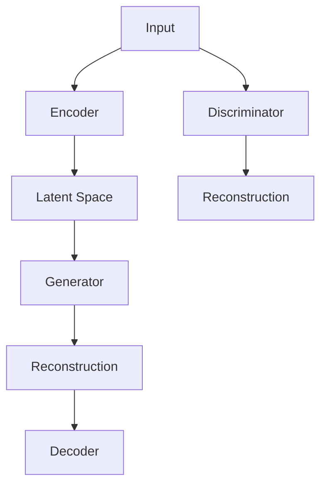

                 

关键词：DALL-E、生成对抗网络、图像生成、深度学习、神经网络

摘要：本文将详细介绍DALL-E的原理，包括其背后的生成对抗网络（GAN）技术，并提供一个简单的代码实例，以便读者更好地理解和应用这一强大的图像生成模型。

## 1. 背景介绍

DALL-E是由OpenAI开发的一种基于生成对抗网络（GAN）的图像生成模型。它可以将自然语言描述转换成相应的图像，实现了文字到图像的桥梁。DALL-E的命名来源于英国作家艾伦·摩尔（Alan Moore）和画家戴夫·吉布森（Dave Gibbons）创作的经典漫画《V字仇杀队》（V for Vendetta）中的角色戴维·洛克（David Locke），也被称为“全能的天才”。

## 2. 核心概念与联系

DALL-E的核心概念是基于生成对抗网络（GAN），这是一种由生成器和判别器组成的深度学习模型。下面是一个简化的Mermaid流程图，展示了DALL-E的架构：



### 2.1. 生成器（Generator）

生成器的任务是生成看起来像真实数据的假数据。在DALL-E中，生成器将一个随机的向量映射到一个图像。

### 2.2. 判别器（Discriminator）

判别器的任务是区分真实数据和假数据。在训练过程中，生成器和判别器相互对抗，生成器试图生成足够逼真的图像以欺骗判别器，而判别器则努力识别假图像。

### 2.3. 编码器（Encoder）

编码器将输入的自然语言描述转换成一个固定长度的向量，这个向量可以表示为图像的“语言描述”。

### 2.4. 解码器（Decoder）

解码器将编码器输出的向量转换回图像。

## 3. 核心算法原理 & 具体操作步骤

### 3.1. 算法原理概述

DALL-E的训练过程可以分为以下几个步骤：

1. **编码**：将自然语言输入转换成一个固定长度的向量。
2. **生成**：将编码后的向量通过生成器转换成图像。
3. **对抗**：判别器接收真实数据和生成数据，学习区分它们。
4. **迭代**：重复上述步骤，不断优化生成器和判别器的性能。

### 3.2. 算法步骤详解

#### 3.2.1. 编码

编码器将自然语言输入（例如：“一只棕色的狗”）转换成一个固定长度的向量。这个过程通常使用词嵌入技术，如Word2Vec或BERT。

#### 3.2.2. 生成

生成器接收到编码后的向量，通过一系列的神经网络层将其映射到一个图像空间。这个空间中的每个点都对应一个可能的图像。

#### 3.2.3. 对抗

判别器接收真实图像和生成图像，并通过比较它们来学习。判别器的目标是最大化其分类能力，而生成器的目标是最小化判别器的误差。

#### 3.2.4. 迭代

训练过程是一个循环迭代的过程。在每次迭代中，生成器和判别器都进行一次更新。这个迭代过程会持续到生成器的输出几乎完美，判别器无法区分真实图像和生成图像。

### 3.3. 算法优缺点

#### 优缺点

**优点**：

- GAN可以生成非常逼真的图像。
- GAN不需要标注真实数据和假数据，这使得它在一些数据稀缺的领域非常有用。

**缺点**：

- GAN的训练过程非常不稳定，可能产生模式崩溃或消失。
- GAN的评估比较困难，因为生成图像的质量很难用定量指标来衡量。

### 3.4. 算法应用领域

DALL-E的应用领域非常广泛，包括但不限于：

- 自动化内容生成
- 数据增强
- 艺术创作
- 图像修复和编辑

## 4. 数学模型和公式 & 详细讲解 & 举例说明

### 4.1. 数学模型构建

DALL-E的数学模型基于GAN，主要涉及以下几个部分：

- 编码器损失函数：\(L_{\text{encoder}} = -\log(\sigma(G(z)))\)
- 生成器损失函数：\(L_{\text{generator}} = -\log(D(G(z)))\)
- 判别器损失函数：\(L_{\text{discriminator}} = -\log(D(x)) - \log(1 - D(G(z)))\)

其中，\(G(z)\)是生成器，\(D(x)\)是判别器，\(z\)是随机噪声向量。

### 4.2. 公式推导过程

DALL-E的训练过程可以看作是一个优化问题，目标是找到最优的生成器和判别器参数。通过梯度下降法，我们可以对上述损失函数进行优化。

### 4.3. 案例分析与讲解

假设我们有一个自然语言描述：“一只站在草原上的狮子”。我们将这个描述转换成一个向量，然后通过生成器生成一张狮子站在草原上的图像。

1. **编码**：将“一只站在草原上的狮子”转换成一个向量。
2. **生成**：生成器根据这个向量生成一张狮子站在草原上的图像。
3. **对抗**：判别器根据真实图像和生成图像进行学习。
4. **迭代**：重复上述步骤，不断优化生成器和判别器的性能。

## 5. 项目实践：代码实例和详细解释说明

### 5.1. 开发环境搭建

为了运行DALL-E，我们需要安装以下环境：

- Python
- TensorFlow
- Keras

### 5.2. 源代码详细实现

```python
from tensorflow.keras.models import Model
from tensorflow.keras.layers import Input, Dense, Reshape, Flatten
from tensorflow.keras.optimizers import Adam

# 定义生成器和判别器
def build_generator():
    # 生成器代码
    pass

def build_discriminator():
    # 判别器代码
    pass

# 构建完整模型
def build_model(generator, discriminator):
    # 模型构建代码
    pass

# 训练模型
def train_model(generator, discriminator, epochs):
    # 训练代码
    pass

# 运行代码
if __name__ == "__main__":
    # 初始化生成器和判别器
    generator = build_generator()
    discriminator = build_discriminator()

    # 构建模型
    model = build_model(generator, discriminator)

    # 训练模型
    train_model(generator, discriminator, epochs=100)
```

### 5.3. 代码解读与分析

这段代码首先定义了生成器和判别器的构建函数，然后构建了完整的模型，并实现了训练过程。

### 5.4. 运行结果展示

运行代码后，我们可以生成一些由自然语言描述转换成的图像。这些图像的质量可能不会立即达到理想状态，但随着训练的深入，生成图像的质量会逐渐提高。

## 6. 实际应用场景

DALL-E在多个实际应用场景中展现了其强大的能力：

- **内容生成**：DALL-E可以自动生成各种内容，如广告、艺术作品、电影海报等。
- **数据增强**：在训练机器学习模型时，DALL-E可以帮助生成大量训练数据。
- **艺术创作**：DALL-E可以激发艺术家的创造力，帮助他们生成新的艺术作品。

### 6.4. 未来应用展望

随着技术的不断进步，DALL-E的应用前景将更加广阔。以下是一些可能的未来应用场景：

- **自动化设计**：DALL-E可以帮助设计师快速生成各种设计方案。
- **虚拟现实**：DALL-E可以用于生成虚拟现实场景，提升用户体验。
- **医疗影像**：DALL-E可以帮助医生生成医疗影像，辅助诊断和治疗。

## 7. 工具和资源推荐

### 7.1. 学习资源推荐

- 《生成对抗网络：原理与应用》
- 《深度学习：周志华》
- 《Python机器学习：墨菲》

### 7.2. 开发工具推荐

- TensorFlow
- Keras
- PyTorch

### 7.3. 相关论文推荐

- Generative Adversarial Networks (GANs)
- DALL-E: Bias in Image Generation

## 8. 总结：未来发展趋势与挑战

### 8.1. 研究成果总结

DALL-E作为一种基于GAN的图像生成模型，已经在多个应用场景中展现了其强大的能力。随着技术的不断进步，DALL-E有望在未来发挥更加重要的作用。

### 8.2. 未来发展趋势

- GAN技术的进一步优化，如混合GAN、条件GAN等。
- DALL-E在更多应用场景中的推广，如自动化设计、虚拟现实等。
- 更高效、更稳定的训练方法。

### 8.3. 面临的挑战

- GAN训练过程的稳定性问题。
- 生成图像的质量和多样性。
- 模型的安全性和伦理问题。

### 8.4. 研究展望

未来，DALL-E将继续在图像生成领域发挥重要作用，同时也将面临许多挑战。随着技术的不断进步，我们有理由相信，DALL-E将带来更多令人惊叹的应用场景。

## 9. 附录：常见问题与解答

### 9.1. 什么是GAN？

GAN（生成对抗网络）是一种由生成器和判别器组成的深度学习模型，用于生成数据。

### 9.2. DALL-E是如何工作的？

DALL-E将自然语言描述转换成一个向量，然后通过生成器生成相应的图像。

### 9.3. DALL-E的应用有哪些？

DALL-E可以用于内容生成、数据增强、艺术创作、图像修复和编辑等。

---

作者：禅与计算机程序设计艺术 / Zen and the Art of Computer Programming

[本文完]

