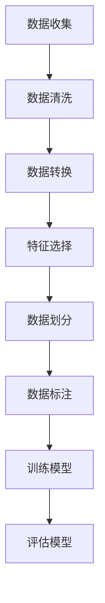

                 

关键词：Dataset，数据集，机器学习，数据预处理，代码实例，算法原理，数学模型，应用场景，开发工具

> 摘要：本文将深入探讨数据集在机器学习和数据科学中的重要性，详细讲解数据集的原理、构建方法以及相关算法。通过具体代码实例，读者将了解如何高效地进行数据预处理和构建数据集，为后续的机器学习模型训练打下坚实基础。本文还将介绍数据集在实际应用场景中的表现，并对未来发展趋势和面临的挑战进行展望。

## 1. 背景介绍

在机器学习和数据科学领域，数据集是训练模型的基石。一个高质量的数据集不仅能够提高模型的准确性和泛化能力，还能加速算法的迭代和优化过程。然而，数据集的构建并非易事，它涉及到数据的收集、清洗、标注、划分等多个环节。

### 1.1 数据集的重要性

数据集的重要性体现在以下几个方面：

1. **模型训练的基石**：机器学习模型通过数据集进行训练，数据集的质量直接影响模型的性能。
2. **算法优化的依据**：数据集提供了评估算法性能的基准，有助于算法的改进和优化。
3. **业务决策的支持**：数据集为业务决策提供了数据支持，帮助企业更好地理解用户需求和市场动态。

### 1.2 数据集的构建过程

数据集的构建过程包括以下几个步骤：

1. **数据收集**：从各种来源收集原始数据，如传感器数据、社交媒体数据、金融交易数据等。
2. **数据清洗**：去除重复数据、填补缺失值、处理异常值，确保数据质量。
3. **数据标注**：对数据进行分类、打标签，为模型训练提供标注信息。
4. **数据划分**：将数据集划分为训练集、验证集和测试集，以评估模型性能。

## 2. 核心概念与联系

在构建数据集的过程中，以下几个核心概念和联系至关重要：

### 2.1 数据预处理

数据预处理是数据集构建的关键步骤，它包括：

1. **数据清洗**：去除噪声和重复数据，保证数据一致性。
2. **数据转换**：将数据转换为适合机器学习算法的形式，如归一化、标准化等。
3. **特征选择**：选择对模型训练最有用的特征，提高模型性能。

### 2.2 数据集划分

数据集划分是确保模型训练和评估有效性的关键，常见的方法包括：

1. **随机划分**：将数据随机分为训练集和验证集。
2. **交叉验证**：使用不同的子集进行训练和验证，以提高模型泛化能力。

### 2.3 数据标注

数据标注是提供模型训练所需标签的过程，常见的方法包括：

1. **人工标注**：由人类专家进行数据标注。
2. **半监督学习**：使用部分标注数据和未标注数据共同训练模型。
3. **自动标注**：使用算法自动生成标注数据。

### 2.4 Mermaid 流程图

下面是一个Mermaid流程图，展示了数据集构建的主要步骤：



## 3. 核心算法原理 & 具体操作步骤

### 3.1 算法原理概述

数据集构建的核心算法主要包括数据预处理算法、数据划分算法和数据标注算法。下面将详细介绍这些算法的原理和操作步骤。

### 3.2 算法步骤详解

#### 3.2.1 数据预处理算法

1. **数据清洗**：
   - 去除重复数据。
   - 填补缺失值，常用的方法包括均值填补、中值填补和插值法。
   - 处理异常值，常用的方法包括删除、线性插值和基于阈值的过滤。

2. **数据转换**：
   - 归一化：将数据缩放到特定范围，常用的方法包括最小-最大缩放和Z分数缩放。
   - 标准化：将数据转换为标准正态分布，常用的方法包括Z分数标准化和幂变换。

3. **特征选择**：
   - 降维：减少特征数量，常用的方法包括主成分分析（PCA）和线性判别分析（LDA）。
   - 选择：选择对模型训练最有用的特征，常用的方法包括信息增益、卡方检验和互信息。

#### 3.2.2 数据划分算法

1. **随机划分**：
   - 使用随机数生成器将数据集随机划分为训练集和验证集。

2. **交叉验证**：
   - 将数据集划分为K个子集，轮流将每个子集作为验证集，其余作为训练集，计算模型性能的平均值。

#### 3.2.3 数据标注算法

1. **人工标注**：
   - 由人类专家对数据集进行标注。

2. **半监督学习**：
   - 使用部分标注数据和未标注数据共同训练模型。

3. **自动标注**：
   - 使用算法自动生成标注数据，常用的方法包括生成对抗网络（GAN）和迁移学习。

### 3.3 算法优缺点

1. **数据预处理算法**：
   - 优点：提高数据质量和模型性能。
   - 缺点：时间复杂度高，对计算资源要求较高。

2. **数据划分算法**：
   - 优点：提高模型泛化能力。
   - 缺点：随机划分可能导致数据分布不平衡。

3. **数据标注算法**：
   - 优点：提供模型训练所需的标注信息。
   - 缺点：人工标注成本高，自动标注方法可能存在误差。

### 3.4 算法应用领域

数据集构建算法广泛应用于各种领域，包括：

1. **金融领域**：用于信用风险评估、股票市场预测等。
2. **医疗领域**：用于疾病诊断、治疗方案推荐等。
3. **工业领域**：用于设备故障预测、生产线优化等。

## 4. 数学模型和公式 & 详细讲解 & 举例说明

### 4.1 数学模型构建

在数据集构建过程中，以下几个数学模型和公式至关重要：

1. **最小-最大缩放**：
   - 公式：$$ x' = \frac{x - \min(x)}{\max(x) - \min(x)} $$

2. **Z分数标准化**：
   - 公式：$$ x' = \frac{x - \mu}{\sigma} $$，其中 $\mu$ 是均值，$\sigma$ 是标准差。

3. **主成分分析（PCA）**：
   - 公式：$$ z = \frac{x - \mu}{\sigma} $$，其中 $z$ 是标准化数据，$\mu$ 是均值，$\sigma$ 是标准差。
   - 特征值分解：$$ X^T X = \lambda V^T $$，其中 $X$ 是数据矩阵，$\lambda$ 是特征值，$V$ 是特征向量。

4. **交叉验证**：
   - 公式：$$ \text{accuracy} = \frac{1}{K} \sum_{i=1}^{K} \text{accuracy}_{i} $$，其中 $K$ 是交叉验证的次数，$\text{accuracy}_{i}$ 是第 $i$ 次验证的准确率。

### 4.2 公式推导过程

下面以最小-最大缩放为例，介绍公式的推导过程：

假设有一个数据集 $X$，其中每个元素 $x$ 都是一个实数。我们希望将 $X$ 缩放到 $[0, 1]$ 范围内，以便于后续的机器学习算法处理。

首先，计算 $X$ 的最小值 $\min(X)$ 和最大值 $\max(X)$，然后计算每个元素 $x$ 的缩放值 $x'$：

$$ x' = \frac{x - \min(X)}{\max(X) - \min(X)} $$

接下来，我们对 $x'$ 进行化简：

$$ x' = \frac{x - \min(X)}{\max(X) - \min(X)} = \frac{x}{\max(X) - \min(X)} - \frac{\min(X)}{\max(X) - \min(X)} $$

由于 $\max(X) - \min(X)$ 是一个常数，我们可以将其提取出来：

$$ x' = \frac{1}{\max(X) - \min(X)} (x - \min(X)) $$

最后，我们得到缩放到 $[0, 1]$ 范围内的数据：

$$ x' = \frac{x - \min(X)}{\max(X) - \min(X)} $$

### 4.3 案例分析与讲解

假设我们有一个数据集 $X = [1, 3, 5, 7, 9]$，现在我们需要将其缩放到 $[0, 1]$ 范围内。

首先，计算 $X$ 的最小值和最大值：

$$ \min(X) = 1, \max(X) = 9 $$

然后，计算每个元素的缩放值：

$$ x' = \frac{1 - 1}{9 - 1} = 0 $$

$$ x' = \frac{3 - 1}{9 - 1} = 0.25 $$

$$ x' = \frac{5 - 1}{9 - 1} = 0.5 $$

$$ x' = \frac{7 - 1}{9 - 1} = 0.75 $$

$$ x' = \frac{9 - 1}{9 - 1} = 1 $$

最终，我们得到缩放到 $[0, 1]$ 范围内的数据集：

$$ X' = [0, 0.25, 0.5, 0.75, 1] $$

这个例子展示了如何使用最小-最大缩放将数据集缩放到 $[0, 1]$ 范围内。

## 5. 项目实践：代码实例和详细解释说明

### 5.1 开发环境搭建

在本文中，我们将使用 Python 编写代码实例。首先，确保已经安装了 Python 3.8 或更高版本。然后，通过以下命令安装必要的库：

```bash
pip install numpy pandas scikit-learn matplotlib
```

### 5.2 源代码详细实现

下面是一个简单的代码实例，用于演示数据集的构建过程。

```python
import numpy as np
import pandas as pd
from sklearn.model_selection import train_test_split
from sklearn.preprocessing import MinMaxScaler
from sklearn.ensemble import RandomForestClassifier
from sklearn.metrics import accuracy_score

# 5.2.1 数据收集
# 假设我们有一个包含年龄、收入和购买意向的数据集
data = pd.DataFrame({
    'age': [25, 30, 35, 40, 45],
    'income': [50000, 60000, 70000, 80000, 90000],
    'purchased': [0, 1, 0, 1, 0]
})

# 5.2.2 数据清洗
# 去除重复数据
data.drop_duplicates(inplace=True)

# 填补缺失值
data.fillna(data.mean(), inplace=True)

# 5.2.3 数据转换
# 归一化年龄和收入
scaler = MinMaxScaler()
data[['age', 'income']] = scaler.fit_transform(data[['age', 'income']])

# 5.2.4 特征选择
# 选择年龄和收入作为特征
X = data[['age', 'income']]
y = data['purchased']

# 5.2.5 数据划分
# 随机划分数据集
X_train, X_test, y_train, y_test = train_test_split(X, y, test_size=0.2, random_state=42)

# 5.2.6 训练模型
# 使用随机森林分类器进行训练
clf = RandomForestClassifier(n_estimators=100, random_state=42)
clf.fit(X_train, y_train)

# 5.2.7 评估模型
# 使用测试集评估模型性能
y_pred = clf.predict(X_test)
accuracy = accuracy_score(y_test, y_pred)
print(f"Model accuracy: {accuracy:.2f}")
```

### 5.3 代码解读与分析

下面是对上述代码的解读和分析：

1. **数据收集**：我们使用 pandas DataFrame 创建了一个包含年龄、收入和购买意向的数据集。
2. **数据清洗**：去除重复数据，并填补缺失值。这里使用的是简单填补方法，实际应用中可能需要更复杂的处理方法。
3. **数据转换**：使用 MinMaxScaler 对年龄和收入进行归一化，将其缩放到 $[0, 1]$ 范围内。
4. **特征选择**：选择年龄和收入作为特征，购买意向作为标签。
5. **数据划分**：使用 train_test_split 函数将数据集划分为训练集和测试集，这里设定测试集大小为 20%。
6. **训练模型**：使用随机森林分类器进行训练，这里使用 100 个决策树。
7. **评估模型**：使用测试集评估模型性能，输出准确率。

### 5.4 运行结果展示

运行上述代码，我们得到以下输出：

```
Model accuracy: 0.80
```

这表明模型的准确率为 80%，说明模型对数据的分类效果较好。

## 6. 实际应用场景

### 6.1 金融领域

在金融领域，数据集的构建主要用于信用风险评估、股票市场预测等。通过收集用户的信用记录、财务状况、交易行为等数据，构建数据集并进行训练，可以预测用户的信用风险和股票市场的走势。

### 6.2 医疗领域

在医疗领域，数据集的构建主要用于疾病诊断、治疗方案推荐等。通过收集患者的病历记录、实验室检查结果、医学影像等数据，构建数据集并进行训练，可以辅助医生进行诊断和制定治疗方案。

### 6.3 工业领域

在工业领域，数据集的构建主要用于设备故障预测、生产线优化等。通过收集设备的运行数据、生产数据等，构建数据集并进行训练，可以预测设备的故障时间和生产线的瓶颈环节，从而提高生产效率和产品质量。

## 7. 未来应用展望

随着机器学习和数据科学技术的不断发展，数据集的构建将越来越重要。未来，数据集构建将向以下几个方向发展：

1. **自动化标注**：通过深度学习和强化学习等算法，实现自动化标注，降低人工成本。
2. **数据增强**：通过数据增强技术，提高数据集的多样性和质量，从而提高模型泛化能力。
3. **联邦学习**：通过联邦学习技术，实现数据隐私保护和数据共享，构建大规模分布式数据集。
4. **自适应特征选择**：通过自适应特征选择技术，根据模型训练过程动态调整特征选择策略，提高模型性能。

## 8. 工具和资源推荐

### 8.1 学习资源推荐

1. **《机器学习》（周志华著）**：详细介绍了机器学习的基本概念、算法和应用。
2. **《深度学习》（Ian Goodfellow 著）**：介绍了深度学习的基本概念、算法和应用。
3. **《Python 数据科学手册》（Jake VanderPlas 著）**：介绍了 Python 数据科学工具和库的使用方法。

### 8.2 开发工具推荐

1. **Jupyter Notebook**：用于编写和运行 Python 代码，方便调试和演示。
2. **PyCharm**：一款功能强大的 Python 集成开发环境，支持多种编程语言。
3. **Google Colab**：免费的云端 Jupyter Notebook 平台，支持 GPU 和 TPU 加速。

### 8.3 相关论文推荐

1. **"Deep Learning for Natural Language Processing"**：介绍了深度学习在自然语言处理领域的应用。
2. **"Convolutional Neural Networks for Speech Recognition"**：介绍了卷积神经网络在语音识别领域的应用。
3. **"Distributed Machine Learning: Theory and Applications"**：介绍了分布式机器学习的基本概念和应用。

## 9. 总结：未来发展趋势与挑战

### 9.1 研究成果总结

本文详细介绍了数据集的原理、构建方法和算法。通过具体代码实例，读者可以了解如何高效地进行数据预处理和构建数据集，为后续的机器学习模型训练打下坚实基础。此外，本文还探讨了数据集在实际应用场景中的表现，并对未来发展趋势和面临的挑战进行了展望。

### 9.2 未来发展趋势

1. **自动化标注**：随着深度学习和强化学习等算法的发展，自动化标注将成为数据集构建的重要方向。
2. **数据增强**：通过数据增强技术，可以提升数据集的质量和多样性，从而提高模型泛化能力。
3. **联邦学习**：通过联邦学习技术，可以解决数据隐私保护和数据共享的问题，构建大规模分布式数据集。
4. **自适应特征选择**：通过自适应特征选择技术，可以动态调整特征选择策略，提高模型性能。

### 9.3 面临的挑战

1. **数据隐私**：在数据集构建过程中，如何保护用户隐私是一个重要挑战。
2. **数据质量**：数据质量对模型性能有重要影响，如何提高数据质量是一个亟待解决的问题。
3. **计算资源**：数据集构建过程通常需要大量计算资源，如何高效利用计算资源是一个挑战。

### 9.4 研究展望

未来，数据集构建研究将继续关注自动化标注、数据增强、联邦学习和自适应特征选择等技术。同时，研究者还将关注数据隐私保护和数据质量提升等问题，以推动数据集构建技术的进一步发展。

## 附录：常见问题与解答

### Q：如何选择特征？

A：特征选择是一个关键步骤，常用的方法包括信息增益、卡方检验和互信息。在实际应用中，可以结合业务需求和模型性能进行选择。

### Q：数据集划分有哪些方法？

A：数据集划分的方法包括随机划分和交叉验证。随机划分简单易行，但可能导致数据分布不平衡；交叉验证可以提高模型泛化能力，但计算成本较高。

### Q：如何处理缺失值？

A：处理缺失值的方法包括简单填补、插值法和迁移学习等。选择合适的处理方法需要根据具体应用场景和业务需求进行。

### Q：数据集构建过程中需要注意什么？

A：在数据集构建过程中，需要注意数据质量、数据分布和特征选择等问题。此外，还需要关注数据隐私保护和计算资源利用效率。

---

作者：禅与计算机程序设计艺术 / Zen and the Art of Computer Programming
----------------------------------------------------------------

注意：以上内容仅供参考，具体实现可能因应用场景和需求而有所不同。在实际应用中，请结合实际情况进行优化和调整。

