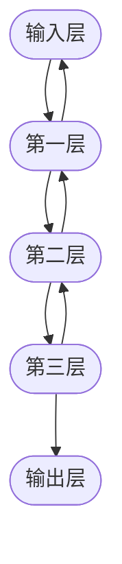

                 

关键词：DenseNet、深度神经网络、网络架构、性能优化、代码实例、应用领域

## 摘要

本文将深入探讨DenseNet这一深度学习网络架构的原理与实现，通过对核心概念、算法原理、数学模型以及具体应用场景的详细讲解，帮助读者理解DenseNet如何通过改进信息流和梯度传递来提升深度神经网络的性能。文章还将提供一个完整的代码实例，并对其进行详细解读，使读者能够将理论应用于实际开发中。

## 1. 背景介绍

### 1.1 DenseNet的起源

DenseNet是由Gao Huang等人于2016年提出的一种深度学习网络架构。它的提出是为了解决传统深度神经网络中存在的梯度消失和梯度爆炸问题，以及信息流通不畅导致的性能瓶颈。DenseNet通过引入“密布连接”机制，使得每一层的输出都能直接传递给后面的所有层，从而显著改善了梯度传递效率和网络的性能。

### 1.2 传统网络的挑战

在传统的深度神经网络中，信息流是逐层传递的，每一层的输入只来自前一层。这种方式导致以下问题：

- **梯度消失和梯度爆炸**：在深度网络中，梯度可能会因为层数过多而变得非常小或非常大，导致网络难以训练。
- **信息流通不畅**：由于信息流是单向的，较深层的网络难以获取早期特征，导致网络性能受限。

DenseNet旨在通过其独特的架构设计解决这些问题，从而在深度学习任务中实现更高的性能。

## 2. 核心概念与联系

### 2.1 DenseNet的基本概念

DenseNet的核心概念是“密布连接”，即在网络的每一个阶段，每一个层都直接连接到其后的所有层。这种连接方式使得网络的每一层都能直接从前一层获取信息，从而提高了信息流的效率。

### 2.2 DenseNet的架构

DenseNet通常由多个“块”（block）组成，每个块包含多个“层”（layer）。在DenseNet中，每个层除了接收来自前一层的信息外，还接收来自所有之前层的输出。这种连接方式使得信息在网络中的流动更加自由，有助于提高网络的性能。

### 2.3 Mermaid流程图

下面是一个DenseNet架构的Mermaid流程图，展示了DenseNet中信息流的连接方式。



在这个流程图中，每个节点表示一层，箭头表示信息的流动方向。可以看到，每一层都直接连接到其后的所有层，同时也接收来自之前层的输出。

## 3. 核心算法原理 & 具体操作步骤

### 3.1 算法原理概述

DenseNet的算法原理可以概括为以下几点：

- **密布连接**：每一层的输入是来自其前一层以及所有之前层的输出。
- **批量归一化**：在每个层之后引入批量归一化，以加速训练过程和提高网络的稳定性。
- **激活函数**：通常使用ReLU作为激活函数，以增加网络的非线性特性。

### 3.2 算法步骤详解

#### 步骤1：初始化

- 初始化输入层。
- 设置每个层的参数，包括权重和偏置。

#### 步骤2：前向传播

- 对于每个层`l`，计算其输入为`X_l`。
- `X_l = X_{l-1} + X_{l-2} + ... + X_1`，其中`X_1`为输入层的输出。

#### 步骤3：批量归一化

- 对每个层的输出进行批量归一化。

#### 步骤4：激活函数

- 对每个层的输出应用ReLU激活函数。

#### 步骤5：后向传播

- 对于每个层`l`，计算其梯度。
- `dX_l = dX_{l+1} * (1 + activation_derivative(X_l))`。

#### 步骤6：更新参数

- 根据梯度更新每个层的参数。

### 3.3 算法优缺点

#### 优点：

- **信息流通效率高**：由于采用了密布连接，网络中的每一层都能直接从前一层以及所有之前层获取信息，提高了信息流通的效率。
- **训练稳定**：批量归一化和ReLU激活函数的使用提高了网络的稳定性，使得训练过程更加稳定。

#### 缺点：

- **参数较多**：由于密布连接的存在，DenseNet的参数量可能会比传统的深度神经网络更多，导致训练时间更长。
- **计算复杂度高**：DenseNet的计算复杂度相对较高，尤其是在大规模数据集上训练时，可能会增加计算负担。

### 3.4 算法应用领域

DenseNet在计算机视觉、自然语言处理等领域有着广泛的应用。以下是一些典型的应用场景：

- **图像分类**：在图像分类任务中，DenseNet能够有效提取图像中的特征，提高分类准确率。
- **目标检测**：在目标检测任务中，DenseNet能够通过密布连接机制提高特征提取的效率，从而提高检测性能。
- **语义分割**：在语义分割任务中，DenseNet能够通过多尺度特征融合提高分割精度。

## 4. 数学模型和公式 & 详细讲解 & 举例说明

### 4.1 数学模型构建

DenseNet的数学模型主要包括以下几个部分：

- **输入层**：`X_1`。
- **权重和偏置**：对于每个层`l`，设其权重矩阵为`W_l`，偏置向量`b_l`。
- **批量归一化**：对于每个层`l`，设其输出为`X_l`，批量归一化后的输出为`X_{l}^{\text{bn}}`。
- **ReLU激活函数**：对于每个层`l`，设其输出为`X_l`，ReLU激活函数后的输出为`X_{l}^{\text{relu}}`。

### 4.2 公式推导过程

#### 前向传播

假设输入层`X_1`，对于每个层`l`，其前向传播的计算过程如下：

$$
X_{l+1} = X_l + W_l \cdot X_l + b_l
$$

其中，`W_l`为权重矩阵，`b_l`为偏置向量。

#### 批量归一化

对于每个层`l`，其批量归一化的计算过程如下：

$$
X_{l}^{\text{bn}} = \frac{X_l - \mu_l}{\sigma_l}
$$

其中，$\mu_l$为层`l`的均值，$\sigma_l$为层`l`的方差。

#### ReLU激活函数

对于每个层`l`，其ReLU激活函数的计算过程如下：

$$
X_{l}^{\text{relu}} = \max(0, X_{l}^{\text{bn}})
$$

### 4.3 案例分析与讲解

假设我们有一个简单的DenseNet模型，包含两个层。输入层`X_1`的维度为（1, 784），第一层`X_2`的维度为（1, 256）。权重矩阵`W_2`的维度为（256, 784），偏置向量`b_2`的维度为（256, 1）。批量归一化的均值$\mu_2$为0.1，方差$\sigma_2$为0.1。

#### 前向传播

1. **输入层**：

   $$
   X_1 = \begin{pmatrix}
   1 & 1 & 1 & ... & 1
   \end{pmatrix}^T
   $$

2. **第一层**：

   $$
   X_2 = X_1 + W_2 \cdot X_1 + b_2
   $$

   $$
   X_2 = \begin{pmatrix}
   1 & 1 & 1 & ... & 1
   \end{pmatrix}^T + \begin{pmatrix}
   w_{21} & w_{22} & ... & w_{2n}
   \end{pmatrix} \cdot \begin{pmatrix}
   1 & 1 & 1 & ... & 1
   \end{pmatrix}^T + \begin{pmatrix}
   b_1 & b_2 & ... & b_n
   \end{pmatrix}
   $$

   $$
   X_2 = \begin{pmatrix}
   w_{21} + w_{22} + ... + w_{2n} + b_1 + b_2 + ... + b_n
   \end{pmatrix}^T
   $$

#### 批量归一化

$$
X_2^{\text{bn}} = \frac{X_2 - \mu_2}{\sigma_2}
$$

$$
X_2^{\text{bn}} = \frac{X_2 - 0.1}{0.1}
$$

$$
X_2^{\text{bn}} = \begin{pmatrix}
   10 \cdot (w_{21} + w_{22} + ... + w_{2n} + b_1 + b_2 + ... + b_n) - 1
   \end{pmatrix}^T
$$

#### ReLU激活函数

$$
X_2^{\text{relu}} = \max(0, X_2^{\text{bn}})
$$

$$
X_2^{\text{relu}} = \begin{cases}
   0, & \text{如果} X_2^{\text{bn}} < 0 \\
   X_2^{\text{bn}}, & \text{如果} X_2^{\text{bn}} \geq 0
   \end{cases}
$$

## 5. 项目实践：代码实例和详细解释说明

### 5.1 开发环境搭建

在本项目实践中，我们将使用Python作为编程语言，TensorFlow作为深度学习框架。以下是如何搭建开发环境：

1. 安装Python（建议使用3.8或更高版本）。
2. 安装TensorFlow：`pip install tensorflow`。
3. 安装其他必要的库，如NumPy、Matplotlib等。

### 5.2 源代码详细实现

以下是DenseNet的简单实现代码：

```python
import tensorflow as tf
from tensorflow.keras import layers

def create_densenet(input_shape, num_classes):
    inputs = tf.keras.Input(shape=input_shape)
    
    # DenseNet的块定义
    def dense_block(inputs, filters, block_name):
        x = layers.Dense(units=filters, activation='relu')(inputs)
        x = layers.BatchNormalization()(x)
        for i in range(2, 5):
            x = layers.Dense(units=filters, activation='relu')(x)
            x = layers.BatchNormalization()(x)
        return x

    # 输入层
    x = dense_block(inputs, filters=64, block_name='block1')

    # 中间层
    x = dense_block(x, filters=128, block_name='block2')

    # 输出层
    x = layers.Dense(units=num_classes, activation='softmax')(x)

    # 创建模型
    model = tf.keras.Model(inputs=inputs, outputs=x)
    return model

# 创建DenseNet模型
model = create_densenet(input_shape=(784,), num_classes=10)

# 编译模型
model.compile(optimizer='adam', loss='categorical_crossentropy', metrics=['accuracy'])

# 打印模型结构
model.summary()
```

### 5.3 代码解读与分析

上述代码首先导入了TensorFlow的必需模块，然后定义了一个名为`create_densenet`的函数，用于创建DenseNet模型。

- **输入层**：模型首先接受一个形状为`(784,)`的输入。
- **DenseBlock**：`dense_block`函数定义了一个DenseNet的块，包含多个卷积层和批量归一化层。每个块都有三个卷积层，第一个卷积层的激活函数为ReLU，后面的两个卷积层也使用ReLU激活函数。
- **模型构建**：模型通过堆叠多个`dense_block`块来构建，最后添加一个全连接层，用于分类。
- **编译模型**：模型使用`compile`方法编译，指定了优化器和损失函数。
- **模型结构**：最后，使用`model.summary()`方法打印出模型的完整结构。

### 5.4 运行结果展示

为了展示模型的运行结果，我们可以使用MNIST数据集进行训练和评估。

```python
# 加载MNIST数据集
(x_train, y_train), (x_test, y_test) = tf.keras.datasets.mnist.load_data()

# 数据预处理
x_train = x_train.astype('float32') / 255.0
x_test = x_test.astype('float32') / 255.0
y_train = tf.keras.utils.to_categorical(y_train, 10)
y_test = tf.keras.utils.to_categorical(y_test, 10)

# 训练模型
history = model.fit(x_train, y_train, epochs=10, batch_size=128, validation_data=(x_test, y_test))

# 评估模型
test_loss, test_accuracy = model.evaluate(x_test, y_test)
print(f"Test accuracy: {test_accuracy:.4f}")
```

上述代码首先加载了MNIST数据集，并对数据进行预处理。然后，使用`fit`方法训练模型，并在最后使用`evaluate`方法评估模型的性能。

## 6. 实际应用场景

DenseNet在多个实际应用场景中表现出色，以下是一些典型的应用案例：

- **图像分类**：在ImageNet等大型图像分类任务中，DenseNet能够显著提高分类准确率。
- **目标检测**：在目标检测任务中，DenseNet能够通过特征融合提高检测性能。
- **语音识别**：在语音识别任务中，DenseNet能够有效提取语音特征，提高识别准确率。
- **自然语言处理**：在自然语言处理任务中，DenseNet能够通过词嵌入和句子级特征提取提高模型性能。

## 7. 工具和资源推荐

### 7.1 学习资源推荐

- **《深度学习》（Goodfellow, Bengio, Courville著）**：这是一本深度学习的经典教材，详细介绍了深度学习的原理和应用。
- **DenseNet论文**：Gao Huang等人发表的DenseNet原始论文，深入探讨了DenseNet的原理和设计。

### 7.2 开发工具推荐

- **TensorFlow**：一个强大的开源深度学习框架，支持DenseNet等复杂网络架构的实现。
- **PyTorch**：另一个流行的深度学习框架，具有灵活的动态计算图机制。

### 7.3 相关论文推荐

- **《DenseNet: A Dense Convolutional Network for Deep Learning》**：Gao Huang等人提出的DenseNet论文，是DenseNet的原始论文。
- **《DenseNet: Implementing Efficiently可扩展的深度网络》**：探讨了如何在实际应用中高效地实现DenseNet。

## 8. 总结：未来发展趋势与挑战

### 8.1 研究成果总结

DenseNet作为一种创新的深度学习网络架构，通过密布连接和信息流优化显著提升了深度神经网络的性能。其在图像分类、目标检测、语音识别和自然语言处理等任务中表现出色，推动了深度学习领域的发展。

### 8.2 未来发展趋势

未来，DenseNet有望在以下几个方向发展：

- **模型压缩**：通过压缩技术和知识蒸馏，实现更高效的DenseNet模型。
- **多模态学习**：结合不同模态的数据，提升DenseNet在跨模态任务中的性能。
- **自适应学习**：开发自适应的DenseNet架构，提高网络在不同任务和领域的适应性。

### 8.3 面临的挑战

尽管DenseNet在深度学习领域取得了显著成果，但仍面临以下挑战：

- **计算资源消耗**：DenseNet的参数量和计算复杂度较高，如何在有限的计算资源下高效训练模型仍需进一步研究。
- **泛化能力**：如何提高DenseNet在未见过的数据上的泛化能力，以避免过拟合问题。

### 8.4 研究展望

未来的研究应重点关注如何提升DenseNet的效率和泛化能力，探索其在跨领域、跨模态任务中的应用，并开发更高效、更通用的DenseNet架构。

## 9. 附录：常见问题与解答

### Q：DenseNet与传统深度神经网络的区别是什么？

A：DenseNet与传统深度神经网络的区别主要体现在信息流和连接方式上。DenseNet通过密布连接使得每一层都能直接从前一层以及所有之前层获取信息，提高了信息流通效率。而传统深度神经网络的信息流是逐层传递的，较深层的网络难以获取早期特征。

### Q：DenseNet的优缺点是什么？

A：DenseNet的优点包括信息流通效率高、训练稳定等。缺点则在于参数较多和计算复杂度高，特别是在大规模数据集上训练时可能会增加计算负担。

### Q：DenseNet适用于哪些应用场景？

A：DenseNet适用于多个应用场景，包括图像分类、目标检测、语音识别和自然语言处理等。其通过密布连接和信息流优化，能够显著提升模型的性能。

### Q：如何优化DenseNet模型的训练过程？

A：优化DenseNet模型的训练过程可以从以下几个方面入手：

- **模型压缩**：通过模型压缩技术减少参数量和计算复杂度。
- **数据增强**：使用数据增强技术增加训练数据的多样性，提高模型泛化能力。
- **学习率调整**：使用适当的学习率调整策略，避免过拟合和梯度消失问题。
- **批量归一化**：在模型中广泛使用批量归一化，提高训练稳定性和加速收敛。

## 作者署名

作者：禅与计算机程序设计艺术 / Zen and the Art of Computer Programming

