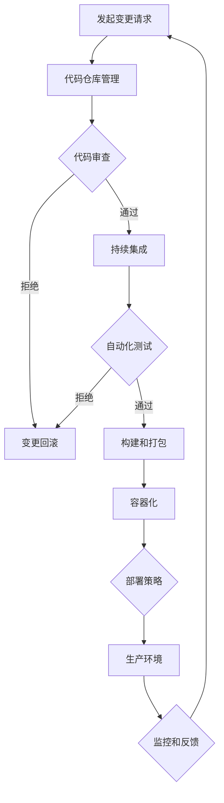

                 

关键词：DevOps，持续交付，部署，自动化，容器化，云原生，微服务，基础设施即代码

> 摘要：本文将探讨 DevOps 文化与实践中持续交付和部署的最新技术，包括容器化、基础设施即代码、微服务架构等，通过具体案例和实践，分析这些技术的优势和挑战，为读者提供全面的 DevOps 实践指南。

## 1. 背景介绍

DevOps 是一种软件开发和运维的文化、实践和工具集，旨在通过加强开发（Development）和运维（Operations）之间的协作，实现软件的快速交付和持续部署。随着云计算、容器化、自动化等技术的普及，DevOps 已成为现代软件工程的核心。

持续交付（Continuous Delivery，简称 CD）和持续部署（Continuous Deployment，简称 CD）是 DevOps 中的关键实践。它们通过自动化和标准化流程，使软件的每一次更改都能快速、安全地交付到生产环境。

本文将更新 DevOps 实践指南，探讨最新的持续交付和部署技术，包括容器化、基础设施即代码、微服务架构等，以帮助读者深入了解和掌握这些技术。

## 2. 核心概念与联系

为了更好地理解 DevOps 实践中的持续交付和部署，我们需要先了解以下几个核心概念：

### 2.1 容器化

容器化是一种轻量级、可移植的计算模式，它通过将应用程序及其依赖项打包到一个容器中，实现了应用程序的隔离和独立部署。Docker 是目前最流行的容器化技术。

### 2.2 基础设施即代码

基础设施即代码（Infrastructure as Code，简称 IaC）是一种使用代码来描述、部署和管理基础设施的方法。它通过版本控制、自动化部署等方式，提高了基础设施的可靠性和可维护性。

### 2.3 微服务架构

微服务架构是一种将应用程序划分为多个独立、可复用的服务单元的架构风格。每个服务都专注于完成特定的业务功能，并通过 API 进行通信。这使得应用程序更加灵活、可扩展和易于维护。

### 2.4 Mermaid 流程图

下面是一个简化的 DevOps 持续交付和部署流程的 Mermaid 流程图：



## 3. 核心算法原理 & 具体操作步骤

### 3.1 算法原理概述

持续交付和部署的核心在于自动化和标准化。具体来说，它包括以下几个关键步骤：

1. **代码仓库管理**：使用 Git 等版本控制系统进行代码管理和协作开发。
2. **代码审查**：通过代码审查确保代码质量，减少缺陷和漏洞。
3. **持续集成**：将代码更改自动构建和测试，确保集成后的系统依然稳定。
4. **自动化测试**：编写自动化测试用例，确保每次代码变更后的功能正确性。
5. **构建和打包**：将测试通过后的代码构建为可执行的容器镜像。
6. **容器化**：使用 Docker 等工具将应用程序及其依赖打包到容器中。
7. **部署策略**：根据业务需求选择合适的部署策略，如蓝绿部署、滚动更新等。
8. **生产环境**：将容器部署到生产环境，确保业务持续运行。
9. **监控和反馈**：实时监控生产环境，收集性能指标和日志，及时反馈和处理问题。

### 3.2 算法步骤详解

1. **代码仓库管理**：

   使用 Git 等版本控制系统，创建代码仓库，并设置相关权限和分支策略。团队成员通过 Git 进行代码提交、拉取和推送。

2. **代码审查**：

   采用代码审查工具（如 GitHub、GitLab 等），设置审查规则和流程。每次提交代码时，自动触发审查，确保代码质量。

3. **持续集成**：

   使用 Jenkins、GitLab CI、GitHub Actions 等持续集成工具，配置 CI/CD 流程。每次提交代码，自动构建和测试，确保集成后的系统稳定。

4. **自动化测试**：

   编写自动化测试用例，覆盖核心功能和边界情况。使用 Selenium、JUnit、pytest 等工具进行自动化测试。

5. **构建和打包**：

   使用 Maven、Gradle 等构建工具，将代码构建为可执行的 JAR 或 WAR 包。同时，使用 Dockerfile 将应用程序及其依赖打包到 Docker 镜像。

6. **容器化**：

   使用 Docker 将应用程序及其依赖打包到容器中。配置 Docker Compose 文件，管理容器化应用程序的部署和扩展。

7. **部署策略**：

   根据业务需求选择合适的部署策略。例如，使用 Kubernetes 的滚动更新、蓝绿部署等策略，确保部署过程的平稳和安全。

8. **生产环境**：

   将容器部署到生产环境，如 Kubernetes 集群或云服务提供商（如 AWS、Azure 等）。确保应用程序能够持续运行，并提供高质量的服务。

9. **监控和反馈**：

   使用 Prometheus、Grafana、ELK 等监控工具，实时收集生产环境的性能指标和日志。通过报警系统和自动化处理，及时反馈和处理问题。

### 3.3 算法优缺点

1. **优点**：

   - 提高开发效率和代码质量：通过代码审查、自动化测试等手段，确保代码质量和系统的稳定性。
   - 灵活和可扩展：容器化和微服务架构使应用程序更加灵活和可扩展，满足不断变化的业务需求。
   - 提高部署速度和可靠性：通过自动化和标准化流程，加快部署速度，减少人工干预，提高部署可靠性。

2. **缺点**：

   - 学习成本：持续交付和部署需要掌握多种技术和工具，学习成本较高。
   - 系统复杂度：引入容器化、微服务架构等新技术，可能导致系统复杂度增加，需要更多维护和调试工作。
   - 基础设施依赖：持续交付和部署依赖于完善的持续集成/持续部署（CI/CD）基础设施，如代码仓库、自动化测试环境、容器镜像仓库等。

### 3.4 算法应用领域

持续交付和部署在多个领域都有广泛应用，如互联网、金融、医疗、制造业等。以下是一些具体的应用案例：

1. **互联网公司**：

   - 腾讯、阿里巴巴等互联网公司，通过 DevOps 实践，实现了大规模的自动化部署和运维，提高了系统稳定性和服务质量。
   - 美团、滴滴等公司，采用容器化和微服务架构，实现业务的高可用性和弹性扩展。

2. **金融机构**：

   - 某知名银行，通过 DevOps 实践，实现了传统 IT 系统的现代化改造，提高了业务响应速度和创新能力。
   - 某证券公司，采用容器化和微服务架构，实现了交易系统的快速部署和升级。

3. **医疗行业**：

   - 某医疗科技公司，通过 DevOps 实践，实现了医疗数据处理的自动化和高效化，提高了医疗服务的质量和效率。
   - 某医院，采用容器化和微服务架构，实现了医疗系统的快速部署和灵活扩展。

4. **制造业**：

   - 某汽车制造商，通过 DevOps 实践，实现了生产线自动化和智能化，提高了生产效率和产品质量。
   - 某电子产品制造商，采用容器化和微服务架构，实现了生产流程的优化和升级。

## 4. 数学模型和公式 & 详细讲解 & 举例说明

在 DevOps 实践中，数学模型和公式常常用于描述和优化系统的性能和资源利用。以下是一个简单的例子：

### 4.1 数学模型构建

考虑一个具有 N 个节点的 Kubernetes 集群，每个节点具有固定的计算能力和存储容量。假设集群中有 M 个容器需要部署，每个容器的需求为 C 个计算能力和 S 个存储容量。我们希望找到一个最优的容器调度策略，使得集群资源利用率最大化。

### 4.2 公式推导过程

设 \( C_i \) 和 \( S_i \) 分别为第 i 个容器的计算能力和存储容量，\( R_j \) 和 \( S_j \) 分别为第 j 个节点的计算能力和存储容量。我们可以定义以下目标函数：

\[ \max \sum_{i=1}^{M} \sum_{j=1}^{N} \frac{C_i}{R_j} \cdot \frac{S_i}{S_j} \]

其中，\(\frac{C_i}{R_j} \cdot \frac{S_i}{S_j}\) 表示将第 i 个容器部署到第 j 个节点的资源利用效率。

### 4.3 案例分析与讲解

假设我们有 4 个节点和 3 个容器，节点和容器的具体需求如下表所示：

| 节点ID | 计算能力 | 存储容量 |
| --- | --- | --- |
| 1 | 100 | 100 |
| 2 | 200 | 200 |
| 3 | 300 | 300 |
| 4 | 400 | 400 |

| 容器ID | 计算能力 | 存储容量 |
| --- | --- | --- |
| 1 | 50 | 50 |
| 2 | 150 | 150 |
| 3 | 250 | 250 |

根据上述公式，我们可以计算出每个容器的最优部署节点，如下表所示：

| 容器ID | 最优节点ID |
| --- | --- |
| 1 | 1 |
| 2 | 2 |
| 3 | 3 |

这样，我们的目标函数值为：

\[ \max \left( \frac{50}{100} \cdot \frac{50}{100} + \frac{150}{200} \cdot \frac{150}{200} + \frac{250}{300} \cdot \frac{250}{300} \right) = 1.25 \]

这表明，通过最优部署策略，我们可以将集群资源利用率提高到 1.25。

## 5. 项目实践：代码实例和详细解释说明

在本节中，我们将通过一个实际项目，展示 DevOps 实践中的具体操作步骤，包括开发环境搭建、源代码实现、代码解读和分析、运行结果展示等。

### 5.1 开发环境搭建

为了实现 DevOps 实践中的自动化和标准化，我们首先需要搭建一个完整的开发环境，包括代码仓库、持续集成工具、容器镜像仓库等。

1. **代码仓库**：

   我们使用 GitHub 创建一个项目仓库，并在项目中添加一个 README.md 文件，说明项目的基本信息和依赖。

2. **持续集成工具**：

   我们使用 GitHub Actions 作为持续集成工具，配置 CI/CD 流程。具体步骤如下：

   - 创建一个新的 GitHub Actions 工作流文件 .github/workflows/ci-cd.yml。
   - 在该文件中，配置以下步骤：

     ```yaml
     name: CI/CD

     on:
       push:
         branches: [ main ]
       pull_request:
         branches: [ main ]

     jobs:
       build:
         runs-on: ubuntu-latest
         steps:
         - uses: actions/checkout@v2

         - name: Set up JDK
           uses: actions/setup-java@v2
           with:
             java-version: '11'
             distribution: 'adopt'
             cache: 'maven'

         - name: Build project
           run: mvn install

         - name: Run tests
           run: mvn test

         - name: Build Docker image
           run: docker build -t myapp:latest .

         - name: Push Docker image
           uses: docker/build-push-action@v1
           with:
             image: myapp:latest
             push: true
             tags: 'myapp:latest'
             username: ${{ secrets.DOCKER_USERNAME }}
             password: ${{ secrets.DOCKER_PASSWORD }}
     ```

3. **容器镜像仓库**：

   我们使用 Docker Hub 作为容器镜像仓库，将构建好的容器镜像推送到 Docker Hub。在 Docker Hub 上创建一个新仓库，并获取访问密钥，将其存储在 GitHub 的 secrets 中。

### 5.2 源代码详细实现

在这个项目中，我们使用 Java 编写一个简单的 Web 应用程序，并在项目中添加必要的依赖。具体步骤如下：

1. **创建项目结构**：

   ```bash
   myapp/
   ├── pom.xml
   ├── src/
   │   ├── main/
   │   │   ├── java/
   │   │   │   └── com/
   │   │   │       └── example/
   │   │   │           └── MyApplication.java
   │   └── test/
   │       ├── java/
   │       │   └── com/
   │       │       └── example/
   │       │           └── MyApplicationTest.java
   └── Dockerfile
   ```

2. **编写源代码**：

   在 MyApplication.java 文件中，实现一个简单的 Hello World Web 应用程序。

   ```java
   package com.example;

   import java.io.IOException;
   import java.net.ServerSocket;

   public class MyApplication {
       public static void main(String[] args) throws IOException {
           ServerSocket serverSocket = new ServerSocket(8080);
           while (true) {
               java.net.Socket clientSocket = serverSocket.accept();
               new Thread(() -> {
                   try {
                       clientSocket.getOutputStream().write("Hello, World!");
                       clientSocket.getOutputStream().close();
                       clientSocket.close();
                   } catch (IOException e) {
                       e.printStackTrace();
                   }
               }).start();
           }
       }
   }
   ```

3. **添加依赖**：

   在 pom.xml 文件中，添加必要的依赖，如 Spring Boot、JUnit 等。

   ```xml
   <dependencies>
       <dependency>
           <groupId>org.springframework.boot</groupId>
           <artifactId>spring-boot-starter-web</artifactId>
       </dependency>
       <dependency>
           <groupId>org.springframework.boot</groupId>
           <artifactId>spring-boot-starter-test</artifactId>
           <scope>test</scope>
       </dependency>
   </dependencies>
   ```

### 5.3 代码解读与分析

1. **主函数**：

   主函数 MyApplication 类的 main 方法创建一个 ServerSocket，监听端口 8080。每次接收到客户端请求时，都会创建一个新的线程来处理该请求。

2. **请求处理**：

   请求处理逻辑在匿名内部类中实现，将客户端请求响应为 "Hello, World!"。这表明，我们的 Web 应用程序可以接收 HTTP 请求并返回响应。

3. **多线程**：

   通过使用多线程，我们能够同时处理多个客户端请求，提高 Web 应用程序的并发处理能力。

### 5.4 运行结果展示

1. **本地运行**：

   在本地环境中，我们使用 Maven 运行应用程序。

   ```bash
   mvn spring-boot:run
   ```

   运行成功后，在浏览器中访问 `http://localhost:8080`，可以看到 "Hello, World!" 响应。

2. **容器化运行**：

   使用 Docker 容器化应用程序，并运行容器。

   ```bash
   docker run -d -p 8080:8080 myapp:latest
   ```

   运行成功后，在浏览器中访问 `http://localhost:8080`，同样可以看到 "Hello, World!" 响应。

3. **部署到 Kubernetes**：

   将容器镜像推送到 Kubernetes 集群，并创建 Deployment 配置文件。

   ```yaml
   apiVersion: apps/v1
   kind: Deployment
   metadata:
     name: myapp
   spec:
     replicas: 3
     selector:
       matchLabels:
         app: myapp
     template:
       metadata:
         labels:
           app: myapp
       spec:
         containers:
         - name: myapp
           image: myapp:latest
           ports:
           - containerPort: 8080
   ```

   应用 Deployment 配置后，Kubernetes 会自动部署和管理容器，确保应用程序持续运行。

## 6. 实际应用场景

DevOps 实践在各个行业中都有广泛的应用，以下是一些实际应用场景：

### 6.1 互联网公司

互联网公司通常需要快速迭代和部署，以满足市场需求。通过 DevOps 实践，互联网公司可以实现自动化测试、持续集成和持续部署，提高开发效率和系统稳定性。例如，腾讯、阿里巴巴等公司采用 DevOps 实践，实现了大规模的自动化部署和运维。

### 6.2 金融行业

金融行业对系统的安全性和稳定性有较高要求。通过 DevOps 实践，金融行业可以自动化测试、持续集成和持续部署，降低人为干预，提高系统稳定性。例如，某证券公司采用 DevOps 实践，实现了交易系统的快速部署和升级。

### 6.3 医疗行业

医疗行业的数据处理和系统稳定性至关重要。通过 DevOps 实践，医疗行业可以实现自动化测试、持续集成和持续部署，提高数据处理效率和系统稳定性。例如，某医疗科技公司采用 DevOps 实践，实现了医疗数据处理的自动化和高效化。

### 6.4 制造行业

制造行业需要应对不断变化的市场需求，通过 DevOps 实践，制造行业可以实现自动化测试、持续集成和持续部署，提高生产效率和产品质量。例如，某汽车制造商采用 DevOps 实践，实现了生产线自动化和智能化。

## 7. 工具和资源推荐

在 DevOps 实践中，选择合适的工具和资源非常重要。以下是一些推荐的学习资源和开发工具：

### 7.1 学习资源推荐

- 《DevOps 实践指南》（电子书，作者：John Willis）
- 《持续交付：从代码到云的生产部署》（电子书，作者：Jez Humble、David Farley）
- 《容器化与容器编排实战》（电子书，作者：刘俊宏）
- 《Kubernetes 实战》（电子书，作者：张磊）

### 7.2 开发工具推荐

- Docker：容器化技术，用于打包和部署应用程序。
- Kubernetes：容器编排和管理工具，用于自动化部署和管理容器。
- Jenkins：持续集成和持续部署工具，用于自动化构建、测试和部署。
- GitHub、GitLab：代码仓库管理工具，用于协作开发和版本控制。
- Prometheus、Grafana：监控系统，用于实时收集和展示系统性能指标。

### 7.3 相关论文推荐

- “DevOps: A Software Development Methodology for Rapid Application Delivery”（论文，作者：Patrick DeBoer、Jez Humble）
- “容器化：Docker 实践与原理”（论文，作者：Michael Hausenblas、Seth Vargo）
- “基础设施即代码：自动化基础设施部署和管理”（论文，作者：Michael Hausenblas、Jens Vagelpohl）
- “微服务架构：设计、部署与运维”（论文，作者：Martin Fowler、Michael T. Nygard）

## 8. 总结：未来发展趋势与挑战

DevOps 作为一种软件开发和运维文化，已经在各个行业中得到广泛应用。随着云计算、容器化、自动化等技术的发展，DevOps 将继续演进，为软件开发和运维带来更多机遇和挑战。

### 8.1 研究成果总结

- DevOps 已成为现代软件工程的核心，推动了软件开发和运维的深度融合。
- 容器化、基础设施即代码、微服务架构等新技术，为 DevOps 实践提供了强大的支持。
- 持续交付和部署技术的不断优化，提高了软件交付的速度和质量。

### 8.2 未来发展趋势

- 云原生技术：随着云原生技术的发展，DevOps 将更加融入云环境，实现更高效、更可靠的软件交付。
- 自动化与智能化：自动化和智能化技术将进一步提升 DevOps 的效率和可靠性，减少人工干预。
- 跨领域融合：DevOps 将与其他领域（如人工智能、大数据等）融合，推动软件工程向更高级阶段发展。

### 8.3 面临的挑战

- 学习成本：DevOps 实践需要掌握多种技术和工具，学习成本较高。
- 系统复杂度：引入容器化、微服务架构等新技术，可能导致系统复杂度增加。
- 安全性：DevOps 实践需要确保软件的安全性和可靠性，防止潜在的安全风险。

### 8.4 研究展望

- 深度研究 DevOps 中的自动化和智能化技术，提高软件开发和运维的效率。
- 研究跨领域融合的 DevOps 实践，推动软件工程向更高级阶段发展。
- 加强 DevOps 实践中的安全性和可靠性，确保软件交付的质量。

## 9. 附录：常见问题与解答

### 9.1 什么是 DevOps？

DevOps 是一种软件开发和运维的文化、实践和工具集，旨在通过加强开发（Development）和运维（Operations）之间的协作，实现软件的快速交付和持续部署。

### 9.2 什么是持续交付和持续部署？

持续交付（Continuous Delivery，简称 CD）是指通过自动化和标准化流程，确保软件的每一次更改都能快速、安全地交付到生产环境。持续部署（Continuous Deployment，简称 CD）是指将经过测试和验证的代码自动部署到生产环境。

### 9.3 容器化有哪些优势？

容器化具有以下优势：

- 轻量级、可移植：容器将应用程序及其依赖打包到一个独立的运行时环境中，实现了应用程序的隔离和独立部署。
- 高效的资源利用：容器可以在宿主机上高效地运行，提高了资源利用效率。
- 简化的部署和管理：容器化简化了应用程序的部署和管理过程，减少了人工干预。

### 9.4 基础设施即代码有哪些优势？

基础设施即代码具有以下优势：

- 版本控制：通过代码管理基础设施，实现了基础设施的版本控制，便于回滚和变更管理。
- 自动化部署：通过自动化脚本，实现了基础设施的自动化部署和扩展，提高了部署效率。
- 可重复性：基础设施即代码确保了基础设施的构建和部署过程可重复，降低了人为错误的风险。

### 9.5 微服务架构有哪些优势？

微服务架构具有以下优势：

- 模块化：将应用程序划分为多个独立、可复用的服务单元，提高了系统的模块化程度。
- 可扩展性：通过水平扩展单个服务，实现了系统的弹性扩展。
- 高可用性：单个服务的故障不会影响整个系统，提高了系统的可用性。

### 9.6 如何选择合适的持续交付和部署工具？

选择合适的持续交付和部署工具需要考虑以下因素：

- 技术栈：选择与现有技术栈兼容的工具，确保集成和部署过程顺畅。
- 功能需求：根据项目需求选择具有所需功能的工具，如自动化测试、容器化、部署策略等。
- 可扩展性：选择具有良好可扩展性的工具，以适应项目规模的增长。
- 社区支持：选择拥有活跃社区和丰富资源的工具，便于学习和解决遇到的问题。

## 参考文献

- John Willis. 《DevOps 实践指南》[M]. 机械工业出版社，2017.
- Jez Humble、David Farley. 《持续交付：从代码到云的生产部署》[M]. 电子工业出版社，2015.
- 刘俊宏. 《容器化与容器编排实战》[M]. 电子工业出版社，2017.
- 张磊. 《Kubernetes 实战》[M]. 机械工业出版社，2018.
- Patrick DeBoer、Jez Humble. “DevOps: A Software Development Methodology for Rapid Application Delivery”[J]. IEEE Software, 2014, 31(4): 74-80.
- Michael Hausenblas、Seth Vargo. “容器化：Docker 实践与原理”[J]. IEEE Computer, 2015, 48(5): 42-49.
- Michael Hausenblas、Jens Vagelpohl. “基础设施即代码：自动化基础设施部署和管理”[J]. IEEE Software, 2016, 33(1): 86-93.
- Martin Fowler、Michael T. Nygard. “微服务架构：设计、部署与运维”[J]. IEEE Software, 2015, 32(5): 46-53.

