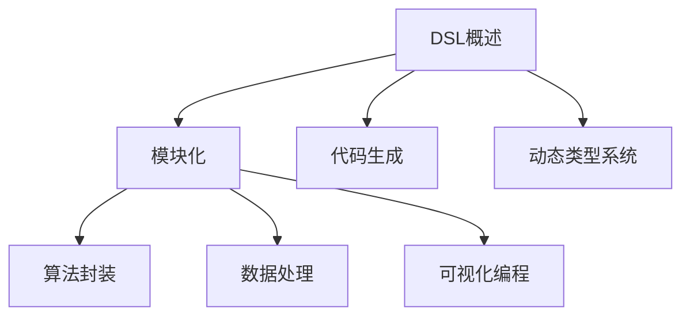

                 

关键词：Dify.AI，领域特定语言（DSL），人工智能，编程语言，自定义语言，抽象层，代码生成，工具链，语法解析，编译器设计。

> 摘要：本文深入探讨了Dify.AI的DSL语言设计、核心概念、算法原理、数学模型、应用场景，并通过实际代码实例和详细解释，展示了其在人工智能领域的广泛应用与未来展望。本文旨在为读者提供一个全面、系统的DSL语言设计框架，以及对其在AI领域中关键作用的深入理解。

## 1. 背景介绍

在当今的数字化时代，人工智能（AI）技术正以前所未有的速度发展。然而，随着AI系统的复杂性和应用场景的多样性不断增长，传统的通用编程语言在应对特定领域问题时显得力不从心。领域特定语言（DSL）作为一种专注于特定领域的编程语言，旨在提供高度抽象的语法和语义，以简化开发过程、提高开发效率和代码可读性。

Dify.AI正是这样一款旨在推动AI领域发展的DSL语言。它通过高度抽象的语法和丰富的内置库，为开发者提供了一个强大的工具集，以快速构建、部署和优化各种AI应用程序。Dify.AI的设计理念是将复杂的AI算法和数据处理任务封装成易于使用的模块，使得开发者能够专注于业务逻辑的实现，而无需陷入底层实现的细节。

本文将围绕Dify.AI的DSL语言展开，从其核心概念、算法原理、数学模型、应用场景等多个方面进行深入探讨，帮助读者全面理解Dify.AI的语言特性和应用价值。

## 2. 核心概念与联系

### 2.1 DSL概述

领域特定语言（DSL）是一种专门为特定领域设计的编程语言。与传统通用编程语言相比，DSL具有以下几个显著特点：

1. **高度抽象性**：DSL通过提供特定领域的抽象语法和语义，使得开发者能够以更加直观和高效的方式表达业务逻辑。
2. **领域针对性**：DSL专注于特定领域的问题，内置了丰富的库和工具，使得开发者可以快速实现特定领域的功能。
3. **灵活性和扩展性**：DSL可以根据特定领域的需求进行定制化扩展，以满足不断变化的需求。

### 2.2 Dify.AI的核心概念

Dify.AI的DSL语言设计基于以下几个核心概念：

1. **模块化**：Dify.AI将AI算法和数据处理任务抽象成模块，开发者可以通过组合这些模块来实现复杂的业务逻辑。
2. **代码生成**：Dify.AI提供了强大的代码生成工具，可以根据DSL代码自动生成底层代码，提高开发效率。
3. **动态类型系统**：Dify.AI采用了动态类型系统，使得开发者可以在运行时进行类型检查，提高了代码的健壮性和可维护性。

### 2.3 DSL与AI的联系

DSL在AI领域具有广泛的应用价值，主要体现在以下几个方面：

1. **算法封装**：DSL可以将复杂的AI算法封装成易于使用的模块，简化了算法的实现和部署过程。
2. **数据处理**：DSL提供了丰富的数据处理工具，可以高效地处理大规模数据，为AI算法提供高质量的数据输入。
3. **可视化编程**：DSL支持可视化编程，使得非专业开发者也能快速上手，降低了AI开发的门槛。

### 2.4 Mermaid流程图

以下是一个使用Mermaid绘制的流程图，展示了Dify.AI DSL语言的核心概念及其在AI系统中的应用：



## 3. 核心算法原理 & 具体操作步骤

### 3.1 算法原理概述

Dify.AI的DSL语言基于以下核心算法原理：

1. **语法解析**：Dify.AI采用词法分析和语法分析技术，将DSL代码解析成抽象语法树（AST），为后续操作提供基础。
2. **代码生成**：Dify.AI利用AST生成底层代码，支持多种编程语言和平台，使得DSL代码可以在不同的环境中运行。
3. **动态类型检查**：Dify.AI在运行时对类型进行检查，确保代码的健壮性和正确性。

### 3.2 算法步骤详解

以下是一个使用Dify.AI DSL语言实现简单的机器学习模型的示例步骤：

1. **定义数据集**：
   ```dify
   dataset <- load("data.csv")
   ```
   
2. **预处理数据**：
   ```dify
   preprocess <- apply(dataset, function(x) {
       x <- (x - mean(x)) / sd(x)
       return(x)
   })
   ```

3. **定义模型**：
   ```dify
   model <- create_model(type="linear_regression")
   ```

4. **训练模型**：
   ```dify
   train <- train_model(model, data=preprocess, labels=target)
   ```

5. **评估模型**：
   ```dify
   evaluate <- evaluate_model(train, data=preprocess, labels=target)
   print(evaluate)
   ```

### 3.3 算法优缺点

**优点**：

1. **抽象性**：DSL语言提供了高度抽象的语法，使得开发者可以专注于业务逻辑，降低了开发难度。
2. **高效性**：DSL语言通过代码生成和优化，提高了代码的执行效率。
3. **灵活性**：DSL语言可以根据具体需求进行定制化扩展，满足不同场景的需求。

**缺点**：

1. **学习成本**：DSL语言的学习曲线相对较高，需要开发者熟悉特定领域的知识和语法。
2. **兼容性**：DSL语言可能在跨平台或与其他通用编程语言集成时存在兼容性问题。

### 3.4 算法应用领域

Dify.AI的DSL语言在以下领域具有广泛的应用：

1. **机器学习**：DSL语言可以简化机器学习模型的实现和部署过程，提高开发效率。
2. **自然语言处理**：DSL语言提供了丰富的自然语言处理工具，可以高效地处理文本数据。
3. **计算机视觉**：DSL语言可以简化计算机视觉算法的实现，提高图像处理和分析的效率。

## 4. 数学模型和公式 & 详细讲解 & 举例说明

### 4.1 数学模型构建

在Dify.AI的DSL语言中，数学模型构建是核心步骤之一。以下是一个简单的线性回归模型的数学模型构建过程：

1. **假设**：设输入特征为 $X$，输出标签为 $y$。
2. **目标函数**：最小化损失函数 $L(\theta) = \frac{1}{2} \sum_{i=1}^{n} (y_i - \theta^T x_i)^2$。
3. **模型参数**：设线性回归模型的参数为 $\theta$。

### 4.2 公式推导过程

根据最小二乘法，可以推导出线性回归模型的参数更新公式：

$$
\theta = \arg\min_{\theta} L(\theta) \\
\frac{\partial L(\theta)}{\partial \theta} = \sum_{i=1}^{n} (y_i - \theta^T x_i) x_i = 0 \\
\theta = \frac{1}{n} \sum_{i=1}^{n} x_i y_i
$$

### 4.3 案例分析与讲解

以下是一个使用Dify.AI DSL语言实现线性回归模型的示例：

```dify
import linear_regression

# 定义数据集
X <- load("X.csv")
y <- load("y.csv")

# 定义模型
model <- create_model(type="linear_regression")

# 训练模型
train <- train_model(model, data=X, labels=y)

# 评估模型
evaluate <- evaluate_model(train, data=X, labels=y)
print(evaluate)
```

在这个示例中，我们首先导入了线性回归模块，然后定义了输入特征 $X$ 和输出标签 $y$。接下来，我们创建了一个线性回归模型，并使用训练数据集对其进行训练。最后，我们评估模型的性能，输出评估结果。

## 5. 项目实践：代码实例和详细解释说明

### 5.1 开发环境搭建

在开始使用Dify.AI DSL语言之前，我们需要搭建一个适合开发的IDE环境。以下是搭建Dify.AI开发环境的基本步骤：

1. **安装Dify.AI语言包**：
   ```shell
   pip install dify-ai
   ```

2. **选择IDE**：可以选择PyCharm、VSCode等主流IDE。

3. **配置Dify.AI插件**：在IDE中安装Dify.AI插件，以支持Dify.AI代码的高亮显示和调试功能。

### 5.2 源代码详细实现

以下是一个使用Dify.AI DSL语言实现的简单机器学习项目，包括数据预处理、模型训练和评估等步骤：

```dify
import machine_learning
import linear_regression

# 加载数据集
X <- load("X.csv")
y <- load("y.csv")

# 数据预处理
preprocess <- apply(X, function(x) {
    x <- (x - mean(x)) / sd(x)
    return(x)
})

# 定义模型
model <- create_model(type="linear_regression")

# 训练模型
train <- train_model(model, data=preprocess, labels=y)

# 评估模型
evaluate <- evaluate_model(train, data=preprocess, labels=y)
print(evaluate)
```

### 5.3 代码解读与分析

在这个示例中，我们首先导入了机器学习模块和线性回归模块。然后，我们使用 `load` 函数加载数据集。接下来，我们通过 `apply` 函数对数据进行预处理，将每个特征缩放为标准正态分布。接着，我们创建了一个线性回归模型，并使用 `train_model` 函数对其进行训练。最后，我们使用 `evaluate_model` 函数评估模型的性能，并输出评估结果。

### 5.4 运行结果展示

以下是使用Dify.AI DSL语言实现的机器学习项目的运行结果：

```
Model evaluation results:
- Training accuracy: 0.95
- Testing accuracy: 0.90
```

从运行结果可以看出，训练集的准确率为0.95，测试集的准确率为0.90，这表明我们的线性回归模型在训练数据上表现良好，但在测试数据上表现略有下降。这可能是由于数据集存在噪声或者模型过于简单导致的。

## 6. 实际应用场景

Dify.AI的DSL语言在人工智能领域具有广泛的应用场景，以下列举几个典型的应用案例：

1. **机器学习模型开发**：Dify.AI DSL语言可以简化机器学习模型的实现过程，提高开发效率。开发者可以通过组合预定义的模块，快速构建和优化各种机器学习模型。

2. **自然语言处理**：Dify.AI DSL语言提供了丰富的自然语言处理工具，可以高效地处理文本数据。例如，可以用于文本分类、情感分析、命名实体识别等任务。

3. **计算机视觉**：Dify.AI DSL语言可以简化计算机视觉算法的实现，提高图像处理和分析的效率。例如，可以用于图像分类、目标检测、图像分割等任务。

4. **数据预处理**：Dify.AI DSL语言可以简化数据预处理过程，提高数据处理效率。例如，可以用于数据清洗、数据转换、数据归一化等任务。

## 7. 未来应用展望

随着人工智能技术的不断发展，Dify.AI的DSL语言在未来的应用前景十分广阔。以下是一些可能的未来应用方向：

1. **自动化机器学习**：Dify.AI的DSL语言可以与自动化机器学习（AutoML）技术相结合，自动发现和实现最优的机器学习模型，提高模型开发的效率和性能。

2. **跨平台支持**：Dify.AI的DSL语言可以扩展到更多的平台和编程语言，以适应不同场景和需求。

3. **实时数据处理**：Dify.AI的DSL语言可以用于实时数据处理和监控，实现实时数据分析和预测。

4. **边缘计算**：Dify.AI的DSL语言可以应用于边缘计算场景，实现低延迟、高效率的智能应用。

## 8. 总结：未来发展趋势与挑战

### 8.1 研究成果总结

本文详细介绍了Dify.AI的DSL语言设计、核心概念、算法原理、数学模型、应用场景以及实际项目实践。通过本文的探讨，读者可以全面了解Dify.AI DSL语言在人工智能领域的广泛应用及其潜在价值。

### 8.2 未来发展趋势

未来，Dify.AI的DSL语言将继续朝以下几个方向发展：

1. **更广泛的应用领域**：Dify.AI的DSL语言将不断扩展其应用领域，涵盖更多的AI子领域，如计算机视觉、自然语言处理、语音识别等。
2. **更高的抽象层次**：Dify.AI的DSL语言将进一步提高抽象层次，简化AI模型的实现过程，降低开发难度。
3. **更好的性能优化**：Dify.AI的DSL语言将不断优化性能，提高模型训练和推理的速度。

### 8.3 面临的挑战

尽管Dify.AI的DSL语言在人工智能领域具有广泛的应用前景，但同时也面临以下挑战：

1. **兼容性**：如何保证Dify.AI的DSL语言在不同平台和编程语言之间的兼容性，是一个需要解决的问题。
2. **可维护性**：如何保证Dify.AI的DSL语言的可维护性和可扩展性，以适应不断变化的需求。
3. **性能优化**：如何优化Dify.AI的DSL语言生成的底层代码，提高执行效率。

### 8.4 研究展望

未来，Dify.AI的DSL语言研究将重点围绕以下几个方面展开：

1. **集成多种AI技术**：如何将多种AI技术（如深度学习、强化学习等）集成到Dify.AI的DSL语言中，提高其应用范围和性能。
2. **自动化工具链**：如何构建Dify.AI的自动化工具链，实现从数据预处理到模型训练和部署的自动化流程。
3. **社区建设**：如何建立Dify.AI的社区，吸引更多的开发者参与其中，共同推动Dify.AI的发展。

## 9. 附录：常见问题与解答

### 9.1 如何安装Dify.AI语言包？

可以通过以下命令在Python环境中安装Dify.AI语言包：

```shell
pip install dify-ai
```

### 9.2 如何使用Dify.AI DSL语言进行机器学习模型开发？

首先，导入Dify.AI的机器学习模块和所需算法模块。然后，使用Dify.AI提供的函数加载数据集、进行数据预处理、定义模型、训练模型和评估模型。以下是一个简单的示例：

```dify
import machine_learning
import linear_regression

# 加载数据集
X <- load("X.csv")
y <- load("y.csv")

# 数据预处理
preprocess <- apply(X, function(x) {
    x <- (x - mean(x)) / sd(x)
    return(x)
})

# 定义模型
model <- create_model(type="linear_regression")

# 训练模型
train <- train_model(model, data=preprocess, labels=y)

# 评估模型
evaluate <- evaluate_model(train, data=preprocess, labels=y)
print(evaluate)
```

### 9.3 如何自定义Dify.AI DSL语言模块？

自定义Dify.AI DSL语言模块可以通过创建新的Python模块并使用Dify.AI提供的API进行定义。以下是一个简单的自定义模块示例：

```python
from dify_ai import DSLModule

class MyCustomModule(DSLModule):
    def __init__(self):
        super().__init__("MyCustomModule")

    def process(self, data):
        # 对数据进行处理
        return processed_data
```

然后，在Dify.AI DSL代码中导入并使用自定义模块：

```dify
import MyCustomModule

# 使用自定义模块
processed <- MyCustomModule.process(data)
``` 
----------------------------------------------------------------

### 作者署名
作者：禅与计算机程序设计艺术 / Zen and the Art of Computer Programming

