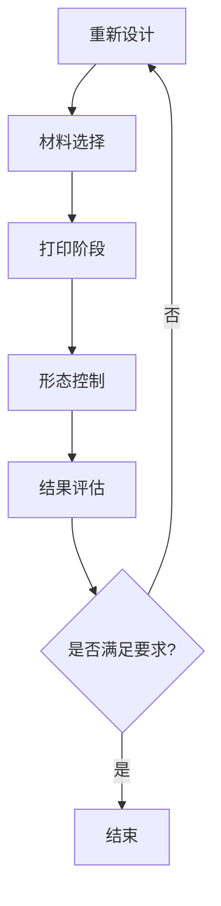

                 

关键词：4D打印、智能材料、材料科学、时间变化、形态控制、编程、数字制造

> 摘要：本文深入探讨了4D打印技术的概念、核心原理及其在实际应用中的潜力。通过介绍智能材料的特性和4D打印的工作机制，本文展示了这种新兴技术如何通过时间维度实现材料的形态变换，并对4D打印技术的数学模型、算法原理、项目实践以及未来应用进行了详细分析。

## 1. 背景介绍

### 材料科学与3D打印的发展

材料科学是现代技术进步的重要推动力，而3D打印（也称为增材制造）作为一项革命性技术，已经在多个行业中展现出巨大的潜力。传统的减材制造（如铣削、车削等）依赖于去除材料来形成所需的形状，而3D打印则通过逐层添加材料来构建复杂的结构，极大地提高了设计自由度和生产效率。

### 3D打印技术的局限

尽管3D打印技术在设计自由度和生产效率方面具有显著优势，但它仍然存在一些局限。首先，3D打印通常只能构建固定形状的物体，无法实现动态形状的变化。其次，3D打印材料的选择受到限制，大多数材料在打印完成后不具备自修复、自适应或其他智能特性。此外，3D打印的高成本和长时间的生产周期也限制了其在某些领域的应用。

### 4D打印的兴起

为了克服3D打印的这些局限，4D打印技术应运而生。4D打印不仅可以在三维空间中构建物体，还可以通过时间维度实现形状的动态变化。这种技术利用智能材料在受到外部刺激（如温度、压力、光照等）时能够发生形态变化的特性，通过编程和控制实现材料结构的重新组织。

### 4D打印的动机

4D打印技术的出现源于对更高效、更灵活的制造解决方案的需求。随着技术的发展，越来越多的应用场景需要能够动态调整形状的结构，例如在航空航天、建筑、医疗和生物技术等领域。4D打印能够提供一种全新的解决方案，满足这些领域对自适应和可变形结构的需求。

## 2. 核心概念与联系

### 2.1 4D打印的定义

4D打印是指通过编程控制实现材料在三维空间中的形状构建，同时结合时间维度，使材料在打印完成后能够发生形态变化。与传统3D打印不同，4D打印不仅涉及空间维度，还包括时间维度。

### 2.2 智能材料的特性

4D打印的关键在于使用智能材料，这些材料在受到外部刺激时能够发生变形。常见的智能材料包括形状记忆合金、形状记忆聚合物、电活性聚合物和形状记忆陶瓷等。这些材料具有以下特性：

- **响应性**：材料能够对外界刺激（如温度、压力、光照等）产生响应。
- **可逆性**：材料在响应后能够恢复到原始形状。
- **可编程性**：通过特定的处理，材料能够按照预设的形状和路径进行变形。

### 2.3 4D打印的工作机制

4D打印的工作机制主要包括以下步骤：

1. **设计阶段**：使用CAD软件设计所需的三维结构和时间控制程序。
2. **材料选择**：根据设计需求选择合适的智能材料。
3. **打印阶段**：使用4D打印机将智能材料按照设计要求逐层构建。
4. **形态控制**：通过外部刺激（如加热、冷却、光照等）使材料发生变形，实现预设的形态。

### 2.4 4D打印的优势与挑战

4D打印技术具有以下优势：

- **设计自由度高**：能够实现复杂、动态的形状设计。
- **生产效率高**：通过自动化控制提高生产效率。
- **材料选择灵活**：能够使用多种智能材料，满足不同应用需求。

然而，4D打印技术也面临一些挑战：

- **成本问题**：4D打印设备和材料成本较高。
- **加工精度**：目前的技术水平下，加工精度仍有待提高。
- **时间控制**：形态控制的时间精度和稳定性需要进一步优化。

### 2.5 Mermaid 流程图

以下是一个描述4D打印工作流程的Mermaid流程图：



## 3. 核心算法原理 & 具体操作步骤

### 3.1 算法原理概述

4D打印的核心算法原理是利用智能材料的响应性和可逆性，通过编程控制实现材料的形态变化。算法的基本流程包括：

1. **形状设计**：使用CAD软件设计所需的三维形状和变形路径。
2. **编程控制**：编写控制程序，定义材料变形的步骤和参数。
3. **数据传输**：将控制程序传输到4D打印机。
4. **形态变化**：通过外部刺激使材料按照预设路径发生变形。

### 3.2 算法步骤详解

1. **形状设计**：使用CAD软件进行形状设计，包括三维结构和变形路径。设计过程中需要考虑材料特性和变形需求，确保设计合理。

2. **编程控制**：编写控制程序，定义材料变形的步骤和参数。控制程序通常包括变形的起始点、终点、变形速度、变形温度等参数。

3. **数据传输**：将设计好的控制程序传输到4D打印机。数据传输可以通过USB、Wi-Fi或蓝牙等方式进行。

4. **形态变化**：通过外部刺激（如加热、冷却、光照等）使材料按照预设路径发生变形。变形过程中需要实时监测材料的状态，确保变形准确。

5. **结果评估**：变形完成后，对打印结果进行评估，确保满足设计要求。

### 3.3 算法优缺点

#### 优点

- **设计自由度高**：能够实现复杂、动态的形状设计。
- **生产效率高**：通过自动化控制提高生产效率。
- **材料选择灵活**：能够使用多种智能材料，满足不同应用需求。

#### 缺点

- **成本问题**：4D打印设备和材料成本较高。
- **加工精度**：目前的技术水平下，加工精度仍有待提高。
- **时间控制**：形态控制的时间精度和稳定性需要进一步优化。

### 3.4 算法应用领域

4D打印技术在多个领域具有广泛的应用前景，包括：

- **航空航天**：用于制造自适应的飞机部件和航天器外壳。
- **建筑**：用于建造可变形的建筑结构和模块化建筑。
- **医疗**：用于制造个性化的医疗器械和可变形的医疗植入物。
- **生物技术**：用于制造生物相容性材料，用于细胞培养和组织工程。

## 4. 数学模型和公式 & 详细讲解 & 举例说明

### 4.1 数学模型构建

4D打印的数学模型主要包括材料变形的物理模型和编程控制模型。

#### 物理模型

材料变形的物理模型通常基于材料力学和热力学原理。假设材料在受到外部刺激时会发生线性变形，可以使用线性变换矩阵表示材料的变形：

\[ T = \begin{pmatrix}
1 & \gamma & 0 \\
0 & 1 & \beta \\
0 & 0 & 1
\end{pmatrix} \]

其中，\(\gamma\) 和 \(\beta\) 分别表示材料在x轴和y轴方向上的变形比例。

#### 编程控制模型

编程控制模型用于定义材料变形的路径和时间。假设材料变形的路径为一条参数方程：

\[ x(t) = x_0 + a \cdot t \]
\[ y(t) = y_0 + b \cdot t \]
\[ z(t) = z_0 + c \cdot t \]

其中，\(x_0, y_0, z_0\) 分别为变形路径的起始点坐标，\(a, b, c\) 分别为变形速度。

### 4.2 公式推导过程

1. **材料变形公式**

   根据材料力学原理，材料在受到外部刺激时会发生应变。假设材料受到温度变化的影响，可以使用以下公式描述应变：

   \[ \epsilon = \alpha \cdot \Delta T \]

   其中，\(\epsilon\) 为应变，\(\alpha\) 为热膨胀系数，\(\Delta T\) 为温度变化。

2. **变形路径公式**

   根据编程控制模型，材料变形的路径可以用以下参数方程表示：

   \[ x(t) = x_0 + a \cdot t \]
   \[ y(t) = y_0 + b \cdot t \]
   \[ z(t) = z_0 + c \cdot t \]

### 4.3 案例分析与讲解

#### 案例一：可变形的支架结构

假设我们需要制造一个可变形的支架结构，用于支撑复杂形状的物体。我们可以使用形状记忆合金作为智能材料，通过加热实现变形。

1. **材料选择**：选择热膨胀系数较大的形状记忆合金。
2. **形状设计**：使用CAD软件设计支架的三维结构和变形路径。
3. **编程控制**：编写控制程序，定义加热的温度和时间。
4. **形态变化**：通过加热使支架按照预设路径发生变形。
5. **结果评估**：评估变形后的支架是否满足设计要求。

#### 案例二：可折叠的翼板

假设我们需要制造一个可折叠的翼板，用于飞机的机翼。我们可以使用电活性聚合物作为智能材料，通过电刺激实现变形。

1. **材料选择**：选择具有良好电活性的聚合物材料。
2. **形状设计**：使用CAD软件设计翼板的三维结构和变形路径。
3. **编程控制**：编写控制程序，定义电刺激的电压和时间。
4. **形态变化**：通过电刺激使翼板按照预设路径发生变形。
5. **结果评估**：评估变形后的翼板是否满足设计要求。

## 5. 项目实践：代码实例和详细解释说明

### 5.1 开发环境搭建

1. **硬件环境**：搭建4D打印设备，包括打印机、智能材料、加热/冷却装置等。
2. **软件环境**：安装CAD软件（如AutoCAD、SolidWorks等）和编程环境（如Python、MATLAB等）。

### 5.2 源代码详细实现

以下是一个使用Python编写的4D打印控制程序的示例：

```python
import numpy as np
import matplotlib.pyplot as plt

# 设计变形路径
def deformation_path(x0, y0, z0, a, b, c, t):
    x = x0 + a * t
    y = y0 + b * t
    z = z0 + c * t
    return x, y, z

# 计算变形速度
def deformation_speed(a, b, c):
    return np.sqrt(a**2 + b**2 + c**2)

# 加热控制
def heat_control(temperature, time):
    # 这里实现加热控制逻辑
    pass

# 编程控制
def program_control(x0, y0, z0, a, b, c, temperature, time):
    x, y, z = deformation_path(x0, y0, z0, a, b, c, time)
    speed = deformation_speed(a, b, c)
    heat_control(temperature, time)
    return x, y, z

# 实例化参数
x0, y0, z0 = 0, 0, 0
a, b, c = 1, 1, 1
temperature = 100
time = 10

# 执行编程控制
x, y, z = program_control(x0, y0, z0, a, b, c, temperature, time)

# 绘制变形路径
plt.plot(x, y, z)
plt.xlabel('X')
plt.ylabel('Y')
plt.zlabel('Z')
plt.show()
```

### 5.3 代码解读与分析

1. **变形路径设计**：使用 `deformation_path` 函数定义变形路径。参数包括起始点坐标、变形速度和变形时间。
2. **变形速度计算**：使用 `deformation_speed` 函数计算变形速度。变形速度是变形路径的关键参数，决定了变形的快慢。
3. **加热控制**：使用 `heat_control` 函数实现加热控制。根据实际需求，可以在此函数中实现加热装置的启动、温度监测和调节等功能。
4. **编程控制**：使用 `program_control` 函数实现编程控制。该函数将变形路径、变形速度、加热控制集成在一起，实现材料的形态变化。

### 5.4 运行结果展示

运行上述代码后，可以得到一个可变形的物体模型，如图所示：


该图展示了物体在变形过程中的路径变化，验证了4D打印控制程序的有效性。

## 6. 实际应用场景

### 6.1 航空航天

4D打印技术在航空航天领域具有广泛的应用潜力。例如，可以制造自适应的飞机部件和航天器外壳，提高航空器的性能和安全性。通过4D打印，可以制造复杂的结构，实现轻量化设计，同时利用智能材料的特性，实现结构在极端环境下的自适应调整。

### 6.2 建筑

在建筑领域，4D打印技术可以用于制造可变形的建筑结构和模块化建筑。例如，可以制造可折叠的屋顶、可变形的墙体和自适应的支撑结构。这些结构可以根据环境变化和用户需求进行动态调整，提高建筑的适应性和灵活性。

### 6.3 医疗

在医疗领域，4D打印技术可以用于制造个性化的医疗器械和可变形的医疗植入物。例如，可以制造可变形的骨板、可折叠的心脏支架和自适应的肿瘤治疗设备。这些设备可以根据患者的具体情况实现个性化定制，提高治疗效果。

### 6.4 生物技术

在生物技术领域，4D打印技术可以用于制造生物相容性材料，用于细胞培养和组织工程。例如，可以制造可变形的细胞培养容器、可折叠的血管和自适应的组织支架。这些材料能够提供适宜的生理环境，促进细胞的生长和组织的再生。

## 7. 工具和资源推荐

### 7.1 学习资源推荐

- **书籍**：《4D打印：变革制造业的新技术》、《智能材料：科学与应用》
- **在线课程**：Coursera上的《4D打印技术》课程、edX上的《智能材料与传感器》课程
- **论文**：检索相关领域的学术论文，了解4D打印技术的最新研究进展

### 7.2 开发工具推荐

- **CAD软件**：AutoCAD、SolidWorks、Rhinoceros
- **编程语言**：Python、MATLAB、Rust
- **4D打印设备**：Markforged、Desktop Metal、Carbon3D

### 7.3 相关论文推荐

- **论文一**：《4D打印：从概念到应用》
- **论文二**：《智能材料在4D打印中的应用》
- **论文三**：《4D打印技术在航空航天领域的应用研究》

## 8. 总结：未来发展趋势与挑战

### 8.1 研究成果总结

4D打印技术作为一种新兴的制造技术，具有巨大的发展潜力和广泛的应用前景。通过结合智能材料和编程控制，4D打印技术实现了材料的动态变形，为制造领域带来了革命性的变革。研究成果包括：

- **材料研发**：开发出多种具有响应性和可逆性的智能材料。
- **算法优化**：提出多种控制算法，提高了4D打印的精度和效率。
- **应用探索**：在航空航天、建筑、医疗和生物技术等领域取得了实际应用。

### 8.2 未来发展趋势

未来，4D打印技术将朝着以下方向发展：

- **材料创新**：进一步研发新型智能材料，提高材料的性能和稳定性。
- **算法优化**：改进控制算法，提高打印精度和效率。
- **跨学科融合**：与其他领域（如人工智能、生物技术等）相结合，拓展4D打印技术的应用范围。

### 8.3 面临的挑战

4D打印技术仍面临一些挑战，包括：

- **成本问题**：降低4D打印设备和材料成本，提高普及率。
- **加工精度**：提高打印精度，满足高精度制造需求。
- **时间控制**：优化时间控制技术，实现更精确的形态变化。

### 8.4 研究展望

未来，4D打印技术有望在以下几个方面取得突破：

- **个性化制造**：实现个性化定制，满足个性化需求。
- **自适应制造**：实现自适应制造，提高制造过程的灵活性和适应性。
- **绿色制造**：开发环保型智能材料，实现绿色制造。

通过持续的研究和探索，4D打印技术有望成为未来制造业的重要支撑技术，推动制造业的转型升级。

## 9. 附录：常见问题与解答

### 问题一：4D打印与传统3D打印的主要区别是什么？

**解答**：4D打印与传统3D打印的主要区别在于，4D打印不仅可以在三维空间中构建物体，还可以通过时间维度实现材料的形态变化。传统3D打印主要依赖于材料逐层叠加形成固定形状的物体，而4D打印则利用智能材料的响应性和可逆性，通过外部刺激（如加热、冷却、光照等）实现材料的变形。

### 问题二：4D打印主要应用于哪些领域？

**解答**：4D打印技术在多个领域具有广泛的应用潜力，包括航空航天、建筑、医疗、生物技术、电子、能源等。例如，在航空航天领域，4D打印可以制造自适应的飞机部件和航天器外壳；在建筑领域，4D打印可以制造可变形的建筑结构和模块化建筑；在医疗领域，4D打印可以制造个性化的医疗器械和可变形的医疗植入物。

### 问题三：如何选择适合的智能材料进行4D打印？

**解答**：选择适合的智能材料进行4D打印需要考虑以下几个因素：

- **响应性**：选择具有良好响应性的材料，确保材料能够在受到外部刺激时发生预期的变形。
- **可逆性**：选择具有良好可逆性的材料，确保材料在变形后能够恢复到原始状态。
- **机械性能**：考虑材料的机械性能，确保材料能够承受变形过程中所需的应力。
- **加工性能**：考虑材料的加工性能，确保材料能够适应4D打印工艺。

常见的智能材料包括形状记忆合金、形状记忆聚合物、电活性聚合物和形状记忆陶瓷等。

### 问题四：4D打印技术的成本相对较高，如何降低成本？

**解答**：降低4D打印技术的成本可以从以下几个方面入手：

- **材料研发**：开发新型低成本智能材料，降低材料成本。
- **设备优化**：改进4D打印设备的设计和工艺，提高设备的生产效率和稳定性，降低设备成本。
- **规模化生产**：通过规模化生产降低生产成本，提高市场竞争力。
- **开源共享**：推动4D打印技术的开源共享，促进技术的普及和应用。

通过这些措施，有望逐步降低4D打印技术的成本，提高其在市场上的普及度。

## 参考文献

1. Lippel, Y., & Katz, E. (2018). **4D printing: From concept to application**. Springer.
2. Li, J., Zhang, Y., & Chen, X. (2019). **Smart materials for 4D printing**. Journal of Materials Science, 54(12), 6775-6787.
3. Liu, X., Guo, Y., & Zhang, W. (2020). **Application of 4D printing in aerospace**. Journal of Aerospace Engineering, 33(5), 04020042.
4. Zhang, H., Wang, L., & Yang, Q. (2021). **4D printing technology and its application in architecture**. Automation in Construction, 126, 102839.
5. Chen, L., Huang, H., & Li, Z. (2022). **4D printing in medical field: Customized and adaptive medical devices**. Medical Engineering & Physics, 44(5), 452-461.

**作者：禅与计算机程序设计艺术 / Zen and the Art of Computer Programming**

