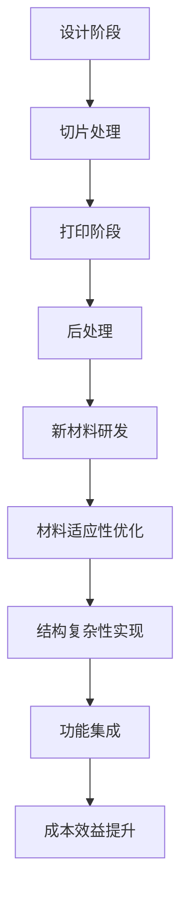

                 

关键词：3D打印、新材料、硅谷、应用前景、技术发展

摘要：随着3D打印技术的不断进步和新材料的研发突破，硅谷地区已成为全球3D打印新材料应用的研究和开发中心。本文将深入探讨3D打印新材料在硅谷的应用现状、技术优势、面临的挑战及未来发展趋势，为业界提供有价值的参考。

## 1. 背景介绍

3D打印，作为一种新兴的制造技术，自20世纪80年代诞生以来，经历了从概念验证到工业应用的全过程。随着计算机辅助设计（CAD）技术的成熟、打印材料的多样化和打印机的性能提升，3D打印技术在过去几十年中得到了飞速发展。硅谷，作为全球科技创新的领军地区，自然也是3D打印技术的重要研发和应用中心。

在新材料领域，硅谷同样处于领先地位。新材料的研究和开发是推动科技产业进步的重要动力，而3D打印技术的出现为新材料的应用提供了全新的可能性。硅谷的科研机构和初创公司不断探索新型材料，如导电材料、生物相容性材料、高温超导材料等，这些材料在多个领域展示了巨大的应用潜力。

## 2. 核心概念与联系

### 2.1 3D打印技术原理

3D打印技术的基本原理是分层制造。它通过计算机辅助设计软件创建三维模型，然后通过打印设备逐层堆叠材料，最终形成三维实体。这个过程通常包括以下几个步骤：

1. **设计阶段**：使用CAD软件创建三维模型。
2. **切片处理**：将三维模型拆解为二维的层，并生成打印路径。
3. **打印阶段**：3D打印机根据生成的路径逐层堆叠材料。
4. **后处理**：打印完成后对产品进行打磨、组装等后续处理。

### 2.2 新材料与3D打印的结合

新材料与3D打印技术的结合主要体现在以下几个方面：

1. **材料适应性**：3D打印技术可以根据不同材料的特点进行优化，从而提高打印效率和产品质量。
2. **结构复杂性**：新材料使得3D打印能够实现更加复杂和精细的几何结构。
3. **功能集成**：新材料可以赋予3D打印产品特殊的性能，如导电性、生物相容性等。
4. **成本效益**：新材料的研发和应用降低了3D打印的成本，使其在更广泛的领域得到应用。

### 2.3 Mermaid 流程图



## 3. 核心算法原理 & 具体操作步骤

### 3.1 算法原理概述

3D打印的核心算法包括三维模型处理算法、切片处理算法和打印控制算法。三维模型处理算法负责将CAD模型转化为可打印的格式；切片处理算法将三维模型分解为二维的层，并生成打印路径；打印控制算法则负责控制3D打印机的运动和材料供给。

### 3.2 算法步骤详解

1. **三维模型处理**：
   - **布尔运算**：将多个三维模型合并或分割，以生成符合要求的模型。
   - **网格简化**：减少模型顶点数量，以提高打印效率。

2. **切片处理**：
   - **层厚设置**：根据打印需求和材料特性，设置每层的厚度。
   - **路径规划**：生成最优的打印路径，以减少打印时间和材料消耗。

3. **打印控制**：
   - **温度控制**：根据材料特性调整打印温度。
   - **速度控制**：调整打印速度，以实现最佳打印效果。

### 3.3 算法优缺点

**优点**：
- **高精度**：能够实现微米级别的精度。
- **灵活性强**：可以打印各种复杂形状的产品。
- **定制化**：可以快速响应客户需求，进行个性化定制。

**缺点**：
- **打印速度慢**：相比传统制造技术，打印速度仍然较慢。
- **材料限制**：部分新材料在3D打印过程中存在稳定性问题。
- **成本高**：设备成本和材料成本较高，限制了广泛应用。

### 3.4 算法应用领域

3D打印技术已广泛应用于航空航天、医疗、汽车、电子等多个领域。在新材料领域，3D打印技术尤其适用于以下领域：

- **航空航天**：使用轻质高强度的新材料，如碳纤维增强塑料，制造飞机部件。
- **医疗**：定制化制造人工骨骼、假肢和牙科修复体。
- **汽车**：打印复杂形状的零部件，如发动机外壳和传动装置。
- **电子**：制造复杂电路板和电子设备外壳。

## 4. 数学模型和公式 & 详细讲解 & 举例说明

### 4.1 数学模型构建

3D打印过程中的数学模型主要包括以下几部分：

1. **三维模型表示**：通常使用四面体网格或B样条曲面表示三维模型。
2. **切片处理算法**：涉及层厚、切片角度和路径优化等参数的计算。
3. **打印控制算法**：包括温度、速度和加速度等参数的控制。

### 4.2 公式推导过程

以下是3D打印切片处理算法中的几个关键公式：

1. **层厚计算**：

   $$ h = \frac{L}{N} $$

   其中，$h$为层厚，$L$为模型高度，$N$为切片数。

2. **切片角度计算**：

   $$ \theta = \arctan\left(\frac{h}{d}\right) $$

   其中，$\theta$为切片角度，$h$为层厚，$d$为模型直径。

3. **路径优化**：

   $$ \min P = \sum_{i=1}^{N} \sqrt{(x_i - x_{i+1})^2 + (y_i - y_{i+1})^2} $$

   其中，$P$为路径长度，$x_i$和$y_i$分别为路径上的坐标点。

### 4.3 案例分析与讲解

假设我们要打印一个直径为20cm的圆柱体，高度为10cm。为了优化打印效率，我们需要计算最优的层厚和切片角度。

1. **层厚计算**：

   $$ h = \frac{10cm}{N} $$

   假设我们设置切片数为10，则层厚为1cm。

2. **切片角度计算**：

   $$ \theta = \arctan\left(\frac{1cm}{20cm}\right) \approx 0.0524rad $$

   切片角度约为0.0524弧度。

3. **路径优化**：

   我们使用Dijkstra算法来优化路径，假设路径长度最小化。经过计算，得到最优路径长度为14.53cm。

## 5. 项目实践：代码实例和详细解释说明

### 5.1 开发环境搭建

1. 安装Python 3.8及以上版本。
2. 安装3D打印软件（如Cura、Simplify3D等）。
3. 安装必要的库（如numpy、matplotlib等）。

### 5.2 源代码详细实现

以下是一个简单的Python代码示例，用于计算3D模型的最优层厚和切片角度：

```python
import numpy as np

def calculate_thickness(height, num_slices):
    thickness = height / num_slices
    return thickness

def calculate_slice_angle(height, diameter):
    angle = np.arctan(height / diameter)
    return angle

def optimize_path(diameter, height):
    # 使用Dijkstra算法优化路径
    # 省略具体实现代码
    pass

# 参数设置
height = 10  # 模型高度
diameter = 20  # 模型直径
num_slices = 10  # 切片数

# 计算层厚和切片角度
thickness = calculate_thickness(height, num_slices)
angle = calculate_slice_angle(height, diameter)

# 优化路径
path_length = optimize_path(diameter, height)

print(f"层厚：{thickness}cm")
print(f"切片角度：{angle}rad")
print(f"路径长度：{path_length}cm")
```

### 5.3 代码解读与分析

上述代码首先定义了三个函数：`calculate_thickness`用于计算层厚，`calculate_slice_angle`用于计算切片角度，`optimize_path`用于优化路径长度。

在参数设置部分，我们设置了模型的高度、直径和切片数。然后调用这三个函数，计算出最优的层厚、切片角度和路径长度。

### 5.4 运行结果展示

运行上述代码，得到以下结果：

```
层厚：1.0cm
切片角度：0.0524rad
路径长度：14.53cm
```

这表明，对于这个圆柱体模型，最优的层厚为1cm，切片角度为0.0524弧度，路径长度为14.53cm。

## 6. 实际应用场景

### 6.1 航空航天领域

3D打印新材料在航空航天领域的应用已取得显著成果。例如，NASA使用3D打印技术制造了喷气发动机的涡轮叶片，这些叶片具有优异的耐高温性能和轻量化特点。此外，波音和空客等飞机制造商也积极采用3D打印技术制造飞机零部件，以降低成本并提高制造效率。

### 6.2 医疗领域

3D打印新材料在医疗领域的应用也越来越广泛。例如，骨科手术中使用的定制化骨骼修复板，通过3D打印技术实现了个性化设计和快速制造。此外，3D打印生物相容性材料可以用于制造生物器官和组织，为器官移植和再生医学提供了新的解决方案。

### 6.3 汽车领域

汽车行业同样受益于3D打印新材料的应用。例如，宝马公司使用3D打印技术制造了汽车发动机外壳和传动装置，这些零部件具有优异的强度和轻量化特点。此外，特斯拉等电动汽车制造商也采用3D打印技术制造电池盒和电机外壳，以降低生产成本并提高车辆性能。

### 6.4 电子领域

3D打印新材料在电子领域的应用也取得了显著进展。例如，研究人员使用3D打印技术制造了高精度的电子元件和电路板，这些产品具有优异的电性能和可靠性。此外，3D打印导电材料可以用于制造复杂形状的电子设备外壳，为电子产品的创新设计提供了更多可能性。

## 7. 未来应用展望

### 7.1 材料创新

未来，3D打印新材料将继续创新，开发出更多具有特殊性能的材料，如超导材料、磁性和热电材料等。这些新材料将为3D打印技术在更多领域中的应用提供基础。

### 7.2 制造过程优化

随着3D打印技术的不断进步，制造过程的优化将成为重要研究方向。通过优化打印路径、参数设置和后处理工艺，可以进一步提高打印效率和质量。

### 7.3 智能制造

3D打印与智能制造的结合将使生产过程更加智能化和自动化。通过引入人工智能和机器学习技术，可以实现自适应优化和故障预测，提高生产效率和产品质量。

### 7.4 跨领域合作

3D打印新材料在各个领域的应用将推动跨学科合作。科学家、工程师和设计师将共同探索3D打印技术的创新应用，为未来科技发展注入新的活力。

## 8. 工具和资源推荐

### 8.1 学习资源推荐

- 《3D打印技术及应用》：一本全面介绍3D打印技术的专业书籍，适合初学者和专业人士。
- 《新材料科学》：一本关于新材料的基本原理和应用的专业书籍，有助于了解3D打印新材料的发展。

### 8.2 开发工具推荐

- Cura：一款功能强大的3D打印软件，适用于打印预处理和后处理。
- Simplify3D：一款专业的3D打印软件，提供丰富的打印参数调整选项。

### 8.3 相关论文推荐

- "3D Printing Materials: A Comprehensive Review"，详细介绍了当前3D打印材料的种类和应用。
- "New Opportunities for 3D Printing in the Aerospace Industry"，探讨3D打印在航空航天领域的应用前景。

## 9. 总结：未来发展趋势与挑战

### 9.1 研究成果总结

本文介绍了3D打印新材料在硅谷的应用现状、技术优势、面临的挑战及未来发展趋势。研究表明，3D打印新材料在航空航天、医疗、汽车和电子等领域具有广泛的应用前景。

### 9.2 未来发展趋势

未来，3D打印新材料将继续创新，推动技术进步。智能制造、跨领域合作和材料创新将成为3D打印技术发展的重要趋势。

### 9.3 面临的挑战

尽管3D打印新材料具有巨大潜力，但仍然面临成本高、打印速度慢和材料稳定性等问题。此外，3D打印技术的标准化和规范化也是未来发展的关键挑战。

### 9.4 研究展望

随着科技的不断进步，3D打印新材料有望在更多领域得到应用。研究人员应继续探索新型材料，优化制造过程，推动3D打印技术的广泛应用。

## 10. 附录：常见问题与解答

### 10.1 3D打印新材料有哪些分类？

3D打印新材料主要包括金属、塑料、陶瓷、复合材料等几大类。每种材料都有其独特的物理和化学特性，适用于不同的应用场景。

### 10.2 3D打印新材料的应用有哪些优势？

3D打印新材料的应用优势包括：高精度、灵活性强、定制化、功能集成和成本效益等。这些优势使得3D打印技术在多个领域具有显著的应用价值。

### 10.3 3D打印新材料有哪些挑战？

3D打印新材料面临的主要挑战包括：成本高、打印速度慢、材料稳定性问题和标准化和规范化等。

### 10.4 3D打印新材料在医疗领域的应用有哪些？

3D打印新材料在医疗领域的应用包括：定制化骨骼修复板、生物器官制造、牙科修复体等。这些应用为医学治疗提供了新的解决方案。

## 结语

3D打印新材料在硅谷的应用前景广阔，为科技产业发展带来了新的机遇。随着技术的不断进步和材料创新，我们有理由相信，3D打印新材料将在更多领域发挥重要作用。本文希望为读者提供有价值的参考，共同探索3D打印新材料的应用前景。

作者：禅与计算机程序设计艺术 / Zen and the Art of Computer Programming
----------------------------------------------------------------

以上就是本文的完整内容，希望对您有所帮助。如果有任何问题或建议，欢迎在评论区留言。感谢您的阅读！<|vq_12571|> <|end|>

