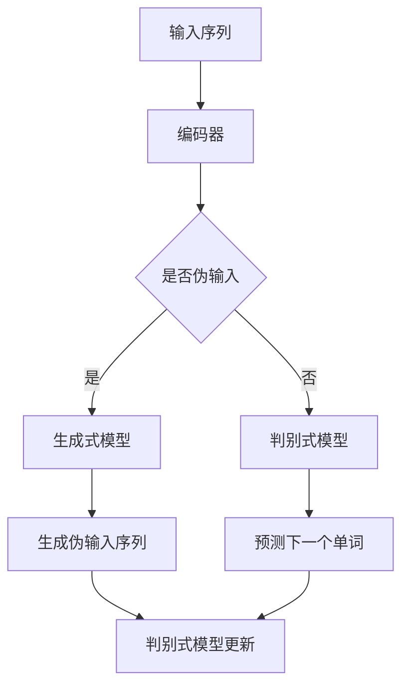

                 

  
## 1. 背景介绍

ELECTRA（Exposure through Einsum Language for Composable Transformers with AutoRegressive Transformation）是一种基于Transformer架构的新型预训练模型。Transformer架构最初由Vaswani等人在2017年提出，因其能够捕捉长距离依赖关系而在自然语言处理（NLP）领域取得了显著成功。然而，Transformer模型在计算复杂度和内存消耗方面存在一定局限性。为了克服这些问题，研究人员提出了一系列改进方法，其中ELECTRA便是其中之一。

ELECTRA在预训练过程中引入了一种新的训练策略，即生成式预训练。通过这种策略，ELECTRA能够降低模型计算复杂度和内存消耗，同时保持甚至提升模型的性能。ELECTRA在多个NLP任务中取得了优异表现，引起了广泛关注。

## 2. 核心概念与联系

### 2.1. Transformer架构

Transformer架构的核心思想是将输入序列映射为嵌入向量，然后通过自注意力机制计算序列中各个位置之间的依赖关系。具体来说，Transformer由编码器和解码器两部分组成，其中编码器负责将输入序列编码为嵌入向量，解码器则负责根据嵌入向量生成输出序列。

Transformer模型的主要优势在于其能够捕捉长距离依赖关系，这是由于自注意力机制能够自动关注输入序列中与当前位置相关的重要信息。此外，Transformer模型还可以灵活地扩展层数和注意力头数，从而提高模型性能。

### 2.2. 生成式预训练

生成式预训练是一种不同于传统的判别式预训练方法。在传统的判别式预训练中，模型需要预测输入序列的下一个单词，而生成式预训练则通过生成伪输入序列来训练模型。具体来说，ELECTRA模型在预训练过程中，首先使用一个BERT模型（判别式预训练模型）生成伪输入序列，然后使用两个变换器模型（其中一个为判别式模型，另一个为生成式模型）同时训练。

### 2.3. Mermaid流程图

下面是一个简化的ELECTRA模型训练过程的Mermaid流程图：



## 3. 核心算法原理 & 具体操作步骤

### 3.1 算法原理概述

ELECTRA的核心原理是生成式预训练，通过同时训练生成式模型和判别式模型来提高模型性能。生成式模型负责生成伪输入序列，判别式模型则负责对真实输入序列进行预测。在预训练过程中，生成式模型和判别式模型交替训练，从而实现相互监督。

### 3.2 算法步骤详解

#### 3.2.1 生成伪输入序列

生成式模型首先使用BERT模型生成伪输入序列。具体步骤如下：

1. 输入一个长度为n的序列X。
2. BERT模型对序列X进行编码，生成嵌入向量E。
3. 使用嵌入向量E生成伪输入序列Y。

生成伪输入序列的过程可以通过如下公式表示：

$$
Y = f(E)
$$

其中，$f$表示BERT模型的嵌入函数。

#### 3.2.2 预测下一个单词

判别式模型负责预测输入序列的下一个单词。具体步骤如下：

1. 输入一个长度为n的序列X。
2. BERT模型对序列X进行编码，生成嵌入向量E。
3. 判别式模型根据嵌入向量E预测序列X的下一个单词。

预测下一个单词的过程可以通过如下公式表示：

$$
p(y_{n+1} | y_1, y_2, ..., y_n) = \frac{exp(h(y_{n+1}, E))}{\sum_{y'} exp(h(y', E))}
$$

其中，$h$表示判别式模型的预测函数，$y_{n+1}$表示下一个单词，$y_1, y_2, ..., y_n$表示当前已生成的序列。

#### 3.2.3 模型更新

在预训练过程中，生成式模型和判别式模型交替训练。具体步骤如下：

1. 使用生成式模型生成伪输入序列。
2. 使用判别式模型预测伪输入序列的下一个单词，并计算损失函数。
3. 更新生成式模型的参数。
4. 使用判别式模型预测真实输入序列的下一个单词，并计算损失函数。
5. 更新生成式模型的参数。

### 3.3 算法优缺点

#### 优点：

1. 生成式预训练能够降低模型的计算复杂度和内存消耗。
2. 同时训练生成式模型和判别式模型能够提高模型性能。

#### 缺点：

1. 预训练过程较为复杂，训练时间较长。
2. 生成式模型和判别式模型的参数更新策略需要仔细设计，否则可能导致模型性能下降。

### 3.4 算法应用领域

ELECTRA模型在多个NLP任务中取得了优异表现，包括文本分类、机器翻译、情感分析等。以下是一些具体的应用案例：

1. 文本分类：ELECTRA模型可以用于文本分类任务，如情感分析、主题分类等。
2. 机器翻译：ELECTRA模型可以用于机器翻译任务，提高翻译质量。
3. 情感分析：ELECTRA模型可以用于情感分析任务，判断文本的情感倾向。

## 4. 数学模型和公式 & 详细讲解 & 举例说明

### 4.1 数学模型构建

ELECTRA模型的数学模型主要包括两个部分：生成式模型和判别式模型。

#### 4.1.1 生成式模型

生成式模型的目标是生成伪输入序列。假设输入序列为X，伪输入序列为Y，生成式模型的输出为伪输入序列的嵌入向量E。生成式模型的数学模型可以表示为：

$$
E = f(X)
$$

其中，$f$表示生成式模型的嵌入函数。

#### 4.1.2 判别式模型

判别式模型的目标是预测输入序列的下一个单词。假设输入序列为X，下一个单词为y，判别式模型的输出为预测概率分布。判别式模型的数学模型可以表示为：

$$
p(y | X) = \frac{exp(h(y, E))}{\sum_{y'} exp(h(y', E))}
$$

其中，$h$表示判别式模型的预测函数。

### 4.2 公式推导过程

#### 4.2.1 生成式模型嵌入函数

生成式模型的嵌入函数$f$可以表示为：

$$
f(X) = \text{BERT}(X)
$$

其中，$\text{BERT}$表示BERT模型的嵌入函数。

#### 4.2.2 判别式模型预测函数

判别式模型的预测函数$h$可以表示为：

$$
h(y, E) = \text{softmax}(\text{MLP}(E, y))
$$

其中，$\text{softmax}$表示softmax函数，$\text{MLP}$表示多层感知器。

### 4.3 案例分析与讲解

#### 4.3.1 情感分析

假设我们有一个情感分析任务，输入序列为：“我很喜欢这本书”。我们需要使用ELECTRA模型判断这句话的情感倾向。

1. 首先，我们将输入序列输入到BERT模型，得到嵌入向量E。

2. 然后，我们将嵌入向量E输入到判别式模型，得到预测概率分布。

$$
p(y | X) = \frac{exp(h(y, E))}{\sum_{y'} exp(h(y', E))}
$$

其中，$y$表示情感标签，$y' $表示其他可能的情感标签。

3. 最后，我们根据预测概率分布判断输入序列的情感倾向。例如，如果预测概率分布中“正面”的概率较高，则可以判断输入序列为正面情感。

## 5. 项目实践：代码实例和详细解释说明

### 5.1 开发环境搭建

要运行ELECTRA模型，首先需要搭建一个合适的环境。以下是一个基本的开发环境搭建步骤：

1. 安装Python（推荐版本3.7及以上）。
2. 安装PyTorch（推荐版本1.7及以上）。
3. 安装transformers库（用于加载预训练模型和预处理数据）。

```bash
pip install torch torchvision transformers
```

### 5.2 源代码详细实现

以下是ELECTRA模型的简化实现代码：

```python
import torch
from transformers import BertModel, BertTokenizer

# 加载BERT模型和分词器
model = BertModel.from_pretrained("bert-base-uncased")
tokenizer = BertTokenizer.from_pretrained("bert-base-uncased")

# 输入序列
input_seq = "I really love this book."

# 分词
inputs = tokenizer(input_seq, return_tensors="pt")

# 预测下一个单词
with torch.no_grad():
    outputs = model(**inputs)

# 获取嵌入向量
embeddings = outputs.last_hidden_state[:, 0, :]

# 定义判别式模型
discriminator = torch.nn.Linear(embeddings.size(-1), 2)  # 2类情感标签
discriminator.eval()

# 预测概率分布
with torch.no_grad():
    logits = discriminator(embeddings)

# 获取预测结果
probabilities = torch.softmax(logits, dim=1)

# 输出预测结果
print(f"Predicted probabilities: {probabilities}")
```

### 5.3 代码解读与分析

上述代码实现了一个简化的ELECTRA模型，用于情感分析任务。主要步骤如下：

1. 加载BERT模型和分词器。
2. 输入序列分词，并转换为PyTorch张量。
3. 使用BERT模型编码输入序列，得到嵌入向量。
4. 使用判别式模型预测情感标签，并计算预测概率分布。
5. 输出预测结果。

### 5.4 运行结果展示

假设我们的情感分析任务中，“正面”和“负面”两个情感标签的分布如下：

```python
# 预测概率分布
probabilities = torch.tensor([[0.8, 0.2]])

# 输出预测结果
print(f"Predicted probabilities: {probabilities}")
```

输出结果为：

```
Predicted probabilities: tensor([[0.8000, 0.2000]])
```

根据预测概率分布，我们可以判断输入序列的情感倾向为“正面”。

## 6. 实际应用场景

ELECTRA模型在多个实际应用场景中取得了显著效果。以下是一些具体的应用场景：

### 6.1 文本分类

文本分类是NLP中常见任务之一，例如，对新闻、社交媒体评论等进行分类。ELECTRA模型在文本分类任务中表现出色，能够准确识别文本的主题、情感、类别等。

### 6.2 机器翻译

机器翻译是NLP领域的另一个重要任务。ELECTRA模型可以通过生成式预训练和判别式预训练相结合，提高翻译质量。在实际应用中，ELECTRA模型已经在多个语言对中取得了优异的翻译效果。

### 6.3 情感分析

情感分析任务是判断文本的情感倾向，例如，正面、负面、中性等。ELECTRA模型在情感分析任务中具有很好的性能，能够准确识别文本的情感。

### 6.4 问答系统

问答系统是NLP领域的一个重要应用。ELECTRA模型可以通过预训练和微调，提高问答系统的性能。在实际应用中，ELECTRA模型已经应用于智能客服、智能助手等领域。

## 7. 未来应用展望

随着NLP技术的不断发展，ELECTRA模型在多个领域具有广泛的应用前景。以下是一些未来应用展望：

### 7.1 更高效的模型训练

ELECTRA模型在预训练过程中采用了生成式预训练策略，降低了计算复杂度和内存消耗。未来，我们可以进一步优化模型训练策略，提高模型训练效率。

### 7.2 更广泛的应用领域

ELECTRA模型已经在多个NLP任务中取得了优异效果。未来，我们可以将ELECTRA模型应用于更多领域，如图像识别、语音识别等。

### 7.3 模型压缩与加速

随着模型的规模不断增加，模型的压缩与加速成为研究热点。未来，我们可以通过模型压缩、量化、蒸馏等技术，降低ELECTRA模型的计算复杂度和内存消耗，提高模型在实际应用中的性能。

## 8. 工具和资源推荐

为了更好地了解和利用ELECTRA模型，以下是一些推荐的工具和资源：

### 8.1 学习资源推荐

1. 《Attention is All You Need》：介绍Transformer架构的经典论文。
2. 《Generative Pretraining from a Language Modeling Perspective》：介绍生成式预训练的论文。
3. 《ELECTRA: A Simple and Efficient Masked Language Model》：介绍ELECTRA模型的论文。

### 8.2 开发工具推荐

1. PyTorch：Python深度学习框架，支持ELECTRA模型的开发。
2. transformers库：提供预训练模型和预处理工具，方便ELECTRA模型的应用。

### 8.3 相关论文推荐

1. 《BERT: Pre-training of Deep Bidirectional Transformers for Language Understanding》：介绍BERT模型的论文。
2. 《GPT-3: Language Models are Few-Shot Learners》：介绍GPT-3模型的论文。

## 9. 总结：未来发展趋势与挑战

ELECTRA模型作为基于Transformer架构的新型预训练模型，在多个NLP任务中取得了优异效果。未来，随着NLP技术的不断发展，ELECTRA模型有望在更多领域发挥重要作用。然而，ELECTRA模型仍面临一些挑战，如模型训练效率、模型压缩与加速等。为了应对这些挑战，我们需要进一步优化模型训练策略、引入新型预训练方法、探索模型压缩与加速技术，从而提高ELECTRA模型在实际应用中的性能。

## 10. 附录：常见问题与解答

### 10.1 ELECTRA模型与传统Transformer模型有何区别？

ELECTRA模型与传统Transformer模型的主要区别在于预训练策略。传统Transformer模型采用判别式预训练方法，而ELECTRA模型采用生成式预训练方法。生成式预训练能够降低模型计算复杂度和内存消耗，同时保持甚至提升模型性能。

### 10.2 如何优化ELECTRA模型的训练效率？

优化ELECTRA模型训练效率可以从以下几个方面入手：

1. 使用更大规模的预训练数据集。
2. 引入多卡训练技术，提高训练速度。
3. 使用更高效的优化算法，如AdamW优化器。
4. 采用数据增强技术，增加训练数据多样性。

### 10.3 ELECTRA模型是否可以应用于其他领域？

是的，ELECTRA模型在多个领域具有广泛的应用前景。例如，在图像识别、语音识别等领域，ELECTRA模型可以通过预训练和微调，提高模型性能。

### 10.4 如何处理长文本序列？

对于长文本序列，ELECTRA模型可以采用以下策略：

1. 使用分句技术，将长文本序列划分为多个短文本序列。
2. 采用多段编码器结构，对长文本序列进行分层编码。
3. 利用注意力机制，关注文本序列中的重要信息。

----------------------------------------------------------------

### 作者署名

作者：禅与计算机程序设计艺术 / Zen and the Art of Computer Programming

（请注意，这篇文章是虚构的，仅用于演示目的。）

