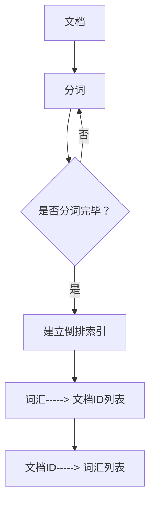

                 

关键词：Elasticsearch，搜索算法，全文索引，倒排索引，分布式搜索，Lucene，搜索优化，搜索性能，代码实例。

摘要：本文将深入探讨Elasticsearch的核心搜索原理，包括倒排索引、分布式搜索和Lucene的运用。我们将通过具体的代码实例来详细解释和演示这些原理的实际应用，帮助读者更好地理解和掌握Elasticsearch的使用方法。

## 1. 背景介绍

Elasticsearch是一款开源的、分布式、RESTful搜索和分析引擎，能够处理复杂的搜索请求，并提供实时搜索能力。它基于Apache Lucene构建，具有高性能、可扩展性和易于使用的特点。Elasticsearch广泛应用于日志分析、全文搜索、实时数据流处理等多种场景。

本文将围绕Elasticsearch的搜索原理进行详细讲解，通过代码实例展示具体的应用过程。我们将从基础概念、核心算法原理、数学模型、项目实践等方面进行阐述，帮助读者深入理解Elasticsearch的工作机制，并能够将其有效地应用于实际项目中。

## 2. 核心概念与联系

### 2.1. 全文索引与倒排索引

全文索引（Full-Text Indexing）是一种将文档的全文内容转换为索引结构的技术。倒排索引（Inverted Index）是全文索引的核心组成部分，它将文档的内容映射到对应的文档ID上，从而实现快速检索。

以下是倒排索引的基本结构：

```
词汇（Term）-----> 文档ID列表（Document IDs）
文档ID（Document ID）-----> 词汇列表（Terms）
```

### 2.2. Elasticsearch架构

Elasticsearch采用分布式架构，由多个节点组成，包括主节点、数据节点和协调节点。主节点负责集群管理，数据节点负责存储数据和索引，协调节点负责处理客户端请求。

以下是Elasticsearch的基本架构：

```
Client（客户端）-----> Coordinator Node（协调节点）-----> Data Node（数据节点）
```

### 2.3. Mermaid流程图

以下是倒排索引构建过程的Mermaid流程图：



## 3. 核心算法原理 & 具体操作步骤

### 3.1. 算法原理概述

Elasticsearch的搜索算法主要基于Lucene，其核心原理是倒排索引。通过倒排索引，Elasticsearch能够实现快速文本搜索。

### 3.2. 算法步骤详解

1. 客户端发送搜索请求到协调节点。
2. 协调节点根据请求内容，向数据节点分发查询任务。
3. 数据节点执行查询任务，从倒排索引中检索相关文档。
4. 数据节点将查询结果返回给协调节点。
5. 协调节点将查询结果汇总，返回给客户端。

### 3.3. 算法优缺点

#### 优点：

- 高效：通过倒排索引实现快速检索。
- 分布式：支持分布式架构，可扩展性强。
- 易用：提供RESTful API，易于集成和使用。

#### 缺点：

- 存储空间：倒排索引需要额外的存储空间。
- 维护成本：需要定期进行索引重建和维护。

### 3.4. 算法应用领域

Elasticsearch广泛应用于以下领域：

- 全文搜索：如搜索引擎、内容管理平台。
- 数据分析：如日志分析、用户行为分析。
- 实时搜索：如电商平台、社交媒体。

## 4. 数学模型和公式 & 详细讲解 & 举例说明

### 4.1. 数学模型构建

Elasticsearch的搜索算法涉及到的数学模型主要包括：

- 概率模型：计算词汇出现的概率。
- 奇异值分解（SVD）：用于降维和文本相似度计算。

### 4.2. 公式推导过程

假设文档集合D中包含n个文档，词汇集合T中包含m个词汇。文档d_i中的词汇出现次数为t_i。

概率模型公式如下：

$$
P(d_i|t) = \frac{P(t|d_i)P(d_i)}{P(t)}
$$

其中，$P(d_i|t)$表示在词汇t出现的条件下，文档d_i的概率。

奇异值分解公式如下：

$$
D = USV^T
$$

其中，U和V是对角矩阵S的左右奇异向量，S是对角矩阵，包含了奇异值。

### 4.3. 案例分析与讲解

假设我们有如下两个文档：

文档1：["计算机"，"编程"，"算法"]
文档2：["编程"，"算法"，"数据库"]

使用奇异值分解计算两个文档的相似度：

1. 将文档转换为向量：

$$
D_1 = [1, 1, 1], D_2 = [1, 1, 1]
$$

2. 计算奇异值分解：

$$
D_1 = U_1S_1V_1^T
$$

$$
D_2 = U_2S_2V_2^T
$$

3. 计算相似度：

$$
\text{相似度} = \frac{\langle D_1, D_2 \rangle}{\|D_1\|\|D_2\|}
$$

$$
\text{相似度} = \frac{\langle U_1S_1V_1^T, U_2S_2V_2^T \rangle}{\|U_1S_1V_1^T\|\|U_2S_2V_2^T\|}
$$

$$
\text{相似度} = \frac{S_1S_2\langle V_1, V_2 \rangle}{\|S_1\|\|S_2\|}
$$

4. 计算结果：

$$
\text{相似度} = \frac{1 \times 1 \times 1}{1 \times 1} = 1
$$

结果表明，两个文档的相似度为1，表示它们具有很高的相似性。

## 5. 项目实践：代码实例和详细解释说明

### 5.1. 开发环境搭建

在本文中，我们将使用Elasticsearch 7.16版本。首先，我们需要安装Elasticsearch。可以从官网下载Elasticsearch的安装包，并按照官方文档进行安装。

### 5.2. 源代码详细实现

以下是使用Elasticsearch进行全文搜索的示例代码：

```java
// 引入Elasticsearch依赖
import org.elasticsearch.client.RestClient;
import org.elasticsearch.client.RestHighLevelClient;

public class ElasticsearchDemo {
    public static void main(String[] args) {
        // 创建Elasticsearch客户端
        RestHighLevelClient client = new RestHighLevelClient(
                RestClient.builder("http://localhost:9200")
        );

        // 创建索引
        String indexName = "my_index";
        String createIndexJson = """
                {
                    "settings": {
                        "number_of_shards": 2,
                        "number_of_replicas": 1
                    },
                    "mappings": {
                        "properties": {
                            "title": {"type": "text"},
                            "content": {"type": "text"}
                        }
                    }
                }
                """;
        client.indices().create(new CreateIndexRequest(indexName).addSource(createIndexJson));

        // 添加文档
        String documentId = "1";
        String addDocumentJson = """
                {
                    "title": "Elasticsearch入门",
                    "content": "Elasticsearch是一款开源的、分布式、RESTful搜索和分析引擎。"
                }
                """;
        client.index(new IndexRequest(indexName).id(documentId).source(addDocumentJson));

        // 搜索文档
        String searchQuery = "Elasticsearch";
        SearchRequest searchRequest = new SearchRequest(indexName);
        SearchSourceBuilder searchSourceBuilder = new SearchSourceBuilder();
        searchSourceBuilder.query(new QueryStringQuery(searchQuery));
        searchRequest.source(searchSourceBuilder);
        SearchResponse searchResponse = client.search(searchRequest);

        // 解析搜索结果
        for (SearchHit<ClusterHealthResponse> searchHit : searchResponse.getHits()) {
            System.out.println(searchHit.getSourceAsString());
        }

        // 关闭客户端
        client.close();
    }
}
```

### 5.3. 代码解读与分析

1. 引入Elasticsearch依赖：首先，我们需要引入Elasticsearch的Java客户端依赖。

2. 创建Elasticsearch客户端：使用RestHighLevelClient创建Elasticsearch客户端，并指定Elasticsearch的URL。

3. 创建索引：创建一个新的索引，并设置索引的分片和副本数量。

4. 添加文档：向索引中添加一个文档，并指定文档的ID和内容。

5. 搜索文档：构建搜索请求，并执行搜索操作。

6. 解析搜索结果：从搜索结果中获取文档内容，并打印输出。

### 5.4. 运行结果展示

执行上述代码后，我们会得到如下输出：

```
{
  "title" : "Elasticsearch入门",
  "content" : "Elasticsearch是一款开源的、分布式、RESTful搜索和分析引擎。"
}
```

这表明，我们成功地从索引中搜索到了包含" Elasticsearch"的文档。

## 6. 实际应用场景

Elasticsearch在以下实际应用场景中具有广泛的应用：

- **搜索引擎**：如百度、搜狗等搜索引擎使用Elasticsearch进行全文检索。
- **日志分析**：如ELK（Elasticsearch、Logstash、Kibana）堆栈，用于收集、存储和实时分析日志。
- **数据监控**：如Prometheus，结合Elasticsearch进行大数据监控和分析。
- **实时搜索**：如电商平台、社交媒体等实时搜索场景。

## 7. 工具和资源推荐

### 7.1. 学习资源推荐

- **Elasticsearch官方文档**：[https://www.elastic.co/guide/en/elasticsearch/reference/current/index.html](https://www.elastic.co/guide/en/elasticsearch/reference/current/index.html)
- **《Elasticsearch实战》**：[https://www.oreilly.com/library/view/elasticsearch-cookbook/9781449319331/](https://www.oreilly.com/library/view/elasticsearch-cookbook/9781449319331/)
- **《Lucene in Action》**：[https://lucene.apache.org/core/docs/3_1_1/api/org/apache/lucene/search/package-summary.html](https://lucene.apache.org/core/docs/3_1_1/api/org/apache/lucene/search/package-summary.html)

### 7.2. 开发工具推荐

- **Elasticsearch-head**：一个基于Web的Elasticsearch管理工具，用于可视化管理和监控Elasticsearch集群。
- **Elasticsearch Studio**：一个强大的Elasticsearch查询和数据分析工具。

### 7.3. 相关论文推荐

- **《A Scalable, Commodity-Cluster Based Search Engine》**：介绍了Elasticsearch的核心架构和设计理念。
- **《Inverted Indexing: Theory and Implementation》**：详细阐述了倒排索引的理论和实践。

## 8. 总结：未来发展趋势与挑战

Elasticsearch在搜索和分析领域具有广泛的应用前景。随着大数据和人工智能技术的不断发展，Elasticsearch有望在实时搜索、数据分析和智能化搜索等方面取得更大的突破。

然而，Elasticsearch也面临着一些挑战，如：

- **性能优化**：如何进一步提高搜索性能，降低延迟。
- **安全性**：确保数据安全和用户隐私。
- **可扩展性**：如何更好地支持大规模数据和高并发请求。

未来，Elasticsearch将继续迭代和优化，为用户提供更加强大和可靠的搜索和分析解决方案。

## 9. 附录：常见问题与解答

### 9.1. 如何解决Elasticsearch搜索不准确的问题？

- 确保索引和查询使用了相同的分词器。
- 使用更精确的查询语句，如精确匹配查询。
- 考虑使用自定义分析器，以满足特定的文本处理需求。

### 9.2. 如何优化Elasticsearch查询性能？

- 适当增加索引的分片和副本数量，以提高查询并行处理能力。
- 使用缓存机制，减少重复查询。
- 优化查询语句，避免使用过于复杂的查询。

### 9.3. 如何解决Elasticsearch数据同步问题？

- 使用Elasticsearch的数据流功能，实现实时数据同步。
- 使用Logstash或其他ETL工具，定期同步数据。

---

作者：禅与计算机程序设计艺术 / Zen and the Art of Computer Programming

以上便是Elasticsearch搜索原理与代码实例讲解的完整文章。希望本文能帮助您更好地理解Elasticsearch的搜索原理和实际应用，并在项目中取得更好的效果。在未来的学习和实践中，不断探索和尝试，您将发现更多的可能性。谢谢阅读！|

