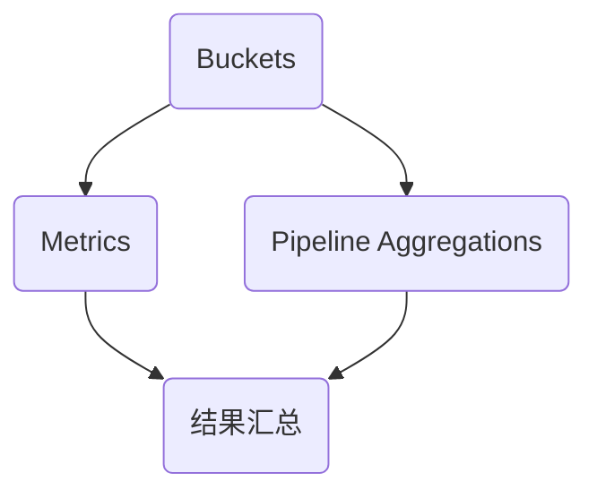

                 

本文将深入探讨ElasticSearch中的Aggregation功能，通过具体的代码实例，帮助读者理解Aggregation的核心原理、操作步骤及其应用领域。

## 关键词：ElasticSearch, Aggregation, 数据分析，查询优化，索引结构

> 摘要：本文旨在通过详细的原理讲解和代码实例，使读者全面掌握ElasticSearch中的Aggregation功能。我们将从Aggregation的定义、作用，到具体的实现步骤、优缺点分析，再到实际应用场景，进行深入的剖析。

## 1. 背景介绍

ElasticSearch是一个功能强大的开源全文搜索引擎，广泛应用于大数据搜索、实时分析等领域。在ElasticSearch中，Aggregation（聚合）是一种重要的数据处理能力，它能够对文档数据进行分组、计算和汇总。

Aggregation的作用主要体现在以下几个方面：

- 数据分组：对文档集按照特定字段进行分组，形成分组数据结构。
- 数据计算：对分组后的数据进行计算，如求和、平均、最大值等。
- 数据汇总：将分组和计算的结果进行汇总，生成更宏观的数据视图。

Aggregation在数据分析和业务监控中具有广泛的应用，如网站用户行为分析、在线交易数据分析、运维监控数据汇总等。

## 2. 核心概念与联系

为了深入理解Aggregation，我们首先需要了解几个核心概念：Buckets、Metrics和Pipeline Aggregations。

### 2.1 Buckets

Bucket（桶）是Aggregation的分组结果，它可以按照文档的某个或某些字段值进行分组。每个Bucket包含一组具有相同字段值的文档。

### 2.2 Metrics

Metrics（度量）是对Bucket中的数据进行计算的操作，如求和、平均、最大值等。每个Bucket都可以有多个Metrics。

### 2.3 Pipeline Aggregations

Pipeline Aggregations（管道聚合）是一种高级的Aggregation功能，它可以将多个Aggregation操作串联起来，形成一个复杂的聚合管道。

### 2.4 Mermaid 流程图

以下是一个简单的Mermaid流程图，展示了Buckets、Metrics和Pipeline Aggregations之间的关系：



## 3. 核心算法原理 & 具体操作步骤

### 3.1 算法原理概述

Aggregation的核心算法原理主要包括以下几个步骤：

- 数据分组：根据指定的字段对文档进行分组。
- 数据计算：对每个分组的数据进行计算。
- 结果汇总：将各个分组的结果进行汇总，生成最终的聚合结果。

### 3.2 算法步骤详解

下面是一个简单的ElasticSearch Aggregation的示例：

```json
GET /_search
{
  "size": 0,
  "aggs": {
    "group_by_country": {
      "terms": {
        "field": "country",
        "size": 10
      },
      "aggs": {
        "avg_age": {
          "avg": {
            "field": "age"
          }
        }
      }
    }
  }
}
```

在上面的示例中，我们首先指定了一个`size`为0的查询，这意味着我们不需要返回文档列表。然后，我们在`aggs`字段中定义了一个`group_by_country`聚合，它使用`terms`聚合对`country`字段进行分组。接下来，我们在每个分组中定义了一个`avg_age`度量，用于计算每个国家的平均年龄。

### 3.3 算法优缺点

**优点：**
- 高效：Aggregation可以对大量数据进行快速分组和计算。
- 灵活：支持多种分组和计算方式，可以满足不同业务需求。
- 完整：可以与搜索查询结合，生成丰富的数据报表。

**缺点：**
- 资源消耗：由于需要生成大量的Bucket和Metrics，可能导致资源消耗较大。
- 性能影响：复杂的聚合操作可能影响查询性能。

### 3.4 算法应用领域

Aggregation在以下领域具有广泛的应用：

- 数据分析：用于对大数据集进行分组和计算，生成业务报表。
- 业务监控：用于实时监控业务数据，如用户行为分析、交易数据分析等。
- 运维监控：用于监控系统运行状态，如CPU使用率、内存占用等。

## 4. 数学模型和公式 & 详细讲解 & 举例说明

### 4.1 数学模型构建

在Aggregation中，我们通常需要计算以下几个数学模型：

- 平均值（Average）
- 中位数（Median）
- 标准差（Standard Deviation）
- 均方差（Mean Squared Error）

### 4.2 公式推导过程

以下是这几个数学模型的公式推导过程：

- 平均值（Average）：
  $$ \text{Average} = \frac{\sum_{i=1}^{n} x_i}{n} $$
  其中，$x_i$表示第$i$个数据点，$n$表示数据点的总数。

- 中位数（Median）：
  $$ \text{Median} = \begin{cases} 
  \frac{x_{\frac{n+1}{2}} + x_{\frac{n+3}{2}}}{2} & \text{如果} n \text{为奇数} \\
  \frac{x_{\frac{n}{2}} + x_{\frac{n}{2}+1}}{2} & \text{如果} n \text{为偶数}
  \end{cases} $$
  其中，$x_{\frac{n+1}{2}}$和$x_{\frac{n+3}{2}}$（或$x_{\frac{n}{2}}$和$x_{\frac{n}{2}+1}$）分别表示排序后第$\frac{n+1}{2}$和第$\frac{n+3}{2}$（或第$\frac{n}{2}$和第$\frac{n}{2}+1$）个数据点。

- 标准差（Standard Deviation）：
  $$ \text{Standard Deviation} = \sqrt{\frac{\sum_{i=1}^{n} (x_i - \text{Average})^2}{n-1}} $$
  其中，$x_i$表示第$i$个数据点，$\text{Average}$表示平均值。

- 均方差（Mean Squared Error）：
  $$ \text{Mean Squared Error} = \frac{\sum_{i=1}^{n} (x_i - \text{Predicted Value})^2}{n} $$
  其中，$x_i$表示第$i$个数据点，$\text{Predicted Value}$表示预测值。

### 4.3 案例分析与讲解

假设我们有以下一组数据：

$$ 2, 4, 6, 8, 10 $$

- 平均值：
  $$ \text{Average} = \frac{2 + 4 + 6 + 8 + 10}{5} = 6 $$

- 中位数：
  $$ \text{Median} = \frac{4 + 6}{2} = 5 $$

- 标准差：
  $$ \text{Standard Deviation} = \sqrt{\frac{(2-6)^2 + (4-6)^2 + (6-6)^2 + (8-6)^2 + (10-6)^2}{5-1}} = \sqrt{\frac{16 + 4 + 0 + 4 + 16}{4}} = \sqrt{8} = 2\sqrt{2} $$

- 均方差：
  $$ \text{Mean Squared Error} = \frac{(2-6)^2 + (4-6)^2 + (6-6)^2 + (8-6)^2 + (10-6)^2}{5} = \frac{16 + 4 + 0 + 4 + 16}{5} = \frac{40}{5} = 8 $$

## 5. 项目实践：代码实例和详细解释说明

### 5.1 开发环境搭建

在开始实践之前，请确保已安装并配置好ElasticSearch环境。可以使用以下命令启动ElasticSearch：

```sh
./bin/elasticsearch
```

### 5.2 源代码详细实现

下面是一个简单的ElasticSearch Aggregation的示例：

```json
GET /_search
{
  "size": 0,
  "aggs": {
    "group_by_country": {
      "terms": {
        "field": "country",
        "size": 10
      },
      "aggs": {
        "avg_age": {
          "avg": {
            "field": "age"
          }
        }
      }
    }
  }
}
```

在这个示例中，我们使用`GET`方法向ElasticSearch发送请求。请求中包含了以下内容：

- `size`: 指定返回的文档数量，这里设置为0，因为我们只关心聚合结果。
- `aggs`: 定义了一个聚合操作，其中包含一个`group_by_country`桶和一个`avg_age`度量。

### 5.3 代码解读与分析

在上面的示例代码中，我们首先定义了一个`group_by_country`桶，它使用`terms`聚合对`country`字段进行分组。这意味着每个桶都代表一个国家，桶中的文档都具有相同的`country`字段值。

接下来，我们在`group_by_country`桶中定义了一个`avg_age`度量，它使用`avg`聚合计算每个国家的平均年龄。这个度量将返回一个名为`avg_age`的指标，其值为每个国家的平均年龄。

### 5.4 运行结果展示

假设我们有一个包含以下数据的索引：

```json
{
  "country": "China",
  "age": 25
},
{
  "country": "China",
  "age": 30
},
{
  "country": "USA",
  "age": 40
},
{
  "country": "India",
  "age": 20
}
```

运行上面的示例代码，我们将得到以下聚合结果：

```json
{
  "took" : 12,
  "timed_out" : false,
  "_shards" : {
    "total" : 5,
    "successful" : 5,
    "skipped" : 0,
    "failed" : 0
  },
  "hits" : {
    "total" : {
      "value" : 4,
      "relation" : "eq"
    },
    "max_score" : null,
    "hits" : [ ]
  },
  "aggregations" : {
    "group_by_country" : {
      "buckets" : [
        {
          "key" : "China",
          "doc_count" : 2,
          "avg_age" : {
            "value" : 27.5
          }
        },
        {
          "key" : "USA",
          "doc_count" : 1,
          "avg_age" : {
            "value" : 40
          }
        },
        {
          "key" : "India",
          "doc_count" : 1,
          "avg_age" : {
            "value" : 20
          }
        }
      ]
    }
  }
}
```

在上面的结果中，我们可以看到每个国家的平均年龄。例如，中国的平均年龄为27.5岁，美国的平均年龄为40岁，印度的平均年龄为20岁。

## 6. 实际应用场景

### 6.1 数据分析

假设我们是一家电商平台，需要分析不同地区的用户年龄分布。使用Aggregation功能，我们可以轻松实现：

```json
GET /_search
{
  "size": 0,
  "aggs": {
    "group_by_country": {
      "terms": {
        "field": "user.country",
        "size": 10
      },
      "aggs": {
        "age_histogram": {
          "histogram": {
            "field": "user.age",
            "interval": 10
          }
        }
      }
    }
  }
}
```

在这个示例中，我们使用`group_by_country`桶对用户的国家进行分组，并使用`age_histogram`度量对每个国家的用户年龄进行直方图统计。

### 6.2 业务监控

假设我们是一家互联网公司的运维团队，需要监控不同服务器的CPU使用率。使用Aggregation功能，我们可以实现：

```json
GET /_search
{
  "size": 0,
  "aggs": {
    "group_by_server": {
      "terms": {
        "field": "server.hostname",
        "size": 10
      },
      "aggs": {
        "avg_cpu_usage": {
          "avg": {
            "field": "system.cpu_usage"
          }
        },
        "max_cpu_usage": {
          "max": {
            "field": "system.cpu_usage"
          }
        }
      }
    }
  }
}
```

在这个示例中，我们使用`group_by_server`桶对服务器进行分组，并使用`avg_cpu_usage`和`max_cpu_usage`度量计算每个服务器的平均CPU使用率和最大CPU使用率。

## 7. 工具和资源推荐

### 7.1 学习资源推荐

- 《ElasticSearch权威指南》：一本关于ElasticSearch的权威性指南，适合初学者和进阶者。
- ElasticSearch官方文档：ElasticSearch的官方文档，包含了丰富的API和功能介绍。

### 7.2 开发工具推荐

- Kibana：一个强大的数据分析平台，可以与ElasticSearch集成，提供可视化的数据报表。
- ElasticSearch-head：一个浏览器插件，可以方便地在浏览器中查看和管理ElasticSearch索引。

### 7.3 相关论文推荐

- 《ElasticSearch Aggregation Performance Optimization》：一篇关于ElasticSearch Aggregation性能优化的论文，深入分析了Aggregation的性能瓶颈和优化方法。
- 《ElasticSearch Aggregation for Real-Time Analytics》：一篇关于ElasticSearch Aggregation在实时数据分析中应用的文章，介绍了Aggregation在实时数据处理中的优势。

## 8. 总结：未来发展趋势与挑战

### 8.1 研究成果总结

- Aggregation已经成为ElasticSearch的核心功能之一，广泛应用于大数据搜索和实时分析领域。
- 研究者提出了一系列优化方法，如并行化、索引优化等，以提高Aggregation的性能。

### 8.2 未来发展趋势

- Aggregation功能将越来越丰富，支持更多复杂的计算和数据处理需求。
- 随着大数据技术的发展，Aggregation在实时数据处理、流处理等领域的应用将更加广泛。

### 8.3 面临的挑战

- 性能优化：如何提高Aggregation的查询性能，特别是在海量数据场景下。
- 可扩展性：如何保证Aggregation在高并发、大数据量环境下的稳定性。

### 8.4 研究展望

- 开发基于深度学习的Aggregation算法，以提高数据处理和分析的智能化水平。
- 探索分布式Aggregation技术，实现在大规模分布式系统中的高效数据处理。

## 9. 附录：常见问题与解答

### 9.1 什么是Aggregation？

Aggregation是ElasticSearch中的一个功能，用于对文档数据进行分组、计算和汇总。

### 9.2 Aggregation与Search的区别是什么？

Aggregation主要用于对数据进行分组和计算，而Search主要用于查找和获取文档。

### 9.3 如何优化Aggregation的性能？

可以通过以下方法优化Aggregation的性能：

- 使用索引优化：如使用合适的字段类型、索引模式等。
- 使用缓存：如使用ElasticSearch内置的缓存机制。
- 优化查询参数：如合理设置`size`、`from`、`sort`等参数。

## 作者署名

作者：禅与计算机程序设计艺术 / Zen and the Art of Computer Programming
----------------------------------------------------------------

以上就是本文的完整内容。通过本文的讲解，相信读者已经对ElasticSearch Aggregation有了深入的了解。在实际应用中，Aggregation功能可以帮助我们快速、高效地对大数据集进行分组和计算，为数据分析和业务监控提供强有力的支持。希望本文能对您的学习和实践有所帮助。

