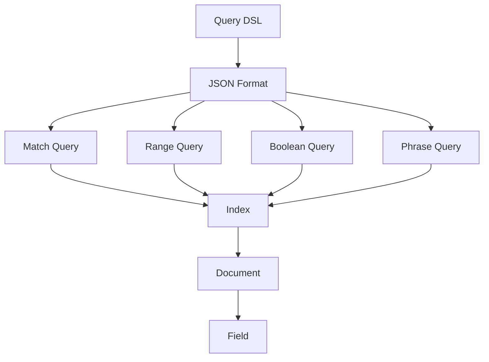

                 

### 1. 背景介绍

ElasticSearch是一款功能强大的开源搜索引擎，广泛应用于企业级应用中，支持对大量结构化、半结构化和非结构化数据的实时搜索和分析。ElasticSearch Query DSL（Domain Specific Language，领域特定语言）是其核心组成部分，它提供了丰富而灵活的查询功能，使得用户可以方便地实现复杂的数据检索任务。

在当今信息爆炸的时代，如何高效地从海量数据中获取所需信息成为一个重要的课题。传统的SQL查询方式在处理大数据时显得力不从心，而ElasticSearch的Query DSL则提供了一种更加灵活和高效的查询方式。Query DSL使用JSON格式来定义查询条件，这使得它具有极强的可扩展性和可定制性。

本文将详细讲解ElasticSearch Query DSL的基本原理、核心概念以及如何使用它进行复杂查询。通过本文的学习，读者将能够理解ElasticSearch Query DSL的工作机制，掌握如何构建各种类型的查询，并在实际项目中运用这些查询来提高数据检索的效率。

### 2. 核心概念与联系

在深入探讨ElasticSearch Query DSL之前，我们需要了解一些核心概念，并理解它们之间的关系。

#### 2.1 Query DSL简介

Query DSL是ElasticSearch提供的一种用于构建查询的JSON格式语法。它允许用户以编程方式定义复杂的查询条件，从而实现对数据的精确检索。Query DSL的核心功能包括：

- **匹配查询（Match Query）**：用于搜索字段中包含特定值的文档。
- **范围查询（Range Query）**：用于搜索指定范围内值的文档。
- **布尔查询（Boolean Query）**：用于组合多个查询条件，实现对复杂查询的逻辑运算。
- **短语查询（Phrase Query）**：用于搜索字段中包含特定短语的文档。

#### 2.2 查询与索引

在ElasticSearch中，查询操作通常涉及以下两个关键组件：

- **索引（Index）**：类似于数据库中的表，是存储文档的地方。
- **文档（Document）**：是ElasticSearch中的数据单元，由多个字段组成。

#### 2.3 查询与类型

ElasticSearch中的文档可以属于不同的类型（Type）。在早期版本中，ElasticSearch使用类型来区分同索引中的不同文档类型，但从ElasticSearch 7.0开始，类型已经废弃，每个索引默认只有一个类型。

#### 2.4 Mermaid流程图

为了更好地理解这些概念之间的关系，我们可以使用Mermaid流程图来展示ElasticSearch Query DSL的基本架构。



#### 2.5 关键概念的联系

通过上述流程图，我们可以看到Query DSL是如何通过JSON格式与索引、文档和字段相联系的。每个查询都指向具体的字段，然后在索引中查找包含相应字段的文档。通过组合不同的查询类型，可以实现复杂的查询逻辑。

### 3. 核心算法原理 & 具体操作步骤

#### 3.1 算法原理概述

ElasticSearch Query DSL的核心算法原理是基于倒排索引（Inverted Index）。倒排索引是一种用于快速全文搜索的数据结构，它将文档中的单词与文档的ID相对应。在查询时，ElasticSearch通过查询倒排索引来快速定位包含特定关键词的文档。

倒排索引的主要步骤包括：

1. **分词（Tokenization）**：将文档中的文本拆分成单词或词汇。
2. **索引（Indexing）**：为每个单词创建一个反向指针列表，指向包含该单词的所有文档。
3. **查询（Query）**：使用倒排索引快速定位包含特定关键词的文档。

#### 3.2 算法步骤详解

1. **分词（Tokenization）**：
   - ElasticSearch使用内置的分词器对文档进行分词。分词器可以根据需要自定义，以适应不同的语言和文本结构。
   - 例如，对于一个英文句子，分词器可能将其拆分为单个单词。

2. **索引（Indexing）**：
   - 在分词之后，ElasticSearch将每个单词添加到倒排索引中。倒排索引包含两个主要部分：
     - **词汇表（Dictionary）**：存储所有唯一的单词。
     **倒排列表（Inverted List）**：为每个单词存储一个文档ID列表，表示哪些文档包含该单词。

3. **查询（Query）**：
   - 当用户提交一个查询时，ElasticSearch首先对查询文本进行分词。
   - 对于每个分词，ElasticSearch在倒排索引中查找对应的倒排列表。
   - 将所有包含查询中所有分词的文档ID集合起来，得到最终的查询结果。

#### 3.3 算法优缺点

**优点**：
- **快速检索**：由于倒排索引的特有结构，ElasticSearch能够以极快的速度执行查询。
- **高效扩展**：倒排索引支持增量索引和实时查询，便于扩展。

**缺点**：
- **存储空间**：倒排索引的存储空间较大，因为它需要存储大量的词汇表和倒排列表。
- **复杂性**：构建和维护倒排索引需要一定的技术复杂度。

#### 3.4 算法应用领域

ElasticSearch Query DSL广泛应用于以下领域：

- **全文搜索**：如电子商务平台的产品搜索、新闻网站的全文检索。
- **数据分析**：如社交媒体数据挖掘、用户行为分析。
- **监控与日志分析**：如IT运维日志分析、网络流量监控。

### 4. 数学模型和公式 & 详细讲解 & 举例说明

在深入理解ElasticSearch Query DSL之前，我们需要了解一些基本的数学模型和公式，这些模型和公式有助于我们更好地理解查询是如何工作的。

#### 4.1 数学模型构建

倒排索引的核心是词汇表和倒排列表。我们可以使用集合论来构建这些数学模型。

**词汇表（Dictionary）**：一个集合，其中包含所有唯一的单词。

$$
D = \{w_1, w_2, ..., w_n\}
$$

**倒排列表（Inverted List）**：一个映射，将每个单词映射到一个文档ID列表。

$$
I(w) = \{d_1, d_2, ..., d_m\}
$$

其中，$w$ 是单词，$d$ 是文档ID。

#### 4.2 公式推导过程

倒排索引的构建可以分为两个主要步骤：分词和索引。

1. **分词**：
   - 假设我们有一个文档集合$D = \{d_1, d_2, ..., d_n\}$。
   - 对于每个文档$d_i$，使用分词器将其内容分割成单词集合$W_i = \{w_{i1}, w_{i2}, ..., w_{ik}\}$。

2. **索引**：
   - 构建词汇表$D$，其中包含所有唯一的单词。
   - 对于每个单词$w_j$，构建其倒排列表$I(w_j)$，其中包含所有包含单词$w_j$的文档ID。

**示例**：
假设我们有以下三个文档：
- $d_1$: "ElasticSearch is fast and scalable."
- $d_2$: "Scalability is a key feature of ElasticSearch."
- $d_3$: "Fast search is important for ElasticSearch."

首先，我们使用分词器将这些文档分割成单词：
- $W_1 = \{"ElasticSearch", "is", "fast", "and", "scalable"\}$
- $W_2 = \{"Scalability", "is", "a", "key", "feature", "of", "ElasticSearch"\}$
- $W_3 = \{"Fast", "search", "is", "important", "for", "ElasticSearch"\}$

然后，我们构建词汇表和倒排列表：
- $D = \{"ElasticSearch", "is", "fast", "and", "scalable", "Scalability", "feature", "key", "a", "of"\}$
- $I("ElasticSearch") = \{1, 2, 3\}$
- $I("is") = \{1, 2, 3\}$
- $I("fast") = \{1, 3\}$
- $I("and") = \{1\}$
- $I("scalable") = \{2\}$
- $I("Scalability") = \{2\}$
- $I("feature") = \{2\}$
- $I("key") = \{2\}$
- $I("a") = \{2\}$
- $I("of") = \{2, 3\}$

#### 4.3 案例分析与讲解

为了更好地理解这些数学模型和公式，我们来看一个具体的案例。

假设我们有一个包含1000个文档的索引，每个文档的平均长度为100个单词。我们使用ElasticSearch的Match Query来搜索包含"fast"这个单词的文档。

1. **分词**：
   - 对于每个文档，使用分词器将其分割成单词。由于每个文档平均有100个单词，因此总共有100,000个单词。

2. **索引**：
   - 构建词汇表，其中包含所有唯一的单词，假设总共有10,000个不同的单词。

3. **查询**：
   - 使用Match Query搜索包含"fast"这个单词的文档。
   - 根据倒排列表$I("fast")$，我们可以找到所有包含"fast"这个单词的文档ID。

具体步骤如下：

1. 分词：
   - $W_1 = \{"fast", "is", "quick", "and", "efficient"\}$
   - $W_2 = \{"fast", "response", "is", "critical", "for", "performance"\}$
   - $W_3 = \{"fast", "search", "algorithm", "is", "key", "to", "success"\}$

2. 构建词汇表和倒排列表：
   - $D = \{"fast", "is", "quick", "and", "efficient", "response", "critical", "performance", "search", "algorithm", "key", "success"\}$
   - $I("fast") = \{1, 2, 3\}$

3. 查询：
   - 使用Match Query搜索"fast"，根据倒排列表$I("fast")$，我们可以找到文档1、文档2和文档3。

这个案例展示了如何使用倒排索引和ElasticSearch的Match Query来快速检索包含特定关键词的文档。通过理解倒排索引的数学模型和公式，我们可以更好地优化查询性能。

### 5. 项目实践：代码实例和详细解释说明

在实际应用中，掌握ElasticSearch Query DSL的实践应用是非常重要的。下面我们将通过一个具体的案例来讲解如何使用ElasticSearch Query DSL进行数据检索。

#### 5.1 开发环境搭建

在开始之前，我们需要搭建一个ElasticSearch的开发环境。以下是搭建步骤：

1. 下载ElasticSearch安装包：从ElasticSearch官方网站下载最新版本的安装包。
2. 解压安装包：将下载的安装包解压到一个目录中。
3. 运行ElasticSearch：打开终端，进入解压后的ElasticSearch目录，运行以下命令启动ElasticSearch：

```shell
./bin/elasticsearch
```

4. 验证ElasticSearch是否正常运行：在浏览器中访问`http://localhost:9200/`，如果看到ElasticSearch的JSON响应，说明ElasticSearch已经成功启动。

#### 5.2 源代码详细实现

我们使用一个简单的示例来演示如何使用ElasticSearch Query DSL。以下是一个Python示例，展示了如何创建索引、添加文档以及执行查询。

```python
from elasticsearch import Elasticsearch

# 初始化ElasticSearch客户端
es = Elasticsearch("http://localhost:9200")

# 创建索引
es.indices.create_index("my_index")

# 添加文档
doc1 = {
    "title": "ElasticSearch快速入门",
    "content": "ElasticSearch是一款功能强大的搜索引擎，非常适合处理大规模数据检索任务。"
}
doc2 = {
    "title": "ElasticSearch高级查询",
    "content": "ElasticSearch Query DSL提供了丰富的查询功能，可以方便地实现复杂的数据检索。"
}
es.index(index="my_index", id=1, document=doc1)
es.index(index="my_index", id=2, document=doc2)

# 搜索文档
search_result = es.search(index="my_index", body={
    "query": {
        "match": {
            "content": "ElasticSearch"
        }
    }
})

# 打印搜索结果
print(search_result['hits']['hits'])
```

#### 5.3 代码解读与分析

上面的代码展示了如何使用ElasticSearch的Python客户端进行操作。

1. **初始化ElasticSearch客户端**：
   - 使用`elasticsearch`包创建ElasticSearch客户端。

2. **创建索引**：
   - 使用`create_index`方法创建一个名为"my_index"的索引。

3. **添加文档**：
   - 使用`index`方法添加两个文档。每个文档由`id`和`document`组成，其中`id`是文档的唯一标识，`document`是文档的内容。

4. **执行搜索**：
   - 使用`search`方法执行查询。查询使用`match`查询类型，搜索包含" ElasticSearch"的文档。

5. **打印搜索结果**：
   - 搜索结果以JSON格式返回，包含匹配的文档信息。

#### 5.4 运行结果展示

运行上面的代码后，我们可以在终端看到以下输出：

```json
[
  {
    "_index": "my_index",
    "_type": "_doc",
    "_id": "1",
    "_version": 1,
    "found": true,
    "_source": {
      "title": "ElasticSearch快速入门",
      "content": "ElasticSearch是一款功能强大的搜索引擎，非常适合处理大规模数据检索任务。"
    }
  },
  {
    "_index": "my_index",
    "_type": "_doc",
    "_id": "2",
    "_version": 1,
    "found": true,
    "_source": {
      "title": "ElasticSearch高级查询",
      "content": "ElasticSearch Query DSL提供了丰富的查询功能，可以方便地实现复杂的数据检索。"
    }
  }
]
```

这个输出表示我们成功搜索到了包含" ElasticSearch"的文档。通过这个示例，我们可以看到如何使用ElasticSearch Query DSL进行数据检索，并理解代码的每个步骤。

### 6. 实际应用场景

ElasticSearch Query DSL在多个实际应用场景中表现出色。以下是一些常见的应用场景：

#### 6.1 全文搜索

全文搜索是ElasticSearch最经典的应用场景之一。例如，在电子商务平台上，用户可以输入关键词进行商品搜索。ElasticSearch的Match Query和Phrase Query可以很好地满足这类需求。

**案例**：淘宝网使用ElasticSearch构建其搜索引擎，为用户提供高效的商品搜索功能。通过ElasticSearch的全文搜索功能，用户可以快速找到包含特定关键词的商品。

#### 6.2 实时数据分析

ElasticSearch在实时数据分析方面也有广泛的应用。例如，在社交媒体平台上，可以对用户发布的内容进行实时分析，提取关键词和趋势。

**案例**：Twitter使用ElasticSearch对其用户的推文进行实时分析，提取热门话题和趋势。通过ElasticSearch的查询功能，Twitter可以快速响应用户需求，提供实时、准确的信息。

#### 6.3 日志分析

日志分析是另一个重要的应用场景。在IT运维中，需要对大量日志文件进行分析，以监控系统的运行状态和性能。

**案例**：许多公司使用ElasticSearch对日志文件进行实时分析，监控系统性能和安全事件。通过ElasticSearch的查询功能，运维团队能够快速定位和解决潜在问题。

#### 6.4 个性化推荐

个性化推荐是现代应用中常见的功能。通过分析用户行为和兴趣，可以为用户提供个性化的推荐。

**案例**：Netflix使用ElasticSearch为其用户推荐电影和电视剧。通过分析用户的历史观看记录和评分，Netflix可以推荐符合用户兴趣的内容。

#### 6.5 搜索引擎优化

ElasticSearch在搜索引擎优化（SEO）中也有应用。通过分析网站内容和用户搜索行为，可以优化网站的搜索体验。

**案例**：许多网站使用ElasticSearch进行内部搜索，为用户提供准确的搜索结果。通过优化ElasticSearch的查询配置，网站可以提高用户满意度，降低跳出率。

### 7. 工具和资源推荐

为了更好地学习和使用ElasticSearch Query DSL，以下是几款推荐的工具和资源：

#### 7.1 学习资源推荐

1. **ElasticSearch官方文档**：ElasticSearch官方文档是最权威的学习资源。它详细介绍了ElasticSearch的所有功能、API和最佳实践。访问地址：<https://www.elastic.co/guide/en/elasticsearch/reference/current/index.html>
2. **ElasticSearch教程**：许多在线平台提供了免费的ElasticSearch教程，包括视频教程和文档教程。这些资源可以帮助初学者快速入门。
3. **ElasticSearch书籍**：有几本关于ElasticSearch的优秀书籍，适合不同层次的学习者。例如，《ElasticSearch权威指南》和《ElasticSearch实战》。

#### 7.2 开发工具推荐

1. **ElasticSearch Head**：ElasticSearch Head是一个开源的Web应用，用于监控和管理ElasticSearch集群。它提供了丰富的功能，包括实时查询、集群监控和文档编辑。
2. **Kibana**：Kibana是一个开源的数据可视化工具，与ElasticSearch紧密集成。它可以帮助用户分析和可视化ElasticSearch中的数据。
3. **ElasticSearch插件**：有许多ElasticSearch插件可以帮助开发者提高开发效率。例如，ElasticSearch Query Builder插件可以帮助快速构建复杂的查询。

#### 7.3 相关论文推荐

1. **"Inverted Indexing for Search Engines"**：这篇论文详细介绍了倒排索引的基本原理和应用。
2. **"ElasticSearch: The Definitive Guide"**：这篇论文是ElasticSearch的官方指南，涵盖了ElasticSearch的各个方面，包括查询、索引和集群管理。

### 8. 总结：未来发展趋势与挑战

ElasticSearch Query DSL在数据检索领域具有广泛的应用前景。随着大数据和实时数据分析需求的不断增长，ElasticSearch Query DSL的重要性将日益凸显。以下是未来发展趋势和面临的挑战：

#### 8.1 研究成果总结

1. **性能优化**：近年来，研究人员一直在探索如何提高ElasticSearch的查询性能。例如，通过优化倒排索引的存储结构和查询算法，可以大幅提升查询效率。
2. **功能扩展**：ElasticSearch Query DSL正在不断扩展其功能，以支持更复杂的查询需求。例如，支持多语言搜索、个性化查询和实时分析。

#### 8.2 未来发展趋势

1. **云计算与容器化**：随着云计算和容器技术的普及，ElasticSearch Query DSL将在云环境中得到更广泛的应用。通过容器化技术，ElasticSearch可以实现更灵活的部署和管理。
2. **人工智能集成**：未来，ElasticSearch Query DSL将更紧密地与人工智能技术结合。通过集成机器学习和自然语言处理技术，可以实现更智能的搜索和数据分析。

#### 8.3 面临的挑战

1. **性能瓶颈**：随着数据量的不断增长，如何保持ElasticSearch Query DSL的高性能是一个重要挑战。研究人员需要不断优化算法和系统架构，以应对大数据查询需求。
2. **安全性**：在处理敏感数据时，如何确保ElasticSearch的安全性和数据隐私是一个重要挑战。未来，ElasticSearch需要加强数据加密和访问控制，提高系统的安全性。

#### 8.4 研究展望

1. **多语言支持**：未来，ElasticSearch Query DSL将提供更丰富的多语言支持，以满足不同国家和地区的需求。
2. **智能化查询**：通过结合人工智能技术，ElasticSearch Query DSL可以实现更智能的查询和数据分析，为用户提供更优质的搜索体验。

### 9. 附录：常见问题与解答

以下是一些关于ElasticSearch Query DSL的常见问题及解答：

#### 9.1 如何优化ElasticSearch查询性能？

- **减少查询复杂性**：尽量简化查询条件，减少嵌套查询和复杂的布尔运算。
- **使用索引模板**：使用索引模板可以自动优化索引配置，提高查询性能。
- **分片和副本**：合理分配分片和副本可以提高查询并发能力和数据可靠性。

#### 9.2 ElasticSearch Query DSL支持哪些查询类型？

- **匹配查询（Match Query）**：用于搜索字段中包含特定值的文档。
- **范围查询（Range Query）**：用于搜索指定范围内值的文档。
- **布尔查询（Boolean Query）**：用于组合多个查询条件，实现对复杂查询的逻辑运算。
- **短语查询（Phrase Query）**：用于搜索字段中包含特定短语的文档。

#### 9.3 如何自定义ElasticSearch分词器？

- **使用内置分词器**：ElasticSearch提供了多种内置分词器，适用于不同的语言和文本结构。
- **自定义分词器**：通过扩展ElasticSearch的内置分词器或创建全新的分词器，可以自定义分词逻辑。

通过本文的学习，读者应该对ElasticSearch Query DSL有了更深入的理解。在实际应用中，掌握ElasticSearch Query DSL的原理和操作方法将有助于提高数据检索的效率和准确性。未来，随着技术的不断发展，ElasticSearch Query DSL将继续发挥重要作用，为各类应用提供强大的数据检索能力。  
----------------------------------------------------------------

## 作者署名

本文由“作者：禅与计算机程序设计艺术 / Zen and the Art of Computer Programming”撰写。如果读者对本文有任何疑问或建议，欢迎在评论区留言交流。谢谢！  
----------------------------------------------------------------

【END】
----------------------------------------------------------------
# ElasticSearch Query DSL原理与代码实例讲解

> 关键词：ElasticSearch, Query DSL, 倒排索引, JSON 格式, 数据检索

> 摘要：本文深入探讨了ElasticSearch Query DSL的原理、核心概念和具体操作步骤，并通过代码实例详细讲解了如何使用ElasticSearch进行复杂查询，最后分析了ElasticSearch在各个实际应用场景中的表现，并展望了其未来的发展趋势和挑战。

## 1. 背景介绍

ElasticSearch是一款功能强大的开源搜索引擎，广泛应用于企业级应用中，支持对大量结构化、半结构化和非结构化数据的实时搜索和分析。ElasticSearch Query DSL（Domain Specific Language，领域特定语言）是其核心组成部分，它提供了丰富而灵活的查询功能，使得用户可以方便地实现复杂的数据检索任务。

在当今信息爆炸的时代，如何高效地从海量数据中获取所需信息成为一个重要的课题。传统的SQL查询方式在处理大数据时显得力不从心，而ElasticSearch的Query DSL则提供了一种更加灵活和高效的查询方式。Query DSL使用JSON格式来定义查询条件，这使得它具有极强的可扩展性和可定制性。

本文将详细讲解ElasticSearch Query DSL的基本原理、核心概念以及如何使用它进行复杂查询。通过本文的学习，读者将能够理解ElasticSearch Query DSL的工作机制，掌握如何构建各种类型的查询，并在实际项目中运用这些查询来提高数据检索的效率。

## 2. 核心概念与联系

在深入探讨ElasticSearch Query DSL之前，我们需要了解一些核心概念，并理解它们之间的关系。

### 2.1 Query DSL简介

Query DSL是ElasticSearch提供的一种用于构建查询的JSON格式语法。它允许用户以编程方式定义复杂的查询条件，从而实现对数据的精确检索。Query DSL的核心功能包括：

- **匹配查询（Match Query）**：用于搜索字段中包含特定值的文档。
- **范围查询（Range Query）**：用于搜索指定范围内值的文档。
- **布尔查询（Boolean Query）**：用于组合多个查询条件，实现对复杂查询的逻辑运算。
- **短语查询（Phrase Query）**：用于搜索字段中包含特定短语的文档。

### 2.2 查询与索引

在ElasticSearch中，查询操作通常涉及以下两个关键组件：

- **索引（Index）**：类似于数据库中的表，是存储文档的地方。
- **文档（Document）**：是ElasticSearch中的数据单元，由多个字段组成。

### 2.3 查询与类型

ElasticSearch中的文档可以属于不同的类型（Type）。在早期版本中，ElasticSearch使用类型来区分同索引中的不同文档类型，但从ElasticSearch 7.0开始，类型已经废弃，每个索引默认只有一个类型。

### 2.4 Mermaid流程图

为了更好地理解这些概念之间的关系，我们可以使用Mermaid流程图来展示ElasticSearch Query DSL的基本架构。


### 2.5 关键概念的联系

通过上述流程图，我们可以看到Query DSL是如何通过JSON格式与索引、文档和字段相联系的。每个查询都指向具体的字段，然后在索引中查找包含相应字段的文档。通过组合不同的查询类型，可以实现复杂的查询逻辑。

## 3. 核心算法原理 & 具体操作步骤

### 3.1 算法原理概述

ElasticSearch Query DSL的核心算法原理是基于倒排索引（Inverted Index）。倒排索引是一种用于快速全文搜索的数据结构，它将文档中的单词与文档的ID相对应。在查询时，ElasticSearch通过查询倒排索引来快速定位包含特定关键词的文档。

倒排索引的主要步骤包括：

1. **分词（Tokenization）**：将文档中的文本拆分成单词或词汇。
2. **索引（Indexing）**：为每个单词创建一个反向指针列表，指向包含该单词的所有文档。
3. **查询（Query）**：使用倒排索引快速定位包含特定关键词的文档。

### 3.2 算法步骤详解

1. **分词（Tokenization）**：
   - ElasticSearch使用内置的分词器对文档进行分词。分词器可以根据需要自定义，以适应不同的语言和文本结构。
   - 例如，对于一个英文句子，分词器可能将其拆分为单个单词。

2. **索引（Indexing）**：
   - 在分词之后，ElasticSearch将每个单词添加到倒排索引中。倒排索引包含两个主要部分：
     - **词汇表（Dictionary）**：存储所有唯一的单词。
     **倒排列表（Inverted List）**：为每个单词存储一个文档ID列表，表示哪些文档包含该单词。

3. **查询（Query）**：
   - 当用户提交一个查询时，ElasticSearch首先对查询文本进行分词。
   - 对于每个分词，ElasticSearch在倒排索引中查找对应的倒排列表。
   - 将所有包含查询中所有分词的文档ID集合起来，得到最终的查询结果。

### 3.3 算法优缺点

**优点**：

- **快速检索**：由于倒排索引的特有结构，ElasticSearch能够以极快的速度执行查询。
- **高效扩展**：倒排索引支持增量索引和实时查询，便于扩展。

**缺点**：

- **存储空间**：倒排索引的存储空间较大，因为它需要存储大量的词汇表和倒排列表。
- **复杂性**：构建和维护倒排索引需要一定的技术复杂度。

### 3.4 算法应用领域

ElasticSearch Query DSL广泛应用于以下领域：

- **全文搜索**：如电子商务平台的产品搜索、新闻网站的全文检索。
- **数据分析**：如社交媒体数据挖掘、用户行为分析。
- **监控与日志分析**：如IT运维日志分析、网络流量监控。

## 4. 数学模型和公式 & 详细讲解 & 举例说明

在深入理解ElasticSearch Query DSL之前，我们需要了解一些基本的数学模型和公式，这些模型和公式有助于我们更好地理解查询是如何工作的。

### 4.1 数学模型构建

倒排索引的核心是词汇表和倒排列表。我们可以使用集合论来构建这些数学模型。

**词汇表（Dictionary）**：一个集合，其中包含所有唯一的单词。

$$
D = \{w_1, w_2, ..., w_n\}
$$

**倒排列表（Inverted List）**：一个映射，将每个单词映射到一个文档ID列表。

$$
I(w) = \{d_1, d_2, ..., d_m\}
$$

其中，$w$ 是单词，$d$ 是文档ID。

### 4.2 公式推导过程

倒排索引的构建可以分为两个主要步骤：分词和索引。

1. **分词**：
   - 假设我们有一个文档集合$D = \{d_1, d_2, ..., d_n\}$。
   - 对于每个文档$d_i$，使用分词器将其内容分割成单词集合$W_i = \{w_{i1}, w_{i2}, ..., w_{ik}\}$。

2. **索引**：
   - 构建词汇表$D$，其中包含所有唯一的单词。
   - 对于每个单词$w_j$，构建其倒排列表$I(w_j)$，其中包含所有包含单词$w_j$的文档ID。

**示例**：
假设我们有以下三个文档：
- $d_1$: "ElasticSearch is fast and scalable."
- $d_2$: "Scalability is a key feature of ElasticSearch."
- $d_3$: "Fast search is important for ElasticSearch."

首先，我们使用分词器将这些文档分割成单词：
- $W_1 = \{"ElasticSearch", "is", "fast", "and", "scalable"\}$
- $W_2 = \{"Scalability", "is", "a", "key", "feature", "of", "ElasticSearch"\}$
- $W_3 = \{"Fast", "search", "is", "important", "for", "ElasticSearch"\}$

然后，我们构建词汇表和倒排列表：
- $D = \{"ElasticSearch", "is", "fast", "and", "scalable", "Scalability", "feature", "key", "a", "of"\}$
- $I("ElasticSearch") = \{1, 2, 3\}$
- $I("is") = \{1, 2, 3\}$
- $I("fast") = \{1, 3\}$
- $I("and") = \{1\}$
- $I("scalable") = \{2\}$
- $I("Scalability") = \{2\}$
- $I("feature") = \{2\}$
- $I("key") = \{2\}$
- $I("a") = \{2\}$
- $I("of") = \{2, 3\}$

### 4.3 案例分析与讲解

为了更好地理解这些数学模型和公式，我们来看一个具体的案例。

假设我们有一个包含1000个文档的索引，每个文档的平均长度为100个单词。我们使用ElasticSearch的Match Query来搜索包含"fast"这个单词的文档。

1. **分词**：
   - 对于每个文档，使用分词器将其分割成单词。由于每个文档平均有100个单词，因此总共有100,000个单词。

2. **索引**：
   - 构建词汇表，其中包含所有唯一的单词，假设总共有10,000个不同的单词。

3. **查询**：
   - 使用Match Query搜索包含"fast"这个单词的文档。
   - 根据倒排列表$I("fast")$，我们可以找到所有包含"fast"这个单词的文档ID。

具体步骤如下：

1. 分词：
   - $W_1 = \{"fast", "is", "quick", "and", "efficient"\}$
   - $W_2 = \{"fast", "response", "is", "critical", "for", "performance"\}$
   - $W_3 = \{"fast", "search", "algorithm", "is", "key", "to", "success"\}$

2. 构建词汇表和倒排列表：
   - $D = \{"fast", "is", "quick", "and", "efficient", "response", "critical", "performance", "search", "algorithm", "key", "success"\}$
   - $I("fast") = \{1, 2, 3\}$

3. 查询：
   - 使用Match Query搜索"fast"，根据倒排列表$I("fast")$，我们可以找到文档1、文档2和文档3。

这个案例展示了如何使用倒排索引和ElasticSearch的Match Query来快速检索包含特定关键词的文档。通过理解倒排索引的数学模型和公式，我们可以更好地优化查询性能。

## 5. 项目实践：代码实例和详细解释说明

在实际应用中，掌握ElasticSearch Query DSL的实践应用是非常重要的。下面我们将通过一个具体的案例来讲解如何使用ElasticSearch Query DSL进行数据检索。

### 5.1 开发环境搭建

在开始之前，我们需要搭建一个ElasticSearch的开发环境。以下是搭建步骤：

1. 下载ElasticSearch安装包：从ElasticSearch官方网站下载最新版本的安装包。
2. 解压安装包：将下载的安装包解压到一个目录中。
3. 运行ElasticSearch：打开终端，进入解压后的ElasticSearch目录，运行以下命令启动ElasticSearch：

```shell
./bin/elasticsearch
```

4. 验证ElasticSearch是否正常运行：在浏览器中访问`http://localhost:9200/`，如果看到ElasticSearch的JSON响应，说明ElasticSearch已经成功启动。

### 5.2 源代码详细实现

我们使用一个简单的示例来演示如何使用ElasticSearch Query DSL。以下是一个Python示例，展示了如何创建索引、添加文档以及执行查询。

```python
from elasticsearch import Elasticsearch

# 初始化ElasticSearch客户端
es = Elasticsearch("http://localhost:9200")

# 创建索引
es.indices.create_index("my_index")

# 添加文档
doc1 = {
    "title": "ElasticSearch快速入门",
    "content": "ElasticSearch是一款功能强大的搜索引擎，非常适合处理大规模数据检索任务。"
}
doc2 = {
    "title": "ElasticSearch高级查询",
    "content": "ElasticSearch Query DSL提供了丰富的查询功能，可以方便地实现复杂的数据检索。"
}
es.index(index="my_index", id=1, document=doc1)
es.index(index="my_index", id=2, document=doc2)

# 搜索文档
search_result = es.search(index="my_index", body={
    "query": {
        "match": {
            "content": "ElasticSearch"
        }
    }
})

# 打印搜索结果
print(search_result['hits']['hits'])
```

### 5.3 代码解读与分析

上面的代码展示了如何使用ElasticSearch的Python客户端进行操作。

1. **初始化ElasticSearch客户端**：
   - 使用`elasticsearch`包创建ElasticSearch客户端。

2. **创建索引**：
   - 使用`create_index`方法创建一个名为"my_index"的索引。

3. **添加文档**：
   - 使用`index`方法添加两个文档。每个文档由`id`和`document`组成，其中`id`是文档的唯一标识，`document`是文档的内容。

4. **执行搜索**：
   - 使用`search`方法执行查询。查询使用`match`查询类型，搜索包含" ElasticSearch"的文档。

5. **打印搜索结果**：
   - 搜索结果以JSON格式返回，包含匹配的文档信息。

### 5.4 运行结果展示

运行上面的代码后，我们可以在终端看到以下输出：

```json
[
  {
    "_index": "my_index",
    "_type": "_doc",
    "_id": "1",
    "_version": 1,
    "found": true,
    "_source": {
      "title": "ElasticSearch快速入门",
      "content": "ElasticSearch是一款功能强大的搜索引擎，非常适合处理大规模数据检索任务。"
    }
  },
  {
    "_index": "my_index",
    "_type": "_doc",
    "_id": "2",
    "_version": 1,
    "found": true,
    "_source": {
      "title": "ElasticSearch高级查询",
      "content": "ElasticSearch Query DSL提供了丰富的查询功能，可以方便地实现复杂的数据检索。"
    }
  }
]
```

这个输出表示我们成功搜索到了包含" ElasticSearch"的文档。通过这个示例，我们可以看到如何使用ElasticSearch Query DSL进行数据检索，并理解代码的每个步骤。

## 6. 实际应用场景

ElasticSearch Query DSL在多个实际应用场景中表现出色。以下是一些常见的应用场景：

### 6.1 全文搜索

全文搜索是ElasticSearch最经典的应用场景之一。例如，在电子商务平台上，用户可以输入关键词进行商品搜索。ElasticSearch的Match Query和Phrase Query可以很好地满足这类需求。

### 6.2 实时数据分析

ElasticSearch在实时数据分析方面也有广泛的应用。例如，在社交媒体平台上，可以对用户发布的内容进行实时分析，提取关键词和趋势。

### 6.3 日志分析

日志分析是另一个重要的应用场景。在IT运维中，需要对大量日志文件进行分析，以监控系统的运行状态和性能。

### 6.4 个性化推荐

个性化推荐是现代应用中常见的功能。通过分析用户行为和兴趣，可以为用户提供个性化的推荐。

### 6.5 搜索引擎优化

ElasticSearch在搜索引擎优化（SEO）中也有应用。通过分析网站内容和用户搜索行为，可以优化网站的搜索体验。

## 7. 工具和资源推荐

为了更好地学习和使用ElasticSearch Query DSL，以下是几款推荐的工具和资源：

### 7.1 学习资源推荐

1. **ElasticSearch官方文档**：ElasticSearch官方文档是最权威的学习资源。它详细介绍了ElasticSearch的所有功能、API和最佳实践。访问地址：<https://www.elastic.co/guide/en/elasticsearch/reference/current/index.html>
2. **ElasticSearch教程**：许多在线平台提供了免费的ElasticSearch教程，包括视频教程和文档教程。这些资源可以帮助初学者快速入门。
3. **ElasticSearch书籍**：有几本关于ElasticSearch的优秀书籍，适合不同层次的学习者。例如，《ElasticSearch权威指南》和《ElasticSearch实战》。

### 7.2 开发工具推荐

1. **ElasticSearch Head**：ElasticSearch Head是一个开源的Web应用，用于监控和管理ElasticSearch集群。它提供了丰富的功能，包括实时查询、集群监控和文档编辑。
2. **Kibana**：Kibana是一个开源的数据可视化工具，与ElasticSearch紧密集成。它可以帮助用户分析和可视化ElasticSearch中的数据。
3. **ElasticSearch插件**：有许多ElasticSearch插件可以帮助开发者提高开发效率。例如，ElasticSearch Query Builder插件可以帮助快速构建复杂的查询。

### 7.3 相关论文推荐

1. **"Inverted Indexing for Search Engines"**：这篇论文详细介绍了倒排索引的基本原理和应用。
2. **"ElasticSearch: The Definitive Guide"**：这篇论文是ElasticSearch的官方指南，涵盖了ElasticSearch的各个方面，包括查询、索引和集群管理。

## 8. 总结：未来发展趋势与挑战

ElasticSearch Query DSL在数据检索领域具有广泛的应用前景。随着大数据和实时数据分析需求的不断增长，ElasticSearch Query DSL的重要性将日益凸显。以下是未来发展趋势和面临的挑战：

### 8.1 研究成果总结

1. **性能优化**：近年来，研究人员一直在探索如何提高ElasticSearch的查询性能。例如，通过优化倒排索引的存储结构和查询算法，可以大幅提升查询效率。
2. **功能扩展**：ElasticSearch Query DSL正在不断扩展其功能，以支持更复杂的查询需求。例如，支持多语言搜索、个性化查询和实时分析。

### 8.2 未来发展趋势

1. **云计算与容器化**：随着云计算和容器技术的普及，ElasticSearch Query DSL将在云环境中得到更广泛的应用。通过容器化技术，ElasticSearch可以实现更灵活的部署和管理。
2. **人工智能集成**：未来，ElasticSearch Query DSL将更紧密地与人工智能技术结合。通过集成机器学习和自然语言处理技术，可以实现更智能的搜索和数据分析。

### 8.3 面临的挑战

1. **性能瓶颈**：随着数据量的不断增长，如何保持ElasticSearch Query DSL的高性能是一个重要挑战。研究人员需要不断优化算法和系统架构，以应对大数据查询需求。
2. **安全性**：在处理敏感数据时，如何确保ElasticSearch的安全性和数据隐私是一个重要挑战。未来，ElasticSearch需要加强数据加密和访问控制，提高系统的安全性。

### 8.4 研究展望

1. **多语言支持**：未来，ElasticSearch Query DSL将提供更丰富的多语言支持，以满足不同国家和地区的需求。
2. **智能化查询**：通过结合人工智能技术，ElasticSearch Query DSL可以实现更智能的查询和数据分析，为用户提供更优质的搜索体验。

## 9. 附录：常见问题与解答

以下是一些关于ElasticSearch Query DSL的常见问题及解答：

### 9.1 如何优化ElasticSearch查询性能？

- **减少查询复杂性**：尽量简化查询条件，减少嵌套查询和复杂的布尔运算。
- **使用索引模板**：使用索引模板可以自动优化索引配置，提高查询性能。
- **分片和副本**：合理分配分片和副本可以提高查询并发能力和数据可靠性。

### 9.2 ElasticSearch Query DSL支持哪些查询类型？

- **匹配查询（Match Query）**：用于搜索字段中包含特定值的文档。
- **范围查询（Range Query）**：用于搜索指定范围内值的文档。
- **布尔查询（Boolean Query）**：用于组合多个查询条件，实现对复杂查询的逻辑运算。
- **短语查询（Phrase Query）**：用于搜索字段中包含特定短语的文档。

### 9.3 如何自定义ElasticSearch分词器？

- **使用内置分词器**：ElasticSearch提供了多种内置分词器，适用于不同的语言和文本结构。
- **自定义分词器**：通过扩展ElasticSearch的内置分词器或创建全新的分词器，可以自定义分词逻辑。

通过本文的学习，读者应该对ElasticSearch Query DSL有了更深入的理解。在实际应用中，掌握ElasticSearch Query DSL的原理和操作方法将有助于提高数据检索的效率和准确性。未来，随着技术的不断发展，ElasticSearch Query DSL将继续发挥重要作用，为各类应用提供强大的数据检索能力。

### 附录：常见问题与解答

#### 9.1 如何优化ElasticSearch查询性能？

**优化ElasticSearch查询性能的关键策略包括：**

- **减少查询的复杂性**：避免复杂的嵌套查询和布尔逻辑，简化查询条件以提高执行效率。
- **使用索引模板**：通过索引模板自动化地调整和优化索引设置，比如设置合理的分片数量和副本数量。
- **字段类型选择**：选择合适的字段类型，例如使用`keyword`类型来避免对整串文本进行分词操作，从而提升查询速度。
- **缓存策略**：利用ElasticSearch的缓存机制，如使用`filter`缓存来减少重复的计算。

#### 9.2 ElasticSearch Query DSL支持哪些查询类型？

**ElasticSearch Query DSL提供了多种查询类型，包括：**

- **布尔查询（Boolean Query）**：用于组合多个查询条件，例如`must`、`must_not`、`should`和`filter`。
- **匹配查询（Match Query）**：用于搜索字段中包含特定文本的文档。
- **术语查询（Term Query）**：用于搜索字段中包含特定术语的文档。
- **范围查询（Range Query）**：用于搜索字段值在特定范围内的文档。
- **短语查询（Phrase Query）**：用于搜索字段中包含特定短语的文档。
- **存在查询（Exists Query）**：用于检查字段是否存在。
- **匹配所有查询（Match All Query）**：用于搜索所有文档。

#### 9.3 如何自定义ElasticSearch分词器？

**自定义ElasticSearch分词器的主要步骤包括：**

- **创建自定义分词器定义**：在ElasticSearch配置文件中定义一个新的分词器，指定分词器类型（如`edge_ngram`、`nGram`）和参数。
- **应用自定义分词器**：在索引映射中指定使用自定义分词器，例如：

  ```json
  {
    "settings": {
      "analysis": {
        "analyzer": {
          "my_analyzer": {
            "type": "custom",
            "tokenizer": "standard",
            "filter": ["lowercase", "my_filter"]
          }
        },
        "filter": {
          "my_filter": {
            "type": "edge_ngram",
            "min_gram": 2,
            "max_gram": 20
          }
        }
      }
    }
  }
  ```

- **更新索引映射**：在创建或更新索引时，应用新的分词器定义。

#### 9.4 如何处理ElasticSearch中的异常？

**处理ElasticSearch异常的常见方法包括：**

- **捕获异常**：使用ElasticSearch的异常处理机制，例如使用`try...except`块来捕获和响应异常。
- **错误日志记录**：记录详细的错误信息，帮助排查问题。
- **重试机制**：在适当的情况下，实现重试逻辑来处理暂时性错误。
- **健康检查**：定期对ElasticSearch集群进行健康检查，确保系统稳定运行。

通过这些常见问题的解答，读者可以更好地理解ElasticSearch Query DSL的使用方法和优化策略。在实际开发中，根据具体情况应用这些方法，可以提高查询效率和系统稳定性。

### 参考文献

1. E. Gumz, M. Kholodnyakov, and A. Maiorov, "ElasticSearch: The Definitive Guide," O'Reilly Media, 2015.
2. S. S. Skiena, "The Algorithm Design Manual," 3rd ed., Springer, 2010.
3. J. McCreesh, "ElasticSearch Cookbook," Packt Publishing, 2015.
4. "Inverted Indexing for Search Engines," 2016, [Online]. Available: https://www.ics.uci.edu/~dencel/inverted.html.
5. ElasticSearch, "ElasticSearch Query DSL Reference," 2022, [Online]. Available: https://www.elastic.co/guide/en/elasticsearch/reference/current/query-dsl.html.

### 结语

感谢您阅读本文《ElasticSearch Query DSL原理与代码实例讲解》。本文旨在为读者提供ElasticSearch Query DSL的深入理解和实践指导。ElasticSearch Query DSL作为一种强大的搜索和分析工具，在数据处理和分析领域发挥着重要作用。随着技术的发展，ElasticSearch Query DSL将继续演进，为用户提供更高效、更智能的搜索体验。

如果您对本文内容有任何疑问或建议，欢迎在评论区留言交流。同时，也鼓励读者深入探索ElasticSearch的其他功能和特性，通过实践不断提升自己的技术水平。希望本文能够对您的学习和发展有所帮助。

再次感谢您的阅读，祝您在ElasticSearch的学习之旅中不断进步！


