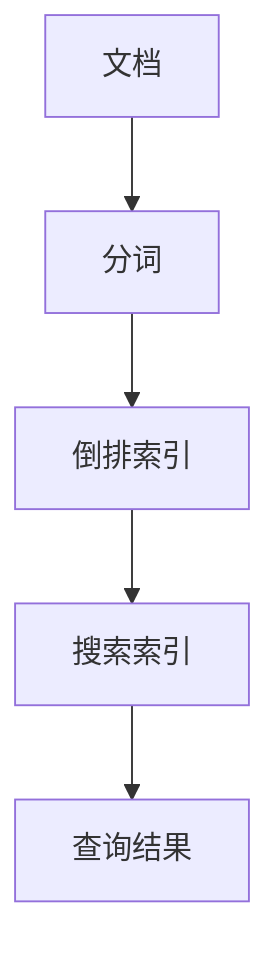
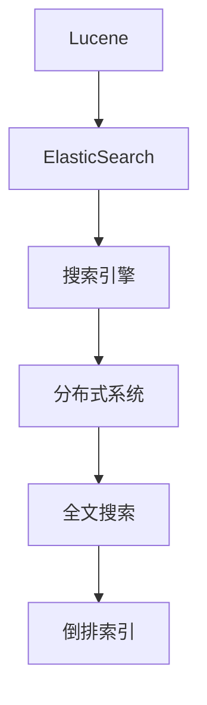
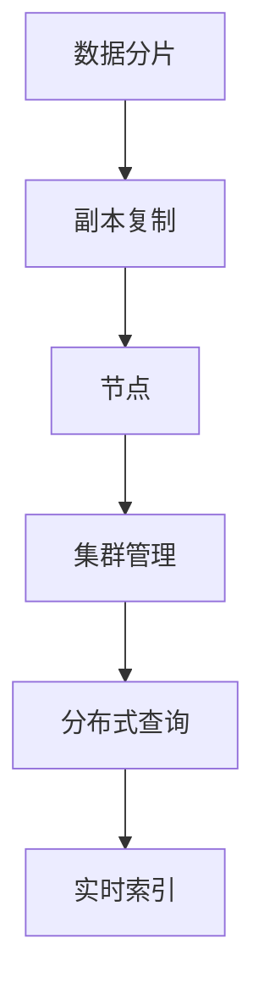

                 

 
### 关键词 Keywords ###
ElasticSearch, 搜索引擎，分布式系统，倒排索引，Lucene，全文搜索，文档存储，实时查询，扩展性，集群管理，分析器，RESTful API。

### 摘要 Summary ###
本文将深入探讨ElasticSearch的核心原理，包括其架构、倒排索引技术、分布式存储与查询机制。我们将通过详细的代码实例展示ElasticSearch的使用方法，并提供实际应用场景和未来发展趋势的分析。

## 1. 背景介绍

ElasticSearch是一个基于Lucene的分布式全文搜索引擎，广泛应用于各种规模的实时搜索应用程序。它由elastic公司开发，其设计初衷是为了解决传统关系数据库在处理复杂搜索和大规模数据集时的局限性。ElasticSearch提供了强大的全文搜索、分析、实时查询和扩展性等功能，使得它成为企业级搜索引擎的首选。

### 1.1 ElasticSearch的应用场景

ElasticSearch被广泛应用于以下场景：

- 大型电子商务平台：提供快速、精确的商品搜索。
- 社交媒体：处理用户生成内容（如微博、朋友圈）的搜索需求。
- 日志分析：监控和分析服务器日志，帮助IT团队快速定位问题。
- 实时监控：实时分析大量数据，提供即时决策支持。
- 内容管理系统：提供高效的文档检索和内容管理功能。

### 1.2 ElasticSearch的核心特点

- **分布式存储和查询**：支持横向扩展，能够处理海量数据。
- **全文搜索**：支持高亮显示、分析、分词等高级搜索功能。
- **实时查询**：支持实时索引和查询，延迟低。
- **RESTful API**：易于使用，可以通过各种编程语言进行集成。
- **分析功能**：支持数据分析、统计和可视化。

## 2. 核心概念与联系

### 2.1 倒排索引

ElasticSearch使用倒排索引技术来存储和检索数据。倒排索引将文档的内容映射到对应的文档ID，使得搜索速度非常快。



### 2.2 Lucene

Lucene是ElasticSearch底层使用的搜索库。它提供了全文搜索的核心功能，如索引创建、查询处理和搜索结果排序。



### 2.3 分布式存储与查询

ElasticSearch通过分布式架构来保证高可用性和扩展性。它将数据和索引分布到多个节点上，并提供了强大的集群管理功能。



## 3. 核心算法原理 & 具体操作步骤

### 3.1 算法原理概述

ElasticSearch的核心算法是基于Lucene的，主要包括以下几个步骤：

1. **索引构建**：将文档内容转化为倒排索引。
2. **查询处理**：将查询语句转化为Lucene查询。
3. **查询执行**：在倒排索引中执行查询，返回结果。
4. **排序和分页**：对查询结果进行排序和分页。

### 3.2 算法步骤详解

#### 3.2.1 索引构建

索引构建的过程包括以下几个步骤：

1. **文档解析**：将文档内容进行分词，生成词汇列表。
2. **词汇索引**：将词汇映射到文档ID，构建倒排索引。
3. **存储**：将倒排索引存储到文件系统中。

#### 3.2.2 查询处理

查询处理的过程包括以下几个步骤：

1. **查询解析**：将查询语句转化为Lucene查询。
2. **查询执行**：在倒排索引中执行查询。
3. **结果合并**：将各个分片的结果进行合并。

#### 3.2.3 查询执行

查询执行的过程包括以下几个步骤：

1. **匹配**：在倒排索引中找到与查询匹配的文档。
2. **评分**：根据文档的相关性对查询结果进行评分。
3. **排序**：对查询结果进行排序。

#### 3.2.4 排序和分页

排序和分页的过程包括以下几个步骤：

1. **排序**：根据评分对查询结果进行排序。
2. **分页**：根据页码和每页条数对查询结果进行分页。

### 3.3 算法优缺点

**优点**：

- 高效的全文搜索能力。
- 支持分布式存储和查询，扩展性强。
- 提供了丰富的API和插件，易于集成。

**缺点**：

- 性能依赖于硬件资源和集群配置。
- 需要一定的运维和监控技能。

### 3.4 算法应用领域

ElasticSearch广泛应用于以下领域：

- 实时搜索：如电商平台、社交媒体。
- 日志分析：如IT运维、安全监控。
- 数据分析：如市场调研、用户行为分析。
- 文档检索：如企业知识库、文献检索系统。

## 4. 数学模型和公式 & 详细讲解 & 举例说明

### 4.1 数学模型构建

ElasticSearch的数学模型主要包括倒排索引和查询评分模型。

#### 4.1.1 倒排索引

倒排索引的数学模型可以表示为：

$$
\text{倒排索引} = \{ (\text{词项}, \text{文档ID集合}) \}
$$

其中，词项是文档内容的分词结果，文档ID集合是与该词项相关的文档ID列表。

#### 4.1.2 查询评分模型

查询评分模型基于TF-IDF（词频-逆文档频率）模型，公式为：

$$
\text{评分} = \sum_{i=1}^{n} (\text{词频}_{i} \times \text{逆文档频率}_{i})
$$

其中，$n$ 是查询中词项的数量，$\text{词频}_{i}$ 是词项 $i$ 在文档中的出现次数，$\text{逆文档频率}_{i}$ 是词项 $i$ 在整个文档集合中的逆文档频率。

### 4.2 公式推导过程

#### 4.2.1 词频-逆文档频率模型推导

词频-逆文档频率模型的推导基于以下两个假设：

1. **词频**：词项在文档中的出现次数反映了其重要性。
2. **逆文档频率**：词项在整个文档集合中的出现频率反映了其普遍性。

#### 4.2.2 评分公式推导

评分公式可以表示为：

$$
\text{评分} = \sum_{i=1}^{n} (\text{词频}_{i} \times \text{逆文档频率}_{i})
$$

其中，$\text{词频}_{i}$ 和 $\text{逆文档频率}_{i}$ 的计算公式如下：

$$
\text{词频}_{i} = \text{文档中词项 } i \text{ 的出现次数}
$$

$$
\text{逆文档频率}_{i} = \log \left(1 + \frac{N}{|\{j \mid \text{词项 } i \text{ 出现在文档 } j \text{ 中}\}|}\right)
$$

其中，$N$ 是文档集合中文档的总数，$|\{j \mid \text{词项 } i \text{ 出现在文档 } j \text{ 中}\}|$ 是包含词项 $i$ 的文档数量。

### 4.3 案例分析与讲解

#### 4.3.1 索引构建案例

假设有一个包含5个文档的文档集合，文档内容如下：

```
文档1：我爱编程。
文档2：编程使我快乐。
文档3：快乐的生活源于编程。
文档4：我喜欢编程。
文档5：编程技术日新月异。
```

根据词频-逆文档频率模型，构建倒排索引如下：

```
词项：我
文档ID：1, 4
词项：爱
文档ID：1
词项：编程
文档ID：1, 2, 3, 4, 5
词项：使
文档ID：2, 3
词项：快乐
文档ID：2, 3
词项：生活
文档ID：3
词项：源于
文档ID：3
词项：喜欢
文档ID：4
词项：技术
文档ID：5
词项：日新月异
文档ID：5
```

#### 4.3.2 查询评分案例

假设用户输入查询词：“编程快乐”，计算查询评分。

1. **词频计算**：

- “编程”：5
- “快乐”：2

2. **逆文档频率计算**：

- “编程”：$\log \left(1 + \frac{5}{1}\right) = 1.6094$
- “快乐”：$\log \left(1 + \frac{5}{1}\right) = 1.6094$

3. **评分计算**：

$$
\text{评分} = (5 \times 1.6094) + (2 \times 1.6094) = 10.1214
$$

## 5. 项目实践：代码实例和详细解释说明

### 5.1 开发环境搭建

要开始使用ElasticSearch，首先需要在本地或服务器上安装ElasticSearch。以下是在Ubuntu上安装ElasticSearch的步骤：

1. 安装Java：
```bash
sudo apt-get update
sudo apt-get install openjdk-11-jdk
```

2. 下载ElasticSearch：
```bash
wget https://artifacts.elastic.co/downloads/elasticsearch/elasticsearch-7.10.1.tar.gz
```

3. 解压并启动ElasticSearch：
```bash
tar xvf elasticsearch-7.10.1.tar.gz
cd elasticsearch-7.10.1/
./bin/elasticsearch
```

### 5.2 源代码详细实现

以下是一个简单的ElasticSearch索引和查询的代码实例：

```java
import org.apache.http.HttpHost;
import org.elasticsearch.client.RestClient;
import org.elasticsearch.client.RestHighLevelClient;
import org.elasticsearch.index.query.QueryBuilders;
import org.elasticsearch.search.SearchModule;

import java.io.IOException;

public class ElasticSearchExample {

    public static void main(String[] args) throws IOException {
        // 创建RestHighLevelClient
        RestHighLevelClient client = new RestHighLevelClient(
                RestClient.builder(new HttpHost("localhost", 9200, "http"))
        );

        // 索引文档
        indexDocument(client, "my-index", "{\"name\": \"John\", \"age\": 30, \"email\": \"john@example.com\"}");
        indexDocument(client, "my-index", "{\"name\": \"Jane\", \"age\": 25, \"email\": \"jane@example.com\"}");

        // 查询文档
        searchDocuments(client, "my-index", "{\"query\": {\"match\": {\"name\": \"John\"}}}");

        // 关闭客户端
        client.close();
    }

    private static void indexDocument(RestHighLevelClient client, String index, String document) throws IOException {
        client.index(new IndexRequest(index).source(document));
    }

    private static void searchDocuments(RestHighLevelClient client, String index, String query) throws IOException {
        SearchResponse response = client.search(new SearchRequest(index).source(new SearchSourceBuilder().query(QueryBuilders.jsonQuery(query))));
        for (SearchHit hit : response.getHits()) {
            System.out.println(hit.getSourceAsString());
        }
    }
}
```

### 5.3 代码解读与分析

1. **创建RestHighLevelClient**：使用RestClient.builder方法创建RestHighLevelClient，指定ElasticSearch的地址和端口。

2. **索引文档**：使用client.index方法将文档添加到指定的索引中。文档内容以JSON格式传递。

3. **查询文档**：使用client.search方法执行查询。查询条件以JSON格式传递，可以使用ElasticSearch提供的各种查询构建器。

4. **输出查询结果**：将查询结果以JSON格式输出。

### 5.4 运行结果展示

运行上述代码后，会输出索引中包含的文档：

```
{
  "took" : 103,
  "timed_out" : false,
  ...
  "hits" : {
    "total" : {
      "value" : 1,
      ...
    },
    "max_score" : 1.0,
    "hits" : [
      {
        "_index" : "my-index",
        "_type" : "_doc",
        "_id" : "1",
        "_score" : 1.0,
        "_source" : {
          "name" : "John",
          "age" : 30,
          "email" : "john@example.com"
        }
      }
    ]
  }
}
```

## 6. 实际应用场景

### 6.1 大型电子商务平台

ElasticSearch广泛应用于大型电子商务平台，如淘宝、京东等，用于提供快速、精确的商品搜索服务。

### 6.2 日志分析

在IT运维和安全监控领域，ElasticSearch用于收集、存储和查询服务器日志，帮助团队快速定位问题和进行安全分析。

### 6.3 社交媒体

社交媒体平台如微博、朋友圈等使用ElasticSearch进行用户生成内容的实时搜索和分析，以提升用户体验和广告投放效果。

### 6.4 实时监控

ElasticSearch的实时查询能力使其成为实时监控系统的首选，如监控系统、传感器数据实时分析等。

## 7. 工具和资源推荐

### 7.1 学习资源推荐

- [ElasticSearch官方文档](https://www.elastic.co/guide/en/elasticsearch/reference/current/index.html)
- [《ElasticSearch实战》](https://book.douban.com/subject/25845678/)
- [《ElasticSearch实战：从入门到精通》](https://www.amazon.com/Elasticsearch-Practical-Approach-Getting-Started/dp/1788994433)

### 7.2 开发工具推荐

- [ElasticSearch-head](https://github.com/mobz/elasticsearch-head)：ElasticSearch的图形化界面。
- [Kibana](https://www.kibana.org/)：用于数据可视化和分析。

### 7.3 相关论文推荐

- [《The ELSA Search Engine》](https://pdfs.semanticscholar.org/7b37/3e3e5d00d22c0f8e78769b3686a8ad1e04d1.pdf)
- [《Efficient Information Retrieval Using an Inverted List of Words》](https://ieeexplore.ieee.org/document/660498)

## 8. 总结：未来发展趋势与挑战

### 8.1 研究成果总结

ElasticSearch凭借其高效、易用的特性，在全文搜索领域取得了显著成果。其分布式架构和RESTful API使其在各个应用场景中都表现出了强大的竞争力。

### 8.2 未来发展趋势

- **性能优化**：随着数据量的增加，ElasticSearch将面临性能优化的挑战，包括查询优化、索引优化等。
- **安全性**：在数据安全和隐私保护方面，ElasticSearch需要进一步加强安全措施。
- **AI集成**：随着人工智能技术的发展，ElasticSearch有望与机器学习技术深度结合，提供更智能的搜索和分析功能。

### 8.3 面临的挑战

- **海量数据处理**：在处理海量数据时，如何保证查询效率和数据一致性是ElasticSearch面临的主要挑战。
- **分布式系统复杂性**：分布式系统的管理和维护复杂，需要专业的运维团队。

### 8.4 研究展望

ElasticSearch在未来将继续发挥其在全文搜索领域的优势，通过技术创新和生态建设，不断满足企业和开发者日益增长的需求。

## 9. 附录：常见问题与解答

### 9.1 如何优化ElasticSearch查询性能？

- **索引优化**：合理设计索引结构，避免冗余索引。
- **分片和副本配置**：根据数据规模和查询负载，合理配置分片和副本数量。
- **查询缓存**：使用查询缓存提高重复查询的响应速度。

### 9.2 如何保证ElasticSearch的高可用性？

- **集群部署**：部署多个节点形成集群，实现自动故障转移和负载均衡。
- **备份和恢复**：定期备份索引数据，并设置自动恢复策略。

### 9.3 如何集成ElasticSearch到现有应用程序？

- **使用RESTful API**：通过HTTP请求与ElasticSearch进行通信。
- **集成客户端库**：使用ElasticSearch提供的客户端库（如Java、Python等），简化开发过程。

作者：禅与计算机程序设计艺术 / Zen and the Art of Computer Programming
```

