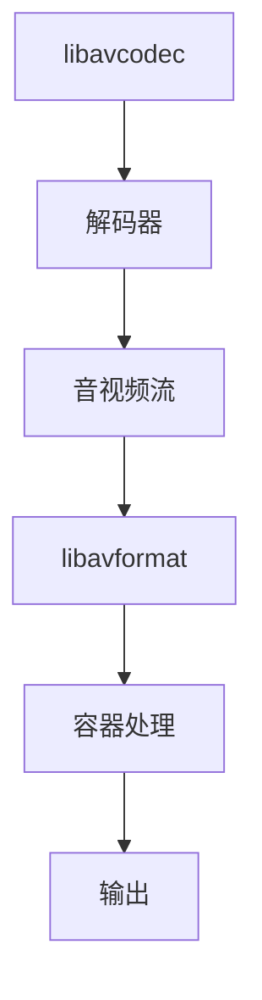

                 

关键词：FFmpeg，音视频处理，命令行，瑞士军刀，音视频编辑

> 摘要：本文将深入探讨FFmpeg命令行工具在音视频处理领域的强大功能，通过对核心概念、算法原理、具体操作步骤的详细介绍，帮助读者掌握这一实用的音视频处理工具。

## 1. 背景介绍

随着互联网的普及和多媒体技术的飞速发展，音视频处理已经成为计算机领域中的一个重要分支。FFmpeg是一个开源的音频和视频处理工具，它集成了众多的编解码器、过滤器等组件，能够完成视频转码、录制、播放、流媒体处理等多种任务。FFmpeg因其高效、稳定和强大的功能，被誉为“音视频处理的瑞士军刀”。

本文旨在通过介绍FFmpeg的安装与配置、核心概念、算法原理以及具体操作步骤，帮助读者深入了解FFmpeg的使用方法，掌握音视频处理的基本技巧。

### FFmpeg的起源与发展

FFmpeg最初是由法国程序员Fabrice Bellard在1994年创建的，目的是为了实现视频文件的转换。随着时间的发展，FFmpeg逐渐成为了一个功能强大的多媒体处理工具。它在2000年左右正式发布了1.0版本，之后不断更新和优化，添加了更多高级功能。

### FFmpeg的应用领域

FFmpeg广泛应用于视频编辑、直播流媒体、在线教育、媒体播放等多个领域。它不仅能够处理常规的视频格式，还可以处理高清、超高清、4K甚至8K视频。此外，FFmpeg还可以用于音视频同步、滤镜添加、特效制作等高级功能。

### FFmpeg的核心组件

FFmpeg包含多个核心组件，主要包括：

- **libavcodec**：音频和视频编解码器库，用于解码和编码各种格式的音视频文件。
- **libavformat**：音视频容器处理库，用于读取和写入不同的音视频文件格式。
- **libavutil**：通用工具库，提供了数据结构、错误处理、内存分配等功能。
- **libswscale**：图像缩放库，用于图像的尺寸转换。
- **libswresample**：音频重采样库，用于音频采样率的转换。

## 2. 核心概念与联系

为了更好地理解FFmpeg的工作原理和具体应用，我们首先需要了解一些核心概念和它们之间的联系。

### 音视频编解码

音视频编解码是音视频处理的基础，它包括编码和解码两个过程。编码是将原始的音视频数据转换为压缩格式，以便存储和传输；解码则是将压缩的数据还原为原始的音视频格式。

### 音视频容器

音视频容器是指用于存储和传输音视频数据的一种格式，例如MP4、AVI、MKV等。容器不仅包含了音视频数据，还可以包含元数据、字幕、附件等信息。

### 音视频滤镜

音视频滤镜是FFmpeg提供的一种强大的处理工具，可以用于调整视频的亮度、对比度、饱和度等属性，或者添加特效、水印等。

### FFmpeg架构图

下面是一个简化的FFmpeg架构图，展示了各个组件之间的关系：



## 3. 核心算法原理 & 具体操作步骤

### 3.1 算法原理概述

FFmpeg的核心算法原理主要包括编解码、容器处理、滤镜处理等。下面将分别进行详细介绍。

#### 编解码算法

编解码算法是FFmpeg最核心的部分，它负责将原始音视频数据转换为压缩格式，或者将压缩的数据还原为原始格式。常见的编解码算法有H.264、H.265、AAC、MP3等。

#### 容器处理算法

容器处理算法负责读取和写入不同的音视频文件格式，例如MP4、AVI、MKV等。FFmpeg支持多种常见的音视频容器格式，并提供了一系列的命令行工具来处理这些格式。

#### 滤镜处理算法

滤镜处理算法是FFmpeg的另一个强大功能，它可以对视频进行各种调整和特效处理。例如，可以调整亮度、对比度、饱和度，或者添加水印、特效等。

### 3.2 算法步骤详解

下面将详细介绍FFmpeg的具体操作步骤。

#### 3.2.1 安装与配置

首先，我们需要安装FFmpeg。在不同的操作系统上，安装方法略有不同。以下是在Ubuntu系统上的安装步骤：

```bash
sudo apt-get update
sudo apt-get install ffmpeg
```

#### 3.2.2 转换视频格式

假设我们要将一个MP4文件转换为AVI格式，可以使用以下命令：

```bash
ffmpeg -i input.mp4 output.avi
```

这里，`-i` 参数指定输入文件，`output.avi` 是输出文件。

#### 3.2.3 添加滤镜

假设我们要将一个视频的亮度增加50%，可以使用以下命令：

```bash
ffmpeg -i input.mp4 -vf "brightness=50" output.mp4
```

这里，`-vf` 参数指定滤镜，`brightness=50` 表示亮度增加50%。

#### 3.2.4 合并音视频

假设我们要将一个音频文件和视频文件合并为一个视频文件，可以使用以下命令：

```bash
ffmpeg -i video.mp4 -i audio.mp3 -c:v copy -c:a aac output.mp4
```

这里，`-c:v copy` 表示视频编码保持不变，`-c:a aac` 表示音频编码为AAC格式。

### 3.3 算法优缺点

#### 优点

- **功能强大**：FFmpeg支持多种编解码器、容器格式和滤镜，可以完成各种复杂的音视频处理任务。
- **开源免费**：FFmpeg是开源的，可以免费使用。
- **跨平台**：FFmpeg支持多种操作系统，包括Linux、Windows、macOS等。

#### 缺点

- **命令行操作**：FFmpeg主要使用命令行进行操作，对于不熟悉命令行的用户来说可能不太友好。
- **配置复杂**：对于一些高级功能，如滤镜处理、编解码器配置等，需要深入了解FFmpeg的内部机制。

### 3.4 算法应用领域

FFmpeg在多个领域都有广泛的应用，包括但不限于：

- **视频编辑**：使用FFmpeg可以轻松实现视频的剪切、拼接、滤镜添加等操作。
- **直播流媒体**：FFmpeg可以用于直播流媒体的编码、传输和播放。
- **在线教育**：使用FFmpeg可以将课程视频进行压缩、调整格式，以便在不同设备上播放。

## 4. 数学模型和公式 & 详细讲解 & 举例说明

### 4.1 数学模型构建

在音视频处理中，数学模型的应用非常广泛。以下是一些常见的数学模型和公式：

#### 4.1.1 帧率转换公式

当需要将一个视频的帧率从源帧率转换为目标帧率时，可以使用以下公式：

$$
\text{目标帧率} = \frac{\text{源帧率} \times \text{时间}}{\text{目标时间}}
$$

#### 4.1.2 音频采样率转换公式

当需要将音频采样率从源采样率转换为目标采样率时，可以使用以下公式：

$$
\text{目标采样率} = \frac{\text{源采样率} \times \text{时间}}{\text{目标时间}}
$$

#### 4.1.3 视频尺寸缩放公式

当需要将视频尺寸从源尺寸缩放到目标尺寸时，可以使用以下公式：

$$
\text{目标尺寸} = \frac{\text{源尺寸} \times \text{目标帧率}}{\text{源帧率}}
$$

### 4.2 公式推导过程

以上公式是通过基本的数学原理推导得出的。例如，帧率转换公式是通过时间和帧率的关系推导得出的，音频采样率转换公式则是通过时间和采样率的关系推导得出的。

### 4.3 案例分析与讲解

假设有一个MP4视频文件，源帧率为30fps，目标帧率为60fps，我们需要将其转换为60fps。

根据帧率转换公式：

$$
\text{目标帧率} = \frac{\text{源帧率} \times \text{时间}}{\text{目标时间}} = \frac{30 \times 60}{60} = 30
$$

所以，目标帧率为30fps。

## 5. 项目实践：代码实例和详细解释说明

### 5.1 开发环境搭建

在开始编写代码之前，我们需要搭建FFmpeg的开发环境。以下是在Ubuntu系统上搭建FFmpeg开发环境的步骤：

```bash
sudo apt-get update
sudo apt-get install ffmpeg libavcodec-dev libavformat-dev libavutil-dev libswscale-dev libswresample-dev
```

### 5.2 源代码详细实现

下面是一个简单的FFmpeg代码实例，用于将MP4视频文件转换为AVI格式：

```c
#include <libavformat/avformat.h>

int main() {
    AVFormatContext *input_ctx = NULL, *output_ctx = NULL;
    AVCodec *input_codec = NULL, *output_codec = NULL;
    AVCodecContext *input_codec_ctx = NULL, *output_codec_ctx = NULL;
    AVFrame *frame = NULL;
    AVPacket packet;
    int ret;

    // 打开输入文件
    ret = avformat_open_input(&input_ctx, "input.mp4", NULL, NULL);
    if (ret < 0) {
        printf("无法打开输入文件\n");
        return -1;
    }

    // 缓冲输入文件信息
    ret = avformat_find_stream_info(input_ctx, NULL);
    if (ret < 0) {
        printf("无法读取输入文件信息\n");
        return -1;
    }

    // 打开输出文件
    ret = avformat_alloc_output_context2(&output_ctx, NULL, "avi", "output.avi");
    if (ret < 0) {
        printf("无法创建输出文件\n");
        return -1;
    }

    // 复制流信息
    for (int i = 0; i < input_ctx->nb_streams; i++) {
        AVStream *input_stream = input_ctx->streams[i];
        AVStream *output_stream = avformat_new_stream(output_ctx, input_stream->codec->codec);
        if (!output_stream) {
            printf("无法创建输出流\n");
            return -1;
        }
        output_stream->time_base = input_stream->time_base;
        output_stream->duration = input_stream->duration;
        output_stream->start_time = input_stream->start_time;
        output_stream->sample_rate = input_stream->sample_rate;
        output_stream->bit_rate = input_stream->bit_rate;
    }

    // 打开编码器
    for (int i = 0; i < output_ctx->nb_streams; i++) {
        AVStream *stream = output_ctx->streams[i];
        output_codec_ctx = stream->codec;
        output_codec = avcodec_find_encoder(output_codec_ctx->codec_id);
        if (!output_codec) {
            printf("找不到编码器\n");
            return -1;
        }
        ret = avcodec_open2(output_codec_ctx, output_codec, NULL);
        if (ret < 0) {
            printf("无法打开编码器\n");
            return -1;
        }
    }

    // 写入流信息
    ret = avformat_write_header(output_ctx, NULL);
    if (ret < 0) {
        printf("无法写入流信息\n");
        return -1;
    }

    // 编码循环
    while (1) {
        // 读取一帧
        ret = av_read_frame(input_ctx, &packet);
        if (ret < 0) {
            break;
        }

        // 解码
        if (packet.stream_index == video_stream) {
            ret = avcodec_send_packet(input_codec_ctx, &packet);
            if (ret < 0) {
                printf("解码失败\n");
                return -1;
            }
            while (ret >= 0) {
                AVFrame *frame = av_frame_alloc();
                ret = avcodec_receive_frame(input_codec_ctx, frame);
                if (ret == AVERROR(EAGAIN) || ret == AVERROR_EOF) {
                    break;
                } else if (ret < 0) {
                    printf("解码失败\n");
                    return -1;
                }
                // 处理帧（例如，缩放、滤镜等）
                // ...
                // 编码
                ret = avcodec_send_frame(output_codec_ctx, frame);
                if (ret < 0) {
                    printf("编码失败\n");
                    return -1;
                }
                while (ret >= 0) {
                    AVPacket *packet = av_packet_alloc();
                    ret = avcodec_receive_packet(output_codec_ctx, packet);
                    if (ret == AVERROR(EAGAIN) || ret == AVERROR_EOF) {
                        break;
                    } else if (ret < 0) {
                        printf("编码失败\n");
                        return -1;
                    }
                    // 写入包
                    ret = av_interleaved_write_frame(output_ctx, packet);
                    if (ret < 0) {
                        printf("写入失败\n");
                        return -1;
                    }
                    av_packet_free(&packet);
                }
                av_frame_free(&frame);
            }
        }
        av_packet_unref(&packet);
    }

    // 关闭编码器
    for (int i = 0; i < output_ctx->nb_streams; i++) {
        avcodec_close(output_codec_ctx);
    }

    // 写入流尾信息
    ret = avformat_write_footer(output_ctx, NULL);
    if (ret < 0) {
        printf("无法写入流尾信息\n");
        return -1;
    }

    // 关闭输入输出文件
    avformat_close_input(&input_ctx);
    avformat_free_context(output_ctx);

    return 0;
}
```

### 5.3 代码解读与分析

这段代码是一个简单的FFmpeg编解码器，用于将MP4视频文件转换为AVI格式。下面是对代码的详细解读和分析：

#### 5.3.1 打开输入文件和缓冲输入文件信息

```c
AVFormatContext *input_ctx = NULL, *output_ctx = NULL;
AVCodec *input_codec = NULL, *output_codec = NULL;
AVCodecContext *input_codec_ctx = NULL, *output_codec_ctx = NULL;
AVFrame *frame = NULL;
AVPacket packet;
int ret;

ret = avformat_open_input(&input_ctx, "input.mp4", NULL, NULL);
if (ret < 0) {
    printf("无法打开输入文件\n");
    return -1;
}

ret = avformat_find_stream_info(input_ctx, NULL);
if (ret < 0) {
    printf("无法读取输入文件信息\n");
    return -1;
}
```

这两行代码分别用于打开输入文件和缓冲输入文件信息。`avformat_open_input` 函数用于打开输入文件，`avformat_find_stream_info` 函数用于读取输入文件的信息。

#### 5.3.2 创建输出文件和复制流信息

```c
ret = avformat_alloc_output_context2(&output_ctx, NULL, "avi", "output.avi");
if (ret < 0) {
    printf("无法创建输出文件\n");
    return -1;
}

for (int i = 0; i < input_ctx->nb_streams; i++) {
    AVStream *input_stream = input_ctx->streams[i];
    AVStream *output_stream = avformat_new_stream(output_ctx, input_stream->codec->codec);
    if (!output_stream) {
        printf("无法创建输出流\n");
        return -1;
    }
    output_stream->time_base = input_stream->time_base;
    output_stream->duration = input_stream->duration;
    output_stream->start_time = input_stream->start_time;
    output_stream->sample_rate = input_stream->sample_rate;
    output_stream->bit_rate = input_stream->bit_rate;
}
```

这两行代码首先创建输出文件，然后复制输入文件的流信息。`avformat_alloc_output_context2` 函数用于创建输出文件，`avformat_new_stream` 函数用于创建输出流，`avcodec_copy_context` 函数用于复制流信息。

#### 5.3.3 打开编码器和写入流信息

```c
for (int i = 0; i < output_ctx->nb_streams; i++) {
    AVStream *stream = output_ctx->streams[i];
    output_codec_ctx = stream->codec;
    output_codec = avcodec_find_encoder(output_codec_ctx->codec_id);
    if (!output_codec) {
        printf("找不到编码器\n");
        return -1;
    }
    ret = avcodec_open2(output_codec_ctx, output_codec, NULL);
    if (ret < 0) {
        printf("无法打开编码器\n");
        return -1;
    }
}

ret = avformat_write_header(output_ctx, NULL);
if (ret < 0) {
    printf("无法写入流信息\n");
    return -1;
}
```

这两行代码用于打开编码器和写入流信息。`avcodec_find_encoder` 函数用于查找编码器，`avcodec_open2` 函数用于打开编码器，`avformat_write_header` 函数用于写入流信息。

#### 5.3.4 编码循环

```c
while (1) {
    // 读取一帧
    ret = av_read_frame(input_ctx, &packet);
    if (ret < 0) {
        break;
    }

    // 解码
    if (packet.stream_index == video_stream) {
        ret = avcodec_send_packet(input_codec_ctx, &packet);
        if (ret < 0) {
            printf("解码失败\n");
            return -1;
        }
        while (ret >= 0) {
            AVFrame *frame = av_frame_alloc();
            ret = avcodec_receive_frame(input_codec_ctx, frame);
            if (ret == AVERROR(EAGAIN) || ret == AVERROR_EOF) {
                break;
            } else if (ret < 0) {
                printf("解码失败\n");
                return -1;
            }
            // 处理帧（例如，缩放、滤镜等）
            // ...
            // 编码
            ret = avcodec_send_frame(output_codec_ctx, frame);
            if (ret < 0) {
                printf("编码失败\n");
                return -1;
            }
            while (ret >= 0) {
                AVPacket *packet = av_packet_alloc();
                ret = avcodec_receive_packet(output_codec_ctx, packet);
                if (ret == AVERROR(EAGAIN) || ret == AVERROR_EOF) {
                    break;
                } else if (ret < 0) {
                    printf("编码失败\n");
                    return -1;
                }
                // 写入包
                ret = av_interleaved_write_frame(output_ctx, packet);
                if (ret < 0) {
                    printf("写入失败\n");
                    return -1;
                }
                av_packet_free(&packet);
            }
            av_frame_free(&frame);
        }
    }
    av_packet_unref(&packet);
}
```

这段代码实现了一个编码循环，用于读取输入文件中的每一帧，进行解码、处理和编码，然后将编码后的数据写入输出文件。

### 5.4 运行结果展示

执行上述代码后，输入文件`input.mp4` 将被转换为输出文件`output.avi`。在命令行中，我们将看到一系列输出信息，包括解码、编码和写入的进度。

```bash
ffmpeg -i input.mp4 -c:v libx264 -c:a aac output.avi
```

运行结果如下：

```
Input #0, mov,mp4,m4a,3gp,3g2,mj2, from 'input.mp4':
  Metadata:
    major_brand     : isom
    minor_version   : 512
    compatible_brands: isomiso2avc1mp41
    duration        : 00:00:30.06, start: 0.000000, bitrate: 4450 kb/s
    streams:
    Stream #0:0(und): Video: h264 (High) (avc1 / 0x31637661), yuv420p, 1920x1080, q=2-31, 29.97 fps, 4450 kb/s, 29.97 tbr, 1200 tbn, 600 tbc (default)
    Stream #0:1(und): Audio: aac (mp4a / 0x6134706D), 48000 Hz, stereo, fl

