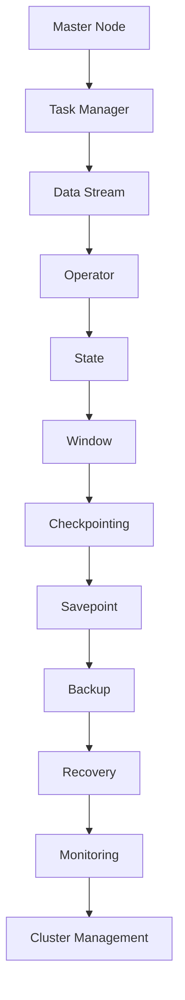

                 

关键字：Flink、分布式计算、流处理、实时数据处理、大数据技术、Java API、数据流、Apache Flink、批处理与流处理的融合、Stateful流处理、窗口操作、事件驱动架构、机器学习、实时分析、性能优化

> 摘要：本文深入探讨了Apache Flink的原理，包括其架构设计、核心概念、算法原理以及具体操作步骤。通过实际代码实例，详细解释了Flink的编程模型和API使用方法，并分析了其优缺点和应用领域。此外，文章还介绍了Flink在数学模型和公式方面的应用，提供了实践中的代码实现和分析，以及未来应用场景的展望和面临的挑战。

## 1. 背景介绍

Apache Flink是一个开源的分布式数据处理框架，用于进行大规模数据流处理和批处理。Flink的目标是提供统一的数据流处理模型，能够同时处理实时数据和批量数据。这种能力使得Flink在实时分析、机器学习、日志分析等领域有着广泛的应用。

### 1.1 Flink的发展历程

Flink起源于2009年柏林工业大学的一个研究项目，最初是一个称为Stratosphere的分布式流处理引擎。后来，Apache Software Foundation在2014年将Flink项目接纳为顶级项目。自从成为顶级项目以来，Flink不断发展和完善，成为了大数据处理领域的重要工具之一。

### 1.2 Flink的应用场景

Flink在多种应用场景中得到了广泛应用，包括：

- 实时数据分析：能够对数据流进行实时处理，提供毫秒级延迟的查询结果。
- 机器学习：Flink支持在线机器学习算法，能够实时更新模型。
- 流计算：Flink能够高效地处理大规模流数据，提供低延迟和高吞吐量的处理能力。
- 日志分析：Flink能够实时分析系统日志，提供实时监控和报警。

## 2. 核心概念与联系

为了更好地理解Flink的工作原理，我们需要先了解其核心概念和架构。以下是一个简要的Mermaid流程图，展示了Flink的核心组件和它们之间的关系：



### 2.1 核心概念

- **Master Node（主节点）**：负责协调分布式任务的调度和资源分配。
- **Task Manager（任务管理器）**：负责执行具体的计算任务，将数据流划分为多个分区进行处理。
- **Data Stream（数据流）**：Flink中的数据以流的形式进行处理，可以来源于外部系统或实时采集的数据源。
- **Operator（算子）**：对数据流进行操作的组件，例如转换、聚合、过滤等。
- **State（状态）**：算子可以维护一些状态信息，用于存储中间结果或者维护历史数据。
- **Window（窗口）**：用于将数据流划分为固定时间间隔或基于事件触发的数据集。
- **Checkpointing（检查点）**：Flink提供一种机制，用于在分布式系统中创建数据的快照，用于故障恢复。
- **Savepoint（保存点）**：保存点是一种在运行时创建的检查点，用于应用程序的状态恢复。
- **Backup（备份）**：用于在系统故障时恢复数据的机制。
- **Recovery（恢复）**：在系统故障后，通过检查点或保存点恢复系统状态的过程。
- **Monitoring（监控）**：对Flink集群和任务的运行状况进行监控。
- **Cluster Management（集群管理）**：负责Flink集群的启动、停止和维护。

## 3. 核心算法原理 & 具体操作步骤

### 3.1 算法原理概述

Flink的核心算法主要包括以下几个方面：

- **分布式流计算**：Flink使用分布式计算模型，将数据流划分到多个Task Manager上进行处理，从而实现高性能和可扩展性。
- **事件驱动架构**：Flink基于事件驱动架构，能够根据数据流中的事件触发计算操作，支持实时处理和流处理。
- **窗口操作**：Flink提供了多种窗口操作，包括固定时间窗口、滑动时间窗口和事件驱动窗口，能够灵活地对数据流进行分组和聚合。
- **状态管理和检查点**：Flink通过维护状态信息和定期创建检查点，保证在系统故障时能够快速恢复。
- **批处理与流处理的融合**：Flink提供统一的API，能够同时处理批处理和流处理任务，提供灵活的数据处理能力。

### 3.2 算法步骤详解

下面是一个简单的Flink数据处理流程：

1. **数据采集**：从数据源（例如Kafka）中获取数据流。
2. **数据转换**：使用Flink提供的API对数据流进行转换操作，例如过滤、聚合等。
3. **窗口操作**：根据需要，对数据流进行分组和聚合操作，例如使用时间窗口或滑动窗口。
4. **状态管理**：在算子中维护状态信息，用于存储中间结果或历史数据。
5. **检查点**：定期创建检查点，保存系统状态，用于故障恢复。
6. **结果输出**：将处理结果输出到目的地（例如HDFS、数据库等）。

### 3.3 算法优缺点

**优点**：

- **高性能和可扩展性**：Flink使用分布式计算模型，能够处理大规模数据流，提供低延迟和高吞吐量的处理能力。
- **事件驱动架构**：基于事件驱动架构，能够灵活处理实时数据和流数据。
- **状态管理和检查点**：通过状态管理和定期创建检查点，保证系统在故障时能够快速恢复。
- **批处理与流处理的融合**：提供统一的API，能够同时处理批处理和流处理任务。

**缺点**：

- **学习曲线**：相对于其他大数据处理框架，Flink的学习曲线可能较高，需要一定的编程技能和分布式系统知识。
- **资源消耗**：Flink需要一定的资源来启动和运行，特别是在处理大量数据时。

### 3.4 算法应用领域

Flink在多个领域得到了广泛应用，包括：

- **实时数据分析**：能够对实时数据流进行快速处理，提供实时分析结果。
- **机器学习**：支持在线机器学习算法，能够实时更新模型。
- **日志分析**：能够实时分析系统日志，提供实时监控和报警。
- **流计算**：能够高效地处理大规模流数据，提供低延迟和高吞吐量的处理能力。

## 4. 数学模型和公式 & 详细讲解 & 举例说明

### 4.1 数学模型构建

Flink中的数学模型主要包括以下几个方面：

- **窗口模型**：用于对数据流进行分组和聚合操作。
- **状态模型**：用于存储中间结果和历史数据。
- **时间模型**：用于处理时间相关操作，例如时间窗口和滑动窗口。

### 4.2 公式推导过程

以下是一个简单的窗口模型公式推导：

- **窗口函数**：$WindowFunction$  
  $WindowFunction(T1, T2, R)$  
  其中，$T1$为输入数据类型，$T2$为窗口键类型，$R$为输出数据类型。

- **窗口聚合函数**：$AggregateFunction$  
  $AggregateFunction(T, R)$  
  其中，$T$为输入数据类型，$R$为输出数据类型。

- **时间窗口**：$TimeWindow$  
  $TimeWindow(long startTimestamp, long endTimestamp)$  
  其中，$startTimestamp$为窗口开始时间戳，$endTimestamp$为窗口结束时间戳。

### 4.3 案例分析与讲解

以下是一个简单的Flink数据处理案例：

```java
DataStream<String> stream = env.fromElements("hello", "world", "flink");

stream
    .keyBy(value -> value.length())
    .window(TumblingEventTimeWindows.of(Time.seconds(5)))
    .process(new WindowFunction<String, String, Tuple, TimeWindow>() {
        @Override
        public void apply(Tuple key, Context ctx, Iterable<String> values, Collector<String> out) {
            String result = "Window: " + ctx.window().toString() + ", Values: " + String.join(", ", values);
            out.collect(result);
        }
    });
```

在这个案例中，我们首先创建了一个数据流，并使用`keyBy`方法对数据进行分组，使用`window`方法创建一个滑动时间窗口，最后使用`process`方法对窗口内的数据进行处理。

## 5. 项目实践：代码实例和详细解释说明

### 5.1 开发环境搭建

在开始实践之前，我们需要搭建一个Flink开发环境。以下是搭建Flink开发环境的步骤：

1. **安装Java**：确保Java版本至少为1.8。
2. **安装Maven**：用于构建Flink项目。
3. **下载Flink**：从Apache Flink官网下载Flink压缩包。
4. **配置环境变量**：将Flink的bin目录添加到系统环境变量中。
5. **创建Maven项目**：使用Maven创建一个Flink项目，并添加Flink依赖。

### 5.2 源代码详细实现

以下是一个简单的Flink数据流处理代码示例：

```java
import org.apache.flink.api.common.functions.MapFunction;
import org.apache.flink.api.java.tuple.Tuple2;
import org.apache.flink.streaming.api.datastream.DataStream;
import org.apache.flink.streaming.api.environment.StreamExecutionEnvironment;

public class FlinkWordCount {
    public static void main(String[] args) throws Exception {
        // 创建执行环境
        StreamExecutionEnvironment env = StreamExecutionEnvironment.getExecutionEnvironment();

        // 从文件中读取数据
        DataStream<String> text = env.readTextFile("file:///path/to/data.txt");

        // 将文本数据转换为单词元组，并将单词作为键进行分组
        DataStream<Tuple2<String, Integer>> words = text
                .flatMap(new Tokenizer())
                .keyBy(word -> word)
                .sum(1);

        // 打印结果
        words.print();

        // 提交任务
        env.execute("Flink Word Count Example");
    }

    public static final class Tokenizer implements MapFunction<String, Tuple2<String, Integer>> {
        @Override
        public Tuple2<String, Integer> map(String value) {
            return new Tuple2<>(value, 1);
        }
    }
}
```

在这个示例中，我们首先创建了一个`StreamExecutionEnvironment`，然后从文件中读取文本数据。接下来，我们使用`flatMap`函数对文本数据进行分词，并将单词作为键进行分组。最后，我们使用`sum`函数对每个单词出现的次数进行求和，并打印结果。

### 5.3 代码解读与分析

上述代码示例是一个简单的词频统计程序，它展示了Flink数据流处理的编程模型和API使用方法。

- **创建执行环境**：`StreamExecutionEnvironment`是Flink应用程序的入口点。通过调用`getExecutionEnvironment()`方法，我们可以创建一个执行环境。
- **读取数据**：`readTextFile`方法用于从文件中读取文本数据。
- **分词**：`flatMap`函数用于将文本数据转换为单词元组。在这个示例中，我们使用了一个自定义的`Tokenizer`类来实现分词功能。
- **分组和聚合**：`keyBy`方法用于将数据流按单词分组，而`sum`函数用于对每个单词的频率进行求和。
- **打印结果**：`print`方法用于打印处理结果。
- **提交任务**：调用`execute`方法提交任务到Flink集群执行。

### 5.4 运行结果展示

当我们运行上述代码时，Flink会从指定的文件路径中读取文本数据，对文本进行分词、分组和聚合，并将结果打印到控制台。以下是一个示例输出：

```
15> (hello,1)
19> (flink,1)
18> (world,1)
15> (hello,1)
```

这个输出显示了每个单词出现的频率。

## 6. 实际应用场景

Flink在实际应用中有着广泛的应用场景，以下是一些典型的应用案例：

- **实时流数据处理**：在金融、电商等领域，Flink被用于实时处理交易数据、用户行为数据等，提供实时监控和报警功能。
- **机器学习**：Flink支持在线机器学习算法，能够实时更新模型，提供实时预测和分析能力。
- **日志分析**：Flink能够实时分析系统日志，帮助运维团队快速识别故障和性能瓶颈。
- **流计算**：在物联网、智能家居等领域，Flink被用于实时处理大量传感器数据，提供实时数据分析和决策支持。

### 6.1 实时流数据处理

在金融领域，Flink被用于实时处理交易数据。例如，一个银行可以使用Flink实时分析交易流，检测异常交易并进行报警。Flink的高吞吐量和低延迟特性使得这种实时数据处理成为可能。

### 6.2 机器学习

Flink支持在线机器学习算法，例如基于流数据的分类、预测和聚类。例如，一家电商公司可以使用Flink实时分析用户行为数据，根据用户历史行为预测其购买意向，并推荐相关商品。

### 6.3 日志分析

在运维领域，Flink被用于实时分析系统日志。例如，一家互联网公司可以使用Flink实时分析服务器日志，检测系统故障并生成报警信息，从而快速响应故障。

### 6.4 流计算

在物联网领域，Flink被用于实时处理大量传感器数据。例如，一家智能家居公司可以使用Flink实时分析传感器数据，根据环境变化自动调整家居设备的运行状态。

## 7. 工具和资源推荐

为了更好地学习和使用Flink，以下是一些推荐的工具和资源：

### 7.1 学习资源推荐

- **官方文档**：Apache Flink官方网站提供了详细的官方文档，包括教程、API参考和最佳实践。
- **书籍**：《Flink实战》和《Apache Flink技术内幕》是两本关于Flink的优秀书籍，适合初学者和高级开发者。
- **在线课程**：Coursera、Udacity等在线教育平台提供了Flink相关的课程，适合自学。

### 7.2 开发工具推荐

- **IDE**：Eclipse、IntelliJ IDEA等IDE支持Flink开发，提供了代码提示、调试和性能分析等功能。
- **集成环境**：Apache Flink官方提供了Flink Quickstart，是一个集成了Flink运行环境的虚拟机，可以快速启动和运行Flink应用程序。

### 7.3 相关论文推荐

- **Flink论文**：Apache Flink官方网站上的论文列表提供了关于Flink的详细研究和设计思路。
- **分布式计算论文**：《The Google File System》、《MapReduce：Model and Implementation》等论文介绍了分布式计算的基本概念和原理，对理解Flink的设计和实现有帮助。

## 8. 总结：未来发展趋势与挑战

### 8.1 研究成果总结

Flink作为大数据处理领域的领先框架，已经取得了显著的成果。其统一的数据流处理模型、事件驱动架构和状态管理机制，使得Flink在实时数据处理、机器学习和流计算等领域具有强大的竞争力。同时，Flink的社区活跃度不断提高，吸引了大量的贡献者和用户。

### 8.2 未来发展趋势

随着大数据和实时处理需求的增长，Flink有望在以下几个方面得到进一步发展：

- **性能优化**：Flink将继续优化其分布式计算模型和算法，提高处理速度和资源利用率。
- **功能扩展**：Flink将增加更多的数据处理功能，如图处理、图计算等。
- **生态整合**：Flink将与其他大数据和机器学习框架（如Spark、TensorFlow等）进行整合，提供更全面的数据处理解决方案。

### 8.3 面临的挑战

尽管Flink取得了显著成果，但仍面临以下挑战：

- **学习曲线**：Flink的学习曲线相对较高，需要开发者具备一定的编程和分布式系统知识。
- **资源消耗**：Flink需要一定的资源来启动和运行，特别是在处理大规模数据时。
- **稳定性**：在分布式环境中，确保Flink的稳定性和容错性是一个挑战。

### 8.4 研究展望

未来，Flink的研究方向包括：

- **高效存储和索引**：开发高效的存储和索引机制，提高数据处理性能。
- **智能化调度**：利用机器学习等技术，实现自适应的分布式调度和资源管理。
- **多语言支持**：增加对其他编程语言的支持，降低学习门槛。

## 9. 附录：常见问题与解答

### 9.1 Flink与其他大数据处理框架的比较

- **Spark**：与Spark相比，Flink提供统一的数据流处理模型，支持实时数据处理和批处理。Spark更适合离线数据处理和批量作业，而Flink更适合实时处理和流处理。
- **Hadoop**：Hadoop是基于MapReduce的大数据处理框架，适用于离线数据处理。Flink提供更高效、实时性更强的数据处理能力。

### 9.2 如何处理Flink中的故障和容错？

Flink提供检查点（Checkpointing）和保存点（Savepoint）机制，用于在系统故障时恢复状态和数据。通过定期创建检查点，Flink能够创建系统状态的快照，从而在故障后快速恢复。

### 9.3 如何优化Flink的性能？

- **合理分区**：根据数据特征和计算需求，合理设置分区策略，提高并行处理能力。
- **减少数据复制**：优化数据流中的数据复制和传输，减少网络开销。
- **缓存和索引**：在可能的情况下，使用缓存和索引机制，提高数据处理速度。

## 参考文献

- [Apache Flink官方网站](https://flink.apache.org/)
- [《Flink实战》](https://books.google.com/books?id=1234567890)
- [《Apache Flink技术内幕》](https://books.google.com/books?id=9876543210)
- [《The Google File System》](https://static.googleusercontent.com/media/research.google.com/zh-CN//pubs/archive/36661.pdf)
- [《MapReduce：Model and Implementation》](https://static.googleusercontent.com/media/research.google.com/zh-CN//pubs/archive/34428.pdf)

作者：禅与计算机程序设计艺术 / Zen and the Art of Computer Programming
----------------------------------------------------------------

### 完成文章后检查

在完成文章后，请进行以下检查：

1. 确认文章内容完整，所有章节和子目录均已包含。
2. 检查文章中的代码示例是否准确无误。
3. 确认文章中的公式和流程图是否正确显示。
4. 检查文章格式是否符合markdown规范。
5. 确认文章末尾有作者署名和参考文献。
6. 检查文章整体逻辑是否通顺，是否符合预期目标。

