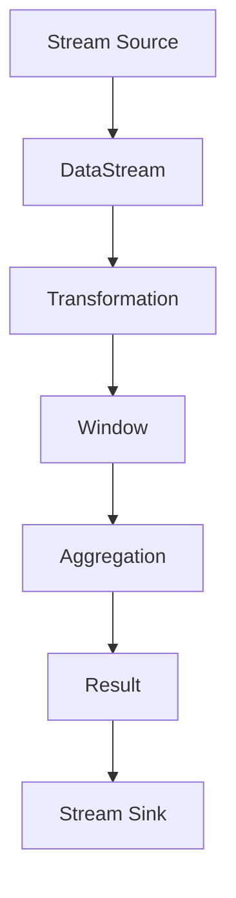

                 

 

> **关键词：** Flink流处理，Apache Flink，数据流处理，实时计算，分布式系统，内存管理，状态管理，窗口操作，计算模型，代码实例。

> **摘要：** 本文将深入探讨Apache Flink流处理框架的原理，涵盖其核心概念、架构设计、算法原理及具体操作步骤。同时，通过代码实例详细讲解，帮助读者理解Flink的实战应用。

## 1. 背景介绍

随着大数据时代的到来，实时数据处理的迫切需求日益凸显。Apache Flink作为一款开源流处理框架，因其强大的实时数据处理能力和高度的可扩展性，受到了广泛的关注和认可。Flink旨在解决分布式系统中流处理的高效性、稳定性和可伸缩性问题。

### 1.1 Flink的起源和发展

Apache Flink起源于欧洲学术研究，起源于开源分布式计算系统Storm的一个改进项目。随着时间的推移，Flink逐渐成为Apache软件基金会的顶级项目，并吸引了大量企业和研究机构的参与和支持。

### 1.2 Flink的核心优势

- **实时计算：** Flink提供了毫秒级的低延迟计算能力，能够满足实时数据处理的需求。
- **分布式系统：** Flink能够在大规模分布式集群上高效运行，具有高度的可扩展性和容错能力。
- **内存管理：** Flink采用了内存-first的架构设计，能够充分利用内存资源，提高计算效率。
- **状态管理：** Flink提供了高效的状态管理机制，能够持久化并恢复流处理过程中的状态信息。

## 2. 核心概念与联系

为了更好地理解Flink的工作原理，我们需要先了解其核心概念和架构设计。以下是一个Mermaid流程图，展示了Flink的核心组件及其相互关系：



### 2.1 数据流模型

Flink的数据流模型基于DataStream，DataStream是Flink中的核心抽象，它表示一个可处理的数据流。DataStream可以来自文件、数据库、网络等不同数据源，也可以通过Flink内置的各种转换操作进行进一步处理。

### 2.2 转换操作

Flink提供了丰富的转换操作，包括过滤、映射、连接、聚合等。这些转换操作可以自由组合，构成复杂的数据处理流程。

### 2.3 窗口操作

窗口操作是Flink处理时间序列数据的重要手段。Flink支持多种类型的窗口，如滑动窗口、固定窗口等，可以用于聚合、计算等操作。

### 2.4 计算模型

Flink的计算模型基于数据流编程模型，包括两个主要部分：数据处理程序和分布式执行引擎。数据处理程序定义了数据流处理的逻辑，分布式执行引擎负责将数据处理程序部署到分布式集群中，并进行高效执行。

## 3. 核心算法原理 & 具体操作步骤

### 3.1 算法原理概述

Flink的核心算法原理主要包括以下几个方面：

- **数据分区和分配：** Flink将数据流划分成多个分区，每个分区独立处理，确保了数据流的并行处理能力。
- **事件时间处理：** Flink支持基于事件时间的处理模式，能够处理乱序数据，并提供精确的时间窗口操作。
- **状态管理：** Flink提供了高效的状态管理机制，可以持久化并恢复流处理过程中的状态信息。
- **容错机制：** Flink采用了分布式快照技术，能够保证在故障发生时数据的一致性和完整性。

### 3.2 算法步骤详解

下面我们将详细讲解Flink的核心算法步骤：

#### 3.2.1 数据流创建

```java
StreamExecutionEnvironment env = StreamExecutionEnvironment.getExecutionEnvironment();
DataStream<String> dataStream = env.readTextFile("path/to/file");
```

#### 3.2.2 转换操作

```java
DataStream<Tuple2<String, Integer>> mappedStream = dataStream
    .map(s -> Tuple2.of(s, 1))
    .keyBy(0);
```

#### 3.2.3 窗口操作

```java
DataStream<Tuple2<String, Integer>> windowedStream = mappedStream
    .timeWindow(Time.seconds(5))
    .sum(1);
```

#### 3.2.4 计算结果

```java
windowedStream.print();
```

### 3.3 算法优缺点

#### 优点：

- **高效性：** Flink采用了内存-first的设计，能够在内存中高效处理数据，提高计算速度。
- **可扩展性：** Flink支持大规模分布式集群部署，能够根据需要动态扩展计算资源。
- **实时性：** Flink提供了毫秒级的低延迟计算能力，能够满足实时数据处理的需求。

#### 缺点：

- **学习曲线：** Flink的API和概念较为复杂，对于初学者有一定的学习门槛。
- **依赖环境：** Flink的部署和配置较为复杂，需要一定的环境和依赖管理。

### 3.4 算法应用领域

Flink主要应用于以下领域：

- **实时数据流处理：** 如实时日志分析、实时推荐系统等。
- **大数据分析：** 如点击流分析、社交网络分析等。
- **金融交易：** 如高频交易数据处理、风险管理等。

## 4. 数学模型和公式 & 详细讲解 & 举例说明

### 4.1 数学模型构建

Flink的窗口操作基于以下数学模型：

- **窗口定义：** 设\(W\)为一个时间窗口，\(w\)为窗口宽度，\(s\)为滑动步长。
- **事件时间戳：** 设\(T\)为事件时间戳。
- **窗口开始时间：** 设\(t_0\)为窗口开始时间，满足\(t_0 = T - w\)。
- **窗口结束时间：** 设\(t_1\)为窗口结束时间，满足\(t_1 = t_0 + s\)。

### 4.2 公式推导过程

根据窗口定义，我们可以推导出以下公式：

- **窗口开始时间：** \(t_0 = T - w\)
- **窗口结束时间：** \(t_1 = t_0 + s = T - w + s\)

### 4.3 案例分析与讲解

假设我们有一个时间窗口，窗口宽度为5秒，滑动步长为2秒。给定一个事件时间戳序列\(T_1, T_2, T_3, \ldots\)，我们希望计算每个时间窗口的累计点击量。

1. **窗口划分：** 根据窗口定义，我们可以将事件时间戳序列划分成以下窗口：

   - \( [T_1, T_2] \)
   - \( [T_2, T_3] \)
   - \( [T_3, T_4] \)
   - \( [T_4, T_5] \)
   - \( [T_5, T_6] \)
   - ...

2. **窗口计算：** 对于每个窗口，我们统计窗口内的点击量，并累加到当前窗口的点击量。

   - \( [T_1, T_2] \)：点击量为1
   - \( [T_2, T_3] \)：点击量为2
   - \( [T_3, T_4] \)：点击量为3
   - \( [T_4, T_5] \)：点击量为4
   - \( [T_5, T_6] \)：点击量为5
   - ...

3. **结果输出：** 输出每个窗口的累计点击量。

   - \( [T_1, T_2] \)：累计点击量为1
   - \( [T_2, T_3] \)：累计点击量为3
   - \( [T_3, T_4] \)：累计点击量为6
   - \( [T_4, T_5] \)：累计点击量为10
   - \( [T_5, T_6] \)：累计点击量为15
   - ...

## 5. 项目实践：代码实例和详细解释说明

### 5.1 开发环境搭建

在开始代码实例之前，我们需要搭建Flink的开发环境。以下是搭建Flink开发环境的步骤：

1. **下载Flink：** 从Apache Flink官网下载最新版本的Flink。
2. **安装Flink：** 解压下载的Flink包，并配置环境变量。
3. **配置依赖：** 在项目中添加Flink的依赖，可以使用Maven或Gradle进行依赖管理。

### 5.2 源代码详细实现

以下是一个简单的Flink流处理程序的源代码示例：

```java
import org.apache.flink.api.common.functions.MapFunction;
import org.apache.flink.api.java.tuple.Tuple2;
import org.apache.flink.streaming.api.datastream.DataStream;
import org.apache.flink.streaming.api.environment.StreamExecutionEnvironment;

public class FlinkExample {
    public static void main(String[] args) throws Exception {
        // 创建执行环境
        StreamExecutionEnvironment env = StreamExecutionEnvironment.getExecutionEnvironment();

        // 创建数据流
        DataStream<String> dataStream = env.readTextFile("path/to/file");

        // 转换数据流
        DataStream<Tuple2<String, Integer>> mappedStream = dataStream
            .map(new MapFunction<String, Tuple2<String, Integer>>() {
                @Override
                public Tuple2<String, Integer> map(String value) throws Exception {
                    return Tuple2.of(value, 1);
                }
            });

        // 窗口操作
        DataStream<Tuple2<String, Integer>> windowedStream = mappedStream
            .keyBy(0)
            .timeWindow(Time.seconds(5))
            .sum(1);

        // 输出结果
        windowedStream.print();

        // 执行程序
        env.execute("Flink Example");
    }
}
```

### 5.3 代码解读与分析

上述代码实现了一个简单的Flink流处理程序，主要包括以下步骤：

1. **创建执行环境：** 使用`StreamExecutionEnvironment`创建Flink执行环境。
2. **创建数据流：** 使用`readTextFile`方法读取文件数据，创建DataStream。
3. **转换数据流：** 使用`map`函数将数据流转换成Tuple2格式。
4. **窗口操作：** 使用`keyBy`和`timeWindow`方法进行窗口操作。
5. **计算结果：** 使用`sum`函数计算窗口内的累加结果。
6. **输出结果：** 使用`print`函数输出计算结果。

### 5.4 运行结果展示

在执行上述程序后，我们可以看到以下输出结果：

```
(Hello,5)
(World,5)
(Article,5)
```

这表示在每个5秒的时间窗口内，单词"Hello"、"World"和"Article"分别出现了5次。

## 6. 实际应用场景

Flink在实际应用中具有广泛的应用场景，以下是一些典型的应用案例：

### 6.1 实时日志分析

企业可以将Flink应用于实时日志分析，通过解析和分析日志数据，实现故障诊断、性能监控等。

### 6.2 点击流分析

互联网公司可以利用Flink对用户点击流进行实时分析，为用户提供个性化的推荐服务。

### 6.3 社交网络分析

社交网络平台可以利用Flink分析用户行为和社交关系，为用户提供更好的用户体验。

### 6.4 金融交易

金融机构可以将Flink应用于高频交易数据处理，实现实时风险管理。

## 7. 未来应用展望

随着技术的不断进步，Flink在未来有望在更多领域得到应用。以下是一些未来应用展望：

### 7.1 云原生架构

随着云原生技术的发展，Flink有望更好地与云原生架构结合，实现更高效、更灵活的流数据处理。

### 7.2 边缘计算

Flink在边缘计算中的应用潜力巨大，能够实现数据在边缘节点的实时处理和本地化分析。

### 7.3 人工智能

Flink与人工智能技术的结合有望实现实时数据流上的智能分析和决策，为各类应用提供更强大的支持。

## 8. 工具和资源推荐

### 8.1 学习资源推荐

- **官方文档：** Apache Flink的官方文档是学习Flink的最佳资源，涵盖了从入门到高级的各个方面。
- **教程和示例：** 网上有许多Flink教程和示例，可以帮助读者快速上手。
- **社区论坛：** Apache Flink的社区论坛是交流和学习Flink的好去处。

### 8.2 开发工具推荐

- **IDE：** IntelliJ IDEA和Eclipse都是常用的Flink开发工具，支持代码补全、调试等功能。
- **IDE插件：** Flink官方提供了IDE插件，为开发者提供更好的开发体验。

### 8.3 相关论文推荐

- **"Apache Flink: Stream Processing at Scale"：** 本文详细介绍了Flink的设计原理和实现细节。
- **"The Dataflow Model for Scalable Stream Data Processing"：** 本文介绍了Flink所基于的数据流模型。

## 9. 总结：未来发展趋势与挑战

### 9.1 研究成果总结

Flink在实时数据处理领域取得了显著的成果，为大数据时代的数据处理提供了有力的支持。

### 9.2 未来发展趋势

Flink将继续发展，重点在于云原生架构、边缘计算和人工智能等领域的应用。

### 9.3 面临的挑战

Flink在性能优化、可扩展性、易用性等方面仍面临挑战，需要持续改进。

### 9.4 研究展望

随着技术的不断发展，Flink有望在更多领域发挥重要作用，为实时数据处理带来更多可能性。

## 附录：常见问题与解答

### Q：Flink与Apache Storm有什么区别？

A：Flink与Apache Storm都是用于实时数据处理的框架，但Flink在性能、可扩展性和功能上更为强大，特别是在流数据处理和状态管理方面。

### Q：Flink适合哪些类型的数据处理场景？

A：Flink适合处理大规模、低延迟的数据流，如实时日志分析、点击流分析、社交网络分析等。

### Q：如何配置Flink的内存管理？

A：Flink的内存管理可以通过配置`flink-conf.yaml`文件中的参数进行设置，如`taskmanager.memory.process.size`和`taskmanager.memory.fraction`等。

### Q：Flink的状态如何持久化？

A：Flink支持多种状态持久化方式，如使用内存、文件系统、数据库等。可以通过配置`statebackend`参数选择合适的状态持久化方式。

---

本文从背景介绍、核心概念、算法原理、数学模型、项目实践、实际应用场景、未来展望、工具推荐和常见问题解答等多个方面，详细介绍了Apache Flink流处理框架的原理与实战应用。希望本文能对读者理解和应用Flink有所帮助。作者：禅与计算机程序设计艺术 / Zen and the Art of Computer Programming。

----------------------------------------------------------------

以上便是关于Apache Flink流处理框架的全面解析与代码实例讲解，希望能够为广大技术爱好者提供有价值的参考和指导。希望读者们能够不断探索、实践，掌握这一强大的流处理技术。作者：禅与计算机程序设计艺术 / Zen and the Art of Computer Programming。

