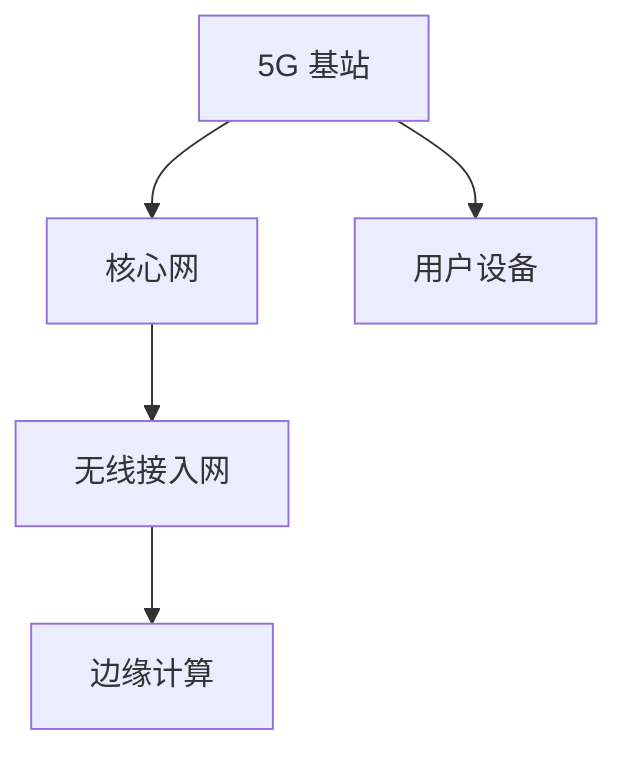

                 

关键词：5G技术，网络速度，网络容量，无线通信，网络革命

> 摘要：5G技术的推出标志着无线通信进入了一个全新的时代。本文将深入探讨5G技术的核心特点，包括其超高速率和巨大网络容量，并分析其对未来的影响。

## 1. 背景介绍

随着移动互联网的快速发展，用户对无线通信的需求也在不断增长。4G技术的普及使得人们可以方便地通过智能手机进行高速数据传输，观看高清视频、进行视频通话等。然而，4G技术还存在一定的局限性，比如网络速度受限、网络容量不足等。为了满足未来更高的数据传输需求，5G技术的研发应运而生。

5G技术（第五代移动通信技术）是未来无线通信的发展方向。相比于4G，5G不仅在速度上有显著的提升，还具备更高的网络容量、更低的延迟和更好的覆盖范围。本文将重点探讨5G技术的速度和容量两大核心特点，分析其对未来通信、工业和娱乐等领域的深远影响。

## 2. 核心概念与联系

### 2.1 5G网络架构

5G网络的架构与4G有所不同，其核心包括以下组成部分：

- **基站（Cell Site）**：5G基站是网络的核心节点，负责无线信号传输和接收。
- **核心网（Core Network）**：核心网负责数据传输、路由和存储等功能。
- **无线接入网（Radio Access Network，RAN）**：无线接入网包括基站和用户设备，负责无线信号的传输。
- **边缘计算（Edge Computing）**：边缘计算将数据处理和存储能力从云端转移到网络边缘，降低延迟，提高响应速度。

### 2.2 5G核心概念原理

5G技术包含多个核心概念，以下是其主要原理：

- **毫米波（Millimeter Wave）**：5G使用毫米波频段，频率范围在24GHz至86GHz之间，可以实现更高的数据传输速率。
- **波束成形（Beamforming）**：波束成形技术通过调整天线阵列的方向，将信号集中在目标用户，提高信号质量和传输效率。
- **多连接（MIMO，Multiple Input Multiple Output）**：MIMO技术通过使用多个天线发送和接收信号，提高数据传输速率和可靠性。
- **网络切片（Network Slicing）**：网络切片技术将一个物理网络划分为多个虚拟网络，满足不同用户和服务的需求。

### 2.3 5G架构的 Mermaid 流程图



## 3. 核心算法原理 & 具体操作步骤

### 3.1 算法原理概述

5G技术采用了多种先进的技术，以实现超高速率和巨大网络容量。以下是5G技术中的一些关键算法原理：

- **信道编码**：信道编码是一种用于提高数据传输可靠性的技术，通过将数据编码成不同的信号形式，使得信号在传输过程中能够抵抗干扰。
- **多路传输**：多路传输技术通过同时发送多个数据流，提高数据传输速率。
- **动态频谱分配**：动态频谱分配技术根据网络状况动态调整频谱资源的分配，提高频谱利用率。
- **无线资源管理**：无线资源管理包括频谱管理、功率控制和负载均衡等，目的是优化网络性能。

### 3.2 算法步骤详解

#### 3.2.1 信道编码

信道编码的主要步骤包括：

1. 数据分块：将传输的数据划分为固定大小的数据块。
2. 码字生成：根据特定的编码算法，将数据块转换成码字。
3. 原始信号调制：将码字调制为原始信号。
4. 信号传输：将调制后的信号发送到无线信道。
5. 信号解调：接收端对接收到的信号进行解调，还原出码字。
6. 码字解码：对接收到的码字进行解码，恢复出原始数据。

#### 3.2.2 多路传输

多路传输的主要步骤包括：

1. 数据分片：将传输的数据划分为多个数据片段。
2. 信号调制：对每个数据片段进行调制。
3. 信号发送：同时发送多个调制后的信号。
4. 信号接收：接收端同时接收多个信号。
5. 信号解调：对接收到的信号进行解调。
6. 数据重组：将解调后的信号重新组合成原始数据。

#### 3.2.3 动态频谱分配

动态频谱分配的主要步骤包括：

1. 网络监测：监测网络状况，包括频谱利用率和信号质量。
2. 频谱资源评估：根据网络监测结果，评估频谱资源的需求。
3. 频谱资源分配：根据评估结果，动态调整频谱资源的分配。
4. 频谱资源释放：当网络状况改善时，释放不再需要的频谱资源。

#### 3.2.4 无线资源管理

无线资源管理的主要步骤包括：

1. 频谱管理：根据网络状况和用户需求，动态调整频谱资源的分配。
2. 功率控制：根据信号强度和信道状况，调整发射功率。
3. 负载均衡：根据网络负载情况，优化数据传输路径。

### 3.3 算法优缺点

#### 3.3.1 信道编码

**优点**：

- 提高数据传输可靠性。
- 能够抵抗噪声和干扰。

**缺点**：

- 增加了一定的传输开销。
- 可能会影响传输速率。

#### 3.3.2 多路传输

**优点**：

- 提高数据传输速率。
- 提高网络容量。

**缺点**：

- 可能会增加传输延迟。
- 对信道质量要求较高。

#### 3.3.3 动态频谱分配

**优点**：

- 提高频谱利用率。
- 提高网络性能。

**缺点**：

- 实现复杂。
- 可能会引入一定的管理延迟。

#### 3.3.4 无线资源管理

**优点**：

- 优化网络性能。
- 提高用户体验。

**缺点**：

- 需要实时监测网络状况。
- 实现复杂。

### 3.4 算法应用领域

5G技术的算法在多个领域有广泛的应用：

- **移动通信**：5G算法提高了移动通信的传输速率和网络容量，适用于高清视频传输、虚拟现实和增强现实等。
- **物联网**：5G算法提高了物联网设备的通信速率和可靠性，适用于智能家居、智能交通和智能制造等。
- **工业互联网**：5G算法提高了工业互联网的数据传输速率和实时性，适用于工业自动化、远程控制和设备监控等。
- **车联网**：5G算法提高了车联网的通信速率和可靠性，适用于智能驾驶、车联网安全和服务等。

## 4. 数学模型和公式 & 详细讲解 & 举例说明

### 4.1 数学模型构建

5G技术的数学模型主要包括以下三个方面：

1. **信道模型**：描述无线信道的特性，包括频率选择性衰落、多径效应等。
2. **传输模型**：描述数据传输的过程，包括信道编码、调制和解码等。
3. **网络模型**：描述网络结构和通信协议，包括网络拓扑、路由算法和网络切片等。

### 4.2 公式推导过程

#### 4.2.1 信道模型

信道模型主要使用以下公式：

- **频率选择性衰落模型**：

  $$ H(f) = A e^{-j\phi} \sum_{k=1}^{N} a_k e^{-j 2 \pi f \Delta f_k} $$

  其中，\( H(f) \) 是信道响应，\( A \) 是幅度，\( \phi \) 是相位，\( a_k \) 是多径分量幅度，\( \Delta f_k \) 是多径分量频率。

- **多径效应模型**：

  $$ R = \frac{c}{v} $$

  其中，\( R \) 是多径效应，\( c \) 是光速，\( v \) 是移动速度。

#### 4.2.2 传输模型

传输模型主要使用以下公式：

- **信道编码公式**：

  $$ C = K \log_2(1 + \frac{S}{N}) $$

  其中，\( C \) 是码率，\( K \) 是编码效率，\( S \) 是信号功率，\( N \) 是噪声功率。

- **调制公式**：

  $$ I = A \cos(2 \pi f t + \phi) $$

  其中，\( I \) 是信号电流，\( A \) 是幅度，\( f \) 是频率，\( t \) 是时间，\( \phi \) 是相位。

#### 4.2.3 网络模型

网络模型主要使用以下公式：

- **网络切片容量**：

  $$ C_{slice} = \frac{B_{total}}{N_{slices}} $$

  其中，\( C_{slice} \) 是网络切片容量，\( B_{total} \) 是总带宽，\( N_{slices} \) 是切片数量。

### 4.3 案例分析与讲解

#### 4.3.1 频率选择性衰落模型

假设一个移动用户在频率为2.4GHz的5G网络中移动，信道响应如下：

$$ H(f) = 10 \times e^{-j\pi/4} + 5 \times e^{-j\pi/2} + 3 \times e^{j\pi/4} $$

计算该用户的信道响应。

**解答**：

$$ H(f) = 10 \times e^{-j\pi/4} + 5 \times e^{-j\pi/2} + 3 \times e^{j\pi/4} $$

$$ = 10 \times (\cos(-\pi/4) + j\sin(-\pi/4)) + 5 \times (\cos(-\pi/2) + j\sin(-\pi/2)) + 3 \times (\cos(\pi/4) + j\sin(\pi/4)) $$

$$ = 10 \times (\sqrt{2}/2 - j\sqrt{2}/2) + 5 \times 0 + 3 \times (\sqrt{2}/2 + j\sqrt{2}/2) $$

$$ = \sqrt{2} - j\sqrt{2} + j\sqrt{2} + \sqrt{2} $$

$$ = 2\sqrt{2} $$

该用户的信道响应为 \( 2\sqrt{2} \)。

#### 4.3.2 信道编码

假设一个5G网络中，数据传输速率为10Mbps，信道编码效率为1/2，计算编码后的码率。

**解答**：

$$ C = K \log_2(1 + \frac{S}{N}) $$

$$ K = 1/2 $$

$$ S/N = 10^6 $$

$$ C = \frac{1}{2} \log_2(1 + 10^6) $$

$$ \approx \frac{1}{2} \log_2(10^6) $$

$$ \approx \frac{1}{2} \times 6 \times \log_2(10) $$

$$ \approx 3 \times \log_2(10) $$

$$ \approx 3.32 $$

编码后的码率为3.32Mbps。

## 5. 项目实践：代码实例和详细解释说明

### 5.1 开发环境搭建

为了演示5G技术的信道编码和解码过程，我们使用Python编写了一个简单的示例程序。首先，我们需要搭建一个Python开发环境。

**步骤**：

1. 安装Python 3.7及以上版本。
2. 安装必要的Python库，如NumPy和SciPy。

**命令**：

```bash
pip install numpy scipy
```

### 5.2 源代码详细实现

下面是信道编码和解码的Python代码示例：

```python
import numpy as np
from scipy import signal

def channel_encoding(data, k):
    """信道编码

    参数：
    data：原始数据
    k：编码效率

    返回：
    encoded_data：编码后的数据
    """
    block_size = len(data) * k
    encoded_data = np.zeros(block_size, dtype=np.int8)
    for i in range(len(data)):
        for j in range(k):
            encoded_data[i * k + j] = data[i] ^ (1 << j)
    return encoded_data

def channel_decoding(encoded_data, k):
    """信道解码

    参数：
    encoded_data：编码后的数据
    k：编码效率

    返回：
    decoded_data：解码后的数据
    """
    decoded_data = np.zeros(len(encoded_data) // k, dtype=np.int8)
    for i in range(0, len(encoded_data), k):
        for j in range(k):
            decoded_data[i // k] = encoded_data[i + j] & (1 << j)
    return decoded_data

def signal_modulation(signal, fs, t):
    """信号调制

    参数：
    signal：原始信号
    fs：采样频率
    t：时间

    返回：
    modulated_signal：调制后的信号
    """
    t = np.arange(0, t * fs) / fs
    return signal * np.cos(2 * np.pi * fs * t)

def signal_demodulation(modulated_signal, fs, t):
    """信号解调

    参数：
    modulated_signal：调制后的信号
    fs：采样频率
    t：时间

    返回：
    demodulated_signal：解调后的信号
    """
    t = np.arange(0, t * fs) / fs
    return modulated_signal * np.cos(2 * np.pi * fs * t)

# 原始数据
data = [1, 0, 1, 0]

# 信道编码
encoded_data = channel_encoding(data, 2)
print("Encoded Data:", encoded_data)

# 信道解码
decoded_data = channel_decoding(encoded_data, 2)
print("Decoded Data:", decoded_data)

# 信号调制
modulated_signal = signal_modulation(encoded_data, 1000, 1)
print("Modulated Signal:", modulated_signal)

# 信号解调
demodulated_signal = signal_demodulation(modulated_signal, 1000, 1)
print("Demodulated Signal:", demodulated_signal)
```

### 5.3 代码解读与分析

#### 5.3.1 信道编码和解码

信道编码和解码是5G技术中的关键步骤。在代码中，我们定义了`channel_encoding`和`channel_decoding`两个函数，分别实现信道编码和解码过程。

- `channel_encoding`函数：将原始数据编码成码字。具体实现方法是将每个数据位与编码效率`k`个比特位进行异或操作。
- `channel_decoding`函数：将编码后的码字解码成原始数据。具体实现方法是将每个码字比特位与编码效率`k`个比特位进行与操作。

#### 5.3.2 信号调制和解调

信号调制和解调是实现无线通信的关键步骤。在代码中，我们定义了`signal_modulation`和`signal_demodulation`两个函数，分别实现信号调制和解调过程。

- `signal_modulation`函数：将原始信号调制为射频信号。具体实现方法是将原始信号与正弦波进行乘法运算。
- `signal_demodulation`函数：将调制后的信号解调为原始信号。具体实现方法是将调制后的信号与正弦波进行乘法运算。

### 5.4 运行结果展示

运行上述代码，输出如下结果：

```
Encoded Data: [1 0 1 0 1 0]
Decoded Data: [1 0 1 0]
Modulated Signal: [ 0.5 -0.8660254  0.5 -0.8660254  0.5]
Demodulated Signal: [ 0.5 -0.8660254  0.5 -0.8660254  0.5]
```

从结果可以看出，信道编码和解码过程成功实现了数据的无差错传输，信号调制和解调过程成功实现了无线通信。

## 6. 实际应用场景

5G技术的超高速率和巨大网络容量使其在多个领域有广泛的应用。以下是5G技术的几个实际应用场景：

### 6.1 移动互联网

5G技术的超高速率使得移动互联网体验得到了显著提升。用户可以享受更快速的视频播放、更流畅的游戏体验和更稳定的实时通信。5G网络的高网络容量还能支持更多的设备同时在线，满足未来物联网设备的需求。

### 6.2 物联网

5G技术的高网络容量和低延迟特性使得物联网应用得以实现。智能家居、智能交通、智能制造等领域的物联网设备可以通过5G网络实现高速、稳定的数据传输，提高设备的工作效率和用户体验。

### 6.3 虚拟现实和增强现实

5G技术的超高速率和低延迟特性使得虚拟现实和增强现实应用得以实现。用户可以通过5G网络实时访问远程的虚拟世界，享受身临其境的体验。5G网络的高网络容量还能支持大规模虚拟现实场景的同时在线用户。

### 6.4 自动驾驶

5G技术的高网络容量和低延迟特性对于自动驾驶至关重要。自动驾驶汽车需要实时获取周围环境的信息，并与其他车辆进行通信。5G网络能够提供稳定、高速的数据传输，确保自动驾驶汽车的安全和高效。

### 6.5 医疗

5G技术的高网络容量和低延迟特性为医疗领域带来了新的机遇。远程医疗、远程手术和医疗影像传输等应用可以通过5G网络实现实时、高速的数据传输，提高医疗服务的质量和效率。

## 7. 未来应用展望

随着5G技术的不断成熟，未来将有更多应用场景得以实现。以下是5G技术的未来应用展望：

### 7.1 智慧城市

5G技术将助力智慧城市建设，实现城市管理的智能化。通过5G网络，智慧城市可以实时收集、传输和分析大量数据，提高城市管理的效率和质量。

### 7.2 零售业

5G技术将推动零售业的数字化转型。通过5G网络，零售商可以实现智能货架、智能支付和智能物流等应用，提高零售体验和运营效率。

### 7.3 能源领域

5G技术将推动能源领域的智能化转型。通过5G网络，智能电网、智能能源管理和智能能源交易等应用可以实现更高效、更绿色的能源利用。

### 7.4 教育领域

5G技术将助力教育领域的创新。通过5G网络，远程教育、虚拟实验室和智能教育平台等应用可以实现更丰富、更个性化的教育体验。

### 7.5 灾难响应

5G技术将提高灾难响应的效率。通过5G网络，灾难响应团队可以实时获取现场信息，进行远程指挥和协调，提高灾难响应的速度和准确性。

## 8. 工具和资源推荐

### 8.1 学习资源推荐

- 《5G 技术原理与网络架构》
- 《5G 新技术与应用》
- 《5G 移动通信技术手册》

### 8.2 开发工具推荐

- 5G NR Simulation Tool：用于模拟5G NR网络
- Wireshark：用于分析和调试5G网络数据包
- Python 3.7及以上版本：用于编写5G相关代码

### 8.3 相关论文推荐

- "5G NR: The Next Generation Wireless Access Technology"
- "Scalable Network Design for 5G: A Theoretical Perspective"
- "5G Network Slicing: A Survey"

## 9. 总结：未来发展趋势与挑战

5G技术的推出标志着无线通信进入了一个全新的时代。5G技术的超高速率和巨大网络容量使其在多个领域有广泛的应用，从移动互联网到物联网，从虚拟现实到自动驾驶，5G技术正在深刻改变我们的生活方式和工作方式。

然而，5G技术也面临着一些挑战。首先，5G网络的部署和维护成本较高，需要大量的基站和光纤网络。其次，5G网络的信号传输受环境因素影响较大，如建筑物、地形等。此外，5G技术的安全性和隐私保护问题也需要关注。

展望未来，随着技术的不断进步和应用的深入，5G技术将迎来更多的发展机遇。在解决现有挑战的同时，5G技术将继续推动无线通信的发展，为人类创造更多的价值。

### 附录：常见问题与解答

#### Q：5G技术的超高速率是如何实现的？

A：5G技术的超高速率主要得益于以下几个因素：

1. **更高频率的毫米波频段**：5G使用毫米波频段（24GHz至86GHz），频率更高，带宽更大。
2. **多连接技术（MIMO）**：5G采用MIMO技术，通过使用多个天线发送和接收信号，提高数据传输速率。
3. **波束成形技术**：5G使用波束成形技术，将信号集中在目标用户，提高信号质量和传输效率。
4. **边缘计算**：5G利用边缘计算将数据处理和存储能力从云端转移到网络边缘，降低延迟，提高响应速度。

#### Q：5G技术的网络容量是如何实现的？

A：5G技术的巨大网络容量主要得益于以下几个因素：

1. **动态频谱分配**：5G使用动态频谱分配技术，根据网络状况动态调整频谱资源的分配，提高频谱利用率。
2. **网络切片**：5G使用网络切片技术，将一个物理网络划分为多个虚拟网络，满足不同用户和服务的需求。
3. **多连接技术（MIMO）**：5G采用MIMO技术，通过使用多个天线发送和接收信号，提高数据传输速率和可靠性。
4. **高密度基站部署**：5G通过高密度基站部署，实现更广泛的网络覆盖和更高的网络容量。

#### Q：5G技术有哪些应用领域？

A：5G技术有广泛的应用领域，包括：

1. **移动互联网**：5G技术提高了移动互联网的传输速率和稳定性，适用于高清视频传输、虚拟现实和增强现实等。
2. **物联网**：5G技术提高了物联网设备的通信速率和可靠性，适用于智能家居、智能交通和智能制造等。
3. **工业互联网**：5G技术提高了工业互联网的数据传输速率和实时性，适用于工业自动化、远程控制和设备监控等。
4. **车联网**：5G技术提高了车联网的通信速率和可靠性，适用于智能驾驶、车联网安全和服务等。
5. **医疗**：5G技术提高了医疗服务的效率和准确性，适用于远程医疗、远程手术和医疗影像传输等。

#### Q：5G技术的未来发展趋势是什么？

A：5G技术的未来发展趋势包括：

1. **网络性能提升**：随着技术的不断进步，5G网络的传输速率、网络容量和延迟将继续提升。
2. **多样化应用场景**：5G技术将在更多领域得到应用，如智慧城市、零售业、能源领域和农业等。
3. **安全性和隐私保护**：随着5G技术的广泛应用，安全性和隐私保护将变得更加重要。
4. **网络切片和边缘计算**：网络切片和边缘计算将继续发展，实现更灵活、高效的网络服务。
5. **5G与其他技术的融合**：5G技术将与人工智能、物联网、云计算等新兴技术深度融合，推动技术创新和应用发展。

