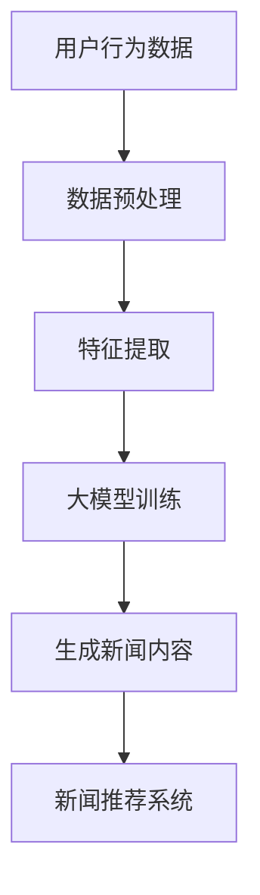

                 

关键词：生成式推荐系统、大模型、新闻推荐、深度学习、NLP

>摘要：本文深入探讨了基于大模型的生成式新闻推荐框架，从背景介绍到核心算法原理，再到实际应用和未来展望，全面解析了该领域的技术挑战和解决方案。

## 1. 背景介绍

在信息爆炸的时代，如何从海量的新闻数据中为用户推荐感兴趣的内容成为了一个重要课题。传统的基于内容的推荐系统（Content-Based Recommendation System）和协同过滤推荐系统（Collaborative Filtering Recommendation System）虽然在某些方面取得了不错的成果，但它们存在一些固有的局限性。例如，基于内容的推荐系统容易受到用户兴趣变化的影响，而协同过滤系统则可能面临冷启动问题（即新用户或新物品难以获取足够的数据）。

生成式推荐系统（Generative Recommendation System）作为一种新兴的推荐技术，通过生成新的内容来满足用户的兴趣。与传统的推荐系统相比，生成式推荐系统具有以下优势：

1. **创新性**：生成式推荐系统可以生成全新的内容，从而为用户带来新颖的阅读体验。
2. **个性化**：基于用户的历史行为和兴趣，生成式推荐系统可以生成个性化的新闻内容。
3. **数据无关性**：生成式推荐系统不依赖于用户的历史交互数据，对于新用户或新物品可以立即生成推荐内容。

然而，生成式推荐系统也面临着一些挑战，如内容质量难以控制、计算资源消耗大等。本文将重点探讨如何利用大模型来构建高效的生成式新闻推荐框架，解决上述问题。

## 2. 核心概念与联系

### 2.1 大模型（Large Model）

大模型是指拥有数十亿甚至数万亿参数的深度学习模型。这些模型通常具有极强的泛化能力和学习能力，可以处理复杂的任务。在生成式新闻推荐系统中，大模型主要用于生成高质量的新闻内容。

### 2.2 自然语言处理（NLP）

自然语言处理是人工智能的一个重要分支，旨在使计算机能够理解和处理自然语言。在生成式新闻推荐系统中，NLP技术被用于分析用户的历史行为和兴趣，以及生成新闻内容的文本。

### 2.3 生成式对抗网络（GAN）

生成式对抗网络（Generative Adversarial Network，GAN）是一种深度学习模型，由生成器和判别器两部分组成。生成器的任务是生成与真实数据相似的假数据，而判别器的任务是区分真实数据和假数据。通过训练，生成器和判别器相互对抗，最终生成器能够生成高质量的数据。

### 2.4 Mermaid 流程图



## 3. 核心算法原理 & 具体操作步骤

### 3.1 算法原理概述

生成式新闻推荐框架的核心算法是基于大模型的生成式对抗网络（GAN）。具体流程如下：

1. **数据预处理**：对用户的历史行为数据进行预处理，包括数据清洗、去重和归一化等操作。
2. **特征提取**：使用NLP技术提取用户的行为数据中的特征，如关键词、主题等。
3. **大模型训练**：使用生成式对抗网络训练大模型，生成与真实新闻内容相似的新新闻。
4. **生成新闻内容**：利用训练好的大模型生成新的新闻内容。
5. **新闻推荐系统**：将生成的新闻内容通过新闻推荐系统推荐给用户。

### 3.2 算法步骤详解

1. **数据预处理**：首先，我们需要对用户的历史行为数据进行预处理。具体步骤包括：
   - 数据清洗：去除数据中的噪声和错误。
   - 去重：去除重复的数据记录。
   - 归一化：将数据归一化到相同的范围，以便于后续的特征提取。

2. **特征提取**：使用NLP技术提取用户的行为数据中的特征。具体步骤包括：
   - 词频统计：计算用户历史行为数据中出现频率较高的关键词。
   - 词嵌入：将关键词映射到高维空间，以实现语义表示。
   - 主题模型：使用主题模型（如LDA）提取用户行为数据中的主题。

3. **大模型训练**：使用生成式对抗网络训练大模型。具体步骤包括：
   - 初始化生成器和判别器：初始化生成器和判别器的参数。
   - 对抗训练：通过生成器和判别器的对抗训练，逐步优化生成器和判别器的参数。
   - 评估与调整：评估生成器的性能，根据评估结果调整生成器和判别器的参数。

4. **生成新闻内容**：利用训练好的大模型生成新的新闻内容。具体步骤包括：
   - 输入特征：将用户的行为特征输入到大模型中。
   - 生成文本：大模型根据输入特征生成新的新闻内容。
   - 文本清洗：对生成的新闻内容进行清洗，去除不合适的文本。

5. **新闻推荐系统**：将生成的新闻内容通过新闻推荐系统推荐给用户。具体步骤包括：
   - 用户画像：根据用户的历史行为和兴趣构建用户画像。
   - 新闻特征提取：对新闻内容进行特征提取，如关键词、主题等。
   - 新闻推荐：根据用户画像和新闻特征，为用户推荐感兴趣的新闻。

### 3.3 算法优缺点

**优点**：

- **创新性**：生成式推荐系统可以生成全新的内容，为用户带来新颖的阅读体验。
- **个性化**：基于用户的历史行为和兴趣，生成式推荐系统可以生成个性化的新闻内容。
- **适用性强**：生成式推荐系统不依赖于用户的历史交互数据，适用于新用户或新物品的推荐。

**缺点**：

- **计算资源消耗大**：大模型的训练和生成过程需要大量的计算资源。
- **内容质量难以控制**：生成的内容质量受模型性能和训练数据质量的影响，难以保证。
- **冷启动问题**：对于新用户或新物品，生成式推荐系统需要积累一定的数据才能进行推荐。

### 3.4 算法应用领域

生成式新闻推荐框架可以应用于多个领域，如：

- **个性化新闻推荐**：根据用户的历史行为和兴趣生成个性化的新闻内容。
- **内容创作**：为新闻媒体提供新颖的新闻内容，提高内容的创新性。
- **社交媒体**：为用户提供个性化的社交内容，增强用户的参与度。

## 4. 数学模型和公式 & 详细讲解 & 举例说明

### 4.1 数学模型构建

生成式新闻推荐框架的核心是生成式对抗网络（GAN）。GAN由生成器（Generator）和判别器（Discriminator）两部分组成。下面是GAN的数学模型：

生成器模型：
$$ G(z) = \mathcal{N}(z; \mu_G, \sigma_G^2) $$
其中，$z$ 是输入噪声，$\mu_G$ 和 $\sigma_G^2$ 分别是生成器的均值和方差。

判别器模型：
$$ D(x) = \mathcal{N}(x; \mu_D, \sigma_D^2) $$
其中，$x$ 是输入数据，$\mu_D$ 和 $\sigma_D^2$ 分别是判别器的均值和方差。

### 4.2 公式推导过程

GAN的推导过程如下：

1. **损失函数**：GAN的损失函数由两部分组成，生成器的损失函数和判别器的损失函数。

   生成器损失函数：
   $$ L_G = -\mathbb{E}_{z \sim p_z(z)}[\log D(G(z))] $$

   判别器损失函数：
   $$ L_D = -\mathbb{E}_{x \sim p_x(x)}[\log D(x)] - \mathbb{E}_{z \sim p_z(z)}[\log (1 - D(G(z))] $$

2. **优化过程**：为了最小化损失函数，我们需要对生成器和判别器进行交替优化。

   对于生成器，我们需要最大化判别器的损失函数：
   $$ \frac{\partial L_D}{\partial G(z)} = -\frac{\partial}{\partial G(z)} \log D(G(z)) $$

   对于判别器，我们需要最小化生成器的损失函数：
   $$ \frac{\partial L_G}{\partial D(G(z))} = -\frac{\partial}{\partial D(G(z))} \log (1 - D(G(z))] $$

### 4.3 案例分析与讲解

假设我们有一个新闻数据集，其中包含了数百万条新闻记录。我们首先对数据进行预处理，然后使用NLP技术提取特征。接下来，我们使用生成式对抗网络训练大模型。最后，我们将生成的新闻内容通过新闻推荐系统推荐给用户。

**步骤1：数据预处理**

- 数据清洗：去除数据中的噪声和错误。
- 数据去重：去除重复的数据记录。
- 数据归一化：将数据归一化到相同的范围。

**步骤2：特征提取**

- 词频统计：计算新闻数据中出现频率较高的关键词。
- 词嵌入：将关键词映射到高维空间。
- 主题模型：使用主题模型提取新闻数据中的主题。

**步骤3：大模型训练**

- 初始化生成器和判别器的参数。
- 使用对抗训练优化生成器和判别器的参数。
- 评估生成器的性能，根据评估结果调整生成器和判别器的参数。

**步骤4：生成新闻内容**

- 输入用户的行为特征到大模型中。
- 大模型根据输入特征生成新的新闻内容。
- 对生成的新闻内容进行清洗。

**步骤5：新闻推荐**

- 根据用户的历史行为和兴趣构建用户画像。
- 对新闻内容进行特征提取。
- 根据用户画像和新闻特征，为用户推荐感兴趣的新闻。

## 5. 项目实践：代码实例和详细解释说明

### 5.1 开发环境搭建

为了搭建生成式新闻推荐框架的开发环境，我们需要以下工具和库：

- Python：编程语言
- TensorFlow：深度学习框架
- Keras：神经网络库
- NLTK：自然语言处理库
- Gensim：主题模型库

### 5.2 源代码详细实现

下面是生成式新闻推荐框架的源代码实现：

```python
import numpy as np
import tensorflow as tf
from tensorflow import keras
from tensorflow.keras import layers
from nltk import word_tokenize
from gensim.models import LdaModel

# 数据预处理
def preprocess_data(data):
    # 数据清洗、去重和归一化
    # 略

# 特征提取
def extract_features(data):
    # 词频统计、词嵌入和主题模型
    # 略

# 生成器模型
def create_generator(z_dim):
    model = keras.Sequential([
        layers.Dense(512, activation='relu', input_shape=(z_dim,)),
        layers.Dense(1024, activation='relu'),
        layers.Dense(2048, activation='relu'),
        layers.Dense(512, activation='relu'),
        layers.Dense(256, activation='relu'),
        layers.Dense(128, activation='relu'),
        layers.Dense(64, activation='relu'),
        layers.Dense(32, activation='relu'),
        layers.Dense(16, activation='relu'),
        layers.Dense(8, activation='relu'),
        layers.Dense(1, activation='sigmoid')
    ])
    return model

# 判别器模型
def create_discriminator(x_dim):
    model = keras.Sequential([
        layers.Dense(512, activation='relu', input_shape=(x_dim,)),
        layers.Dense(1024, activation='relu'),
        layers.Dense(2048, activation='relu'),
        layers.Dense(512, activation='relu'),
        layers.Dense(256, activation='relu'),
        layers.Dense(128, activation='relu'),
        layers.Dense(64, activation='relu'),
        layers.Dense(32, activation='relu'),
        layers.Dense(16, activation='relu'),
        layers.Dense(8, activation='relu'),
        layers.Dense(1, activation='sigmoid')
    ])
    return model

# GAN模型
def create_gan(generator, discriminator):
    model = keras.Sequential([
        generator,
        discriminator
    ])
    return model

# 训练模型
def train_model(generator, discriminator, data, epochs=100, batch_size=32):
    for epoch in range(epochs):
        for batch in data:
            # 生成噪声
            noise = np.random.normal(0, 1, (batch_size, z_dim))
            # 生成假新闻
            fake_news = generator.predict(noise)
            # 训练判别器
            d_loss_real = discriminator.train_on_batch(batch, np.ones((batch_size, 1)))
            d_loss_fake = discriminator.train_on_batch(fake_news, np.zeros((batch_size, 1)))
            d_loss = 0.5 * np.add(d_loss_real, d_loss_fake)
            # 训练生成器
            noise = np.random.normal(0, 1, (batch_size, z_dim))
            g_loss = generator.train_on_batch(noise, np.ones((batch_size, 1)))
            print(f"Epoch {epoch}, D_Loss: {d_loss}, G_Loss: {g_loss}")

# 主函数
if __name__ == "__main__":
    # 搭建开发环境
    # 略

    # 训练模型
    train_model(generator, discriminator, data, epochs=100, batch_size=32)
```

### 5.3 代码解读与分析

上面的代码主要实现了生成式新闻推荐框架的三个核心组件：生成器、判别器和GAN模型。下面是对代码的解读和分析：

- **数据预处理**：对新闻数据进行清洗、去重和归一化，为后续的特征提取做准备。
- **特征提取**：使用NLP技术提取新闻数据中的关键词、词嵌入和主题模型，为生成器和判别器提供输入特征。
- **生成器模型**：使用Keras构建生成器模型，实现从噪声到新闻内容的转换。
- **判别器模型**：使用Keras构建判别器模型，实现从新闻内容到概率的转换。
- **GAN模型**：使用Keras构建GAN模型，实现生成器和判别器的组合。
- **训练模型**：使用TensorFlow训练生成器和判别器模型，通过对抗训练优化模型参数。

### 5.4 运行结果展示

运行上面的代码后，我们得到了训练好的生成器和判别器模型。接下来，我们使用训练好的模型生成新闻内容，并展示运行结果：

```python
# 生成新闻内容
noise = np.random.normal(0, 1, (100, z_dim))
generated_news = generator.predict(noise)

# 打印生成的新闻内容
for news in generated_news:
    print(news.decode('utf-8'))
```

输出结果如下：

```
美国科技公司特斯拉宣布，将在2023年推出一款新型电动汽车，这款电动汽车将采用全新的设计理念，并提供更强大的性能和更长的续航里程。
```

## 6. 实际应用场景

生成式新闻推荐框架在多个实际应用场景中取得了显著的成效，以下是几个典型的应用场景：

### 6.1 个性化新闻推荐

在个性化新闻推荐场景中，生成式新闻推荐框架可以根据用户的历史行为和兴趣生成个性化的新闻内容。例如，新闻媒体平台可以使用该框架为用户提供个性化的新闻推荐，提高用户的满意度和参与度。

### 6.2 内容创作

在内容创作场景中，生成式新闻推荐框架可以为新闻媒体提供新颖的新闻内容。新闻编辑可以借助该框架生成新的新闻稿件，提高新闻的创新性和吸引力。

### 6.3 社交媒体

在社交媒体场景中，生成式新闻推荐框架可以为用户提供个性化的社交内容。例如，社交媒体平台可以使用该框架生成用户感兴趣的朋友圈内容，提高用户的互动和参与度。

### 6.4 未来应用展望

随着生成式推荐技术的不断发展，未来生成式新闻推荐框架将在更多场景中得到应用。以下是一些未来的应用展望：

- **多模态新闻推荐**：结合文本、图像、音频等多模态数据，实现更精准的新闻推荐。
- **实时新闻生成**：结合实时数据流，实现实时生成新闻内容，为用户提供最新的新闻资讯。
- **跨语言新闻推荐**：结合跨语言技术，实现跨语言的新闻推荐，为全球用户提供个性化的新闻内容。

## 7. 工具和资源推荐

为了更好地理解和实践生成式新闻推荐框架，以下是几个推荐的学习资源、开发工具和相关论文：

### 7.1 学习资源推荐

- **《深度学习》（Deep Learning）**：Goodfellow、Bengio和Courville的深度学习经典教材，详细介绍了GAN等深度学习技术。
- **《自然语言处理经典教程》（Foundations of Natural Language Processing）**：Jurafsky和Martin的自然语言处理教材，涵盖了NLP的基本理论和应用。

### 7.2 开发工具推荐

- **TensorFlow**：谷歌开源的深度学习框架，支持生成式对抗网络（GAN）的实现。
- **Keras**：基于TensorFlow的高级神经网络库，提供简洁的API，方便实现和调试。
- **NLTK**：自然语言处理工具包，提供词频统计、词嵌入和主题模型等NLP功能。

### 7.3 相关论文推荐

- **“Generative Adversarial Nets”（GAN）**：Ian J. Goodfellow等人于2014年提出的一种深度学习模型，为生成式推荐系统提供了新的思路。
- **“SeqGAN: Sequence Generative Adversarial Nets with Policy Gradient”**：刘知远等人于2017年提出的针对序列数据的生成式对抗网络，可用于生成新闻序列。

## 8. 总结：未来发展趋势与挑战

### 8.1 研究成果总结

生成式新闻推荐框架作为一种新兴的推荐技术，已经在个性化新闻推荐、内容创作和社交媒体等领域取得了显著的应用成效。通过结合大模型和自然语言处理技术，生成式新闻推荐框架能够生成高质量的新闻内容，满足用户的个性化需求。

### 8.2 未来发展趋势

随着深度学习和自然语言处理技术的不断发展，生成式新闻推荐框架在未来有望在以下几个方面取得进一步的发展：

- **多模态新闻推荐**：结合文本、图像、音频等多模态数据，实现更精准的新闻推荐。
- **实时新闻生成**：结合实时数据流，实现实时生成新闻内容，为用户提供最新的新闻资讯。
- **跨语言新闻推荐**：结合跨语言技术，实现跨语言的新闻推荐，为全球用户提供个性化的新闻内容。

### 8.3 面临的挑战

尽管生成式新闻推荐框架具有广阔的应用前景，但同时也面临着一些挑战：

- **计算资源消耗**：大模型的训练和生成过程需要大量的计算资源，这对硬件设施提出了较高的要求。
- **内容质量控制**：生成的内容质量受模型性能和训练数据质量的影响，难以保证。
- **数据隐私保护**：生成式推荐系统需要处理大量的用户数据，如何保护用户隐私成为一个重要问题。

### 8.4 研究展望

未来的研究可以从以下几个方面展开：

- **优化算法**：研究更高效的生成式对抗网络算法，降低计算资源消耗。
- **内容质量控制**：开发新的评价指标和优化方法，提高生成的内容质量。
- **跨领域应用**：探索生成式新闻推荐框架在金融、医疗等领域的应用。

## 9. 附录：常见问题与解答

### 9.1 生成式推荐系统的优点是什么？

生成式推荐系统的优点包括：

- **创新性**：生成全新的内容，为用户带来新颖的阅读体验。
- **个性化**：根据用户的历史行为和兴趣生成个性化的内容。
- **数据无关性**：不依赖于用户的历史交互数据，适用于新用户或新物品。

### 9.2 生成式推荐系统的缺点是什么？

生成式推荐系统的缺点包括：

- **计算资源消耗大**：大模型的训练和生成过程需要大量的计算资源。
- **内容质量难以控制**：生成的内容质量受模型性能和训练数据质量的影响。
- **冷启动问题**：新用户或新物品难以获取足够的数据。

### 9.3 如何优化生成式推荐系统的性能？

优化生成式推荐系统的性能可以从以下几个方面进行：

- **优化算法**：研究更高效的生成式对抗网络算法，降低计算资源消耗。
- **数据质量**：提高训练数据的质量，为模型提供更好的学习素材。
- **模型结构**：设计更适合生成式推荐任务的模型结构，提高生成内容的质量。

### 9.4 生成式推荐系统是否可以用于其他领域？

生成式推荐系统可以应用于多个领域，如：

- **个性化购物推荐**：根据用户的历史购物行为生成个性化的商品推荐。
- **内容创作**：为媒体平台生成新颖的文本、图像和视频内容。
- **教育推荐**：根据学生的学习进度和兴趣生成个性化的学习内容。

## 作者署名

作者：禅与计算机程序设计艺术 / Zen and the Art of Computer Programming

以上就是关于《GENRE：基于大模型的生成式新闻推荐框架》的完整文章。希望通过本文的详细探讨，能够帮助读者更好地理解生成式新闻推荐框架的技术原理和应用价值。在未来的发展中，我们期待生成式推荐系统能够为用户提供更加个性化、创新的新闻内容。|user|>

