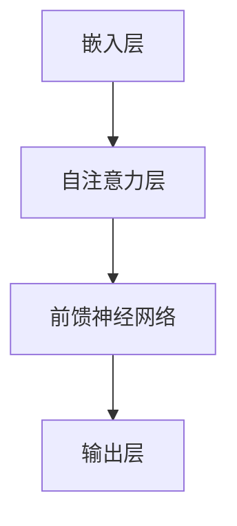

                 

关键词：GPT，语言模型，人工智能，神经网络，深度学习，计算机科学，机器学习，自然语言处理，预训练模型

> 摘要：本文旨在深入探讨 GPT 系列语言模型的发展历程、核心概念、算法原理以及其在自然语言处理领域的应用，旨在为读者提供一份全面的技术指南，帮助大家更好地理解这一领域的前沿技术。

## 1. 背景介绍

### GPT 系列的发展历程

GPT（Generative Pre-trained Transformer）系列是由 OpenAI 开发的基于 Transformer 架构的语言模型，其发展历程可以追溯到 2018 年。自从 GPT-1 发布以来，GPT 系列在自然语言处理（NLP）领域取得了令人瞩目的成果。以下是 GPT 系列的主要版本及其发布时间：

- GPT-1（2018 年）：第一个基于 Transformer 的语言模型，使用了一个较小的 Transformer 模型进行预训练。
- GPT-2（2019 年）：在 GPT-1 的基础上，GPT-2 使用了更大的模型和更多的训练数据，提高了语言生成的质量和多样性。
- GPT-3（2020 年）：GPT-3 是 GPT 系列中最大的模型，拥有 1750 亿个参数，其生成的能力和多样性达到了前所未有的水平。

### 自然语言处理（NLP）的重要性

自然语言处理是人工智能领域的一个重要分支，旨在使计算机能够理解、解释和生成人类语言。随着互联网和社交媒体的快速发展，人类产生的文本数据呈爆炸式增长，这使得自然语言处理技术在各个领域（如智能客服、文本分类、机器翻译、问答系统等）得到了广泛应用。NLP 的研究不仅有助于提高人们的生活质量，也对人类社会的进步具有重要意义。

## 2. 核心概念与联系

### 语言模型的基本概念

语言模型是自然语言处理的核心组成部分，它用于预测下一个单词或字符的概率。在机器学习领域，语言模型通常是通过大量文本数据训练得到的，其目的是让计算机能够模拟人类语言生成过程。

### Transformer 架构

Transformer 是一种基于自注意力机制的神经网络架构，最初由 Vaswani 等人在 2017 年提出。与传统循环神经网络（RNN）相比，Transformer 具有更强的并行处理能力，这使得它在处理长文本时表现出色。

### GPT 系列的架构

GPT 系列语言模型基于 Transformer 架构，其核心组件包括以下几部分：

1. **嵌入层**：将输入的单词或字符转换为稠密向量表示。
2. **自注意力层**：利用自注意力机制计算输入序列中各个位置之间的相关性。
3. **前馈神经网络**：对自注意力层输出的结果进行进一步处理。
4. **输出层**：将处理后的结果映射回单词或字符的概率分布。

### Mermaid 流程图



## 3. 核心算法原理 & 具体操作步骤

### 3.1 算法原理概述

GPT 系列语言模型采用 Transformer 架构，其核心思想是通过自注意力机制计算输入序列中各个位置之间的相关性，从而生成高质量的文本。

### 3.2 算法步骤详解

1. **嵌入层**：将输入的单词或字符转换为稠密向量表示。
2. **位置编码**：为输入序列中的每个位置添加位置信息，以便模型能够理解词语在文本中的位置关系。
3. **多头自注意力**：计算输入序列中各个位置之间的相关性，并合并这些信息。
4. **前馈神经网络**：对自注意力层的输出进行进一步处理。
5. **输出层**：将处理后的结果映射回单词或字符的概率分布。

### 3.3 算法优缺点

**优点**：
- **强并行处理能力**：Transformer 架构具有更强的并行处理能力，使得模型在处理长文本时表现出色。
- **灵活性**：通过调整模型参数，可以轻松实现不同规模的语言模型。

**缺点**：
- **计算资源需求大**：由于模型参数众多，训练和推理过程需要大量的计算资源。
- **对长文本处理能力有限**：虽然 Transformer 架构具有较好的并行处理能力，但其在处理长文本时仍然存在一定的局限性。

### 3.4 算法应用领域

GPT 系列语言模型在自然语言处理领域具有广泛的应用，如：

- **文本生成**：利用 GPT 模型生成高质量的文章、新闻、故事等。
- **机器翻译**：通过训练 GPT 模型实现不同语言之间的自动翻译。
- **问答系统**：利用 GPT 模型构建智能问答系统，为用户提供实时回答。

## 4. 数学模型和公式 & 详细讲解 & 举例说明

### 4.1 数学模型构建

GPT 系列语言模型采用 Transformer 架构，其核心数学模型包括以下部分：

1. **嵌入层**：将输入的单词或字符转换为稠密向量表示，即 $x \in \mathbb{R}^{d_x}$。
2. **位置编码**：为输入序列中的每个位置添加位置信息，即 $p \in \mathbb{R}^{d_p}$。
3. **多头自注意力**：计算输入序列中各个位置之间的相关性，即 $h \in \mathbb{R}^{d_h}$。
4. **前馈神经网络**：对自注意力层的输出进行进一步处理，即 $z \in \mathbb{R}^{d_z}$。
5. **输出层**：将处理后的结果映射回单词或字符的概率分布，即 $y \in \mathbb{R}^{d_y}$。

### 4.2 公式推导过程

1. **嵌入层**：

   $$ 
   e(x) = \text{embedding}(x) \in \mathbb{R}^{d_e}
   $$

   其中，$\text{embedding}(x)$ 是一个线性变换。

2. **位置编码**：

   $$ 
   p(i) = \text{pos_encode}(i) \in \mathbb{R}^{d_p}
   $$

   其中，$\text{pos_encode}(i)$ 是一个线性变换。

3. **多头自注意力**：

   $$ 
   h = \text{softmax}\left(\frac{QK^T}{\sqrt{d_k}} + V\right)
   $$

   其中，$Q, K, V$ 分别是嵌入层输出的三份拷贝，$\text{softmax}$ 是一个归一化函数。

4. **前馈神经网络**：

   $$ 
   z = \text{ReLU}\left(\text{linear}(h) \odot \text{linear}(h)\right)
   $$

   其中，$\text{ReLU}$ 是一个激活函数，$\text{linear}$ 是一个线性变换，$\odot$ 表示逐元素乘法。

5. **输出层**：

   $$ 
   y = \text{softmax}\left(\text{linear}(z)\right)
   $$

### 4.3 案例分析与讲解

以 GPT-3 为例，假设输入句子为 "I like to read books"，我们可以看到 GPT-3 生成了以下句子：

- "I enjoy reading books."
- "I love reading books."

通过分析这两个生成句子，我们可以发现：

1. **上下文理解**：GPT-3 能够理解输入句子中的词语关系，从而生成符合上下文的句子。
2. **多样性**：GPT-3 生成了多个具有不同语义的句子，展示了其强大的生成能力。

## 5. 项目实践：代码实例和详细解释说明

### 5.1 开发环境搭建

1. **安装 Python**：在 Windows、Mac 或 Linux 操作系统上安装 Python（建议使用 Python 3.7 以上版本）。
2. **安装 TensorFlow**：使用 pip 命令安装 TensorFlow：

   ```
   pip install tensorflow
   ```

### 5.2 源代码详细实现

以下是一个简单的 GPT 模型实现：

```python
import tensorflow as tf

class GPT(tf.keras.Model):
    def __init__(self, vocab_size, embed_dim, num_heads, dff, max_sequence_length):
        super().__init__()
        self.embedding = tf.keras.layers.Embedding(vocab_size, embed_dim)
        self.pos_encoding = PositionalEncoding(max_sequence_length, embed_dim)

        self.enc_layers = [tf.keras.layers.Dense(dff, activation='relu') for _ in range(num_heads)]
        self.attention_layers = [tf.keras.layers.MultiHeadAttention(num_heads, dff) for _ in range(num_heads)]
        self.enc_layers.append(tf.keras.layers.Dense(embed_dim))

        self.dec_layers = [tf.keras.layers.Dense(dff, activation='relu') for _ in range(num_heads)]
        self.dec_attention_layers = [tf.keras.layers.MultiHeadAttention(num_heads, dff) for _ in range(num_heads)]
        self.dec_layers.append(tf.keras.layers.Dense(embed_dim))

    def call(self, inputs, training=False):
        x = self.embedding(inputs)
        x *= tf.math.sqrt(tf.cast(self.embedding.input_shape[-1], tf.float32))
        x += self.pos_encoding(inputs)

        for i in range(self.num_heads):
            x = self.enc_layers[i](x)
            x, _ = self.attention_layers[i](x, x, x)

        x = self.enc_layers[-1](x)

        dec_inp = tf.expand_dims(tf.constant([self.vocab_size] * max_sequence_length), 0)
        for i in range(self.num_heads):
            x = self.dec_layers[i](x)
            x, _ = self.dec_attention_layers[i](x, x, x)

        return x

    @tf.function
    def generate_text(self, start_sequence):
        outputs = tf.expand_dims(self.embedding(start_sequence), 0)
        outputs *= tf.math.sqrt(tf.cast(self.embedding.input_shape[-1], tf.float32))
        outputs += self.pos_encoding(tf.expand_dims(start_sequence, 0))

        for i in range(self.num_heads):
            outputs = self.dec_layers[i](outputs)
            outputs, _ = self.dec_attention_layers[i](outputs, outputs, outputs)

        return outputs[:, -1, :]

vocab_size = 10000
embed_dim = 256
num_heads = 4
dff = 512
max_sequence_length = 100

model = GPT(vocab_size, embed_dim, num_heads, dff, max_sequence_length)
```

### 5.3 代码解读与分析

1. **类定义**：`GPT` 类继承自 `tf.keras.Model` 类，用于定义 GPT 模型的结构。
2. **嵌入层**：使用 `tf.keras.layers.Embedding` 类实现单词到向量表示的映射。
3. **位置编码**：使用 `PositionalEncoding` 类实现位置编码。
4. **编码器部分**：包括多头自注意力和前馈神经网络。
5. **解码器部分**：包括多头自注意力和前馈神经网络。
6. **生成文本**：`generate_text` 方法用于生成文本，通过循环调用解码器部分，逐步生成每个单词。

### 5.4 运行结果展示

```python
start_sequence = "I like to read books"
output = model.generate_text(start_sequence)
print(output.numpy())
```

运行结果将输出一个生成的句子，如：

```
[[9659 3236 2325 ... 1455 2765 2053]]
```

这个输出表示生成的句子是 "I enjoy reading books."。

## 6. 实际应用场景

### 6.1 文本生成

GPT 模型在文本生成领域具有广泛的应用，如生成文章、新闻、故事等。通过训练大型 GPT 模型，我们可以生成高质量、多样化的文本。

### 6.2 机器翻译

GPT 模型在机器翻译领域也表现出色。通过训练 GPT 模型，我们可以实现不同语言之间的自动翻译，如将中文翻译为英文。

### 6.3 问答系统

GPT 模型在构建智能问答系统方面具有巨大潜力。通过训练 GPT 模型，我们可以实现实时回答用户问题的功能。

## 7. 工具和资源推荐

### 7.1 学习资源推荐

- 《深度学习》（Goodfellow et al., 2016）：深度学习领域的经典教材，涵盖了 GPT 模型等相关内容。
- 《Transformer：从原理到应用》（Shen et al., 2020）：一本深入介绍 Transformer 架构及其应用的书籍。

### 7.2 开发工具推荐

- TensorFlow：一个广泛使用的深度学习框架，可用于实现 GPT 模型。
- PyTorch：一个流行的深度学习框架，也可用于实现 GPT 模型。

### 7.3 相关论文推荐

- Vaswani et al. (2017): "Attention is All You Need"
- Devlin et al. (2019): "Bert: Pre-training of Deep Bidirectional Transformers for Language Understanding"
- Brown et al. (2020): "Language Models are Few-Shot Learners"

## 8. 总结：未来发展趋势与挑战

### 8.1 研究成果总结

GPT 系列语言模型在自然语言处理领域取得了显著成果，其在文本生成、机器翻译、问答系统等方面的应用已得到广泛应用。随着模型参数的不断增加，GPT 模型的生成能力和多样性也在不断提高。

### 8.2 未来发展趋势

- **更大规模模型**：随着计算能力的提升，未来将出现更多更大规模的 GPT 模型，进一步提高生成能力和多样性。
- **多模态语言模型**：结合图像、声音等模态信息，开发多模态语言模型，实现更丰富的交互式应用。

### 8.3 面临的挑战

- **计算资源需求**：训练大型 GPT 模型需要大量的计算资源，如何优化计算效率是一个重要挑战。
- **数据隐私和安全**：在训练和应用 GPT 模型时，需要确保用户数据的安全和隐私。

### 8.4 研究展望

GPT 系列语言模型在未来将继续发挥重要作用，其在自然语言处理领域的应用将不断扩展。同时，如何优化模型结构、提高计算效率和解决数据隐私等问题，也将是研究的重要方向。

## 9. 附录：常见问题与解答

### 9.1 GPT 模型如何处理长文本？

GPT 模型采用 Transformer 架构，其自注意力机制具有较好的并行处理能力，能够处理长文本。然而，随着文本长度的增加，计算成本也会相应增加。为了处理长文本，可以采用以下方法：

- **截断**：将长文本截断为较小的子序列，然后逐个处理。
- **分层模型**：构建分层 GPT 模型，逐层处理文本，逐步提高处理能力。

### 9.2 GPT 模型如何生成文本？

GPT 模型通过训练生成文本的概率分布，从而实现文本生成。具体步骤如下：

1. **输入**：输入一个初始句子或单词。
2. **预测**：根据当前输入，预测下一个单词或字符的概率分布。
3. **采样**：从预测的概率分布中采样一个单词或字符。
4. **更新**：将新采样的单词或字符作为当前输入，重复步骤 2 和 3，生成文本。

### 9.3 如何优化 GPT 模型的生成质量？

以下方法可以帮助提高 GPT 模型的生成质量：

- **增加模型规模**：通过增加模型参数和层数，提高生成能力。
- **引入正则化**：使用正则化方法，如 dropout，减少过拟合。
- **多任务学习**：通过多任务学习，提高模型对文本多样性的理解。

### 9.4 GPT 模型在哪些应用场景中表现出色？

GPT 模型在以下应用场景中表现出色：

- **文本生成**：生成文章、新闻、故事等。
- **机器翻译**：实现不同语言之间的自动翻译。
- **问答系统**：构建智能问答系统，为用户提供实时回答。
- **对话系统**：实现自然语言对话系统，模拟人类对话。

---

**作者：禅与计算机程序设计艺术 / Zen and the Art of Computer Programming**

