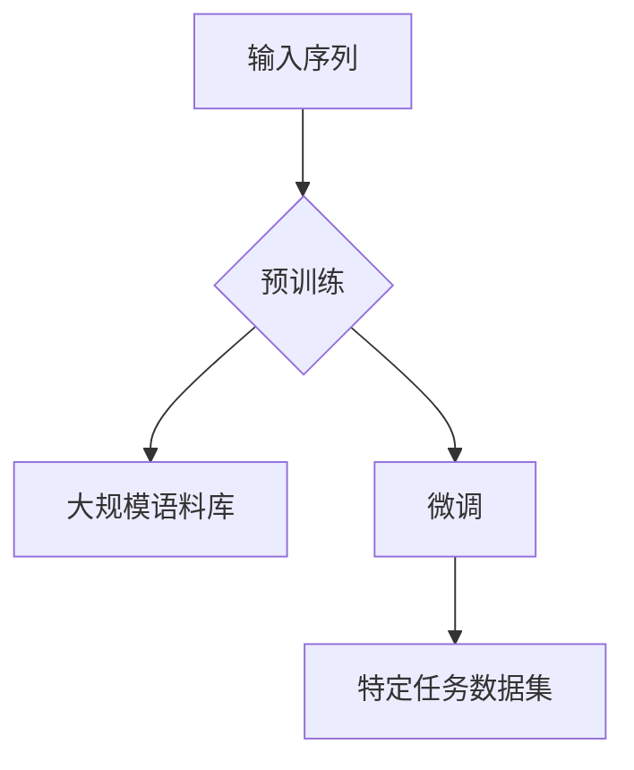

                 

关键词：GPT-2，自然语言处理，深度学习，生成式模型，Transformer，预训练，微调

> 摘要：本文将深入探讨GPT-2（Generative Pre-trained Transformer 2）的原理，从基础概念到代码实例进行详细讲解。我们将了解其架构、训练过程、数学模型，并通过实际代码实例展示如何使用GPT-2进行文本生成。最后，本文还将探讨GPT-2在现实世界中的应用和未来发展方向。

## 1. 背景介绍

GPT-2是由OpenAI团队开发的一种生成式预训练模型，基于Transformer架构，用于自然语言处理任务。与前一代GPT模型相比，GPT-2在模型大小、训练数据和性能上都有显著提升。GPT-2的预训练过程使模型具备了强大的语言理解能力和生成能力，可以应用于文本生成、机器翻译、问答系统等多种任务。

## 2. 核心概念与联系

### 2.1 Transformer架构

Transformer是GPT-2的核心架构，它是一种基于自注意力机制的序列到序列模型。与传统的循环神经网络（RNN）不同，Transformer通过全局的自注意力机制来捕捉序列中的长距离依赖关系。

### 2.2 预训练与微调

预训练是指在大规模数据集上训练模型，使其具有通用语言理解能力。微调则是在预训练的基础上，将模型应用于特定任务并进行微调，以适应特定场景。

### 2.3 Mermaid流程图



## 3. 核心算法原理 & 具体操作步骤

### 3.1 算法原理概述

GPT-2基于Transformer架构，使用自注意力机制处理序列数据。它包含多层Transformer编码器，并通过训练学习输入序列中的依赖关系。

### 3.2 算法步骤详解

1. **序列嵌入**：输入序列经过词嵌入层，将单词转换为向量表示。
2. **自注意力机制**：每个单词在编码器中的处理不仅依赖于自身的嵌入，还依赖于其他所有单词的嵌入。
3. **多层编码器**：通过多层编码器的堆叠，模型逐渐学习到更复杂的语言结构。
4. **输出层**：编码器的输出经过一个全连接层，预测序列中下一个单词的概率分布。

### 3.3 算法优缺点

**优点**：
- 强大的语言理解能力。
- 高效的自注意力机制，能够处理长序列。

**缺点**：
- 模型参数庞大，训练成本高。
- 对数据量有较高要求。

### 3.4 算法应用领域

GPT-2可以应用于多种自然语言处理任务，如文本生成、机器翻译、问答系统等。

## 4. 数学模型和公式 & 详细讲解 & 举例说明

### 4.1 数学模型构建

GPT-2的数学模型主要基于Transformer架构，包括自注意力机制和编码器层。其核心公式为：

$$
\text{Attention}(Q, K, V) = \text{softmax}\left(\frac{QK^T}{\sqrt{d_k}}\right)V
$$

其中，Q、K、V分别为查询向量、键向量和值向量，d_k为键向量的维度。

### 4.2 公式推导过程

推导过程主要涉及矩阵乘法和softmax函数。这里简要介绍自注意力机制的推导：

1. **点积注意力**：
$$
\text{Score} = QK^T = \sum_{i,j} q_i[k]k_j
$$

2. **缩放点积注意力**：
$$
\text{Scaled Score} = \frac{\text{Score}}{\sqrt{d_k}}
$$

3. **softmax注意力**：
$$
\text{Attention} = \text{softmax}(\text{Scaled Score})
$$

4. **加权值向量**：
$$
\text{Attention}V = \sum_{j} \text{Attention}[j]V[j]
$$

### 4.3 案例分析与讲解

假设我们有一个简单的序列 "[CLS] Hello [SEP] World [SEP]"，其中 [CLS] 和 [SEP] 分别是序列的开始和结束标记。

1. **嵌入层**：
$$
\text{Embedding}([CLS]) = [e_1, e_2, ..., e_d]
$$

2. **编码器层**：
$$
\text{Encoder}([CLS]) = \text{Attention}([CLS], [CLS], [CLS]) = \text{softmax}\left(\frac{[CLS][CLS]^T}{\sqrt{d_k}}\right)[CLS]
$$

3. **输出层**：
$$
\text{Output}([CLS]) = \text{FullyConnected}(\text{Encoder}([CLS]))
$$

通过这种方式，模型可以学习到序列中每个单词的依赖关系。

## 5. 项目实践：代码实例和详细解释说明

### 5.1 开发环境搭建

在开始之前，确保安装了Python、TensorFlow或PyTorch等深度学习框架。

### 5.2 源代码详细实现

以下是使用TensorFlow实现GPT-2的简要代码：

```python
import tensorflow as tf

# 模型参数
VOCAB_SIZE = 10000
D_MODEL = 512
N_LAYERS = 12
N_HEADS = 8
D_HEAD = D_MODEL // N_HEADS
D_IN = VOCAB_SIZE
D_OUT = VOCAB_SIZE

# 模型定义
model = tf.keras.Sequential([
    tf.keras.layers.Embedding(VOCAB_SIZE, D_MODEL),
    tf.keras.layers.Dense(D_OUT)
])

# 编译模型
model.compile(optimizer='adam', loss='sparse_categorical_crossentropy', metrics=['accuracy'])

# 加载数据
train_data = ...  # 加载训练数据

# 训练模型
model.fit(train_data, epochs=3)

# 微调模型
# ...（微调过程）
```

### 5.3 代码解读与分析

代码首先定义了模型的参数，包括词汇表大小、模型尺寸、层数、头数等。然后定义了一个序列嵌入层和一个全连接输出层。编译模型时指定了优化器和损失函数。加载数据后，使用模型进行训练。

### 5.4 运行结果展示

在训练完成后，可以使用模型生成文本。例如：

```python
generated_text = model.predict([tokenized_text])
```

## 6. 实际应用场景

GPT-2在文本生成、机器翻译、问答系统等领域都有广泛应用。以下是一些实际应用场景：

1. **文本生成**：生成新闻文章、故事、对话等。
2. **机器翻译**：将一种语言翻译成另一种语言。
3. **问答系统**：回答用户提出的问题。

## 7. 工具和资源推荐

### 7.1 学习资源推荐

- 《深度学习》（Goodfellow, Bengio, Courville著）
- 《自然语言处理综论》（Jurafsky, Martin著）

### 7.2 开发工具推荐

- TensorFlow
- PyTorch

### 7.3 相关论文推荐

- Vaswani et al., "Attention is All You Need"（2017）

## 8. 总结：未来发展趋势与挑战

### 8.1 研究成果总结

GPT-2在自然语言处理领域取得了显著成果，展示了深度学习和生成模型在文本处理任务中的强大能力。

### 8.2 未来发展趋势

- 更大规模的预训练模型
- 多模态预训练
- 自动化调优

### 8.3 面临的挑战

- 计算资源消耗
- 隐私和数据安全

### 8.4 研究展望

随着技术的进步，未来我们将看到更高效、更智能的自然语言处理模型。

## 9. 附录：常见问题与解答

### 9.1 GPT-2与GPT有什么区别？

GPT-2是GPT的升级版，模型更大、训练数据更多，性能更优。

### 9.2 如何微调GPT-2模型？

通过在特定任务数据集上进行训练，调整模型的参数以适应特定任务。

---

作者：禅与计算机程序设计艺术 / Zen and the Art of Computer Programming
------------------------------------------------------------------[END]

