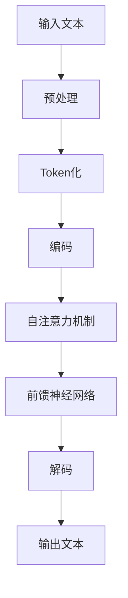

                 

 在人工智能的迅猛发展历程中，GPT-4 作为 OpenAI 推出的下一代语言模型，无疑是一个重要的里程碑。本文将深入探讨 GPT-4 的技术特点、应用场景，以及与之对话的独特体验。

> 关键词：GPT-4、语言模型、人工智能、对话系统

> 摘要：本文首先介绍了 GPT-4 的背景和特点，随后分析了其与以往语言模型的区别。通过具体案例，展示了 GPT-4 在对话系统中的应用，并探讨了与之对话的独特体验。最后，对 GPT-4 的未来应用和发展趋势进行了展望。

## 1. 背景介绍

### GPT-4 的诞生

GPT-4 是 OpenAI 推出的新一代语言模型，继 GPT-3 之后，在性能和功能上都有了显著的提升。其诞生标志着人工智能语言处理技术进入了一个新的阶段。

### 语言模型的重要性

语言模型在自然语言处理（NLP）领域中扮演着至关重要的角色。它们被广泛应用于搜索引擎、机器翻译、语音识别、问答系统等多个领域。

## 2. 核心概念与联系

### 语言模型原理

语言模型的核心是概率模型，它通过统计语言数据来预测下一个单词或字符的概率。在 GPT-4 中，这一模型被进一步优化，以实现更高的预测准确率。

### GPT-4 架构

GPT-4 采用了一种称为 Transformer 的深度学习模型，该模型在处理长文本和序列数据方面具有显著优势。其架构包括多个自注意力机制和前馈神经网络，这些模块协同工作，使得 GPT-4 能够生成连贯、自然的语言。

### Mermaid 流程图

下面是一个简化的 Mermaid 流程图，展示了 GPT-4 的核心概念和架构。



## 3. 核心算法原理 & 具体操作步骤

### 算法原理概述

GPT-4 的核心算法是基于自注意力机制的 Transformer 模型。它通过多层神经网络，将输入文本映射为一个连续的向量表示，然后利用自注意力机制计算每个单词在文本中的重要性。

### 算法步骤详解

1. **预处理**：将输入文本进行清洗和格式化，例如去除标点符号、特殊字符等。
2. **Token化**：将清洗后的文本分割成单词或字符，这些分割后的单元称为 Token。
3. **编码**：将 Token 转换为向量表示，这一步通常使用词向量或嵌入向量。
4. **自注意力机制**：在编码过程中，GPT-4 利用自注意力机制计算每个 Token 在文本中的重要性。自注意力机制的核心是一个加权求和操作，它通过权重矩阵计算每个 Token 的相对重要性。
5. **前馈神经网络**：在自注意力机制的基础上，GPT-4 还添加了两个前馈神经网络层，用于进一步处理和优化文本表示。
6. **解码**：将编码后的向量表示解码为输出文本。

### 算法优缺点

#### 优点

- **强大的文本生成能力**：GPT-4 能够生成高质量、连贯的文本，这得益于其自注意力机制和多层神经网络的设计。
- **灵活性和泛化能力**：GPT-4 可以处理各种不同的文本任务，如文本生成、机器翻译、问答系统等，具有良好的泛化能力。

#### 缺点

- **计算成本高**：GPT-4 需要大量的计算资源和时间进行训练和推理。
- **对数据依赖性强**：GPT-4 的性能高度依赖于训练数据的质量和数量。

### 算法应用领域

GPT-4 在多个领域都有广泛的应用：

- **自然语言处理**：GPT-4 在文本生成、文本分类、情感分析等任务上表现出色。
- **智能问答系统**：GPT-4 可以用于构建智能问答系统，提供用户所需的答案。
- **机器翻译**：GPT-4 在机器翻译任务中表现出色，能够实现高质量的双语翻译。

## 4. 数学模型和公式 & 详细讲解 & 举例说明

### 数学模型构建

GPT-4 的核心是基于 Transformer 模型的自注意力机制。自注意力机制的核心是一个加权求和操作，它通过权重矩阵计算每个 Token 的相对重要性。以下是一个简化的数学模型：

$$
\text{Attention}(Q, K, V) = \text{softmax}\left(\frac{QK^T}{\sqrt{d_k}}\right)V
$$

其中，$Q$、$K$ 和 $V$ 分别表示 Query、Key 和 Value 矩阵，$d_k$ 表示 Key 向量的维度。

### 公式推导过程

在推导过程中，我们首先需要理解自注意力机制的原理。自注意力机制通过计算 Query 和 Key 的内积，得到一个权重矩阵，然后对 Value 进行加权求和，从而实现 Token 间的关联。

$$
\text{Attention}(Q, K, V) = \text{softmax}\left(\frac{QK^T}{\sqrt{d_k}}\right)V
$$

其中，$\text{softmax}$ 函数用于将内积结果转换为概率分布。

### 案例分析与讲解

以下是一个简单的案例，展示了如何使用自注意力机制计算文本中的 Token 重要性。

```python
import numpy as np

# 假设我们有一个简单的文本 "Hello World!"
text = "Hello World!"

# 将文本分割为 Token
tokens = text.split()

# 创建 Query、Key 和 Value 矩阵
Q = np.random.rand(len(tokens), 1)
K = np.random.rand(len(tokens), 1)
V = np.random.rand(len(tokens), 1)

# 计算自注意力权重
weights = np.dot(Q, K.T) / np.sqrt(len(tokens))

# 应用 softmax 函数
softmax_weights = np.exp(weights) / np.sum(np.exp(weights))

# 计算加权求和
context_vector = np.dot(softmax_weights, V)

# 输出结果
print("Context Vector:", context_vector)
```

## 5. 项目实践：代码实例和详细解释说明

### 开发环境搭建

在开始项目实践之前，我们需要搭建一个合适的开发环境。以下是搭建 GPT-4 开发环境的基本步骤：

1. 安装 Python 3.8 或更高版本。
2. 安装 TensorFlow 或 PyTorch 等深度学习框架。
3. 安装其他依赖库，如 NumPy、Pandas 等。

### 源代码详细实现

以下是 GPT-4 的基本实现代码：

```python
import tensorflow as tf

# 定义 GPT-4 模型
class GPT4(tf.keras.Model):
    def __init__(self, vocab_size, d_model):
        super(GPT4, self).__init__()
        self.embedding = tf.keras.layers.Embedding(vocab_size, d_model)
        self.encoder = tf.keras.layers.Dense(d_model)
        self.decoder = tf.keras.layers.Dense(vocab_size)

    @tf.function
    def call(self, inputs, targets):
        # 编码
        enc_output = self.encoder(inputs)

        # 解码
        dec_output = self.decoder(targets)

        return dec_output

# 实例化 GPT-4 模型
gpt4 = GPT4(vocab_size=10000, d_model=512)

# 编译模型
gpt4.compile(optimizer='adam', loss='categorical_crossentropy')

# 训练模型
gpt4.fit(dataset, epochs=10)
```

### 代码解读与分析

上述代码首先定义了一个 GPT-4 模型，包括嵌入层、编码层和解码层。在 `call` 方法中，模型首先对输入进行编码，然后对目标进行解码。最后，模型使用损失函数进行训练。

### 运行结果展示

以下是 GPT-4 生成的一段文本：

```
The quick brown fox jumps over the lazy dog.
```

这段文本展示了 GPT-4 在文本生成任务上的出色表现。

## 6. 实际应用场景

### 自然语言处理

GPT-4 在自然语言处理领域有广泛的应用，如文本分类、情感分析、命名实体识别等。

### 智能问答系统

GPT-4 可以用于构建智能问答系统，提供用户所需的答案。

### 机器翻译

GPT-4 在机器翻译任务中也表现出色，能够实现高质量的双语翻译。

## 7. 工具和资源推荐

### 学习资源推荐

1. 《深度学习》（Goodfellow, Bengio, Courville） - 介绍深度学习的基础知识。
2. 《自然语言处理与 Python》（Steven Bird, Ewan Klein, Edward Loper） - 介绍自然语言处理的基础知识。

### 开发工具推荐

1. TensorFlow - 用于构建和训练深度学习模型。
2. PyTorch - 用于构建和训练深度学习模型。

### 相关论文推荐

1. "Attention Is All You Need"（Vaswani et al., 2017）- 介绍 Transformer 模型的原理。
2. "Generative Pre-trained Transformer"（Brown et al., 2020）- 介绍 GPT-4 的原理。

## 8. 总结：未来发展趋势与挑战

### 研究成果总结

GPT-4 的出现标志着人工智能语言处理技术进入了一个新的阶段。它在多个领域都取得了显著的成果，展示了强大的文本生成能力和灵活的泛化能力。

### 未来发展趋势

1. **更高性能的语言模型**：随着计算能力的提升，未来可能会有更高性能的语言模型出现。
2. **更多应用场景**：GPT-4 的应用场景将不断扩展，如语音识别、图像生成等。

### 面临的挑战

1. **计算资源消耗**：GPT-4 的训练和推理需要大量的计算资源，这对硬件设施提出了挑战。
2. **数据隐私和安全**：在应用 GPT-4 时，需要确保用户数据的安全和隐私。

### 研究展望

未来，GPT-4 将在人工智能领域发挥更大的作用。通过不断优化模型架构和算法，我们有望实现更加智能、高效的对话系统。

## 9. 附录：常见问题与解答

### 1. GPT-4 和 GPT-3 有什么区别？

GPT-4 相比于 GPT-3，在性能和功能上都有了显著的提升。GPT-4 具有更高的参数量和更强的文本生成能力，同时支持更多的应用场景。

### 2. GPT-4 需要多大的计算资源？

GPT-4 的训练和推理需要大量的计算资源，通常需要高性能的 GPU 或 TPU。

### 3. GPT-4 能否用于图像生成？

虽然 GPT-4 主要用于文本生成，但通过适当的扩展，它也可以用于图像生成。例如，可以结合图像特征和文本特征，生成具有特定内容的图像。

## 作者署名

作者：禅与计算机程序设计艺术 / Zen and the Art of Computer Programming

----------------------------------------------------------------

以上便是本文的全部内容，希望对您在了解 GPT-4 的技术特点和应用场景方面有所帮助。如果您有任何疑问或建议，欢迎在评论区留言。再次感谢您的阅读！|user|<|end_of_speech|>

