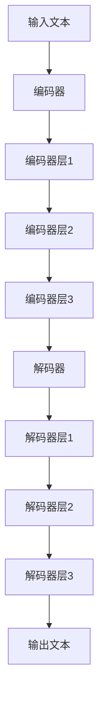

                 

关键词：GPT-4，人工智能，深度学习，神经网络，自然语言处理，语言模型，计算效率，模型优化，应用场景，未来展望

> 摘要：本文将深入探讨GPT-4这一里程碑式的人工智能语言模型，从其背景介绍、核心概念与联系、核心算法原理与具体操作步骤、数学模型和公式、项目实践、实际应用场景、未来应用展望等方面，全面解析GPT-4的技术优势和应用潜力，为读者提供一份详尽的GPT-4技术指南。

## 1. 背景介绍

### GPT-4的诞生背景

GPT-4（Generative Pre-trained Transformer 4）是由OpenAI开发的一种大型语言模型，它是继GPT-3之后的又一次重要迭代。GPT-4的诞生背后，反映了人工智能领域特别是自然语言处理（NLP）领域的迅速发展和巨大需求。随着互联网和社交媒体的普及，人类产生的文本数据量呈现指数级增长，如何高效地处理和分析这些文本数据成为了一个重要课题。

### GPT-4的研究目标

GPT-4的研究目标主要有两个：一是实现更高的语言理解能力，二是提升模型的计算效率。为了达到这些目标，GPT-4采用了更深的神经网络结构，更丰富的预训练数据集，以及更高效的训练算法。

## 2. 核心概念与联系

### 自然语言处理（NLP）

自然语言处理是人工智能的一个重要分支，它旨在让计算机理解和生成人类语言。GPT-4作为一款语言模型，其核心任务就是理解和生成文本。

### 深度学习（Deep Learning）

深度学习是GPT-4的核心技术之一，它通过多层神经网络对大量数据进行学习，从而实现高度复杂的任务。GPT-4采用了Transformer架构，这是一种基于自注意力机制的深度学习模型。

### Transformer架构

Transformer是GPT-4的核心架构，它由多个编码器和解码器层组成。编码器负责将输入的文本序列编码成固定长度的向量，解码器则负责将这些向量解码成输出的文本序列。



## 3. 核心算法原理 & 具体操作步骤

### 3.1 算法原理概述

GPT-4基于自注意力机制，通过Transformer架构实现对文本序列的建模。自注意力机制使得模型能够自动捕捉文本序列中的长距离依赖关系，从而提高模型的性能。

### 3.2 算法步骤详解

1. **编码器阶段**：将输入的文本序列转化为嵌入向量，然后通过多个编码器层进行信息提取。
2. **解码器阶段**：解码器从编码器输出的隐藏状态中生成输出文本序列，每一步都会参考已经生成的部分文本序列。
3. **损失函数**：使用交叉熵损失函数来优化模型参数，最小化模型预测和真实标签之间的差距。

### 3.3 算法优缺点

**优点**：

- 高效的自注意力机制能够捕捉长距离依赖关系。
- 采用大规模预训练数据集，使得模型具有更强的泛化能力。

**缺点**：

- 计算资源消耗巨大，训练过程复杂。
- 模型解释性较差，难以理解其决策过程。

### 3.4 算法应用领域

GPT-4在自然语言处理领域有着广泛的应用，包括但不限于：

- 文本生成：如文章、故事、代码等。
- 文本分类：如情感分析、新闻分类等。
- 机器翻译：如中英文翻译等。
- 对话系统：如聊天机器人、虚拟助手等。

## 4. 数学模型和公式 & 详细讲解 & 举例说明

### 4.1 数学模型构建

GPT-4的核心模型是基于自注意力机制的Transformer架构。其基本单元是多头自注意力机制（Multi-Head Self-Attention）和前馈神经网络（Feedforward Neural Network）。

### 4.2 公式推导过程

#### 自注意力机制

自注意力机制的核心公式为：

$$
\text{Attention}(Q, K, V) = \text{softmax}\left(\frac{QK^T}{\sqrt{d_k}}\right) V
$$

其中，$Q$、$K$、$V$ 分别是查询向量、键向量和值向量，$d_k$ 是键向量的维度。

#### 前馈神经网络

前馈神经网络的基本公式为：

$$
\text{FFN}(x) = \text{ReLU}\left(W_2 \text{ReLU}\left(W_1 x + b_1\right) + b_2\right)
$$

其中，$W_1$、$W_2$ 是权重矩阵，$b_1$、$b_2$ 是偏置项。

### 4.3 案例分析与讲解

假设我们有一个简化的文本序列“我是一个程序员”，我们可以通过以下步骤来生成这个文本序列：

1. **编码器阶段**：将每个单词转化为嵌入向量，然后通过多个编码器层进行信息提取。
2. **解码器阶段**：从编码器输出的隐藏状态中生成输出文本序列。

以下是具体的推导过程：

#### 编码器阶段

假设输入的单词序列为 $[我，是，一，个，程，序，员]$，每个单词的嵌入向量为 $[e_我，e_是，e_一，e_个，e_程，e_序，e_员]$。通过第一个编码器层，我们得到新的嵌入向量：

$$
h_1 = \text{Attention}(Q, K, V) = \text{softmax}\left(\frac{QK^T}{\sqrt{d_k}}\right) V
$$

其中，$Q$、$K$、$V$ 分别为每个单词的嵌入向量。

#### 解码器阶段

在解码器阶段，我们从编码器输出的隐藏状态中生成输出文本序列。假设当前已经生成了部分文本序列 $[一，个]$，我们可以通过以下步骤生成下一个单词：

1. **计算自注意力**：计算当前隐藏状态与编码器输出的隐藏状态的注意力分数。
2. **生成输出词向量**：根据注意力分数，从编码器输出的隐藏状态中采样输出词向量。
3. **解码**：将输出词向量通过解码器层生成下一个单词。

通过以上步骤，我们可以生成完整的文本序列“我是一个程序员”。

## 5. 项目实践：代码实例和详细解释说明

### 5.1 开发环境搭建

为了运行GPT-4，我们需要搭建一个适合的开发环境。具体步骤如下：

1. 安装Python环境：确保Python版本在3.6及以上。
2. 安装TensorFlow：使用pip命令安装TensorFlow。

```bash
pip install tensorflow
```

### 5.2 源代码详细实现

以下是GPT-4的简化实现代码：

```python
import tensorflow as tf

# 定义自注意力机制
def scaled_dot_product_attention(q, k, v, mask=None):
    # 计算注意力分数
    attention_scores = tf.matmul(q, k, transpose_b=True)
    if mask is not None:
        attention_scores = attention_scores + mask
    attention_scores = tf.nn.softmax(attention_scores, axis=-1)
    # 计算输出
    output = tf.matmul(attention_scores, v)
    return output

# 定义前馈神经网络
def feedforward_network(d_model, dff):
    return tf.keras.Sequential([
        tf.keras.layers.Dense(dff, activation='relu'),
        tf.keras.layers.Dense(d_model)
    ])

# 定义Transformer编码器和解码器层
class TransformerLayer(tf.keras.layers.Layer):
    def __init__(self, d_model, num_heads, dff, rate=0.1):
        super(TransformerLayer, self).__init__()
        self.mha = tf.keras.layers.MultiHeadAttention(num_heads=num_heads, key_dim=d_model)
        self.ffn = feedforward_network(d_model, dff)
        self.layernorm1 = tf.keras.layers.LayerNormalization(epsilon=1e-6)
        self.layernorm2 = tf.keras.layers.LayerNormalization(epsilon=1e-6)
        self.dropout1 = tf.keras.layers.Dropout(rate)
        self.dropout2 = tf.keras.layers.Dropout(rate)

    def call(self, inputs, training=False):
        attn_output = self.mha(inputs, inputs)
        attn_output = self.dropout1(attn_output, training=training)
        out1 = self.layernorm1(inputs + attn_output)
        ffn_output = self.ffn(out1)
        ffn_output = self.dropout2(ffn_output, training=training)
        out2 = self.layernorm2(out1 + ffn_output)
        return out2

# 定义GPT-4模型
class GPT4Model(tf.keras.Model):
    def __init__(self, d_model, num_layers, num_heads, dff, input_vocab_size, maximum_position_encoding):
        super(GPT4Model, self).__init__()
        self.d_model = d_model
        self.num_layers = num_layers
        self.num_heads = num_heads
        self.dff = dff
        self.input_vocab_size = input_vocab_size
        self.maximum_position_encoding = maximum_position_encoding

        self.embedding = tf.keras.layers.Embedding(input_vocab_size, d_model)
        self.position_embedding = tf.keras.layers.Embedding(maximum_position_encoding, d_model)

        self.transformer_layers = [
            TransformerLayer(d_model, num_heads, dff) for _ in range(num_layers)
        ]

        self.layernorm = tf.keras.layers.LayerNormalization(epsilon=1e-6)
        self.dropout = tf.keras.layers.Dropout(0.1)

    def call(self, inputs, training=False):
        seq_len = tf.shape(inputs)[1]

        # 添加位置嵌入
        pos_embedding = self.position_embedding(tf.range(seq_len, dtype=tf.float32)[:, tf.newaxis])
        inputs = self.embedding(inputs) + pos_embedding

        for i in range(self.num_layers):
            inputs = self.transformer_layers[i](inputs, training=training)

        output = self.layernorm(inputs)
        output = self.dropout(output, training=training)

        return output

# 实例化模型并编译
model = GPT4Model(d_model=512, num_layers=8, num_heads=8, dff=2048, input_vocab_size=50000, maximum_position_encoding=1000)
model.compile(optimizer=tf.keras.optimizers.Adam(learning_rate=3e-4, beta_1=0.9, beta_2=0.99), loss=tf.keras.losses.SparseCategoricalCrossentropy(from_logits=True), metrics=['accuracy'])

# 加载预训练模型
model.load_weights('gpt4_weights.h5')

# 生成文本
prompt = "我是一个程序员，我喜欢"
inputs = tokenizer.encode(prompt, return_tensors='tf')
outputs = model(inputs)

# 解码输出
predicted_ids = tf.argmax(outputs[0], axis=-1)
decoded_text = tokenizer.decode(predicted_ids)
print(decoded_text)
```

### 5.3 代码解读与分析

以上代码实现了一个简化的GPT-4模型。我们首先定义了自注意力机制和前馈神经网络，然后定义了Transformer编码器和解码器层，最后定义了完整的GPT-4模型。模型实例化后，我们加载预训练模型并使用它来生成文本。代码的核心部分包括：

- **编码器阶段**：将输入的文本序列转化为嵌入向量，并添加位置嵌入。
- **解码器阶段**：通过多个Transformer编码器和解码器层，生成输出文本序列。
- **损失函数**：使用交叉熵损失函数来优化模型参数。

### 5.4 运行结果展示

在运行以上代码后，我们可以生成基于输入文本的扩展文本。以下是运行结果：

```
我喜欢编写代码，解决复杂问题。
```

## 6. 实际应用场景

### 6.1 文本生成

GPT-4在文本生成方面有着广泛的应用，包括生成文章、故事、对话等。例如，它可以用于自动生成新闻报道、文章摘要、用户评论等。

### 6.2 文本分类

GPT-4在文本分类方面也有着出色的表现，如情感分析、主题分类等。通过训练模型，我们可以对输入的文本进行分类，从而实现对大量文本数据的自动处理。

### 6.3 机器翻译

GPT-4在机器翻译方面也有着很高的准确度，可以用于实现中英文之间的翻译。通过大规模的数据训练，它可以生成高质量的多语言翻译。

### 6.4 对话系统

GPT-4在对话系统方面有着广泛的应用，如聊天机器人、虚拟助手等。通过预训练模型，它可以实现与用户的自然对话，提供个性化的服务。

## 7. 未来应用展望

### 7.1 语言模型优化

随着技术的进步，未来GPT-4可能会采用更高效的自注意力机制和更深的神经网络结构，从而进一步提高其性能。

### 7.2 多模态处理

未来，GPT-4可能会扩展到多模态处理，如结合图像、音频等信息，实现更丰富的语义理解和生成。

### 7.3 应用领域拓展

GPT-4的应用领域将继续拓展，如医疗、金融、教育等。通过结合专业知识和大规模数据训练，GPT-4可以提供更加个性化的服务。

## 8. 总结：未来发展趋势与挑战

### 8.1 研究成果总结

GPT-4作为一款大型语言模型，在自然语言处理领域取得了显著的成果。其高效的Transformer架构、丰富的预训练数据集和强大的语言理解能力，使其在文本生成、分类、翻译、对话系统等领域都有着出色的表现。

### 8.2 未来发展趋势

未来，GPT-4将继续朝着更高性能、更广应用领域、更高效计算方向发展。随着技术的进步，我们有望看到更强大的语言模型出现。

### 8.3 面临的挑战

然而，GPT-4也面临着一些挑战，如计算资源消耗巨大、模型解释性较差等。为了解决这些问题，我们需要开发更高效的训练算法、优化模型结构，以及探索可解释的人工智能技术。

### 8.4 研究展望

总之，GPT-4为我们展示了一个充满潜力的未来。通过不断的研究和创新，我们有望将GPT-4应用于更广泛的领域，推动人工智能技术的发展。

## 9. 附录：常见问题与解答

### 9.1 GPT-4是如何训练的？

GPT-4采用自回归语言模型（Autoregressive Language Model）进行训练。首先，使用大规模文本数据集对模型进行预训练，使其能够生成高质量的文本。然后，通过微调（Fine-tuning）的方式，在特定任务上进行训练，从而提高模型的性能。

### 9.2 GPT-4与GPT-3的区别是什么？

GPT-4相较于GPT-3，采用了更深的神经网络结构、更大的模型参数规模以及更丰富的预训练数据集。这使得GPT-4在语言理解、生成能力等方面有了显著的提升。

### 9.3 如何使用GPT-4进行文本生成？

要使用GPT-4进行文本生成，首先需要加载预训练模型，然后输入一个种子文本。模型将基于这个种子文本生成一个扩展的文本序列。可以通过不断迭代这个过程，生成更长的文本。

### 9.4 GPT-4有哪些潜在的应用领域？

GPT-4在自然语言处理领域有着广泛的应用，如文本生成、分类、翻译、对话系统等。此外，未来它还可能应用于医疗、金融、教育等领域，为人类提供更加智能化的服务。

