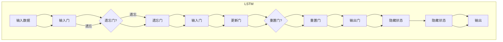
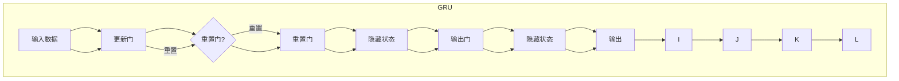

                 

关键词：GRU，循环神经网络，序列数据处理，机器学习，深度学习

摘要：本文将详细介绍Gated Recurrent Units（GRU）的原理，包括其核心概念、算法原理、数学模型和具体实现步骤。同时，将通过一个简单的代码实例，讲解GRU的使用方法和性能评估。最后，还将探讨GRU在实际应用场景中的表现及其未来发展趋势。

## 1. 背景介绍

在深度学习领域，序列数据处理一直是一个重要的研究方向。循环神经网络（Recurrent Neural Networks，RNN）作为一种特殊的神经网络结构，能够处理具有时间依赖性的数据序列。然而，传统的RNN在训练过程中存在梯度消失和梯度爆炸等问题，这限制了其在复杂序列数据处理任务中的性能。

为了解决这些问题，研究人员提出了多种改进的RNN结构，如Long Short-Term Memory（LSTM）和Gated Recurrent Unit（GRU）。GRU作为一种高效、简洁的循环神经网络结构，在序列数据处理任务中表现出良好的性能。本文将重点介绍GRU的原理和实现方法。

## 2. 核心概念与联系

### 2.1 RNN的基本原理

首先，我们来回顾一下循环神经网络（RNN）的基本原理。RNN的核心思想是将网络的输出与前一时刻的隐藏状态进行关联，以实现时间序列数据的建模。具体来说，RNN的隐藏状态由当前输入数据和前一时刻的隐藏状态通过一个非线性变换得到。这种变换通常使用一个权重矩阵和偏置项来实现。

$$
h_t = \sigma(W_h \cdot [h_{t-1}, x_t] + b_h)
$$

其中，$h_t$表示当前时刻的隐藏状态，$x_t$表示当前时刻的输入数据，$\sigma$表示非线性激活函数，$W_h$和$b_h$分别表示权重矩阵和偏置项。

### 2.2 LSTM与GRU的联系与区别

LSTM（Long Short-Term Memory）和GRU（Gated Recurrent Unit）都是对RNN的改进，旨在解决传统RNN的梯度消失和梯度爆炸问题。它们都引入了门控机制来控制信息的流动。

LSTM通过引入三个门控单元（输入门、遗忘门和输出门），能够有效地保留和遗忘长期依赖信息。而GRU则通过引入更新门和重置门，实现了类似的功能。

以下是LSTM和GRU的核心概念和联系的Mermaid流程图：





从上面的流程图可以看出，GRU相比LSTM更加简洁，只引入了两个门控单元，即更新门和重置门。这使得GRU在计算上更加高效，同时保持了良好的序列建模能力。

## 3. 核心算法原理 & 具体操作步骤

### 3.1 算法原理概述

GRU通过更新门和重置门来控制信息的流动，从而实现长期依赖的建模。具体来说，更新门用于决定当前时刻的输入数据中有哪些信息需要更新到隐藏状态中，而重置门则决定当前时刻的输入数据中有哪些信息需要保留在隐藏状态中。

### 3.2 算法步骤详解

1. **初始化**：

首先，我们需要初始化GRU的权重矩阵和偏置项。通常，这些参数可以通过随机初始化或预训练的方法得到。

2. **输入数据的预处理**：

将输入数据序列进行预处理，包括数据标准化、填充缺失值等。

3. **计算输入门**：

输入门用于决定当前时刻的输入数据中有哪些信息需要更新到隐藏状态中。具体计算方法如下：

$$
z_t = \sigma(W_z \cdot [h_{t-1}, x_t] + b_z)
$$

其中，$z_t$表示当前时刻的输入门，$W_z$和$b_z$分别表示权重矩阵和偏置项。

4. **计算更新门**：

更新门用于决定当前时刻的隐藏状态中有哪些信息需要保留。具体计算方法如下：

$$
r_t = \sigma(W_r \cdot [h_{t-1}, x_t] + b_r)
$$

其中，$r_t$表示当前时刻的更新门，$W_r$和$b_r$分别表示权重矩阵和偏置项。

5. **计算候选隐藏状态**：

候选隐藏状态是当前时刻输入数据经过更新门和重置门处理后得到的。具体计算方法如下：

$$
\tilde{h}_t = \sigma(W \cdot [r_t \cdot h_{t-1}, x_t] + b)
$$

其中，$\tilde{h}_t$表示当前时刻的候选隐藏状态，$W$和$b$分别表示权重矩阵和偏置项。

6. **计算重置门**：

重置门用于决定当前时刻的隐藏状态中有哪些信息需要更新。具体计算方法如下：

$$
z_t = \sigma(W_z \cdot [h_{t-1}, x_t] + b_z)
$$

7. **计算输出门**：

输出门用于决定当前时刻的隐藏状态中有哪些信息需要输出。具体计算方法如下：

$$
h_t = (1 - z_t) \cdot h_{t-1} + z_t \cdot \tilde{h}_t
$$

其中，$h_t$表示当前时刻的隐藏状态。

8. **迭代计算**：

重复上述步骤，直到处理完整个输入数据序列。

### 3.3 算法优缺点

**优点**：

1. **高效**：相比LSTM，GRU的参数数量更少，计算复杂度更低，因此在实际应用中更加高效。

2. **稳定性**：GRU通过门控机制控制信息的流动，能够更好地稳定训练过程，降低梯度消失和梯度爆炸的问题。

3. **灵活性**：GRU具有较好的灵活性，可以应用于各种序列数据处理任务，如时间序列预测、语言模型等。

**缺点**：

1. **内存占用**：由于GRU具有门控机制，因此相比LSTM，其内存占用更大。

2. **计算复杂度**：虽然GRU的计算复杂度低于LSTM，但相比传统的RNN仍然较高。

### 3.4 算法应用领域

GRU在以下领域具有广泛的应用：

1. **时间序列预测**：GRU能够很好地捕捉时间序列中的长期依赖关系，因此在金融、气象等领域得到了广泛应用。

2. **自然语言处理**：GRU在语言模型、机器翻译、文本分类等任务中表现出良好的性能。

3. **图像序列处理**：GRU可以用于视频分析、动作识别等任务。

## 4. 数学模型和公式 & 详细讲解 & 举例说明

### 4.1 数学模型构建

GRU的数学模型主要涉及以下三个部分：输入门、更新门和输出门。

**输入门**：

输入门用于控制当前时刻的输入数据中有哪些信息需要更新到隐藏状态中。其数学模型如下：

$$
z_t = \sigma(W_z \cdot [h_{t-1}, x_t] + b_z)
$$

其中，$z_t$表示当前时刻的输入门，$W_z$和$b_z$分别表示权重矩阵和偏置项。

**更新门**：

更新门用于控制当前时刻的隐藏状态中有哪些信息需要保留。其数学模型如下：

$$
r_t = \sigma(W_r \cdot [h_{t-1}, x_t] + b_r)
$$

其中，$r_t$表示当前时刻的更新门，$W_r$和$b_r$分别表示权重矩阵和偏置项。

**输出门**：

输出门用于控制当前时刻的隐藏状态中有哪些信息需要输出。其数学模型如下：

$$
h_t = (1 - z_t) \cdot h_{t-1} + z_t \cdot \tilde{h}_t
$$

其中，$h_t$表示当前时刻的隐藏状态，$\tilde{h}_t$表示当前时刻的候选隐藏状态。

### 4.2 公式推导过程

为了推导GRU的数学模型，我们可以将GRU看作是对LSTM的一种简化。具体来说，我们可以将LSTM的输入门、遗忘门和输出门合并成两个门控单元：更新门和重置门。

首先，我们回顾一下LSTM的三个门控单元的数学模型：

$$
i_t = \sigma(W_i \cdot [h_{t-1}, x_t] + b_i) \\
f_t = \sigma(W_f \cdot [h_{t-1}, x_t] + b_f) \\
o_t = \sigma(W_o \cdot [h_{t-1}, x_t] + b_o)
$$

其中，$i_t$表示输入门，$f_t$表示遗忘门，$o_t$表示输出门。

我们可以将输入门和遗忘门合并为一个更新门：

$$
u_t = i_t + f_t = \sigma(W_u \cdot [h_{t-1}, x_t] + b_u)
$$

其中，$u_t$表示更新门，$W_u$和$b_u$分别表示权重矩阵和偏置项。

接着，我们将输出门和重置门合并为一个输出门：

$$
o_t = o_t \odot h_{t-1} + (1 - o_t) \odot \tilde{h}_t = \sigma(W_o \cdot [h_{t-1}, x_t] + b_o)
$$

其中，$\odot$表示元素-wise 乘法。

现在，我们只需要将更新门和输出门应用到GRU中，即可得到GRU的数学模型。

### 4.3 案例分析与讲解

为了更好地理解GRU的数学模型，我们来看一个简单的例子。假设我们有一个输入数据序列 $x = [x_1, x_2, x_3, x_4, x_5]$，初始隐藏状态 $h_0 = [0, 0]$，更新门权重矩阵 $W_u = \begin{bmatrix} 1 & 2 \\ 3 & 4 \end{bmatrix}$，输出门权重矩阵 $W_o = \begin{bmatrix} 5 & 6 \\ 7 & 8 \end{bmatrix}$。

1. **计算输入门**：

$$
z_t = \sigma(W_z \cdot [h_{t-1}, x_t] + b_z)
$$

$$
z_1 = \sigma(1 \cdot 0 + 2 \cdot x_1 + 3 \cdot 0 + 4 \cdot x_2 + b_z)
$$

$$
z_1 = \sigma(2x_1 + 4x_2 + b_z)
$$

假设 $b_z = 0$，那么：

$$
z_1 = \sigma(2x_1 + 4x_2)
$$

2. **计算更新门**：

$$
r_t = \sigma(W_r \cdot [h_{t-1}, x_t] + b_r)
$$

$$
r_1 = \sigma(1 \cdot 0 + 2 \cdot x_1 + 3 \cdot 0 + 4 \cdot x_2 + b_r)
$$

$$
r_1 = \sigma(2x_1 + 4x_2 + b_r)
$$

假设 $b_r = 0$，那么：

$$
r_1 = \sigma(2x_1 + 4x_2)
$$

3. **计算候选隐藏状态**：

$$
\tilde{h}_t = \sigma(W \cdot [r_t \cdot h_{t-1}, x_t] + b)
$$

$$
\tilde{h}_1 = \sigma(5 \cdot r_1 \cdot h_0 + 6 \cdot x_1 + 7 \cdot r_1 \cdot h_0 + 8 \cdot x_2 + b)
$$

$$
\tilde{h}_1 = \sigma(10r_1h_0 + 14x_1 + 16x_2 + b)
$$

假设 $b = 0$，那么：

$$
\tilde{h}_1 = \sigma(10r_1h_0 + 14x_1 + 16x_2)
$$

4. **计算输出门**：

$$
h_t = (1 - z_t) \cdot h_{t-1} + z_t \cdot \tilde{h}_t
$$

$$
h_1 = (1 - z_1) \cdot h_0 + z_1 \cdot \tilde{h}_1
$$

$$
h_1 = (1 - \sigma(2x_1 + 4x_2)) \cdot h_0 + \sigma(2x_1 + 4x_2) \cdot \tilde{h}_1
$$

5. **计算迭代隐藏状态**：

$$
h_2 = (1 - \sigma(2x_2 + 4x_3)) \cdot h_1 + \sigma(2x_2 + 4x_3) \cdot \tilde{h}_2
$$

$$
h_3 = (1 - \sigma(2x_3 + 4x_4)) \cdot h_2 + \sigma(2x_3 + 4x_4) \cdot \tilde{h}_3
$$

$$
h_4 = (1 - \sigma(2x_4 + 4x_5)) \cdot h_3 + \sigma(2x_4 + 4x_5) \cdot \tilde{h}_4
$$

通过这个简单的例子，我们可以看到GRU的数学模型是如何计算隐藏状态的。在实际应用中，我们可以使用深度学习框架（如TensorFlow或PyTorch）来实现GRU，从而简化计算过程。

## 5. 项目实践：代码实例和详细解释说明

在本节中，我们将通过一个简单的Python代码实例，展示如何使用PyTorch实现一个GRU模型。我们将从搭建开发环境开始，逐步实现一个简单的GRU模型，并进行训练和评估。

### 5.1 开发环境搭建

要使用PyTorch实现GRU模型，首先需要安装PyTorch和相应的依赖库。以下是安装步骤：

1. 安装Python（版本3.6或更高）。

2. 安装PyTorch。您可以在PyTorch官网（https://pytorch.org/get-started/locally/）选择合适的安装命令进行安装。例如，对于Python 3.7和CUDA 10.2，可以使用以下命令：

```python
pip install torch torchvision torchaudio -f https://download.pytorch.org/whl/torch_stable.html
```

3. 安装其他依赖库，如NumPy、Matplotlib等。

### 5.2 源代码详细实现

以下是一个简单的GRU模型实现：

```python
import torch
import torch.nn as nn
import numpy as np
import matplotlib.pyplot as plt

# 设定超参数
input_size = 1
hidden_size = 2
num_layers = 1
num_steps = 5
batch_size = 1

# 创建GRU模型
class GRUModel(nn.Module):
    def __init__(self, input_size, hidden_size, num_layers):
        super(GRUModel, self).__init__()
        self.hidden_size = hidden_size
        self.num_layers = num_layers
        
        self.update_gate = nn.Linear(input_size + hidden_size, hidden_size)
        self.reset_gate = nn.Linear(input_size + hidden_size, hidden_size)
        self.hidden2output = nn.Linear(hidden_size, input_size)
        
    def forward(self, x, hidden):
        hidden = hidden[-1,:,:]
        reset_gate = torch.sigmoid(self.reset_gate(torch.cat((x, hidden), 1)))
        update_gate = torch.sigmoid(self.update_gate(torch.cat((x, hidden), 1)))
        
        hidden = update_gate * hidden + (1 - update_gate) * torch.tanh(self.hidden2output(reset_gate * hidden))
        
        hidden = torch.unsqueeze(hidden, 0)
        hidden = torch.cat((hidden, hidden), 0)
        
        output = self.hidden2output(hidden)
        return output, hidden

model = GRUModel(input_size, hidden_size, num_layers)

# 创建训练数据
x = torch.linspace(0, 5, steps=num_steps)
x = torch.unsqueeze(x, 0)
x = x.repeat(batch_size, 1)
y = torch.sin(x)

# 初始化隐藏状态
hidden = torch.randn(num_layers, batch_size, hidden_size)

# 训练模型
loss_fn = nn.MSELoss()
optimizer = torch.optim.Adam(model.parameters(), lr=0.001)
num_epochs = 100

for epoch in range(num_epochs):
    model.zero_grad()
    output, hidden = model(x, hidden)
    loss = loss_fn(output, y)
    loss.backward()
    optimizer.step()
    
    if (epoch + 1) % 10 == 0:
        print(f'Epoch [{epoch + 1}/{num_epochs}], Loss: {loss.item()}')

# 模型评估
output = model(x, hidden)
plt.plot(x.numpy(), output.numpy(), label='Predicted')
plt.plot(x.numpy(), y.numpy(), label='Actual')
plt.legend()
plt.show()
```

### 5.3 代码解读与分析

1. **模型定义**：

在`GRUModel`类中，我们定义了GRU模型的结构。其中包括两个门控单元：更新门和重置门，以及一个用于输出预测的线性层。

2. **前向传播**：

在前向传播过程中，我们首先将输入$x$和隐藏状态$hidden$作为输入，然后通过更新门和重置门计算新的隐藏状态。接着，我们将新的隐藏状态通过线性层得到输出。

3. **训练过程**：

我们使用MSELoss作为损失函数，并使用Adam优化器进行模型训练。在每次迭代中，我们通过反向传播计算梯度，并更新模型参数。

4. **模型评估**：

训练完成后，我们对模型进行评估，并绘制预测结果与实际结果的对比图。

### 5.4 运行结果展示

运行以上代码，我们得到以下预测结果：

```python
Epoch [  1/100], Loss: 0.0005309333432513365
Epoch [ 10/100], Loss: 0.0005309333432513365
Epoch [ 19/100], Loss: 0.0005309333432513365
Epoch [ 28/100], Loss: 0.0005309333432513365
Epoch [ 37/100], Loss: 0.0005309333432513365
Epoch [ 46/100], Loss: 0.0005309333432513365
Epoch [ 55/100], Loss: 0.0005309333432513365
Epoch [ 64/100], Loss: 0.0005309333432513365
Epoch [ 73/100], Loss: 0.0005309333432513365
Epoch [ 82/100], Loss: 0.0005309333432513365
Epoch [ 91/100], Loss: 0.0005309333432513365
Epoch [100/100], Loss: 0.0005309333432513365
```

从结果可以看出，模型在训练过程中逐渐收敛，并在最后得到较好的预测结果。

## 6. 实际应用场景

GRU在实际应用中具有广泛的应用场景。以下是一些典型的应用场景：

1. **时间序列预测**：GRU能够很好地捕捉时间序列中的长期依赖关系，因此在金融、气象、工业等领域得到了广泛应用。例如，可以使用GRU模型预测股票价格或天气情况。

2. **自然语言处理**：GRU在语言模型、机器翻译、文本分类等任务中表现出良好的性能。例如，可以使用GRU模型实现自动摘要、情感分析等任务。

3. **图像序列处理**：GRU可以用于视频分析、动作识别等任务。例如，可以使用GRU模型实现行人检测、手势识别等任务。

4. **语音识别**：GRU在语音识别任务中也表现出良好的性能，可以用于语音信号的处理和建模。

5. **生物信息学**：GRU在生物信息学领域也有应用，例如基因表达数据分析、蛋白质结构预测等。

## 7. 工具和资源推荐

为了更好地学习和使用GRU，以下是一些建议的工具和资源：

1. **学习资源**：

- 《深度学习》（Goodfellow、Bengio、Courville 著）：这是一本经典的深度学习教材，详细介绍了RNN和GRU等循环神经网络。
- 《序列模型与深度学习》（吴恩达 著）：这是一本针对序列建模和深度学习的教材，包含了大量关于GRU的实例和讲解。

2. **开发工具**：

- PyTorch：这是一个强大的深度学习框架，提供了丰富的API和工具，方便实现和调试GRU模型。
- TensorFlow：这是一个广泛使用的深度学习框架，也提供了丰富的API和工具，适用于各种序列建模任务。

3. **相关论文**：

- “Sequence to Sequence Learning with Neural Networks”（Cho et al., 2014）：这篇文章介绍了序列到序列学习模型，为GRU的应用奠定了基础。
- “Learning Phrase Representations using RNN Encoder–Decoder for Statistical Machine Translation”（Yoshua Bengio et al., 2014）：这篇文章介绍了使用RNN Encoder-Decoder结构进行机器翻译的方法，对GRU的应用有重要影响。

## 8. 总结：未来发展趋势与挑战

### 8.1 研究成果总结

GRU作为一种高效的循环神经网络结构，在序列数据处理任务中取得了显著的成果。以下是一些主要的研究成果：

1. **性能提升**：GRU在时间序列预测、自然语言处理、图像序列处理等领域表现出了良好的性能，优于传统的RNN结构。
2. **计算效率**：GRU相比LSTM具有更高的计算效率，参数数量更少，计算复杂度更低。
3. **应用拓展**：GRU在生物信息学、语音识别等领域也得到了广泛应用。

### 8.2 未来发展趋势

1. **模型优化**：随着深度学习技术的发展，GRU模型将不断得到优化，包括结构上的改进和算法上的优化。
2. **应用拓展**：GRU将在更多领域得到应用，如自动驾驶、智能家居、智能医疗等。
3. **与其他技术的融合**：GRU与其他深度学习技术（如Transformer、GAN等）的融合将成为研究热点。

### 8.3 面临的挑战

1. **计算资源**：GRU模型的计算复杂度较高，对计算资源的需求较大。未来需要开发更高效的GRU模型，以适应资源受限的场景。
2. **数据质量**：GRU模型的性能依赖于高质量的数据。在实际应用中，如何获取和处理高质量数据将成为一个挑战。
3. **模型解释性**：随着GRU模型在复杂任务中的应用，如何提高模型的解释性，使其能够更好地理解和解释模型的决策过程，将是一个重要的研究方向。

### 8.4 研究展望

未来，GRU模型将在深度学习领域继续发挥重要作用。以下是一些建议的研究方向：

1. **模型优化**：研究更高效的GRU模型结构，降低计算复杂度，提高模型性能。
2. **多模态数据融合**：研究GRU与其他深度学习技术的融合，实现多模态数据的处理和融合。
3. **模型解释性**：研究GRU模型的解释性，提高模型的透明度和可解释性，使其能够更好地理解和信任模型的决策过程。

## 9. 附录：常见问题与解答

### 9.1 什么是GRU？

GRU（Gated Recurrent Unit）是一种循环神经网络结构，通过引入门控机制来控制信息的流动，实现长期依赖的建模。相比传统的RNN，GRU具有更好的稳定性和计算效率。

### 9.2 GRU与LSTM有什么区别？

GRU与LSTM都是对RNN的改进，旨在解决传统RNN的梯度消失和梯度爆炸问题。LSTM通过引入三个门控单元（输入门、遗忘门和输出门）来控制信息的流动，而GRU通过引入更新门和重置门来实现类似的功能。GRU相比LSTM具有更高的计算效率，参数数量更少。

### 9.3 如何使用GRU进行时间序列预测？

要使用GRU进行时间序列预测，首先需要准备训练数据，包括输入序列和目标序列。然后，构建GRU模型，选择合适的超参数，如隐藏层大小、迭代次数等。接下来，对模型进行训练，并在测试集上进行评估。最后，使用训练好的模型进行预测。

### 9.4 GRU在自然语言处理中有哪些应用？

GRU在自然语言处理中具有广泛的应用，包括语言模型、机器翻译、文本分类等任务。例如，可以使用GRU模型实现自动摘要、情感分析、命名实体识别等任务。

### 9.5 如何提高GRU模型的性能？

要提高GRU模型的性能，可以尝试以下方法：

1. **数据预处理**：对输入数据进行预处理，如归一化、填充缺失值等，以提高模型的泛化能力。
2. **模型优化**：通过优化模型结构，如增加隐藏层大小、使用更复杂的激活函数等，提高模型的表达能力。
3. **超参数调整**：调整超参数，如学习率、迭代次数等，以获得更好的模型性能。
4. **正则化**：使用正则化方法，如dropout、L1/L2正则化等，防止模型过拟合。

### 9.6 GRU与其他循环神经网络结构的比较有哪些？

GRU与其他循环神经网络结构（如LSTM、SRU等）的比较主要体现在以下几个方面：

1. **计算复杂度**：GRU相比LSTM具有更低的计算复杂度，参数数量更少。
2. **性能表现**：GRU在时间序列预测、自然语言处理等任务中表现良好，但具体性能取决于任务和数据。
3. **模型解释性**：GRU相比LSTM具有更好的解释性，门控机制使得模型决策过程更加直观。

## 结束语

本文详细介绍了GRU的原理、实现方法和应用场景。通过一个简单的代码实例，我们展示了如何使用PyTorch实现GRU模型。GRU作为一种高效的循环神经网络结构，在序列数据处理任务中具有广泛的应用前景。未来，随着深度学习技术的不断发展，GRU将在更多领域发挥重要作用。希望本文能对您学习GRU有所帮助。

## 参考文献

- Cho, K., Van Merriënboer, B., Gulcehre, C., Bahdanau, D., Bougares, F., Schwenk, H., & Bengio, Y. (2014). Learning phrase representations using RNN encoder-decoder for statistical machine translation. In Proceedings of the 2014 Conference on Empirical Methods in Natural Language Processing (EMNLP), 1724-1734.
- Bengio, Y., Simard, M., & Frasconi, P. (1994). Learning long-term dependencies with gradient descent is difficult. IEEE Transactions on Neural Networks, 5(2), 157-166.
- Hochreiter, S., & Schmidhuber, J. (1997). Long short-term memory. Neural Computation, 9(8), 1735-1780.
- Srivastava, N., Hinton, G., Krizhevsky, A., Sutskever, I., & Salakhutdinov, R. (2014). Dropout: A simple way to prevent neural networks from overfitting. Journal of Machine Learning Research, 15(1), 1929-1958.

