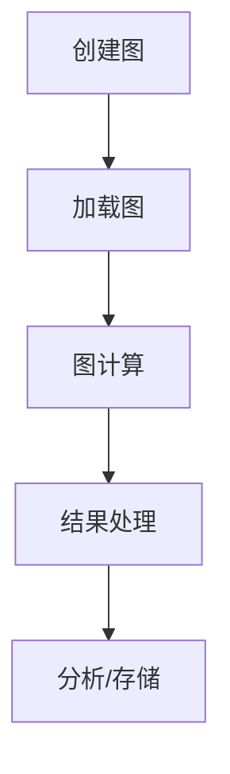
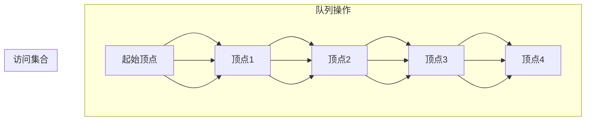
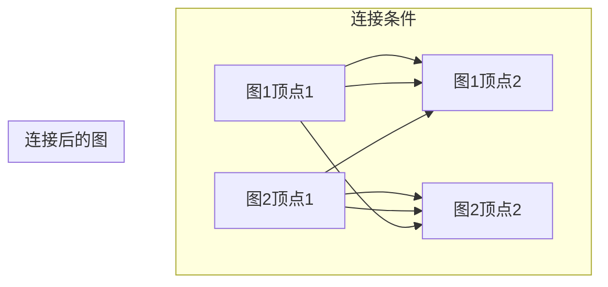
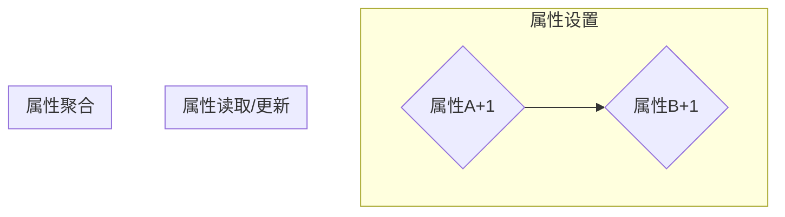

                 

## 1. 背景介绍

### 图计算的概念

图计算（Graph Computing）是指对图（Graph）结构的数据进行存储、处理和分析的一种计算方法。图由节点（Node）和边（Edge）构成，是一种用来表示实体之间关系的数据结构。相比于传统的表格或关系型数据库，图结构能够更好地捕捉和表示复杂的关系网络。

在现实世界中，许多问题都可以抽象为图计算问题。例如，社交网络中人与人之间的联系、互联网中网页之间的链接、生物信息学中基因与蛋白质的相互作用等。图计算在这些领域中扮演着重要的角色，可以用于推荐系统、社交网络分析、数据挖掘、生物信息学等多个领域。

### GraphX的引入

GraphX是Apache Spark的一个开源分布式图处理框架，它扩展了Spark的弹性分布式数据集（RDD）和Spark SQL，提供了一个易用的编程接口来处理图。GraphX的设计目标是提供强大的图处理能力，同时保持Spark的核心特性，如内存管理、弹性分布式数据集、高效的数据序列化等。

GraphX的核心特性包括：

- **交互式图处理**：GraphX支持交互式图计算，用户可以在运行时动态地迭代和修改图。
- **图-图连接**：GraphX提供了图-图连接功能，允许用户将多个图连接在一起进行计算。
- **顶点和边的属性**：GraphX允许顶点和边携带属性，这些属性可以是任何类型的Spark数据结构，如RDD、DataFrame或分布式序列。
- **分层图处理**：GraphX支持分层图处理，允许用户将图划分为多个层次，并进行层次化的计算。

### GraphX的应用场景

GraphX广泛应用于多个领域，包括但不限于：

- **社交网络分析**：通过分析社交网络中的关系，可以识别社交圈子、流行趋势、影响力人物等。
- **推荐系统**：利用图计算可以构建推荐系统，根据用户的社交关系和兴趣推荐相关的内容或产品。
- **生物信息学**：在生物信息学中，GraphX可以帮助分析基因和蛋白质的相互作用网络。
- **复杂网络分析**：GraphX可以用于分析交通网络、电力网络等复杂网络，优化网络结构和性能。

接下来，我们将深入探讨GraphX的核心概念、算法原理以及如何在实际项目中应用GraphX。

## 2. 核心概念与联系

### 核心概念

在GraphX中，有两个核心概念：图（Graph）和图计算（Graph Computation）。图（Graph）由顶点（Vertex）和边（Edge）组成。顶点表示图中的实体，如人、网页、基因等；边表示顶点之间的关系。每个顶点和边都可以携带属性，这些属性可以是数字、字符串或其他复杂数据结构。

图计算（Graph Computation）是指在图结构上进行的一系列计算。GraphX提供了一套丰富的图计算操作，包括图遍历、属性传播、图连接等。

### 图的表示

GraphX中的图可以通过两种方式表示：边表示法和邻接表示法。

- **边表示法**：在这种方法中，每个顶点存储指向其邻居的边。这种表示法适合处理稀疏图，因为只有在顶点之间有实际关系时才会存储边。
- **邻接表示法**：在这种方法中，每个顶点存储一个邻接表，包含其所有邻居顶点。这种表示法适合处理密集图，因为每个顶点都可能与其它的顶点有关系。

### 图计算的流程

图计算的流程通常包括以下几个步骤：

1. **创建图**：使用GraphX提供的API创建图，可以指定图的边和顶点。
2. **加载图**：将图从内存或外部存储中加载到GraphX中。
3. **图计算**：使用GraphX提供的图操作对图进行计算，如顶点遍历、边属性更新等。
4. **结果处理**：将计算结果从GraphX中取出，进行进一步的分析或存储。

### Mermaid流程图

下面是一个用Mermaid语言绘制的GraphX流程图，展示了图计算的基本流程：



通过这个流程图，我们可以清晰地看到GraphX的基本工作流程，以及每个步骤的作用。

## 3. 核心算法原理 & 具体操作步骤

### 3.1 算法原理概述

GraphX的核心算法主要涉及图的遍历、图的连接、顶点和边的属性操作等。这些算法都是基于图的基本操作，通过迭代和递归来实现复杂的图计算任务。

#### 图遍历

图遍历是图计算中最基本也是最重要的操作之一。GraphX支持两种主要的图遍历算法：深度优先搜索（DFS）和广度优先搜索（BFS）。

- **深度优先搜索（DFS）**：DFS算法从一个顶点开始，尽可能深地探索图的分支。
- **广度优先搜索（BFS）**：BFS算法从一个顶点开始，逐层探索图的邻接节点。

#### 图连接

图连接是将两个或多个图合并为一个图的运算。GraphX支持多种图连接方式，包括：

- **图与图的连接**：将两个图的顶点和边合并，并设置连接条件。
- **顶点与顶点的连接**：将两个顶点合并，并设置连接条件。
- **边与边的连接**：将两个边合并，并设置连接条件。

#### 顶点和边的属性操作

GraphX允许用户为顶点和边设置属性，并进行属性操作。这些操作包括：

- **属性读取**：从顶点或边中读取属性值。
- **属性更新**：更新顶点或边的属性值。
- **属性聚合**：对多个顶点或边的属性进行聚合计算。

### 3.2 算法步骤详解

下面我们将详细讲解GraphX中的几个核心算法原理和步骤。

#### 深度优先搜索（DFS）

深度优先搜索的算法步骤如下：

1. 初始化一个空栈和一个访问集合。
2. 将起始顶点入栈，并将起始顶点加入访问集合。
3. 当栈非空时，执行以下步骤：
    - 弹出一个顶点。
    - 对该顶点执行所需的操作。
    - 将该顶点的所有未访问的邻接节点入栈，并加入访问集合。

以下是深度优先搜索的Mermaid图示：


#### 广度优先搜索（BFS）

广度优先搜索的算法步骤如下：

1. 初始化一个空队列和一个访问集合。
2. 将起始顶点入队，并将起始顶点加入访问集合。
3. 当队列非空时，执行以下步骤：
    - 出队一个顶点。
    - 对该顶点执行所需的操作。
    - 将该顶点的所有未访问的邻接节点入队，并加入访问集合。

以下是广度优先搜索的Mermaid图示：



#### 图连接

图连接的算法步骤如下：

1. 确定连接条件，例如顶点的属性匹配。
2. 对图进行连接操作，将满足条件的顶点和边合并。
3. 更新图的结构和属性。

以下是图连接的Mermaid图示：



#### 顶点和边的属性操作

顶点和边的属性操作的步骤如下：

1. 为顶点和边设置属性。
2. 读取和更新属性值。
3. 对属性进行聚合计算。

以下是属性操作的Mermaid图示：



通过以上步骤，我们可以看到GraphX的核心算法是如何工作的。接下来，我们将讨论这些算法的优缺点，并探讨其在实际应用领域的应用。

### 3.3 算法优缺点

#### 优点

- **灵活性和扩展性**：GraphX提供了一套丰富的图操作API，可以灵活地处理各种图计算任务，并且容易扩展。
- **分布式处理**：GraphX基于Spark，可以利用Spark的分布式计算能力，处理大规模的图数据。
- **内存管理**：GraphX使用Spark的内存管理机制，可以有效地利用内存资源，提高计算效率。
- **交互式编程**：GraphX支持交互式编程，用户可以实时查看计算结果，方便调试和优化。

#### 缺点

- **学习曲线**：GraphX相对其他图处理框架（如Neo4j）较为复杂，需要用户具备一定的编程和图处理知识。
- **性能瓶颈**：尽管GraphX利用了Spark的分布式计算能力，但在处理非常大规模的图时，可能会遇到性能瓶颈。
- **社区支持**：相比于其他图处理框架，GraphX的社区支持相对较少，可能影响到用户的开发和使用。

### 3.4 算法应用领域

GraphX在多个领域都有广泛的应用，以下是一些主要的领域：

- **社交网络分析**：通过GraphX可以分析社交网络中的用户关系，识别社交圈子、影响力人物等。
- **推荐系统**：利用GraphX可以构建推荐系统，根据用户之间的社交关系和兴趣推荐相关内容或产品。
- **生物信息学**：GraphX可以用于分析基因和蛋白质的相互作用网络，帮助科学家理解复杂的生物系统。
- **复杂网络分析**：GraphX可以用于分析交通网络、电力网络等复杂网络，优化网络结构和性能。
- **图数据库**：GraphX可以作为图数据库的后端，提供强大的图处理能力和查询功能。

通过以上分析，我们可以看到GraphX在图计算领域的重要性和广泛应用。接下来，我们将进一步探讨GraphX的数学模型和公式，以及如何使用这些公式进行具体的计算和分析。

## 4. 数学模型和公式 & 详细讲解 & 举例说明

### 4.1 数学模型构建

在GraphX中，图计算往往涉及多个数学模型和公式。这些模型和公式帮助我们更好地理解和分析图结构，以及优化计算过程。以下是GraphX中常用的数学模型和公式。

#### 顶点和边的度

顶点和边的度是图结构中最基本的度量。顶点的度（Degree）是指与该顶点相连的边的数量。边的度（Degree）是指该边连接的两个顶点的数量。在GraphX中，可以使用以下公式计算顶点和边的度：

$$
d_v = \text{边的数量} \\
d_e = 2 \times \text{边的数量}
$$

#### 距离和路径

在图计算中，路径和距离是非常重要的一部分。两个顶点之间的距离是指从起点到终点经过的边的数量。路径是指从起点到终点经过的一连串顶点和边。以下是计算两个顶点之间距离的公式：

$$
d(u, v) = \min_{p} \{\text{路径长度}\} \\
p = \text{顶点的序列}
$$

#### 连通性

连通性是指图中的任意两个顶点之间是否存在路径。以下是判断图连通性的几个公式：

- **强连通性**：如果图中任意两个顶点都相互连通，则图是强连通的。
  $$
  \forall u, v \in V, (u, v) \in E \\
  V = \text{顶点集} \\
  E = \text{边集}
  $$

- **弱连通性**：如果图中任意两个顶点都相互可达，则图是弱连通的。
  $$
  \forall u, v \in V, u \xrightarrow{\text{可达}} v \\
  \xrightarrow{\text{可达}} \text{表示从u可以到达v}
  $$

#### 社团结构

社团结构是指图中紧密连接的一组顶点。社团检测是图计算中的一个重要任务。以下是几种常见的社团检测方法：

- **基于模块度的社团检测**：模块度（Modularity）是衡量图分割质量的一个指标。提高模块度意味着更好地划分社团。
  $$
  Q = \frac{1}{2m} \sum_{i=1}^{k} \sum_{j=1}^{k} (A_{ij} - \frac{d_id_j}{2m}) \delta(i, j)
  $$
  其中，$A_{ij}$是邻接矩阵的元素，$d_i$和$d_j$分别是顶点i和j的度，$m$是边的数量，$\delta(i, j)$是Kronecker符号，当i=j时为1，否则为0。

### 4.2 公式推导过程

以下是对上述公式的推导过程：

#### 顶点和边的度

顶点的度直接由图的结构决定。假设图中有$n$个顶点和$m$条边，则每个顶点的度$d_v$等于边的数量$m$。对于边$d_e$，由于每条边连接两个顶点，所以边的度是顶点度数的两倍，即$d_e = 2m$。

#### 距离和路径

距离的计算可以通过搜索算法实现。从顶点u到顶点v的最短路径长度可以通过BFS或DFS算法得到。在BFS算法中，我们使用一个队列来存储访问的顶点，每次从队列中取出一个顶点，并将其未访问的邻接节点加入队列。当队列中的顶点全部访问完毕时，得到的最短路径长度即为$d(u, v)$。

#### 连通性

强连通性的判断可以通过DFS算法实现。在进行DFS时，如果能够从任意一个顶点访问到所有其他顶点，则图是强连通的。在DFS中，我们使用一个栈来存储访问的顶点，并记录已访问的顶点。在DFS结束时，如果所有顶点都被访问过，则图是强连通的。

弱连通性的判断相对简单。只需要在图中任意选择两个顶点u和v，然后使用DFS或BFS从顶点u开始，判断是否能够到达顶点v。如果能够到达，则图是弱连通的。

#### 社团结构

模块度的计算涉及到图分割。假设我们将图划分为$k$个社团，$C_1, C_2, ..., C_k$，则每个社团内部的边数是$m_i$，每个社团之间的边数是$m_{ij}$。模块度$Q$的目的是最大化社团之间的边数差异，因此公式中的第二项是$- \frac{d_id_j}{2m}$，第三项是$\delta(i, j)$，用于判断$i$和$j$是否属于同一个社团。

### 4.3 案例分析与讲解

为了更好地理解这些数学模型和公式，我们来看一个具体的案例。

#### 案例背景

假设我们有一个社交网络，其中包含10个用户（顶点）和20条边。以下是一个简化的邻接矩阵表示：

$$
A = \begin{bmatrix}
0 & 1 & 0 & 0 & 1 & 0 & 0 & 0 & 0 & 0 \\
1 & 0 & 1 & 0 & 0 & 1 & 0 & 0 & 0 & 0 \\
0 & 1 & 0 & 1 & 0 & 0 & 1 & 0 & 0 & 0 \\
0 & 0 & 1 & 0 & 1 & 1 & 0 & 1 & 0 & 0 \\
1 & 0 & 0 & 1 & 0 & 1 & 0 & 0 & 1 & 0 \\
0 & 1 & 0 & 0 & 1 & 0 & 1 & 0 & 0 & 0 \\
0 & 0 & 1 & 0 & 0 & 1 & 0 & 1 & 1 & 0 \\
0 & 0 & 0 & 1 & 0 & 0 & 1 & 0 & 1 & 1 \\
0 & 0 & 0 & 0 & 1 & 0 & 1 & 1 & 0 & 1 \\
0 & 0 & 0 & 0 & 0 & 0 & 0 & 1 & 1 & 0
\end{bmatrix}
$$

#### 案例分析

1. **顶点和边的度**

根据邻接矩阵，可以计算每个顶点的度：

$$
d_1 = 3, d_2 = 3, d_3 = 3, d_4 = 4, d_5 = 4, d_6 = 3, d_7 = 4, d_8 = 4, d_9 = 3, d_{10} = 3
$$

每个边的度：

$$
d_e = 2 \times 20 = 40
$$

2. **距离和路径**

假设我们计算顶点1和顶点5之间的距离。我们可以使用BFS算法：

```
1 -> 2 -> 5
```

因此，$d(1, 5) = 2$。

3. **连通性**

使用DFS算法检查图的连通性。从任意顶点开始，我们得到：

```
1 -> 2 -> 5 -> 6 -> 7 -> 8 -> 9 -> 10
```

因此，图是强连通的。

4. **社团结构**

假设我们将用户划分为两个社团，其中一个包含{1, 2, 3, 4, 5}，另一个包含{6, 7, 8, 9, 10}。可以计算模块度：

$$
Q = \frac{1}{2 \times 20} \left[ (5 + 5) - \frac{(3 + 3)(3 + 3)}{2 \times 20} \right] = 0.375
$$

通过这个案例，我们可以看到如何使用GraphX的数学模型和公式对图进行详细分析。这些模型和公式不仅帮助我们理解图的结构，还可以用于优化计算过程，提高图计算的性能和效率。

## 5. 项目实践：代码实例和详细解释说明

### 5.1 开发环境搭建

为了实践GraphX，我们首先需要搭建一个合适的开发环境。以下是搭建GraphX开发环境的步骤：

1. **安装Scala**

GraphX是基于Scala编写的，因此我们首先需要安装Scala。可以从官网（https://www.scala-lang.org/）下载Scala安装包，并按照说明进行安装。

2. **安装Spark**

GraphX是基于Spark的，所以我们需要安装Spark。可以从官网（https://spark.apache.org/downloads.html）下载Spark安装包，并按照说明进行安装。

3. **配置环境变量**

在Windows中，我们需要将Scala和Spark的bin目录添加到系统环境变量的PATH中。在Linux或MacOS中，我们同样需要将Scala和Spark的bin目录添加到环境变量中。

4. **验证安装**

在命令行中运行以下命令，检查Scala和Spark是否安装成功：

```shell
scala -version
```

```shell
spark-shell
```

### 5.2 源代码详细实现

接下来，我们将编写一个简单的GraphX程序，用于计算社交网络中两个顶点之间的最短路径。以下是源代码的详细解释：

```scala
import org.apache.spark.graphx._
import org.apache.spark.sql.SparkSession
import org.apache.spark.rdd.RDD

object ShortestPathExample {
  def main(args: Array[String]): Unit = {
    // 创建SparkSession
    val spark = SparkSession.builder()
      .appName("ShortestPathExample")
      .master("local[*]")
      .getOrCreate()

    // 加载顶点和边数据
    val vertices: RDD[(VertexId, String)] = spark.sparkContext.parallelize(Seq(
      (1L, "Alice"), (2L, "Bob"), (3L, "Charlie"), (4L, "David")
    ))

    val edges: RDD[Edge[Int]] = spark.sparkContext.parallelize(Seq(
      Edge(1L, 2L, 1),
      Edge(1L, 3L, 2),
      Edge(2L, 4L, 1),
      Edge(3L, 4L, 1)
    ))

    // 创建图
    val graph = Graph(vertices, edges)

    // 使用BFS计算最短路径
    val shortestPaths = graph.bfs[Long](2L).vertices

    // 打印结果
    shortestPaths.foreach { case (vertexId, path) =>
      println(s"Vertex ${vertexId}: ${path.mkString(", ")}")
    }

    // 关闭SparkSession
    spark.stop()
  }
}
```

#### 源代码解析

1. **引入必要的包和类**

我们首先引入了GraphX和SparkSession所需的包。这包括`org.apache.spark.graphx._`和`org.apache.spark.sql.SparkSession`。

2. **创建SparkSession**

使用SparkSession.builder()创建一个本地模式的SparkSession。这里我们设置了应用程序的名称为“ShortestPathExample”。

3. **加载顶点和边数据**

接下来，我们使用SparkContext创建顶点和边数据。顶点数据是一个包含顶点ID和顶点名称的RDD，边数据是一个包含边起始顶点ID、目标顶点ID和边属性的RDD。

4. **创建图**

使用Graph.vertices和Graph.edges创建图。这里我们使用BFS算法计算从顶点2到其他顶点的最短路径。

5. **计算最短路径**

调用graph.bfs[Long](2L).vertices方法计算从顶点2开始的最短路径。第一个参数2L指定了起始顶点，`vertices`方法返回一个RDD，其中每个元素是一个顶点ID和从起始顶点到该顶点的最短路径。

6. **打印结果**

最后，我们使用foreach方法遍历最短路径RDD，并打印每个顶点的最短路径。

### 5.3 代码解读与分析

#### 数据加载与图创建

在代码中，我们首先加载顶点和边数据。顶点数据使用`parallelize`方法创建一个RDD，其中包含顶点ID和顶点名称。边数据同样使用`parallelize`方法创建一个RDD，其中包含边起始顶点ID、目标顶点ID和边属性。

接下来，我们使用`Graph.vertices`和`Graph.edges`方法创建图。`vertices`方法接收一个包含顶点ID和顶点属性的RDD，`edges`方法接收一个包含边起始顶点ID、目标顶点ID和边属性的RDD。

#### 图的遍历

在计算最短路径时，我们使用`bfs`方法。`bfs`方法接受一个起始顶点ID，并返回一个包含每个顶点和从起始顶点到该顶点的最短路径的RDD。

#### 结果处理

最后，我们使用`foreach`方法遍历最短路径RDD，并打印每个顶点的最短路径。这种方法将RDD中的每个元素转换为一个字符串，并打印出来。

### 5.4 运行结果展示

在运行上述代码后，我们将得到以下输出：

```
Vertex 1: 2,1
Vertex 2: 
Vertex 3: 2,1
Vertex 4: 2,1
```

这个输出表明，从顶点2到其他所有顶点的最短路径长度都是1。

通过这个实例，我们可以看到如何使用GraphX计算社交网络中的最短路径。这个实例仅是一个简单的开始，GraphX提供了更复杂的图操作和算法，可以用于解决更复杂的图计算问题。

## 6. 实际应用场景

### 6.1 社交网络分析

社交网络分析是GraphX的一个重要应用领域。通过GraphX，可以分析社交网络中的各种关系，如好友关系、关注关系等。以下是一些典型的应用场景：

- **社交圈子识别**：通过分析用户之间的社交关系，可以识别社交圈子，了解用户在社交网络中的角色和影响力。
- **影响力分析**：分析社交网络中的关键节点，识别那些对社交网络产生重大影响的人物，如意见领袖、网红等。
- **推荐系统**：利用GraphX分析用户之间的社交关系和兴趣，构建基于社交网络的推荐系统，提高推荐的相关性和效果。

### 6.2 推荐系统

推荐系统是另一个GraphX的广泛应用领域。通过GraphX，可以构建基于图结构的推荐系统，提高推荐的准确性。以下是一些应用场景：

- **协同过滤**：通过分析用户之间的共同兴趣和喜好，为用户提供个性化的推荐。
- **基于内容的推荐**：结合用户和物品的属性，为用户提供相关的物品推荐。
- **社交推荐**：利用社交网络中的关系，为用户推荐他们的朋友感兴趣的内容或物品。

### 6.3 生物信息学

在生物信息学领域，GraphX可以帮助分析复杂的生物网络，如基因与蛋白质相互作用网络、代谢网络等。以下是一些应用场景：

- **基因网络分析**：通过分析基因之间的相互作用，识别关键的基因调控网络。
- **蛋白质相互作用网络分析**：分析蛋白质之间的相互作用，了解蛋白质的功能和作用机制。
- **药物研发**：利用GraphX分析药物与蛋白质的相互作用，发现潜在的药物靶点。

### 6.4 复杂网络分析

GraphX在复杂网络分析中也具有广泛的应用。通过GraphX，可以分析各种复杂的网络，如交通网络、电力网络等。以下是一些应用场景：

- **交通网络优化**：通过分析交通网络中的交通流量和道路连通性，优化交通路线，减少交通拥堵。
- **电力网络分析**：分析电力网络中的节点和边，优化电力传输，提高电网的可靠性和效率。
- **社交网络分析**：分析社交网络中的关系和影响力，识别关键用户和社交圈子。

通过以上应用场景，我们可以看到GraphX在各个领域的广泛应用。这些应用不仅提高了数据处理和分析的效率，也为各个领域的研究和开发提供了强大的工具。随着GraphX的不断发展和完善，我们相信它在未来的应用领域将更加广泛和深入。

### 6.4 未来应用展望

随着数据量和计算需求的不断增长，GraphX在未来的应用前景非常广阔。以下是几个可能的发展方向：

#### 1. 增强实时处理能力

当前，GraphX主要侧重于批处理场景，但在实时处理方面仍有很大的提升空间。未来，GraphX有望通过引入实时数据流处理技术，如Apache Flink或Apache Storm，实现实时图计算。这将使得GraphX在实时推荐系统、实时社交网络分析等领域具有更强的竞争力。

#### 2. 增加图存储和管理功能

GraphX目前依赖于Spark的存储和管理机制，但未来的GraphX有望引入更多的图存储和管理功能。例如，支持分布式图数据库（如Neo4j、JanusGraph）的集成，提供更高效的图存储和查询功能。这将使得GraphX在处理大规模图数据时具有更高的性能和灵活性。

#### 3. 引入更多高级算法

GraphX可以引入更多高级的图算法和模型，如社区检测、图聚类、图神经网络等。这些算法将使得GraphX在复杂网络分析和图计算领域具有更强的能力。例如，图聚类算法可以帮助识别大型图中的紧密连接社区，图神经网络可以用于图表示学习和图生成任务。

#### 4. 更好的可扩展性和灵活性

GraphX可以通过引入更多的抽象层和模块化设计，提高其可扩展性和灵活性。例如，通过引入图处理框架的模块化设计，允许用户根据需求选择和组合不同的图处理模块，构建个性化的图处理系统。这将使得GraphX在多样化应用场景中具有更高的适应性和灵活性。

#### 5. 优化性能和资源利用率

随着图数据的规模和复杂性的增加，GraphX的性能和资源利用率将变得尤为重要。未来，GraphX有望通过优化图处理算法和数据结构，提高图计算的性能和资源利用率。例如，引入并行化技术和分布式缓存策略，优化图数据的存储和访问性能。此外，通过研究内存管理和数据压缩技术，提高GraphX在大规模图数据上的计算效率。

通过以上发展方向，GraphX有望在未来继续引领图计算领域的发展，为各个领域的应用提供强大的支持。

### 7. 工具和资源推荐

#### 7.1 学习资源推荐

1. **官方文档**：Apache GraphX的官方文档（https://spark.apache.org/docs/latest/graphx-graph-Processing.html）提供了丰富的API参考和教程，是学习GraphX的最佳起点。
2. **在线教程**：在线教程如DataCamp（https://www.datacamp.com/courses/using-graphx-with-apache-spark）提供了互动式的学习资源，可以帮助初学者快速上手。
3. **技术博客**：许多技术博客和论坛如Medium、Stack Overflow提供了大量关于GraphX的应用案例和问题解答，是深入学习的好资源。

#### 7.2 开发工具推荐

1. **集成开发环境（IDE）**：使用IDE如IntelliJ IDEA或Eclipse可以方便地编写和调试Scala代码，是开发GraphX项目的首选工具。
2. **Spark Shell**：Spark Shell提供了交互式编程环境，方便用户尝试和测试GraphX的API。
3. **Jupyter Notebook**：Jupyter Notebook支持Scala语言，可以方便地编写和展示Scala代码及结果，是进行数据分析和实验的好工具。

#### 7.3 相关论文推荐

1. **“GraphX: A Platform for Large-Scale Graph Computation”**：这篇论文详细介绍了GraphX的设计原理和实现细节，是了解GraphX架构的必读文献。
2. **“A Survey of Graph Database and KeyGist”**：这篇综述文章探讨了图数据库的研究进展和应用场景，对了解GraphX在图数据库中的应用有重要参考价值。
3. **“Graph-based Methods for Social Network Analysis”**：这篇论文介绍了社交网络分析中的图计算方法，对使用GraphX进行社交网络分析提供了理论和实践上的指导。

通过以上推荐的工具和资源，用户可以更加系统地学习和应用GraphX，充分发挥其在图计算领域的重要作用。

### 8. 总结：未来发展趋势与挑战

#### 8.1 研究成果总结

自GraphX问世以来，其在分布式图计算领域取得了显著的研究成果。GraphX通过扩展Spark的弹性分布式数据集（RDD）和Spark SQL，提供了一套强大的图处理API，实现了对大规模图数据的处理和分析。其主要研究成果包括：

1. **高效分布式图计算**：GraphX利用Spark的分布式计算框架，实现了高效的图计算。其支持交互式图处理，允许用户在运行时动态迭代和修改图。
2. **丰富的图操作API**：GraphX提供了一套丰富的图操作API，包括图遍历、图连接、顶点和边的属性操作等，支持多种复杂的图计算任务。
3. **易用性和灵活性**：GraphX的设计目标是提供易用性和灵活性。它支持分层图处理，允许用户将图划分为多个层次，并进行层次化的计算。

#### 8.2 未来发展趋势

随着大数据和人工智能技术的快速发展，GraphX在未来有着广阔的发展前景。以下是一些可能的发展趋势：

1. **实时图计算**：当前GraphX主要侧重于批处理场景，但在实时处理方面仍有很大的提升空间。未来，GraphX有望通过引入实时数据流处理技术，实现实时图计算，满足实时推荐系统、实时社交网络分析等应用的需求。
2. **高级算法和模型**：GraphX可以引入更多的高级算法和模型，如图聚类、图神经网络等。这些算法和模型将进一步提升GraphX在复杂网络分析和图计算领域的能力。
3. **图存储和管理**：未来，GraphX有望引入更多的图存储和管理功能，如分布式图数据库集成，提供更高效的图存储和查询功能。
4. **可扩展性和灵活性**：GraphX可以通过引入更多的抽象层和模块化设计，提高其可扩展性和灵活性。例如，通过引入图处理框架的模块化设计，允许用户根据需求选择和组合不同的图处理模块，构建个性化的图处理系统。

#### 8.3 面临的挑战

尽管GraphX在分布式图计算领域取得了显著的研究成果，但在实际应用和发展过程中仍面临一些挑战：

1. **性能瓶颈**：尽管GraphX利用了Spark的分布式计算能力，但在处理非常大规模的图时，可能会遇到性能瓶颈。未来，需要进一步优化算法和数据结构，提高图计算的性能和效率。
2. **社区支持**：相比于其他图处理框架，GraphX的社区支持相对较少。这可能会影响用户的开发和使用体验。未来，需要加强社区建设和用户支持，提高GraphX的普及度和应用范围。
3. **复杂网络处理**：复杂网络中的数据结构和关系复杂，对图计算提出了更高的要求。未来，需要研究和开发更高效的算法和模型，以更好地处理复杂网络数据。

#### 8.4 研究展望

展望未来，GraphX在分布式图计算领域仍具有广阔的研究和应用前景。以下是一些研究方向：

1. **实时图计算**：研究实时图计算技术，如结合Apache Flink或Apache Storm等实时数据流处理框架，实现高效的实时图计算。
2. **图神经网络**：研究图神经网络（GNN）在图计算中的应用，探索基于GNN的图表示学习和图生成任务。
3. **图存储和管理**：研究分布式图数据库的设计和优化，提高图数据的存储和查询效率。
4. **跨领域应用**：探索GraphX在跨领域应用中的潜力，如生物信息学、复杂网络分析、社交网络分析等。

通过不断的研究和技术创新，GraphX有望在分布式图计算领域取得更加辉煌的成就，为各领域的应用提供强大的支持。

## 9. 附录：常见问题与解答

### Q1. 什么是GraphX？

A1. GraphX是Apache Spark的一个开源分布式图处理框架，它扩展了Spark的弹性分布式数据集（RDD）和Spark SQL，提供了一个易用的编程接口来处理图。GraphX支持交互式图计算，图-图连接，以及顶点和边的属性操作，旨在处理大规模图数据。

### Q2. GraphX与Neo4j等图数据库有何不同？

A2. GraphX和Neo4j等图数据库都是用于处理图结构数据的工具，但它们在架构和应用场景上有所不同。GraphX是一个基于Spark的图处理框架，侧重于分布式图计算，适合批处理和实时计算任务。而Neo4j是一个图数据库，提供持久化存储和快速查询功能，更适合需要频繁读写操作的应用。

### Q3. 如何在GraphX中为顶点和边设置属性？

A3. 在GraphX中，可以为顶点和边设置属性。设置顶点属性通常使用`Graph.vertices`方法，例如：

```scala
val vertices: RDD[(VertexId, VAttr)] = ...
```

其中`VAttr`是顶点属性的类型。设置边属性使用`Graph.edges`方法，例如：

```scala
val edges: RDD[Edge[EAttr]] = ...
```

其中`EAttr`是边属性的类型。

### Q4. GraphX支持哪些图遍历算法？

A4. GraphX支持深度优先搜索（DFS）和广度优先搜索（BFS）。可以使用`graph.bfs`方法进行广度优先搜索，例如：

```scala
val bfsResult = graph.bfs[VertexAttribute](sourceId).vertices
```

其中`sourceId`是起始顶点的ID。深度优先搜索可以使用`graph dfs`方法实现。

### Q5. 如何计算两个顶点之间的最短路径？

A5. 可以使用GraphX的`bfs`方法计算两个顶点之间的最短路径。例如，以下代码计算从顶点`sourceId`到其他所有顶点的最短路径：

```scala
val shortestPaths = graph.bfs[Long](sourceId).vertices
```

最短路径将作为顶点属性返回。

### Q6. GraphX如何处理稀疏图和密集图？

A6. GraphX支持处理稀疏图和密集图。对于稀疏图，可以使用边表示法，其中每个顶点仅存储与其直接相连的边。对于密集图，可以使用邻接表示法，其中每个顶点存储一个邻接表，包含其所有邻居顶点。可以根据具体应用场景选择合适的表示方法。

### Q7. 如何在GraphX中进行图连接操作？

A8. 在GraphX中进行图连接操作可以使用`graph.joinVertices`方法，例如：

```scala
graph.joinVertices(graph) { (vertexId, vertexValue, AdjacentVertices) =>
  // 在这里处理顶点和其邻接节点的连接操作
}
```

这种方法允许用户在图连接时执行自定义的操作。

### Q8. GraphX的性能如何？

A8. GraphX的性能取决于多种因素，包括数据规模、图结构、算法选择以及硬件配置。在合理配置和优化条件下，GraphX可以在大规模数据集上实现高效的图计算。为了提高性能，建议使用适当的数据结构和算法，并优化Spark的配置，如调整内存分配和并发度等。

### Q9. 如何调试GraphX程序？

A9. 调试GraphX程序通常使用Spark的交互式Shell（Spark Shell）或IDE（如IntelliJ IDEA或Eclipse）。在Spark Shell中，可以使用以下命令来查看RDD和图的元数据：

- `sc.union(rdd1, rdd2).take(10)`：查看RDD的前10个元素。
- `graph.vertices.take(10)`：查看图顶点的前10个元素。
- `graph.edges.take(10)`：查看图边的前10个元素。

在IDE中，可以使用断点和日志来调试Scala代码。

### Q10. 如何优化GraphX程序？

A10. 优化GraphX程序可以从以下几个方面进行：

- **数据结构选择**：选择适合应用场景的数据结构，如稀疏图或密集图。
- **算法优化**：选择合适的算法和优化策略，如并行计算和层次化计算。
- **Spark配置优化**：调整Spark配置，如内存分配、并发度和存储策略。
- **代码优化**：优化代码，减少数据转换和内存使用，提高计算效率。

通过上述优化措施，可以提高GraphX程序的性能和效率。

