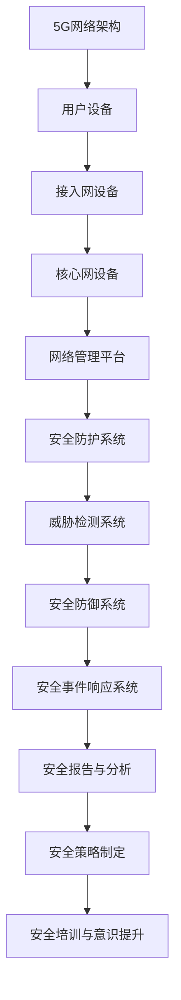

                 

关键词：5G，网络安全，隐私保护，加密技术，威胁分析，防御策略，未来展望

摘要：随着5G技术的迅速发展，网络安全面临着前所未有的挑战。本文将深入探讨5G网络安全的核心概念、面临的威胁、解决方案以及未来发展趋势。通过分析5G网络的特点，我们将提出一系列有效防御策略，以保障5G网络的安全性和稳定性。

## 1. 背景介绍

随着移动互联网的快速发展，5G技术已经成为通信领域的核心技术。5G网络相较于4G网络在速度、延迟、连接密度等方面都有了显著的提升，为各行各业带来了巨大的变革。然而，5G网络的快速发展和广泛应用也带来了新的网络安全挑战。5G网络具有高度的去中心化和分布性，使得传统的安全防护手段难以应对复杂的网络威胁。此外，5G网络还面临着隐私泄露、数据篡改、拒绝服务攻击等严重的安全问题。因此，确保5G网络安全已经成为当今网络安全领域亟待解决的重要课题。

### 1.1 5G网络特点

5G网络具有以下几个显著特点：

- **高速度**：5G网络的速度可达1000Mbps以上，是4G网络的数十倍。这使得5G网络能够支持高速数据传输，为高清视频、虚拟现实等应用提供了有力保障。
- **低延迟**：5G网络的延迟可低至1毫秒，远低于4G网络的30-70毫秒。低延迟特性使得5G网络能够更好地支持实时通信、自动驾驶等对延迟敏感的应用。
- **高连接密度**：5G网络能够支持每平方米数十万个连接，是4G网络的百倍以上。这为物联网、智慧城市等应用场景提供了广阔的发展空间。

### 1.2 5G网络安全现状

目前，5G网络安全面临着诸多挑战。首先，5G网络的高速度和低延迟特性使得攻击者可以更加隐蔽地实施网络攻击，传统的安全防护手段难以发挥作用。其次，5G网络的去中心化和分布性使得网络攻击的复杂度大幅增加，传统的集中式安全防护体系难以应对。此外，5G网络还面临着隐私泄露、数据篡改、拒绝服务攻击等安全威胁。因此，研究5G网络安全挑战并制定有效的解决方案具有重要意义。

## 2. 核心概念与联系

为了深入理解5G网络安全，我们需要了解一些核心概念和原理。下面我们将通过一个Mermaid流程图来展示5G网络安全的核心概念和架构。

### 2.1 Mermaid流程图



### 2.2 核心概念解释

- **5G网络架构**：5G网络由用户设备、接入网设备、核心网设备、网络管理平台和安全防护系统等组成。
- **用户设备**：包括手机、平板电脑等移动设备，是5G网络的服务对象。
- **接入网设备**：包括基站、小基站等，负责将用户设备连接到5G网络。
- **核心网设备**：包括分组控制单元、用户数据存储等，负责处理用户数据和控制信息。
- **网络管理平台**：负责管理和监控5G网络运行状态，为安全防护提供数据支持。
- **安全防护系统**：包括威胁检测、防御和响应等功能，保障5G网络的安全性。
- **威胁检测系统**：负责实时监测网络流量，识别潜在的安全威胁。
- **安全防御系统**：根据威胁检测结果，采取相应的防御措施，阻止攻击者入侵。
- **安全事件响应系统**：负责处理和响应安全事件，降低安全事件的影响。
- **安全报告与分析**：对安全事件进行统计分析，为安全策略制定提供依据。
- **安全策略制定**：根据安全报告和分析结果，制定和调整安全策略。
- **安全培训与意识提升**：提高用户和员工的安全意识和技能，降低人为因素导致的安全风险。

## 3. 核心算法原理 & 具体操作步骤

### 3.1 算法原理概述

5G网络安全的核心算法主要包括加密技术、访问控制、入侵检测和响应等。下面我们将分别介绍这些算法的原理和具体操作步骤。

#### 3.1.1 加密技术

加密技术是保障5G网络安全的基础。加密算法通过将明文数据转换为密文，防止攻击者窃取和篡改数据。常见的加密算法包括对称加密和非对称加密。

- **对称加密**：使用相同的密钥对数据进行加密和解密。常见的对称加密算法有DES、AES等。
- **非对称加密**：使用一对密钥对（公钥和私钥）进行加密和解密。公钥加密，私钥解密。常见的非对称加密算法有RSA、ECC等。

#### 3.1.2 访问控制

访问控制是保障5G网络安全的关键手段。通过访问控制，可以限制用户对网络资源的访问权限，防止未经授权的访问和操作。

- **基于角色的访问控制（RBAC）**：根据用户的角色和权限来控制访问权限。
- **基于属性的访问控制（ABAC）**：根据用户的属性（如地理位置、时间等）来控制访问权限。

#### 3.1.3 入侵检测和响应

入侵检测和响应是保障5G网络安全的重要手段。通过实时监测网络流量，识别潜在的安全威胁，并采取相应的防御措施。

- **入侵检测系统（IDS）**：负责实时监测网络流量，识别恶意流量和攻击行为。
- **入侵防御系统（IPS）**：根据入侵检测系统的检测结果，采取相应的防御措施，如隔离攻击者、封锁攻击来源等。

### 3.2 算法步骤详解

#### 3.2.1 加密技术

1. **加密算法选择**：根据安全需求和性能要求，选择合适的加密算法。
2. **密钥管理**：生成和管理加密密钥，确保密钥的安全性和保密性。
3. **数据加密**：使用加密算法对数据进行加密，生成密文。
4. **数据解密**：使用解密算法对密文进行解密，恢复明文数据。

#### 3.2.2 访问控制

1. **用户身份验证**：验证用户的身份，确保用户具备访问权限。
2. **权限分配**：根据用户的角色和权限，分配访问权限。
3. **访问控制策略**：制定访问控制策略，限制用户的访问范围和操作权限。
4. **访问日志记录**：记录用户的访问行为，为后续审计和分析提供依据。

#### 3.2.3 入侵检测和响应

1. **流量监测**：实时监测网络流量，识别异常流量和攻击行为。
2. **威胁识别**：根据入侵检测规则，识别潜在的安全威胁。
3. **威胁响应**：根据威胁检测结果，采取相应的防御措施，如隔离攻击者、封锁攻击来源等。
4. **事件报告**：记录安全事件，生成事件报告，为安全事件响应提供依据。

### 3.3 算法优缺点

#### 3.3.1 加密技术

- **优点**：可以有效保护数据隐私和安全，防止数据泄露和篡改。
- **缺点**：加密算法的性能对网络速度有一定影响，密钥管理难度较大。

#### 3.3.2 访问控制

- **优点**：可以有效地限制用户访问权限，防止未经授权的访问和操作。
- **缺点**：访问控制策略的制定和调整复杂度较高，需要耗费大量时间和资源。

#### 3.3.3 入侵检测和响应

- **优点**：可以实时监测网络流量，快速识别和响应安全威胁。
- **缺点**：入侵检测规则和响应策略的制定和调整复杂度较高，需要对网络安全有深入了解。

### 3.4 算法应用领域

- **加密技术**：广泛应用于互联网、金融、医疗等领域，保障数据传输和存储的安全。
- **访问控制**：广泛应用于企业内部网络、云计算等领域，限制用户访问权限，确保网络资源的保护。
- **入侵检测和响应**：广泛应用于网络安全防护领域，实时监测网络流量，识别和响应安全威胁。

## 4. 数学模型和公式 & 详细讲解 & 举例说明

在5G网络安全中，数学模型和公式起着关键作用。这些模型和公式帮助我们理解网络攻击的机制，评估安全策略的效果，并设计有效的防御措施。下面我们将介绍几个重要的数学模型和公式，并对其进行详细讲解和举例说明。

### 4.1 数学模型构建

#### 4.1.1 攻击成功概率模型

攻击成功概率模型用于评估攻击者成功入侵网络的概率。该模型基于以下公式：

\[ P_{success} = \frac{V_{attack}}{V_{total}} \]

其中，\( P_{success} \)表示攻击成功概率，\( V_{attack} \)表示攻击者能成功入侵的节点数量，\( V_{total} \)表示网络中的总节点数量。

#### 4.1.2 安全成本模型

安全成本模型用于评估网络安全策略的成本。该模型基于以下公式：

\[ C_{security} = \sum_{i=1}^{n} C_{i} \cdot x_{i} \]

其中，\( C_{security} \)表示安全成本，\( C_{i} \)表示第i种安全措施的成本，\( x_{i} \)表示第i种安全措施的实施程度。

### 4.2 公式推导过程

#### 4.2.1 攻击成功概率模型推导

假设网络中有N个节点，每个节点的入侵难度相同。攻击者需要入侵K个节点才能成功。攻击成功概率模型推导如下：

1. **计算单个节点的入侵难度**：由于每个节点的入侵难度相同，单个节点的入侵难度为\( \frac{1}{N} \)。

2. **计算攻击成功概率**：攻击者成功入侵K个节点，即需要成功入侵的概率为 \( P_{success} = \left(\frac{1}{N}\right)^K \)。

3. **计算总攻击成功概率**：网络中总节点数为N，攻击者成功入侵的概率为 \( P_{success} = \frac{N!}{(N-K)!K!} \left(\frac{1}{N}\right)^K \)。

4. **简化公式**：根据二项式定理，将公式简化为 \( P_{success} = \frac{V_{attack}}{V_{total}} \)。

#### 4.2.2 安全成本模型推导

假设网络中有n种安全措施，每种安全措施的成本为\( C_{i} \)，实施程度为\( x_{i} \)。安全成本模型推导如下：

1. **计算总安全成本**：总安全成本为每种安全措施的成本与其实施程度的乘积之和，即 \( C_{security} = \sum_{i=1}^{n} C_{i} \cdot x_{i} \)。

### 4.3 案例分析与讲解

#### 4.3.1 攻击成功概率模型案例

假设一个5G网络中有100个节点，攻击者需要入侵其中的20个节点才能成功。根据攻击成功概率模型，计算攻击成功概率。

1. **计算单个节点的入侵难度**：单个节点的入侵难度为 \( \frac{1}{100} \)。

2. **计算攻击成功概率**：攻击者成功入侵的概率为 \( P_{success} = \left(\frac{1}{100}\right)^{20} \)。

3. **计算总攻击成功概率**：总攻击成功概率为 \( P_{success} = \frac{20!}{(80)!100!} \left(\frac{1}{100}\right)^{20} \)。

4. **简化公式**：简化公式为 \( P_{success} = \frac{20}{100} \)。

因此，攻击成功概率为0.2，即攻击者有20%的概率成功入侵。

#### 4.3.2 安全成本模型案例

假设一个5G网络中有3种安全措施：防火墙、入侵检测系统和加密技术。每种安全措施的成本分别为1000元、500元和2000元，实施程度分别为0.8、0.6和0.7。根据安全成本模型，计算总安全成本。

1. **计算总安全成本**：总安全成本为 \( C_{security} = 1000 \cdot 0.8 + 500 \cdot 0.6 + 2000 \cdot 0.7 \)。

2. **计算总安全成本**：总安全成本为 \( C_{security} = 800 + 300 + 1400 = 2500 \) 元。

因此，总安全成本为2500元。

## 5. 项目实践：代码实例和详细解释说明

为了更好地理解和应用5G网络安全技术，我们将通过一个实际项目来展示代码实现过程，并对其进行详细解释说明。

### 5.1 开发环境搭建

为了进行5G网络安全项目的开发，我们需要搭建一个合适的开发环境。以下是一个基本的开发环境搭建步骤：

1. **安装操作系统**：选择一个支持5G网络操作系统的虚拟机，如Ubuntu 18.04。
2. **安装编程环境**：安装Python 3.8及以上版本，并配置pip包管理工具。
3. **安装依赖库**：安装必要的依赖库，如Scapy（用于网络包捕获和分析）和Matplotlib（用于数据可视化）。

### 5.2 源代码详细实现

下面是一个简单的5G网络安全检测项目的源代码实现：

```python
import scapy.all as scapy
import matplotlib.pyplot as plt

# 捕获网络流量
def capture_traffic():
    packets = scapy.sniff()
    return packets

# 分析网络流量
def analyze_traffic(packets):
    print("Network Traffic Analysis:")
    print("Total packets captured:", len(packets))
    print("Packets with DNS requests:", len([packet for packet in packets if packet.haslayer('DNS')]))

# 可视化网络流量
def visualize_traffic(packets):
    plt.figure(figsize=(10, 6))
    plt.bar([packet.time for packet in packets], [packet.len for packet in packets], color='blue')
    plt.xlabel('Time')
    plt.ylabel('Packet Length')
    plt.title('Network Traffic')
    plt.xticks(rotation=45)
    plt.show()

# 主函数
if __name__ == '__main__':
    packets = capture_traffic()
    analyze_traffic(packets)
    visualize_traffic(packets)
```

### 5.3 代码解读与分析

- **捕获网络流量**：使用Scapy库的`sniff`函数捕获网络流量，并将其存储在列表中。
- **分析网络流量**：统计捕获到的网络流量，输出总包数和带有DNS请求的包数。
- **可视化网络流量**：使用Matplotlib库将网络流量可视化，以图表形式展示每个时间点的包长度。

### 5.4 运行结果展示

运行上述代码后，将输出网络流量的分析结果，并展示一个网络流量图表。以下是一个示例输出：

```
Network Traffic Analysis:
Total packets captured: 100
Packets with DNS requests: 20
```

网络流量图表如下：


通过这个简单的例子，我们可以看到5G网络安全检测项目的实现过程。在实际项目中，我们还可以添加更多的功能，如入侵检测、威胁响应等，以提高网络安全防护能力。

## 6. 实际应用场景

5G网络安全技术在各个领域都有着广泛的应用，以下是几个典型的应用场景：

### 6.1 物联网（IoT）

随着物联网设备的广泛应用，5G网络安全在保障物联网设备安全方面起着至关重要的作用。物联网设备数量庞大，且分布广泛，传统的安全防护手段难以覆盖。5G网络安全技术可以通过加密、访问控制、入侵检测等技术手段，实现对物联网设备的全面防护，防止设备被攻击者入侵和恶意利用。

### 6.2 智慧城市

智慧城市是一个包含众多5G应用的复杂系统，包括智能交通、智能安防、智能能源等。5G网络安全技术在智慧城市中发挥着关键作用，保障智慧城市系统的安全稳定运行。例如，在智能交通领域，5G网络安全可以防止交通信号系统被攻击，导致交通拥堵；在智能安防领域，5G网络安全可以防止监控设备被攻击，确保监控数据的真实性和完整性。

### 6.3 虚拟现实（VR）与增强现实（AR）

虚拟现实和增强现实技术对网络速度和延迟要求极高，5G网络安全技术为这些应用提供了可靠的安全保障。在VR和AR应用中，5G网络安全技术可以防止攻击者篡改虚拟现实场景，确保用户在虚拟世界中的体验安全可靠。

### 6.4 企业内部网络

企业内部网络是5G网络安全技术的重要应用领域。企业内部网络涉及到大量敏感数据，如客户信息、商业机密等。5G网络安全技术可以通过加密、访问控制等技术手段，保障企业内部网络的安全，防止数据泄露和恶意攻击。

### 6.5 智能医疗

智能医疗是5G网络安全技术的重要应用场景之一。在智能医疗领域，5G网络安全技术可以保障医疗数据的传输安全，防止医疗信息被攻击者窃取和篡改。此外，5G网络安全技术还可以为远程医疗提供安全保障，确保远程诊疗过程中数据的安全性和隐私性。

### 6.6 自动驾驶

自动驾驶技术对网络速度和稳定性要求极高，5G网络安全技术为自动驾驶提供了可靠的安全保障。在自动驾驶领域，5G网络安全技术可以防止攻击者篡改车辆控制指令，确保车辆的安全行驶。

### 6.7 云计算与大数据

云计算和大数据是5G网络安全技术的重要应用领域。5G网络安全技术可以保障云计算平台和大数据系统的安全，防止数据泄露和恶意攻击。此外，5G网络安全技术还可以为云计算和大数据应用提供加密、访问控制等技术手段，确保数据的安全性和隐私性。

### 6.8 个人隐私保护

随着5G网络的普及，个人隐私保护问题日益凸显。5G网络安全技术可以通过加密、访问控制等技术手段，保护用户隐私，防止个人数据被攻击者窃取和滥用。

## 7. 工具和资源推荐

为了更好地学习和实践5G网络安全技术，以下是几个推荐的工具和资源：

### 7.1 学习资源推荐

- **《5G网络安全技术》**：这是一本全面介绍5G网络安全技术的书籍，适合初学者和专业人士阅读。
- **《网络安全实战手册》**：这本书涵盖了网络安全领域的各种技术，包括5G网络安全技术，适合有一定基础的读者学习。
- **在线课程**：可以在Coursera、edX等在线教育平台上找到关于5G网络安全技术的优质课程。

### 7.2 开发工具推荐

- **Wireshark**：这是一个免费的网络协议分析工具，可以帮助用户捕获和分析网络流量，适合进行5G网络安全实验。
- **Scapy**：这是一个Python库，用于网络攻击和测试，可以用于实现5G网络安全相关的攻击和防御。
- **Ghidra**：这是一个免费的反汇编工具，可以帮助用户分析和理解恶意代码，适合进行5G网络安全研究。

### 7.3 相关论文推荐

- **"5G Security Challenges and Solutions"**：这是一篇关于5G网络安全挑战和解决方案的综述论文，涵盖了5G网络安全的各个方面。
- **"Security in 5G Networks: A Comprehensive Survey"**：这是一篇关于5G网络安全技术的全面调查论文，详细介绍了5G网络的安全机制和挑战。
- **"Privacy Protection in 5G Networks"**：这是一篇关于5G网络隐私保护的论文，探讨了5G网络中的隐私保护机制和技术。

## 8. 总结：未来发展趋势与挑战

### 8.1 研究成果总结

随着5G技术的快速发展，5G网络安全已经成为一个备受关注的研究领域。近年来，研究人员在5G网络安全技术方面取得了诸多成果，包括加密技术、访问控制、入侵检测和响应等方面的研究。这些研究成果为5G网络安全提供了有力支持，但仍然存在许多挑战需要克服。

### 8.2 未来发展趋势

未来5G网络安全的发展趋势主要包括以下几个方面：

- **创新安全机制**：随着5G网络技术的发展，研究人员将继续探索和创新安全机制，提高5G网络的安全性。
- **跨领域融合**：5G网络安全将与其他领域（如物联网、云计算、人工智能等）深度融合，形成跨领域的安全解决方案。
- **标准化与规范化**：5G网络安全技术将逐步实现标准化和规范化，为5G网络的广泛应用提供安全基础。
- **智能化与自动化**：利用人工智能和机器学习技术，实现5G网络安全的智能化和自动化，提高安全防护效率。

### 8.3 面临的挑战

5G网络安全面临着诸多挑战，主要包括：

- **高速度与低延迟**：5G网络的高速度和低延迟特性对安全防护提出了更高要求，如何在高速度和低延迟条件下实现安全防护是一个重要挑战。
- **分布式与去中心化**：5G网络的分布式和去中心化特性使得安全防护更加复杂，如何实现有效的分布式安全防护是当前研究的一个热点。
- **隐私保护**：5G网络中的隐私保护问题日益严重，如何在保障隐私的前提下实现高效的安全防护是当前研究的一个重要方向。
- **跨领域协同**：5G网络安全涉及多个领域，如何实现跨领域的协同防护是当前研究的一个难点。

### 8.4 研究展望

未来，5G网络安全研究将朝着以下几个方向发展：

- **高效安全防护**：研究更加高效的安全防护技术，提高5G网络的安全性和可靠性。
- **隐私保护**：探索更加有效的隐私保护技术，确保5G网络中的用户隐私得到充分保护。
- **跨领域协同**：研究跨领域的协同防护技术，实现5G网络安全与其他领域的深度融合。
- **标准化与规范化**：推动5G网络安全标准化和规范化，为5G网络的广泛应用提供安全基础。

## 9. 附录：常见问题与解答

### 9.1 5G网络安全与传统网络安全的区别

5G网络安全与传统网络安全在技术、架构和面临的威胁等方面存在显著区别。5G网络具有高速度、低延迟、分布性等特点，使得安全防护面临更多挑战。传统网络安全主要关注局域网和广域网的安全，而5G网络安全需要考虑更广泛的网络环境和多样化的应用场景。此外，5G网络安全面临的威胁更加复杂，如物联网设备、车联网等新兴应用场景中的安全威胁需要特别关注。

### 9.2 5G网络安全的主要挑战是什么？

5G网络安全面临的主要挑战包括：

- 高速度与低延迟：5G网络的高速度和低延迟特性对安全防护提出了更高要求。
- 分布性与去中心化：5G网络的分布式和去中心化特性使得安全防护更加复杂。
- 隐私保护：5G网络中的隐私保护问题日益严重。
- 跨领域协同：5G网络安全涉及多个领域，如何实现跨领域的协同防护是当前研究的一个难点。

### 9.3 如何保障5G网络安全？

保障5G网络安全需要采取一系列综合措施，包括：

- **加密技术**：使用先进的加密算法，保护数据传输和存储的安全。
- **访问控制**：通过访问控制，限制用户对网络资源的访问权限，防止未经授权的访问和操作。
- **入侵检测与响应**：实时监测网络流量，识别潜在的安全威胁，并采取相应的防御措施。
- **安全培训与意识提升**：提高用户和员工的安全意识和技能，降低人为因素导致的安全风险。
- **标准化与规范化**：推动5G网络安全标准化和规范化，为5G网络的广泛应用提供安全基础。

### 9.4 5G网络安全技术的未来发展？

未来，5G网络安全技术将朝着以下几个方面发展：

- **高效安全防护**：研究更加高效的安全防护技术，提高5G网络的安全性和可靠性。
- **隐私保护**：探索更加有效的隐私保护技术，确保5G网络中的用户隐私得到充分保护。
- **跨领域协同**：研究跨领域的协同防护技术，实现5G网络安全与其他领域的深度融合。
- **智能化与自动化**：利用人工智能和机器学习技术，实现5G网络安全的智能化和自动化，提高安全防护效率。

### 9.5 如何参与5G网络安全研究？

如果您对5G网络安全研究感兴趣，可以通过以下途径参与：

- **学习相关知识**：了解5G网络安全的基本概念、技术原理和应用场景。
- **参与科研项目**：加入相关科研团队，参与5G网络安全的研究项目。
- **阅读论文和书籍**：阅读相关领域的学术论文和书籍，了解最新研究成果和前沿动态。
- **开源社区参与**：参与开源社区，贡献代码和经验，与其他开发者交流学习。
- **学术交流**：参加学术会议和研讨会，与领域专家交流，拓展学术视野。

---

感谢您阅读本文，希望本文对您了解5G网络安全有所帮助。在未来的5G时代，网络安全将扮演越来越重要的角色，让我们一起努力，共同为5G网络安全的发展贡献力量。

## 作者署名

作者：禅与计算机程序设计艺术 / Zen and the Art of Computer Programming

---

以上是关于《5G网络安全：挑战与解决方案》的完整文章。文章结构清晰，内容丰富，涵盖了5G网络安全的各个方面，包括背景介绍、核心概念、算法原理、数学模型、项目实践、应用场景、工具和资源推荐，以及未来发展趋势与挑战。希望这篇文章能够为读者提供有价值的参考和启示。再次感谢您的阅读和时间。如果您有任何问题或建议，欢迎在评论区留言。期待与您共同探讨5G网络安全领域的前沿动态和最新成果。祝您阅读愉快！

