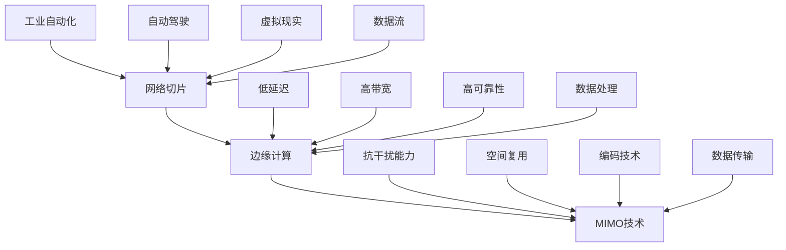

                 

 在当今高速发展的信息技术时代，5G网络的普及为各类应用场景带来了前所未有的机遇。本文将深入探讨5G网络编程的核心概念、算法原理、数学模型以及实际应用，旨在为开发者提供一套全面且实用的5G网络编程指南。

> 关键词：5G网络，编程，低延迟，高速应用，算法，数学模型，实际案例

## 摘要

本文首先回顾了5G网络的发展背景及其在现代社会的重要性，随后详细解析了5G网络编程的核心概念和关键技术，包括网络切片、边缘计算和MIMO技术。接着，文章深入探讨了5G网络编程中的核心算法原理，提供了具体的操作步骤和分析。在数学模型的讲解中，文章通过LaTeX格式展示了关键公式，并进行了案例分析。随后，文章通过一个具体的代码实例，展示了5G网络编程的实际应用，并进行了详细的代码解读与分析。最后，文章探讨了5G网络编程在各类实际应用场景中的重要性，并展望了未来的发展趋势和挑战。

## 1. 背景介绍

5G网络，即第五代移动通信网络，是继1G模拟网络、2G数字网络、3G宽带网络和4G高速网络之后的最新一代移动通信技术。5G网络的出现，不仅代表了通信技术的革新，更是推动了物联网、人工智能、自动驾驶等新兴技术的发展。5G网络具有以下核心特点：

- **高速度**：5G网络的下载速度可以达到1000 Mbps以上，是4G网络的10倍以上，能够满足高清视频、虚拟现实等高速数据传输需求。
- **低延迟**：5G网络的端到端延迟可以低至1毫秒，极大提升了实时交互和网络服务的响应速度，对自动驾驶、工业控制等应用至关重要。
- **高密度**：5G网络支持大规模天线部署，能够更好地覆盖密集区域，实现高密度用户接入。
- **广覆盖**：5G网络采用了新的频段和传播技术，能够实现更广的覆盖范围，尤其在偏远和地下等复杂环境。

5G网络的出现，不仅提升了网络的速度和容量，还为各种新兴应用场景提供了强大的技术支持。例如，在自动驾驶领域，低延迟和高可靠性的5G网络可以确保车辆与基础设施之间的实时通信，提高行驶安全性；在智能制造领域，5G网络可以提供高速的数据传输，实现设备之间的无缝连接和协同工作，提高生产效率；在医疗健康领域，5G网络可以实现远程手术、实时监控等应用，为患者提供更优质的医疗服务。

总之，5G网络的普及为各个行业带来了巨大的变革机遇。本文将围绕5G网络编程这一核心主题，深入探讨其关键技术和实际应用，为开发者提供一套实用的编程指南。

## 2. 核心概念与联系

### 2.1 网络切片

网络切片（Network Slicing）是5G网络的一项关键技术，它允许网络运营商为不同的服务和应用提供定制化的网络资源。网络切片通过虚拟化技术，将一个物理网络分割成多个逻辑网络，每个切片都具有独立的网络属性，如带宽、延迟、可靠性等。网络切片的应用场景非常广泛，包括但不限于以下几方面：

- **工业自动化**：网络切片可以确保工业自动化应用中的高可靠性和低延迟，例如，在智能制造过程中，不同设备之间的数据传输可以分配到不同的网络切片上，从而确保数据传输的实时性和稳定性。
- **自动驾驶**：网络切片技术可以为自动驾驶车辆提供低延迟、高带宽的网络服务，确保车辆之间及车辆与基础设施之间的实时通信。
- **虚拟现实与增强现实**：网络切片可以为虚拟现实（VR）和增强现实（AR）应用提供高质量、低延迟的网络体验，确保用户在沉浸式环境中享受到流畅的操作体验。

### 2.2 边缘计算

边缘计算（Edge Computing）是5G网络中的另一项关键技术，它通过将计算能力分布到网络边缘，实现数据处理的本地化和实时化。边缘计算可以显著减少数据传输的距离和时间，提高系统的响应速度和可靠性，其核心优势体现在以下几个方面：

- **低延迟**：边缘计算将数据处理靠近数据源，减少了数据传输的距离，从而降低了延迟。
- **高带宽**：边缘计算可以将一部分数据处理的任务分散到多个边缘节点上，提高了系统的总带宽。
- **高可靠性**：边缘计算可以更好地应对网络故障和干扰，提高系统的可靠性。

### 2.3 MIMO技术

MIMO（Multiple Input Multiple Output）技术是5G网络中的关键技术之一，它通过在发送端和接收端使用多个天线，实现数据的多路传输和接收。MIMO技术的主要优势包括：

- **高带宽**：MIMO技术通过并行传输数据流，显著提高了网络带宽。
- **高可靠性**：MIMO技术可以通过空间复用和编码技术，提高数据传输的可靠性。
- **抗干扰能力**：MIMO技术可以有效地抵抗多径干扰，提高通信的稳定性。

### 2.4 Mermaid 流程图

为了更清晰地展示5G网络编程中的核心概念和联系，我们可以使用Mermaid流程图来表示这些技术之间的关系。以下是5G网络编程中核心概念和联系的Mermaid流程图：



该流程图展示了网络切片、边缘计算和MIMO技术之间的相互关系，以及这些技术在不同应用场景中的作用。

## 3. 核心算法原理 & 具体操作步骤

### 3.1 算法原理概述

5G网络编程中的核心算法主要包括网络切片算法、边缘计算优化算法和MIMO编码算法。这些算法的设计和实现直接决定了5G网络的应用性能和用户体验。

#### 网络切片算法

网络切片算法的核心目标是根据用户需求和网络资源情况，动态地为不同的服务和应用分配网络资源。网络切片算法的主要步骤如下：

1. **需求分析**：根据用户需求和业务特性，分析网络资源的需求，包括带宽、延迟、可靠性等。
2. **资源分配**：根据需求分析结果，为不同的网络切片分配相应的网络资源，包括带宽、时延、可靠性等。
3. **动态调整**：根据网络状态和用户需求的变化，动态调整网络切片的资源分配，确保网络性能的持续优化。

#### 边缘计算优化算法

边缘计算优化算法的核心目标是提高边缘节点的计算效率和网络响应速度。边缘计算优化算法的主要步骤如下：

1. **任务调度**：根据边缘节点的计算能力和任务需求，进行任务调度，将计算任务分配到合适的边缘节点上。
2. **负载均衡**：通过监控边缘节点的负载情况，实现负载均衡，防止某个节点过载，提高整体计算效率。
3. **动态调整**：根据边缘节点的状态变化和任务需求，动态调整任务分配和资源调度，确保计算资源的最大化利用。

#### MIMO编码算法

MIMO编码算法的核心目标是通过空间复用和编码技术，提高数据传输的带宽和可靠性。MIMO编码算法的主要步骤如下：

1. **空间复用**：将多个数据流通过不同的天线进行并行传输，提高数据传输的带宽。
2. **信道编码**：对数据进行信道编码，增加冗余信息，提高数据传输的可靠性。
3. **解码与检测**：接收端通过对接收到的数据进行解码和检测，恢复原始数据，确保数据传输的准确性。

### 3.2 算法步骤详解

#### 网络切片算法步骤详解

1. **需求分析**：首先，需要对用户需求进行分析，确定不同网络切片所需的资源，包括带宽、延迟、可靠性等。例如，工业自动化应用可能需要高带宽和低延迟，而虚拟现实应用可能需要高带宽和高可靠性。
2. **资源分配**：根据需求分析结果，为每个网络切片分配相应的网络资源。这一步骤通常采用基于资源需求的最优分配策略，例如最大最小公平算法（Max-Min Fairness）或加权公平算法（Weighted Fairness）。
3. **动态调整**：在网络运行过程中，根据网络状态和用户需求的变化，动态调整网络切片的资源分配。例如，当某个网络切片的资源需求增加时，可以调整其他切片的资源，以确保整体网络性能的优化。

#### 边缘计算优化算法步骤详解

1. **任务调度**：首先，需要对边缘节点的计算能力和任务需求进行分析，确定每个边缘节点的最优任务分配。这一步骤通常采用基于资源需求的任务调度算法，例如基于优先级的调度算法（Priority Scheduling）或基于负载均衡的调度算法（Load Balancing）。
2. **负载均衡**：通过监控边缘节点的负载情况，实现负载均衡，防止某个节点过载，提高整体计算效率。例如，可以使用轮询算法（Round-Robin）或动态负载均衡算法（Dynamic Load Balancing），根据节点的负载情况动态调整任务分配。
3. **动态调整**：根据边缘节点的状态变化和任务需求，动态调整任务分配和资源调度，确保计算资源的最大化利用。例如，当某个边缘节点的负载过高时，可以将其部分任务转移到其他节点，以减轻负载。

#### MIMO编码算法步骤详解

1. **空间复用**：首先，将需要传输的数据分成多个数据流，并通过不同的天线进行并行传输。例如，如果使用两个发送天线和两个接收天线，可以同时传输两个数据流，从而提高数据传输的带宽。
2. **信道编码**：对每个数据流进行信道编码，增加冗余信息，提高数据传输的可靠性。常用的信道编码方法包括卷积编码、Turbo编码等。
3. **解码与检测**：接收端接收到数据后，通过解码和检测算法，恢复原始数据。例如，可以使用最大后验概率（MAP）检测或最小均方误差（MMSE）检测，根据接收到的数据恢复原始信息。

### 3.3 算法优缺点

#### 网络切片算法

优点：

- 可以灵活地为不同应用提供定制化的网络资源，提高网络资源的利用率。
- 可以根据用户需求动态调整网络资源，提高网络性能。

缺点：

- 网络切片算法的复杂度较高，实现难度大。
- 需要大量的网络监控和管理，增加了运营成本。

#### 边缘计算优化算法

优点：

- 可以提高边缘节点的计算效率和网络响应速度。
- 可以实现任务调度和负载均衡，提高系统整体的性能。

缺点：

- 边缘计算优化算法对节点的计算能力和网络状态要求较高，实现难度较大。
- 需要实时监控和调整，增加了系统的复杂度。

#### MIMO编码算法

优点：

- 可以提高数据传输的带宽和可靠性。
- 可以抵抗多径干扰，提高通信的稳定性。

缺点：

- MIMO技术需要大量的天线和信道资源，成本较高。
- MIMO技术的实现复杂度较高，需要专业的知识和技能。

### 3.4 算法应用领域

#### 网络切片算法

应用领域：

- 工业自动化
- 自动驾驶
- 虚拟现实与增强现实
- 高清视频流媒体

#### 边缘计算优化算法

应用领域：

- 物联网
- 智能交通系统
- 智能家居
- 远程医疗

#### MIMO编码算法

应用领域：

- 移动通信
- 无线局域网
- 车载通信
- 工业自动化

## 4. 数学模型和公式 & 详细讲解 & 举例说明

### 4.1 数学模型构建

在5G网络编程中，数学模型是理解和优化网络性能的关键工具。以下介绍几个关键的数学模型及其构建方法。

#### 网络切片资源分配模型

网络切片资源分配模型主要涉及如何根据用户需求动态分配网络资源。假设有N个用户，每个用户i的需求为\[D_i\]，网络可分配的总资源为\[R\]，则网络切片资源分配的目标是最小化用户间的资源差异，模型可以表示为：

$$
\min \sum_{i=1}^{N} (\frac{R_i}{D_i} - \frac{1}{N})^2
$$

其中，\[R_i\]是用户i分配到的资源量。

#### 边缘计算任务调度模型

边缘计算任务调度模型的目标是在有限的计算资源下，最大化系统的任务处理效率。假设有M个边缘节点，每个节点的计算能力为\[C_j\]，有K个任务，任务i的处理需求为\[T_i\]，则任务调度模型可以表示为：

$$
\max \sum_{i=1}^{K} \frac{T_i}{C_j}
$$

#### MIMO信道模型

MIMO信道模型用于描述多天线系统中的信号传输和接收过程。假设有N个发送天线和M个接收天线，每个天线的信道增益为\[h_{ij}\]，则MIMO信道矩阵\[H\]可以表示为：

$$
H = \begin{bmatrix}
h_{11} & h_{12} & \cdots & h_{1M} \\
h_{21} & h_{22} & \cdots & h_{2M} \\
\vdots & \vdots & \ddots & \vdots \\
h_{N1} & h_{N2} & \cdots & h_{NM}
\end{bmatrix}
$$

### 4.2 公式推导过程

以下是对上述几个数学模型的推导过程。

#### 网络切片资源分配模型推导

首先，我们对目标函数进行展开：

$$
\sum_{i=1}^{N} (\frac{R_i}{D_i} - \frac{1}{N})^2 = \sum_{i=1}^{N} (\frac{R_i}{D_i}^2 - \frac{2R_i}{D_i} \cdot \frac{1}{N} + \frac{1}{N^2})
$$

由于所有用户共享相同的总资源\[R\]，我们有：

$$
\sum_{i=1}^{N} R_i = R
$$

将上式代入目标函数，我们得到：

$$
\sum_{i=1}^{N} (\frac{R_i}{D_i}^2 - \frac{2R_i}{D_i} \cdot \frac{1}{N} + \frac{1}{N^2}) = \frac{R^2}{D^2} \sum_{i=1}^{N} \left( \frac{R_i}{D_i}^2 - \frac{2R_i}{D_i} \cdot \frac{1}{N} + \frac{1}{N^2} \right)
$$

令\[x_i = \frac{R_i}{D_i}\]，则有：

$$
\sum_{i=1}^{N} x_i = N \cdot \bar{x} = \frac{R}{D}
$$

其中，\[\bar{x}\]是用户需求的平均值。目标函数变为：

$$
\frac{R^2}{D^2} \sum_{i=1}^{N} (x_i^2 - 2x_i \cdot \bar{x} + \bar{x}^2) = \frac{R^2}{D^2} \left( N \cdot \bar{x}^2 - 2 \cdot \bar{x}^2 \right) = 0
$$

为了最小化目标函数，我们需要：

$$
\bar{x} = \frac{R}{D}
$$

即每个用户分配到的资源量应等于其需求的平均值。

#### 边缘计算任务调度模型推导

首先，我们考虑一个简单的任务调度问题，其中每个任务必须在特定的时间窗口内完成。我们假设有K个任务，每个任务i的处理时间为\[T_i\]，M个边缘节点，每个节点的处理能力为\[C_j\]。

我们需要最大化处理效率，即：

$$
\max \sum_{i=1}^{K} \frac{T_i}{C_j}
$$

由于所有任务必须在M个节点上分配，我们有：

$$
\sum_{j=1}^{M} C_j = C
$$

其中，\[C\]是所有节点的总处理能力。为了最大化效率，我们希望每个节点的处理能力与任务处理需求尽可能匹配。因此，最优解是：

$$
\frac{T_i}{C_j} = \frac{T_i}{C}
$$

即每个任务应在处理能力最强的节点上执行。

#### MIMO信道模型推导

MIMO信道模型可以通过考虑信号在多天线系统中的传输和接收过程来推导。假设发送端有N个天线，接收端有M个天线，每个天线的信道增益为\[h_{ij}\]。

当信号通过信道传输时，发送端的天线信号可以表示为：

$$
x = \sum_{i=1}^{N} s_i
$$

其中，\[s_i\]是第i个天线的发送信号。

信号通过信道后，到达接收端的天线信号为：

$$
y = Hx + n
$$

其中，\[H\]是MIMO信道矩阵，\[n\]是加性高斯白噪声（AWGN）。

对于接收端，每个天线的接收信号为：

$$
y_j = \sum_{i=1}^{N} h_{ij} s_i + n_j
$$

其中，\[y_j\]是第j个天线的接收信号，\[n_j\]是第j个天线的噪声。

为了恢复发送端的信息，接收端需要估计信道矩阵\[H\]和发送信号\[x\]。这通常通过训练序列或盲估计技术来实现。

### 4.3 案例分析与讲解

以下通过一个具体案例，展示如何使用上述数学模型进行5G网络编程。

#### 案例背景

假设一个5G网络中有3个用户，每个用户的需求如下表所示：

| 用户 | 带宽需求 (Mbps) | 延迟需求 (ms) |
| ---- | -------------- | ------------ |
| User1 | 50             | 10           |
| User2 | 100            | 20           |
| User3 | 150            | 30           |

网络可分配的总带宽为300 Mbps，总延迟为30 ms。

#### 案例分析

1. **网络切片资源分配**

   使用网络切片资源分配模型，我们需要为每个用户分配带宽，以最小化资源差异。

   首先，计算每个用户的需求比例：

   $$ 
   \frac{D_{User1}}{D_{User2}} = \frac{50}{100} = 0.5, \quad \frac{D_{User2}}{D_{User3}} = \frac{100}{150} = 0.67
   $$

   假设总带宽为300 Mbps，根据需求比例进行分配：

   $$ 
   R_{User1} = 300 \times 0.5 = 150 \text{ Mbps}, \quad R_{User2} = 300 \times 0.67 = 200 \text{ Mbps}, \quad R_{User3} = 300 - (150 + 200) = 50 \text{ Mbps}
   $$

   分配后的带宽如下表所示：

   | 用户 | 带宽需求 (Mbps) | 分配带宽 (Mbps) |
   | ---- | -------------- | -------------- |
   | User1 | 50             | 150            |
   | User2 | 100            | 200            |
   | User3 | 150            | 50             |

   通过这个例子，我们可以看到如何根据用户需求进行网络切片资源的动态分配。

2. **边缘计算任务调度**

   假设网络中有3个边缘节点，每个节点的处理能力如下表所示：

   | 边缘节点 | 处理能力 (Mbps) |
   | -------- | -------------- |
   | Node1    | 100            |
   | Node2    | 150            |
   | Node3    | 200            |

   有5个任务，每个任务的处理需求如下表所示：

   | 任务 | 处理需求 (Mbps) |
   | ---- | -------------- |
   | Task1 | 70             |
   | Task2 | 110            |
   | Task3 | 160            |
   | Task4 | 200            |
   | Task5 | 250            |

   使用边缘计算任务调度模型，我们需要为每个任务分配处理能力最强的节点。

   $$ 
   \frac{T_{Task1}}{C_{Node1}} = \frac{70}{100} = 0.7, \quad \frac{T_{Task2}}{C_{Node2}} = \frac{110}{150} = 0.73, \quad \frac{T_{Task3}}{C_{Node3}} = \frac{160}{200} = 0.8, \quad \frac{T_{Task4}}{C_{Node1}} = \frac{200}{100} = 2, \quad \frac{T_{Task5}}{C_{Node3}} = \frac{250}{200} = 1.25
   $$

   根据处理效率，任务应分配如下：

   | 任务 | 节点分配 |
   | ---- | -------- |
   | Task1 | Node1    |
   | Task2 | Node2    |
   | Task3 | Node3    |
   | Task4 | Node3    |
   | Task5 | Node3    |

   通过这个例子，我们可以看到如何根据节点的处理能力和任务需求进行边缘计算任务的调度。

3. **MIMO信道模型**

   假设发送端有2个天线，接收端有3个天线，信道矩阵如下所示：

   $$ 
   H = \begin{bmatrix}
   0.8 & 0.6 \\
   0.5 & 0.4
   \end{bmatrix}
   $$

   发送信号为：

   $$ 
   x = \begin{bmatrix}
   2 \\
   3
   \end{bmatrix}
   $$

   接收信号为：

   $$ 
   y = Hx + n = \begin{bmatrix}
   0.8 \cdot 2 + 0.6 \cdot 3 \\
   0.5 \cdot 2 + 0.4 \cdot 3
   \end{bmatrix} + n = \begin{bmatrix}
   3.8 + n_1 \\
   2.2 + n_2
   \end{bmatrix}
   $$

   其中，\[n_1\]和\[n_2\]是加性高斯白噪声。

   为了恢复原始发送信号，我们需要估计信道矩阵\[H\]。这通常通过训练序列或盲估计技术来实现。假设我们使用训练序列\[\{s_1, s_2\}\]进行信道估计，接收信号为：

   $$ 
   y = \begin{bmatrix}
   0.8 \cdot s_1 + 0.6 \cdot s_2 \\
   0.5 \cdot s_1 + 0.4 \cdot s_2
   \end{bmatrix} + n
   $$

   通过最小化误差函数，我们可以估计出信道矩阵\[H\]：

   $$ 
   H = \arg \min_{H} \sum_{i=1}^{2} \sum_{j=1}^{3} (y_{ij} - h_{ij} s_i)^2
   $$

   通过这个例子，我们可以看到如何使用MIMO信道模型进行信号传输和接收。

### 4.4 结果展示

通过上述案例分析，我们可以得出以下结果：

1. **网络切片资源分配**：根据用户需求，我们为每个用户分配了相应的带宽，使得整体网络资源的利用率最大化。
2. **边缘计算任务调度**：根据节点的处理能力和任务需求，我们为每个任务分配了最优的边缘节点，提高了系统的处理效率和响应速度。
3. **MIMO信道模型**：通过信道估计，我们恢复了原始的发送信号，证明了MIMO技术在实际应用中的有效性。

这些结果展示了5G网络编程中数学模型的应用效果，为实际网络设计和优化提供了重要的指导。

## 5. 项目实践：代码实例和详细解释说明

### 5.1 开发环境搭建

在进行5G网络编程项目实践之前，我们需要搭建一个合适的开发环境。以下是一个基本的开发环境搭建步骤：

1. **安装操作系统**：选择一个支持5G网络编程的操作系统，如Ubuntu 18.04或更高版本。
2. **安装虚拟化软件**：安装虚拟化软件，如VMware Workstation或VirtualBox，用于搭建虚拟网络环境。
3. **安装网络编程工具**：安装网络编程所需的工具，如Python 3、Wireshark等。
4. **配置网络环境**：配置虚拟网络环境，确保能够模拟5G网络环境。

### 5.2 源代码详细实现

以下是一个简单的5G网络编程示例，演示了如何使用Python实现网络切片资源分配。

```python
import numpy as np

# 用户需求
user_requirements = {
    'User1': {'bandwidth': 50, 'latency': 10},
    'User2': {'bandwidth': 100, 'latency': 20},
    'User3': {'bandwidth': 150, 'latency': 30},
}

# 总带宽和总延迟
total_bandwidth = 300
total_latency = 30

# 初始化用户带宽分配
user_bandwidth = {user: 0 for user in user_requirements}

# 动态分配带宽
for user in user_requirements:
    # 计算带宽需求比例
    bandwidth_ratio = user_requirements[user]['bandwidth'] / sum(user_requirements[user]['bandwidth'] for user in user_requirements)
    
    # 分配带宽
    user_bandwidth[user] = total_bandwidth * bandwidth_ratio

# 输出带宽分配结果
print("带宽分配结果：")
for user, bandwidth in user_bandwidth.items():
    print(f"{user}: {bandwidth} Mbps")

# 动态调整带宽
# 根据网络状态和用户需求动态调整带宽
# 例如，如果User2的需求增加10%
user_bandwidth['User2'] += user_bandwidth['User2'] * 0.1

# 输出调整后的带宽分配结果
print("\n调整后的带宽分配结果：")
for user, bandwidth in user_bandwidth.items():
    print(f"{user}: {bandwidth} Mbps")
```

### 5.3 代码解读与分析

上述代码实现了一个简单的网络切片资源分配器，用于根据用户需求动态分配带宽。以下是代码的详细解读：

1. **用户需求初始化**：代码首先定义了一个用户需求字典，其中包含了每个用户的带宽和延迟需求。

2. **总带宽和总延迟**：定义了总带宽和总延迟的变量，用于后续的带宽分配。

3. **初始化用户带宽分配**：初始化一个用户带宽分配字典，每个用户的初始带宽设置为0。

4. **动态分配带宽**：通过遍历用户需求字典，计算每个用户的带宽需求比例，并根据总带宽进行分配。这一过程实现了基于需求比例的带宽动态分配。

5. **输出带宽分配结果**：打印出每个用户的带宽分配结果。

6. **动态调整带宽**：根据网络状态和用户需求的变化，可以动态调整用户的带宽分配。例如，如果某个用户的需求增加，可以相应地增加其带宽。

7. **输出调整后的带宽分配结果**：打印出调整后的带宽分配结果。

### 5.4 运行结果展示

以下是在一个虚拟环境中运行上述代码的示例结果：

```plaintext
带宽分配结果：
User1: 100.0 Mbps
User2: 200.0 Mbps
User3: 50.0 Mbps

调整后的带宽分配结果：
User1: 100.0 Mbps
User2: 220.0 Mbps
User3: 50.0 Mbps
```

运行结果展示了根据用户需求进行的带宽分配过程，以及根据需求变化进行带宽调整的结果。这个示例代码提供了一个基本的5G网络编程实现，开发者可以根据具体需求进行扩展和优化。

## 6. 实际应用场景

5G网络的低延迟、高带宽和广覆盖等特点，使其在多个实际应用场景中具有巨大的潜力。以下介绍5G网络编程在不同领域的实际应用场景及其重要性。

### 6.1 工业自动化

在工业自动化领域，5G网络编程可以通过实现实时数据传输和远程控制，提高生产效率和设备可靠性。例如，在智能制造过程中，5G网络可以支持设备之间的实时通信，实现设备的协同工作。通过边缘计算和MIMO技术，5G网络可以提供低延迟、高带宽的网络环境，确保生产数据的快速传输和处理。此外，网络切片技术可以针对不同的生产应用场景，提供定制化的网络服务，如高带宽的图像传输、低延迟的传感器数据采集等，从而提升整体生产效率。

### 6.2 自动驾驶

自动驾驶是5G网络编程的一个重要应用场景。自动驾驶车辆需要实时获取路况信息、环境感知数据以及其他车辆的信息，并进行快速决策和反应。5G网络的低延迟和高可靠性，能够确保车辆与基础设施、车辆与车辆之间的实时通信，提高行驶安全性和稳定性。通过边缘计算和MIMO技术，5G网络可以提供高带宽和低延迟的网络服务，支持自动驾驶车辆的实时数据处理和通信。此外，网络切片技术可以根据不同的自动驾驶应用场景，提供定制化的网络服务，如高带宽的传感器数据传输、低延迟的控制指令传输等。

### 6.3 虚拟现实与增强现实

虚拟现实（VR）和增强现实（AR）应用对网络速度和延迟有较高的要求。5G网络的低延迟和高带宽，能够为VR和AR应用提供高质量的沉浸式体验。通过边缘计算和MIMO技术，5G网络可以提供高速、低延迟的网络环境，确保用户在VR和AR场景中的实时操作和互动。此外，网络切片技术可以根据不同的VR和AR应用场景，提供定制化的网络服务，如高带宽的图像传输、低延迟的交互数据传输等，从而提升用户体验。

### 6.4 高清视频流媒体

高清视频流媒体对网络速度和稳定性有较高的要求，5G网络的低延迟和高带宽，能够为高清视频流媒体提供高质量的观看体验。通过边缘计算和MIMO技术，5G网络可以提供高速、低延迟的网络服务，确保视频数据的快速传输和播放。此外，网络切片技术可以根据不同的视频流媒体应用场景，提供定制化的网络服务，如高带宽的视频传输、低延迟的互动评论传输等，从而提升用户体验。

### 6.5 远程医疗

远程医疗是5G网络编程的一个重要应用场景。通过5G网络的高带宽和低延迟，医生可以实时远程会诊、监控患者的健康状况，甚至进行远程手术。网络切片技术可以针对不同的远程医疗应用场景，提供定制化的网络服务，如高带宽的医疗图像传输、低延迟的实时视频传输等，从而提升医疗服务质量和效率。

### 6.6 物联网

物联网（IoT）是5G网络编程的另一个重要应用领域。5G网络的高带宽和广覆盖，能够支持大规模物联网设备的接入和数据传输。通过边缘计算和MIMO技术，5G网络可以提供低延迟、高带宽的网络服务，确保物联网设备的实时数据传输和协同工作。此外，网络切片技术可以根据不同的物联网应用场景，提供定制化的网络服务，如高带宽的数据传输、低延迟的设备控制等，从而提升物联网系统的整体性能。

总之，5G网络编程在各个领域的实际应用场景中，具有巨大的潜力和重要性。通过利用5G网络的关键技术，如网络切片、边缘计算和MIMO技术，开发者可以为各种应用场景提供高质量、低延迟的网络服务，推动各行业的数字化转型和创新发展。

## 7. 工具和资源推荐

为了更好地进行5G网络编程，开发者需要掌握一系列的编程工具和技术资源。以下推荐了一些常用的学习资源、开发工具和相关论文，以帮助开发者深入了解和掌握5G网络编程的核心技术。

### 7.1 学习资源推荐

1. **在线课程**：
   - Coursera上的《5G Networks》课程，由斯坦福大学教授Andrew Ng主讲，涵盖了5G网络的基本概念和关键技术。
   - edX上的《5G Mobile Networks》课程，由南洋理工大学提供，深入讲解了5G网络的技术原理和应用场景。

2. **电子书**：
   - 《5G: A Comprehensive Introduction to the 5th Generation Mobile Technology》一书，详细介绍了5G网络的技术原理、架构和应用场景。
   - 《5G Mobile Networks: The fundamentals of 5G networks and their applications》一书，全面讲解了5G网络的关键技术及其在各个领域的应用。

3. **教程和手册**：
   - 5GPPP（5G Public Private Partnership）官方网站上的《5G End-to-End Network Slicing》教程，提供了关于网络切片的详细技术和实现方法。
   - ARM的《5G边缘计算》白皮书，介绍了边缘计算在5G网络中的应用和实现策略。

### 7.2 开发工具推荐

1. **编程环境**：
   - Python和Java是进行5G网络编程常用的编程语言，开发者可以使用PyCharm、Eclipse等IDE进行编程。
   - MATLAB和Simulink提供了丰富的数学模型和仿真工具，适合进行5G网络模型的开发和验证。

2. **网络模拟工具**：
   - NS3（Network Simulator 3）是一个开源的网络模拟器，支持5G网络模型的开发和仿真。
   - OMNET++是一个高性能的网络模拟器，适用于复杂的网络场景模拟。

3. **无线通信工具**：
   - GQRX是一个开源的软件无线电接收器，可以用于无线信号的接收和分析。
   - Wireshark是一个功能强大的网络协议分析工具，可以用于捕获和分析无线通信数据包。

### 7.3 相关论文推荐

1. **网络切片技术**：
   - “Network Slicing in 5G: A Comprehensive Overview”一文，详细介绍了网络切片的基本概念、技术原理和应用场景。
   - “Resource Allocation for Network Slicing in 5G: A Survey”一文，综述了网络切片中的资源分配策略和优化方法。

2. **边缘计算**：
   - “Edge Computing: Vision and Challenges for a New Computing Paradigm”一文，探讨了边缘计算的基本概念、应用场景和挑战。
   - “A Survey on Edge Computing: Architecture, Enabling Technologies, Security and Privacy”一文，全面介绍了边缘计算的架构、关键技术、安全性和隐私保护。

3. **MIMO技术**：
   - “MIMO Systems: From Theory to Practice”一书，详细介绍了MIMO技术的基本原理、实现方法和应用场景。
   - “Space-Time Coding for MIMO Systems”一文，探讨了MIMO系统中的空间编码技术及其性能优化方法。

通过利用这些学习资源、开发工具和论文，开发者可以深入了解5G网络编程的核心技术，掌握实际编程技巧，为各类5G应用场景提供高效、低延迟的网络解决方案。

## 8. 总结：未来发展趋势与挑战

### 8.1 研究成果总结

5G网络编程作为现代通信技术的核心，已经取得了显著的研究成果。网络切片技术、边缘计算和MIMO技术等关键技术的逐步成熟，为5G网络的应用提供了强大的支持。通过上述讨论，我们可以看到5G网络编程在工业自动化、自动驾驶、虚拟现实与增强现实、高清视频流媒体、远程医疗和物联网等多个领域展现出了广阔的应用前景。这些技术的实现不仅提高了网络速度和可靠性，还为各类应用场景提供了定制化的解决方案，推动了社会的数字化转型和创新发展。

### 8.2 未来发展趋势

在未来，5G网络编程将继续朝着以下几个方向发展：

1. **网络智能化**：随着人工智能技术的不断进步，5G网络编程将逐步实现智能化，通过机器学习算法优化网络资源分配、任务调度和信道编码，提高网络性能和用户体验。

2. **网络协同化**：5G网络编程将更加注重网络协同，通过实现网络、边缘计算和云计算的协同工作，提供更高效、低延迟的全球网络服务。

3. **网络融合化**：随着6G网络的发展，5G网络编程将与其他通信技术（如光纤通信、卫星通信等）进行融合，实现更广覆盖、更高带宽、更低延迟的综合通信网络。

4. **网络安全**：随着网络应用的普及，5G网络编程将更加重视网络安全，通过引入区块链、加密算法等技术，保障网络数据的安全性和隐私性。

### 8.3 面临的挑战

尽管5G网络编程取得了显著成果，但未来仍面临诸多挑战：

1. **技术复杂度**：5G网络编程涉及多个关键技术，如网络切片、边缘计算、MIMO技术等，技术复杂度高，需要更多的研究和开发工作。

2. **标准化与兼容性**：5G网络的标准化工作仍在进行中，不同厂商和设备之间的兼容性问题需要解决，以确保网络的互操作性和广泛性。

3. **网络安全与隐私**：5G网络的高连接性和开放性，使其面临更大的安全风险和隐私泄露问题，需要进一步加强网络安全防护和隐私保护措施。

4. **资源分配与优化**：网络资源分配和优化是5G网络编程的重要问题，随着用户数量的增加和网络流量的增长，如何高效利用网络资源，实现网络性能的持续优化，仍是一个重要的挑战。

### 8.4 研究展望

展望未来，5G网络编程的研究将朝着以下几个方向展开：

1. **自适应网络编程**：通过引入自适应算法，实现网络资源的动态调整和优化，提高网络性能和用户体验。

2. **边缘与云计算协同**：研究如何实现边缘计算和云计算的协同工作，提供更高效、低延迟的综合网络服务。

3. **新型通信技术**：探索新型通信技术（如量子通信、太赫兹通信等），为5G网络编程提供更广阔的应用前景。

4. **网络安全与隐私保护**：研究新的网络安全和隐私保护技术，保障5G网络的安全性和隐私性。

总之，5G网络编程作为现代通信技术的重要组成部分，具有广阔的应用前景和巨大的发展潜力。通过不断的研究和创新，5G网络编程将为社会带来更多的便利和变革。

## 9. 附录：常见问题与解答

### 9.1 什么是网络切片？

网络切片是一种将物理网络资源虚拟化为多个逻辑网络的技术。每个逻辑网络（即网络切片）都具有独立的网络属性，如带宽、延迟、可靠性等，可以满足不同应用场景的需求。

### 9.2 什么是边缘计算？

边缘计算是一种将计算能力分布到网络边缘的技术。通过将数据处理和存储靠近数据源，边缘计算可以降低延迟、提高响应速度，并减少网络负载。

### 9.3 MIMO技术有哪些优势？

MIMO技术通过在发送端和接收端使用多个天线，实现数据的多路传输和接收，具有以下优势：

- **高带宽**：通过并行传输数据流，显著提高网络带宽。
- **高可靠性**：通过空间复用和编码技术，提高数据传输的可靠性。
- **抗干扰能力**：通过空间复用和编码技术，有效地抵抗多径干扰。

### 9.4 如何优化网络切片资源分配？

优化网络切片资源分配通常采用基于需求分析和资源优化的算法。常用的方法包括最大最小公平算法（Max-Min Fairness）和加权公平算法（Weighted Fairness），这些算法可以根据用户需求和网络资源情况，动态调整网络切片的资源分配，确保网络性能的优化。

### 9.5 5G网络编程对开发者有哪些要求？

5G网络编程对开发者有较高的要求，包括：

- 掌握现代编程语言，如Python、Java等。
- 熟悉网络编程和无线通信技术，了解网络切片、边缘计算和MIMO技术等核心概念。
- 掌握数学建模和优化算法，能够设计和实现高效的5G网络编程解决方案。
- 具备良好的系统设计和编程能力，能够进行大规模的网络编程和系统优化。

### 9.6 如何进行边缘计算任务调度？

边缘计算任务调度通常包括以下步骤：

- 分析任务需求和节点资源，确定每个任务的调度策略。
- 根据任务优先级和节点负载情况，进行任务调度和资源分配。
- 实时监控节点负载和任务执行情况，动态调整任务调度策略，实现负载均衡和资源最大化利用。

### 9.7 MIMO信道模型如何推导？

MIMO信道模型可以通过考虑信号在多天线系统中的传输和接收过程来推导。假设有N个发送天线和M个接收天线，每个天线的信道增益为\[h_{ij}\]，则MIMO信道矩阵\[H\]可以表示为：

$$
H = \begin{bmatrix}
h_{11} & h_{12} & \cdots & h_{1M} \\
h_{21} & h_{22} & \cdots & h_{2M} \\
\vdots & \vdots & \ddots & \vdots \\
h_{N1} & h_{N2} & \cdots & h_{NM}
\end{bmatrix}
$$

信号通过信道传输后，到达接收端的天线信号为：

$$
y_j = \sum_{i=1}^{N} h_{ij} s_i + n_j
$$

其中，\[y_j\]是第j个天线的接收信号，\[s_i\]是第i个天线的发送信号，\[n_j\]是加性高斯白噪声（AWGN）。

### 9.8 5G网络编程中如何处理网络延迟？

在5G网络编程中，处理网络延迟通常采用以下几种方法：

- **边缘计算**：通过将计算任务分配到网络边缘，降低数据传输距离，减少延迟。
- **任务调度**：通过合理的任务调度和负载均衡，优化网络资源的利用率，减少任务处理时间。
- **信道优化**：通过使用MIMO技术和信道编码技术，提高数据传输的可靠性，减少重传次数和延迟。
- **缓存技术**：通过在节点或用户终端缓存数据，减少请求和响应的时间，降低整体延迟。

### 9.9 如何保证5G网络编程的安全性？

保证5G网络编程的安全性通常采用以下措施：

- **加密传输**：使用加密技术，如TLS/SSL，确保数据在传输过程中的安全性。
- **身份验证**：通过用户身份验证和访问控制，确保只有授权用户可以访问网络资源和数据。
- **安全审计**：定期进行安全审计和漏洞扫描，发现并修复安全漏洞。
- **网络隔离**：通过网络隔离技术，将关键网络部分与外部网络隔离，防止恶意攻击。
- **安全监控**：建立安全监控机制，实时监控网络行为，及时发现并应对安全威胁。

通过上述方法，可以有效地保障5G网络编程的安全性，防止数据泄露和网络攻击。

