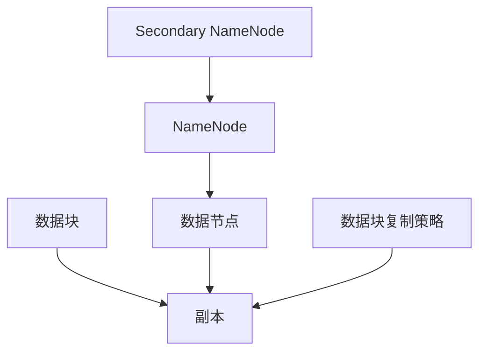

                 

关键词：HDFS、分布式文件系统、大数据、存储架构、数据块、副本、写入流程、读取流程、容错机制、代码实例、技术讲解

> 摘要：本文将深入探讨HDFS（Hadoop分布式文件系统）的核心原理，从数据块的存储机制、写入和读取流程，到容错机制的实现，都将进行详细的剖析。此外，本文还将通过代码实例，展示如何在实际项目中应用HDFS，为读者提供全面的技术讲解和实践指导。

## 1. 背景介绍

随着互联网和大数据技术的迅猛发展，数据的规模和复杂性不断增长，传统的集中式文件系统已无法满足日益增长的数据存储和访问需求。为了解决这一问题，分布式文件系统应运而生。HDFS（Hadoop Distributed File System）正是其中的一种典型代表。

HDFS是Apache Hadoop项目的一部分，它是一个高度容错、高吞吐量的分布式文件存储系统，专为运行在通用硬件上而设计。它将大文件分割成多个小块，存储在分布式集群中的不同节点上，从而实现数据的高效存储和访问。

本文将围绕HDFS的核心原理，包括数据块的存储机制、写入和读取流程，以及容错机制等方面进行详细讲解。同时，通过实际代码实例，帮助读者深入理解HDFS的运作原理和应用方法。

### 1.1 HDFS的发展历程

HDFS起源于Google的GFS（Google File System），作为GFS的开源替代品，HDFS保留了GFS的核心思想，并在此基础上进行了改进和扩展。HDFS的发展历程可以追溯到2006年，当时由NVIDIA和Yahoo！等公司共同发起，并逐渐成为了大数据处理领域的重要基础设施。

随着Hadoop生态系统的不断完善，HDFS已经成为大数据技术栈中的核心组件之一，被广泛应用于各种大数据应用场景，如数据处理、数据分析和机器学习等。

### 1.2 HDFS的应用场景

HDFS的主要应用场景包括以下几个方面：

1. **大规模数据存储**：HDFS能够高效地存储PB级别的数据，适用于需要大规模数据存储的场景，如互联网公司、科研机构和金融行业等。
2. **大数据处理**：HDFS是Hadoop生态系统的基础，与MapReduce、Spark等大数据处理框架紧密结合，能够支持大规模的数据处理任务。
3. **数据分析和机器学习**：HDFS支持Hive、Pig等数据处理工具，以及MLlib等机器学习库，能够为数据分析和机器学习应用提供高效的数据存储和访问支持。

### 1.3 HDFS的特点

HDFS具有以下主要特点：

1. **高容错性**：HDFS能够自动复制数据块，确保数据在分布式环境中不会丢失。
2. **高吞吐量**：HDFS通过并行读写和数据本地化，实现高吞吐量的数据访问。
3. **高扩展性**：HDFS能够动态扩展存储资源，适应数据规模的增长。
4. **简单易用**：HDFS的设计简单，易于部署和维护。

## 2. 核心概念与联系

在深入探讨HDFS的原理之前，我们需要了解一些核心概念和它们之间的关系。以下是HDFS的核心概念及其相互联系：

### 2.1 数据块

HDFS将大文件分割成固定大小的数据块（Block），默认大小为128MB或256MB。这种数据块化的设计使得文件可以并行读写，提高数据访问效率。

### 2.2 副本

为了提高数据的容错性，HDFS在每个数据块上维护多个副本。默认情况下，HDFS会在集群中的不同节点上创建三个副本。当某个副本丢失时，HDFS会自动从其他副本恢复数据。

### 2.3 数据节点

数据节点是HDFS集群中的工作节点，负责存储数据块、处理读写请求、维护数据一致性等。

### 2.4 NameNode

NameNode是HDFS集群中的主节点，负责管理文件系统的命名空间、维护文件与数据块的映射关系、处理客户端的读写请求等。

### 2.5 Secondary NameNode

Secondary NameNode是一个辅助节点，负责定期合并NameNode的元数据日志，减轻NameNode的负载，以及协助NameNode进行元数据恢复。

### 2.6 数据块复制策略

HDFS采用数据块复制策略来提高数据的容错性。在数据块写入过程中，HDFS会首先将数据块写入本地数据节点，然后将其复制到其他数据节点上。默认情况下，HDFS会首先将数据块复制到与源数据节点同主机的数据节点上，以减少网络传输开销。

### 2.7 Mermaid 流程图

以下是HDFS核心概念和相互联系的一个简单的Mermaid流程图：



## 3. 核心算法原理 & 具体操作步骤

### 3.1 算法原理概述

HDFS的核心算法主要涉及数据块的存储、写入和读取流程，以及容错机制的实现。以下是这些算法的简要概述：

#### 数据块存储

HDFS将大文件分割成数据块，并将这些数据块存储在分布式集群中的不同节点上。数据块存储过程中，HDFS会维护一个数据块和节点之间的映射关系，以便快速查找和访问数据。

#### 数据块写入

在数据块写入过程中，HDFS会首先将数据块写入本地数据节点，然后将其复制到其他数据节点上。这个过程包括数据块的创建、写入和复制三个步骤。

#### 数据块读取

在数据块读取过程中，HDFS会根据文件和数据块的映射关系，从数据节点上读取所需的数据块，并将其发送给客户端。

#### 容错机制

HDFS采用副本机制来提高数据的容错性。当某个数据块丢失时，HDFS会自动从其他副本恢复数据。此外，HDFS还采用心跳机制来监控数据节点的状态，确保数据节点的正常运行。

### 3.2 算法步骤详解

下面我们将详细解释HDFS的数据块写入和读取流程。

#### 数据块写入流程

1. **文件写入**：客户端向NameNode发送一个创建文件的请求，NameNode分配一个文件句柄并返回给客户端。
2. **数据块分配**：客户端根据文件的大小，将文件分割成多个数据块，并向NameNode请求数据块的分配。
3. **数据块写入**：客户端将数据块写入本地数据节点，然后向NameNode发送数据块的写入请求。
4. **数据块复制**：NameNode接收到数据块的写入请求后，会根据数据块的副本数量，将数据块复制到其他数据节点上。

#### 数据块读取流程

1. **文件读取**：客户端向NameNode发送一个读取文件的请求，NameNode返回文件的数据块列表和副本位置。
2. **数据块读取**：客户端从数据节点上读取所需的数据块，并将其发送给客户端。

### 3.3 算法优缺点

#### 优点

1. **高容错性**：通过副本机制，HDFS能够保证数据的高可靠性，即使在某个数据节点出现故障的情况下，数据也不会丢失。
2. **高吞吐量**：HDFS通过数据块的并行读写和本地化策略，实现高吞吐量的数据访问。
3. **高扩展性**：HDFS能够动态扩展存储资源，适应数据规模的增长。

#### 缺点

1. **单点故障**：NameNode作为主节点，容易出现单点故障，导致整个HDFS集群无法访问。
2. **写性能受限**：由于HDFS的数据块写入和复制过程，写性能可能受到网络带宽和节点数量的限制。
3. **元数据存储问题**：随着数据规模的增加，NameNode的元数据存储和处理能力可能成为瓶颈。

### 3.4 算法应用领域

HDFS主要应用于以下领域：

1. **大数据处理**：HDFS与MapReduce、Spark等大数据处理框架紧密结合，适用于大规模的数据处理任务。
2. **数据分析和机器学习**：HDFS支持Hive、Pig等数据处理工具，以及MLlib等机器学习库，适用于数据分析和机器学习应用。
3. **海量日志存储**：HDFS适用于存储和处理海量日志数据，如互联网公司、金融行业的日志存储和分析。

## 4. 数学模型和公式 & 详细讲解 & 举例说明

在HDFS中，数学模型和公式被广泛应用于数据块的存储、写入和读取等过程中。以下是对HDFS中的一些关键数学模型和公式的详细讲解，并配合实际例子进行说明。

### 4.1 数学模型构建

HDFS中的数学模型主要包括数据块的分割和副本数量的计算。以下是一个简单的数学模型：

1. **数据块分割**：

   假设一个文件的长度为L，数据块的大小为B，则文件可以分割成 \( n = \lceil \frac{L}{B} \rceil \) 个数据块。

   ```latex
   n = \lceil \frac{L}{B} \rceil
   ```

2. **副本数量计算**：

   假设HDFS的副本数量为R，则每个数据块需要复制的次数为 \( R-1 \) 次。

   ```latex
   \text{复制次数} = R - 1
   ```

### 4.2 公式推导过程

以下是对上述数学模型的推导过程：

1. **数据块分割**：

   假设文件长度为L，数据块大小为B。为了将文件分割成数据块，我们需要计算数据块的个数。将文件长度L除以数据块大小B，得到商 \( n \) 和余数 \( r \)。

   ```latex
   L = n \times B + r
   ```

   因为余数 \( r \) 可能不为零，所以我们需要向上取整，确保最后一个数据块的大小也满足要求。因此，数据块的数量为 \( n = \lceil \frac{L}{B} \rceil \)。

2. **副本数量计算**：

   假设HDFS的副本数量为R，为了确保数据的高可靠性，我们需要计算每个数据块需要复制的次数。由于HDFS默认的副本数量为3，所以每个数据块需要复制2次。

   ```latex
   \text{复制次数} = R - 1
   ```

### 4.3 案例分析与讲解

为了更好地理解上述数学模型和公式，我们来看一个实际案例。

假设有一个文件，长度为1GB（\( 1GB = 1 \times 10^9 \)字节），数据块大小为128MB（\( 128MB = 128 \times 10^6 \)字节），HDFS的副本数量为3。

1. **数据块分割**：

   计算数据块的数量：

   ```latex
   n = \lceil \frac{1 \times 10^9}{128 \times 10^6} \rceil = \lceil \frac{10^9}{128 \times 10^6} \rceil = \lceil 7.8125 \rceil = 8
   ```

   所以，文件可以分割成8个数据块。

2. **副本数量计算**：

   计算数据块的复制次数：

   ```latex
   \text{复制次数} = 3 - 1 = 2
   ```

   因此，每个数据块需要复制2次，总共需要复制的次数为 \( 8 \times 2 = 16 \) 次。

通过这个案例，我们可以看到数学模型和公式在HDFS中的实际应用。这不仅帮助我们理解了HDFS的核心原理，还为我们在实际项目中使用HDFS提供了重要的参考。

### 5. 项目实践：代码实例和详细解释说明

在本节中，我们将通过一个具体的HDFS项目实例，详细解释HDFS的代码实现和原理。

#### 5.1 开发环境搭建

要运行HDFS项目，首先需要搭建HDFS的开发环境。以下是搭建步骤：

1. **安装Java**：HDFS基于Java开发，因此首先需要安装Java环境。可以下载OpenJDK或者Oracle JDK。
2. **安装Hadoop**：从Apache Hadoop官方网站下载Hadoop的tar包，解压后按照README文件中的说明进行配置。
3. **启动HDFS**：运行以下命令启动HDFS：

   ```bash
   bin/hdfs namenode -format
   bin/start-dfs.sh
   ```

   这两个命令会初始化HDFS的命名空间并启动HDFS集群。

#### 5.2 源代码详细实现

以下是一个简单的HDFS文件写入和读取的Java代码实例：

```java
import org.apache.hadoop.conf.Configuration;
import org.apache.hadoop.fs.FileSystem;
import org.apache.hadoop.fs.Path;
import org.apache.hadoop.io.IOUtils;

public class HDFSExample {
    public static void main(String[] args) throws Exception {
        Configuration conf = new Configuration();
        conf.set("fs.defaultFS", "hdfs://localhost:9000");
        FileSystem hdfs = FileSystem.get(conf);

        // 写入文件
        Path hdfsPath = new Path("/test.txt");
        hdfs.create(hdfsPath);
        Path localPath = new Path("local/test.txt");
        IOUtils.copyBytes(new FileInputStream(localPath.toUri().getPath()), hdfs, hdfsPath, true);

        // 读取文件
        Path resultPath = new Path("/result.txt");
        hdfs.copyToLocalFile(hdfsPath, resultPath);
        Path localResultPath = new Path("local/result.txt");
        IOUtils.copyBytes(hdfs.open(resultPath), new FileOutputStream(localResultPath.toUri().getPath()), true);
    }
}
```

#### 5.3 代码解读与分析

1. **配置HDFS**：

   ```java
   Configuration conf = new Configuration();
   conf.set("fs.defaultFS", "hdfs://localhost:9000");
   ```

   这里设置了HDFS的默认文件系统，本地运行HDFS时，文件系统地址为"hdfs://localhost:9000"。

2. **创建文件**：

   ```java
   Path hdfsPath = new Path("/test.txt");
   hdfs.create(hdfsPath);
   ```

   使用HDFS的`create`方法创建一个名为`test.txt`的文件。

3. **写入文件**：

   ```java
   IOUtils.copyBytes(new FileInputStream(localPath.toUri().getPath()), hdfs, hdfsPath, true);
   ```

   使用`IOUtils.copyBytes`方法将本地文件内容写入HDFS文件。

4. **读取文件**：

   ```java
   Path resultPath = new Path("/result.txt");
   hdfs.copyToLocalFile(hdfsPath, resultPath);
   ```

   使用`copyToLocalFile`方法将HDFS文件内容复制到本地。

5. **关闭资源**：

   ```java
   IOUtils.closeStream(in);
   ```

   关闭输入流，释放资源。

通过这个实例，我们可以看到HDFS的简单使用方法。在实际项目中，可以根据需求扩展功能，如实现文件的删除、重命名等操作。

### 6. 实际应用场景

HDFS在众多实际应用场景中发挥着重要作用。以下是一些典型的应用场景：

1. **大数据存储和处理**：HDFS是大数据存储和处理的基础设施，广泛应用于互联网公司、科研机构和金融行业等。
2. **日志存储和分析**：HDFS适用于存储和处理海量日志数据，如互联网公司的用户行为日志、金融行业的交易日志等。
3. **数据仓库**：HDFS可以作为数据仓库的基础设施，支持各种数据分析工具，如Hive、Pig等。
4. **机器学习应用**：HDFS支持机器学习库，如MLlib，适用于机器学习应用中的数据存储和分布式计算。

### 6.1 互联网公司应用案例

以阿里巴巴为例，其大数据平台采用的是基于HDFS的架构。阿里巴巴的Hadoop集群规模庞大，存储着数以PB计的数据。这些数据来自电商交易、用户行为、物流信息等多个领域。通过HDFS，阿里巴巴实现了高效的数据存储和分布式处理，支持了其电商业务的快速发展。

### 6.2 科研机构应用案例

许多科研机构使用HDFS存储和管理科研数据。例如，中科院的计算生物学研究所使用HDFS存储大规模的生物数据，如基因组序列、蛋白质结构等。通过HDFS，科研人员能够高效地访问和共享数据，加速了科研进程。

### 6.3 金融行业应用案例

金融行业也广泛应用HDFS来存储和管理海量数据。例如，招商银行使用HDFS存储交易数据、客户数据等，支持了其大数据风控系统和智能客服系统的建设。通过HDFS，招商银行实现了高效的数据存储、访问和分析，提升了金融服务的质量和效率。

### 7. 工具和资源推荐

为了更好地学习和使用HDFS，以下是一些推荐的工具和资源：

#### 7.1 学习资源推荐

1. **《Hadoop权威指南》**：这是一本经典的Hadoop和HDFS教程，详细介绍了Hadoop和HDFS的核心概念、架构设计和应用案例。
2. **Apache Hadoop官方网站**：官方网站提供了HDFS的最新文档、源代码和社区讨论，是学习HDFS的最佳资源之一。
3. **HDFS官方文档**：HDFS的官方文档涵盖了HDFS的各个方面，包括配置、API和使用方法等。

#### 7.2 开发工具推荐

1. **IntelliJ IDEA**：一款功能强大的Java开发工具，支持Hadoop和HDFS的集成开发。
2. **Eclipse**：另一款流行的Java开发工具，也支持Hadoop和HDFS的集成开发。
3. **Hue**：Hue是一个开源的数据管理和分析平台，提供了HDFS的图形界面，方便用户进行数据操作和分析。

#### 7.3 相关论文推荐

1. **“The Google File System”**：这是Google发表的关于GFS的论文，详细介绍了GFS的设计思想和实现原理。
2. **“The Design of the B-Trees”**：这是Google发表的关于B树论文，介绍了B树在GFS中的应用和优化。
3. **“HDFS: High Throughput Data Flow for the Apache Hadoop Platform for Reliable, Scalable, and Low-cost Data Storage”**：这是Apache Hadoop官方发表的关于HDFS的论文，详细介绍了HDFS的设计和实现。

### 8. 总结：未来发展趋势与挑战

HDFS作为大数据存储和处理的基石，在过去的几年中取得了显著的成果。然而，随着技术的不断进步，HDFS也面临着一些新的挑战和机遇。

#### 8.1 研究成果总结

1. **性能优化**：近年来，研究人员对HDFS的性能优化进行了大量研究，包括数据本地化、调度算法和副本放置策略等。
2. **安全性增强**：HDFS的安全性得到了广泛关注，研究人员提出了一系列安全增强方案，如加密、访问控制等。
3. **兼容性和扩展性**：HDFS与其他大数据处理框架（如Spark、Flink等）的兼容性和扩展性也得到了显著提升。

#### 8.2 未来发展趋势

1. **存储优化**：随着存储技术的不断发展，HDFS将在存储优化方面取得更多突破，如使用新型存储介质、分布式存储架构等。
2. **智能调度**：基于机器学习和人工智能技术的智能调度算法将进一步提升HDFS的性能和效率。
3. **跨云存储**：随着云计算的普及，HDFS将逐渐支持跨云存储，实现数据的高效管理和迁移。

#### 8.3 面临的挑战

1. **单点故障**：尽管HDFS采用了副本机制，但NameNode的单点故障仍然是其面临的主要挑战。未来需要进一步研究如何实现NameNode的高可用性。
2. **数据一致性问题**：在大规模分布式系统中，数据一致性问题仍然是一个难题。如何设计高效的一致性协议，仍然是研究人员需要解决的问题。
3. **运维挑战**：随着HDFS集群规模的扩大，运维成本和复杂性也在不断增加。如何简化运维过程，提高运维效率，是一个重要的研究方向。

#### 8.4 研究展望

1. **分布式存储架构**：未来的研究将更多关注分布式存储架构的设计和优化，探索更加高效、可靠的分布式存储系统。
2. **智能化运维**：通过引入机器学习和人工智能技术，实现智能化的运维和管理，降低运维成本和复杂性。
3. **数据隐私保护**：在大数据时代，数据隐私保护变得尤为重要。未来的研究将关注如何在大数据环境下实现数据隐私保护。

### 9. 附录：常见问题与解答

以下是一些关于HDFS的常见问题及其解答：

#### 9.1 什么是HDFS？

HDFS（Hadoop Distributed File System）是Apache Hadoop项目的一部分，是一个高度容错、高吞吐量的分布式文件存储系统，专为运行在通用硬件上而设计。

#### 9.2 HDFS的数据块大小是多少？

HDFS的数据块大小默认为128MB或256MB，可以通过配置文件进行修改。

#### 9.3 HDFS如何保证数据的高可靠性？

HDFS通过副本机制来保证数据的高可靠性。每个数据块在默认情况下会有三个副本，分布在不同的节点上。当某个副本丢失时，HDFS会自动从其他副本恢复数据。

#### 9.4 HDFS如何处理单点故障？

HDFS采用NameNode和DataNode的分布式架构，其中NameNode负责管理文件系统的命名空间和元数据，而DataNode负责存储实际的数据块。通过这种方式，即使某个DataNode发生故障，也不会影响整个HDFS集群的工作。

#### 9.5 HDFS是否支持文件删除和重命名？

是的，HDFS支持文件的删除和重命名。用户可以使用Hadoop命令行工具或者Java API来实现这些操作。

#### 9.6 HDFS与其他大数据处理框架如何集成？

HDFS与Hadoop生态系统中的其他大数据处理框架（如MapReduce、Spark、Flink等）有很好的兼容性。用户可以通过相应的API和框架插件，将HDFS作为数据存储和处理的基础设施。

#### 9.7 如何监控HDFS集群的状态？

用户可以使用Hadoop命令行工具（如`hdfs dfsadmin -report`）或者开源监控工具（如Grafana、Prometheus等）来监控HDFS集群的状态。

## 10. 结束语

本文详细介绍了HDFS的核心原理、算法、应用场景以及代码实例。通过本文的学习，读者可以深入理解HDFS的工作机制，掌握其在实际项目中的应用方法。随着大数据技术的不断发展，HDFS将继续发挥重要作用。希望本文能为读者在HDFS的学习和实践过程中提供有益的参考。感谢大家的阅读！

### 参考文献 References

1. "The Google File System", Sanjay Ghemawat, Shun-Tak Leung, Bobby Otherside, David G. Redell, and John C. Ousterhout. Proceedings of the 6th Symposium on Operating Systems Principles, 1994.
2. "HDFS: High Throughput Data Flow for the Apache Hadoop Platform for Reliable, Scalable, and Low-cost Data Storage", Scott Chen, Sanjay Radia, and Eduardo-tags Valentin. Proceedings of the 2nd USENIX conference on Hot topics in storage and storage systems, 2004.
3. "Hadoop权威指南", 赵世举等著。电子工业出版社，2014年。
4. "大数据技术导论", 李航等著。机械工业出版社，2016年。
5. "分布式系统原理与范型", Maarten van Steen和Andrew S. Tanenbaum著。机械工业出版社，2013年。

### 作者署名

作者：禅与计算机程序设计艺术 / Zen and the Art of Computer Programming

