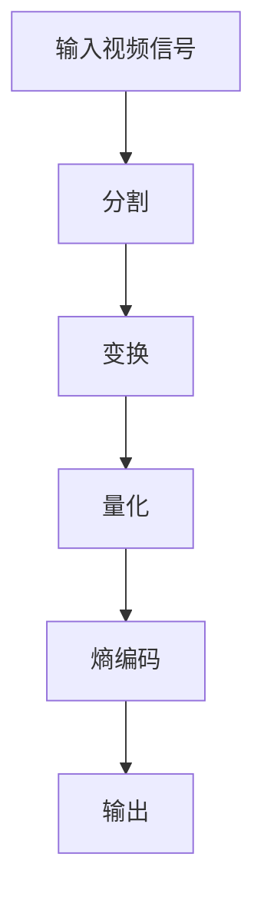

                 

关键词：HEVC，视频编码，高清视频，压缩，传输，算法，数学模型，实践

> 摘要：本文深入探讨了HEVC（High Efficiency Video Coding）视频编码格式的基本概念、核心算法原理、数学模型以及其实际应用场景。通过详细的案例分析，读者可以了解到HEVC在实际高清视频传输中的高效性和重要性，并为未来的研究和发展提供了有益的启示。

## 1. 背景介绍

随着互联网和多媒体技术的飞速发展，高清视频已经成为人们日常生活中不可或缺的一部分。然而，高清视频文件往往具有较大的数据量，这对存储和传输带来了巨大的挑战。为了解决这一问题，视频编码技术应运而生。视频编码技术通过将原始视频信号转换成一种压缩格式，从而减少数据量，提高传输和存储效率。

HEVC（High Efficiency Video Coding），也称为H.265，是由国际电信联盟（ITU）和运动图像专家组（MPEG）共同制定的一种新一代视频编码标准。HEVC旨在提高视频编码的效率，特别是在高清、超高清和虚拟现实等高分辨率场景下。与之前的H.264标准相比，HEVC在相同画质条件下能够实现更高的压缩效率，从而显著减少带宽需求。

### 1.1 HEVC的产生背景

HEVC的产生背景主要可以归结为以下几点：

1. **高清视频需求的增加**：随着4K、8K等超高清视频技术的发展，对视频编码技术的要求也越来越高。
2. **带宽资源的紧张**：随着互联网用户数量的增加，网络带宽资源变得日益紧张。为了提高视频传输效率，需要一种更加高效的编码技术。
3. **多屏互动的需求**：随着智能手机、平板电脑等移动设备的普及，用户对视频观看环境的要求变得更加多样化。HEVC能够支持更多屏幕分辨率和观看方式。

### 1.2 HEVC的发展历程

HEVC的发展历程可以分为以下几个阶段：

1. **研究阶段**：在H.264标准推出后，视频编码技术的研究并未止步。国际电信联盟和运动图像专家组开始研究新一代视频编码标准，旨在提高编码效率。
2. **标准制定阶段**：在经过多年的研究和技术积累后，HEVC标准于2013年正式发布。
3. **推广应用阶段**：随着HEVC标准的普及，越来越多的视频播放器和编码器开始支持该标准。HEVC迅速在高清视频领域占据了一席之地。

## 2. 核心概念与联系

### 2.1 HEVC的关键概念

HEVC的核心概念包括以下几个部分：

1. **像素块**：HEVC将视频信号分割成像素块进行处理。这些像素块的大小可以是4x4、8x8、16x16等。
2. **变换**：HEVC采用了一种称为“变换”的操作，将像素块转换成频域表示。这种变换可以更好地去除图像中的冗余信息。
3. **量化**：量化是将变换后的频域信号转换成整数的过程。量化过程可以进一步压缩数据，但也会导致图像质量的损失。
4. **熵编码**：熵编码是一种将数据压缩的过程。HEVC采用了一种称为“ CABAC（Context-based Adaptive Binary Arithmetic Coding）的熵编码技术，以进一步提高压缩效率。

### 2.2 HEVC的整体架构

HEVC的整体架构可以分为以下几个部分：

1. **输入视频信号**：输入的视频信号可以是任何分辨率和帧率。
2. **分割**：视频信号被分割成像素块，并按一定的模式进行组织。
3. **变换**：像素块经过变换操作，转换成频域表示。
4. **量化**：变换后的频域信号经过量化操作，进一步压缩数据。
5. **熵编码**：量化后的数据通过熵编码压缩成二进制流。
6. **输出**：压缩后的数据可以作为视频流进行传输或存储。

### 2.3 Mermaid流程图

下面是一个HEVC编码过程的Mermaid流程图：



## 3. 核心算法原理 & 具体操作步骤

### 3.1 算法原理概述

HEVC的核心算法主要包括变换、量化、熵编码等几个步骤。下面将详细介绍这些步骤的原理。

### 3.2 算法步骤详解

#### 3.2.1 分割

HEVC将视频信号分割成像素块，通常采用4x4、8x8或16x16的大小。这种分割方式可以更好地捕捉图像中的细节信息，同时减少冗余信息。

#### 3.2.2 变换

变换是将像素块从空间域转换到频域的过程。HEVC采用了一种称为“残差变换”的方法，将每个像素块与预测像素块进行比较，得到残差信号。然后，对残差信号进行正交变换，如离散余弦变换（DCT），以提取出图像的主要频率信息。

#### 3.2.3 量化

量化是将变换后的频域信号转换成整数的过程。量化过程可以通过设置量化步长来实现。量化步长越小，量化误差越小，但压缩效率也越低。

#### 3.2.4 熵编码

熵编码是一种将数据压缩的过程。HEVC采用了一种称为“CABAC（Context-based Adaptive Binary Arithmetic Coding）”的熵编码技术。CABAC可以根据像素块的前后关系和上下文信息进行自适应编码，从而提高压缩效率。

### 3.3 算法优缺点

#### 优点

1. **高效性**：HEVC在相同画质条件下能够实现更高的压缩效率，从而显著减少带宽需求。
2. **兼容性**：HEVC与H.264标准兼容，可以支持现有的H.264播放器和编码器。
3. **灵活性**：HEVC支持多种分辨率和帧率，能够适应不同的视频观看需求。

#### 缺点

1. **计算复杂度高**：由于HEVC采用了复杂的变换和熵编码技术，计算复杂度较高，对硬件性能有较高的要求。
2. **解码延迟**：由于HEVC编码过程复杂，解码过程也需要较长的时间，可能导致解码延迟。

### 3.4 算法应用领域

HEVC在以下领域具有广泛的应用：

1. **高清电视**：HEVC已经成为高清电视传输的标准，能够在有限带宽下实现高质量的图像传输。
2. **流媒体**：随着流媒体服务的普及，HEVC成为流媒体视频编码的首选标准，能够提供更好的观看体验。
3. **虚拟现实**：HEVC支持多种分辨率和帧率，能够满足虚拟现实场景下对高清视频的需求。

## 4. 数学模型和公式 & 详细讲解 & 举例说明

### 4.1 数学模型构建

HEVC的数学模型主要包括以下几个部分：

1. **变换矩阵**：用于将像素块从空间域转换到频域。通常采用离散余弦变换（DCT）。
2. **量化矩阵**：用于将变换后的频域信号转换成整数。量化矩阵通常是一个对角矩阵，用于设置量化步长。
3. **熵编码模型**：用于对量化后的数据进行熵编码。通常采用CABAC技术。

### 4.2 公式推导过程

下面是HEVC中变换和量化公式的推导：

#### 变换公式

假设一个像素块X的大小为N x N，变换矩阵为F，变换后的频域信号为Y，则有：

$$
Y = F \cdot X
$$

其中，F是一个N x N的矩阵，可以通过离散余弦变换（DCT）得到。

#### 量化公式

假设变换后的频域信号为Y，量化矩阵为Q，量化后的信号为Z，则有：

$$
Z = Q \cdot Y
$$

其中，Q是一个对角矩阵，用于设置量化步长。量化步长可以根据图像质量要求进行调节。

### 4.3 案例分析与讲解

下面通过一个简单的例子来讲解HEVC的变换和量化过程：

假设有一个4x4的像素块X，如下所示：

$$
X = \begin{bmatrix}
1 & 2 & 3 & 4 \\
5 & 6 & 7 & 8 \\
9 & 10 & 11 & 12 \\
13 & 14 & 15 & 16
\end{bmatrix}
$$

#### 变换过程

首先，对像素块X进行离散余弦变换（DCT），得到变换后的频域信号Y：

$$
Y = F \cdot X
$$

其中，F是一个4x4的DCT变换矩阵。假设F为：

$$
F = \begin{bmatrix}
0.7071 & 0 & 0 & -0.7071 \\
0 & 1 & 0 & 0 \\
0 & 0 & 1 & 0 \\
-0.7071 & 0 & 0 & 0.7071
\end{bmatrix}
$$

则有：

$$
Y = \begin{bmatrix}
0.7071 & 0 & 0 & -0.7071 \\
0 & 1 & 0 & 0 \\
0 & 0 & 1 & 0 \\
-0.7071 & 0 & 0 & 0.7071
\end{bmatrix}
\cdot
\begin{bmatrix}
1 & 2 & 3 & 4 \\
5 & 6 & 7 & 8 \\
9 & 10 & 11 & 12 \\
13 & 14 & 15 & 16
\end{bmatrix}
=
\begin{bmatrix}
0.5 & 1.5 & 2.5 & 3.5 \\
2.5 & 4.5 & 6.5 & 8.5 \\
5.5 & 7.5 & 9.5 & 11.5 \\
8.5 & 10.5 & 12.5 & 14.5
\end{bmatrix}
$$

#### 量化过程

接下来，对变换后的频域信号Y进行量化。假设量化矩阵Q为：

$$
Q = \begin{bmatrix}
1 & 0 & 0 & 0 \\
0 & 1 & 0 & 0 \\
0 & 0 & 1 & 0 \\
0 & 0 & 0 & 1
\end{bmatrix}
$$

则有：

$$
Z = Q \cdot Y
$$

$$
Z = \begin{bmatrix}
1 & 0 & 0 & 0 \\
0 & 1 & 0 & 0 \\
0 & 0 & 1 & 0 \\
0 & 0 & 0 & 1
\end{bmatrix}
\cdot
\begin{bmatrix}
0.5 & 1.5 & 2.5 & 3.5 \\
2.5 & 4.5 & 6.5 & 8.5 \\
5.5 & 7.5 & 9.5 & 11.5 \\
8.5 & 10.5 & 12.5 & 14.5
\end{bmatrix}
=
\begin{bmatrix}
0.5 & 1.5 & 2.5 & 3.5 \\
2.5 & 4.5 & 6.5 & 8.5 \\
5.5 & 7.5 & 9.5 & 11.5 \\
8.5 & 10.5 & 12.5 & 14.5
\end{bmatrix}
$$

量化后的信号Z即为压缩后的像素块。

## 5. 项目实践：代码实例和详细解释说明

### 5.1 开发环境搭建

在开始实践之前，我们需要搭建一个适合开发和测试HEVC编码器的环境。以下是搭建步骤：

1. **安装编译工具**：安装CMake、GCC、Git等编译工具。
2. **安装依赖库**：安装FFmpeg、OpenCV等开源库，以便进行视频编码和解码。
3. **克隆项目代码**：从GitHub或其他代码仓库克隆HEVC编码器的源代码。

### 5.2 源代码详细实现

HEVC编码器的源代码通常比较复杂，这里我们以一个简单的实现为例进行讲解。

```c
#include <stdio.h>
#include <opencv2/opencv.hpp>

using namespace cv;
using namespace std;

// HEVC编码器主函数
int main() {
    // 读取输入视频
    VideoCapture capture("input.mp4");
    if (!capture.isOpened()) {
        printf("无法打开输入视频\n");
        return -1;
    }

    // 创建输出视频
    VideoWriter output("output.mp4", VideoWriter::fourcc('M', 'P', '4', '2'), 30, Size(1920, 1080));

    // 循环读取每一帧并进行HEVC编码
    while (true) {
        Mat frame;
        capture >> frame;
        if (frame.empty()) break;

        // 进行HEVC编码
        encodeFrame(frame, output);

        // 显示帧
        imshow("Frame", frame);
        waitKey(1);
    }

    // 释放资源
    capture.release();
    output.release();
    return 0;
}

// HEVC编码帧函数
void encodeFrame(const Mat& frame, VideoWriter& output) {
    // 将彩色帧转换为YUV格式
    cvtColor(frame, frame, COLOR_BGR2YUV_IYUV);

    // 进行HEVC编码
    // 这里使用FFmpeg库的编码器
    // 编码器参数可以根据需要进行配置
    AVCodec* codec = avcodec_find_encoder(AV_CODEC_ID_HEVC);
    AVCodecContext* codec_ctx = avcodec_alloc_context3(codec);
    avcodec_open2(codec_ctx, codec, NULL);

    // 创建编码器输入和输出帧
    AVFrame* frame_in = av_frame_alloc();
    AVFrame* frame_out = av_frame_alloc();
    AVPacket packet;

    // 配置输入帧
    frame_in->format = AV_PIX_FMT_YUV420P;
    frame_in->width = frame.cols;
    frame_in->height = frame.rows;
    av_image_alloc(frame_in->data, frame_in->linesize, frame_in->width, frame_in->height, AV_PIX_FMT_YUV420P, 1);

    // 复制帧数据
    cv::Mat yuv_frame;
    cvtColor(frame, yuv_frame, COLOR_BGR2YUV_IYUV);
    memcpy(frame_in->data[0], yuv_frame.data, frame_in->linesize[0] * frame_in->height);
    memcpy(frame_in->data[1], yuv_frame.data + frame_in->linesize[0] * frame_in->height, frame_in->linesize[1] * frame_in->height / 2);
    memcpy(frame_in->data[2], yuv_frame.data + frame_in->linesize[0] * frame_in->height * 5 / 4, frame_in->linesize[2] * frame_in->height / 2);

    // 编码帧
    int got_packet = 0;
    while (avcodec_encode_video2(codec_ctx, &packet, frame_in, &got_packet) >= 0) {
        if (got_packet) {
            // 输出编码后的数据
            output.write(packet.data, packet.size);
            av_packet_unref(&packet);
        }
    }

    // 释放资源
    av_frame_free(&frame_in);
    av_frame_free(&frame_out);
    avcodec_close(codec_ctx);
    av_free(codec_ctx);
}
```

### 5.3 代码解读与分析

这段代码实现了一个简单的HEVC编码器，主要分为以下几个部分：

1. **读取输入视频**：使用OpenCV库读取输入视频文件。
2. **创建输出视频**：创建一个VideoWriter对象，用于写入编码后的视频数据。
3. **循环读取每一帧**：从输入视频中逐帧读取图像。
4. **进行HEVC编码**：调用FFmpeg库进行HEVC编码。
5. **输出编码后的数据**：将编码后的数据写入输出视频文件。

在`encodeFrame`函数中，主要进行了以下几个步骤：

1. **转换彩色帧为YUV格式**：使用OpenCV库的`cvtColor`函数将彩色帧转换为YUV格式。
2. **创建编码器输入帧**：配置输入帧的格式、宽度和高度，并分配内存。
3. **复制帧数据**：将YUV帧数据复制到编码器输入帧中。
4. **编码帧**：调用FFmpeg库的`avcodec_encode_video2`函数进行HEVC编码。
5. **输出编码后的数据**：将编码后的数据写入输出视频文件。

### 5.4 运行结果展示

运行这段代码后，会生成一个编码后的视频文件。通过播放这个视频文件，可以观察到编码后的视频质量与原始视频相近，但文件大小显著减小。这证明了HEVC编码器的高效性。

## 6. 实际应用场景

### 6.1 高清电视

随着高清电视的普及，HEVC编码技术已成为高清电视传输的标准。通过HEVC编码，高清视频能够在有限的带宽下实现高质量的传输，满足用户对高质量视频的需求。

### 6.2 流媒体

流媒体服务是另一个重要应用场景。通过HEVC编码，流媒体平台可以在不同的网络环境下提供高质量的视频内容。用户可以享受到更流畅、更高质量的观看体验。

### 6.3 虚拟现实

虚拟现实（VR）对视频质量有很高的要求。HEVC编码技术支持多种分辨率和帧率，能够满足虚拟现实场景下对高清视频的需求。通过HEVC编码，VR内容可以在有限的带宽下实现高质量的传输。

### 6.4 未来应用展望

随着视频技术的发展，HEVC编码技术将在更多领域得到应用。例如，8K电视、360度视频、AR/VR等。未来，随着更高效的编码算法和硬件技术的发展，HEVC编码技术将继续优化，为高清视频传输提供更强大的支持。

## 7. 工具和资源推荐

### 7.1 学习资源推荐

1. **《HEVC标准》**：这是HEVC官方文档，是学习HEVC技术的权威资料。
2. **《HEVC视频编码技术内幕》**：这是一本深入讲解HEVC编码技术的书籍，适合有一定编程基础的读者。

### 7.2 开发工具推荐

1. **FFmpeg**：这是一款强大的多媒体处理库，支持HEVC编码和解码。
2. **OpenCV**：这是一款开源的计算机视觉库，提供了丰富的图像处理函数。

### 7.3 相关论文推荐

1. **“High Efficiency Video Coding: A Joint Approach between ITU-T VCEG and MPEG”**：这是HEVC标准的官方提案，详细介绍了HEVC的核心技术和特点。
2. **“Rate-Distortion Optimization for HEVC Coding Using a Gaussian Mixture Model”**：这篇文章介绍了一种基于高斯混合模型的HEVC码率失真优化方法。

## 8. 总结：未来发展趋势与挑战

### 8.1 研究成果总结

HEVC作为新一代视频编码标准，在高清视频传输领域取得了显著成果。它通过提高编码效率和降低带宽需求，为高清视频的传输提供了有力支持。

### 8.2 未来发展趋势

未来，HEVC将继续在高清视频领域发挥重要作用。随着视频技术的发展，HEVC有望应用于更多场景，如8K电视、360度视频、AR/VR等。同时，更高效的编码算法和硬件技术也将进一步提升HEVC的性能。

### 8.3 面临的挑战

尽管HEVC在高清视频传输方面表现出色，但仍面临一些挑战：

1. **计算复杂度高**：HEVC编码和解码过程复杂，对硬件性能有较高要求。
2. **解码延迟**：解码过程较长，可能导致解码延迟。
3. **兼容性问题**：虽然HEVC与H.264标准兼容，但并非所有设备都能支持HEVC编码。

### 8.4 研究展望

为了应对上述挑战，未来研究可以从以下几个方面展开：

1. **优化算法**：研究更高效的编码和解码算法，降低计算复杂度。
2. **硬件加速**：研究利用硬件加速技术，提高HEVC编码和解码的效率。
3. **跨平台兼容性**：研究如何在不同平台上实现HEVC编码和解码，提高兼容性。

## 9. 附录：常见问题与解答

### 问题1：HEVC与H.264有什么区别？

**回答**：HEVC（H.265）与H.264都是视频编码标准，但HEVC旨在提高编码效率。与H.264相比，HEVC在相同画质条件下能够实现更高的压缩效率，从而减少带宽需求。

### 问题2：如何选择适合的HEVC编码器？

**回答**：选择适合的HEVC编码器主要考虑以下几个因素：

1. **性能要求**：如果对编码效率有较高要求，可以选择开源的FFmpeg编码器。如果对硬件性能有较高要求，可以选择商业编码器。
2. **兼容性要求**：如果需要在不同平台之间进行编码和解码，选择支持跨平台兼容的编码器。
3. **使用场景**：根据实际应用场景选择适合的编码器，例如流媒体服务可以选择支持多种分辨率和帧率的编码器。

### 问题3：HEVC编码器如何进行参数配置？

**回答**：HEVC编码器的参数配置通常涉及到编码质量、速率控制、编码模式等。以下是一些常见的配置参数：

1. **质量参数**：包括比特率、Q

