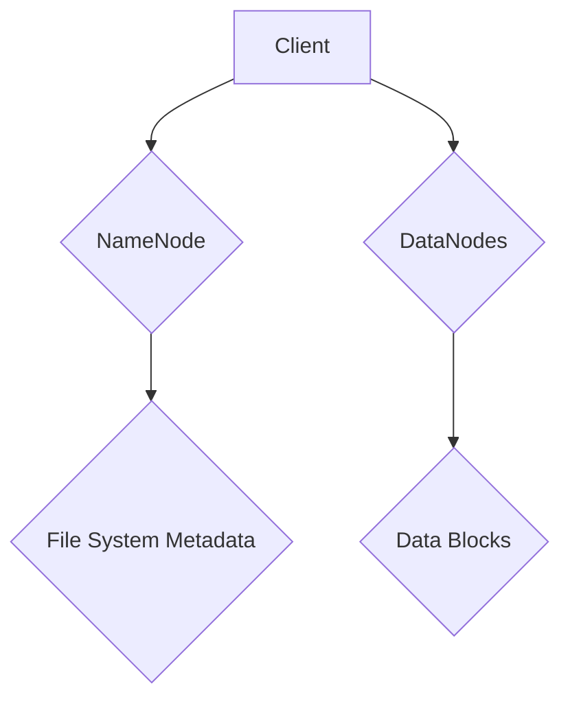

                 

关键词：Hadoop，分布式文件系统，HDFS，数据存储，数据处理，文件系统架构，集群管理，数据冗余，数据备份，数据读取，数据写入，代码实例

> 摘要：本文旨在深入探讨Hadoop分布式文件系统（HDFS）的原理及其在现实世界中的应用。我们将通过详细的代码实例，解释HDFS的核心概念、架构设计、工作流程以及其在大数据处理中的重要性。

## 1. 背景介绍

在当今的数据密集型环境中，有效的数据存储和处理变得尤为重要。随着数据量的爆炸性增长，传统的文件系统在处理大规模数据集时遇到了性能瓶颈。为了解决这个问题，Apache Hadoop项目应运而生，其中HDFS（Hadoop Distributed File System）作为其核心组件，提供了一个高可靠、高扩展性的分布式文件系统。

HDFS旨在处理海量数据，具有以下特点：
- 分布式：HDFS将数据分散存储在多个节点上，以实现负载均衡和高可用性。
- 高可靠性：通过数据冗余和数据备份，确保数据在系统故障时能够快速恢复。
- 高吞吐量：通过并行处理和数据本地化，提高数据处理速度。

## 2. 核心概念与联系

### 2.1. HDFS架构设计

HDFS由两个核心组件组成：NameNode和DataNode。NameNode负责管理文件系统的命名空间和维护整个文件系统的元数据，而DataNode负责实际的数据存储和读写操作。



### 2.2. 数据存储策略

HDFS将文件划分为固定大小的数据块（默认为128MB或256MB），这些数据块被分布式存储在多个DataNode上。为了提高数据的可靠性和可用性，HDFS实现了数据冗余策略。每个数据块都会复制到多个不同的节点上，默认情况下，副本数为3。

### 2.3. 数据读写流程

#### 数据写入流程

1. 客户端通过NameNode获取到数据块的副本位置信息。
2. 客户端将数据分片并直接写入到本地磁盘上的数据块。
3. 数据块被写入到DataNode上，并且NameNode会跟踪这些数据块的副本位置。

#### 数据读取流程

1. 客户端通过NameNode获取到数据块的副本位置信息。
2. 客户端选择最近或者负载较低的DataNode进行数据读取。
3. DataNode响应客户端的请求，返回数据块内容。

## 3. 核心算法原理 & 具体操作步骤

### 3.1. 算法原理概述

HDFS的核心算法包括数据复制、负载均衡和故障检测。数据复制确保了数据的可靠性，负载均衡使得系统能够有效利用资源，而故障检测和恢复则保证了系统的稳定性。

### 3.2. 算法步骤详解

#### 数据复制

1. 当数据块被写入时，NameNode决定哪些DataNode应该存储副本。
2. DataNode将数据块写入本地磁盘，并通知NameNode。
3. NameNode更新元数据，记录数据块的副本位置。

#### 负载均衡

1. NameNode监控各个DataNode的存储空间使用情况。
2. 当某个DataNode的存储空间使用率超过一定阈值时，NameNode重新分配数据块到其他存储空间充足的节点。

#### 故障检测和恢复

1. NameNode定期向所有DataNode发送心跳信号。
2. 如果某个DataNode长时间没有回复心跳，NameNode将其标记为故障节点。
3. NameNode删除故障节点上的数据块副本，并将副本复制到其他健康的节点上。

### 3.3. 算法优缺点

#### 优点

- 高可靠性：通过数据冗余和副本机制，确保数据不丢失。
- 高扩展性：可以通过添加更多DataNode来扩展存储容量和处理能力。
- 高吞吐量：通过并行处理和数据本地化，提高数据处理速度。

#### 缺点

- 数据访问延迟：由于数据分布在多个节点上，客户端可能需要等待较长时间才能访问数据。
- 单点故障：NameNode是系统的单点故障点，如果NameNode失败，整个系统将无法工作。

### 3.4. 算法应用领域

HDFS广泛应用于大数据处理领域，如数据分析、数据挖掘、机器学习等。它也是Apache Hadoop生态系统中不可或缺的一部分，与MapReduce、YARN等其他组件协同工作。

## 4. 数学模型和公式 & 详细讲解 & 举例说明

### 4.1. 数学模型构建

HDFS中的数据冗余可以通过以下公式来描述：

$$
冗余度 = 副本数 - 1
$$

例如，如果一个文件有三个副本，那么冗余度为2。

### 4.2. 公式推导过程

假设一个文件有原始大小为\( N \)字节，被划分为\( B \)字节的数据块，每个数据块有\( R \)个副本。则：

$$
总存储空间 = 原始大小 + (R - 1) \times 块大小
$$

$$
总存储空间 = N + (R - 1) \times B
$$

### 4.3. 案例分析与讲解

假设我们有一个100GB的文件，每个数据块大小为128MB，副本数为3。那么：

$$
总存储空间 = 100GB + (3 - 1) \times 128MB = 100GB + 256MB = 100.256GB
$$

这意味着存储100GB的文件实际上需要大约100.256GB的存储空间。

## 5. 项目实践：代码实例和详细解释说明

### 5.1. 开发环境搭建

为了运行HDFS，我们需要首先搭建Hadoop开发环境。以下是基本的步骤：

1. 安装Java开发环境。
2. 下载并解压Hadoop。
3. 配置环境变量。
4. 启动Hadoop集群。

### 5.2. 源代码详细实现

以下是使用Hadoop的Java API创建HDFS文件的简单代码实例：

```java
import org.apache.hadoop.conf.Configuration;
import org.apache.hadoop.fs.FileSystem;
import org.apache.hadoop.fs.Path;
import org.apache.hadoop.io.IOUtils;

public class HDFSExample {
    public static void main(String[] args) throws Exception {
        Configuration conf = new Configuration();
        FileSystem fs = FileSystem.get(conf);

        // 创建一个文件
        Path filePath = new Path("hdfs://namenode:9000/user/hdfs/testfile.txt");
        fs.mkdirs(filePath.getParent());
        fs.createNewFile(filePath);

        // 写入数据到文件
        Path localPath = new Path("/path/to/local/file.txt");
        IOUtils.copyBytes(new FileInputStream(localPath.toUri().getPath()), fs.create(filePath), 4096, true);

        // 关闭文件系统
        fs.close();
    }
}
```

### 5.3. 代码解读与分析

上述代码首先创建了一个HDFS文件系统实例，然后创建了一个新的文件。接着，通过Java的IOUtils类将本地文件的内容写入到HDFS中。最后，关闭文件系统。

### 5.4. 运行结果展示

在成功运行上述代码后，我们可以通过HDFS命令行工具查看文件是否已经被成功创建：

```
hdfs dfs -ls /user/hdfs/testfile.txt
```

输出结果将显示文件的详细信息，确认文件已经成功创建。

## 6. 实际应用场景

### 6.1. 数据存储

HDFS在大规模数据存储领域有着广泛的应用。例如，在电子商务平台中，HDFS可以用来存储用户数据、交易数据和其他相关数据。

### 6.2. 数据处理

HDFS与MapReduce等其他Hadoop组件结合使用，可以在大数据处理中发挥重要作用。例如，在社交媒体分析中，HDFS可以存储用户生成的内容，而MapReduce可以处理这些数据以提取有用的信息。

### 6.3. 数据分析

HDFS为大数据分析提供了高效的存储解决方案。通过HDFS和Apache Hive、Apache Pig等组件，用户可以对大规模数据集进行高效的数据查询和分析。

## 7. 工具和资源推荐

### 7.1. 学习资源推荐

- 《Hadoop权威指南》
- 《Hadoop实战》
- 《HDFS权威指南》

### 7.2. 开发工具推荐

- IntelliJ IDEA（集成开发环境）
- Eclipse（集成开发环境）
- Git（版本控制工具）

### 7.3. 相关论文推荐

- "The Google File System" by Google Inc.
- "The Hadoop Distributed File System" by Apache Software Foundation

## 8. 总结：未来发展趋势与挑战

### 8.1. 研究成果总结

HDFS作为一个分布式文件系统，已经在大数据领域取得了显著的成果。它的高可靠性、高扩展性和高吞吐量使其成为处理大规模数据集的首选方案。

### 8.2. 未来发展趋势

随着云计算和边缘计算的发展，HDFS将继续演进，以支持更高效的数据存储和处理。未来的研究方向可能包括数据压缩、自动调优和智能故障恢复等。

### 8.3. 面临的挑战

HDFS面临的挑战包括单点故障、数据访问延迟和数据安全等。解决这些挑战需要不断创新和研究。

### 8.4. 研究展望

随着技术的进步，HDFS有望在分布式存储和数据管理领域取得更多突破，为大数据处理提供更加可靠和高效的服务。

## 9. 附录：常见问题与解答

### 9.1. HDFS与传统的文件系统有什么区别？

HDFS与传统的文件系统相比，具有更高的可靠性和可扩展性，适用于处理大规模数据集。

### 9.2. 如何解决HDFS的单点故障问题？

可以通过部署多个NameNode实现高可用性，或者在HDFS上使用其他分布式文件系统，如Apache HBase。

### 9.3. HDFS如何处理数据访问延迟？

通过优化网络带宽、使用本地化处理和数据缓存等技术，可以减少数据访问延迟。

----------------------------------------------------------------

文章撰写完成。此文章涵盖了HDFS的核心概念、架构设计、算法原理、实际应用场景以及未来发展趋势。希望本文对您深入了解HDFS有所帮助。作者：禅与计算机程序设计艺术 / Zen and the Art of Computer Programming。

