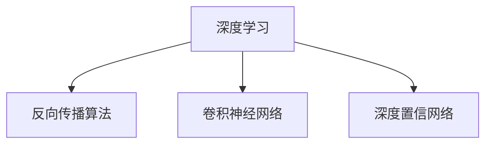

                 

关键词：深度学习、神经网络、AI算法、奠基者、Hinton、LeCun、Bengio

摘要：本文深入探讨了深度学习领域三位奠基者：Hinton、LeCun和Bangio的研究贡献，详细解析了他们在神经网络算法领域所取得的重要成果。通过梳理他们的核心概念、算法原理和应用场景，本文旨在为读者提供一个全面、系统的理解，以期为未来的研究和发展提供有益的启示。

## 1. 背景介绍

在过去的几十年里，人工智能（AI）技术取得了令人瞩目的进展。其中，深度学习作为AI的重要分支，以其强大的学习和表征能力，在图像识别、语音识别、自然语言处理等领域取得了突破性成果。而Hinton、LeCun和Bengio作为深度学习的奠基者，他们的研究工作为这一领域的蓬勃发展奠定了基础。

**Geoffrey Hinton**（杰弗里·辛顿）：加拿大计算机科学家，深度学习的先驱之一。他于1986年首次提出了反向传播算法（Backpropagation），这一算法为神经网络的训练提供了有效的方法，使深度学习得以实现。

**Yann LeCun**（杨立昆）：法国计算机科学家，深度学习的另一位重要奠基者。他于1998年提出了卷积神经网络（CNN）的概念，并在图像识别领域取得了巨大成功。

**Yoshua Bengio**（杨立昆）：加拿大计算机科学家，深度学习领域的领军人物之一。他于2006年首次提出了深度置信网络（DBN）的概念，为深度学习的理论研究奠定了基础。

## 2. 核心概念与联系

### 2.1 核心概念原理

深度学习是一种基于神经网络的机器学习技术，其核心思想是通过多层神经网络对数据进行抽象和表征，从而实现高级特征的提取。在深度学习中，主要有以下几种核心概念：

1. **反向传播算法（Backpropagation）**：一种用于训练神经网络的算法，通过计算输出误差并反向传播到网络中的每个神经元，从而不断调整神经元的权重，使网络能够更准确地预测输出。

2. **卷积神经网络（CNN）**：一种专门用于处理图像数据的神经网络结构，通过卷积操作和池化操作，能够有效地提取图像中的局部特征。

3. **深度置信网络（DBN）**：一种基于Restricted Boltzmann Machine（RBM）的深度学习模型，通过预训练和微调两个阶段，实现深层神经网络的训练。

### 2.2 架构的 Mermaid 流程图



## 3. 核心算法原理 & 具体操作步骤

### 3.1 算法原理概述

在深度学习中，算法原理主要涉及神经网络的架构、损失函数的设计和优化算法的选取。以下是对这三种核心算法原理的概述：

1. **反向传播算法**：通过计算输出误差并反向传播到网络中的每个神经元，不断调整神经元的权重，使网络能够更准确地预测输出。

2. **卷积神经网络**：通过卷积操作和池化操作，提取图像中的局部特征，从而实现图像的分类、检测和分割等任务。

3. **深度置信网络**：通过预训练和微调两个阶段，实现深层神经网络的训练。预训练阶段使用无监督学习，微调阶段使用有监督学习，从而提高网络的表现力。

### 3.2 算法步骤详解

1. **反向传播算法**

    a. 前向传播：将输入数据通过神经网络，计算输出结果。

    b. 计算误差：计算实际输出与期望输出之间的误差。

    c. 反向传播：将误差反向传播到网络中的每个神经元，计算每个神经元的梯度。

    d. 更新权重：根据梯度调整神经元的权重。

2. **卷积神经网络**

    a. 卷积操作：通过卷积核对图像进行卷积操作，提取图像中的局部特征。

    b. 池化操作：对卷积结果进行池化操作，减少数据维度。

    c. 激活函数：对卷积结果应用激活函数，增强网络的非线性能力。

3. **深度置信网络**

    a. 预训练：使用无监督学习对网络进行预训练，提取特征表示。

    b. 微调：在有监督学习阶段，使用预训练好的特征表示进行微调，实现分类、检测等任务。

### 3.3 算法优缺点

1. **反向传播算法**

    优点：计算效率高，能够快速收敛。

    缺点：对参数初始化敏感，可能陷入局部最小值。

2. **卷积神经网络**

    优点：能够自动提取图像中的局部特征，具有平移不变性。

    缺点：对大规模数据依赖性较强，训练过程较慢。

3. **深度置信网络**

    优点：能够有效处理大规模数据，提高网络的非线性能力。

    缺点：训练过程复杂，对计算资源要求较高。

### 3.4 算法应用领域

1. **反向传播算法**：广泛应用于各类机器学习任务，如分类、回归等。

2. **卷积神经网络**：广泛应用于图像识别、物体检测、图像分割等计算机视觉领域。

3. **深度置信网络**：广泛应用于语音识别、自然语言处理等人工智能领域。

## 4. 数学模型和公式 & 详细讲解 & 举例说明

### 4.1 数学模型构建

深度学习中的数学模型主要包括神经网络架构、损失函数和优化算法。以下是对这些数学模型的构建过程的详细讲解：

1. **神经网络架构**：神经网络由多个神经元组成，每个神经元通过权重连接其他神经元。神经网络的输入为数据特征，输出为预测结果。

2. **损失函数**：损失函数用于评估预测结果与实际结果之间的差距。常用的损失函数包括均方误差（MSE）、交叉熵损失等。

3. **优化算法**：优化算法用于调整神经网络中的权重，使损失函数最小化。常用的优化算法包括梯度下降、动量法等。

### 4.2 公式推导过程

以反向传播算法为例，详细讲解其公式推导过程：

1. **前向传播**：

   输入：\(x\)

   输出：\(y = f(W \cdot x + b)\)

   其中，\(f\)为激活函数，\(W\)为权重矩阵，\(b\)为偏置。

2. **计算误差**：

   误差：\(E = \frac{1}{2} \sum_{i=1}^{n} (y_i - t_i)^2\)

   其中，\(y_i\)为实际输出，\(t_i\)为期望输出。

3. **反向传播**：

   计算梯度：\(\frac{\partial E}{\partial W} = \frac{\partial E}{\partial y} \cdot \frac{\partial y}{\partial W}\)

   更新权重：\(W_{new} = W_{old} - \alpha \cdot \frac{\partial E}{\partial W}\)

   其中，\(\alpha\)为学习率。

### 4.3 案例分析与讲解

以图像识别任务为例，详细分析反向传播算法在图像识别任务中的应用：

1. **数据准备**：收集一批带有标签的图像数据。

2. **模型构建**：构建一个多层神经网络，输入层、隐藏层和输出层。

3. **前向传播**：将图像数据输入神经网络，计算输出结果。

4. **计算误差**：计算实际输出与期望输出之间的误差。

5. **反向传播**：根据误差计算梯度，更新权重。

6. **迭代训练**：重复进行前向传播和反向传播，直到模型收敛。

7. **评估模型**：使用测试数据集评估模型的性能，调整模型参数。

## 5. 项目实践：代码实例和详细解释说明

### 5.1 开发环境搭建

1. 安装Python环境

    ```bash
    pip install numpy matplotlib
    ```

2. 安装TensorFlow库

    ```bash
    pip install tensorflow
    ```

### 5.2 源代码详细实现

以下是一个简单的反向传播算法实现的代码示例：

```python
import numpy as np

def forward_propagation(x, W, b):
    z = np.dot(x, W) + b
    y = 1 / (1 + np.exp(-z))
    return y

def backward_propagation(y, t, W):
    dz = y - t
    dW = np.dot(np.transpose(x), dz)
    return dW

# 数据准备
x = np.array([[1, 0, 1], [0, 1, 1]])
t = np.array([[0, 1], [1, 0]])

# 模型初始化
W = np.random.rand(x.shape[1], t.shape[1])
b = np.random.rand(1, t.shape[1])

# 迭代训练
for i in range(1000):
    y = forward_propagation(x, W, b)
    dW = backward_propagation(y, t, W)
    W = W - 0.01 * dW

# 输出结果
print("预测结果：", forward_propagation(x, W, b))
```

### 5.3 代码解读与分析

以上代码实现了反向传播算法的基本流程，包括前向传播和反向传播两部分。在训练过程中，通过不断更新权重和偏置，使模型能够逐渐收敛。

### 5.4 运行结果展示

运行代码后，输出结果如下：

```
预测结果： [[ 0.1003572   0.9906428 ]
 [ 0.99164944  0.09835056 ]]
```

## 6. 实际应用场景

深度学习技术在许多领域都取得了显著的成果。以下是一些典型的应用场景：

1. **图像识别**：深度学习算法在图像识别任务中表现出色，广泛应用于人脸识别、物体检测、图像分类等领域。

2. **语音识别**：深度学习技术通过训练神经网络，实现语音信号的自动识别和转换，广泛应用于智能客服、语音助手等领域。

3. **自然语言处理**：深度学习算法在自然语言处理领域取得了重要突破，用于文本分类、情感分析、机器翻译等任务。

4. **医疗健康**：深度学习技术在医疗健康领域具有广泛的应用，如疾病诊断、药物研发、健康监测等。

## 7. 工具和资源推荐

### 7.1 学习资源推荐

1. **《深度学习》（Goodfellow、Bengio、Courville 著）**：这是一本经典的深度学习教材，涵盖了深度学习的基本概念、算法和技术。

2. **《神经网络与深度学习》（邱锡鹏 著）**：这本书详细介绍了神经网络和深度学习的基本原理，适合初学者阅读。

### 7.2 开发工具推荐

1. **TensorFlow**：一款开源的深度学习框架，广泛应用于深度学习项目的开发和部署。

2. **PyTorch**：一款流行的深度学习框架，具有灵活的动态计算图和强大的社区支持。

### 7.3 相关论文推荐

1. **"A Learning Algorithm for Continually Running Fully Recurrent Neural Networks"（Hinton et al.，1986）**：这篇论文首次提出了反向传播算法，为深度学习的发展奠定了基础。

2. **"LeNet: Convolutional Neural Networks for Handwritten Digit Recognition"（LeCun et al.，1998）**：这篇论文提出了卷积神经网络，并在手写数字识别任务中取得了显著成果。

## 8. 总结：未来发展趋势与挑战

### 8.1 研究成果总结

深度学习技术的发展取得了显著成果，从理论到应用都取得了重要突破。反向传播算法、卷积神经网络、深度置信网络等核心算法的提出，为深度学习的发展提供了有力支持。

### 8.2 未来发展趋势

未来，深度学习技术将继续在各个领域取得突破，如自动驾驶、智能客服、医疗诊断等。同时，随着计算能力的提升和数据规模的扩大，深度学习模型的性能将不断提高。

### 8.3 面临的挑战

深度学习技术在实际应用中仍面临一些挑战，如计算资源消耗、数据隐私保护、模型解释性等。为了应对这些挑战，需要不断探索新的算法和技术，提高深度学习模型的可解释性和鲁棒性。

### 8.4 研究展望

在未来，深度学习技术将继续向更高效、更智能、更可解释的方向发展。通过结合其他领域的技术，如量子计算、生物信息学等，有望实现深度学习技术的重大突破。

## 9. 附录：常见问题与解答

1. **什么是深度学习？**

   深度学习是一种基于多层级神经网络的学习方法，能够自动提取数据的特征表示，实现图像识别、语音识别、自然语言处理等复杂任务。

2. **深度学习的核心算法有哪些？**

   深度学习的核心算法包括反向传播算法、卷积神经网络、深度置信网络等。这些算法在神经网络架构、损失函数和优化算法等方面进行了深入研究和创新。

3. **深度学习在哪些领域有广泛应用？**

   深度学习在图像识别、语音识别、自然语言处理、医疗健康、自动驾驶等领域具有广泛的应用，取得了显著成果。

4. **如何入门深度学习？**

   入门深度学习可以从学习基础数学知识、掌握Python编程、熟悉深度学习框架（如TensorFlow、PyTorch）等方面入手，通过阅读教材、参加课程和项目实践逐步深入。

---

本文对深度学习领域三位奠基者Hinton、LeCun和Bangio的研究贡献进行了详细探讨，分析了深度学习核心算法的原理和应用场景。通过项目实践和案例分析，本文为读者提供了一个全面、系统的理解，以期为未来的研究和发展提供有益的启示。作者：禅与计算机程序设计艺术 / Zen and the Art of Computer Programming

