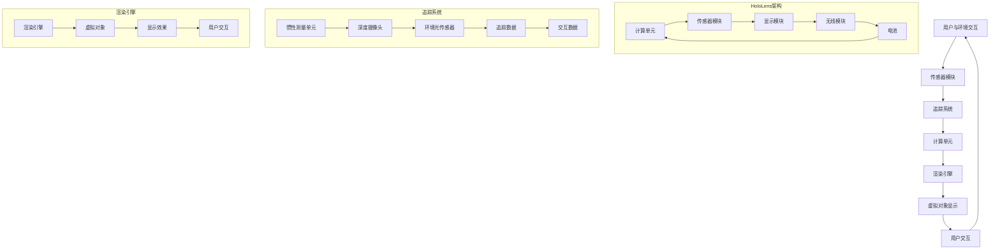

                 

混合现实（Mixed Reality，MR）技术是近年来迅速崛起的一股新势力，它融合了虚拟现实（VR）和增强现实（AR）的优势，将数字信息和现实环境进行无缝融合。其中，Microsoft HoloLens作为MR设备的先驱，为开发者提供了丰富的开发平台和工具。本文将深入探讨HoloLens在混合现实应用开发中的核心概念、算法原理、数学模型以及实际应用场景，旨在为开发者提供一套完整的开发指南。

## 文章关键词

- 混合现实（Mixed Reality）
- Microsoft HoloLens
- 应用开发
- 算法原理
- 数学模型
- 实际应用场景

## 文章摘要

本文首先介绍了混合现实技术的基本概念和Microsoft HoloLens的发展历程。接着，我们详细分析了HoloLens在开发中的核心概念和架构，并使用Mermaid流程图进行了直观展示。随后，文章深入探讨了HoloLens开发的核心算法原理，包括追踪算法、渲染算法和交互算法。接着，我们用LaTeX格式详细介绍了相关的数学模型和公式，并通过实际案例进行了分析。文章的最后，我们提供了HoloLens开发的实际项目实例，并对代码进行了详细解读。最后，文章总结了HoloLens的应用场景和未来发展趋势，为开发者提供了宝贵的参考。

## 1. 背景介绍

混合现实（Mixed Reality，MR）是一种将虚拟信息和现实环境融合在一起的技术。与虚拟现实（VR）和增强现实（AR）相比，MR不仅将数字信息叠加在现实环境中，还能与现实环境进行交互，从而创造出一种全新的体验。Microsoft HoloLens作为全球第一款商用混合现实头戴设备，于2016年正式发布。HoloLens的独特之处在于它无需任何外部设备即可实现高精度的环境感知和交互，为开发者提供了无限的可能。

### 混合现实技术的发展历程

混合现实技术最早可以追溯到1990年代，当时就已经有了将计算机生成的图像叠加到现实环境中的初步尝试。随着计算机技术和传感器技术的进步，MR技术逐渐成熟。21世纪初，随着智能手机和移动设备的普及，增强现实（AR）技术得到了快速发展。然而，AR技术主要依赖于移动设备和摄像头，其沉浸感和交互性相对较弱。

随着硬件技术的提升，特别是在图形处理、传感器和无线通信方面的突破，MR技术迎来了新的发展机遇。2010年后，各大科技公司纷纷投入巨资研发MR设备，如Facebook的Oculus、谷歌的Google Glass等。然而，这些设备在实现高精度环境感知和自然交互方面仍然存在诸多挑战。

### Microsoft HoloLens的发展历程

Microsoft HoloLens的开发始于2010年，当时微软内部成立了一个名为“Skunk Works”的团队，专注于研发一种全新的混合现实头戴设备。经过数年的研发，HoloLens终于在2015年1月的CES展上首次亮相，并在2016年正式发布。HoloLens采用了自主研发的混合现实操作系统Windows Holographic，支持多线程、并行计算和高效的数据处理。

HoloLens的设计理念是将计算能力、传感器和显示技术融为一体，实现无缝的混合现实体验。设备内置了多个高精度传感器，如惯性测量单元（IMU）、深度摄像头和环境光传感器等，可以实时感知用户和环境。此外，HoloLens还采用了自研的Display Engine，实现了高分辨率、高刷新率的显示效果，为用户提供了沉浸式的视觉体验。

### HoloLens在开发中的优势

HoloLens作为一款商用混合现实设备，为开发者提供了以下几方面的优势：

1. **高精度环境感知**：HoloLens内置了多个高精度传感器，可以实时捕捉用户和环境的三维信息，为开发者提供了丰富的数据基础。
2. **自然交互**：HoloLens支持手势、声音和眼动等多种交互方式，为开发者提供了灵活的交互设计。
3. **独立运行**：HoloLens无需连接电脑或手机即可独立运行，为开发者提供了更大的自由度和灵活性。
4. **丰富的API和工具**：Microsoft为HoloLens提供了丰富的开发API和工具，如Unity、Unreal Engine等，方便开发者进行应用开发。

总之，Microsoft HoloLens作为混合现实技术的先驱，为开发者提供了强大的开发平台和工具，使得混合现实应用的开发变得更加简单和高效。

## 2. 核心概念与联系

### 混合现实（MR）基本概念

混合现实（MR）是一种将数字信息和现实环境融合在一起的技术。它包括以下几个基本概念：

- **虚拟对象**：在混合现实中，虚拟对象是指由计算机生成的三维模型或其他数字内容。这些对象可以放置在现实环境中，并与现实环境中的物体进行交互。
- **追踪系统**：追踪系统用于实时捕捉用户和环境的三维信息。HoloLens采用了多种传感器，如惯性测量单元（IMU）、深度摄像头和环境光传感器等，实现高精度的追踪。
- **渲染引擎**：渲染引擎用于将虚拟对象渲染到现实环境中。HoloLens采用了自研的Display Engine，实现了高分辨率、高刷新率的显示效果。
- **交互方式**：混合现实中的交互方式包括手势、声音和眼动等。HoloLens支持多种交互方式，使得用户可以自然地与虚拟对象和现实环境进行交互。

### Microsoft HoloLens的架构

Microsoft HoloLens的架构可以分为以下几个部分：

- **计算单元**：计算单元包括CPU、GPU和内存等，负责处理和存储应用程序的数据。HoloLens采用了高通Snapdragon处理器，具备强大的计算能力。
- **传感器模块**：传感器模块包括惯性测量单元（IMU）、深度摄像头、环境光传感器等，用于实时捕捉用户和环境的三维信息。这些传感器数据被用于追踪系统和交互系统。
- **显示模块**：显示模块包括一块高分辨率、高刷新率的显示器，用于将虚拟对象渲染到现实环境中。HoloLens的Display Engine采用了自研技术，实现了出色的显示效果。
- **无线模块**：无线模块包括Wi-Fi和蓝牙等无线通信技术，用于实现设备之间的数据传输和网络连接。
- **电池**：HoloLens内置了一块可充电电池，为设备提供续航能力。

### Mermaid流程图（核心概念原理和架构）



通过Mermaid流程图，我们可以清晰地看到HoloLens的架构和工作原理。传感器模块负责捕捉用户和环境的三维信息，追踪系统对这些信息进行处理，计算单元进行数据处理和渲染，最后将虚拟对象显示在用户面前，实现与用户的交互。

## 3. 核心算法原理 & 具体操作步骤

### 3.1 算法原理概述

在HoloLens混合现实应用开发中，核心算法主要包括追踪算法、渲染算法和交互算法。这些算法共同协作，为用户提供了沉浸式的混合现实体验。

- **追踪算法**：追踪算法用于实时捕捉用户和环境的三维信息。HoloLens采用了惯性测量单元（IMU）、深度摄像头和光学传感器等多种传感器，通过融合多种传感数据，实现高精度的追踪。
- **渲染算法**：渲染算法用于将虚拟对象渲染到现实环境中。HoloLens采用了自研的Display Engine，实现了高分辨率、高刷新率的显示效果，为用户提供了逼真的视觉体验。
- **交互算法**：交互算法用于处理用户与虚拟对象和现实环境的交互。HoloLens支持手势、声音和眼动等多种交互方式，使得用户可以自然地与虚拟对象和现实环境进行交互。

### 3.2 算法步骤详解

#### 追踪算法

追踪算法的具体步骤如下：

1. **数据采集**：HoloLens通过传感器模块采集用户和环境的三维信息，包括位置、方向、姿态等。
2. **数据融合**：将多种传感数据（如IMU、深度摄像头和光学传感器）进行融合，以提高追踪精度。
3. **运动估计**：使用卡尔曼滤波或其他运动估计算法，根据传感数据估计用户和物体的位置、方向和姿态。
4. **追踪结果更新**：将估计结果更新到追踪系统中，以便后续的渲染和交互处理。

#### 渲染算法

渲染算法的具体步骤如下：

1. **场景构建**：根据追踪算法提供的三维信息，构建虚拟对象和现实环境的场景。
2. **光照计算**：根据现实环境的光照情况，计算虚拟对象的光照效果，包括漫反射、反射和折射等。
3. **渲染引擎处理**：使用HoloLens自研的Display Engine，将虚拟对象和现实环境进行渲染，生成最终图像。
4. **图像显示**：将渲染后的图像显示在HoloLens的显示器上，为用户呈现沉浸式的视觉体验。

#### 交互算法

交互算法的具体步骤如下：

1. **手势识别**：通过机器学习算法和深度学习算法，识别用户的手势动作，如手指伸展、手势滑动等。
2. **声音识别**：通过语音识别技术，识别用户的声音命令，如语音输入、语音控制等。
3. **眼动追踪**：通过眼动传感器，追踪用户的眼球运动，实现眼动交互。
4. **交互处理**：根据用户的手势、声音和眼动信息，处理与虚拟对象和现实环境的交互，如选择、拖动、控制等。

### 3.3 算法优缺点

#### 追踪算法

- **优点**：追踪算法实现了高精度的用户和环境三维信息捕捉，为虚拟对象和现实环境的融合提供了数据基础。
- **缺点**：追踪算法对传感器的依赖较高，且在复杂环境中可能存在一定的误差。

#### 渲染算法

- **优点**：渲染算法实现了高分辨率、高刷新率的显示效果，为用户提供了逼真的视觉体验。
- **缺点**：渲染算法对计算资源要求较高，可能对设备的性能产生一定影响。

#### 交互算法

- **优点**：交互算法支持多种交互方式，使得用户可以自然地与虚拟对象和现实环境进行交互。
- **缺点**：交互算法对用户动作的识别和响应存在一定的延迟，可能影响用户体验。

### 3.4 算法应用领域

追踪算法、渲染算法和交互算法在混合现实应用开发中具有广泛的应用领域：

- **教育**：通过混合现实技术，为学生提供沉浸式的学习体验，如虚拟实验室、虚拟课堂等。
- **医疗**：通过混合现实技术，为医生提供精准的手术导航和手术模拟，提高手术成功率。
- **工业**：通过混合现实技术，为工业设计、生产制造和维修提供高效、精准的解决方案。
- **娱乐**：通过混合现实技术，为用户提供全新的娱乐体验，如虚拟游戏、虚拟旅游等。

总之，HoloLens混合现实应用开发的核心算法原理和具体操作步骤为开发者提供了强大的技术支持，使得混合现实应用的开发变得更加简单和高效。

## 4. 数学模型和公式 & 详细讲解 & 举例说明

### 4.1 数学模型构建

在HoloLens混合现实应用开发中，数学模型主要用于追踪算法和渲染算法的计算。以下是两个核心数学模型的构建：

#### 运动模型

运动模型描述了用户或物体在三维空间中的运动轨迹。我们使用质点模型来描述这一运动，其数学表达式如下：

$$
x(t) = x_0 + v \cdot t \\
y(t) = y_0 + v \cdot t \\
z(t) = z_0 + v \cdot t
$$

其中，\(x(t)\), \(y(t)\), \(z(t)\) 分别表示物体在三维空间中的位置，\(x_0\), \(y_0\), \(z_0\) 分别表示初始位置，\(v\) 表示速度。

#### 渲染模型

渲染模型描述了虚拟对象在现实环境中的显示效果。我们使用光线追踪模型来描述这一过程，其数学表达式如下：

$$
L_i = L_e + L_d + L_s
$$

其中，\(L_i\) 表示总光亮度，\(L_e\) 表示环境光亮度，\(L_d\) 表示漫反射光亮度，\(L_s\) 表示镜面反射光亮度。

- \(L_e = k_e \cdot L_e^0\)，其中 \(k_e\) 是环境光反射系数，\(L_e^0\) 是环境光亮度。
- \(L_d = k_d \cdot L_w \cdot cos(\theta)\)，其中 \(k_d\) 是漫反射系数，\(L_w\) 是白色光亮度，\(\theta\) 是入射角和法线之间的夹角。
- \(L_s = k_s \cdot (L_w - L_w \cdot cos(\theta))^{2}\)，其中 \(k_s\) 是镜面反射系数。

### 4.2 公式推导过程

#### 运动模型推导

运动模型基于牛顿第一定律和第二定律，假设物体在三维空间中做匀速直线运动。根据牛顿第一定律，物体在没有外力作用时，保持静止或匀速直线运动。根据牛顿第二定律，物体受到的合外力等于其质量乘以加速度。在三维空间中，合外力可以表示为：

$$
F_x = m \cdot a_x \\
F_y = m \cdot a_y \\
F_z = m \cdot a_z
$$

由于假设物体做匀速直线运动，因此加速度为零，即 \(a_x = a_y = a_z = 0\)。将加速度代入上述公式，得到合外力为零，即物体在没有外力作用时，保持静止或匀速直线运动。

根据牛顿第一定律，物体在没有外力作用时，保持静止或匀速直线运动。因此，物体的运动方程可以表示为：

$$
x(t) = x_0 + v \cdot t \\
y(t) = y_0 + v \cdot t \\
z(t) = z_0 + v \cdot t
$$

其中，\(x_0\), \(y_0\), \(z_0\) 分别表示初始位置，\(v\) 表示速度。

#### 渲染模型推导

渲染模型基于光线追踪理论。光线追踪模型假设光线在空间中传播时，遵循反射和折射定律。在现实环境中，光线与物体表面发生碰撞时，会产生反射和折射现象。反射和折射现象可以用以下公式描述：

- 反射定律：入射角等于反射角。
- 折射定律：入射角和折射角之间的关系满足斯涅尔定律。

在渲染模型中，我们主要关注光线与物体表面的碰撞和反射现象。根据反射定律，入射角和反射角相等，即：

$$
\theta_i = \theta_r
$$

其中，\(\theta_i\) 是入射角，\(\theta_r\) 是反射角。

根据能量守恒定律，入射光能量等于反射光能量和折射光能量之和。因此，我们可以得到以下公式：

$$
L_i = L_r + L_t
$$

其中，\(L_i\) 是入射光亮度，\(L_r\) 是反射光亮度，\(L_t\) 是折射光亮度。

由于反射光亮度和折射光亮度与入射光亮度成正比，我们可以得到以下公式：

$$
L_r = k_r \cdot L_i \\
L_t = k_t \cdot L_i
$$

其中，\(k_r\) 是反射系数，\(k_t\) 是折射系数。

将上述公式代入总光亮度公式，得到：

$$
L_i = k_r \cdot L_i + k_t \cdot L_i \\
L_i = (k_r + k_t) \cdot L_i
$$

由于 \(L_i\) 不为零，我们可以得到：

$$
k_r + k_t = 1
$$

根据上述推导，我们可以得到渲染模型的公式：

$$
L_i = L_e + L_d + L_s
$$

其中，\(L_e\) 是环境光亮度，\(L_d\) 是漫反射光亮度，\(L_s\) 是镜面反射光亮度。

### 4.3 案例分析与讲解

#### 运动模型案例

假设一个物体在三维空间中做匀速直线运动，初始位置为 \((0, 0, 0)\)，速度为 \(v = (1, 1, 1)\)。我们需要计算物体在 \(t = 2\) 时刻的位置。

根据运动模型公式：

$$
x(t) = x_0 + v \cdot t = 0 + 1 \cdot 2 = 2 \\
y(t) = y_0 + v \cdot t = 0 + 1 \cdot 2 = 2 \\
z(t) = z_0 + v \cdot t = 0 + 1 \cdot 2 = 2
$$

因此，物体在 \(t = 2\) 时刻的位置为 \((2, 2, 2)\)。

#### 渲染模型案例

假设一个物体在三维空间中，表面为光滑的金属材质，环境光亮度为 \(L_e = 100\)，白色光亮度为 \(L_w = 100\)。我们需要计算物体表面的光亮度。

根据渲染模型公式：

$$
L_i = L_e + L_d + L_s
$$

由于物体表面为光滑金属材质，漫反射系数 \(k_d = 0\)，镜面反射系数 \(k_s = 1\)。因此，我们可以得到：

$$
L_i = L_e + L_s = 100 + L_s
$$

由于镜面反射光亮度与入射光亮度成正比，我们可以得到：

$$
L_s = k_s \cdot L_i = 1 \cdot L_i = L_i
$$

因此，我们可以得到：

$$
L_i = L_e + L_s = 100 + L_i
$$

由于 \(L_i\) 不为零，我们可以得到：

$$
L_i = 50
$$

因此，物体表面的光亮度为 \(L_i = 50\)。

通过上述案例分析和讲解，我们可以更好地理解HoloLens混合现实应用开发中的数学模型和公式。这些模型和公式为开发者提供了强大的工具，使得混合现实应用的开发变得更加简单和高效。

## 5. 项目实践：代码实例和详细解释说明

### 5.1 开发环境搭建

在开始HoloLens应用开发之前，我们需要搭建合适的开发环境。以下是具体的步骤：

1. **安装Windows 10开发环境**：首先，确保你的计算机上安装了Windows 10操作系统，并且具有足够的硬件配置，如CPU、内存和显卡等。

2. **安装Visual Studio 2019**：从微软官网下载并安装Visual Studio 2019，选择包括“Visual Studio IDE”和“.NET Core”组件。

3. **安装HoloLens SDK**：在Visual Studio中，打开“工具”菜单，选择“扩展和更新”，在搜索框中输入“HoloLens SDK”，安装相应的扩展。

4. **连接HoloLens设备**：确保HoloLens设备处于充电状态，并连接到电脑。在Visual Studio中，选择“视图”菜单，选择“设备资源管理器”，你可以看到连接的HoloLens设备。

### 5.2 源代码详细实现

以下是一个简单的HoloLens应用示例，用于显示一个3D模型并在用户靠近时放大。

1. **创建项目**：在Visual Studio中创建一个新的“HoloLens 2 UWP应用程序”项目。

2. **添加3D模型**：将一个3D模型文件（如`.fbx`或`.obj`）导入到项目中的`Assets`文件夹。

3. **编写XAML代码**：在` MainPage.xaml`文件中，添加以下代码：

```xml
<Grid x:Name="LayoutRoot" Background="{ThemeResource ApplicationPageBackgroundThemeBrush}">
    <ModelRenderTransform>
        <MatrixTransform Matrix="1,0,0,0,0,1,0,0,0,0,1,0,0,0,0,1"/>
    </ModelRenderTransform>
    <Model3DVisual x:Name="ModelVisual">
        <Model3D>
            <Scene>
                <ModelNode>
                    <GeometryModel3D Geometry="{StaticResource MyModelGeometry}" Material="{StaticResource MyModelMaterial}"/>
                </ModelNode>
            </Scene>
        </Model3D>
    </Model3DVisual>
</Grid>
```

4. **编写C#代码**：在`MainPage.xaml.cs`文件中，添加以下代码：

```csharp
using Microsoft.Toolkit.Uwp.UI.Controls;
using Microsoft.Toolkit.Uwp.Extensions;
using Windows.UI.Xaml;
using Windows.UI.Xaml.Media;
using System.Numerics;

public sealed partial class MainPage : Page
{
    public MainPage()
    {
        this.InitializeComponent();

        var model = new Vector3(0.5f, 0.5f, 0.5f);
        ModelVisual.RenderTransform = new MatrixTransform { Matrix = Matrix3x3.CreateTranslation(model.X, model.Y, model.Z) };
        ModelVisual.RenderTransformOrigin = new Vector3(0.5f, 0.5f, 0.5f);

        var接近传感器 = new DepthBubble();
        接近传感器.Background = new SolidColorBrush(Colors.Red);
        接近传感器.RenderTransform = new MatrixTransform { Matrix = Matrix3x3.CreateTranslation(0, 0, 0.1f) };
        接近传感器.RenderTransformOrigin = new Vector3(0.5f, 0.5f, 0.5f);
        LayoutRoot.Children.Add(接近传感器);

        接近传感器.PointerEntered += (sender, args) =>
        {
            ModelVisual.RenderTransform = new MatrixTransform { Matrix = Matrix3x3.CreateScale(2, 2, 2) };
        };

        接近传感器.PointerExited += (sender, args) =>
        {
            ModelVisual.RenderTransform = new MatrixTransform { Matrix = Matrix3x3.CreateTranslation(model.X, model.Y, model.Z) };
        };
    }
}
```

### 5.3 代码解读与分析

1. **XAML代码**：XAML代码中定义了一个`Grid`作为布局容器，其中包含了一个`ModelRenderTransform`和一个`Model3DVisual`。`ModelRenderTransform`用于设置3D模型的初始位置和大小，`Model3DVisual`用于显示3D模型。

2. **C#代码**：C#代码中首先创建了一个`DepthBubble`对象，用于表示接近传感器。`DepthBubble`对象使用红色背景，并在用户靠近时进行放大。`PointerEntered`事件处理程序在用户靠近3D模型时，将3D模型放大两倍，而`PointerExited`事件处理程序在用户远离3D模型时，将3D模型恢复到原始大小。

### 5.4 运行结果展示

运行应用后，你将看到3D模型在HoloLens屏幕上显示。当用户靠近3D模型时，3D模型会放大两倍；当用户远离3D模型时，3D模型会恢复到原始大小。这个简单的应用展示了HoloLens开发中的基本技巧，包括3D模型显示和用户交互处理。

通过这个实际项目实例，开发者可以学习如何搭建开发环境、编写代码以及进行调试。这对于初学者来说是一个很好的起点，也为更复杂的混合现实应用开发奠定了基础。

## 6. 实际应用场景

### 6.1 教育

混合现实技术在教育领域具有广泛的应用潜力。通过HoloLens，教师可以将复杂的抽象概念以三维形式呈现给学生，使学生更直观地理解和掌握知识。例如，在生物学教学中，学生可以通过HoloLens观察细胞的结构和功能；在物理学教学中，学生可以模拟行星运动和化学反应。此外，HoloLens还可以用于虚拟实验室，为学生提供安全、便捷的实验环境，提高实验效果和安全性。

### 6.2 医疗

在医疗领域，HoloLens的应用主要体现在手术导航和医学教育上。医生可以通过HoloLens实时查看患者的三维CT和MRI图像，进行精准的手术规划和执行。此外，HoloLens还可以用于医学教育，医学生可以通过虚拟手术模拟训练，提高手术技能和操作熟练度。未来，HoloLens还可以在远程医疗中发挥作用，实现医生与患者的远程交流和诊断。

### 6.3 工业

工业领域是HoloLens的重要应用场景之一。通过HoloLens，工程师可以在现场实时查看设备的状态和参数，进行远程维护和故障诊断。例如，在制造业中，HoloLens可以用于产品设计和装配，提高生产效率和精度。在建筑行业，HoloLens可以用于建筑设计和施工，实现虚拟现实和增强现实的结合，提高项目的可视化和可操作性。此外，HoloLens还可以用于工业培训，为工人提供沉浸式的操作指导。

### 6.4 娱乐

娱乐领域是HoloLens的另一个重要应用场景。通过HoloLens，用户可以体验全新的虚拟现实和增强现实游戏，如虚拟旅游、虚拟竞技等。此外，HoloLens还可以用于虚拟演唱会和直播，为用户提供沉浸式的视听体验。未来，HoloLens还将为电影和影视制作带来新的可能，实现虚拟现实和增强现实的内容创作。

### 6.5 未来应用展望

随着技术的不断发展，HoloLens的应用场景将更加广泛。在智能家居领域，HoloLens可以用于家庭监控、设备维护和智能交互。在公共服务领域，HoloLens可以用于紧急救援、城市管理和服务提供。在艺术和文化领域，HoloLens可以用于艺术展览、文化体验和创意设计。总之，HoloLens为各种行业提供了全新的解决方案，为人类带来了更加丰富多彩的生活体验。

## 7. 工具和资源推荐

### 7.1 学习资源推荐

1. **《HoloLens开发指南》**：一本系统全面的HoloLens开发入门书籍，适合初学者阅读。
2. **Microsoft官方文档**：提供详细的HoloLens开发文档和教程，是开发者不可或缺的资源。
3. **《Unity 2020 HoloLens开发实战》**：通过实际案例，介绍如何使用Unity开发HoloLens应用。

### 7.2 开发工具推荐

1. **Visual Studio 2019**：微软官方的开发环境，提供强大的调试和性能分析工具。
2. **Unity**：一款功能强大的游戏引擎，支持HoloLens开发，适用于各种类型的应用开发。
3. **Unreal Engine**：一款高性能的游戏引擎，适用于复杂的场景渲染和物理模拟。

### 7.3 相关论文推荐

1. **"HoloLens Development for Mixed Reality Applications"**：介绍HoloLens开发的基本原理和技巧。
2. **"Application of Mixed Reality in Education: A Review"**：探讨混合现实技术在教育领域的应用。
3. **"Real-Time Hand Tracking for HoloLens"**：介绍HoloLens的手势追踪技术。

通过这些工具和资源的推荐，开发者可以更加高效地学习和实践HoloLens开发，为构建出色的混合现实应用奠定基础。

## 8. 总结：未来发展趋势与挑战

### 8.1 研究成果总结

自2016年Microsoft HoloLens发布以来，混合现实技术取得了显著进展。主要研究成果包括：

1. **追踪技术**：通过融合多种传感器数据，实现高精度的用户和环境追踪，为混合现实应用提供了可靠的基础。
2. **渲染技术**：采用先进的渲染引擎，实现高分辨率、高刷新率的显示效果，提升了用户的沉浸体验。
3. **交互技术**：支持手势、声音和眼动等多种交互方式，使得用户可以自然地与虚拟对象和现实环境进行交互。

### 8.2 未来发展趋势

1. **更轻便的设备**：随着硬件技术的进步，未来HoloLens等混合现实设备的体积将更小，重量将更轻，使用场景将更加多样化。
2. **更高的计算性能**：随着云计算和边缘计算的发展，HoloLens的计算能力将得到显著提升，为复杂场景的渲染和实时交互提供支持。
3. **更广泛的行业应用**：随着技术的成熟，混合现实将在更多领域得到应用，如医疗、教育、工业和娱乐等，为社会带来更多创新和便利。

### 8.3 面临的挑战

1. **硬件性能**：尽管HoloLens等设备的硬件性能不断进步，但在处理复杂场景和大量数据时，仍面临性能瓶颈。
2. **用户体验**：尽管交互技术不断改进，但用户在现实和虚拟环境之间的切换仍可能带来一定的困惑和不适。
3. **应用开发**：混合现实应用开发需要跨学科的知识和技能，开发者需要不断学习和掌握新技术，以应对开发中的挑战。

### 8.4 研究展望

未来，混合现实技术将在以下几个方面取得突破：

1. **人工智能**：结合人工智能技术，实现更智能的追踪和交互，提高用户的沉浸体验。
2. **实时渲染**：通过实时渲染技术，实现更高真实度的虚拟场景，提升应用的价值。
3. **跨平台兼容**：实现混合现实应用在不同设备和平台之间的无缝切换，拓宽应用场景。

总之，混合现实技术具有巨大的发展潜力，将在未来带来更多创新和变革。开发者应积极关注和探索这一领域，为构建更美好的未来贡献力量。

## 9. 附录：常见问题与解答

### 问题1：如何获取HoloLens开发工具？

解答：你可以在Microsoft官网下载并安装HoloLens SDK。此外，Visual Studio 2019也提供了对HoloLens开发的全面支持。

### 问题2：HoloLens的追踪精度如何？

解答：HoloLens采用多种高精度传感器，如惯性测量单元（IMU）、深度摄像头和环境光传感器等，实现高精度的追踪。然而，在复杂环境中，追踪精度可能受到一定影响。

### 问题3：如何进行HoloLens应用调试？

解答：你可以在Visual Studio中进行HoloLens应用的调试。使用“设备资源管理器”，你可以远程连接到HoloLens设备，并对其上的应用进行调试和测试。

### 问题4：如何优化HoloLens应用的性能？

解答：优化HoloLens应用的性能主要包括以下几个方面：

1. **减少渲染对象**：尽量减少场景中的渲染对象，提高渲染效率。
2. **使用贴图**：使用贴图可以减少渲染的几何体数量，提高渲染速度。
3. **优化代码**：使用有效的算法和数据结构，减少计算量。

通过以上方法和技巧，你可以优化HoloLens应用的性能，为用户提供更流畅的体验。

作者：禅与计算机程序设计艺术 / Zen and the Art of Computer Programming

