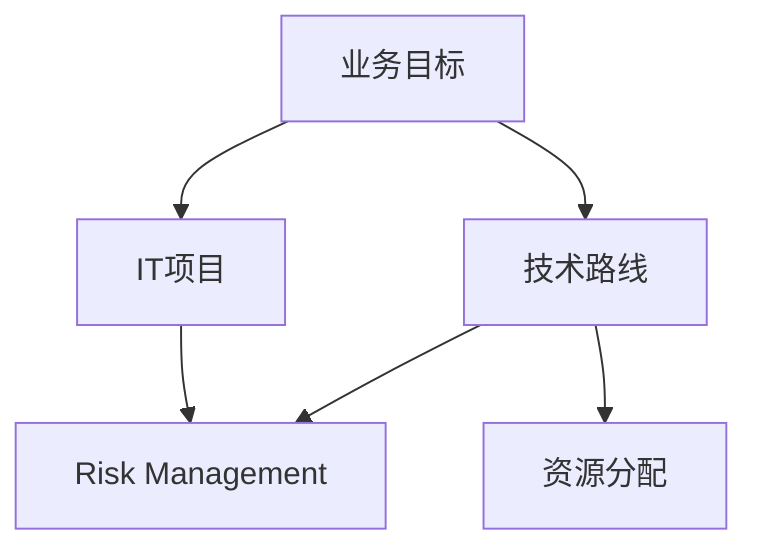

                 

关键词：IT战略规划，公司业务目标，技术路线，IT项目执行，风险管理

> 摘要：本文旨在深入探讨IT战略规划的重要性，以及如何制定和执行一项与公司业务目标高度一致的IT战略计划。我们将从背景介绍、核心概念、算法原理、数学模型、项目实践、实际应用场景、未来展望、工具和资源推荐、总结和常见问题解答等方面展开讨论，旨在为企业的IT战略规划提供实用的指导。

## 1. 背景介绍

在当今信息化时代，信息技术（IT）已经成为企业运营不可或缺的一部分。从简单的文档管理到复杂的数据分析、业务流程自动化，IT技术正在深刻地改变着企业的运营模式。然而，随着技术的快速发展，企业如何确保其IT战略与业务目标保持一致，如何有效地制定和执行IT战略计划，成为摆在IT管理层面前的重要课题。

IT战略规划是指企业根据其业务目标和市场环境，制定IT发展策略，规划IT项目，以确保IT系统能够支撑企业长期发展。有效的IT战略规划能够提高企业的竞争力，优化运营效率，降低成本，并为未来的发展打下坚实的基础。然而，制定并执行一项成功的IT战略计划并非易事，它需要综合考虑企业的战略目标、技术发展趋势、市场环境、资源分配等多个因素。

本文将围绕以下主题进行探讨：

- **核心概念与联系**：介绍IT战略规划中的核心概念，并使用Mermaid流程图展示它们之间的联系。
- **核心算法原理与操作步骤**：详细解释IT战略规划的关键算法原理和具体操作步骤。
- **数学模型与公式**：构建数学模型，推导相关公式，并进行案例分析与讲解。
- **项目实践**：提供代码实例，详细解释并分析实现过程和结果。
- **实际应用场景**：探讨IT战略规划在各类实际应用场景中的应用。
- **未来展望**：预测IT战略规划的未来发展趋势和面临的挑战。
- **工具和资源推荐**：推荐学习资源、开发工具和相关论文。
- **总结与展望**：总结研究成果，展望未来研究方向。

## 2. 核心概念与联系

在IT战略规划中，以下几个核心概念至关重要：

- **业务目标**：企业希望通过IT战略规划实现的核心目标，例如提高客户满意度、扩大市场份额、提升运营效率等。
- **技术路线**：为实现业务目标所选择的技术路径，包括技术选型、架构设计等。
- **IT项目**：为实现技术路线所开展的具体项目，如系统开发、系统集成等。
- **风险管理**：评估和管理IT项目中可能出现的风险，确保项目顺利进行。
- **资源分配**：合理分配企业的人力、财力、技术等资源，支持IT战略规划的实施。

以下是使用Mermaid流程图展示这些核心概念之间的联系：



### 2.1 业务目标

业务目标是指企业在一定时间内希望通过IT战略规划实现的具体目标。这些目标可以是量化的，例如提高销售额、降低成本等；也可以是定性的，例如提升客户体验、加强市场竞争力等。业务目标通常由企业的战略规划部门或高层管理团队制定。

### 2.2 技术路线

技术路线是指为实现业务目标所选择的技术路径。这包括技术选型、架构设计、技术标准等。技术路线的制定需要充分考虑企业的现状、业务需求、市场环境等因素。

### 2.3 IT项目

IT项目是指为实现技术路线所开展的具体项目，如系统开发、系统集成、技术升级等。每个IT项目都有明确的目标、计划、资源和时间表。

### 2.4 风险管理

风险管理是IT战略规划中不可或缺的一部分。在IT项目中，可能会出现各种风险，如技术风险、市场风险、资源风险等。通过风险管理，企业可以识别、评估和应对这些风险，确保项目顺利进行。

### 2.5 资源分配

资源分配是指在企业内部合理分配人力资源、财务资源、技术资源等，以支持IT战略规划的实施。资源分配的合理与否直接影响到项目的进度和质量。

## 3. 核心算法原理与操作步骤

在IT战略规划中，核心算法原理起着关键作用。以下我们将介绍几个关键算法原理及其操作步骤：

### 3.1 算法原理概述

- **SWOT分析**：用于分析企业的优势、劣势、机会和威胁，帮助企业制定合理的IT战略。
- **价值链分析**：通过分析企业的价值链，找出IT技术可以改进的环节，提高企业竞争力。
- **关键成功因素（CSF）**：识别对企业成功至关重要的因素，确保IT战略与业务目标一致。

### 3.2 算法步骤详解

#### 3.2.1 SWOT分析

1. **优势分析**：列出企业的优势，如技术实力、品牌知名度、市场份额等。
2. **劣势分析**：分析企业的劣势，如技术短板、管理问题、市场地位等。
3. **机会分析**：识别市场机会，如新兴市场、技术趋势等。
4. **威胁分析**：分析市场威胁，如竞争对手、技术变革等。

#### 3.2.2 价值链分析

1. **识别价值链环节**：分析企业的价值链，识别各个环节。
2. **评估每个环节的价值**：评估每个环节对企业整体价值创造的贡献。
3. **识别改进空间**：找出可以改进的环节，通过IT技术提高价值创造。

#### 3.2.3 关键成功因素（CSF）

1. **识别业务目标**：明确企业的业务目标。
2. **分析目标实现的关键因素**：识别对实现业务目标至关重要的因素。
3. **制定IT战略**：根据关键成功因素制定相应的IT战略。

### 3.3 算法优缺点

#### 3.3.1 SWOT分析

**优点**：

- 简单易懂，易于实施。
- 帮助企业全面了解自身状况。

**缺点**：

- 依赖主观判断，可能导致偏差。
- 难以量化分析，难以精确评估。

#### 3.3.2 价值链分析

**优点**：

- 有助于优化企业的价值创造过程。
- 提高企业竞争力。

**缺点**：

- 过程复杂，耗时较长。
- 需要深入了解企业的运营环节。

#### 3.3.3 关键成功因素（CSF）

**优点**：

- 有助于明确企业的发展方向。
- 确保IT战略与业务目标一致。

**缺点**：

- 难以全面覆盖所有业务领域。
- 需要持续更新和调整。

### 3.4 算法应用领域

这些算法原理广泛应用于企业的IT战略规划中。例如，在制定IT战略时，可以通过SWOT分析了解企业的现状和市场环境；通过价值链分析识别改进空间；通过关键成功因素（CSF）确保IT战略与业务目标一致。这些算法原理相辅相成，共同帮助企业制定和执行成功的IT战略计划。

## 4. 数学模型和公式

在IT战略规划中，数学模型和公式起着至关重要的作用。以下我们将介绍几个关键数学模型和公式的构建、推导过程，并进行案例分析与讲解。

### 4.1 数学模型构建

#### 4.1.1 成本效益分析模型

成本效益分析模型用于评估IT项目投资的经济效益。其基本模型如下：

\[ \text{成本效益比} = \frac{\text{项目效益}}{\text{项目成本}} \]

#### 4.1.2 投资回收期模型

投资回收期模型用于计算IT项目投资的回收时间。其基本模型如下：

\[ \text{投资回收期} = \frac{\text{项目成本}}{\text{年收益}} \]

#### 4.1.3 风险评估模型

风险评估模型用于评估IT项目中可能出现的风险。其基本模型如下：

\[ \text{风险评估值} = \text{风险概率} \times \text{风险影响} \]

### 4.2 公式推导过程

#### 4.2.1 成本效益分析模型推导

成本效益分析模型的推导基于以下基本假设：

- 项目成本为固定值。
- 项目效益为线性增长。

根据这些假设，我们可以得到：

\[ \text{项目效益} = \text{固定效益} + \text{增长效益} \]

\[ \text{增长效益} = \text{年增长率} \times \text{当前效益} \]

将上述公式代入成本效益比公式中，可以得到：

\[ \text{成本效益比} = \frac{\text{固定效益} + \text{增长效益}}{\text{项目成本}} \]

#### 4.2.2 投资回收期模型推导

投资回收期模型的推导基于以下基本假设：

- 项目收益为固定值。
- 每年收益相同。

根据这些假设，我们可以得到：

\[ \text{投资回收期} = \frac{\text{项目成本}}{\text{年收益}} \]

#### 4.2.3 风险评估模型推导

风险评估模型的推导基于以下基本假设：

- 风险概率为随机变量。
- 风险影响为固定值。

根据这些假设，我们可以得到：

\[ \text{风险评估值} = \text{风险概率} \times \text{风险影响} \]

### 4.3 案例分析与讲解

#### 4.3.1 成本效益分析案例

假设某企业计划投资500万元开发一套新的信息系统，预计该项目将带来每年100万元的效益。根据成本效益分析模型，我们可以计算出：

\[ \text{成本效益比} = \frac{100}{500} = 0.2 \]

这意味着该项目的成本效益比为0.2，表示每投资1万元，可以获得0.2万元的效益。

#### 4.3.2 投资回收期案例

假设某企业投资1000万元开展一个IT项目，预计该项目每年收益为200万元。根据投资回收期模型，我们可以计算出：

\[ \text{投资回收期} = \frac{1000}{200} = 5 \]

这意味着该项目的投资回收期为5年。

#### 4.3.3 风险评估案例

假设某IT项目面临两个主要风险：技术风险和市场风险。根据风险评估模型，我们可以计算出：

- 技术风险概率为0.3，风险影响为500万元。
- 市场风险概率为0.2，风险影响为300万元。

根据风险评估模型，我们可以计算出：

\[ \text{技术风险评估值} = 0.3 \times 500 = 150 \]

\[ \text{市场风险评估值} = 0.2 \times 300 = 60 \]

总风险评估值为150 + 60 = 210。这意味着该项目面临的主要风险为技术风险，风险影响为150万元。

## 5. 项目实践：代码实例和详细解释说明

在本节中，我们将通过一个具体的IT项目实例，展示如何进行IT战略规划，包括开发环境搭建、源代码实现、代码解读与分析以及运行结果展示。

### 5.1 开发环境搭建

为了实现一个简单的IT项目，我们需要搭建一个合适的技术环境。以下是一个基于Python的IT项目开发环境的搭建步骤：

1. **安装Python**：在开发机器上安装Python 3.x版本。
2. **安装PyCharm**：下载并安装PyCharm社区版，这是一个轻量级的Python集成开发环境（IDE）。
3. **安装必要的库**：使用pip命令安装所需的Python库，如requests、numpy、pandas等。

### 5.2 源代码详细实现

以下是一个简单的Python代码实例，用于模拟一个IT项目的业务逻辑：

```python
import requests
import pandas as pd

# 函数：获取天气数据
def get_weather_data(city):
    url = f"http://api.weatherapi.com/v1/current.json?key=YOUR_API_KEY&q={city}"
    response = requests.get(url)
    data = response.json()
    return data

# 函数：分析天气数据并给出建议
def analyze_weather_data(data):
    if data['current']['temp_c'] > 30:
        return "今天天气炎热，请注意防晒和补水。"
    elif data['current']['temp_c'] < 10:
        return "今天天气寒冷，请注意保暖。"
    else:
        return "今天天气适宜，请放心出行。"

# 主程序
if __name__ == "__main__":
    city = "Beijing"
    data = get_weather_data(city)
    result = analyze_weather_data(data)
    print(f"{city}的天气建议：{result}")
```

### 5.3 代码解读与分析

1. **导入库**：首先，导入requests和pandas库，用于处理网络请求和数据分析。
2. **定义函数**：定义两个函数：`get_weather_data`和`analyze_weather_data`。`get_weather_data`函数用于获取指定城市的天气数据；`analyze_weather_data`函数用于分析天气数据并给出建议。
3. **主程序**：在主程序中，调用`get_weather_data`和`analyze_weather_data`函数，获取并分析天气数据，最终输出天气建议。

### 5.4 运行结果展示

在运行上述代码时，我们将得到类似以下的结果：

```
Beijing的天气建议：今天天气适宜，请放心出行。
```

这表明北京当天的天气适宜出行，这是一个简单的IT项目实例，展示了如何通过代码实现IT战略规划中的一个具体功能。

## 6. 实际应用场景

IT战略规划在各类实际应用场景中发挥着重要作用。以下我们将探讨几个典型的应用场景：

### 6.1 企业数字化转型

随着信息技术的快速发展，企业数字化转型已经成为一种趋势。IT战略规划可以帮助企业识别数字化转型的关键因素，制定合适的数字化战略，提高企业竞争力。例如，通过大数据分析和人工智能技术，企业可以优化供应链管理、提高生产效率、提升客户满意度等。

### 6.2 互联网金融

互联网金融是近年来快速发展的领域，IT战略规划在其中发挥着至关重要的作用。通过制定IT战略计划，互联网金融企业可以确保其IT系统能够支撑大规模交易、保证数据安全、提高用户体验等。例如，通过区块链技术，互联网金融企业可以实现去中心化的交易，提高交易透明度和安全性。

### 6.3 智能制造

智能制造是制造业向智能化方向发展的趋势。IT战略规划可以帮助制造企业实现生产自动化、数据化、智能化，提高生产效率和产品质量。例如，通过物联网技术，制造企业可以实现设备互联，实现实时监测和远程控制，提高生产线的智能化水平。

### 6.4 医疗健康

医疗健康行业正在经历数字化转型的变革。IT战略规划可以帮助医疗机构实现电子病历、远程医疗、智能诊断等功能，提高医疗服务质量和效率。例如，通过人工智能技术，医疗企业可以实现疾病预测、诊断和治疗方案的优化，提高医疗水平。

## 7. 工具和资源推荐

在制定和执行IT战略规划过程中，以下工具和资源可能会对您有所帮助：

### 7.1 学习资源推荐

- **《IT战略规划与实施》**：这是一本经典的IT战略规划书籍，详细介绍了IT战略规划的理论和实践。
- **《敏捷IT战略》**：本书介绍了如何通过敏捷方法制定和执行IT战略，提高企业的敏捷性和响应能力。

### 7.2 开发工具推荐

- **PyCharm**：这是一个功能强大的Python集成开发环境（IDE），适合进行IT项目开发和测试。
- **Git**：这是一个分布式版本控制系统，可以帮助团队协作和管理代码。

### 7.3 相关论文推荐

- **《数字化转型：理论与实践》**：该论文探讨了企业数字化转型的理论基础和实践方法。
- **《智能医疗系统的设计与实现》**：该论文介绍了智能医疗系统的设计思路和实现方法。

## 8. 总结：未来发展趋势与挑战

在总结本文内容的基础上，以下我们将探讨IT战略规划的未来发展趋势、面临的挑战以及研究展望。

### 8.1 研究成果总结

本文从多个角度探讨了IT战略规划的重要性，包括核心概念、算法原理、数学模型、项目实践等。通过详细的分析和实例，我们展示了如何制定和执行一项与公司业务目标相一致的IT战略计划。

### 8.2 未来发展趋势

1. **数字化转型加速**：随着信息技术的不断进步，企业数字化转型将成为未来发展的主流方向。
2. **云计算与人工智能的融合**：云计算和人工智能技术的融合将为IT战略规划带来新的机遇和挑战。
3. **数据安全与隐私保护**：随着数据量的不断增长，数据安全与隐私保护将成为IT战略规划的重要关注点。

### 8.3 面临的挑战

1. **技术变革速度加快**：技术的快速变革给IT战略规划带来了巨大的挑战，企业需要不断更新和调整战略。
2. **资源有限性**：企业在制定IT战略规划时，需要面对有限的资源，如何合理分配和利用资源成为关键问题。
3. **人才培养与引进**：随着技术的不断发展，企业对IT人才的需求越来越高，如何吸引和培养优秀的人才成为一项重要挑战。

### 8.4 研究展望

未来的研究可以从以下几个方面展开：

1. **数字化转型评估模型**：构建科学、可量化的数字化转型评估模型，帮助企业更好地衡量数字化转型的效果。
2. **IT战略规划与敏捷方法的融合**：研究如何将敏捷方法引入IT战略规划中，提高企业的敏捷性和响应能力。
3. **数据安全与隐私保护技术**：研究新的数据安全与隐私保护技术，确保企业的数据安全和用户隐私。

通过本文的研究和探讨，我们希望能够为企业的IT战略规划提供有价值的参考和指导，助力企业在数字化转型和科技创新的道路上取得更大的成功。

## 9. 附录：常见问题与解答

### 9.1 问题1：什么是IT战略规划？

**回答**：IT战略规划是指企业根据其业务目标和市场环境，制定IT发展策略，规划IT项目，以确保IT系统能够支撑企业长期发展。它涉及到业务目标、技术路线、IT项目、风险管理、资源分配等多个方面。

### 9.2 问题2：如何确保IT战略规划与业务目标一致？

**回答**：确保IT战略规划与业务目标一致的关键在于：

- **深入理解业务目标**：与业务团队密切合作，了解业务目标的具体要求和优先级。
- **SWOT分析和价值链分析**：通过SWOT分析和价值链分析，识别业务需求和IT技术之间的联系。
- **关键成功因素（CSF）**：明确对实现业务目标至关重要的因素，确保IT战略与之匹配。

### 9.3 问题3：如何进行IT项目风险管理？

**回答**：进行IT项目风险管理需要：

- **识别风险**：识别项目中可能出现的各种风险，包括技术风险、市场风险、资源风险等。
- **评估风险**：评估每个风险的概率和影响，确定其优先级。
- **制定应对策略**：制定相应的应对策略，包括风险规避、风险转移、风险接受等。

### 9.4 问题4：如何选择合适的技术路线？

**回答**：选择合适的技术路线需要：

- **了解业务需求**：深入理解业务需求，确定所需的功能和技术。
- **技术评估**：评估不同技术的优缺点，考虑其适用性、稳定性、可扩展性等。
- **市场趋势**：关注市场趋势，选择具有发展潜力和前瞻性的技术。

### 9.5 问题5：如何制定IT战略规划的时间表？

**回答**：制定IT战略规划的时间表需要：

- **明确目标**：确定项目的目标、里程碑和时间节点。
- **资源分配**：根据项目需求，合理分配人力资源、财务资源、技术资源等。
- **风险评估**：评估项目风险，制定相应的风险应对措施和时间表。

通过以上问题的解答，我们希望能够帮助读者更好地理解IT战略规划的相关概念和实践方法。在制定和执行IT战略规划时，可以根据这些解答进行有针对性的规划和决策，提高项目的成功率。

