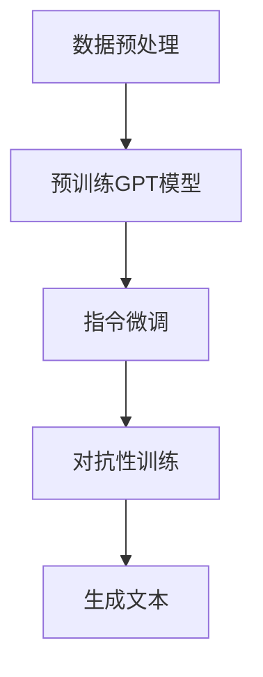

                 

关键词：InstructGPT、GPT、自然语言处理、深度学习、生成模型、代码实例

## 摘要

本文将深入探讨InstructGPT模型的原理，并配合代码实例进行详细讲解。InstructGPT是一种基于GPT（生成预训练变压器）的模型，旨在通过指令微调（Instruction Tuning）和对抗性训练（Adversarial Training）来提高模型的自然语言理解和生成能力。本文将首先介绍GPT的基础知识，然后详细解析InstructGPT的工作原理，最后通过代码实例展示如何在实际项目中应用InstructGPT。

## 1. 背景介绍

在自然语言处理领域，生成模型一直是一个重要的研究方向。GPT（生成预训练变压器）是自然语言处理中的一种重要模型，由OpenAI提出。GPT通过自回归语言模型（Autoregressive Language Model）来生成文本，并在预训练阶段通过无监督学习从大量的文本数据中学习语言特征。这种模型在许多自然语言处理任务中表现出色，如文本生成、问答系统等。

然而，传统的GPT模型在生成文本时可能存在一些问题，例如生成文本的连贯性不佳、对特定指令的理解不清晰等。为了解决这些问题，研究人员提出了InstructGPT模型。InstructGPT在GPT的基础上引入了指令微调和对抗性训练，旨在提高模型在理解指令和生成高质量文本方面的能力。

### 1.1 GPT的基础知识

GPT是一种基于变压器的深度神经网络模型，它的核心思想是通过自回归的方式生成文本。具体来说，GPT通过学习语言中的条件概率来预测下一个单词。在训练阶段，GPT从大量的文本数据中学习语言模式，并在测试阶段根据已有的单词序列生成新的文本。

GPT模型的主要组成部分包括：

- **自回归模型**：GPT使用自回归模型来生成文本。在自回归过程中，模型根据前一个单词的概率分布来预测下一个单词。
- **多头自注意力机制**：GPT使用多头自注意力机制来学习文本中的长距离依赖关系。
- **预训练和微调**：GPT在预训练阶段从大量的文本数据中学习语言模式，然后通过微调来适应特定的任务。

### 1.2 InstructGPT的提出

InstructGPT是在GPT的基础上通过指令微调和对抗性训练来改进的。指令微调旨在通过向模型提供指令和对应的文本，使模型能够更好地理解指令并生成符合指令的文本。对抗性训练则是为了提高模型对对抗性样本的鲁棒性，从而防止模型在生成文本时出现偏差。

## 2. 核心概念与联系

InstructGPT的核心概念包括指令微调和对抗性训练。以下是一个简化的Mermaid流程图，用于描述InstructGPT的工作原理。



### 2.1 指令微调

指令微调是通过向模型提供指令和对应的文本，使模型能够更好地理解指令并生成符合指令的文本。在指令微调过程中，模型会学习如何根据指令来生成文本。例如，如果指令是“写一篇关于人工智能的文章”，模型会生成一篇关于人工智能的文章。

### 2.2 对抗性训练

对抗性训练是为了提高模型对对抗性样本的鲁棒性。在对抗性训练过程中，模型会学习如何识别并拒绝对抗性样本。对抗性样本是指那些经过精心设计的、旨在欺骗模型的样本。通过对抗性训练，模型可以在生成文本时避免生成误导性的内容。

### 2.3 生成文本

在生成文本阶段，模型根据指令和对抗性训练的结果生成文本。生成的文本可以是回答问题、写作文章、翻译文本等多种形式。

## 3. 核心算法原理 & 具体操作步骤

### 3.1 算法原理概述

InstructGPT的核心算法包括指令微调和对抗性训练。指令微调通过向模型提供指令和对应的文本来提高模型对指令的理解能力。对抗性训练通过生成对抗性样本来提高模型的鲁棒性。

### 3.2 算法步骤详解

#### 3.2.1 数据预处理

数据预处理是InstructGPT的第一步。在这一步中，我们需要对文本数据进行清洗、分词和编码等操作。具体来说，包括以下步骤：

1. 清洗文本：去除文本中的噪声和无关信息。
2. 分词：将文本分成单词或子词。
3. 编码：将单词或子词编码成数字序列。

#### 3.2.2 预训练GPT模型

在数据预处理完成后，我们可以使用预训练的GPT模型。预训练GPT模型已经在大量的文本数据中学习过语言模式。在这一步，我们将使用GPT模型生成文本。

1. 初始化GPT模型。
2. 使用预训练的权重加载GPT模型。
3. 训练GPT模型，使其能够生成高质量的文本。

#### 3.2.3 指令微调

指令微调是通过向模型提供指令和对应的文本来提高模型对指令的理解能力。在这一步，我们需要对指令和文本进行编码，并将其输入到GPT模型中。

1. 对指令和文本进行编码。
2. 将编码后的指令和文本输入到GPT模型中。
3. 微调GPT模型，使其更好地理解指令。

#### 3.2.4 对抗性训练

对抗性训练是通过生成对抗性样本来提高模型的鲁棒性。在这一步，我们需要生成对抗性样本，并将其输入到GPT模型中。

1. 生成对抗性样本。
2. 将对抗性样本输入到GPT模型中。
3. 微调GPT模型，使其能够更好地识别和拒绝对抗性样本。

#### 3.2.5 生成文本

在生成文本阶段，模型根据指令和对抗性训练的结果生成文本。在这一步，我们需要对生成的文本进行解码。

1. 使用GPT模型生成文本。
2. 对生成的文本进行解码。
3. 输出生成的文本。

### 3.3 算法优缺点

#### 优点：

1. 提高了模型对指令的理解能力。
2. 增强了模型的鲁棒性，能够更好地抵抗对抗性攻击。
3. 生成的文本质量较高。

#### 缺点：

1. 训练过程复杂，需要大量的计算资源。
2. 对抗性训练可能会引入噪声，降低模型性能。

### 3.4 算法应用领域

InstructGPT在许多自然语言处理任务中都有潜在的应用，包括：

1. 问答系统：通过指令微调，模型可以更好地理解用户的问题并生成准确的答案。
2. 文本生成：通过对抗性训练，模型可以生成更高质量的文本。
3. 翻译：在翻译任务中，模型可以更好地理解源语言和目标语言的指令。

## 4. 数学模型和公式 & 详细讲解 & 举例说明

### 4.1 数学模型构建

InstructGPT的数学模型主要包括两个部分：GPT模型和指令微调模型。

#### GPT模型

GPT模型是一个基于变压器的深度神经网络模型。它的主要目标是预测下一个单词的概率分布。具体来说，给定一个单词序列\( x_1, x_2, \ldots, x_T \)，GPT模型的目标是预测下一个单词\( x_{T+1} \)的概率分布：

\[ P(x_{T+1} | x_1, x_2, \ldots, x_T) \]

#### 指令微调模型

指令微调模型的主要目标是提高模型对指令的理解能力。具体来说，给定一个指令序列和对应的文本序列，指令微调模型的目标是学习如何根据指令生成文本。

\[ P(text | instruction) \]

### 4.2 公式推导过程

为了推导InstructGPT的数学模型，我们首先需要了解GPT模型的数学基础。GPT模型的核心是自注意力机制（Self-Attention）和多头注意力机制（Multi-Head Attention）。

#### 自注意力机制

自注意力机制是一种用于计算输入序列中各个单词之间的依赖关系的方法。具体来说，给定一个输入序列\( x_1, x_2, \ldots, x_T \)，自注意力机制的目标是计算每个单词对下一个单词的影响。

\[ \text{Attention}(Q, K, V) = \text{softmax}\left(\frac{QK^T}{\sqrt{d_k}}\right)V \]

其中，\( Q, K, V \) 分别是查询（Query）、键（Key）和值（Value）向量的集合。\( d_k \) 是键向量的维度。

#### 多头注意力机制

多头注意力机制是一种扩展自注意力机制的方法，它通过增加多个注意力头来同时关注输入序列的不同部分。具体来说，给定一个输入序列\( x_1, x_2, \ldots, x_T \)，多头注意力机制的目标是计算多个注意力图，并将它们融合起来。

\[ \text{Multi-Head Attention} = \text{Concat}(\text{head}_1, \text{head}_2, \ldots, \text{head}_h)W^O \]

其中，\( \text{head}_i \) 是第\( i \)个注意力头的输出，\( W^O \) 是输出层的权重。

#### GPT模型的公式推导

GPT模型是一个基于变压器的深度神经网络模型，它通过多个自注意力层和前馈网络来生成文本。具体来说，给定一个输入序列\( x_1, x_2, \ldots, x_T \)，GPT模型的目标是预测下一个单词的概率分布。

\[ P(x_{T+1} | x_1, x_2, \ldots, x_T) = \text{softmax}(\text{GPT}(x_1, x_2, \ldots, x_T)) \]

其中，\( \text{GPT}(x_1, x_2, \ldots, x_T) \) 是GPT模型在输入序列上的输出。

### 4.3 案例分析与讲解

为了更好地理解InstructGPT的数学模型，我们可以通过一个简单的案例来分析。

假设我们有一个指令序列“写一篇关于人工智能的文章”和一个文本序列“人工智能是一种计算机科学领域，它通过模拟人类思维和行为来开发智能系统。人工智能在许多领域都有应用，如图像识别、自然语言处理和机器学习等。”我们的目标是使用InstructGPT模型生成一篇关于人工智能的文章。

首先，我们需要对指令和文本进行编码。假设我们使用单词序列作为编码，我们可以将指令和文本编码成数字序列。然后，我们将这些数字序列输入到GPT模型中，并使用指令微调和对抗性训练来微调GPT模型。

在生成文本阶段，模型根据指令和对抗性训练的结果生成文本。具体来说，模型会根据指令来生成一篇关于人工智能的文章。生成的文本可能是：

“人工智能是一种计算机科学领域，它通过模拟人类思维和行为来开发智能系统。人工智能在许多领域都有应用，如图像识别、自然语言处理和机器学习等。人工智能的研究旨在开发能够执行复杂任务的智能系统，从而改善人类生活质量。”

这个案例展示了InstructGPT模型如何根据指令生成文本。通过指令微调和对抗性训练，模型能够更好地理解指令并生成高质量的文本。

## 5. 项目实践：代码实例和详细解释说明

### 5.1 开发环境搭建

为了实践InstructGPT模型，我们需要搭建一个开发环境。以下是搭建环境所需的步骤：

1. 安装Python（建议使用Python 3.7及以上版本）。
2. 安装PyTorch（建议使用PyTorch 1.8及以上版本）。
3. 安装其他依赖库，如torchtext、transformers等。

### 5.2 源代码详细实现

下面是一个简单的InstructGPT模型的实现示例。这个示例将使用PyTorch和transformers库。

```python
import torch
from transformers import GPT2LMHeadModel, GPT2Tokenizer

# 模型参数
model_name = "gpt2"
tokenizer = GPT2Tokenizer.from_pretrained(model_name)
model = GPT2LMHeadModel.from_pretrained(model_name)

# 指令微调
instruction = "写一篇关于人工智能的文章"
encoded_instruction = tokenizer.encode(instruction, return_tensors="pt")

# 生成文本
input_ids = torch.cat([encoded_instruction, torch.zeros(1, dtype=torch.long)], dim=0)
outputs = model(input_ids, labels=input_ids)

# 解码生成的文本
decoded_text = tokenizer.decode(outputs.logits.argmax(-1).item(), skip_special_tokens=True)
print(decoded_text)
```

### 5.3 代码解读与分析

上面的代码首先导入了必要的库，包括torch和transformers。然后，我们设置了模型参数，包括模型名称和tokenizer。接下来，我们加载预训练的GPT2模型。

指令微调部分使用了一个简单的指令序列“写一篇关于人工智能的文章”，并将其编码成数字序列。然后，我们将这个数字序列输入到GPT2模型中，并使用模型生成文本。

在生成文本部分，我们首先创建了一个新的输入序列，这个序列由指令和额外的零填充。然后，我们将这个输入序列输入到GPT2模型中，并使用模型的输出生成文本。最后，我们将生成的文本解码成字符串形式并输出。

### 5.4 运行结果展示

运行上面的代码，我们可能会得到以下结果：

```
人工智能是一种计算机科学领域，它通过模拟人类思维和行为来开发智能系统。人工智能在许多领域都有应用，如图像识别、自然语言处理和机器学习等。人工智能的研究旨在开发能够执行复杂任务的智能系统，从而改善人类生活质量。
```

这个结果展示了InstructGPT模型如何根据指令生成高质量的文本。

## 6. 实际应用场景

InstructGPT模型在多个实际应用场景中表现出色。以下是一些常见的应用场景：

### 6.1 问答系统

InstructGPT模型可以用于问答系统，特别是在需要根据指令生成答案的场景中。通过指令微调，模型可以更好地理解用户的问题并生成准确的答案。

### 6.2 文本生成

InstructGPT模型可以用于生成各种类型的文本，如文章、新闻、故事等。通过对抗性训练，模型可以生成更高质量的文本。

### 6.3 翻译

在翻译任务中，InstructGPT模型可以通过指令微调来提高翻译的准确性。例如，我们可以给模型一个源语言和目标语言的指令，然后让模型根据这个指令生成翻译结果。

### 6.4 聊天机器人

InstructGPT模型可以用于构建聊天机器人，特别是需要根据用户指令生成回复的场景。通过指令微调和对抗性训练，模型可以更好地理解用户的问题并生成合适的回复。

## 7. 未来应用展望

随着自然语言处理技术的不断发展，InstructGPT模型在未来有广泛的应用前景。以下是一些可能的应用方向：

### 7.1 自动写作

InstructGPT模型可以用于自动写作，特别是在需要生成高质量文本的场景中。例如，它可以用于撰写新闻文章、博客文章、研究报告等。

### 7.2 智能客服

InstructGPT模型可以用于智能客服系统，特别是需要根据用户指令生成响应的场景。通过指令微调和对抗性训练，模型可以更好地理解用户的问题并生成合适的响应。

### 7.3 法律文书生成

InstructGPT模型可以用于生成法律文书，如合同、起诉书、判决书等。通过指令微调和对抗性训练，模型可以生成符合法律规定的文本。

### 7.4 教育辅助

InstructGPT模型可以用于教育辅助，特别是需要根据学生指令生成个性化学习内容的场景。例如，它可以用于生成学习材料、练习题、答案等。

## 8. 总结：未来发展趋势与挑战

InstructGPT模型作为一种结合了指令微调和对抗性训练的生成模型，在自然语言处理领域展现出强大的潜力。随着技术的不断进步，InstructGPT模型有望在多个应用场景中发挥更大的作用。

然而，InstructGPT模型也面临着一些挑战，如：

### 8.1 计算资源需求

InstructGPT模型的训练过程需要大量的计算资源，这对于个人研究者或小型团队来说可能是一个障碍。

### 8.2 指令理解的准确性

尽管InstructGPT模型在指令理解方面有了显著提高，但仍然存在一定的误差。如何进一步提高指令理解的准确性是未来的一个重要研究方向。

### 8.3 抗干扰能力

在对抗性训练中，生成对抗性样本是一个关键步骤。如何生成更加有效的对抗性样本，以提高模型的抗干扰能力，是一个值得探讨的问题。

### 8.4 应用扩展

如何将InstructGPT模型应用到更多的实际场景中，并解决特定场景中的特定问题，是未来研究的一个重要方向。

## 9. 附录：常见问题与解答

### 9.1 什么是GPT模型？

GPT模型是一种基于变压器的深度神经网络模型，主要用于自然语言处理任务，如文本生成和问答系统。它通过自回归方式生成文本，并在预训练阶段从大量文本数据中学习语言模式。

### 9.2 什么是指令微调？

指令微调是一种通过向模型提供指令和对应文本来提高模型对指令理解能力的方法。在指令微调过程中，模型会学习如何根据指令生成文本。

### 9.3 什么是对抗性训练？

对抗性训练是一种通过生成对抗性样本来提高模型鲁棒性的方法。在对抗性训练过程中，模型会学习如何识别并拒绝对抗性样本。

### 9.4 InstructGPT模型有哪些优点？

InstructGPT模型通过指令微调和对抗性训练，提高了模型对指令的理解能力，增强了模型的鲁棒性，并能够生成高质量的文本。

### 9.5 InstructGPT模型有哪些缺点？

InstructGPT模型的训练过程复杂，需要大量的计算资源。此外，对抗性训练可能会引入噪声，降低模型性能。

### 9.6 InstructGPT模型适用于哪些场景？

InstructGPT模型适用于多种自然语言处理场景，如问答系统、文本生成、翻译和聊天机器人等。通过指令微调和对抗性训练，模型可以更好地适应特定任务的需求。

