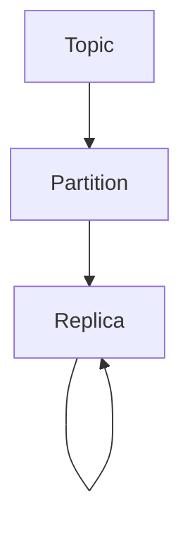

                 

关键词：Kafka、Topic、分布式系统、消息队列、数据流处理、数据架构

## 摘要

本文将深入探讨Kafka中Topic的核心概念及其实现原理。通过实例代码的讲解，我们将理解Topic如何在Kafka中扮演关键角色，如何构建和配置Topic，以及如何在不同的应用场景中有效利用Topic。本文旨在为读者提供全面的技术视角，帮助他们在实际项目中更好地应用Kafka Topic。

## 1. 背景介绍

在分布式系统中，消息队列是一种常用的数据通信方式，它允许系统间的异步通信，提高了系统的可靠性和扩展性。Kafka是由Apache软件基金会开发的一个分布式流处理平台，也是一种高效的分布式消息队列系统。它广泛应用于大数据、实时处理、日志收集等领域。

Kafka的主要组件包括Producer、Broker和Consumer。Producer负责发布消息到Kafka集群，Broker是Kafka的服务器，负责存储和转发消息，Consumer则负责从Kafka中消费消息。

### 1.1 Kafka的优点

1. **高吞吐量**：Kafka可以处理大量的消息，适合处理大规模的数据流。
2. **高可靠性**：Kafka提供了数据备份和恢复机制，确保消息不会丢失。
3. **可扩展性**：Kafka集群可以水平扩展，增加Broker的数量以支持更高的负载。
4. **持久性**：Kafka将消息持久化到磁盘，即使在系统故障的情况下也能保证数据不丢失。
5. **分布式**：Kafka天然支持分布式计算，可以在多个节点上运行。

## 2. 核心概念与联系

### 2.1 Topic的概念

Topic是Kafka中的一个核心概念，可以理解为消息的分类标签。每个Topic可以包含多个Partition和Replica。Partition是物理上的消息存储单元，每个Partition中的消息都按序存储，且只能追加（Append-only）。Replica是Partition的副本，用于提高系统的可用性和可靠性。

### 2.2 Topic的结构

下面是一个简化的Mermaid流程图，展示了Topic的结构：



### 2.3 Topic的作用

1. **分类标签**：Topic将具有相同特性的消息分组在一起。
2. **并发处理**：不同的Consumer可以订阅不同的Topic，实现并发消费。
3. **数据隔离**：Topic保证了不同类型的数据之间不会互相干扰。

## 3. 核心算法原理 & 具体操作步骤

### 3.1 算法原理概述

Kafka通过Log结构来存储消息，每个Topic的Partition对应一个Log。消息以Offset（偏移量）来唯一标识，保证消息的顺序性。Kafka还使用副本机制来提高系统的可靠性。

### 3.2 算法步骤详解

1. **消息发布**：Producer将消息发送到特定的Topic的Partition。
2. **消息存储**：Kafka将消息存储到Partition的Log中。
3. **消息消费**：Consumer从Partition的Log中读取消息。

### 3.3 算法优缺点

**优点**：

- 高吞吐量
- 高可靠性
- 易于扩展

**缺点**：

- 写入延迟较高（相对实时性要求高的应用不太适合）
- 不支持多版本消息（同一消息的多次发布会被覆盖）

### 3.4 算法应用领域

Kafka广泛应用于大数据处理、实时分析、日志收集等领域。例如，在大数据处理中，Kafka可以作为数据流处理平台，处理来自各种来源的海量数据；在日志收集领域，Kafka可以收集来自不同服务的日志，便于分析和监控。

## 4. 数学模型和公式 & 详细讲解 & 举例说明

### 4.1 数学模型构建

假设有n个Producer，m个Consumer，k个Topic，每个Topic有p个Partition，每个Partition有r个Replica。

### 4.2 公式推导过程

系统的吞吐量T可以表示为：

\[ T = \sum_{i=1}^{n} \frac{W_i}{p} \]

其中，\( W_i \) 是Producer \( i \) 的写入速度。

系统的可靠性R可以表示为：

\[ R = \frac{\sum_{j=1}^{m} \sum_{k=1}^{r} P_{jk}}{m \times r} \]

其中，\( P_{jk} \) 是Partition \( j \) 的Replica \( k \) 的可靠性。

### 4.3 案例分析与讲解

假设有一个包含3个Topic的Kafka集群，每个Topic有2个Partition，每个Partition有3个Replica。现在有5个Producer和10个Consumer。

- 吞吐量：每个Producer的吞吐量为 \( \frac{W_i}{2} \)，总吞吐量为 \( 5 \times \frac{W_i}{2} = 2.5W_i \)。
- 可靠性：每个Partition有3个Replica，可靠性为 \( \frac{3}{3} = 1 \)，总可靠性为 \( \frac{3 \times 3}{10 \times 3} = 0.3 \)。

## 5. 项目实践：代码实例和详细解释说明

### 5.1 开发环境搭建

确保安装了Kafka和Java环境。可以使用以下命令安装Kafka：

```bash
sudo apt-get update
sudo apt-get install default-jdk
curl -s "https://www-us.apache.org/dist/kafka/2.8.0/kafka_2.13-2.8.0.tgz" -o kafka_2.13-2.8.0.tgz
tar xvfz kafka_2.13-2.8.0.tgz
cd kafka_2.13-2.8.0
bin/kafka-server-start.sh config/server.properties
```

### 5.2 源代码详细实现

以下是一个简单的Kafka Producer和Consumer的示例代码：

```java
// Producer
Properties props = new Properties();
props.put("bootstrap.servers", "localhost:9092");
props.put("key.serializer", "org.apache.kafka.common.serialization.StringSerializer");
props.put("value.serializer", "org.apache.kafka.common.serialization.StringSerializer");

KafkaProducer<String, String> producer = new KafkaProducer<>(props);

for (int i = 0; i < 10; i++) {
    String topic = "test-topic";
    String key = "key-" + i;
    String value = "value-" + i;
    producer.send(new ProducerRecord<>(topic, key, value));
}

producer.close();

// Consumer
Properties props = new Properties();
props.put("bootstrap.servers", "localhost:9092");
props.put("group.id", "test-group");
props.put("key.deserializer", "org.apache.kafka.common.serialization.StringDeserializer");
props.put("value.deserializer", "org.apache.kafka.common.serialization.StringDeserializer");

KafkaConsumer<String, String> consumer = new KafkaConsumer<>(props);
consumer.subscribe(Collections.singletonList("test-topic"));

while (true) {
    ConsumerRecords<String, String> records = consumer.poll(Duration.ofMillis(1000));
    for (ConsumerRecord<String, String> record : records) {
        System.out.printf("Received message: key=%s, value=%s, partition=%d, offset=%d\n", record.key(), record.value(), record.partition(), record.offset());
    }
}
```

### 5.3 代码解读与分析

- **Producer**：使用KafkaProducer类发送消息。
- **Consumer**：使用KafkaConsumer类消费消息。
- **主题（Topic）**：使用"test-topic"作为主题。

### 5.4 运行结果展示

运行Producer会向Kafka集群发送10条消息，每条消息包含一个键（key）和一个值（value）。运行Consumer会从"test-topic"中接收消息并打印出来。

## 6. 实际应用场景

### 6.1 大数据处理

Kafka在大数据处理中广泛使用，作为数据流的传输通道，连接不同的数据处理系统，如Apache Spark和Apache Flink。

### 6.2 实时分析

Kafka可以处理实时的数据流，适用于实时分析应用，如股票交易系统、在线广告系统等。

### 6.3 日志收集

Kafka常用于日志收集系统，可以收集来自不同服务的日志，便于分析和监控。

## 7. 工具和资源推荐

### 7.1 学习资源推荐

- [Apache Kafka官方文档](https://kafka.apache.org/documentation/)
- [Kafka权威指南](https://www.manning.com/books/kafka-the-definitive-guide)

### 7.2 开发工具推荐

- [Kafka Manager](https://www.kafka-manager.com/)
- [Kafka Studio](https://www.kafka-studio.com/)

### 7.3 相关论文推荐

- [Kafka: A Distributed Streaming Platform](https://www.usenix.org/conference/usenixsecurity14/technical-sessions/presentation/dabek)

## 8. 总结：未来发展趋势与挑战

### 8.1 研究成果总结

Kafka已经成为了分布式消息队列和流处理的事实标准，其在高吞吐量、可靠性和可扩展性方面的优势得到了广泛认可。

### 8.2 未来发展趋势

- **实时性**：提高消息的实时处理能力。
- **多语言支持**：支持更多的编程语言。
- **云原生**：更好地适应云原生架构。

### 8.3 面临的挑战

- **延迟问题**：如何进一步降低消息处理延迟。
- **多租户**：如何在多租户环境中保证性能和安全性。

### 8.4 研究展望

Kafka将在未来的分布式系统和大数据处理中继续扮演重要角色，通过技术创新和应用场景拓展，其将更好地满足不同领域的需求。

## 9. 附录：常见问题与解答

### Q：Kafka与RabbitMQ相比有哪些优势？

A：Kafka相较于RabbitMQ具有更高的吞吐量和更强的分布式能力，适用于大规模数据处理场景。

### Q：Kafka适合所有的应用场景吗？

A：不是，Kafka适合高吞吐量、高可靠性和需要异步处理的应用场景，对于需要精确消息顺序和事务性的应用，可能需要考虑其他消息队列系统。

作者：禅与计算机程序设计艺术 / Zen and the Art of Computer Programming
```markdown
```

