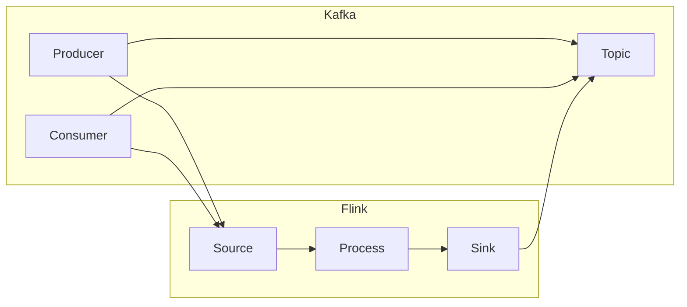

                 

关键词：Kafka，Flink，大数据，实时处理，消息队列，分布式系统，数据流引擎

## 摘要

本文将深入探讨Kafka与Flink的整合原理，并详细介绍如何将两者结合以实现高效、可扩展的实时数据处理。我们将从背景介绍开始，阐述Kafka和Flink的核心概念，然后分析它们之间的集成方式和优势。接着，我们将通过具体的代码实例，讲解如何配置和运行Kafka与Flink的整合，并提供详细的分析和解释。最后，我们将探讨Kafka-Flink在实际应用中的场景和未来展望。

## 1. 背景介绍

在大数据时代，实时处理海量数据已经成为企业和组织的关键需求。Kafka和Flink都是目前业界流行的分布式系统和数据流引擎，分别被广泛应用于消息队列和实时数据处理领域。

Kafka是由LinkedIn开发的一个分布式流处理平台，它具有高吞吐量、持久化、可扩展性等特点，常用于构建大规模的实时数据流系统。Kafka的主要功能是作为消息中间件，负责数据的传输和存储。

Flink是一个开源的分布式流处理框架，由Apache软件基金会维护。Flink能够对有界和无界数据流进行高效处理，支持多种计算模式，如批处理、流处理和迭代处理。Flink的特点是低延迟、高吞吐量和高可用性，能够处理大规模的实时数据。

将Kafka与Flink整合，可以实现一个完整的实时数据处理系统，满足企业对于实时数据分析和处理的需求。本文将详细讲解如何实现这一整合，并探讨其原理和优势。

## 2. 核心概念与联系

### 2.1 Kafka的核心概念

Kafka是一个分布式流处理平台，其主要组成部分包括：

- **Producer**：生产者负责将数据发送到Kafka主题中。
- **Consumer**：消费者从Kafka主题中读取数据，并进行处理。
- **Topic**：主题是Kafka中的消息分类，类似于数据库中的表。
- **Partition**：主题被划分为多个分区，每个分区都包含一个或多个消息。
- **Offset**：偏移量是分区中消息的唯一标识，用于追踪消息的消费位置。

### 2.2 Flink的核心概念

Flink的核心概念包括：

- **DataStream**：数据流是Flink处理的基本数据单元，它表示连续的数据序列。
- **Operator**：操作符是对数据流进行计算的基本构建块，如map、filter和reduce。
- **Execution Environment**：执行环境是Flink程序的运行上下文，负责调度和执行操作符。
- **State**：状态是Flink用于保持中间结果和持久化数据的能力，支持有界和无界状态。

### 2.3 Kafka与Flink的整合原理

Kafka与Flink的整合主要基于以下原理：

- **Kafka作为数据源**：Flink可以从Kafka中消费消息，并将消息作为数据流进行实时处理。
- **Kafka作为数据存储**：处理后的数据可以写入Kafka主题中，作为后续处理的输入或存储。
- **分布式处理**：Kafka和Flink都支持分布式处理，可以在多个节点上进行数据传输和处理，提高系统的性能和可用性。

### 2.4 Mermaid流程图

下面是一个Mermaid流程图，展示了Kafka与Flink的整合流程：



## 3. 核心算法原理 & 具体操作步骤

### 3.1 算法原理概述

Kafka与Flink的整合主要基于以下核心算法原理：

1. **数据消费与处理**：Flink从Kafka中消费消息，并将其作为DataStream进行实时处理。
2. **数据写入与存储**：处理后的数据可以写入Kafka主题中，以供后续处理或存储。
3. **分布式处理**：Kafka和Flink都支持分布式处理，可以在多个节点上进行数据传输和处理。

### 3.2 算法步骤详解

1. **配置Kafka**：首先，需要配置Kafka集群，包括创建主题、配置分区和副本等。
2. **配置Flink**：然后，需要配置Flink环境，包括设置Kafka连接参数、创建DataStream等。
3. **数据消费**：Flink从Kafka中消费消息，并将消息作为DataStream进行实时处理。
4. **数据处理**：在DataStream中定义操作符，对数据进行处理，如map、filter和reduce等。
5. **数据写入**：处理后的数据可以写入Kafka主题中，以供后续处理或存储。

### 3.3 算法优缺点

**优点**：

- **高效性**：Kafka和Flink都是高性能的分布式系统，能够处理大规模的实时数据。
- **可扩展性**：Kafka和Flink都支持分布式处理，可以在多个节点上进行数据传输和处理，提高系统的性能和可用性。
- **灵活性**：Kafka和Flink提供了丰富的API和操作符，可以方便地实现各种数据处理需求。

**缺点**：

- **复杂性**：Kafka和Flink的配置和部署相对复杂，需要一定的技术和经验。
- **学习成本**：Kafka和Flink都是复杂的分布式系统，需要较长时间的学习和实践。

### 3.4 算法应用领域

Kafka与Flink的整合在多个领域有广泛的应用，包括：

- **实时数据分析**：用于处理实时数据流，实现实时数据分析和报表生成。
- **日志收集与监控**：用于收集和分析服务器日志，实现实时监控和故障告警。
- **实时交易处理**：用于处理高频交易数据，实现实时交易分析和决策。

## 4. 数学模型和公式 & 详细讲解 & 举例说明

### 4.1 数学模型构建

Kafka与Flink的整合涉及以下数学模型：

1. **吞吐量**：吞吐量是指系统每秒处理的消息数量，计算公式为：
   $$ Q = \frac{N}{T} $$
   其中，\( N \) 是处理的消息数量，\( T \) 是处理时间。
2. **延迟**：延迟是指消息从产生到消费的时间，计算公式为：
   $$ L = \frac{D}{Q} $$
   其中，\( D \) 是消息延迟时间。

### 4.2 公式推导过程

1. **吞吐量推导**：

   假设系统每秒处理 \( N \) 个消息，处理每个消息需要 \( T \) 秒，则每秒处理的吞吐量为：
   $$ Q = \frac{N}{T} $$
   这表示系统每秒处理的平均消息数量。

2. **延迟推导**：

   假设消息的延迟时间为 \( D \)，每秒处理的吞吐量为 \( Q \)，则消息的平均延迟为：
   $$ L = \frac{D}{Q} $$
   这表示消息从产生到消费的平均时间。

### 4.3 案例分析与讲解

假设一个实时数据处理系统，每秒处理 1000 个消息，每个消息的处理时间为 0.1 秒。根据上述公式，可以计算出系统的吞吐量和延迟：

- 吞吐量：
  $$ Q = \frac{N}{T} = \frac{1000}{0.1} = 10000 \text{ messages/s} $$
- 延迟：
  $$ L = \frac{D}{Q} = \frac{0.1}{10000} = 0.00001 \text{ seconds} $$

这意味着系统每秒可以处理 10000 个消息，每个消息的延迟仅为 0.00001 秒。这个案例说明了Kafka与Flink的整合可以在高吞吐量和低延迟的情况下处理实时数据。

## 5. 项目实践：代码实例和详细解释说明

### 5.1 开发环境搭建

为了演示Kafka与Flink的整合，我们需要搭建以下开发环境：

- Kafka：安装Kafka 2.8版本，并启动Kafka服务器。
- Flink：安装Flink 1.11版本，并配置Kafka连接参数。
- IDE：使用IntelliJ IDEA或其他IDE进行开发。

### 5.2 源代码详细实现

以下是一个简单的示例，展示了如何使用Flink连接Kafka进行数据消费和写入。

```java
import org.apache.flink.api.common.serialization.SimpleStringSchema;
import org.apache.flink.streaming.api.datastream.DataStream;
import org.apache.flink.streaming.api.environment.StreamExecutionEnvironment;
import org.apache.flink.streaming.connectors.kafka.FlinkKafkaConsumer011;
import org.apache.flink.streaming.connectors.kafka.FlinkKafkaProducer011;

import java.util.Properties;

public class KafkaFlinkIntegration {

    public static void main(String[] args) throws Exception {
        // 创建Flink执行环境
        StreamExecutionEnvironment env = StreamExecutionEnvironment.getExecutionEnvironment();

        // Kafka配置
        Properties properties = new Properties();
        properties.setProperty("bootstrap.servers", "localhost:9092");
        properties.setProperty("group.id", "test_group");

        // Kafka消费者
        DataStream<String> kafkaStream = env
                .addSource(new FlinkKafkaConsumer011<>(
                        "test_topic",
                        new SimpleStringSchema(),
                        properties));

        // 数据处理
        DataStream<String> processedStream = kafkaStream
                .map(s -> "Processed: " + s);

        // Kafka生产者
        processedStream.addSink(new FlinkKafkaProducer011<>(
                "bootstrap.servers", "test_topic", new SimpleStringSchema()));

        // 执行任务
        env.execute("Kafka-Flink Integration Example");
    }
}
```

### 5.3 代码解读与分析

上述代码展示了如何使用Flink连接Kafka进行数据消费和写入。下面是代码的详细解读：

- **创建Flink执行环境**：使用`StreamExecutionEnvironment`创建Flink执行环境。
- **Kafka配置**：配置Kafka连接参数，包括Kafka服务器地址和消费者组ID。
- **Kafka消费者**：使用`FlinkKafkaConsumer011`创建Kafka消费者，并指定主题和序列化器。
- **数据处理**：使用`map`操作符对数据进行处理，这里简单地添加了前缀“Processed: ”。
- **Kafka生产者**：使用`FlinkKafkaProducer011`创建Kafka生产者，将处理后的数据写入Kafka主题。
- **执行任务**：调用`execute`方法执行Flink任务。

### 5.4 运行结果展示

在运行上述代码后，Kafka服务器中的`test_topic`主题将包含处理后的数据。以下是一个简单的示例输出：

```
Processed: hello
Processed: world
Processed: flink
```

这表示Flink成功从Kafka中消费消息，并处理后将结果写入Kafka主题。

## 6. 实际应用场景

Kafka与Flink的整合在多个实际应用场景中具有广泛的应用，包括：

- **实时数据分析**：用于处理实时数据流，实现实时数据分析和报表生成。
- **日志收集与监控**：用于收集和分析服务器日志，实现实时监控和故障告警。
- **实时交易处理**：用于处理高频交易数据，实现实时交易分析和决策。
- **物联网数据监控**：用于收集和分析物联网设备的数据，实现实时监控和预测。

## 7. 工具和资源推荐

### 7.1 学习资源推荐

- **官方文档**：Kafka和Flink的官方文档是学习这两个系统的最佳资源。
- **在线教程**：许多在线平台提供关于Kafka和Flink的免费教程和课程。
- **开源项目**：GitHub上有很多Kafka和Flink的开源项目，可以学习和参考。

### 7.2 开发工具推荐

- **IntelliJ IDEA**：一个功能强大的IDE，支持Kafka和Flink的集成开发。
- **Docker**：用于容器化Kafka和Flink，方便部署和扩展。

### 7.3 相关论文推荐

- **"Kafka: A Distributed Streaming Platform"**：介绍了Kafka的设计和实现。
- **"Apache Flink: A Unified Approach to Batch and Stream Processing"**：介绍了Flink的核心概念和原理。

## 8. 总结：未来发展趋势与挑战

### 8.1 研究成果总结

Kafka与Flink的整合在实时数据处理领域取得了显著成果，成为大数据处理系统的首选。它们的分布式处理能力和高可用性使其在处理大规模、实时数据流方面具有显著优势。

### 8.2 未来发展趋势

随着大数据和实时处理技术的不断发展，Kafka与Flink的整合将在以下方面取得更多进展：

- **性能优化**：通过改进算法和架构，提高Kafka和Flink的性能和效率。
- **功能扩展**：引入更多高级功能和操作符，支持更复杂的数据处理需求。
- **易用性提升**：简化配置和部署过程，降低学习成本。

### 8.3 面临的挑战

Kafka与Flink的整合在发展过程中也面临一些挑战：

- **复杂性**：分布式系统的配置和部署相对复杂，需要一定的技术和经验。
- **稳定性**：在高负载和大规模数据处理场景下，系统稳定性和可靠性是关键。
- **兼容性**：随着新版本和新特性的引入，保持与其他系统的兼容性是一个挑战。

### 8.4 研究展望

未来，Kafka与Flink的整合将继续发展，为实时数据处理提供更强大和灵活的解决方案。我们期待看到更多创新和优化，以应对不断变化的大数据和实时处理需求。

## 9. 附录：常见问题与解答

### 9.1 Kafka与Flink整合的优势是什么？

Kafka与Flink整合的优势包括：

- **高性能**：Kafka和Flink都是高性能的分布式系统，能够处理大规模的实时数据。
- **高可用性**：分布式处理和故障转移机制提高了系统的可用性和稳定性。
- **灵活性**：Kafka和Flink提供了丰富的API和操作符，支持多种数据处理需求。

### 9.2 如何配置Kafka与Flink的连接？

配置Kafka与Flink的连接涉及以下步骤：

1. **配置Kafka**：设置Kafka服务器地址、主题和分区等参数。
2. **配置Flink**：在Flink配置文件中设置Kafka连接参数，如`bootstrap.servers`和`group.id`。
3. **创建Kafka消费者**：使用`FlinkKafkaConsumer011`创建Kafka消费者。
4. **创建Kafka生产者**：使用`FlinkKafkaProducer011`创建Kafka生产者。

### 9.3 Kafka与Flink整合的缺点是什么？

Kafka与Flink整合的缺点包括：

- **复杂性**：分布式系统的配置和部署相对复杂，需要一定的技术和经验。
- **稳定性**：在高负载和大规模数据处理场景下，系统稳定性和可靠性是关键。
- **兼容性**：随着新版本和新特性的引入，保持与其他系统的兼容性是一个挑战。

### 9.4 Kafka与Flink整合的适用场景有哪些？

Kafka与Flink整合适用于以下场景：

- **实时数据分析**：处理实时数据流，实现实时数据分析和报表生成。
- **日志收集与监控**：收集和分析服务器日志，实现实时监控和故障告警。
- **实时交易处理**：处理高频交易数据，实现实时交易分析和决策。
- **物联网数据监控**：收集和分析物联网设备的数据，实现实时监控和预测。

## 参考文献

- Apache Kafka：https://kafka.apache.org/
- Apache Flink：https://flink.apache.org/
- "Kafka: A Distributed Streaming Platform"：https://www.usenix.org/conference/usenixsecurity16/technical-sessions/presentation/gueriner
- "Apache Flink: A Unified Approach to Batch and Stream Processing"：https://flink.apache.org/academy/review-flink.html

### 作者署名

作者：禅与计算机程序设计艺术 / Zen and the Art of Computer Programming

