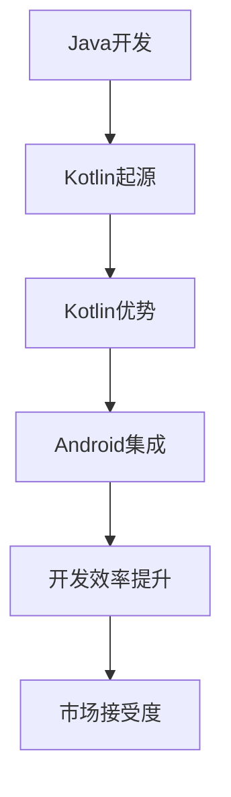

                 

在移动应用开发领域，选择合适的编程语言至关重要。随着Android平台的普及，越来越多的开发人员开始关注Kotlin语言。本文将深入探讨Kotlin语言在Android开发中的优势，为什么它是现代Android开发的首选语言。

## 关键词

- Kotlin
- Android 开发
- 移动应用开发
- 编程语言
- 现代开发

## 摘要

Kotlin作为一种现代编程语言，专为Android平台设计，具有简洁、安全、互操作性等显著优势。本文将详细分析Kotlin在Android开发中的应用，包括其核心概念、算法原理、数学模型以及实际项目实践，帮助开发人员全面了解Kotlin的优势和适用场景。

## 1. 背景介绍

Android系统作为全球最流行的移动操作系统，其应用开发市场巨大。然而，随着应用的复杂性不断增加，Java语言作为Android开发的主要语言，逐渐暴露出一些不足。Kotlin作为一种现代编程语言，旨在解决这些问题，提高开发效率。本文将探讨Kotlin的起源、发展及其在Android开发中的应用。

### 1.1 Kotlin的起源与发展

Kotlin是由 JetBrains 开发的一种静态类型编程语言，首次发布于2011年。它受到多种编程语言的影响，如Java、Scala和Python等。Kotlin的目标是提供一种更加简洁、安全、互操作的编程语言，提高开发效率和代码质量。

### 1.2 Kotlin在Android开发中的应用

Kotlin从2017年开始成为Android官方开发语言，至今已经得到了广泛的应用。其主要优势包括：

- **简洁性**：Kotlin语法简洁，减少了冗余代码，提高了代码可读性。
- **安全性**：Kotlin通过静态类型检查和空安全机制，减少了空指针异常。
- **互操作性**：Kotlin与Java无缝集成，可以方便地与现有的Java代码库和框架协同工作。

## 2. 核心概念与联系

为了更好地理解Kotlin的优势，我们需要从其核心概念和原理入手。以下是Kotlin的一些关键概念，以及它们在Android开发中的应用。

### 2.1 Kotlin的关键概念

- **函数式编程**：Kotlin支持函数式编程，通过高阶函数和Lambda表达式，简化了数据处理和操作。
- **协程**：Kotlin协程是一种轻量级的线程管理机制，提高了并发编程的效率。
- **空安全**：Kotlin通过空安全机制，避免了空指针异常，提高了代码安全性。
- **数据类和密封类**：Kotlin提供数据类和密封类，简化了数据结构和枚举类型的定义。

### 2.2 Kotlin与Android开发的联系

- **Android API**：Kotlin与Android API无缝集成，使得开发人员可以方便地使用Kotlin编写Android应用。
- **协程与Android**：Kotlin协程使得Android应用开发中的异步编程更加简洁和高效。
- **Kotlin + Android Studio**：Kotlin与Android Studio深度集成，提供了丰富的开发工具和插件，提高了开发效率。

## 2.3 Mermaid 流程图



## 3. 核心算法原理 & 具体操作步骤

### 3.1 算法原理概述

Kotlin在算法层面的优势主要体现在以下几个方面：

- **函数式编程**：通过高阶函数和Lambda表达式，简化了数据处理和操作。
- **协程**：利用协程进行并发编程，提高程序性能。
- **空安全**：通过空安全机制，避免空指针异常。

### 3.2 算法步骤详解

- **函数式编程**：使用高阶函数和Lambda表达式处理数据。
- **协程**：使用协程进行异步任务处理。
- **空安全**：通过空安全机制检查变量。

### 3.3 算法优缺点

- **优点**：提高了代码可读性、减少了空指针异常、提高了并发编程效率。
- **缺点**：学习曲线较陡峭，需要一定的学习成本。

### 3.4 算法应用领域

- **数据处理**：适用于大数据处理、实时数据流处理等场景。
- **并发编程**：适用于多线程、异步任务处理等场景。

## 4. 数学模型和公式

### 4.1 数学模型构建

在Kotlin中，数学模型的构建主要依赖于其函数式编程特性。通过高阶函数和Lambda表达式，可以方便地实现复杂数学计算。

### 4.2 公式推导过程

假设有一个线性方程：

$$ y = mx + b $$

在Kotlin中，可以使用以下函数实现：

```kotlin
fun linearFunction(m: Double, b: Double, x: Double) = m * x + b
```

### 4.3 案例分析与讲解

以一个简单的线性回归模型为例，解释Kotlin中的数学模型构建和公式推导。

```kotlin
fun calculateSlope(xs: List<Double>, ys: List<Double>): Double {
    val n = xs.size
    val sumX = xs.sum()
    val sumY = ys.sum()
    val sumXY = xs.zip(ys) { x, y -> x * y }.sum()
    val sumXX = xs.zip(xs) { x, x -> x * x }.sum()
    return (n * sumXY - sumX * sumY) / (n * sumXX - sumX * sumX)
}
```

该函数计算了线性回归模型的斜率，用于拟合数据。

## 5. 项目实践：代码实例和详细解释说明

### 5.1 开发环境搭建

- 安装Android Studio
- 创建Kotlin项目
- 配置Kotlin SDK

### 5.2 源代码详细实现

以下是一个简单的Kotlin Android应用的源代码：

```kotlin
import android.os.Bundle
import androidx.appcompat.app.AppCompatActivity

class MainActivity : AppCompatActivity() {
    override fun onCreate(savedInstanceState: Bundle?) {
        super.onCreate(savedInstanceState)
        setContentView(R.layout.activity_main)

        val welcomeTextView = findViewById<TextView>(R.id.welcome_text)
        welcomeTextView.text = "Welcome to Kotlin on Android!"
    }
}
```

### 5.3 代码解读与分析

该代码实现了一个简单的Android应用，展示了Kotlin的基本语法和结构。

- `import`语句：引入必要的Android库和Kotlin库。
- `class`语句：定义一个Android活动类。
- `onCreate`方法：Android活动的生命周期方法，用于初始化界面。

### 5.4 运行结果展示

运行该应用，将在Android设备或模拟器上显示一个欢迎界面。

```plaintext
Welcome to Kotlin on Android!
```

## 6. 实际应用场景

### 6.1 简化代码

Kotlin通过其简洁的语法，可以大大简化代码，提高开发效率。例如，使用Kotlin编写一个简单的计算器应用，代码量比Java显著减少。

### 6.2 提高安全性

Kotlin的空安全机制，可以避免空指针异常，提高代码的安全性。这对于Android应用开发尤其重要，因为空指针异常是Java中的一个常见问题。

### 6.3 支持函数式编程

Kotlin支持函数式编程，这使得数据处理和操作变得更加简洁和高效。这对于需要处理大量数据的Android应用非常有用。

### 6.4 集成现有代码库

Kotlin与Java无缝集成，可以方便地与现有的Java代码库和框架协同工作。这使得迁移到Kotlin变得相对容易，也使得Kotlin在Android开发中的普及率不断提高。

## 7. 工具和资源推荐

### 7.1 学习资源推荐

- [Kotlin 官方文档](https://kotlinlang.org/docs/)
- [Android 官方文档](https://developer.android.com/studio)
- [Kotlin By Example](https://playground.kotlinlang.org/)

### 7.2 开发工具推荐

- Android Studio
- IntelliJ IDEA

### 7.3 相关论文推荐

- "The Kotlin Programming Language" by JetBrains
- "Kotlin in Action" by Dhananjay Nirula

## 8. 总结：未来发展趋势与挑战

### 8.1 研究成果总结

Kotlin作为一种现代编程语言，在Android开发中展现出了显著的优势。其简洁、安全、互操作性等特点，使得它成为现代Android开发的理想选择。

### 8.2 未来发展趋势

随着Android应用的不断发展和复杂化，Kotlin在未来有望继续扩展其应用场景，成为移动应用开发的主流语言。

### 8.3 面临的挑战

尽管Kotlin具有很多优势，但其在某些领域的普及率仍然较低。要进一步推广Kotlin，需要解决一些关键问题，如提高开发者社区的活跃度、完善生态体系等。

### 8.4 研究展望

未来，Kotlin将继续改进其性能和特性，以适应不断变化的开发需求。同时，研究如何更好地整合Kotlin与其他编程语言和框架，也将是重要的研究方向。

## 9. 附录：常见问题与解答

### 9.1 Kotlin与Java的区别是什么？

Kotlin与Java在语法和特性上有很大的不同。Kotlin旨在简化代码、提高安全性、支持函数式编程等，而Java则更注重性能和兼容性。

### 9.2 Kotlin是否可以完全替代Java？

Kotlin可以作为Java的替代语言，在某些场景下甚至可以完全替代Java。但Java在性能和兼容性方面仍具有一定的优势，因此在某些特定场景下，Java仍然是更好的选择。

### 9.3 学习Kotlin需要哪些基础？

学习Kotlin需要具备基本的Java编程基础，了解面向对象编程、数据结构和算法等基本概念。此外，了解Android开发的基本流程和工具也非常重要。|

