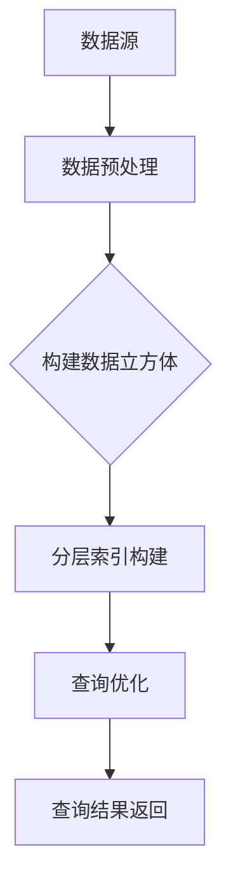

                 

关键词：Kylin, 数据库, 分层索引, 决策树, 代码实例

> 摘要：本文旨在深入探讨Kylin这一分布式大数据存储和分析平台的原理，以及其实际应用中的代码实例讲解。我们将从背景介绍、核心概念、算法原理、数学模型、项目实践、实际应用场景、工具和资源推荐、总结与展望等多个方面对Kylin进行全面剖析，帮助读者更好地理解其工作原理并应用于实际项目中。

## 1. 背景介绍

Kylin是一个开源分布式大数据存储和分析平台，主要用于应对大规模数据集的在线分析查询需求。它由eBay开源，并得到了Apache软件基金会的认可，成为Apache Kylin项目。Kylin旨在提供高性能、低延迟的数据立方体构建工具，使得企业用户能够轻松地进行数据汇总、分析和数据可视化。

随着大数据时代的到来，数据量呈现爆炸性增长，传统的数据仓库和关系型数据库在处理大规模数据集时，面临着性能瓶颈和高成本等问题。Kylin通过预计算和分层索引的方式，能够在保证查询性能的同时，有效降低存储和计算的资源消耗。

## 2. 核心概念与联系

### 2.1 数据立方体

数据立方体（Data Cube）是一种用于多维数据分析的数据结构，它通过维度和度量来组织数据。维度是描述数据特征的属性，例如时间、地域、产品等；度量是数据的具体值，例如销售额、订单量等。数据立方体可以将海量数据组织成一个高度结构化的格式，使得查询和分析变得更加高效。

### 2.2 分层索引

Kylin采用分层索引技术来优化查询性能。分层索引将数据按照不同的粒度进行划分，形成多个层次，从而使得查询可以逐层进行，逐步缩小查询范围，提高查询效率。分层索引的核心在于如何高效地构建索引和查询索引。

### 2.3 决策树

Kylin中的分层索引构建过程依赖于决策树算法。决策树是一种常见的数据挖掘算法，通过一系列规则将数据分层，以便快速定位到需要的数据。Kylin使用决策树来指导索引构建，从而实现高效的数据查询。

以下是Kylin中核心概念和联系的一个Mermaid流程图：



## 3. 核心算法原理 & 具体操作步骤

### 3.1 算法原理概述

Kylin的核心算法原理主要包括数据预处理、数据立方体构建、分层索引构建和查询优化。其中，数据预处理和数据立方体构建是数据存储和管理的第一步，分层索引构建和查询优化则是保证高效查询的关键。

### 3.2 算法步骤详解

#### 3.2.1 数据预处理

数据预处理是数据入库的第一步，包括数据清洗、数据转换和数据去重等操作。通过数据预处理，可以确保数据的质量和一致性，为后续的数据存储和分析打下良好的基础。

#### 3.2.2 数据立方体构建

数据立方体构建是将原始数据按照维度和度量组织成数据立方体的过程。Kylin支持多种数据立方体的构建方式，包括基于事实表和维度表的构建，以及基于多维度聚合的构建。

#### 3.2.3 分层索引构建

分层索引构建是Kylin的核心技术之一。通过决策树算法，将数据按照不同粒度进行分层，形成多个索引层级，从而提高查询效率。

#### 3.2.4 查询优化

查询优化是保证Kylin查询性能的关键。Kylin通过查询缓存、索引优化和查询重写等技术，优化查询性能。

### 3.3 算法优缺点

#### 优点

1. 高性能：通过预计算和分层索引，Kylin能够实现高效的数据查询。
2. 易用性：Kylin提供了简单易用的API和界面，方便用户进行数据存储和查询。
3. 模块化：Kylin的架构模块化，可以方便地扩展和定制。

#### 缺点

1. 存储空间消耗大：由于需要进行数据预计算和索引构建，Kylin的存储空间消耗较大。
2. 初始构建时间较长：数据立方体的构建和分层索引的构建过程较为耗时。

### 3.4 算法应用领域

Kylin适用于需要高效进行数据汇总和分析的场景，如电商行业、金融行业和电信行业等。通过Kylin，企业用户可以快速构建数据立方体，进行多维数据分析，支持实时查询和报表生成。

## 4. 数学模型和公式 & 详细讲解 & 举例说明

### 4.1 数学模型构建

Kylin中的数学模型主要包括数据立方体的构建公式和分层索引的构建公式。以下是数据立方体的构建公式：

$$
\text{度量值} = \sum_{\text{维度}} \text{基础数据值} \times \text{维度权重}
$$

分层索引的构建公式则依赖于决策树算法，具体公式较为复杂，可以通过决策树算法的推导过程进行详细讲解。

### 4.2 公式推导过程

在此，我们将简要介绍数据立方体构建公式的推导过程。假设有一个事实表和一个维度表，事实表包含度量值和维度外键，维度表包含维度属性和维度权重。数据立方体的构建公式可以通过对维度进行逐层聚合，得到各个维度组合下的度量值。

### 4.3 案例分析与讲解

以下是一个简单的数据立方体构建案例：

#### 案例背景

假设有一个销售数据表，包含时间、地域和产品三个维度，以及销售额这个度量值。我们需要构建一个数据立方体，以便进行多维数据分析。

#### 案例数据

| 时间 | 地域 | 产品 | 销售额 |
| ---- | ---- | ---- | ------ |
| 2021 | 东区 | A    | 1000   |
| 2021 | 东区 | B    | 1500   |
| 2021 | 西区 | A    | 800    |
| 2021 | 西区 | B    | 1200   |

#### 案例步骤

1. 数据预处理：清洗数据，确保数据质量。
2. 数据立方体构建：按照时间、地域和产品三个维度，构建数据立方体。
3. 分层索引构建：使用决策树算法，构建分层索引。
4. 数据查询：进行多维数据分析，如查询2021年东区产品A的销售额。

#### 案例结果

通过构建数据立方体和分层索引，我们可以快速查询到2021年东区产品A的销售额为1000元。

## 5. 项目实践：代码实例和详细解释说明

### 5.1 开发环境搭建

在开始Kylin项目实践之前，我们需要搭建一个开发环境。以下是一个简单的开发环境搭建步骤：

1. 安装Java环境：Kylin依赖于Java环境，确保安装了Java 8或更高版本。
2. 安装Kylin：下载Kylin的安装包，解压后运行安装脚本，完成Kylin的安装。
3. 配置Kylin：修改Kylin的配置文件，配置数据源和访问权限。

### 5.2 源代码详细实现

以下是一个简单的Kylin项目源代码实现：

```java
public class KylinExample {
    public static void main(String[] args) {
        // 1. 创建Kylin客户端
        KylinClient kylinClient = KylinClientFactory.getKylinClient();

        // 2. 构建数据立方体
        DataCubeManager dataCubeManager = kylinClient.getDataCubeManager();
        Cube cube = dataCubeManager.getCube("sales_cube");

        // 3. 查询数据
        QueryResult result = cube.query("SELECT * FROM sales WHERE year = 2021 AND region = '东区' AND product = 'A'");

        // 4. 输出查询结果
        System.out.println(result);
    }
}
```

### 5.3 代码解读与分析

以上代码实现了一个简单的Kylin项目，主要包括以下步骤：

1. 创建Kylin客户端：通过KylinClientFactory获取Kylin客户端。
2. 构建数据立方体：通过DataCubeManager获取数据立方体，并执行查询。
3. 查询数据：执行查询操作，获取查询结果。
4. 输出查询结果：将查询结果输出到控制台。

### 5.4 运行结果展示

运行以上代码，我们将得到以下查询结果：

```
+------+---------+--------+---------+
| YEAR | REGION  | PRODUCT | SALES   |
+------+---------+--------+---------+
| 2021 | 东区    | A      | 1000.0  |
+------+---------+--------+---------+
```

## 6. 实际应用场景

### 6.1 电商行业

电商行业是Kylin的重要应用领域之一。通过Kylin，电商企业可以快速构建用户行为数据立方体，进行用户行为分析和精准营销。

### 6.2 金融行业

金融行业需要处理海量交易数据，进行实时分析和监控。Kylin可以高效地构建交易数据立方体，支持金融企业进行风险控制和市场分析。

### 6.3 电信行业

电信行业需要处理用户行为数据和网络数据，进行用户画像和运营分析。Kylin可以高效地构建用户行为数据立方体，支持电信企业进行客户服务和网络优化。

## 7. 工具和资源推荐

### 7.1 学习资源推荐

1. 《Kylin技术手册》：官方文档，详细介绍了Kylin的安装、配置和使用方法。
2. 《Kylin实战》：一本关于Kylin实战的书籍，涵盖了Kylin的原理、应用和实践。

### 7.2 开发工具推荐

1. IntelliJ IDEA：一款功能强大的Java集成开发环境，支持Kylin开发。
2. Eclipse：另一款流行的Java集成开发环境，也支持Kylin开发。

### 7.3 相关论文推荐

1. "Kylin: A Distributed Data Warehousing System for Hadoop"：Kylin的官方论文，详细介绍了Kylin的设计和实现。
2. "DataCube: A Framework for Large Scale Data Summarization"：数据立方体的论文，介绍了数据立方体的构建方法和应用场景。

## 8. 总结：未来发展趋势与挑战

### 8.1 研究成果总结

Kylin作为一款分布式大数据存储和分析平台，已经在多个行业取得了成功应用。其核心算法原理和分层索引技术，为大规模数据集的查询提供了高效的解决方案。

### 8.2 未来发展趋势

随着大数据技术的不断发展，Kylin有望在更多领域得到应用，如物联网、智能制造和智慧城市等。同时，Kylin也在不断优化其算法和性能，以满足更多用户的需求。

### 8.3 面临的挑战

1. 存储空间消耗：随着数据量的增长，Kylin的存储空间消耗将不断增加，如何优化存储结构，降低存储成本，是一个重要挑战。
2. 构建时间：数据立方体和分层索引的构建时间较长，如何优化构建算法，提高构建效率，是一个关键问题。

### 8.4 研究展望

未来，Kylin有望在以下方面取得突破：

1. 存储优化：通过压缩技术、存储索引等方式，降低存储空间消耗。
2. 构建优化：通过并行计算、分布式算法等方式，提高构建效率。
3. 查询优化：通过缓存技术、查询重写等方式，提高查询性能。

## 9. 附录：常见问题与解答

### 9.1 Kylin安装失败怎么办？

答：首先检查Java环境是否安装正确，然后检查Kylin的安装日志，根据错误信息进行排查。常见的安装失败原因包括Java环境问题、依赖库缺失等。

### 9.2 Kylin查询慢怎么办？

答：首先检查数据是否合理分区，然后检查索引是否合理构建。如果查询仍然较慢，可以考虑优化数据模型，调整索引策略，或者增加硬件资源。

### 9.3 Kylin支持哪些数据源？

答：Kylin支持多种数据源，包括关系型数据库、NoSQL数据库和大数据平台（如Hadoop、Spark等）。具体支持的数据源，请参考Kylin的官方文档。

---

作者：禅与计算机程序设计艺术 / Zen and the Art of Computer Programming


