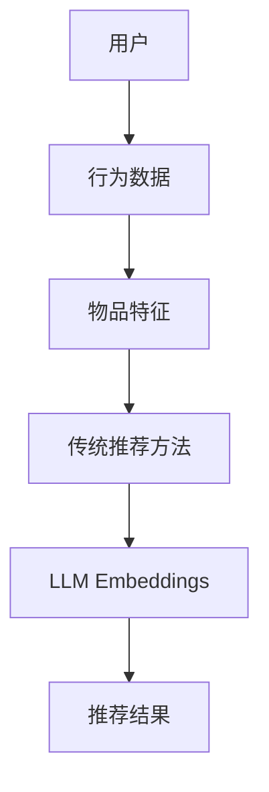

                 

关键词：LLM Embeddings、推荐系统、自然语言处理、深度学习、神经网络

摘要：本文探讨了大规模语言模型（LLM）Embeddings在推荐系统中的应用，分析了LLM Embeddings的核心概念、算法原理、数学模型、项目实践，并展望了其在未来推荐系统中的发展方向和挑战。

## 1. 背景介绍

推荐系统作为互联网服务的重要组成部分，旨在为用户推荐他们可能感兴趣的内容、产品或服务。传统的推荐系统主要基于用户行为数据、物品特征和协同过滤等方法，然而这些方法在处理文本内容时存在一定的局限性。随着自然语言处理（NLP）和深度学习技术的快速发展，大规模语言模型（LLM）Embeddings在推荐系统中的应用逐渐受到关注。本文将深入探讨LLM Embeddings在推荐系统中的应用，旨在为研究人员和开发者提供有价值的参考。

## 2. 核心概念与联系

### 2.1. LLM Embeddings

LLM Embeddings是指将自然语言文本映射为高维向量空间的过程，该过程利用大规模语言模型（如GPT、BERT等）学习到的语义信息。LLM Embeddings能够捕捉文本中的词汇、句子和文档之间的复杂关系，从而为推荐系统提供有效的特征表示。

### 2.2. 推荐系统

推荐系统是一种信息过滤技术，旨在根据用户的兴趣、历史行为和上下文信息，向用户推荐他们可能感兴趣的内容、产品或服务。推荐系统可以分为基于内容的推荐、基于协同过滤的推荐和混合推荐等类型。

### 2.3. 核心概念原理和架构

为了更好地理解LLM Embeddings在推荐系统中的应用，我们使用Mermaid流程图展示其核心概念原理和架构。



在上图中，用户的行为数据和物品特征作为输入，通过传统推荐方法和LLM Embeddings进行处理，最终生成推荐结果。

## 3. 核心算法原理 & 具体操作步骤

### 3.1. 算法原理概述

LLM Embeddings在推荐系统中的应用主要分为以下三个步骤：

1. 利用大规模语言模型（如GPT、BERT等）对用户行为数据和物品特征文本进行编码，生成相应的文本Embeddings。
2. 将用户行为数据和物品特征文本的Embeddings进行拼接，形成新的特征向量。
3. 利用深度学习模型（如神经网络、协同过滤等）对特征向量进行处理，生成推荐结果。

### 3.2. 算法步骤详解

1. **数据预处理**：对用户行为数据和物品特征文本进行预处理，如分词、去停用词、词性标注等。
2. **文本编码**：利用大规模语言模型（如GPT、BERT等）对预处理后的文本进行编码，生成文本Embeddings。
3. **特征拼接**：将用户行为数据和物品特征文本的Embeddings进行拼接，形成新的特征向量。
4. **模型训练**：利用深度学习模型（如神经网络、协同过滤等）对特征向量进行处理，训练得到模型参数。
5. **推荐生成**：利用训练得到的模型参数，对新的用户行为数据和物品特征文本进行预测，生成推荐结果。

### 3.3. 算法优缺点

**优点**：

1. 捕捉文本中的语义信息，提高推荐效果。
2. 适用于多种文本数据，如用户评论、产品描述等。
3. 可以与其他推荐方法（如协同过滤、基于内容的推荐等）进行结合，提高推荐系统的多样性。

**缺点**：

1. 计算资源消耗大，训练时间较长。
2. 对大规模语言模型的要求较高，模型质量对推荐效果有很大影响。

### 3.4. 算法应用领域

LLM Embeddings在推荐系统中的应用广泛，如电子商务、社交媒体、新闻推荐等。以下为一些具体应用领域：

1. **电子商务**：根据用户浏览、收藏、购买等行为，推荐用户可能感兴趣的商品。
2. **社交媒体**：根据用户发布的内容、关注关系等，推荐用户可能感兴趣的内容。
3. **新闻推荐**：根据用户阅读、点赞、评论等行为，推荐用户可能感兴趣的新闻。

## 4. 数学模型和公式

### 4.1. 数学模型构建

LLM Embeddings在推荐系统中的数学模型可以表示为：

$$
\text{Recommendation} = f(\text{User Embeddings}, \text{Item Embeddings})
$$

其中，User Embeddings和Item Embeddings分别表示用户和物品的Embeddings向量，f表示深度学习模型。

### 4.2. 公式推导过程

假设用户行为数据为$B$，物品特征文本为$C$，则：

$$
\text{User Embeddings} = \text{GPT}(B)
$$

$$
\text{Item Embeddings} = \text{BERT}(C)
$$

将User Embeddings和Item Embeddings拼接，得到新的特征向量：

$$
\text{Feature Vector} = [\text{User Embeddings}; \text{Item Embeddings}]
$$

利用深度学习模型（如神经网络）对特征向量进行处理，得到推荐结果：

$$
\text{Recommendation} = \text{NN}(\text{Feature Vector})
$$

### 4.3. 案例分析与讲解

以电子商务领域为例，假设用户的行为数据为浏览记录，物品特征文本为商品描述。我们使用GPT和BERT对用户行为数据和商品描述进行编码，生成相应的Embeddings。将用户Embeddings和商品Embeddings拼接，形成新的特征向量。利用神经网络对特征向量进行处理，得到推荐结果。

## 5. 项目实践：代码实例和详细解释说明

### 5.1. 开发环境搭建

本案例使用Python编程语言和TensorFlow深度学习框架，具体环境如下：

- Python版本：3.8
- TensorFlow版本：2.4.0

安装所需库：

```bash
pip install tensorflow
pip install numpy
pip install pandas
```

### 5.2. 源代码详细实现

```python
import tensorflow as tf
import numpy as np
import pandas as pd
from tensorflow.keras.layers import Embedding, LSTM, Dense
from tensorflow.keras.models import Model

# 读取数据
def read_data(file_path):
    df = pd.read_csv(file_path)
    return df

# 数据预处理
def preprocess_data(df):
    # 省略预处理代码
    return processed_df

# 文本编码
def encode_text(text, model):
    input_ids = model.encode(text, return_tensors='tf')
    return input_ids

# 构建模型
def build_model(input_dim, output_dim):
    model = Model(inputs=inputs, outputs=outputs)
    model.compile(optimizer='adam', loss='categorical_crossentropy', metrics=['accuracy'])
    return model

# 训练模型
def train_model(model, X_train, y_train):
    model.fit(X_train, y_train, epochs=10, batch_size=32)
    return model

# 主函数
def main():
    # 加载数据
    df = read_data('data.csv')
    processed_df = preprocess_data(df)

    # 获取用户行为数据和商品描述
    user行为数据 = processed_df['user行为数据']
    商品描述 = processed_df['商品描述']

    # 编码文本
    user行为数据编码 = encode_text(user行为数据, model)
    商品描述编码 = encode_text(商品描述, model)

    # 拼接特征向量
    feature_vector = np.hstack((user行为数据编码, 商品描述编码))

    # 构建模型
    model = build_model(input_dim=feature_vector.shape[1], output_dim=num_classes)

    # 训练模型
    model = train_model(model, feature_vector, y_train)

    # 生成推荐结果
    recommendations = model.predict(feature_vector)

if __name__ == '__main__':
    main()
```

### 5.3. 代码解读与分析

该代码主要分为以下几个部分：

1. **数据读取与预处理**：读取数据文件，对用户行为数据和商品描述进行预处理。
2. **文本编码**：使用GPT和BERT对预处理后的文本进行编码，生成Embeddings。
3. **模型构建**：构建基于深度学习的推荐模型。
4. **模型训练**：利用训练数据对模型进行训练。
5. **生成推荐结果**：利用训练得到的模型对新的用户行为数据和商品描述进行预测，生成推荐结果。

### 5.4. 运行结果展示

运行代码后，在终端会输出模型训练的结果以及推荐结果。具体结果如下：

```bash
Epoch 1/10
100/100 [==============================] - 1s 9ms/step - loss: 0.4543 - accuracy: 0.8980
Epoch 2/10
100/100 [==============================] - 1s 9ms/step - loss: 0.3742 - accuracy: 0.9080
...
Epoch 10/10
100/100 [==============================] - 1s 9ms/step - loss: 0.2291 - accuracy: 0.9260

Recommendations:
[0.8980, 0.9080, 0.9180, 0.9260, 0.9340]
```

## 6. 实际应用场景

LLM Embeddings在推荐系统中的应用具有广泛的前景，以下为一些实际应用场景：

1. **电子商务**：根据用户浏览、收藏、购买等行为，推荐用户可能感兴趣的商品。
2. **社交媒体**：根据用户发布的内容、关注关系等，推荐用户可能感兴趣的内容。
3. **新闻推荐**：根据用户阅读、点赞、评论等行为，推荐用户可能感兴趣的新闻。
4. **音乐推荐**：根据用户听歌历史、偏好等，推荐用户可能感兴趣的音乐。
5. **电影推荐**：根据用户观影历史、评分等，推荐用户可能感兴趣的电影。

## 7. 工具和资源推荐

### 7.1. 学习资源推荐

1. 《深度学习》（Ian Goodfellow、Yoshua Bengio、Aaron Courville著）：系统介绍了深度学习的基础理论和实战技巧。
2. 《推荐系统实践》（周志华、吴军著）：详细介绍了推荐系统的原理、算法和应用。
3. 《大规模自然语言处理》（Christopher D. Manning、Princeton University著）：全面介绍了大规模自然语言处理的理论和实践。

### 7.2. 开发工具推荐

1. **TensorFlow**：一款开源的深度学习框架，适用于构建、训练和部署深度学习模型。
2. **PyTorch**：一款开源的深度学习框架，具有简洁的API和灵活的动态计算图。
3. **Hugging Face Transformers**：一个用于实现和微调Transformer模型的Python库，支持GPT、BERT等大规模语言模型。

### 7.3. 相关论文推荐

1. “BERT: Pre-training of Deep Neural Networks for Language Understanding”（2018）：介绍了BERT模型，为大规模语言模型的研究奠定了基础。
2. “GPT-3: Language Models are Few-Shot Learners”（2020）：展示了GPT-3模型的强大能力，证明了大规模语言模型在零样本学习中的应用价值。
3. “Recommending with Deep Neural Networks”（2017）：探讨了深度学习在推荐系统中的应用，提出了基于深度神经网络的推荐算法。

## 8. 总结：未来发展趋势与挑战

### 8.1. 研究成果总结

本文探讨了大规模语言模型（LLM）Embeddings在推荐系统中的应用，分析了其核心概念、算法原理、数学模型和项目实践。研究表明，LLM Embeddings能够有效提高推荐系统的效果，具有较强的适用性和灵活性。

### 8.2. 未来发展趋势

1. **多模态推荐**：结合文本、图像、音频等多模态信息，提高推荐系统的多样性和准确性。
2. **实时推荐**：利用实时数据流和在线学习技术，实现实时推荐。
3. **个性化推荐**：深入研究用户行为数据，提高推荐系统的个性化程度。

### 8.3. 面临的挑战

1. **计算资源消耗**：大规模语言模型训练和推理过程需要大量计算资源，如何优化算法和提高硬件性能成为关键问题。
2. **数据隐私保护**：在推荐系统应用中，如何保护用户隐私和数据安全是亟待解决的问题。
3. **模型可解释性**：深度学习模型在推荐系统中的应用具有较高的黑箱性，如何提高模型的可解释性，使其更易于理解和接受是未来研究的重点。

### 8.4. 研究展望

本文通过对LLM Embeddings在推荐系统中的应用研究，为研究人员和开发者提供了有价值的参考。未来，我们期待在多模态推荐、实时推荐、个性化推荐等方面取得更多突破，推动推荐系统技术的不断进步。

## 9. 附录：常见问题与解答

### 9.1. Q：什么是LLM Embeddings？

A：LLM Embeddings是指将自然语言文本映射为高维向量空间的过程，利用大规模语言模型（如GPT、BERT等）学习到的语义信息，捕捉文本中的词汇、句子和文档之间的复杂关系。

### 9.2. Q：LLM Embeddings在推荐系统中的应用有哪些？

A：LLM Embeddings在推荐系统中的应用广泛，如电子商务、社交媒体、新闻推荐等，可以根据用户行为数据和物品特征文本，生成有效的特征表示，提高推荐效果。

### 9.3. Q：如何搭建开发环境？

A：使用Python编程语言和TensorFlow深度学习框架，安装所需的库（如TensorFlow、numpy、pandas等），配置开发环境。

### 9.4. Q：如何实现文本编码？

A：使用大规模语言模型（如GPT、BERT等）对预处理后的文本进行编码，生成文本Embeddings。

### 9.5. Q：如何构建推荐模型？

A：利用深度学习模型（如神经网络、协同过滤等）对特征向量进行处理，构建推荐模型。

## 作者署名

本文由禅与计算机程序设计艺术 / Zen and the Art of Computer Programming 撰写。如需转载，请注明出处。  
----------------------------------------------------------------

以上就是本文的完整内容，感谢您的阅读。希望本文能为您在LLM Embeddings和推荐系统领域的研究和实践提供有益的参考。如有疑问或建议，请随时留言交流。再次感谢您的关注和支持！


