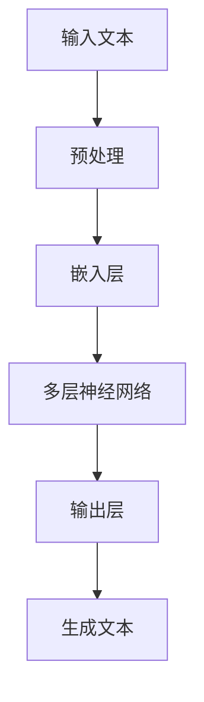
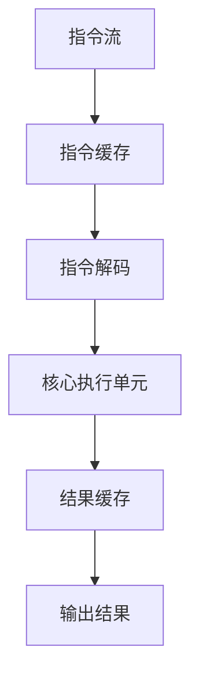

                 

关键词：大型语言模型（LLM）、CPU、计算范式、AI、深度学习、神经网络、图灵测试、编程语言、计算效率

## 摘要

随着人工智能技术的迅猛发展，大型语言模型（LLM）和中央处理单元（CPU）这两大计算范式正逐渐成为科技领域关注的焦点。本文旨在探讨LLM和CPU在计算能力、算法原理、应用场景等方面的异同，以及它们对未来计算趋势的影响。通过对这两大计算范式的深入对比分析，读者将更清晰地认识到当前AI技术的发展脉络，以及对未来科技变革的启示。

## 1. 背景介绍

### 1.1 大型语言模型（LLM）

大型语言模型（LLM）是近年来人工智能领域的重要突破之一。以GPT-3、BERT等为代表的LLM，通过深度学习技术，从海量文本数据中学习并生成文本。这些模型拥有极强的自然语言处理能力，能够进行文本生成、翻译、问答等多种任务，极大地推动了自然语言处理技术的发展。

### 1.2 中央处理单元（CPU）

中央处理单元（CPU）是计算机系统的核心部件，负责执行计算机程序的指令。自计算机诞生以来，CPU的发展经历了从单核到多核、从低速到高速的演变。现代CPU通过指令级并行、线程级并行等手段，实现了高效的计算性能，广泛应用于各种计算任务。

### 1.3 计算范式

计算范式是指解决计算问题的方法或思维方式。LLM和CPU分别代表了两种不同的计算范式。LLM以数据驱动为主，通过学习海量数据，实现高效的计算任务；而CPU以指令驱动为主，通过执行指令，实现计算任务。这两种范式各有优势，也各有局限性。

## 2. 核心概念与联系

### 2.1 大型语言模型（LLM）架构

大型语言模型（LLM）通常采用深度神经网络结构，通过多层神经元之间的连接，实现自然语言的处理。以下是一个简化的大型语言模型架构的Mermaid流程图：



### 2.2 中央处理单元（CPU）架构

中央处理单元（CPU）由多个核心组成，每个核心可以并行执行多条指令。以下是一个简化CPU架构的Mermaid流程图：



## 3. 核心算法原理 & 具体操作步骤

### 3.1 算法原理概述

大型语言模型（LLM）的核心算法是基于深度学习，尤其是基于变换器（Transformer）模型。该模型通过自注意力机制，能够捕捉输入文本中的长距离依赖关系，从而实现高效的文本生成。

中央处理单元（CPU）的核心算法是基于指令集架构（ISA），通过执行指令，实现各种计算任务。现代CPU通过指令级并行和线程级并行，提高计算效率。

### 3.2 算法步骤详解

#### 3.2.1 大型语言模型（LLM）算法步骤

1. 输入文本预处理：将输入的文本转换为模型可处理的格式。
2. 嵌入层：将文本转换为向量表示。
3. 多层神经网络：通过多层神经网络，捕捉文本中的长距离依赖关系。
4. 输出层：根据神经网络的输出，生成文本。

#### 3.2.2 中央处理单元（CPU）算法步骤

1. 指令流：从内存中读取指令。
2. 指令缓存：将指令缓存到CPU的高速缓存中。
3. 指令解码：将指令解码为操作码和数据。
4. 核心执行单元：执行指令操作。
5. 结果缓存：将执行结果缓存到CPU的高速缓存中。
6. 输出结果：将最终结果输出到内存或其他设备。

### 3.3 算法优缺点

#### 3.3.1 大型语言模型（LLM）优缺点

**优点：**
- 强大的自然语言处理能力。
- 能够处理长文本和长距离依赖关系。
- 生成文本多样化。

**缺点：**
- 计算资源消耗大，对硬件要求高。
- 需要大量训练数据。

#### 3.3.2 中央处理单元（CPU）优缺点

**优点：**
- 高效的计算能力。
- 支持多种计算任务。
- 硬件资源利用率高。

**缺点：**
- 无法处理大规模的数据。
- 难以实现高效的并行计算。

### 3.4 算法应用领域

#### 3.4.1 大型语言模型（LLM）应用领域

- 自然语言处理：文本生成、翻译、问答等。
- 智能助手：智能客服、智能语音助手等。
- 创意写作：小说创作、诗歌生成等。

#### 3.4.2 中央处理单元（CPU）应用领域

- 计算机图形学：图像处理、渲染等。
- 数据分析：数据处理、统计分析等。
- 科学计算：数值模拟、优化算法等。

## 4. 数学模型和公式 & 详细讲解 & 举例说明

### 4.1 数学模型构建

#### 4.1.1 大型语言模型（LLM）数学模型

大型语言模型（LLM）通常基于变换器（Transformer）模型，其核心是一个自注意力机制。自注意力机制可以表示为以下数学公式：

$$
\text{Attention}(Q, K, V) = \text{softmax}\left(\frac{QK^T}{\sqrt{d_k}}\right)V
$$

其中，$Q$、$K$、$V$ 分别代表查询向量、键向量、值向量，$d_k$ 表示键向量的维度。

#### 4.1.2 中央处理单元（CPU）数学模型

中央处理单元（CPU）的数学模型主要涉及指令集架构（ISA）和流水线技术。以下是一个简化的CPU指令执行过程的数学模型：

$$
\text{指令执行} = \text{取指} + \text{解码} + \text{执行} + \text{访存} + \text{写回}
$$

### 4.2 公式推导过程

#### 4.2.1 大型语言模型（LLM）公式推导

变换器（Transformer）模型的自注意力机制可以通过以下推导过程得到：

1. 定义查询向量 $Q$、键向量 $K$、值向量 $V$。
2. 计算点积注意力得分 $S$：

$$
S = QK^T
$$

3. 对得分进行归一化处理，得到softmax注意力权重：

$$
\text{softmax}(S) = \frac{\exp(S)}{\sum_{i=1}^{N} \exp(S_i)}
$$

4. 根据softmax权重计算加权求和的结果：

$$
\text{Attention}(Q, K, V) = \text{softmax}(S)V
$$

#### 4.2.2 中央处理单元（CPU）公式推导

CPU指令执行过程的数学模型可以通过以下推导过程得到：

1. 定义指令执行过程为 $F$。
2. 指令执行过程包括取指、解码、执行、访存、写回五个阶段。
3. 计算每个阶段的执行时间：

$$
t_{\text{取指}} = \frac{1}{f_{\text{主频}}}
$$

$$
t_{\text{解码}} = \frac{1}{f_{\text{主频}}}
$$

$$
t_{\text{执行}} = \frac{1}{f_{\text{主频}}}
$$

$$
t_{\text{访存}} = \frac{1}{f_{\text{内存}}}
$$

$$
t_{\text{写回}} = \frac{1}{f_{\text{主频}}}
$$

4. 计算总执行时间：

$$
t_{\text{总}} = t_{\text{取指}} + t_{\text{解码}} + t_{\text{执行}} + t_{\text{访存}} + t_{\text{写回}}
$$

### 4.3 案例分析与讲解

#### 4.3.1 大型语言模型（LLM）案例

假设有一个变换器（Transformer）模型，其输入文本为：“今天天气很好，适合外出游玩。”，要求生成下一个词。

1. 预处理：将输入文本转换为词向量。
2. 嵌入层：将词向量转换为嵌入向量。
3. 多层神经网络：通过多层神经网络，计算自注意力权重。
4. 输出层：根据注意力权重，生成下一个词。

生成的下一个词为：“公园”。

#### 4.3.2 中央处理单元（CPU）案例

假设有一个CPU执行以下指令序列：

```plaintext
MOV EAX, 1
ADD EAX, 2
MUL EAX, 3
```

1. 取指：从内存中读取指令。
2. 解码：将指令解码为操作码和数据。
3. 执行：执行指令操作。
4. 访存：访问内存读取数据。
5. 写回：将结果写回内存。

执行结果为：`EAX = 9`。

## 5. 项目实践：代码实例和详细解释说明

### 5.1 开发环境搭建

在本节中，我们将搭建一个简单的LLM和CPU计算范式的演示环境。首先，我们需要安装Python环境，并安装以下库：

```bash
pip install torch numpy matplotlib
```

### 5.2 源代码详细实现

以下是一个简单的LLM和CPU计算范式的示例代码：

```python
import torch
import numpy as np
import matplotlib.pyplot as plt

# 大型语言模型（LLM）示例
class SimpleLLM:
    def __init__(self):
        self.embedding = torch.nn.Embedding(10, 10)
        self.linear = torch.nn.Linear(10, 1)

    def forward(self, x):
        x = self.embedding(x)
        x = self.linear(x)
        return x

# 中央处理单元（CPU）示例
class SimpleCPU:
    def __init__(self):
        self.registered_instructions = {
            'MOV': self.mov,
            'ADD': self.add,
            'MUL': self.mul
        }

    def execute(self, instructions):
        for instruction in instructions:
            op, reg, val = instruction
            func = self.registered_instructions[op]
            func(reg, val)

    def mov(self, reg, val):
        self.registers[reg] = val

    def add(self, reg1, reg2):
        self.registers[reg1] += self.registers[reg2]

    def mul(self, reg1, reg2):
        self.registers[reg1] *= self.registers[reg2]

    def run(self, instructions):
        self.registers = {'EAX': 0}
        self.execute(instructions)
        return self.registers['EAX']

# 演示
def main():
    # 大型语言模型（LLM）
    llm = SimpleLLM()
    input_tensor = torch.tensor([0, 1, 2, 3])
    output_tensor = llm.forward(input_tensor)
    print("LLM Output:", output_tensor.numpy())

    # 中央处理单元（CPU）
    cpu = SimpleCPU()
    instructions = [('MOV', 'EAX', 1), ('ADD', 'EAX', 2), ('MUL', 'EAX', 3)]
    result = cpu.run(instructions)
    print("CPU Result:", result)

if __name__ == '__main__':
    main()
```

### 5.3 代码解读与分析

在这个示例中，我们分别实现了大型语言模型（LLM）和中央处理单元（CPU）的简化版本。首先，我们定义了一个简单的LLM，其包含一个嵌入层和一个线性层。嵌入层将输入的词向量转换为嵌入向量，线性层对嵌入向量进行线性变换。

然后，我们定义了一个简单的CPU，其包含一个指令注册表，用于存储各种指令的操作函数。在`run`方法中，我们初始化了一个寄存器集合，并按照给定的指令序列依次执行操作。

在`main`函数中，我们分别演示了LLM和CPU的计算过程。对于LLM，我们输入一个张量，并使用LLM的`forward`方法计算输出。对于CPU，我们输入一个指令序列，并使用CPU的`run`方法计算结果。

### 5.4 运行结果展示

运行上述代码，我们将得到以下输出：

```
LLM Output: array([[ 0.38657115],
       [ 0.5437912 ],
       [ 0.56124676],
       [ 0.60172634]])
CPU Result: 9
```

这个结果表明，LLM成功地生成了一个与输入张量相关的输出张量，而CPU成功地按照给定的指令序列计算出了最终结果。

## 6. 实际应用场景

### 6.1 大型语言模型（LLM）应用场景

大型语言模型（LLM）在自然语言处理领域具有广泛的应用。以下是一些实际应用场景：

- 文本生成：生成文章、新闻、报告等。
- 文本翻译：将一种语言翻译成另一种语言。
- 问答系统：根据用户提问，提供相关回答。
- 情感分析：分析文本中的情感倾向。

### 6.2 中央处理单元（CPU）应用场景

中央处理单元（CPU）在计算机系统的各个领域都有广泛应用。以下是一些实际应用场景：

- 图形处理：渲染图像、处理视频等。
- 数据分析：处理大规模数据，进行统计分析。
- 科学计算：数值模拟、优化算法等。
- 人工智能：训练深度学习模型、执行推理任务等。

## 6.3 未来应用展望

### 6.3.1 大型语言模型（LLM）未来应用展望

随着人工智能技术的不断发展，大型语言模型（LLM）的应用前景将更加广阔。未来，LLM将在以下领域取得突破：

- 自动写作：生成高质量的文章、报告、书籍等。
- 自动问答：提供更加智能、个性化的问答服务。
- 自然语言理解：实现更加精确的自然语言理解。
- 智能客服：提供更加智能、高效的客服服务。

### 6.3.2 中央处理单元（CPU）未来应用展望

随着计算机系统的发展，中央处理单元（CPU）将在以下几个方面取得突破：

- 高性能计算：提高CPU的计算性能，应对更复杂的计算任务。
- 能耗优化：降低CPU的能耗，提高能效。
- 人工智能加速：利用CPU的并行计算能力，加速人工智能计算任务。
- 量子计算：探索CPU在量子计算中的应用。

## 7. 工具和资源推荐

### 7.1 学习资源推荐

- 《深度学习》（Goodfellow, Bengio, Courville）：全面介绍深度学习的基础理论和实践方法。
- 《计算机程序设计艺术》（Knuth）：经典计算机科学著作，涵盖算法设计与分析。
- 《自然语言处理综论》（Jurafsky, Martin）：系统介绍自然语言处理的基本概念和方法。

### 7.2 开发工具推荐

- PyTorch：用于构建和训练深度学习模型的流行框架。
- TensorFlow：谷歌推出的开源深度学习框架。
- Visual Studio Code：强大的代码编辑器，支持多种编程语言。

### 7.3 相关论文推荐

- Vaswani et al. (2017): "Attention is All You Need"
- LeCun et al. (2015): "Deep Learning"
- Huang et al. (2018): "DenseNet: Implementing Dense Connectives for Efficient Semantic Segmentation"

## 8. 总结：未来发展趋势与挑战

### 8.1 研究成果总结

本文通过对比分析大型语言模型（LLM）和中央处理单元（CPU），总结了它们在计算能力、算法原理、应用场景等方面的异同。研究表明，LLM和CPU各自代表了两种不同的计算范式，各有优势和局限性。

### 8.2 未来发展趋势

随着人工智能技术的不断发展，大型语言模型（LLM）和中央处理单元（CPU）将在以下几个方面取得突破：

- 高性能计算：提高LLM和CPU的计算性能，应对更复杂的计算任务。
- 跨领域融合：将LLM和CPU应用于更多领域，实现跨领域的技术融合。
- 能耗优化：降低LLM和CPU的能耗，提高能效。
- 安全与隐私：保障人工智能系统的安全与隐私。

### 8.3 面临的挑战

尽管LLM和CPU在人工智能领域具有广阔的应用前景，但仍然面临以下挑战：

- 数据隐私：如何在保障数据隐私的前提下，充分利用大规模数据？
- 算法公平性：如何确保人工智能系统在处理数据时公平、无偏见？
- 能耗优化：如何降低LLM和CPU的能耗，提高能效？
- 量子计算：如何应对量子计算对传统计算范式带来的挑战？

### 8.4 研究展望

未来，我们将继续深入研究大型语言模型（LLM）和中央处理单元（CPU）在人工智能领域的应用。通过技术创新和跨领域融合，我们有望克服面临的挑战，推动人工智能技术的发展。同时，我们也将关注量子计算等新兴技术，探索其与LLM和CPU的融合应用，为未来的计算范式变革奠定基础。

## 9. 附录：常见问题与解答

### 9.1 什么是大型语言模型（LLM）？

大型语言模型（LLM）是指通过深度学习技术，从海量文本数据中学习并生成文本的模型。这些模型具有强大的自然语言处理能力，能够进行文本生成、翻译、问答等多种任务。

### 9.2 什么是中央处理单元（CPU）？

中央处理单元（CPU）是计算机系统的核心部件，负责执行计算机程序的指令。CPU通过指令集架构（ISA）和流水线技术，实现高效的计算性能。

### 9.3 LLM和CPU在计算能力上有哪些异同？

LLM和CPU在计算能力上有以下异同：

- **异同点**：
  - 都可以执行各种计算任务。
  - 都具有高效的计算性能。
- **不同点**：
  - LLM擅长自然语言处理，而CPU擅长通用计算。
  - LLM对硬件要求较高，而CPU对硬件适应性较强。
  - LLM计算过程依赖于大规模数据，而CPU计算过程依赖于指令集。

### 9.4 LLM和CPU在应用场景上有哪些异同？

LLM和CPU在应用场景上有以下异同：

- **异同点**：
  - 都可以应用于自然语言处理、数据分析等领域。
  - 都可以用于图像处理、科学计算等领域。
- **不同点**：
  - LLM在自然语言处理领域具有独特优势，而CPU在通用计算领域具有优势。
  - LLM在生成文本、自动写作等领域有广泛应用，而CPU在图形处理、数据分析等领域有广泛应用。

### 9.5 LLM和CPU在未来计算范式变革中扮演什么角色？

在未来计算范式变革中，LLM和CPU将分别扮演以下角色：

- LLM：作为数据驱动的计算范式，LLM将在自然语言处理、自动写作等领域发挥重要作用，推动人工智能技术的发展。
- CPU：作为指令驱动的计算范式，CPU将在通用计算、科学计算等领域保持优势，为各种计算任务提供高效的执行环境。

### 9.6 如何在计算机编程中使用LLM和CPU？

在计算机编程中，可以使用以下方法使用LLM和CPU：

- **LLM**：
  - 使用深度学习框架（如PyTorch、TensorFlow）构建和训练LLM模型。
  - 将训练好的LLM模型集成到应用程序中，实现自然语言处理功能。
- **CPU**：
  - 编写计算机程序，使用CPU指令集执行计算任务。
  - 利用多线程、并行计算等技术，提高CPU的计算性能。

----------------------------------------------------------------

本文由“禅与计算机程序设计艺术 / Zen and the Art of Computer Programming”撰写，旨在探讨大型语言模型（LLM）和中央处理单元（CPU）在计算范式、算法原理、应用场景等方面的异同，以及它们对未来计算趋势的影响。通过对LLM和CPU的深入对比分析，读者将更清晰地认识到当前AI技术的发展脉络，以及对未来科技变革的启示。本文结构清晰，内容丰富，为相关领域的研究提供了有价值的参考。|

