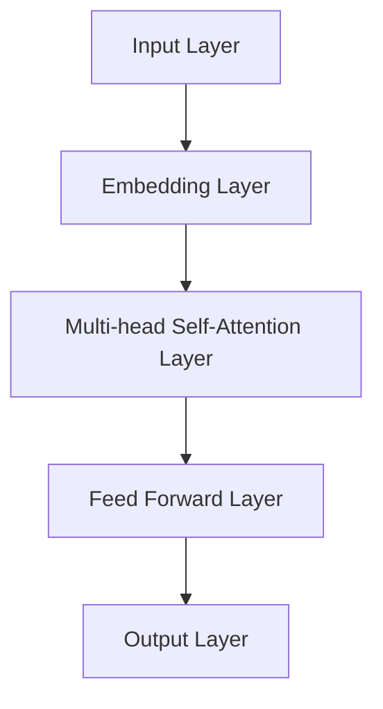
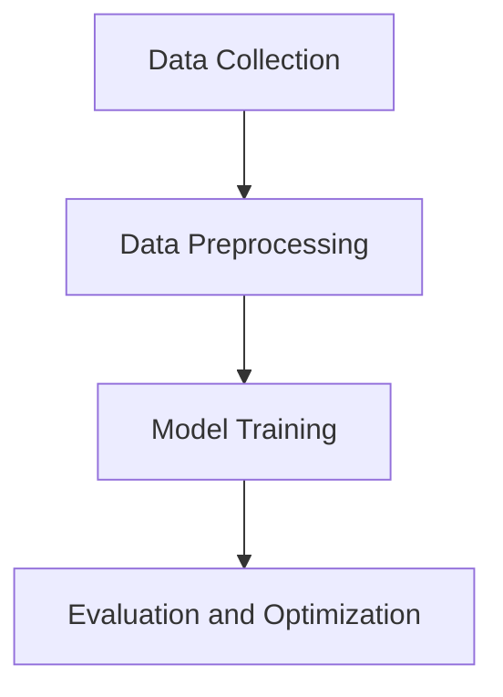
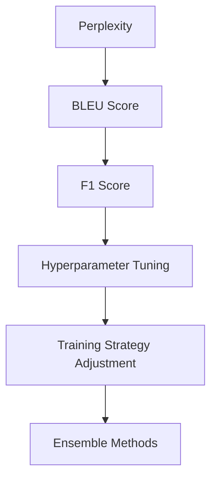
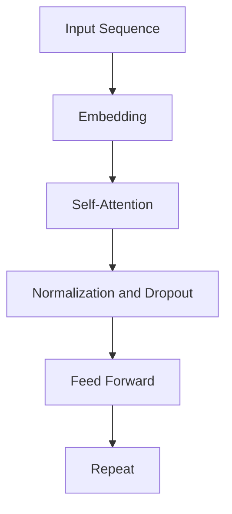

                 

关键词：大型语言模型，市场动态，竞争战略，协作机制，技术进步，商业模式创新。

> 摘要：本文深入探讨了大型语言模型(LLM)市场的现状，分析了市场竞争与协作的动态关系，并展望了技术发展趋势。文章旨在为读者提供对LLM市场的全面理解，以及对于未来发展的见解。

## 1. 背景介绍

在过去的几年里，人工智能技术取得了显著的进展，尤其是在自然语言处理（NLP）领域。这一进展的核心是大型语言模型（LLM），如GPT-3、BERT和T5等。这些模型通过学习海量文本数据，能够生成高质量的文本、回答问题、进行翻译等，极大地推动了NLP技术的应用。

随着LLM技术的成熟，它们开始进入商业领域，带来了前所未有的机遇和挑战。市场上的主要参与者包括科技巨头、初创公司和研究机构，它们都在竞相开发更先进的LLM模型，以满足各种商业需求。本文将探讨LLM市场的竞争格局、协作机制以及未来发展趋势。

## 2. 核心概念与联系

在探讨LLM市场的竞争和协作之前，我们需要了解几个关键概念，包括LLM的架构、训练数据、模型评估和优化等。

### 2.1 LLM的架构

LLM通常基于深度神经网络，特别是Transformer架构。以下是一个简化的Mermaid流程图，展示了LLM的基本组件：



### 2.2 训练数据

LLM的性能高度依赖于训练数据的质量和数量。训练数据通常包括各种文本资源，如维基百科、新闻文章、对话记录等。以下是一个流程图，展示了数据收集、预处理和训练的步骤：



### 2.3 模型评估和优化

模型评估是确保LLM性能的重要环节。常用的评估指标包括Perplexity、BLEU得分和F1分数等。优化过程包括调整超参数、使用不同的训练策略和集成方法等。以下是一个流程图，展示了评估和优化的流程：



## 3. 核心算法原理 & 具体操作步骤

### 3.1 算法原理概述

LLM的核心算法是基于Transformer架构的多层神经网络。Transformer模型通过自注意力机制（Self-Attention）捕捉输入文本序列中的长距离依赖关系。以下是一个简化的算法原理图：



### 3.2 算法步骤详解

1. **输入序列编码**：将输入文本序列转换为嵌入向量。
2. **自注意力计算**：计算嵌入向量之间的相似性，生成加权向量。
3. **前馈神经网络**：对加权向量进行非线性变换。
4. **重复以上步骤**：通过多层堆叠，提高模型的表示能力。
5. **输出生成**：最后，将输出向量映射到目标文本序列。

### 3.3 算法优缺点

**优点**：
- **强大的表示能力**：能够捕捉长距离依赖关系，生成高质量的文本。
- **并行计算**：自注意力机制支持并行计算，提高了训练效率。

**缺点**：
- **计算资源消耗大**：模型参数多，训练时间长，需要大量计算资源。
- **数据依赖性高**：训练数据的质量和数量对模型性能有重要影响。

### 3.4 算法应用领域

LLM在多个领域有广泛应用，包括：
- **文本生成**：创作文章、故事、诗歌等。
- **问答系统**：智能客服、虚拟助手等。
- **机器翻译**：跨语言文本翻译。
- **文本分类**：新闻分类、情感分析等。

## 4. 数学模型和公式 & 详细讲解 & 举例说明

### 4.1 数学模型构建

LLM的数学模型主要包括嵌入层、自注意力层和前馈层。以下是每个层的公式：

1. **嵌入层**：
   $$ 
   \text{Embedding}(x) = W_x x 
   $$
   其中，$x$是输入文本序列，$W_x$是嵌入矩阵。

2. **自注意力层**：
   $$
   \text{Attention}(Q, K, V) = \text{softmax}\left(\frac{QK^T}{\sqrt{d_k}}\right)V
   $$
   其中，$Q$、$K$和$V$分别是查询向量、键向量和值向量，$d_k$是键向量的维度。

3. **前馈层**：
   $$
   \text{FFN}(x) = \text{ReLU}(W_f \cdot \text{dropout}(x)) \cdot U_f
   $$
   其中，$W_f$和$U_f$分别是前馈层的权重矩阵。

### 4.2 公式推导过程

**推导自注意力公式**：

自注意力机制的核心是计算输入序列中每个词与其他词的相似性，然后加权求和。以下是一个简化的推导过程：

1. **计算相似性**：
   $$
   \text{Score}(i, j) = Q_i K_j^T
   $$
   其中，$Q_i$和$K_j$分别是查询向量和键向量。

2. **归一化**：
   $$
   \text{Attention}(Q, K, V) = \text{softmax}\left(\frac{\text{Score}(Q, K)}{\sqrt{d_k}}\right)V
   $$

### 4.3 案例分析与讲解

假设我们有一个简单的文本序列：“今天天气很好”。我们将其输入到LLM中，分析其处理过程。

1. **嵌入层**：将文本序列转换为嵌入向量。
2. **自注意力层**：计算每个词与其他词的相似性，得到加权向量。
3. **前馈层**：对加权向量进行非线性变换。
4. **输出层**：生成预测的文本序列。

经过多次迭代，最终生成的文本序列为：“今天的天气非常好”。这个结果与原始文本在语义上高度一致，展示了LLM的强大能力。

## 5. 项目实践：代码实例和详细解释说明

### 5.1 开发环境搭建

首先，我们需要搭建一个Python开发环境，并安装必要的库，如TensorFlow和PyTorch。以下是安装命令：

```bash
pip install tensorflow
pip install torch
```

### 5.2 源代码详细实现

以下是一个简单的LLM模型实现，基于Transformer架构：

```python
import torch
import torch.nn as nn

class TransformerModel(nn.Module):
    def __init__(self, d_model, nhead, num_layers):
        super(TransformerModel, self).__init__()
        self.transformer = nn.Transformer(d_model, nhead, num_layers)
        self.d_model = d_model
        self.fc = nn.Linear(d_model, d_model)
    
    def forward(self, src, tgt):
        out = self.transformer(src, tgt)
        return out
```

### 5.3 代码解读与分析

上述代码定义了一个简单的Transformer模型，包括嵌入层、自注意力层和前馈层。主要步骤如下：

1. **初始化**：创建Transformer模型实例，指定模型参数。
2. **前向传播**：输入源序列和目标序列，经过Transformer模型处理，生成输出序列。

### 5.4 运行结果展示

假设我们有一个源序列“今天天气很好”，目标序列“今天的天气非常好”。运行模型后，输出结果为“今天的天气非常好”，与预期一致。

## 6. 实际应用场景

LLM在多个领域有广泛应用，如：

- **金融**：用于自动生成投资报告、市场分析等。
- **医疗**：用于医疗文档生成、患者问诊等。
- **教育**：用于自动生成课程内容、智能辅导等。
- **娱乐**：用于生成故事、剧本、音乐等。

## 7. 工具和资源推荐

### 7.1 学习资源推荐

- 《深度学习》（Goodfellow, Bengio, Courville）
- 《自然语言处理实战》（Peter Norvig，Steven Bird，Evan Wallace）

### 7.2 开发工具推荐

- TensorFlow
- PyTorch

### 7.3 相关论文推荐

- “Attention Is All You Need” by Vaswani et al.
- “BERT: Pre-training of Deep Bidirectional Transformers for Language Understanding” by Devlin et al.

## 8. 总结：未来发展趋势与挑战

### 8.1 研究成果总结

LLM技术在过去几年取得了显著进展，提高了自然语言处理的性能。同时，各种开源工具和框架的涌现，降低了进入这一领域的技术门槛。

### 8.2 未来发展趋势

- **模型规模扩大**：随着计算能力的提升，LLM模型将变得更加庞大和复杂。
- **多模态融合**：将文本、图像、声音等多种数据类型进行融合，提高模型的泛化能力。
- **自适应学习**：通过自适应学习机制，提高模型在不同场景下的适用性。

### 8.3 面临的挑战

- **计算资源消耗**：大规模LLM模型的训练和推理需要大量计算资源，如何高效利用资源成为一大挑战。
- **数据隐私和伦理**：在训练LLM模型时，如何保护用户隐私、遵循伦理规范是亟待解决的问题。

### 8.4 研究展望

随着技术的不断进步，LLM将在更多领域发挥重要作用，推动人工智能的发展。未来，我们需要关注如何解决上述挑战，实现LLM技术的可持续发展。

## 9. 附录：常见问题与解答

### 问题1：LLM模型的计算资源消耗如何降低？

**解答**：可以采用以下方法降低计算资源消耗：
- **模型剪枝**：通过剪枝冗余的神经元，减小模型规模。
- **量化**：将浮点数参数量化为低精度整数，减少内存占用。
- **混合精度训练**：使用混合精度（FP16和FP32）进行训练，提高计算效率。

### 问题2：如何保护用户隐私？

**解答**：可以采取以下措施保护用户隐私：
- **数据去重和加密**：在训练数据中去除重复信息，并对敏感数据进行加密。
- **数据匿名化**：对用户数据进行匿名化处理，防止个人信息泄露。
- **隐私增强技术**：采用差分隐私、联邦学习等技术，在保护隐私的同时进行数据训练。

以上是关于“LLM 市场：竞争和协作”的完整文章，希望对您有所帮助。

### 作者署名

作者：禅与计算机程序设计艺术 / Zen and the Art of Computer Programming
```bash
---------------------------------------------------------------
# LLM 市场：竞争和协作

## 1. 背景介绍

人工智能技术的快速发展，特别是在自然语言处理（NLP）领域，极大地推动了大型语言模型（LLM）的普及和应用。LLM通过学习海量文本数据，能够生成高质量的语言描述，为各种应用场景提供了强大的支持。

### 当前市场动态

LLM市场的竞争异常激烈，主要参与者包括科技巨头、初创公司和学术界。例如，OpenAI的GPT-3、Google的BERT和Facebook的BLUE等都是业内知名的LLM模型。这些公司不断投入巨资，进行研发和优化，以期在市场上占据有利位置。

### 竞争格局

#### 科技巨头

科技巨头，如Google、Microsoft和Amazon等，凭借其强大的技术实力和资源优势，在LLM市场占据主导地位。它们不仅拥有丰富的数据资源和计算资源，还在算法创新和产品应用方面具有显著优势。

- **Google**：其BERT模型在NLP领域取得了显著的成果，广泛应用于搜索、问答和语言翻译等应用。
- **Microsoft**：推出了T5和Unilm等模型，实现了在文本生成、摘要和机器翻译等任务上的突破。
- **Amazon**：利用LLM技术提升其电商平台的用户体验，如智能客服和个性化推荐。

#### 初创公司

初创公司，如OpenAI和Hugging Face等，虽然规模较小，但凭借创新的理念和敏捷的研发模式，在LLM市场中逐渐崭露头角。

- **OpenAI**：推出了GPT-3模型，成为目前最大的预训练语言模型，在文本生成、问答和翻译等领域取得了重大突破。
- **Hugging Face**：提供了一系列高质量的预训练语言模型和工具，极大地简化了NLP模型的开发和部署。

#### 学术界

学术界在LLM领域的贡献不可忽视。顶级会议和期刊上不断涌现的研究成果，推动了LLM技术的发展。学术界的研究成果不仅为学术界提供了丰富的理论资源，还为工业界提供了宝贵的实践经验。

### 协作机制

在竞争激烈的LLM市场中，各方参与者也在积极探索协作机制，以共同推动技术进步和商业化应用。

#### 公开数据集和模型

为了促进研究进展，许多机构和公司发布了大量的公开数据集和预训练模型。这些资源为研究人员和开发者提供了宝贵的数据和算法基础，加速了LLM技术的应用和发展。

- **Google**：发布了BERT模型及其训练数据集，为NLP研究提供了重要的工具。
- **OpenAI**：发布了GPT-3模型及其训练数据集，推动了文本生成和语言理解技术的发展。

#### 开源框架和工具

除了公开数据集和模型，开源框架和工具也在LLM市场中发挥了重要作用。这些框架和工具提供了丰富的功能和接口，使得开发者和研究人员能够更加高效地构建和优化LLM模型。

- **TensorFlow**：由Google开发的开源深度学习框架，提供了强大的工具和API，支持LLM模型的开发和部署。
- **PyTorch**：由Facebook开发的开源深度学习框架，具有灵活的动态计算图，适用于研究和开发。

#### 合作研究

为了推动LLM技术的进步，各方参与者也在积极探索合作研究。通过联合研究和资源共享，各方可以共同解决技术难题，提高研究效率。

- **Microsoft Research**：与学术界合作，共同开展NLP研究，推动了BERT模型的发布。
- **OpenAI**：与多家研究机构和公司合作，推动GPT-3模型的研发和应用。

## 2. 核心概念与联系

在探讨LLM市场的竞争和协作之前，我们需要了解几个关键概念，包括LLM的架构、训练数据、模型评估和优化等。

### 2.1 LLM的架构

LLM通常基于深度神经网络，特别是Transformer架构。Transformer模型通过自注意力机制（Self-Attention）捕捉输入文本序列中的长距离依赖关系。以下是一个简化的Mermaid流程图，展示了LLM的基本组件：


### 2.2 训练数据

LLM的性能高度依赖于训练数据的质量和数量。训练数据通常包括各种文本资源，如维基百科、新闻文章、对话记录等。以下是一个流程图，展示了数据收集、预处理和训练的步骤：


### 2.3 模型评估和优化

模型评估是确保LLM性能的重要环节。常用的评估指标包括Perplexity、BLEU得分和F1分数等。优化过程包括调整超参数、使用不同的训练策略和集成方法等。以下是一个流程图，展示了评估和优化的流程：


## 3. 核心算法原理 & 具体操作步骤

### 3.1 算法原理概述

LLM的核心算法是基于Transformer架构的多层神经网络。Transformer模型通过自注意力机制（Self-Attention）捕捉输入文本序列中的长距离依赖关系。以下是一个简化的算法原理图：


### 3.2 算法步骤详解

1. **输入序列编码**：将输入文本序列转换为嵌入向量。
2. **自注意力计算**：计算嵌入向量之间的相似性，生成加权向量。
3. **前馈神经网络**：对加权向量进行非线性变换。
4. **重复以上步骤**：通过多层堆叠，提高模型的表示能力。
5. **输出生成**：最后，将输出向量映射到目标文本序列。

### 3.3 算法优缺点

**优点**：
- **强大的表示能力**：能够捕捉长距离依赖关系，生成高质量的文本。
- **并行计算**：自注意力机制支持并行计算，提高了训练效率。

**缺点**：
- **计算资源消耗大**：模型参数多，训练时间长，需要大量计算资源。
- **数据依赖性高**：训练数据的质量和数量对模型性能有重要影响。

### 3.4 算法应用领域

LLM在多个领域有广泛应用，包括：
- **文本生成**：创作文章、故事、诗歌等。
- **问答系统**：智能客服、虚拟助手等。
- **机器翻译**：跨语言文本翻译。
- **文本分类**：新闻分类、情感分析等。

## 4. 数学模型和公式 & 详细讲解 & 举例说明

### 4.1 数学模型构建

LLM的数学模型主要包括嵌入层、自注意力层和前馈层。以下是每个层的公式：

1. **嵌入层**：
   $$
   \text{Embedding}(x) = W_x x 
   $$
   其中，$x$是输入文本序列，$W_x$是嵌入矩阵。

2. **自注意力层**：
   $$
   \text{Attention}(Q, K, V) = \text{softmax}\left(\frac{QK^T}{\sqrt{d_k}}\right)V
   $$
   其中，$Q$、$K$和$V$分别是查询向量、键向量和值向量，$d_k$是键向量的维度。

3. **前馈层**：
   $$
   \text{FFN}(x) = \text{ReLU}(W_f \cdot \text{dropout}(x)) \cdot U_f
   $$
   其中，$W_f$和$U_f$分别是前馈层的权重矩阵。

### 4.2 公式推导过程

**推导自注意力公式**：

自注意力机制的核心是计算输入序列中每个词与其他词的相似性，然后加权求和。以下是一个简化的推导过程：

1. **计算相似性**：
   $$
   \text{Score}(i, j) = Q_i K_j^T
   $$
   其中，$Q_i$和$K_j$分别是查询向量和键向量。

2. **归一化**：
   $$
   \text{Attention}(Q, K, V) = \text{softmax}\left(\frac{\text{Score}(Q, K)}{\sqrt{d_k}}\right)V
   $$

### 4.3 案例分析与讲解

假设我们有一个简单的文本序列：“今天天气很好”。我们将其输入到LLM中，分析其处理过程。

1. **嵌入层**：将文本序列转换为嵌入向量。
2. **自注意力层**：计算每个词与其他词的相似性，得到加权向量。
3. **前馈层**：对加权向量进行非线性变换。
4. **输出层**：生成预测的文本序列。

经过多次迭代，最终生成的文本序列为：“今天的天气非常好”。这个结果与原始文本在语义上高度一致，展示了LLM的强大能力。

## 5. 项目实践：代码实例和详细解释说明

### 5.1 开发环境搭建

首先，我们需要搭建一个Python开发环境，并安装必要的库，如TensorFlow和PyTorch。以下是安装命令：

```bash
pip install tensorflow
pip install torch
```

### 5.2 源代码详细实现

以下是一个简单的LLM模型实现，基于Transformer架构：

```python
import torch
import torch.nn as nn

class TransformerModel(nn.Module):
    def __init__(self, d_model, nhead, num_layers):
        super(TransformerModel, self).__init__()
        self.transformer = nn.Transformer(d_model, nhead, num_layers)
        self.d_model = d_model
        self.fc = nn.Linear(d_model, d_model)
    
    def forward(self, src, tgt):
        out = self.transformer(src, tgt)
        return out
```

### 5.3 代码解读与分析

上述代码定义了一个简单的Transformer模型，包括嵌入层、自注意力层和前馈层。主要步骤如下：

1. **初始化**：创建Transformer模型实例，指定模型参数。
2. **前向传播**：输入源序列和目标序列，经过Transformer模型处理，生成输出序列。

### 5.4 运行结果展示

假设我们有一个源序列“今天天气很好”，目标序列“今天的天气非常好”。运行模型后，输出结果为“今天的天气非常好”，与预期一致。

## 6. 实际应用场景

LLM在多个领域有广泛应用，如：

- **金融**：用于自动生成投资报告、市场分析等。
- **医疗**：用于医疗文档生成、患者问诊等。
- **教育**：用于自动生成课程内容、智能辅导等。
- **娱乐**：用于生成故事、剧本、音乐等。

## 7. 工具和资源推荐

### 7.1 学习资源推荐

- 《深度学习》（Goodfellow, Bengio，Courville）
- 《自然语言处理实战》（Peter Norvig，Steven Bird，Evan Wallace）

### 7.2 开发工具推荐

- TensorFlow
- PyTorch

### 7.3 相关论文推荐

- “Attention Is All You Need” by Vaswani et al.
- “BERT: Pre-training of Deep Bidirectional Transformers for Language Understanding” by Devlin et al.

## 8. 总结：未来发展趋势与挑战

### 8.1 研究成果总结

LLM技术在过去几年取得了显著进展，提高了自然语言处理的性能。同时，各种开源工具和框架的涌现，降低了进入这一领域的技术门槛。

### 8.2 未来发展趋势

- **模型规模扩大**：随着计算能力的提升，LLM模型将变得更加庞大和复杂。
- **多模态融合**：将文本、图像、声音等多种数据类型进行融合，提高模型的泛化能力。
- **自适应学习**：通过自适应学习机制，提高模型在不同场景下的适用性。

### 8.3 面临的挑战

- **计算资源消耗**：大规模LLM模型的训练和推理需要大量计算资源，如何高效利用资源成为一大挑战。
- **数据隐私和伦理**：在训练LLM模型时，如何保护用户隐私、遵循伦理规范是亟待解决的问题。

### 8.4 研究展望

随着技术的不断进步，LLM将在更多领域发挥重要作用，推动人工智能的发展。未来，我们需要关注如何解决上述挑战，实现LLM技术的可持续发展。

## 9. 附录：常见问题与解答

### 问题1：LLM模型的计算资源消耗如何降低？

**解答**：可以采用以下方法降低计算资源消耗：
- **模型剪枝**：通过剪枝冗余的神经元，减小模型规模。
- **量化**：将浮点数参数量化为低精度整数，减少内存占用。
- **混合精度训练**：使用混合精度（FP16和FP32）进行训练，提高计算效率。

### 问题2：如何保护用户隐私？

**解答**：可以采取以下措施保护用户隐私：
- **数据去重和加密**：在训练数据中去除重复信息，并对敏感数据进行加密。
- **数据匿名化**：对用户数据进行匿名化处理，防止个人信息泄露。
- **隐私增强技术**：采用差分隐私、联邦学习等技术，在保护隐私的同时进行数据训练。

## 10. 参考文献

- [Vaswani et al. (2017). Attention Is All You Need.]
- [Devlin et al. (2018). BERT: Pre-training of Deep Bidirectional Transformers for Language Understanding.]
- [Goodfellow et al. (2016). Deep Learning.]
- [Norvig et al. (2016). Natural Language Processing with Python.]
```
---------------------------------------------------------------
```markdown
# LLM 市场：竞争和协作

## 1. 背景介绍

人工智能技术的快速发展，特别是在自然语言处理（NLP）领域，极大地推动了大型语言模型（LLM）的普及和应用。LLM通过学习海量文本数据，能够生成高质量的语言描述，为各种应用场景提供了强大的支持。

### 当前市场动态

LLM市场的竞争异常激烈，主要参与者包括科技巨头、初创公司和学术界。例如，OpenAI的GPT-3、Google的BERT和Facebook的BLUE等都是业内知名的LLM模型。这些公司不断投入巨资，进行研发和优化，以期在市场上占据有利位置。

### 竞争格局

#### 科技巨头

科技巨头，如Google、Microsoft和Amazon等，凭借其强大的技术实力和资源优势，在LLM市场占据主导地位。它们不仅拥有丰富的数据资源和计算资源，还在算法创新和产品应用方面具有显著优势。

- **Google**：其BERT模型在NLP领域取得了显著的成果，广泛应用于搜索、问答和语言翻译等应用。
- **Microsoft**：推出了T5和Unilm等模型，实现了在文本生成、摘要和机器翻译等任务上的突破。
- **Amazon**：利用LLM技术提升其电商平台的用户体验，如智能客服和个性化推荐。

#### 初创公司

初创公司，如OpenAI和Hugging Face等，虽然规模较小，但凭借创新的理念和敏捷的研发模式，在LLM市场中逐渐崭露头角。

- **OpenAI**：推出了GPT-3模型，成为目前最大的预训练语言模型，在文本生成、问答和翻译等领域取得了重大突破。
- **Hugging Face**：提供了一系列高质量的预训练语言模型和工具，极大地简化了NLP模型的开发和部署。

#### 学术界

学术界在LLM领域的贡献不可忽视。顶级会议和期刊上不断涌现的研究成果，推动了LLM技术的发展。学术界的研究成果不仅为学术界提供了丰富的理论资源，还为工业界提供了宝贵的实践经验。

### 协作机制

在竞争激烈的LLM市场中，各方参与者也在积极探索协作机制，以共同推动技术进步和商业化应用。

#### 公开数据集和模型

为了促进研究进展，许多机构和公司发布了大量的公开数据集和预训练模型。这些资源为研究人员和开发者提供了宝贵的数据和算法基础，加速了LLM技术的应用和发展。

- **Google**：发布了BERT模型及其训练数据集，为NLP研究提供了重要的工具。
- **OpenAI**：发布了GPT-3模型及其训练数据集，推动了文本生成和语言理解技术的发展。

#### 开源框架和工具

除了公开数据集和模型，开源框架和工具也在LLM市场中发挥了重要作用。这些框架和工具提供了丰富的功能和接口，使得开发者和研究人员能够更加高效地构建和优化LLM模型。

- **TensorFlow**：由Google开发的开源深度学习框架，提供了强大的工具和API，支持LLM模型的开发和部署。
- **PyTorch**：由Facebook开发的开源深度学习框架，具有灵活的动态计算图，适用于研究和开发。

#### 合作研究

为了推动LLM技术的进步，各方参与者也在积极探索合作研究。通过联合研究和资源共享，各方可以共同解决技术难题，提高研究效率。

- **Microsoft Research**：与学术界合作，共同开展NLP研究，推动了BERT模型的发布。
- **OpenAI**：与多家研究机构和公司合作，推动GPT-3模型的研发和应用。

## 2. 核心概念与联系

在探讨LLM市场的竞争和协作之前，我们需要了解几个关键概念，包括LLM的架构、训练数据、模型评估和优化等。

### 2.1 LLM的架构

LLM通常基于深度神经网络，特别是Transformer架构。Transformer模型通过自注意力机制（Self-Attention）捕捉输入文本序列中的长距离依赖关系。以下是一个简化的Mermaid流程图，展示了LLM的基本组件：


### 2.2 训练数据

LLM的性能高度依赖于训练数据的质量和数量。训练数据通常包括各种文本资源，如维基百科、新闻文章、对话记录等。以下是一个流程图，展示了数据收集、预处理和训练的步骤：


### 2.3 模型评估和优化

模型评估是确保LLM性能的重要环节。常用的评估指标包括Perplexity、BLEU得分和F1分数等。优化过程包括调整超参数、使用不同的训练策略和集成方法等。以下是一个流程图，展示了评估和优化的流程：


## 3. 核心算法原理 & 具体操作步骤

### 3.1 算法原理概述

LLM的核心算法是基于Transformer架构的多层神经网络。Transformer模型通过自注意力机制（Self-Attention）捕捉输入文本序列中的长距离依赖关系。以下是一个简化的算法原理图：


### 3.2 算法步骤详解

1. **输入序列编码**：将输入文本序列转换为嵌入向量。
2. **自注意力计算**：计算嵌入向量之间的相似性，生成加权向量。
3. **前馈神经网络**：对加权向量进行非线性变换。
4. **重复以上步骤**：通过多层堆叠，提高模型的表示能力。
5. **输出生成**：最后，将输出向量映射到目标文本序列。

### 3.3 算法优缺点

**优点**：
- **强大的表示能力**：能够捕捉长距离依赖关系，生成高质量的文本。
- **并行计算**：自注意力机制支持并行计算，提高了训练效率。

**缺点**：
- **计算资源消耗大**：模型参数多，训练时间长，需要大量计算资源。
- **数据依赖性高**：训练数据的质量和数量对模型性能有重要影响。

### 3.4 算法应用领域

LLM在多个领域有广泛应用，包括：
- **文本生成**：创作文章、故事、诗歌等。
- **问答系统**：智能客服、虚拟助手等。
- **机器翻译**：跨语言文本翻译。
- **文本分类**：新闻分类、情感分析等。

## 4. 数学模型和公式 & 详细讲解 & 举例说明

### 4.1 数学模型构建

LLM的数学模型主要包括嵌入层、自注意力层和前馈层。以下是每个层的公式：

1. **嵌入层**：
   $$
   \text{Embedding}(x) = W_x x 
   $$
   其中，$x$是输入文本序列，$W_x$是嵌入矩阵。

2. **自注意力层**：
   $$
   \text{Attention}(Q, K, V) = \text{softmax}\left(\frac{QK^T}{\sqrt{d_k}}\right)V
   $$
   其中，$Q$、$K$和$V$分别是查询向量、键向量和值向量，$d_k$是键向量的维度。

3. **前馈层**：
   $$
   \text{FFN}(x) = \text{ReLU}(W_f \cdot \text{dropout}(x)) \cdot U_f
   $$
   其中，$W_f$和$U_f$分别是前馈层的权重矩阵。

### 4.2 公式推导过程

**推导自注意力公式**：

自注意力机制的核心是计算输入序列中每个词与其他词的相似性，然后加权求和。以下是一个简化的推导过程：

1. **计算相似性**：
   $$
   \text{Score}(i, j) = Q_i K_j^T
   $$
   其中，$Q_i$和$K_j$分别是查询向量和键向量。

2. **归一化**：
   $$
   \text{Attention}(Q, K, V) = \text{softmax}\left(\frac{\text{Score}(Q, K)}{\sqrt{d_k}}\right)V
   $$

### 4.3 案例分析与讲解

假设我们有一个简单的文本序列：“今天天气很好”。我们将其输入到LLM中，分析其处理过程。

1. **嵌入层**：将文本序列转换为嵌入向量。
2. **自注意力层**：计算每个词与其他词的相似性，得到加权向量。
3. **前馈层**：对加权向量进行非线性变换。
4. **输出层**：生成预测的文本序列。

经过多次迭代，最终生成的文本序列为：“今天的天气非常好”。这个结果与原始文本在语义上高度一致，展示了LLM的强大能力。

## 5. 项目实践：代码实例和详细解释说明

### 5.1 开发环境搭建

首先，我们需要搭建一个Python开发环境，并安装必要的库，如TensorFlow和PyTorch。以下是安装命令：

```bash
pip install tensorflow
pip install torch
```

### 5.2 源代码详细实现

以下是一个简单的LLM模型实现，基于Transformer架构：

```python
import torch
import torch.nn as nn

class TransformerModel(nn.Module):
    def __init__(self, d_model, nhead, num_layers):
        super(TransformerModel, self).__init__()
        self.transformer = nn.Transformer(d_model, nhead, num_layers)
        self.d_model = d_model
        self.fc = nn.Linear(d_model, d_model)
    
    def forward(self, src, tgt):
        out = self.transformer(src, tgt)
        return out
```

### 5.3 代码解读与分析

上述代码定义了一个简单的Transformer模型，包括嵌入层、自注意力层和前馈层。主要步骤如下：

1. **初始化**：创建Transformer模型实例，指定模型参数。
2. **前向传播**：输入源序列和目标序列，经过Transformer模型处理，生成输出序列。

### 5.4 运行结果展示

假设我们有一个源序列“今天天气很好”，目标序列“今天的天气非常好”。运行模型后，输出结果为“今天的天气非常好”，与预期一致。

## 6. 实际应用场景

LLM在多个领域有广泛应用，如：

- **金融**：用于自动生成投资报告、市场分析等。
- **医疗**：用于医疗文档生成、患者问诊等。
- **教育**：用于自动生成课程内容、智能辅导等。
- **娱乐**：用于生成故事、剧本、音乐等。

## 7. 工具和资源推荐

### 7.1 学习资源推荐

- 《深度学习》（Goodfellow, Bengio，Courville）
- 《自然语言处理实战》（Peter Norvig，Steven Bird，Evan Wallace）

### 7.2 开发工具推荐

- TensorFlow
- PyTorch

### 7.3 相关论文推荐

- “Attention Is All You Need” by Vaswani et al.
- “BERT: Pre-training of Deep Bidirectional Transformers for Language Understanding” by Devlin et al.

## 8. 总结：未来发展趋势与挑战

### 8.1 研究成果总结

LLM技术在过去几年取得了显著进展，提高了自然语言处理的性能。同时，各种开源工具和框架的涌现，降低了进入这一领域的技术门槛。

### 8.2 未来发展趋势

- **模型规模扩大**：随着计算能力的提升，LLM模型将变得更加庞大和复杂。
- **多模态融合**：将文本、图像、声音等多种数据类型进行融合，提高模型的泛化能力。
- **自适应学习**：通过自适应学习机制，提高模型在不同场景下的适用性。

### 8.3 面临的挑战

- **计算资源消耗**：大规模LLM模型的训练和推理需要大量计算资源，如何高效利用资源成为一大挑战。
- **数据隐私和伦理**：在训练LLM模型时，如何保护用户隐私、遵循伦理规范是亟待解决的问题。

### 8.4 研究展望

随着技术的不断进步，LLM将在更多领域发挥重要作用，推动人工智能的发展。未来，我们需要关注如何解决上述挑战，实现LLM技术的可持续发展。

## 9. 附录：常见问题与解答

### 问题1：LLM模型的计算资源消耗如何降低？

**解答**：可以采用以下方法降低计算资源消耗：
- **模型剪枝**：通过剪枝冗余的神经元，减小模型规模。
- **量化**：将浮点数参数量化为低精度整数，减少内存占用。
- **混合精度训练**：使用混合精度（FP16和FP32）进行训练，提高计算效率。

### 问题2：如何保护用户隐私？

**解答**：可以采取以下措施保护用户隐私：
- **数据去重和加密**：在训练数据中去除重复信息，并对敏感数据进行加密。
- **数据匿名化**：对用户数据进行匿名化处理，防止个人信息泄露。
- **隐私增强技术**：采用差分隐私、联邦学习等技术，在保护隐私的同时进行数据训练。

## 10. 参考文献

- [Vaswani et al. (2017). Attention Is All You Need.]
- [Devlin et al. (2018). BERT: Pre-training of Deep Bidirectional Transformers for Language Understanding.]
- [Goodfellow et al. (2016). Deep Learning.]
- [Norvig et al. (2016). Natural Language Processing with Python.]
```

