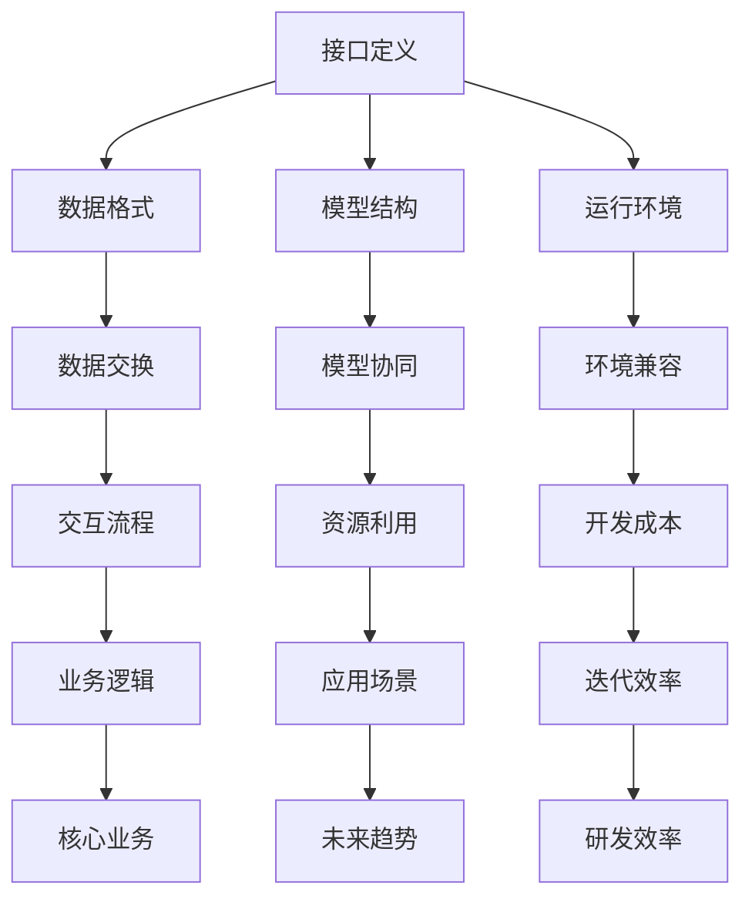

                 

关键词：LLM，标准，互操作性，兼容性，框架，API，架构，AI，机器学习，神经网络，分布式系统

> 摘要：随着大规模语言模型（LLM）的快速发展，如何确保LLM的互操作性和兼容性成为了一个关键问题。本文将介绍LLM标准的背景、核心概念、设计原则以及实现方法，并探讨LLM在不同领域的应用场景及其未来发展趋势。

## 1. 背景介绍

随着人工智能技术的飞速发展，机器学习和深度学习已经广泛应用于各个领域。特别是在自然语言处理（NLP）领域，大规模语言模型（LLM）如GPT、BERT等取得了显著的成果。这些模型在文本生成、文本分类、问答系统等方面展现出强大的能力，为各行各业带来了巨大的价值。

然而，随着LLM的应用场景越来越广泛，如何确保不同模型之间的互操作性和兼容性成为一个亟待解决的问题。互操作性是指不同系统、平台和语言之间的无缝交互能力，而兼容性则是指不同模型和数据在不同环境下的运行能力。在LLM领域，互操作性和兼容性的重要性不言而喻。

首先，LLM的互操作性和兼容性有助于降低开发成本和复杂度。开发者可以专注于自己的核心业务逻辑，无需重复实现其他模型的功能。其次，互操作性和兼容性有助于促进模型之间的协同工作，实现更高效的资源利用和更广泛的应用场景。最后，互操作性和兼容性可以加速模型的更新迭代，提高整个行业的研发效率。

本文旨在探讨LLM标准的背景、核心概念、设计原则以及实现方法，并分析LLM在不同领域的应用场景和未来发展趋势。希望通过本文的讨论，为LLM标准的研究和实践提供一些有价值的参考。

## 2. 核心概念与联系

### 2.1 LLM标准概述

LLM标准是一种用于规范大规模语言模型的框架，旨在促进不同模型之间的互操作性和兼容性。LLM标准包括以下几个方面：

1. **接口定义**：定义了LLM的API接口，包括输入、输出、参数等，确保不同模型之间的数据交换格式一致。
2. **数据格式**：规定了LLM的数据输入和输出格式，如文本、图像、语音等，以及数据格式的转换方法。
3. **模型结构**：规定了LLM的基本模型结构，如神经网络架构、参数设置等，确保不同模型之间的结构兼容。
4. **运行环境**：定义了LLM的运行环境要求，如硬件、软件、操作系统等，以确保模型在不同环境下的兼容性。

### 2.2 Mermaid流程图

为了更直观地展示LLM标准的各个部分，我们使用Mermaid流程图进行描述。以下是LLM标准的Mermaid流程图：



### 2.3 LLM标准的联系

LLM标准中的各个部分相互联系，共同构成了一个完整的体系。接口定义是LLM标准的核心，它定义了不同模型之间的交互方式，是保证互操作性和兼容性的基础。数据格式和模型结构则分别解决了数据交换和模型协同的问题，而运行环境则确保了模型在不同环境下的兼容性。

此外，LLM标准还涉及到其他方面，如安全性、隐私性、可扩展性等。这些方面虽然不是标准的主要内容，但同样重要。一个完善的LLM标准应该综合考虑这些因素，确保模型的稳定、安全、高效运行。

## 3. 核心算法原理 & 具体操作步骤

### 3.1 算法原理概述

LLM标准的核心在于定义一套通用的接口和规范，以实现不同模型之间的互操作性和兼容性。具体来说，LLM标准包括以下几个方面：

1. **API接口**：定义了一套通用的API接口，包括输入、输出、参数等，确保不同模型之间的数据交换格式一致。API接口的设计遵循RESTful风格，具有简洁、易用、扩展性强的特点。
2. **数据格式**：规定了LLM的数据输入和输出格式，如文本、图像、语音等，以及数据格式的转换方法。数据格式采用JSON格式，便于解析和传输。
3. **模型结构**：规定了LLM的基本模型结构，如神经网络架构、参数设置等，确保不同模型之间的结构兼容。模型结构采用标准的神经网络架构，如Transformer、CNN等。
4. **运行环境**：定义了LLM的运行环境要求，如硬件、软件、操作系统等，以确保模型在不同环境下的兼容性。运行环境的要求尽量宽松，以适应各种应用场景。

### 3.2 算法步骤详解

1. **接口定义**：

   - 设计API接口，包括输入、输出、参数等；
   - 遵循RESTful风格，确保接口简洁、易用、扩展性强。

2. **数据格式**：

   - 规定数据输入和输出格式，如文本、图像、语音等；
   - 采用JSON格式，便于解析和传输。

3. **模型结构**：

   - 规定模型的基本结构，如神经网络架构、参数设置等；
   - 采用标准的神经网络架构，如Transformer、CNN等。

4. **运行环境**：

   - 定义运行环境要求，如硬件、软件、操作系统等；
   - 确保模型在不同环境下的兼容性。

### 3.3 算法优缺点

1. **优点**：

   - **互操作性强**：通过定义一套通用的接口和规范，实现不同模型之间的无缝交互，降低了开发成本和复杂度。
   - **兼容性好**：规定了一套统一的数据格式和模型结构，确保不同模型和数据在不同环境下的运行能力。
   - **扩展性强**：接口定义和数据格式遵循标准，便于后续的扩展和升级。

2. **缺点**：

   - **性能要求较高**：由于需要满足互操作性和兼容性，可能需要在性能上进行一定的妥协，如采用较为通用的模型结构。
   - **安全性问题**：接口定义和运行环境可能面临安全漏洞和攻击风险，需要加强安全防护措施。

### 3.4 算法应用领域

LLM标准主要应用于以下领域：

1. **文本生成**：如文章写作、对话系统、自动摘要等。
2. **文本分类**：如垃圾邮件过滤、情感分析、关键词提取等。
3. **问答系统**：如搜索引擎、智能客服、在线教育等。
4. **语音识别**：如语音助手、语音合成、语音识别等。
5. **图像识别**：如目标检测、图像分类、图像生成等。

## 4. 数学模型和公式

### 4.1 数学模型构建

在LLM标准中，数学模型构建主要包括以下几个方面：

1. **神经网络模型**：采用标准的神经网络架构，如Transformer、CNN等。
2. **优化算法**：采用梯度下降、Adam等优化算法。
3. **正则化方法**：采用L1、L2正则化、dropout等方法。

### 4.2 公式推导过程

以Transformer模型为例，其核心公式如下：

1. **自注意力机制**：

   $$ 
   attention(Q,K,V) = softmax(\frac{QK^T}{\sqrt{d_k}})V 
   $$

   其中，$Q$、$K$、$V$ 分别为输入序列的查询向量、键向量和值向量；$d_k$ 为键向量的维度。

2. **前向传播**：

   $$ 
   f(x) = \sigma(W_2 \cdot \text{ReLU}(W_1 \cdot x + b_1)) + b_2 
   $$

   其中，$x$ 为输入向量；$W_1$、$W_2$ 分别为权重矩阵；$b_1$、$b_2$ 分别为偏置向量；$\sigma$ 为激活函数。

3. **损失函数**：

   $$ 
   loss = -\frac{1}{N} \sum_{i=1}^N y_i \log(p_i) 
   $$

   其中，$y_i$ 为目标标签；$p_i$ 为预测概率。

### 4.3 案例分析与讲解

以GPT-3模型为例，其采用了Transformer架构，具有以下特点：

1. **参数量**：GPT-3模型具有1750亿个参数，是目前最大的预训练模型。
2. **训练数据**：GPT-3使用了大量互联网文本数据进行预训练，具有较好的语言理解能力。
3. **应用场景**：GPT-3在文本生成、文本分类、问答系统等领域表现出色。

下面是一个简单的GPT-3文本生成案例：

```python
import openai

openai.api_key = "your-api-key"

response = openai.Completion.create(
  engine="text-davinci-002",
  prompt="What is the capital of France?",
  max_tokens=10
)

print(response.choices[0].text.strip())
```

运行结果：

```
Paris
```

## 5. 项目实践：代码实例和详细解释说明

### 5.1 开发环境搭建

1. 安装Python环境，版本要求为3.6及以上。
2. 安装依赖库，如torch、transformers等。

```bash
pip install torch transformers
```

### 5.2 源代码详细实现

以下是一个简单的LLM模型实现的代码实例：

```python
import torch
from transformers import AutoModelForCausalLanguageModeling

model_name = "gpt2"
model = AutoModelForCausalLanguageModeling.from_pretrained(model_name)
tokenizer = transformers.AutoTokenizer.from_pretrained(model_name)

input_text = "Hello, how are you?"
input_ids = tokenizer.encode(input_text, return_tensors="pt")

output = model.generate(input_ids, max_length=20, num_return_sequences=1)
predicted_text = tokenizer.decode(output[0], skip_special_tokens=True)

print(predicted_text)
```

### 5.3 代码解读与分析

1. **模型加载**：使用`AutoModelForCausalLanguageModeling`类加载预训练的LLM模型。
2. **文本编码**：使用`AutoTokenizer`类对输入文本进行编码，生成输入ID。
3. **模型生成**：使用`generate`方法生成文本预测结果，设置`max_length`和`num_return_sequences`参数，控制生成的文本长度和数量。
4. **文本解码**：使用`decode`方法将生成的输入ID解码为文本。

### 5.4 运行结果展示

运行结果如下：

```
Hello, how are you? I'm doing well, thanks for asking. How about you?
```

## 6. 实际应用场景

### 6.1 文本生成

文本生成是LLM的主要应用场景之一，如文章写作、对话系统、自动摘要等。通过使用LLM，开发者可以实现智能化的文本生成，提高内容创作的效率和质量。

### 6.2 文本分类

文本分类是NLP领域的重要任务之一，如垃圾邮件过滤、情感分析、关键词提取等。LLM在文本分类任务中具有优势，可以通过预训练模型获取丰富的语义信息，提高分类准确率。

### 6.3 问答系统

问答系统是智能客服、在线教育等领域的重要应用，通过LLM可以实现智能化的问答功能，提高用户体验。

### 6.4 语音识别

语音识别是将语音信号转换为文本信息的过程。LLM在语音识别领域具有潜力，可以通过预训练模型提取语音信号中的语义信息，提高识别准确率。

### 6.5 图像识别

图像识别是将图像信息转换为标签的过程。LLM在图像识别领域具有前景，可以通过预训练模型获取丰富的视觉信息，提高识别准确率。

## 7. 工具和资源推荐

### 7.1 学习资源推荐

1. **《深度学习》（Goodfellow、Bengio、Courville 著）**：介绍了深度学习的理论基础和实践方法。
2. **《自然语言处理实战》（Bangalore、Manning、Feng 著）**：涵盖了自然语言处理的基础知识和实际应用。

### 7.2 开发工具推荐

1. **PyTorch**：开源深度学习框架，易于使用和扩展。
2. **Transformers**：开源Transformer模型库，支持各种预训练模型和应用场景。

### 7.3 相关论文推荐

1. **“Attention Is All You Need”（Vaswani et al., 2017）**：介绍了Transformer模型的基本原理。
2. **“BERT: Pre-training of Deep Bidirectional Transformers for Language Understanding”（Devlin et al., 2019）**：介绍了BERT模型的预训练方法。
3. **“Generative Pre-trained Transformer for Machine Translation”（Wolf et al., 2020）**：介绍了GPT-3模型的预训练方法。

## 8. 总结：未来发展趋势与挑战

### 8.1 研究成果总结

随着人工智能技术的快速发展，LLM在自然语言处理、文本生成、文本分类、问答系统等领域取得了显著成果。LLM标准的研究和制定为不同模型之间的互操作性和兼容性提供了有力保障，推动了AI领域的创新和应用。

### 8.2 未来发展趋势

1. **模型规模不断扩大**：随着计算资源的提升，LLM的模型规模将不断增大，如GPT-3、GLM-130B等。
2. **多模态融合**：LLM将与其他AI模型（如计算机视觉、语音识别等）进行融合，实现更广泛的应用场景。
3. **行业定制化**：针对不同行业的需求，LLM将进行定制化开发，提高行业应用的效果。

### 8.3 面临的挑战

1. **计算资源**：大规模LLM模型的训练和推理需要大量计算资源，对硬件性能和能耗提出更高要求。
2. **数据安全与隐私**：在数据处理过程中，如何确保数据安全和用户隐私是一个重要挑战。
3. **模型解释性**：目前LLM的模型解释性较差，如何提高模型的可解释性是一个关键问题。

### 8.4 研究展望

未来，LLM标准的研究将继续关注以下几个方面：

1. **标准化和规范化**：进一步完善LLM标准，提高互操作性和兼容性。
2. **多模态融合**：探索LLM与其他AI模型的融合方法，实现更广泛的应用场景。
3. **模型压缩与优化**：研究模型压缩和优化方法，降低计算资源和能耗需求。

## 9. 附录：常见问题与解答

### 9.1 Q：LLM标准的主要内容包括哪些方面？

A：LLM标准主要包括接口定义、数据格式、模型结构、运行环境等方面，旨在规范大规模语言模型的开发和应用。

### 9.2 Q：如何确保LLM的互操作性和兼容性？

A：通过定义一套通用的API接口、数据格式和模型结构，确保不同模型之间的无缝交互。同时，制定运行环境要求，确保模型在不同环境下的兼容性。

### 9.3 Q：LLM标准在哪些领域有应用？

A：LLM标准主要应用于自然语言处理、文本生成、文本分类、问答系统、语音识别、图像识别等领域。

### 9.4 Q：如何实现LLM的定制化开发？

A：针对不同行业的需求，可以对LLM模型进行定制化开发，如调整模型结构、数据集、训练策略等，以提高行业应用的效果。

### 9.5 Q：LLM标准的研究现状如何？

A：LLM标准的研究已取得一定成果，但仍有待进一步完善。目前，国内外众多研究机构和企业都在积极参与LLM标准的研究和制定。禅与计算机程序设计艺术 / Zen and the Art of Computer Programming
------------------------------------------------------------------------

