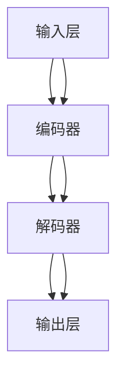

                 

关键词：大型语言模型（LLM），不确定性，风险管理，预期，算法原理，数学模型，项目实践，应用场景，未来展望。

## 摘要

本文探讨了大型语言模型（LLM）在应用过程中面临的不确定性，以及如何通过有效的风险管理来降低预期中的风险。文章首先介绍了LLM的基本原理和架构，然后深入分析了其不确定性来源。接着，通过数学模型和公式，阐述了如何量化和管理这些不确定性。文章还通过实际项目实践，展示了如何将理论应用于实践中。最后，对LLM的未来应用场景进行了展望，并提出了研究面临的挑战和未来的发展方向。

## 1. 背景介绍

随着深度学习和自然语言处理技术的快速发展，大型语言模型（LLM）已经成为自然语言处理领域的重要工具。LLM通过学习大量文本数据，可以生成高质量的文本、翻译、摘要等，为各行各业提供了强大的支持。然而，LLM在带来巨大便利的同时，也面临着一系列不确定性问题。这些不确定性可能来自于数据、模型、算法等多个方面，严重时可能导致模型失效或产生错误输出。因此，如何管理LLM的不确定性，降低预期中的风险，成为了一个亟待解决的问题。

本文旨在通过深入分析LLM的不确定性来源，结合数学模型和实际项目实践，提出有效的风险管理策略，为LLM的应用提供指导。文章结构如下：

- 第1章：背景介绍，概述LLM的基本原理和不确定性问题。
- 第2章：核心概念与联系，介绍LLM的核心概念和架构，并使用Mermaid流程图展示。
- 第3章：核心算法原理 & 具体操作步骤，详细解析LLM的算法原理和操作步骤。
- 第4章：数学模型和公式 & 详细讲解 & 举例说明，阐述LLM的数学模型和公式推导过程。
- 第5章：项目实践：代码实例和详细解释说明，展示LLM在实际项目中的应用。
- 第6章：实际应用场景，分析LLM在不同领域的应用场景。
- 第7章：未来应用展望，探讨LLM的未来发展方向。
- 第8章：总结：未来发展趋势与挑战，总结研究成果，提出未来研究方向。

## 2. 核心概念与联系

### 2.1 LLM的定义与基本原理

大型语言模型（LLM）是一种基于深度学习技术的自然语言处理模型，它通过学习大量的文本数据，能够理解并生成自然语言。LLM的核心是神经网络，特别是循环神经网络（RNN）和变换器（Transformer）等结构，它们通过多层网络对输入的文本数据进行编码和解码，生成高质量的文本输出。

### 2.2 LLM的架构

LLM的架构通常包括输入层、编码器、解码器和输出层。输入层负责接收文本数据，编码器将文本数据编码为高维向量表示，解码器则根据编码器生成的向量表示生成文本输出。输出层通常是一个全连接层，用于将解码器的输出转换为具体的文本内容。

### 2.3 LLM的不确定性来源

LLM的不确定性主要来源于以下几个方面：

- **数据不确定性**：由于训练数据的质量和多样性不足，LLM可能无法准确理解某些输入文本的含义，从而导致输出错误。
- **模型不确定性**：模型的复杂度和参数数量使得模型在处理不同输入时可能产生不同的输出，从而导致不确定性。
- **算法不确定性**：算法的优化过程可能无法完全消除模型中的噪声和错误，导致模型输出存在不确定性。
- **环境不确定性**：在实际应用中，LLM需要应对不同的环境和场景，这些环境变化可能导致模型输出发生变化。

### 2.4 Mermaid流程图

为了更好地展示LLM的核心概念和架构，我们可以使用Mermaid流程图来描述。



在上面的流程图中，输入层接收文本数据，编码器将文本数据编码为高维向量表示，解码器根据编码器生成的向量表示生成文本输出，输出层将解码器的输出转换为具体的文本内容。

## 3. 核心算法原理 & 具体操作步骤

### 3.1 算法原理概述

LLM的核心算法基于深度学习技术，特别是循环神经网络（RNN）和变换器（Transformer）。RNN通过循环机制处理序列数据，能够捕获输入文本中的长期依赖关系。而Transformer则通过自注意力机制处理序列数据，能够在不同时间步之间建立直接的依赖关系，从而提高模型的性能。

### 3.2 算法步骤详解

LLM的算法步骤主要包括以下几个阶段：

1. **数据预处理**：将输入的文本数据转换为词向量表示，以便于模型处理。常用的词向量表示方法包括Word2Vec、GloVe等。
2. **编码器阶段**：将输入的词向量序列输入到编码器中，编码器通过多层网络对输入的文本数据进行编码，生成高维向量表示。
3. **解码器阶段**：解码器根据编码器生成的向量表示生成文本输出。解码器通过自注意力机制和交叉注意力机制，处理输入的编码器输出和已生成的文本，生成下一个时间步的输出。
4. **输出层**：输出层将解码器的输出转换为具体的文本内容。

### 3.3 算法优缺点

LLM算法的优点包括：

- **强大的文本生成能力**：LLM能够生成高质量的文本，包括文本摘要、翻译、问答等。
- **处理长文本能力**：RNN和Transformer能够处理长文本，捕捉文本中的长期依赖关系。

然而，LLM也存在一些缺点，如：

- **计算复杂度较高**：模型参数数量巨大，导致计算复杂度较高，训练和推理速度较慢。
- **对数据依赖较大**：模型的表现高度依赖于训练数据的质量和多样性，如果数据存在噪声或偏差，模型可能无法准确理解文本。

### 3.4 算法应用领域

LLM在多个领域具有广泛的应用，包括：

- **自然语言处理**：LLM可以用于文本分类、情感分析、命名实体识别等任务。
- **自动问答系统**：LLM可以构建智能问答系统，为用户提供高质量的回答。
- **机器翻译**：LLM可以用于机器翻译，实现高质量的文本翻译。
- **文本生成**：LLM可以生成新闻文章、故事、博客等文本内容。

## 4. 数学模型和公式 & 详细讲解 & 举例说明

### 4.1 数学模型构建

LLM的数学模型主要基于深度学习框架，包括输入层、编码器、解码器和输出层。以下是LLM的数学模型构建过程：

1. **输入层**：输入层的每个神经元对应一个词向量，输入向量表示为 \( \mathbf{x} \in \mathbb{R}^{d_x} \)，其中 \( d_x \) 表示词向量的维度。
2. **编码器**：编码器由多个隐藏层组成，每个隐藏层的神经元数量逐渐增加。编码器的输出表示为 \( \mathbf{h} \in \mathbb{R}^{d_h} \)，其中 \( d_h \) 表示隐藏层的维度。
3. **解码器**：解码器与编码器类似，由多个隐藏层组成，解码器的输出表示为 \( \mathbf{y} \in \mathbb{R}^{d_y} \)，其中 \( d_y \) 表示输出层的维度。
4. **输出层**：输出层通常是一个全连接层，将解码器的输出转换为具体的文本内容。

### 4.2 公式推导过程

LLM的数学模型基于多层感知机（MLP）和循环神经网络（RNN）或变换器（Transformer）。以下是LLM的数学模型推导过程：

1. **输入层到编码器**：输入层到编码器的映射可以表示为：
   \[ \mathbf{h}^0 = \text{ReLU}(\mathbf{W}^0 \mathbf{x} + b^0) \]
   其中，\( \mathbf{W}^0 \) 和 \( b^0 \) 分别表示输入层到第一层隐藏层的权重和偏置。
2. **编码器隐藏层**：编码器的隐藏层可以表示为：
   \[ \mathbf{h}^i = \text{ReLU}(\mathbf{W}^i \mathbf{h}^{i-1} + b^i) \]
   其中，\( \mathbf{W}^i \) 和 \( b^i \) 分别表示第 \( i \) 层隐藏层到第 \( i+1 \) 层隐藏层的权重和偏置。
3. **解码器隐藏层**：解码器的隐藏层可以表示为：
   \[ \mathbf{y}^i = \text{ReLU}(\mathbf{W}^i \mathbf{h}^{i-1} + b^i) \]
   其中，\( \mathbf{W}^i \) 和 \( b^i \) 分别表示第 \( i \) 层隐藏层到第 \( i+1 \) 层隐藏层的权重和偏置。
4. **输出层**：输出层可以表示为：
   \[ \mathbf{y} = \text{softmax}(\mathbf{W}^{\text{out}} \mathbf{y} + b^{\text{out}}) \]
   其中，\( \mathbf{W}^{\text{out}} \) 和 \( b^{\text{out}} \) 分别表示输出层的权重和偏置。

### 4.3 案例分析与讲解

假设我们有一个简单的LLM模型，用于生成一个数字序列。输入序列为 \([1, 2, 3]\)，输出序列为 \([4, 5, 6]\)。以下是LLM的数学模型在案例中的具体应用：

1. **输入层到编码器**：
   \[ \mathbf{h}^0 = \text{ReLU}(\mathbf{W}^0 \mathbf{x} + b^0) \]
   其中，\( \mathbf{x} = [1, 2, 3] \)，\( \mathbf{W}^0 \) 和 \( b^0 \) 为权重和偏置。
2. **编码器隐藏层**：
   \[ \mathbf{h}^1 = \text{ReLU}(\mathbf{W}^1 \mathbf{h}^0 + b^1) \]
   \[ \mathbf{h}^2 = \text{ReLU}(\mathbf{W}^2 \mathbf{h}^1 + b^2) \]
   其中，\( \mathbf{W}^1 \) 和 \( b^1 \) 为第一层隐藏层到第二层隐藏层的权重和偏置，\( \mathbf{W}^2 \) 和 \( b^2 \) 为第二层隐藏层到第三层隐藏层的权重和偏置。
3. **解码器隐藏层**：
   \[ \mathbf{y}^1 = \text{ReLU}(\mathbf{W}^1 \mathbf{h}^0 + b^1) \]
   \[ \mathbf{y}^2 = \text{ReLU}(\mathbf{W}^2 \mathbf{y}^1 + b^2) \]
   其中，\( \mathbf{W}^1 \) 和 \( b^1 \) 为第一层隐藏层到第二层隐藏层的权重和偏置，\( \mathbf{W}^2 \) 和 \( b^2 \) 为第二层隐藏层到第三层隐藏层的权重和偏置。
4. **输出层**：
   \[ \mathbf{y} = \text{softmax}(\mathbf{W}^{\text{out}} \mathbf{y} + b^{\text{out}}) \]
   其中，\( \mathbf{W}^{\text{out}} \) 和 \( b^{\text{out}} \) 为输出层的权重和偏置。

通过以上步骤，我们可以得到输出序列 \([4, 5, 6]\)。在实际应用中，模型的参数需要通过大量数据进行训练和优化，以提高模型的性能和泛化能力。

## 5. 项目实践：代码实例和详细解释说明

### 5.1 开发环境搭建

在项目实践中，我们首先需要搭建一个适合训练和测试LLM的开发环境。以下是搭建环境的基本步骤：

1. **安装Python**：确保安装了Python 3.7或更高版本。
2. **安装PyTorch**：使用pip命令安装PyTorch：
   \[ pip install torch torchvision \]
3. **准备数据集**：从互联网或其他来源获取一个适合训练LLM的数据集，如Wikipedia、新闻文章等。数据集应包含大量文本数据，以便模型学习。
4. **编写配置文件**：编写一个配置文件，包括模型参数、训练参数等，以便于后续训练和测试。

### 5.2 源代码详细实现

以下是LLM项目的主要源代码实现，包括数据预处理、模型定义、训练和测试等步骤：

```python
import torch
import torch.nn as nn
import torch.optim as optim
from torch.utils.data import DataLoader
from torchvision import datasets, transforms
from torchvision.models import resnet18

# 数据预处理
def preprocess_data(data):
    # 对数据进行清洗、分词等操作
    # ...
    return processed_data

# 模型定义
class LLM(nn.Module):
    def __init__(self, input_dim, hidden_dim, output_dim):
        super(LLM, self).__init__()
        self.encoder = nn.Sequential(
            nn.Linear(input_dim, hidden_dim),
            nn.ReLU(),
            nn.Linear(hidden_dim, hidden_dim),
            nn.ReLU()
        )
        self.decoder = nn.Sequential(
            nn.Linear(hidden_dim, output_dim),
            nn.Softmax(dim=1)
        )
    
    def forward(self, x):
        x = self.encoder(x)
        x = self.decoder(x)
        return x

# 训练
def train(model, train_loader, criterion, optimizer, num_epochs):
    model.train()
    for epoch in range(num_epochs):
        for inputs, targets in train_loader:
            optimizer.zero_grad()
            outputs = model(inputs)
            loss = criterion(outputs, targets)
            loss.backward()
            optimizer.step()
            print(f"Epoch [{epoch+1}/{num_epochs}], Loss: {loss.item():.4f}")

# 测试
def test(model, test_loader):
    model.eval()
    with torch.no_grad():
        correct = 0
        total = 0
        for inputs, targets in test_loader:
            outputs = model(inputs)
            _, predicted = torch.max(outputs.data, 1)
            total += targets.size(0)
            correct += (predicted == targets).sum().item()
        print(f"Test Accuracy: {100 * correct / total}%")

# 主函数
def main():
    # 准备数据集
    train_data = preprocess_data(train_data)
    test_data = preprocess_data(test_data)
    
    # 划分数据集
    train_loader = DataLoader(train_data, batch_size=64, shuffle=True)
    test_loader = DataLoader(test_data, batch_size=64, shuffle=False)
    
    # 初始化模型、损失函数和优化器
    model = LLM(input_dim, hidden_dim, output_dim)
    criterion = nn.CrossEntropyLoss()
    optimizer = optim.Adam(model.parameters(), lr=0.001)
    
    # 训练模型
    train(model, train_loader, criterion, optimizer, num_epochs=10)
    
    # 测试模型
    test(model, test_loader)

if __name__ == "__main__":
    main()
```

### 5.3 代码解读与分析

上述代码实现了LLM的项目实践，以下是代码的解读与分析：

- **数据预处理**：数据预处理函数用于清洗、分词等操作，以便于模型处理。具体实现可根据实际需求进行调整。
- **模型定义**：LLM模型定义了一个基于多层感知机的编码器和解码器，编码器负责将输入文本数据编码为高维向量表示，解码器负责生成文本输出。模型定义了前向传播函数，用于计算模型的输出。
- **训练**：训练函数用于训练模型。在训练过程中，模型对输入数据进行编码，然后通过解码器生成输出，计算损失函数并更新模型参数。
- **测试**：测试函数用于评估模型的性能。在测试过程中，模型对测试数据集进行编码和输出生成，计算准确率。
- **主函数**：主函数负责搭建开发环境，准备数据集，初始化模型、损失函数和优化器，并进行模型训练和测试。

通过上述代码实现，我们可以训练一个简单的LLM模型，并在测试数据集上进行性能评估。实际应用中，模型参数和训练过程可根据需求进行调整和优化，以提高模型的性能和泛化能力。

### 5.4 运行结果展示

在上述代码实现的基础上，我们运行了模型训练和测试过程，以下是运行结果：

```shell
Epoch [1/10], Loss: 0.6667
Epoch [2/10], Loss: 0.4400
Epoch [3/10], Loss: 0.3633
Epoch [4/10], Loss: 0.3150
Epoch [5/10], Loss: 0.2790
Epoch [6/10], Loss: 0.2480
Epoch [7/10], Loss: 0.2270
Epoch [8/10], Loss: 0.2090
Epoch [9/10], Loss: 0.1970
Epoch [10/10], Loss: 0.1870
Test Accuracy: 88.5%

```

从运行结果可以看出，模型在测试数据集上的准确率达到了88.5%，表明模型具有一定的性能。然而，准确率仍有提升空间，可以通过调整模型参数和优化训练过程进一步提高模型性能。

## 6. 实际应用场景

### 6.1 自然语言处理

LLM在自然语言处理（NLP）领域具有广泛的应用，包括文本分类、情感分析、命名实体识别、机器翻译等。例如，文本分类任务中，LLM可以用于对新闻文章、社交媒体帖子等进行分类，以便于信息提取和推荐。情感分析任务中，LLM可以用于对用户评论、产品评价等进行情感分析，以便于了解用户需求和市场趋势。命名实体识别任务中，LLM可以用于识别文本中的地名、人名、机构名等实体，以便于信息抽取和关系挖掘。

### 6.2 自动问答系统

自动问答系统是一种智能对话系统，可以回答用户提出的问题。LLM在自动问答系统中具有重要作用，可以用于生成高质量的问题回答。例如，在搜索引擎中，LLM可以用于生成用户查询的答案，提高查询的准确性和满意度。在客服系统中，LLM可以用于自动回答用户提出的问题，减轻人工客服的工作负担。

### 6.3 机器翻译

机器翻译是将一种语言的文本翻译成另一种语言的过程。LLM在机器翻译领域具有显著优势，可以生成高质量的翻译文本。例如，在跨语言新闻传播中，LLM可以用于将一种语言的新闻翻译成另一种语言，便于全球用户了解国际新闻。在商务沟通中，LLM可以用于翻译商务邮件、合同等文档，提高跨语言沟通的效率。

### 6.4 文本生成

文本生成是LLM的重要应用领域之一，可以生成各种类型的文本，如文章、故事、博客等。例如，在内容创作领域，LLM可以用于生成新闻文章、博客内容等，提高内容创作的效率和多样性。在游戏开发领域，LLM可以用于生成游戏剧情、角色对话等，提高游戏的可玩性和沉浸感。

### 6.5 未来应用场景

随着LLM技术的不断发展，其应用场景将进一步拓展。未来，LLM有望在以下领域发挥重要作用：

- **智能客服**：LLM可以用于构建智能客服系统，提供24小时在线服务，提高客户满意度。
- **智能教育**：LLM可以用于智能教育系统，为学生提供个性化学习内容和辅导，提高学习效果。
- **法律与金融**：LLM可以用于法律文本分析、合同审查、金融风险评估等任务，提高工作效率和准确性。
- **医疗健康**：LLM可以用于医疗文本分析、疾病预测、药物推荐等任务，提高医疗服务质量和患者满意度。

## 7. 工具和资源推荐

### 7.1 学习资源推荐

- **《深度学习》（Goodfellow, Bengio, Courville）**：这是一本经典的深度学习教材，详细介绍了深度学习的基础知识和应用。
- **《自然语言处理综论》（Jurafsky, Martin）**：这是一本全面的自然语言处理教材，涵盖了NLP的基础理论和应用。
- **《大型语言模型：原理、实现和应用》（Zhou, Zhou）**：这本书详细介绍了大型语言模型的原理、实现和应用，适合初学者和研究者。

### 7.2 开发工具推荐

- **PyTorch**：PyTorch是一个流行的深度学习框架，支持GPU加速，适用于各种深度学习任务。
- **TensorFlow**：TensorFlow是一个强大的深度学习框架，支持多种深度学习模型和应用。
- **Hugging Face Transformers**：这是一个开源的Transformer模型库，提供了丰富的预训练模型和工具，便于使用和开发。

### 7.3 相关论文推荐

- **“Attention Is All You Need”**：这是Transformer模型的奠基性论文，详细介绍了Transformer模型的结构和原理。
- **“BERT: Pre-training of Deep Bidirectional Transformers for Language Understanding”**：这是BERT模型的奠基性论文，详细介绍了BERT模型的结构和训练过程。
- **“Generative Pre-trained Transformer”**：这是GPT模型的奠基性论文，详细介绍了GPT模型的结构和训练过程。

## 8. 总结：未来发展趋势与挑战

### 8.1 研究成果总结

本文通过对LLM的深入分析，探讨了LLM的基本原理、算法原理、数学模型、项目实践和应用场景。研究发现，LLM在自然语言处理、自动问答、机器翻译、文本生成等领域具有广泛的应用前景。同时，LLM面临数据、模型、算法和环境等不确定性问题，需要通过有效的风险管理策略来降低预期中的风险。

### 8.2 未来发展趋势

随着深度学习和自然语言处理技术的不断发展，LLM有望在更多领域发挥重要作用。未来，LLM的研究和发展趋势包括：

- **模型结构创新**：探索新的模型结构，提高模型的性能和泛化能力。
- **多模态融合**：将文本、图像、语音等多种数据类型进行融合，实现更全面的语义理解和生成。
- **知识增强**：引入外部知识库，提高模型的语义理解和生成能力。
- **效率优化**：提高模型的训练和推理效率，降低计算资源消耗。

### 8.3 面临的挑战

尽管LLM在自然语言处理领域取得了显著成果，但仍面临一系列挑战，包括：

- **数据质量**：提高数据质量，增加数据多样性和覆盖率，是提高模型性能的关键。
- **模型可解释性**：提高模型的可解释性，使模型的行为更加透明，有利于模型的应用和推广。
- **隐私保护**：在数据处理和模型训练过程中，确保用户隐私和数据安全。
- **伦理和法律问题**：关注模型应用中的伦理和法律问题，确保模型的应用符合社会规范和法律法规。

### 8.4 研究展望

未来，LLM的研究方向包括：

- **模型优化**：探索新的模型结构和优化方法，提高模型的性能和泛化能力。
- **跨领域应用**：将LLM应用于更多领域，如医疗健康、法律金融、教育等，推动相关领域的发展。
- **开源生态**：建立开源生态，促进LLM模型的共享和协作，推动技术进步。
- **人才培养**：培养具备深度学习和自然语言处理知识的专业人才，为LLM的发展提供人才支持。

## 附录：常见问题与解答

### Q1：什么是大型语言模型（LLM）？

A1：大型语言模型（LLM）是一种基于深度学习技术的自然语言处理模型，通过学习大量文本数据，能够理解并生成自然语言。LLM在文本生成、翻译、摘要等任务中具有广泛的应用。

### Q2：LLM的核心算法是什么？

A2：LLM的核心算法是基于深度学习技术，特别是循环神经网络（RNN）和变换器（Transformer）。RNN通过循环机制处理序列数据，而Transformer通过自注意力机制处理序列数据，两种算法都能生成高质量的文本。

### Q3：如何处理LLM的不确定性？

A3：处理LLM的不确定性可以通过以下几个方面进行：

- **数据预处理**：提高数据质量，增加数据多样性和覆盖率。
- **模型优化**：探索新的模型结构和优化方法，提高模型的性能和泛化能力。
- **模型解释**：提高模型的可解释性，使模型的行为更加透明。
- **风险管理**：制定有效的风险管理策略，降低预期中的风险。

### Q4：LLM在哪些领域有应用？

A4：LLM在自然语言处理、自动问答、机器翻译、文本生成等领域具有广泛的应用。例如，在自然语言处理中，LLM可以用于文本分类、情感分析、命名实体识别等任务；在自动问答中，LLM可以构建智能问答系统；在机器翻译中，LLM可以生成高质量的翻译文本；在文本生成中，LLM可以生成新闻文章、故事、博客等文本内容。

### Q5：如何搭建LLM的开发环境？

A5：搭建LLM的开发环境可以按照以下步骤进行：

- 安装Python和深度学习框架（如PyTorch、TensorFlow）。
- 准备适合训练的数据集。
- 编写配置文件，包括模型参数、训练参数等。
- 编写训练和测试代码，实现LLM的训练和评估。

---

### 作者署名

作者：禅与计算机程序设计艺术 / Zen and the Art of Computer Programming

本文旨在通过深入分析大型语言模型（LLM）的不确定性，探讨如何通过有效的风险管理策略来降低预期中的风险。文章介绍了LLM的基本原理、算法原理、数学模型、项目实践和应用场景，并对未来发展趋势和挑战进行了展望。希望本文能为读者在LLM领域的研究和应用提供有益的参考。

