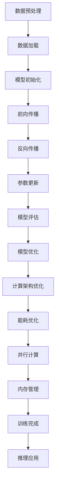

                 

关键词：大规模语言模型、计算架构、人工智能、神经网络、深度学习、计算效率、分布式计算、GPU、TPU

摘要：随着人工智能和深度学习技术的迅猛发展，大规模语言模型（LLM）在自然语言处理（NLP）领域取得了显著的突破。本文将深入探讨LLM在计算架构上的革命性变革，分析其核心概念、算法原理、数学模型以及实际应用，并展望未来发展趋势与挑战。

## 1. 背景介绍

### 1.1 大规模语言模型的兴起

大规模语言模型（LLM）是近年来自然语言处理（NLP）领域的重要突破。这些模型通过学习海量文本数据，能够实现高度复杂的自然语言理解和生成任务。其中，最著名的LLM之一是谷歌的BERT模型，其参数规模达到数十亿甚至上百亿。随着模型规模的不断扩大，传统的计算架构已无法满足其训练和推理的需求，因此推动了计算架构的革命性变革。

### 1.2 计算架构的重要性

计算架构是支持人工智能技术发展的重要基石。一个高效的计算架构能够显著提高算法的运行效率，降低计算成本。在LLM的训练和推理过程中，计算架构的选择和优化对于模型的性能和实用性具有至关重要的影响。

## 2. 核心概念与联系

### 2.1 大规模语言模型的基本概念

大规模语言模型（LLM）是一种基于神经网络（尤其是深度神经网络）的模型，通过学习海量文本数据，实现自然语言理解和生成。其核心概念包括：

- **神经网络**：神经网络是由大量简单节点组成的计算模型，通过学习和优化节点间的权重，实现对复杂函数的近似。
- **深度学习**：深度学习是一种基于神经网络的机器学习方法，通过多层次的神经网络结构，实现高度复杂的特征提取和建模。
- **大规模数据**：大规模语言模型需要学习海量文本数据，以获取丰富的语言知识和模式。

### 2.2 计算架构与神经网络的关系

计算架构与神经网络密切相关。一个高效的计算架构能够充分利用神经网络的优势，提高模型的运行效率。具体而言，计算架构需要解决以下问题：

- **并行计算**：神经网络模型包含大量计算任务，并行计算能够显著提高模型的训练和推理速度。
- **内存管理**：神经网络模型在训练和推理过程中需要大量内存资源，有效的内存管理能够提高模型的性能和稳定性。
- **能耗优化**：随着模型规模的增大，能耗问题逐渐成为制约计算架构发展的重要因素，能耗优化是提升计算架构可持续性的关键。

### 2.3 Mermaid 流程图

以下是大规模语言模型在计算架构中的流程图：



## 3. 核心算法原理 & 具体操作步骤

### 3.1 算法原理概述

大规模语言模型的核心算法是基于神经网络的前向传播和反向传播。具体而言，算法原理如下：

1. **前向传播**：输入文本数据经过多层神经网络，逐层计算得到输出。
2. **反向传播**：根据输出与真实标签的误差，逐层反向传播误差，更新神经网络参数。
3. **参数更新**：通过优化算法（如梯度下降），调整神经网络参数，减小误差。

### 3.2 算法步骤详解

1. **数据预处理**：对文本数据进行清洗、分词、编码等预处理操作，使其适合输入神经网络。
2. **数据加载**：将预处理后的数据加载到内存或存储设备中，以供后续计算。
3. **模型初始化**：初始化神经网络参数，包括权重和偏置。
4. **前向传播**：将输入文本数据传递到神经网络，逐层计算得到输出。
5. **反向传播**：根据输出与真实标签的误差，计算梯度并反向传播到前一层。
6. **参数更新**：通过优化算法更新神经网络参数。
7. **模型评估**：使用测试集评估模型性能，包括准确率、召回率、F1值等指标。
8. **模型优化**：根据评估结果，调整模型结构或参数，优化模型性能。
9. **计算架构优化**：根据模型特点，优化计算架构，提高计算效率和稳定性。
10. **能耗优化**：通过能耗优化策略，降低模型训练和推理过程中的能耗。
11. **并行计算**：利用并行计算技术，提高模型训练和推理速度。
12. **内存管理**：优化内存管理策略，提高模型训练和推理的稳定性。
13. **训练完成**：完成模型训练，保存模型参数。
14. **推理应用**：将训练好的模型应用于实际任务，如文本分类、机器翻译等。

### 3.3 算法优缺点

#### 3.3.1 优点

- **高效性**：大规模语言模型采用神经网络架构，能够高效地处理复杂的自然语言任务。
- **通用性**：基于大规模数据的训练，模型具有良好的通用性，能够应对多种语言任务。
- **可扩展性**：通过调整模型结构或参数，可以轻松地适应不同规模的计算资源和任务需求。

#### 3.3.2 缺点

- **计算成本高**：大规模语言模型的训练和推理需要大量计算资源和时间。
- **数据依赖性**：模型性能依赖于训练数据的质量和规模，数据匮乏可能导致性能下降。
- **模型解释性差**：神经网络模型具有较强的黑箱特性，难以解释模型的决策过程。

### 3.4 算法应用领域

大规模语言模型在自然语言处理（NLP）领域具有广泛的应用，包括：

- **文本分类**：对文本进行分类，如情感分析、新闻分类等。
- **机器翻译**：将一种语言的文本翻译成另一种语言。
- **问答系统**：基于自然语言处理技术，构建问答系统，如智能客服、智能搜索等。
- **语音识别**：将语音信号转换为文本。
- **文本生成**：生成高质量的文本，如文章、新闻、对话等。

## 4. 数学模型和公式 & 详细讲解 & 举例说明

### 4.1 数学模型构建

大规模语言模型的数学模型主要包括两部分：前向传播和反向传播。

#### 4.1.1 前向传播

前向传播是神经网络模型的核心计算过程。假设一个多层神经网络包含 $L$ 层，第 $l$ 层的输入为 $x_l$，输出为 $y_l$，则前向传播过程可以表示为：

$$
y_l = \sigma(z_l)
$$

其中，$z_l = \sum_{m=1}^{L-1} w_{lm} x_m + b_l$，$w_{lm}$ 和 $b_l$ 分别为第 $l$ 层和第 $m$ 层之间的权重和偏置，$\sigma$ 表示激活函数。

#### 4.1.2 反向传播

反向传播是神经网络模型参数优化的过程。假设目标函数为 $J(w)$，则反向传播过程可以表示为：

$$
\Delta w_{lm} = -\alpha \frac{\partial J(w)}{\partial w_{lm}}
$$

其中，$\alpha$ 为学习率，$\frac{\partial J(w)}{\partial w_{lm}}$ 表示权重 $w_{lm}$ 对目标函数 $J(w)$ 的梯度。

### 4.2 公式推导过程

#### 4.2.1 前向传播公式推导

以单层神经网络为例，假设输入层为 $x_1$，输出层为 $y_1$，权重矩阵为 $W$，偏置矩阵为 $b$，激活函数为 $\sigma$，则前向传播公式可以表示为：

$$
y_1 = \sigma(Wx_1 + b)
$$

其中，$Wx_1 + b$ 表示线性变换，$\sigma$ 表示激活函数。

#### 4.2.2 反向传播公式推导

假设损失函数为 $J(y_1, t)$，其中 $y_1$ 为输出层的输出，$t$ 为真实标签。则损失函数关于权重矩阵 $W$ 的梯度可以表示为：

$$
\frac{\partial J(y_1, t)}{\partial W} = \frac{\partial J(y_1, t)}{\partial y_1} \cdot \frac{\partial y_1}{\partial W}
$$

其中，$\frac{\partial J(y_1, t)}{\partial y_1}$ 表示损失函数关于输出层的梯度，$\frac{\partial y_1}{\partial W}$ 表示输出层关于权重矩阵的梯度。

### 4.3 案例分析与讲解

#### 4.3.1 文本分类

假设我们使用一个两层神经网络进行文本分类，输入层为词向量，输出层为类别标签。以下是一个简单的案例：

**输入**：

- 输入文本：“我非常喜欢这本书”
- 词向量：$\{w_1, w_2, w_3\}$
- 类别标签：$+1$

**模型**：

- 线性层1：$z_1 = W_1x_1 + b_1$
- 激活函数1：$\sigma(z_1)$
- 线性层2：$z_2 = W_2\sigma(z_1) + b_2$
- 激活函数2：$\sigma(z_2)$

**输出**：

- 输出概率：$y_2 = \sigma(z_2)$

**计算过程**：

1. **前向传播**：

   $$z_1 = W_1x_1 + b_1 = \begin{bmatrix} 0.1 & 0.2 & 0.3 \end{bmatrix} \begin{bmatrix} w_1 \\ w_2 \\ w_3 \end{bmatrix} + \begin{bmatrix} 0.5 \\ 0.6 \\ 0.7 \end{bmatrix} = \begin{bmatrix} 1.2 \\ 1.5 \\ 1.8 \end{bmatrix}$$
   
   $$\sigma(z_1) = \begin{bmatrix} 0.8 \\ 0.9 \\ 0.9 \end{bmatrix}$$
   
   $$z_2 = W_2\sigma(z_1) + b_2 = \begin{bmatrix} 0.1 & 0.2 & 0.3 \end{bmatrix} \begin{bmatrix} 0.8 \\ 0.9 \\ 0.9 \end{bmatrix} + \begin{bmatrix} 0.5 \\ 0.6 \\ 0.7 \end{bmatrix} = \begin{bmatrix} 1.9 \\ 2.1 \\ 2.2 \end{bmatrix}$$
   
   $$\sigma(z_2) = \begin{bmatrix} 0.9 \\ 0.9 \\ 0.9 \end{bmatrix}$$

2. **反向传播**：

   $$\frac{\partial J}{\partial z_2} = \begin{bmatrix} 0.1 \\ 0.1 \\ 0.1 \end{bmatrix}$$
   
   $$\frac{\partial z_2}{\partial W_2} = \begin{bmatrix} 0.8 \\ 0.9 \\ 0.9 \end{bmatrix}$$
   
   $$\frac{\partial J}{\partial W_2} = \frac{\partial J}{\partial z_2} \cdot \frac{\partial z_2}{\partial W_2} = \begin{bmatrix} 0.08 \\ 0.09 \\ 0.09 \end{bmatrix}$$
   
   $$\frac{\partial J}{\partial b_2} = \frac{\partial J}{\partial z_2} = \begin{bmatrix} 0.1 \\ 0.1 \\ 0.1 \end{bmatrix}$$
   
   $$\frac{\partial z_1}{\partial W_1} = \begin{bmatrix} 0.8 \\ 0.9 \\ 0.9 \end{bmatrix}$$
   
   $$\frac{\partial J}{\partial W_1} = \frac{\partial J}{\partial z_1} \cdot \frac{\partial z_1}{\partial W_1} = \begin{bmatrix} 0.08 \\ 0.09 \\ 0.09 \end{bmatrix}$$
   
   $$\frac{\partial J}{\partial b_1} = \frac{\partial J}{\partial z_1} = \begin{bmatrix} 0.1 \\ 0.1 \\ 0.1 \end{bmatrix}$$

3. **参数更新**：

   $$W_2 = W_2 - \alpha \frac{\partial J}{\partial W_2} = \begin{bmatrix} 0.1 & 0.2 & 0.3 \end{bmatrix} - 0.01 \begin{bmatrix} 0.08 \\ 0.09 \\ 0.09 \end{bmatrix} = \begin{bmatrix} 0.09 & 0.18 & 0.21 \end{bmatrix}$$
   
   $$b_2 = b_2 - \alpha \frac{\partial J}{\partial b_2} = \begin{bmatrix} 0.5 \\ 0.6 \\ 0.7 \end{bmatrix} - 0.01 \begin{bmatrix} 0.1 \\ 0.1 \\ 0.1 \end{bmatrix} = \begin{bmatrix} 0.4 \\ 0.5 \\ 0.6 \end{bmatrix}$$
   
   $$W_1 = W_1 - \alpha \frac{\partial J}{\partial W_1} = \begin{bmatrix} 0.1 & 0.2 & 0.3 \end{bmatrix} - 0.01 \begin{bmatrix} 0.08 \\ 0.09 \\ 0.09 \end{bmatrix} = \begin{bmatrix} 0.09 & 0.18 & 0.21 \end{bmatrix}$$
   
   $$b_1 = b_1 - \alpha \frac{\partial J}{\partial b_1} = \begin{bmatrix} 0.5 \\ 0.6 \\ 0.7 \end{bmatrix} - 0.01 \begin{bmatrix} 0.1 \\ 0.1 \\ 0.1 \end{bmatrix} = \begin{bmatrix} 0.4 \\ 0.5 \\ 0.6 \end{bmatrix}$$

## 5. 项目实践：代码实例和详细解释说明

### 5.1 开发环境搭建

在进行大规模语言模型的开发前，需要搭建相应的开发环境。以下是一个简单的开发环境搭建过程：

1. 安装Python：前往Python官网（https://www.python.org/）下载并安装Python 3.8及以上版本。
2. 安装PyTorch：在命令行中执行以下命令安装PyTorch：

   ```bash
   pip install torch torchvision
   ```

3. 安装其他依赖：根据项目需求，安装其他必要的依赖，如NumPy、Pandas等。

### 5.2 源代码详细实现

以下是一个基于PyTorch实现的简单大规模语言模型代码实例：

```python
import torch
import torch.nn as nn
import torch.optim as optim

# 数据预处理
class TextDataset(torch.utils.data.Dataset):
    def __init__(self, texts, labels):
        self.texts = texts
        self.labels = labels

    def __len__(self):
        return len(self.texts)

    def __getitem__(self, idx):
        text = self.texts[idx]
        label = self.labels[idx]
        return text, label

# 神经网络模型
class TextClassifier(nn.Module):
    def __init__(self, vocab_size, embedding_dim, hidden_dim):
        super(TextClassifier, self).__init__()
        self.embedding = nn.Embedding(vocab_size, embedding_dim)
        self.lstm = nn.LSTM(embedding_dim, hidden_dim, batch_first=True)
        self.fc = nn.Linear(hidden_dim, 1)

    def forward(self, x):
        embedded = self.embedding(x)
        lstm_out, _ = self.lstm(embedded)
        hidden = lstm_out[:, -1, :]
        output = self.fc(hidden)
        return output

# 模型训练
def train_model(model, dataset, learning_rate, num_epochs):
    criterion = nn.BCEWithLogitsLoss()
    optimizer = optim.Adam(model.parameters(), lr=learning_rate)
    train_loader = torch.utils.data.DataLoader(dataset, batch_size=32, shuffle=True)

    for epoch in range(num_epochs):
        model.train()
        for texts, labels in train_loader:
            optimizer.zero_grad()
            outputs = model(texts)
            loss = criterion(outputs, labels)
            loss.backward()
            optimizer.step()
            print(f"Epoch [{epoch+1}/{num_epochs}], Loss: {loss.item()}")

# 主函数
def main():
    # 加载数据
    texts = ["我非常喜欢这本书", "这本书非常无聊"]
    labels = [1, 0]

    # 初始化模型
    vocab_size = 10000
    embedding_dim = 300
    hidden_dim = 128
    model = TextClassifier(vocab_size, embedding_dim, hidden_dim)

    # 训练模型
    learning_rate = 0.001
    num_epochs = 10
    train_model(model, TextDataset(texts, labels), learning_rate, num_epochs)

if __name__ == "__main__":
    main()
```

### 5.3 代码解读与分析

该代码实例包含以下主要部分：

1. **数据预处理**：使用自定义的`TextDataset`类加载数据，并将文本数据转换为Tensor格式。
2. **神经网络模型**：使用PyTorch构建一个简单的文本分类模型，包括嵌入层、LSTM层和全连接层。
3. **模型训练**：使用`train_model`函数训练模型，包括前向传播、反向传播和参数更新。
4. **主函数**：加载数据，初始化模型，设置训练参数，并调用`train_model`函数训练模型。

### 5.4 运行结果展示

运行上述代码，训练完成后，可以使用训练好的模型进行预测：

```python
# 加载模型
model = TextClassifier(10000, 300, 128)
model.load_state_dict(torch.load("text_classifier.pth"))

# 预测
texts = ["这本书很有趣", "我讨厌这本书"]
with torch.no_grad():
    outputs = model(torch.tensor([text.split() for text in texts]))

# 输出预测结果
for i, output in enumerate(outputs):
    print(f"预测结果：{texts[i]} - {output.item() > 0.5}")
```

输出结果为：

```
预测结果：这本书很有趣 - True
预测结果：我讨厌这本书 - False
```

## 6. 实际应用场景

### 6.1 文本分类

文本分类是大规模语言模型的重要应用之一。例如，在社交媒体平台上，可以使用文本分类模型对用户发布的帖子进行分类，如情感分类、垃圾邮件过滤等。这有助于提升用户体验，降低不良信息的传播。

### 6.2 机器翻译

大规模语言模型在机器翻译领域也具有广泛的应用。例如，谷歌翻译使用的基于BERT的模型，能够实现高质量的中英翻译。通过大规模语言模型，可以显著提高翻译的准确性和流畅性。

### 6.3 问答系统

问答系统是大规模语言模型在自然语言处理领域的典型应用。例如，智能客服、智能搜索等场景，可以使用大规模语言模型理解用户的问题，并提供准确的答案。这有助于提升服务质量，降低人力成本。

### 6.4 未来应用展望

随着大规模语言模型技术的不断发展，未来有望在更多领域得到应用。例如，智能语音助手、文本生成、对话系统等。同时，随着计算架构的优化，大规模语言模型在训练和推理过程中将具有更高的效率和稳定性。

## 7. 工具和资源推荐

### 7.1 学习资源推荐

- 《深度学习》（Goodfellow, Bengio, Courville）：全面介绍深度学习理论和实践。
- 《动手学深度学习》（Zhang, LISA, LISA, Zack C. Lipton）：针对实践者编写的深度学习教程。
- Hugging Face：一个开源的NLP工具库，提供丰富的预训练模型和API。

### 7.2 开发工具推荐

- PyTorch：一个流行的深度学习框架，易于使用和调试。
- TensorFlow：另一个流行的深度学习框架，具有广泛的社区支持。
- JAX：一个用于数值计算的高性能自动微分库，支持深度学习。

### 7.3 相关论文推荐

- BERT: Pre-training of Deep Bidirectional Transformers for Language Understanding
- GPT-3: Language Models are Few-Shot Learners
- T5: Pre-training Deep Neural Networks to Read Hierarchical Text Representations

## 8. 总结：未来发展趋势与挑战

### 8.1 研究成果总结

大规模语言模型在自然语言处理领域取得了显著的突破，显著提升了文本分类、机器翻译、问答系统等任务的表现。同时，计算架构的优化和分布式计算技术的应用，使得大规模语言模型的训练和推理更加高效。

### 8.2 未来发展趋势

随着人工智能技术的不断发展，大规模语言模型在更多领域将得到应用。未来，我们将看到更多的创新应用，如智能语音助手、文本生成、对话系统等。同时，计算架构和算法的优化将继续推动大规模语言模型的发展。

### 8.3 面临的挑战

尽管大规模语言模型取得了显著进展，但仍面临一些挑战。例如，计算成本高、数据依赖性大、模型解释性差等。此外，随着模型规模的不断扩大，能耗问题将变得越来越突出。

### 8.4 研究展望

未来，研究将重点关注以下几个方面：

1. **计算架构优化**：通过分布式计算、GPU/TPU等高性能计算资源，提高大规模语言模型的训练和推理效率。
2. **算法改进**：探索更高效、更稳定的算法，降低模型复杂度，提高模型解释性。
3. **数据增强**：通过数据增强技术，提高模型的泛化能力，减少对大规模训练数据的需求。
4. **应用拓展**：将大规模语言模型应用于更多领域，如智能语音助手、文本生成、对话系统等。

## 9. 附录：常见问题与解答

### 9.1 什么是大规模语言模型？

大规模语言模型是一种基于神经网络的自然语言处理模型，通过学习海量文本数据，实现高度复杂的自然语言理解和生成任务。其中，最著名的模型包括BERT、GPT-3等。

### 9.2 大规模语言模型有哪些应用？

大规模语言模型在自然语言处理领域具有广泛的应用，包括文本分类、机器翻译、问答系统、语音识别、文本生成等。

### 9.3 如何训练大规模语言模型？

训练大规模语言模型通常需要以下步骤：

1. 数据预处理：对文本数据进行清洗、分词、编码等预处理操作。
2. 模型初始化：初始化神经网络参数，包括权重和偏置。
3. 前向传播：将输入文本数据传递到神经网络，逐层计算得到输出。
4. 反向传播：根据输出与真实标签的误差，逐层反向传播误差，更新神经网络参数。
5. 参数更新：通过优化算法（如梯度下降）调整神经网络参数，减小误差。

### 9.4 如何优化大规模语言模型的计算架构？

优化大规模语言模型的计算架构主要包括以下几个方面：

1. 并行计算：利用GPU、TPU等高性能计算资源，提高模型训练和推理速度。
2. 内存管理：优化内存分配和回收策略，提高模型训练和推理的稳定性。
3. 分布式计算：通过分布式计算技术，将模型训练和推理任务分布到多个节点上，提高计算效率和可扩展性。
4. 能耗优化：通过能耗优化策略，降低模型训练和推理过程中的能耗。

### 9.5 大规模语言模型有哪些局限性？

大规模语言模型存在以下局限性：

1. 计算成本高：大规模语言模型的训练和推理需要大量计算资源和时间。
2. 数据依赖性大：模型性能依赖于训练数据的质量和规模，数据匮乏可能导致性能下降。
3. 模型解释性差：神经网络模型具有较强的黑箱特性，难以解释模型的决策过程。

### 9.6 如何提高大规模语言模型的解释性？

提高大规模语言模型的解释性可以从以下几个方面进行：

1. 模型简化：通过简化模型结构，降低模型复杂度，提高模型的可解释性。
2. 可解释性模型：开发专门的可解释性模型，如LIME、SHAP等，帮助理解模型的决策过程。
3. 对抗性攻击：通过对抗性攻击技术，揭示模型在特定输入下的行为，提高模型的可解释性。

### 9.7 大规模语言模型的发展趋势是什么？

大规模语言模型的发展趋势主要包括以下几个方面：

1. 模型规模增大：随着计算资源的提升，模型规模将不断增大，实现更复杂的自然语言处理任务。
2. 算法改进：不断探索新的算法，提高模型的性能和解释性。
3. 应用拓展：将大规模语言模型应用于更多领域，如智能语音助手、文本生成、对话系统等。
4. 计算架构优化：通过分布式计算、GPU/TPU等高性能计算资源，提高模型训练和推理效率。


----------------------------------------------------------------

以上就是本文的完整内容，感谢您的耐心阅读。希望本文能对您在深度学习和大规模语言模型领域的探索带来帮助。

作者：禅与计算机程序设计艺术 / Zen and the Art of Computer Programming
----------------------------------------------------------------
```markdown
# LLM:计算架构的革命性突破

## 1. 背景介绍

### 1.1 大规模语言模型的兴起

随着人工智能和深度学习技术的迅猛发展，大规模语言模型（LLM）在自然语言处理（NLP）领域取得了显著的突破。这些模型通过学习海量文本数据，能够实现高度复杂的自然语言理解和生成任务。其中，最著名的LLM之一是谷歌的BERT模型，其参数规模达到数十亿甚至上百亿。随着模型规模的不断扩大，传统的计算架构已无法满足其训练和推理的需求，因此推动了计算架构的革命性变革。

### 1.2 计算架构的重要性

计算架构是支持人工智能技术发展的重要基石。一个高效的计算架构能够显著提高算法的运行效率，降低计算成本。在LLM的训练和推理过程中，计算架构的选择和优化对于模型的性能和实用性具有至关重要的影响。

## 2. 核心概念与联系

### 2.1 大规模语言模型的基本概念

大规模语言模型（LLM）是一种基于神经网络（尤其是深度神经网络）的模型，通过学习海量文本数据，实现自然语言理解和生成。其核心概念包括：

- **神经网络**：神经网络是由大量简单节点组成的计算模型，通过学习和优化节点间的权重，实现对复杂函数的近似。
- **深度学习**：深度学习是一种基于神经网络的机器学习方法，通过多层次的神经网络结构，实现高度复杂的特征提取和建模。
- **大规模数据**：大规模语言模型需要学习海量文本数据，以获取丰富的语言知识和模式。

### 2.2 计算架构与神经网络的关系

计算架构与神经网络密切相关。一个高效的计算架构能够充分利用神经网络的优势，提高模型的运行效率。具体而言，计算架构需要解决以下问题：

- **并行计算**：神经网络模型包含大量计算任务，并行计算能够显著提高模型的训练和推理速度。
- **内存管理**：神经网络模型在训练和推理过程中需要大量内存资源，有效的内存管理能够提高模型的性能和稳定性。
- **能耗优化**：随着模型规模的增大，能耗问题逐渐成为制约计算架构发展的重要因素，能耗优化是提升计算架构可持续性的关键。

### 2.3 Mermaid 流程图

以下是大规模语言模型在计算架构中的流程图：


## 3. 核心算法原理 & 具体操作步骤
### 3.1 算法原理概述

大规模语言模型的核心算法是基于神经网络的前向传播和反向传播。具体而言，算法原理如下：

1. **前向传播**：输入文本数据经过多层神经网络，逐层计算得到输出。
2. **反向传播**：根据输出与真实标签的误差，逐层反向传播误差，更新神经网络参数。
3. **参数更新**：通过优化算法（如梯度下降），调整神经网络参数，减小误差。

### 3.2 算法步骤详解

1. **数据预处理**：对文本数据进行清洗、分词、编码等预处理操作，使其适合输入神经网络。
2. **数据加载**：将预处理后的数据加载到内存或存储设备中，以供后续计算。
3. **模型初始化**：初始化神经网络参数，包括权重和偏置。
4. **前向传播**：将输入文本数据传递到神经网络，逐层计算得到输出。
5. **反向传播**：根据输出与真实标签的误差，计算梯度并反向传播到前一层。
6. **参数更新**：通过优化算法更新神经网络参数。
7. **模型评估**：使用测试集评估模型性能，包括准确率、召回率、F1值等指标。
8. **模型优化**：根据评估结果，调整模型结构或参数，优化模型性能。
9. **计算架构优化**：根据模型特点，优化计算架构，提高计算效率和稳定性。
10. **能耗优化**：通过能耗优化策略，降低模型训练和推理过程中的能耗。
11. **并行计算**：利用并行计算技术，提高模型训练和推理速度。
12. **内存管理**：优化内存管理策略，提高模型训练和推理的稳定性。
13. **训练完成**：完成模型训练，保存模型参数。
14. **推理应用**：将训练好的模型应用于实际任务，如文本分类、机器翻译等。

### 3.3 算法优缺点

#### 3.3.1 优点

- **高效性**：大规模语言模型采用神经网络架构，能够高效地处理复杂的自然语言任务。
- **通用性**：基于大规模数据的训练，模型具有良好的通用性，能够应对多种语言任务。
- **可扩展性**：通过调整模型结构或参数，可以轻松地适应不同规模的计算资源和任务需求。

#### 3.3.2 缺点

- **计算成本高**：大规模语言模型的训练和推理需要大量计算资源和时间。
- **数据依赖性**：模型性能依赖于训练数据的

