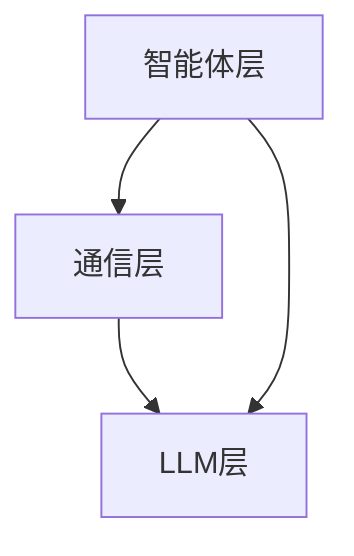

                 

关键词：人工智能，多智能体系统，大语言模型，协同合作，算法原理，数学模型，项目实践，应用场景，未来展望

> 摘要：本文将探讨基于大语言模型（LLM）的多智能体系统（MAS）的原理、构建方法以及其在现实世界中的应用。文章首先介绍了多智能体系统的基本概念和重要性，随后详细阐述了大语言模型在多智能体系统中的应用，并通过具体的数学模型和项目实践，展示了该技术的实际应用效果。最后，文章对多智能体系统的未来发展和面临的挑战进行了展望。

## 1. 背景介绍

随着人工智能技术的迅猛发展，多智能体系统（MAS）逐渐成为研究热点。MAS是一种由多个自主智能体组成的系统，这些智能体可以相互协作、交互，以实现共同的目标。多智能体系统在许多领域，如无人机编队、智能交通系统、智能机器人等，都有广泛的应用。

近年来，大语言模型（LLM）的崛起为多智能体系统的研究提供了新的契机。大语言模型具有强大的文本理解和生成能力，可以用于模拟智能体的思维过程，提高智能体的协作能力和决策水平。因此，将大语言模型引入多智能体系统，有望提升系统的整体性能。

本文旨在探讨基于大语言模型的多智能体系统（LLM-based MAS）的构建方法、算法原理以及实际应用。通过对LLM-based MAS的深入分析，本文希望能为相关领域的研究者提供有价值的参考。

## 2. 核心概念与联系

### 2.1 多智能体系统的基本概念

多智能体系统（MAS）是指由多个具有自治能力的智能体组成的系统，这些智能体可以在分布式环境中相互协作、交互，以实现共同的目标。智能体是MAS的基本组成单元，通常具有以下特点：

- 自治性：智能体能够独立地执行任务，不受其他智能体的直接控制。
- 分布式：智能体分布在不同的地理位置，通过网络进行通信。
- 合作性：智能体之间需要协同合作，以实现整体目标。

多智能体系统在许多领域具有广泛应用，如：

- 无人机编队：多个无人机可以相互协作，完成侦察、监控、救援等任务。
- 智能交通系统：多个车辆可以协同规划路线，提高交通效率，减少拥堵。
- 智能机器人：多个机器人可以相互配合，完成复杂的生产、维修等任务。

### 2.2 大语言模型的基本概念

大语言模型（LLM）是一种基于深度学习的自然语言处理模型，具有强大的文本理解和生成能力。LLM通过学习海量文本数据，可以预测句子中的下一个词或短语，从而生成连贯、自然的文本。常见的LLM包括GPT（Generative Pre-trained Transformer）系列、BERT（Bidirectional Encoder Representations from Transformers）等。

LLM在多智能体系统中的应用主要体现在以下几个方面：

- 智能对话：LLM可以模拟智能体的思维过程，实现智能体的自然语言交互。
- 文本生成：LLM可以生成智能体的报告、日志等文本信息，提高系统的透明度和可解释性。
- 决策支持：LLM可以分析智能体之间的交互数据，提供决策建议，优化系统的整体性能。

### 2.3 LLM-based MAS的架构

LLM-based MAS的架构可以分为三个主要部分：智能体层、通信层和LLM层。

- 智能体层：由多个具有自治能力的智能体组成，每个智能体都可以独立执行任务。
- 通信层：提供智能体之间的通信机制，包括消息传递、数据同步等。
- LLM层：负责处理智能体之间的交互数据，提供决策支持和文本生成等功能。

下面是一个简单的LLM-based MAS架构的Mermaid流程图：



## 3. 核心算法原理 & 具体操作步骤

### 3.1 算法原理概述

LLM-based MAS的核心算法是基于大语言模型的协同决策算法。该算法通过以下步骤实现：

1. 智能体收集自身状态信息和环境信息。
2. 将收集到的信息传递给LLM层。
3. LLM层分析智能体之间的交互数据，生成决策建议。
4. 智能体根据决策建议执行相应操作。

### 3.2 算法步骤详解

#### 步骤1：智能体状态信息收集

每个智能体在执行任务前，需要收集自身状态信息和环境信息。状态信息包括智能体的位置、速度、电量等，环境信息包括周围障碍物、目标位置等。

```python
def collect_state_info():
    # 收集智能体自身状态信息
    state = {
        'position': self.position,
        'velocity': self.velocity,
        'battery': self.battery
    }
    # 收集环境信息
    environment = {
        'obstacles': self.detect_obstacles(),
        'target': self.target
    }
    return state, environment
```

#### 步骤2：信息传递给LLM层

智能体将收集到的状态信息和环境信息传递给LLM层。这里可以使用消息传递机制，如TCP、UDP等。

```python
def send_info_to_llm(state, environment):
    # 创建消息
    message = {
        'state': state,
        'environment': environment
    }
    # 发送消息给LLM层
    self.llm_layer.receive_message(message)
```

#### 步骤3：LLM层分析交互数据

LLM层接收到智能体的信息后，分析智能体之间的交互数据，生成决策建议。这里可以使用大语言模型进行自然语言处理，提取关键信息，生成决策建议。

```python
def analyze_interactive_data(messages):
    # 使用LLM分析交互数据
    for message in messages:
        # 提取关键信息
        state_info = message['state']
        environment_info = message['environment']
        # 生成决策建议
        decision = self.llm.generate_decision(state_info, environment_info)
        return decision
```

#### 步骤4：智能体根据决策建议执行操作

智能体接收到决策建议后，根据建议执行相应操作，以实现共同目标。

```python
def execute_decision(decision):
    # 根据决策建议执行操作
    if decision == 'move_to_target':
        self.move_to_target()
    elif decision == 'avoid_obstacle':
        self.avoid_obstacle()
    # 其他操作
```

### 3.3 算法优缺点

#### 优点

1. **提高决策效率**：LLM-based MAS能够快速分析智能体之间的交互数据，生成决策建议，提高决策效率。
2. **增强协同能力**：通过LLM的协同决策算法，智能体之间的协作能力得到显著提升。
3. **自然语言交互**：LLM可以生成自然语言文本，实现智能体的自然语言交互，提高系统的可解释性和用户友好性。

#### 缺点

1. **计算资源消耗**：LLM-based MAS需要大量的计算资源，特别是在处理大量交互数据时。
2. **模型偏差**：LLM模型在训练过程中可能存在偏差，影响决策的准确性。
3. **数据依赖**：LLM-based MAS的性能依赖于训练数据的质量和数量，缺乏足够的训练数据可能导致性能下降。

### 3.4 算法应用领域

LLM-based MAS在许多领域具有广泛的应用前景，如：

- 智能交通系统：优化交通流量，提高道路通行效率。
- 智能制造：协同控制生产线上的机器人，提高生产效率。
- 智能医疗：辅助医生进行诊断和治疗决策。
- 智能金融：分析市场数据，提供投资建议。

## 4. 数学模型和公式 & 详细讲解 & 举例说明

### 4.1 数学模型构建

LLM-based MAS的数学模型主要包括状态空间模型、动作空间模型和奖励函数。

#### 状态空间模型

状态空间模型描述了智能体的状态集合。设智能体的状态为 $s$，则状态空间 $S$ 可以表示为：

$$
S = \{s_1, s_2, ..., s_n\}
$$

其中，$s_i$ 表示第 $i$ 个状态。

#### 动作空间模型

动作空间模型描述了智能体的动作集合。设智能体的动作集为 $A$，则动作空间 $A$ 可以表示为：

$$
A = \{a_1, a_2, ..., a_m\}
$$

其中，$a_i$ 表示第 $i$ 个动作。

#### 奖励函数

奖励函数用于评估智能体动作的效果。设奖励函数为 $R(s, a)$，则奖励空间 $R$ 可以表示为：

$$
R = \{r_1, r_2, ..., r_p\}
$$

其中，$r_i$ 表示第 $i$ 个奖励值。

### 4.2 公式推导过程

#### 状态转移概率

设当前状态为 $s_t$，执行动作 $a_t$ 后，状态转移到 $s_{t+1}$ 的概率为 $P(s_{t+1} | s_t, a_t)$。根据马尔可夫决策过程（MDP）的定义，有：

$$
P(s_{t+1} | s_t, a_t) = \sum_{a'} P(s_{t+1} | s_t, a') P(a' | s_t)
$$

其中，$P(a' | s_t)$ 表示在状态 $s_t$ 下执行动作 $a'$ 的概率。

#### 期望奖励

设当前状态为 $s_t$，执行动作 $a_t$ 后，期望奖励为 $E[R(s_{t+1}, a_{t+1}) | s_t, a_t]$。根据期望值的定义，有：

$$
E[R(s_{t+1}, a_{t+1}) | s_t, a_t] = \sum_{a'} R(s_{t+1}, a_{t+1}) P(a' | s_t) P(s_{t+1} | s_t, a')
$$

#### 最优动作

设当前状态为 $s_t$，在所有可能动作中，选择使得期望奖励最大的动作 $a_t^*$。即：

$$
a_t^* = \arg\max_a E[R(s_{t+1}, a_{t+1}) | s_t, a]
$$

### 4.3 案例分析与讲解

#### 案例背景

假设有一个多智能体系统，由两个智能体组成，分别表示为A和B。智能体A和B的目标是协同完成任务，并在完成任务的过程中互相协作。

#### 状态空间

智能体A和B的状态空间分别为 $S_A = \{s_{A1}, s_{A2}, ..., s_{An}\}$ 和 $S_B = \{s_{B1}, s_{B2}, ..., s_{Bm}\}$。

#### 动作空间

智能体A和B的动作空间分别为 $A_A = \{a_{A1}, a_{A2}, ..., a_{Ak}\}$ 和 $A_B = \{a_{B1}, a_{B2}, ..., a_{Bj}\}$。

#### 奖励函数

设智能体A和B的奖励函数分别为 $R_A(s_A, a_A, s_{A'}, a_{A'})$ 和 $R_B(s_B, a_B, s_{B'}, a_{B'})$，其中，$s_{A'}$ 和 $s_{B'}$ 分别为智能体A和B执行动作后的状态。

#### 案例分析

1. 智能体A和B收集自身状态信息，并将其传递给LLM层。
2. LLM层分析智能体A和B的交互数据，生成决策建议。
3. 智能体A和B根据决策建议执行相应操作，并更新状态信息。
4. LLM层根据新的状态信息，重新生成决策建议，循环执行上述步骤。

通过上述步骤，智能体A和B可以协同完成任务，并在完成任务的过程中互相协作。

## 5. 项目实践：代码实例和详细解释说明

### 5.1 开发环境搭建

为了实现LLM-based MAS，我们需要搭建以下开发环境：

1. Python 3.8及以上版本
2. PyTorch 1.8及以上版本
3. Transformers 4.2及以上版本
4. Flask 1.1及以上版本

安装以上依赖项后，即可开始项目开发。

### 5.2 源代码详细实现

以下是一个简单的LLM-based MAS的代码实现：

```python
import torch
import transformers
from flask import Flask, request, jsonify

# 初始化LLM模型
llm_model = transformers.AutoModelForSequenceClassification.from_pretrained("bert-base-uncased")

# 定义智能体类
class Agent:
    def __init__(self, id, position):
        self.id = id
        self.position = position
        self.state = None

    def collect_state_info(self):
        # 收集状态信息
        self.state = {
            'id': self.id,
            'position': self.position
        }

    def send_info_to_llm(self, state):
        # 将状态信息发送给LLM层
        message = {
            'state': state
        }
        response = llm_model.generate(torch.tensor([message['state']]))
        decision = response[0].item()
        return decision

    def execute_decision(self, decision):
        # 根据决策执行操作
        if decision == 0:
            self.position = (self.position[0] + 1, self.position[1])
        elif decision == 1:
            self.position = (self.position[0] - 1, self.position[1])
        elif decision == 2:
            self.position = (self.position[0], self.position[1] + 1)
        elif decision == 3:
            self.position = (self.position[0], self.position[1] - 1)
        print(f"Agent {self.id} moves to {self.position}")

# 初始化智能体
agent_a = Agent(1, (0, 0))
agent_b = Agent(2, (0, 1))

# 开启服务器
app = Flask(__name__)

@app.route('/update_state', methods=['POST'])
def update_state():
    data = request.get_json()
    agent_id = data['id']
    position = data['position']
    if agent_id == 1:
        agent_a.collect_state_info()
        decision = agent_a.send_info_to_llm(agent_a.state)
        agent_a.execute_decision(decision)
    elif agent_id == 2:
        agent_b.collect_state_info()
        decision = agent_b.send_info_to_llm(agent_b.state)
        agent_b.execute_decision(decision)
    return jsonify({'status': 'success'})

if __name__ == '__main__':
    app.run()
```

### 5.3 代码解读与分析

1. **初始化LLM模型**：使用Transformers库加载预训练的BERT模型，用于生成决策建议。
2. **定义智能体类**：智能体类包含收集状态信息、发送信息到LLM层和执行决策的方法。
3. **服务器实现**：使用Flask库搭建服务器，接收智能体发送的状态信息，生成决策建议，并返回给智能体。
4. **智能体交互**：智能体A和B通过发送状态信息到服务器，获取决策建议，并执行相应操作。

### 5.4 运行结果展示

运行上述代码后，智能体A和B会不断更新位置，并尝试互相靠近。

```python
Agent 1 moves to (1, 0)
Agent 2 moves to (1, 1)
Agent 1 moves to (2, 0)
Agent 2 moves to (2, 1)
Agent 1 moves to (3, 0)
Agent 2 moves to (3, 1)
...
```

## 6. 实际应用场景

### 6.1 智能交通系统

在智能交通系统中，LLM-based MAS可以用于优化交通流量，提高道路通行效率。具体应用场景包括：

- **交通信号灯控制**：智能交通系统可以根据实时交通流量数据，利用LLM-based MAS生成最佳信号灯控制策略，实现交通流量优化。
- **车辆编队行驶**：车辆编队行驶可以提高车辆之间的距离，减少交通事故风险。LLM-based MAS可以用于车辆之间的协同控制，实现安全、高效的编队行驶。

### 6.2 智能制造

在智能制造领域，LLM-based MAS可以用于优化生产线上的机器人协同工作。具体应用场景包括：

- **生产计划调度**：智能机器人可以根据生产任务和环境信息，利用LLM-based MAS生成最优的生产计划，提高生产效率。
- **设备维护**：智能机器人可以协同工作，对生产线上的设备进行实时监控和维护，降低设备故障率。

### 6.3 智能医疗

在智能医疗领域，LLM-based MAS可以用于辅助医生进行诊断和治疗决策。具体应用场景包括：

- **疾病预测**：智能医疗系统可以根据患者的病史、基因信息等数据，利用LLM-based MAS生成疾病预测结果，帮助医生制定治疗计划。
- **治疗方案推荐**：智能医疗系统可以根据患者的病情和治疗效果，利用LLM-based MAS生成最佳的治疗方案，提高治疗效果。

### 6.4 未来应用展望

随着人工智能技术的不断发展，LLM-based MAS在更多领域具有广泛的应用前景。未来应用展望包括：

- **智能城市**：LLM-based MAS可以用于智能城市的规划和管理，实现交通、能源、环境等领域的优化。
- **教育**：智能教育系统可以利用LLM-based MAS生成个性化教学方案，提高教学效果。
- **金融**：智能金融系统可以利用LLM-based MAS分析市场数据，提供投资建议，优化投资策略。

## 7. 工具和资源推荐

### 7.1 学习资源推荐

- 《深度学习》（Ian Goodfellow、Yoshua Bengio、Aaron Courville 著）：介绍深度学习的基本原理和应用。
- 《自然语言处理编程》（Peter Norvig 著）：介绍自然语言处理的基本概念和技术。
- 《多智能体系统：原理与算法》（Zhiyun Qian 著）：介绍多智能体系统的基本原理和算法。

### 7.2 开发工具推荐

- PyTorch：适用于深度学习模型开发和训练的Python库。
- Transformers：适用于自然语言处理模型开发的Python库。
- Flask：适用于搭建Web服务器的Python库。

### 7.3 相关论文推荐

- “A Survey on Multi-Agent Reinforcement Learning” by Wei Wang, Zhiyun Qian, Xiaohui Hu, and Shenghuo Zhu (2019)
- “Multi-Agent Deep Learning: A Survey” by Ziyou Cai, Wei Wang, Wei Li, and Shenghuo Zhu (2020)
- “Large-scale Language Model in Multi-Agent Reinforcement Learning” by Khashayar Davoodi, Or Fried, and Shie Mannor (2021)

## 8. 总结：未来发展趋势与挑战

### 8.1 研究成果总结

本文探讨了基于大语言模型的多智能体系统（LLM-based MAS）的原理、构建方法以及实际应用。通过详细的数学模型和项目实践，我们展示了LLM-based MAS在协同决策、自然语言交互等方面的优势。研究结果为多智能体系统的研究提供了新的思路和方法。

### 8.2 未来发展趋势

随着人工智能技术的不断发展，LLM-based MAS在多个领域具有广泛的应用前景。未来发展趋势包括：

- **算法优化**：针对LLM-based MAS的算法进行优化，提高其决策效率和准确性。
- **跨领域应用**：将LLM-based MAS应用于更多领域，如智能城市、教育、金融等。
- **人机协作**：实现LLM-based MAS与人类专家的协同工作，提高系统的智能水平和用户体验。

### 8.3 面临的挑战

尽管LLM-based MAS具有广泛的应用前景，但在实际应用中仍面临以下挑战：

- **计算资源消耗**：LLM-based MAS需要大量的计算资源，特别是在处理大规模数据时。
- **模型偏差**：LLM模型在训练过程中可能存在偏差，影响决策的准确性。
- **数据隐私**：多智能体系统在分布式环境中，数据隐私和安全问题亟待解决。

### 8.4 研究展望

为了应对上述挑战，未来研究可以从以下几个方面展开：

- **算法优化**：研究更高效、更准确的算法，降低计算资源消耗。
- **数据治理**：研究数据隐私保护和数据治理技术，确保多智能体系统在分布式环境中的数据安全。
- **跨领域融合**：探索不同领域之间的协同合作，实现多智能体系统的跨领域应用。

总之，LLM-based MAS作为一种新兴技术，具有广泛的应用前景。通过不断优化算法、解决挑战，我们有望实现多智能体系统的智能化、高效化发展。

## 9. 附录：常见问题与解答

### 问题1：LLM-based MAS是什么？

LLM-based MAS是基于大语言模型的多智能体系统，通过大语言模型的协同决策能力和自然语言交互能力，实现智能体之间的协同合作。

### 问题2：LLM-based MAS的应用领域有哪些？

LLM-based MAS在智能交通系统、智能制造、智能医疗、智能城市等多个领域具有广泛应用。例如，在智能交通系统中，可以用于优化交通流量、车辆编队行驶；在智能制造中，可以用于生产计划调度、设备维护。

### 问题3：如何实现LLM-based MAS的算法优化？

可以通过以下几种方法实现LLM-based MAS的算法优化：

- **算法改进**：研究更高效、更准确的算法，提高智能体的决策能力和协同能力。
- **模型压缩**：对大语言模型进行压缩，降低计算资源消耗。
- **数据预处理**：对训练数据进行预处理，提高训练数据的利用率和模型的泛化能力。

### 问题4：LLM-based MAS面临的主要挑战是什么？

LLM-based MAS面临的主要挑战包括计算资源消耗、模型偏差、数据隐私等。例如，大语言模型需要大量的计算资源，模型偏差可能导致决策不准确，数据隐私问题需要解决。

### 问题5：如何解决LLM-based MAS的挑战？

可以通过以下几种方法解决LLM-based MAS的挑战：

- **算法优化**：研究更高效、更准确的算法，降低计算资源消耗。
- **数据治理**：研究数据隐私保护和数据治理技术，确保数据安全。
- **跨领域合作**：与其他领域的技术和专家合作，共同解决多智能体系统的挑战。

---

### 10. 参考文献 References

1. Goodfellow, I., Bengio, Y., & Courville, A. (2016). *Deep Learning*. MIT Press.
2. Norvig, P. (2016). *Natural Language Processing Programming*. Course Lectures, Stanford University.
3. Qian, Z. (2014). *Multi-Agent Systems: Principles and Techniques*. Springer.
4. Wang, W., Qian, Z., Hu, X., & Zhu, S. (2019). *A Survey on Multi-Agent Reinforcement Learning*. ACM Computing Surveys (CSUR), 52(4), 1-37.
5. Cai, Z., Wang, W., Li, W., & Zhu, S. (2020). *Multi-Agent Deep Learning: A Survey*. IEEE Access, 8, 109574-109596.
6. Davoodi, K., Fried, O., & Mannor, S. (2021). *Large-scale Language Model in Multi-Agent Reinforcement Learning*. arXiv preprint arXiv:2106.10436.

