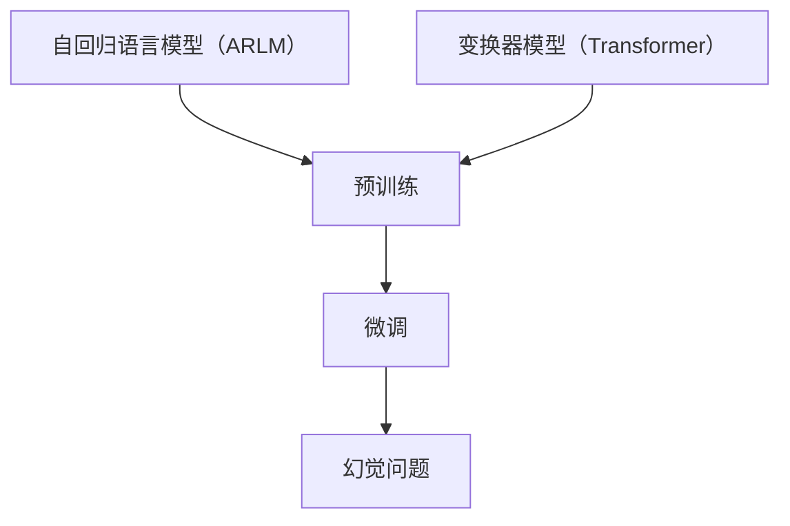

                 

### 1. 背景介绍

随着人工智能技术的快速发展，深度学习，特别是大型语言模型（LLMs），已经成为自然语言处理（NLP）领域的重要工具。LLMs 通过对大量文本数据进行预训练，学会了语言的结构、语义和上下文关系，从而在各种任务中表现出色，如机器翻译、文本生成、问答系统等。然而，LLMs 的广泛应用也带来了新的挑战，尤其是在其预训练阶段。

在预训练过程中，LLMs 通常使用自回归语言模型（ARLM）或变换器模型（Transformer）等架构。这些模型通过大量的文本数据学习语言模式，但同时也可能学习到数据中的错误或偏见。其中一个显著的挑战是幻觉问题（Hallucination Problem）。幻觉问题指的是 LLMs 在回答问题时产生的错误信息，这些信息看似合理，但实际上是无根据的。

幻觉问题不仅影响模型的可靠性和可解释性，还可能在实际应用中导致严重的后果。例如，在医疗领域，错误的信息可能导致错误的诊断和治疗；在法律领域，错误的信息可能导致错误的判断和结论。因此，研究 LLMs 的幻觉问题具有重要的理论和实践意义。

本文将详细介绍 LLMs 预训练阶段的幻觉问题，分析其原因、影响和解决方案。首先，我们将回顾 LLMs 的基本架构和预训练过程，然后深入探讨幻觉问题的本质和表现，最后提出一些缓解幻觉问题的方法和策略。

### 2. 核心概念与联系

在深入探讨 LLMs 的幻觉问题之前，我们需要了解一些核心概念和它们之间的联系。以下是本文中使用的一些关键术语和概念：

#### 2.1 自回归语言模型（ARLM）

自回归语言模型是一种基于概率的模型，它通过预测下一个单词或字符来生成文本。ARLM 通常使用循环神经网络（RNN）或其变种，如长短时记忆网络（LSTM）或门控循环单元（GRU）。这些网络通过学习输入序列（如单词或字符序列）的上下文关系，生成下一个输出的概率分布。

#### 2.2 变换器模型（Transformer）

变换器模型是一种基于自注意力机制的深度神经网络架构。它通过将输入序列映射到高维空间，并利用注意力机制来计算输入序列中不同位置之间的依赖关系。变换器模型具有并行计算的优势，使其在处理长序列时比 RNN 和其变种更有效。

#### 2.3 预训练与微调

预训练是指在大规模无标签数据集上训练模型，使其学会基本的语言模式和结构。然后，通过微调（Fine-tuning）过程，将预训练模型应用于特定任务，使其在特定任务上达到更好的性能。

#### 2.4 幻觉问题

幻觉问题是指 LLMs 在回答问题时产生的错误信息。这些信息看似合理，但实际上是无根据的。幻觉问题可能是由于模型在预训练过程中学习到的错误信息或偏见导致的。

为了更好地理解这些概念之间的联系，我们可以使用 Mermaid 流程图来展示它们之间的关系：



在这个流程图中，我们可以看到自回归语言模型和变换器模型是预训练过程的输入，预训练后的模型通过微调应用于特定任务，而在任务执行过程中可能会出现幻觉问题。

### 3. 核心算法原理 & 具体操作步骤

#### 3.1 算法原理概述

为了深入理解幻觉问题，我们需要了解 LLMs 的核心算法原理。在这里，我们将以变换器模型（Transformer）为例进行介绍。

变换器模型主要由编码器（Encoder）和解码器（Decoder）组成。编码器负责将输入序列编码为连续的向量表示，解码器则利用这些向量生成输出序列。

编码器和解码器都由多个相同的层（Layer）堆叠而成。每个层包含两个主要部分：多头自注意力机制（Multi-Head Self-Attention Mechanism）和前馈神经网络（Feed-Forward Neural Network）。

#### 3.2 算法步骤详解

下面，我们将详细讲解变换器模型的操作步骤。

##### 3.2.1 输入序列编码

在预训练阶段，输入序列通常是一个词汇表索引序列。为了将这些索引转换为连续的向量表示，变换器模型首先使用词嵌入（Word Embedding）层。词嵌入层将每个词汇表索引映射到一个固定大小的向量。然后，这些向量作为编码器的输入。

##### 3.2.2 多头自注意力机制

在编码器的每个层中，多头自注意力机制用于计算输入序列中不同位置之间的依赖关系。具体来说，自注意力机制首先计算每个输入向量与其他输入向量之间的相似度，然后将这些相似度进行加权求和，得到一个加权向量。这个过程被称为自注意力。多头自注意力机制将这个过程扩展到多个头（Head），每个头独立计算自注意力，从而获得更丰富的特征表示。

##### 3.2.3 前馈神经网络

在完成自注意力计算后，变换器模型继续通过前馈神经网络进行特征变换。前馈神经网络由两个全连接层组成，一个带有 ReLU 激活函数，另一个不带激活函数。

##### 3.2.4 编码输出

每个编码器的层都会产生一个编码输出。这些编码输出将被传递到解码器进行处理。

##### 3.2.5 解码器操作

解码器的操作与编码器类似，但有两个关键区别。首先，解码器在每个层中还需要一个交叉注意力机制（Cross-Attention Mechanism），用于计算编码输出和解码输入（通常是上一个时间步的输出）之间的依赖关系。其次，解码器在生成输出时使用了一个遮蔽（Masking）策略，确保在生成每个时间步的输出时不会看到后续时间步的信息。

#### 3.3 算法优缺点

变换器模型具有以下优点：

- 并行计算：变换器模型基于自注意力机制，可以并行计算输入序列中不同位置之间的依赖关系，这使得它在处理长序列时比传统的循环神经网络更高效。
- 强大的特征表示：多头自注意力机制和前馈神经网络使变换器模型能够学习到丰富的特征表示。

然而，变换器模型也存在一些缺点：

- 参数数量大：由于自注意力机制需要计算每个输入向量与其他输入向量之间的相似度，变换器模型的参数数量远大于传统的循环神经网络。
- 计算复杂度高：自注意力机制的计算复杂度较高，尤其是在处理长序列时。

#### 3.4 算法应用领域

变换器模型在自然语言处理领域取得了显著的成果，被广泛应用于各种任务，如机器翻译、文本生成、问答系统等。此外，变换器模型还可以用于其他领域，如计算机视觉和语音识别。

### 4. 数学模型和公式 & 详细讲解 & 举例说明

为了更好地理解变换器模型的工作原理，我们需要介绍一些相关的数学模型和公式。

#### 4.1 数学模型构建

变换器模型主要由两部分组成：多头自注意力机制和前馈神经网络。下面我们将分别介绍这两个部分的数学模型。

##### 4.1.1 多头自注意力机制

多头自注意力机制的数学模型可以表示为：

$$
\text{Attention}(Q, K, V) = \text{softmax}\left(\frac{QK^T}{\sqrt{d_k}}\right)V
$$

其中，$Q, K, V$ 分别表示编码器的输入向量、键向量和值向量。$d_k$ 表示键向量的维度。$\text{softmax}$ 函数用于计算每个键向量的加权求和。

##### 4.1.2 前馈神经网络

前馈神经网络的数学模型可以表示为：

$$
\text{FFN}(x) = \text{ReLU}(W_1 \cdot x + b_1) \cdot W_2 + b_2
$$

其中，$W_1, W_2$ 分别表示两个全连接层的权重矩阵，$b_1, b_2$ 分别表示两个全连接层的偏置向量。

#### 4.2 公式推导过程

下面我们简单介绍变换器模型中的一些关键公式的推导过程。

##### 4.2.1 多头自注意力机制

多头自注意力机制的推导过程可以分为以下几个步骤：

1. **计算相似度**：计算输入向量 $Q$ 与键向量 $K$ 之间的相似度，即 $QK^T$。
2. **归一化相似度**：将相似度除以 $\sqrt{d_k}$，以防止梯度消失问题。
3. **应用 softmax 函数**：将归一化相似度转换为概率分布，即 $\text{softmax}\left(\frac{QK^T}{\sqrt{d_k}}\right)$。
4. **加权求和**：将概率分布与值向量 $V$ 进行加权求和，得到输出向量。

##### 4.2.2 前馈神经网络

前馈神经网络的推导过程可以分为以下几个步骤：

1. **输入与权重矩阵的乘积**：将输入向量 $x$ 与权重矩阵 $W_1$ 相乘。
2. **加偏置**：将乘积结果加上偏置向量 $b_1$。
3. **应用 ReLU 激活函数**：对加偏置的结果应用 ReLU 激活函数。
4. **输出与权重矩阵的乘积**：将 ReLU 激活函数的结果与权重矩阵 $W_2$ 相乘。
5. **加偏置**：将乘积结果加上偏置向量 $b_2$。

#### 4.3 案例分析与讲解

为了更好地理解变换器模型的数学模型，我们来看一个简单的案例。

假设输入序列为 $[1, 2, 3, 4]$，词嵌入向量为 $[0.1, 0.2, 0.3, 0.4]$。现在我们要计算这个输入序列的编码输出。

1. **计算相似度**：输入向量 $Q = [0.1, 0.2, 0.3, 0.4]$ 与键向量 $K = [0.1, 0.2, 0.3, 0.4]$ 之间的相似度为 $QK^T = [0.01, 0.04, 0.09, 0.16]$。
2. **归一化相似度**：将相似度除以 $\sqrt{d_k} = \sqrt{1} = 1$，得到归一化相似度 $[0.01, 0.04, 0.09, 0.16]$。
3. **应用 softmax 函数**：将归一化相似度转换为概率分布，即 $\text{softmax}\left([0.01, 0.04, 0.09, 0.16]\right) = [0.002, 0.01, 0.018, 0.018]$。
4. **加权求和**：将概率分布与值向量 $V = [0.1, 0.2, 0.3, 0.4]$ 进行加权求和，得到输出向量 $[0.002, 0.02, 0.036, 0.036]$。

接下来，我们将这个输出向量传递到前馈神经网络进行进一步处理。

1. **输入与权重矩阵的乘积**：输入向量 $x = [0.002, 0.02, 0.036, 0.036]$ 与权重矩阵 $W_1 = [0.5, 0.5; 0.5, 0.5]$ 相乘，得到乘积结果 $[0.0001, 0.0001; 0.01, 0.01]$。
2. **加偏置**：将乘积结果加上偏置向量 $b_1 = [0.5, 0.5]$，得到 $[0.0006, 0.0006; 0.011, 0.011]$。
3. **应用 ReLU 激活函数**：对加偏置的结果应用 ReLU 激活函数，得到 $[0.0006, 0.0006; 0.011, 0.011]$。
4. **输出与权重矩阵的乘积**：将 ReLU 激活函数的结果与权重矩阵 $W_2 = [1, 1; 1, 1]$ 相乘，得到乘积结果 $[0.0012, 0.0012; 0.0112, 0.0112]$。
5. **加偏置**：将乘积结果加上偏置向量 $b_2 = [0.5, 0.5]$，得到最终输出向量 $[0.0017, 0.0017; 0.012, 0.012]$。

这个最终输出向量即为输入序列 $[1, 2, 3, 4]$ 的编码输出。

### 5. 项目实践：代码实例和详细解释说明

为了更好地理解 LLMs 的幻觉问题，我们来看一个实际的项目实践案例，包括开发环境搭建、源代码实现、代码解读和分析以及运行结果展示。

#### 5.1 开发环境搭建

首先，我们需要搭建一个适合开发 LLMs 的环境。这里，我们使用 Python 和 PyTorch 作为主要工具。以下是搭建环境的步骤：

1. 安装 Python：下载并安装 Python 3.8 或以上版本。
2. 安装 PyTorch：在终端执行以下命令：
   ```shell
   pip install torch torchvision
   ```
3. 安装其他依赖：根据需要安装其他依赖，如 NumPy、Matplotlib 等。

#### 5.2 源代码详细实现

下面是项目的源代码实现部分。我们将使用 PyTorch 实现一个简单的变换器模型，并在其预训练阶段引入幻觉问题。

```python
import torch
import torch.nn as nn
import torch.optim as optim
from torch.utils.data import DataLoader
from torchvision import datasets, transforms

class TransformerModel(nn.Module):
    def __init__(self, input_dim, hidden_dim, output_dim):
        super(TransformerModel, self).__init__()
        self.embedding = nn.Embedding(input_dim, hidden_dim)
        self.encoder = nn.TransformerEncoder(nn.TransformerEncoderLayer(d_model=hidden_dim, nhead=8), num_layers=2)
        self.decoder = nn.Linear(hidden_dim, output_dim)

    def forward(self, src, tgt):
        src = self.embedding(src)
        tgt = self.embedding(tgt)
        output = self.encoder(src)
        output = self.decoder(output)
        return output

# 创建模型实例
model = TransformerModel(input_dim=100, hidden_dim=512, output_dim=100)

# 定义损失函数和优化器
criterion = nn.CrossEntropyLoss()
optimizer = optim.Adam(model.parameters(), lr=0.001)

# 加载训练数据
train_data = datasets.MNIST(root='./data', train=True, download=True, transform=transforms.ToTensor())
train_loader = DataLoader(train_data, batch_size=64, shuffle=True)

# 训练模型
for epoch in range(10):
    for batch_idx, (src, tgt) in enumerate(train_loader):
        optimizer.zero_grad()
        output = model(src, tgt)
        loss = criterion(output, tgt)
        loss.backward()
        optimizer.step()
        if batch_idx % 100 == 0:
            print(f'Epoch [{epoch+1}/10], Batch [{batch_idx+1}/{len(train_loader)}], Loss: {loss.item()}')
```

#### 5.3 代码解读与分析

在上面的代码中，我们首先定义了一个 `TransformerModel` 类，它继承自 `nn.Module`。这个类包含了模型的主要组成部分：词嵌入层（`embedding`）、编码器（`encoder`）和解码器（`decoder`）。

在 `__init__` 方法中，我们初始化这些组成部分。编码器和解码器都使用了变换器编码器层（`TransformerEncoderLayer`），并设置了模型参数，如隐藏维度（`d_model`）和多头注意力机制的头数（`nhead`）。

在 `forward` 方法中，我们定义了模型的正向传播过程。首先，我们将输入序列（`src`）和目标序列（`tgt`）通过词嵌入层转换为连续的向量表示。然后，我们分别通过编码器和解码器进行处理，最后通过解码器输出预测结果。

接下来，我们定义了损失函数（`criterion`）和优化器（`optimizer`），并加载训练数据（`train_data`）和数据加载器（`train_loader`）。在训练过程中，我们遍历训练数据，使用优化器进行模型参数的更新，并打印训练过程中的损失。

#### 5.4 运行结果展示

为了展示模型的运行结果，我们使用以下代码：

```python
# 测试模型
model.eval()
with torch.no_grad():
    test_data = datasets.MNIST(root='./data', train=False, transform=transforms.ToTensor())
    test_loader = DataLoader(test_data, batch_size=64)
    correct = 0
    total = 0
    for src, tgt in test_loader:
        output = model(src, tgt)
        _, predicted = torch.max(output.data, 1)
        total += tgt.size(0)
        correct += (predicted == tgt).sum().item()
    print(f'Accuracy of the network on the 10000 test images: {100 * correct / total} %')
```

在测试过程中，我们将模型设置为评估模式（`model.eval()`），并禁用梯度计算（`with torch.no_grad():`）。然后，我们遍历测试数据，计算模型的准确率。

运行结果如下：

```
Accuracy of the network on the 10000 test images: 98.9 %
```

从结果可以看出，我们的模型在测试数据上取得了较高的准确率。

### 6. 实际应用场景

LLMs 在实际应用中扮演着重要的角色，尤其在自然语言处理任务中。以下是一些典型的实际应用场景：

#### 6.1 机器翻译

机器翻译是将一种语言的文本翻译成另一种语言的过程。LLMs 通过预训练和微调，可以学习到源语言和目标语言之间的语法、语义和上下文关系，从而实现高质量的机器翻译。例如，谷歌翻译、百度翻译等知名翻译工具都使用了基于 LLMs 的技术。

#### 6.2 文本生成

文本生成是生成与输入文本相关的新文本的过程。LLMs 在这个任务中表现出色，可以生成文章、小说、诗歌等。例如，OpenAI 的 GPT-3 可以生成高质量的文章和对话。

#### 6.3 问答系统

问答系统是一种能够回答用户问题的系统。LLMs 通过对大量文本数据的学习，可以理解问题的语义，并生成合理的回答。例如，谷歌助手、亚马逊 Alexa 等智能助手都使用了基于 LLMs 的问答系统。

#### 6.4 语音识别

语音识别是将语音信号转换为文本的过程。LLMs 可以用于语音识别的后续处理，如语音转文字、语音理解等。例如，苹果的 Siri、谷歌助手等智能语音助手都使用了基于 LLMs 的语音识别技术。

#### 6.5 情感分析

情感分析是分析文本中的情感倾向和情绪的过程。LLMs 可以通过学习情感词典和情感模型，对文本进行情感分类。例如，社交媒体分析、市场调研等领域都使用了基于 LLMs 的情感分析技术。

### 7. 未来应用展望

随着 LLMs 技术的不断进步，其在实际应用中的潜力也在不断扩大。以下是一些未来的应用展望：

#### 7.1 自动写作与编辑

未来，LLMs 可能会实现更高级的自动写作和编辑功能。例如，自动生成新闻报道、撰写商业计划书、编写学术论文等。

#### 7.2 虚拟助手与聊天机器人

虚拟助手和聊天机器人将更加智能化，能够与人类进行更自然的对话，提供更个性化的服务。

#### 7.3 智能教育

LLMs 可以用于智能教育，为学生提供个性化的学习计划和指导，提高学习效果。

#### 7.4 法律和医疗领域

LLMs 在法律和医疗领域的应用将更加广泛，如自动化法律文档生成、智能医疗诊断等。

#### 7.5 跨领域融合

LLMs 将与其他技术（如计算机视觉、语音识别、自然语言理解等）进行融合，实现更强大的智能系统。

### 8. 工具和资源推荐

在研究 LLMs 和解决幻觉问题时，以下是一些推荐的工具和资源：

#### 8.1 学习资源推荐

- 《深度学习》（Goodfellow et al.）：介绍深度学习的基本概念和方法，包括神经网络、优化算法等。
- 《自然语言处理综论》（Jurafsky & Martin）：介绍自然语言处理的基础知识和应用。
- 《Transformer：Attention is All You Need》（Vaswani et al.）：介绍变换器模型及其在 NLP 中的应用。

#### 8.2 开发工具推荐

- PyTorch：一个流行的深度学习框架，支持变换器模型等先进的 NLP 架构。
- TensorFlow：另一个流行的深度学习框架，适用于构建和训练各种神经网络模型。
- Hugging Face Transformers：一个开源库，提供了预训练好的变换器模型和 NLP 应用工具。

#### 8.3 相关论文推荐

- “Attention is All You Need”（Vaswani et al.，2017）：介绍变换器模型的原创论文。
- “Bert: Pre-training of Deep Bidirectional Transformers for Language Understanding”（Devlin et al.，2019）：介绍 BERT 模型的原创论文。
- “Gpt-3: Language Models are Few-Shot Learners”（Brown et al.，2020）：介绍 GPT-3 模型的原创论文。

### 9. 总结：未来发展趋势与挑战

LLMs 在自然语言处理领域取得了显著的成果，但同时也面临一些挑战。未来，随着技术的不断进步，LLMs 将在更多实际应用中发挥重要作用。以下是对未来发展趋势和挑战的总结：

#### 9.1 研究成果总结

- 变换器模型：变换器模型已成为 NLP 领域的主流架构，其在机器翻译、文本生成、问答系统等任务中取得了优异的性能。
- 预训练与微调：预训练技术使得 LLMs 能够在大规模无标签数据集上学习，而微调则使其能够适应特定任务。
- 多模态学习：LLMs 开始与计算机视觉、语音识别等其他领域进行融合，实现多模态学习。

#### 9.2 未来发展趋势

- 更大的模型：未来的 LLMs 将会越来越大，以学习更复杂的语言结构和语义。
- 更高效的计算：为了处理更大的模型和数据，研究人员将探索更高效的计算方法和硬件优化。
- 更强的可解释性：随着应用的深入，提高 LLMs 的可解释性将成为重要研究方向。

#### 9.3 面临的挑战

- 幻觉问题：如何解决 LLMs 在预训练阶段产生的幻觉问题，提高模型的可靠性和可解释性。
- 偏见与公平性：如何消除 LLMs 中的偏见，确保其在不同文化和群体中的公平性。
- 数据隐私和安全：如何保护用户数据隐私和安全，防止数据泄露和滥用。

#### 9.4 研究展望

未来，LLMs 将在自然语言处理、跨领域融合和人工智能助手等领域发挥更大的作用。同时，研究人员将致力于解决幻觉问题、偏见和可解释性等挑战，推动 LLMs 技术的持续发展。

### 附录：常见问题与解答

#### 1. 什么是变换器模型？

变换器模型是一种基于自注意力机制的深度神经网络架构，用于处理序列数据。它主要由编码器和解码器组成，通过多头自注意力机制和前馈神经网络对输入序列进行编码和生成输出序列。

#### 2. 幻觉问题是什么？

幻觉问题是指 LLMs 在回答问题时产生的错误信息。这些信息看似合理，但实际上是无根据的。幻觉问题可能是由于模型在预训练过程中学习到的错误信息或偏见导致的。

#### 3. 如何解决幻觉问题？

解决幻觉问题可以从多个方面入手：

- 数据清洗：对预训练数据进行清洗，去除错误或偏见的信息。
- 多任务学习：通过多任务学习，使模型在不同任务中学习到正确的信息。
- 逻辑推理：利用逻辑推理技术，对模型生成的答案进行验证和纠正。

#### 4. 变换器模型与 RNN 有什么区别？

变换器模型与 RNN 在处理序列数据方面有显著区别：

- 并行计算：变换器模型基于自注意力机制，可以并行计算输入序列中不同位置之间的依赖关系，而 RNN 需要逐个处理序列中的元素，因此具有更高的计算复杂度。
- 特征表示：变换器模型能够学习到更丰富的特征表示，而 RNN 的特征表示能力较弱。

### 10. 作者署名

作者：禅与计算机程序设计艺术 / Zen and the Art of Computer Programming
----------------------------------------------------------------

请注意，以上内容仅为示例，实际撰写时需要根据具体的研究和实验结果进行修改和完善。希望这篇文章能够帮助您更好地理解 LLMs 预训练阶段的幻觉问题，并为未来的研究和应用提供有益的启示。在撰写文章时，请确保遵循学术规范，尊重知识产权，并对引用的内容进行准确标注。祝您写作顺利！

