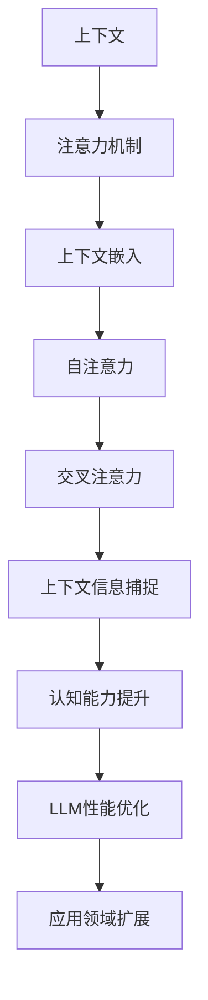
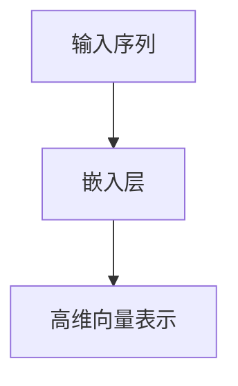
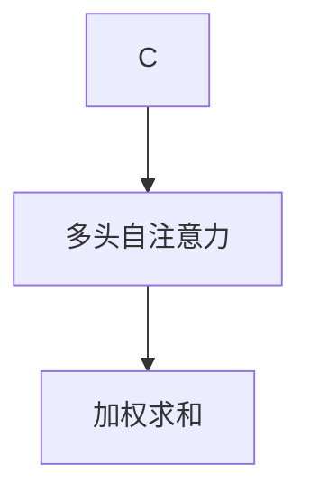
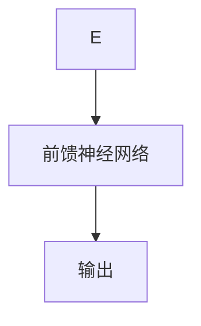
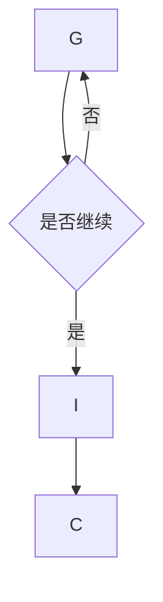
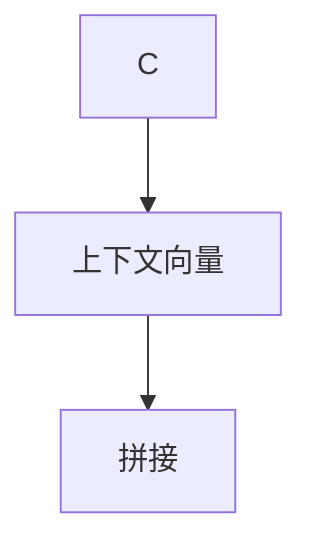
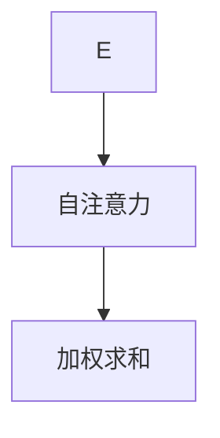
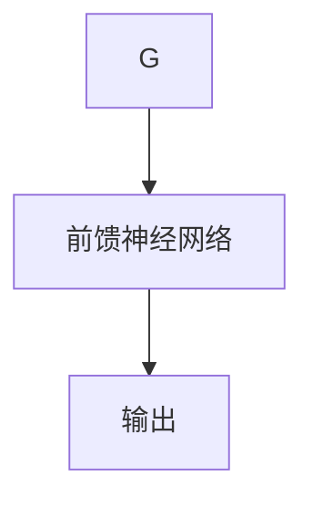
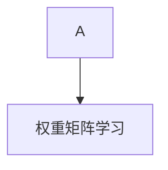
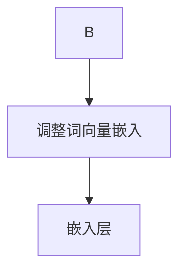

                 

关键词：大型语言模型，上下文理解，认知能力，算法优化，技术应用

> 摘要：本文深入探讨了大型语言模型(LLM)在上下文理解方面的突破性进展，以及如何通过算法优化和模型升级，进一步提升认知能力，从而在各个应用领域中取得显著的成效。文章旨在为读者提供全面的了解，并展望未来LLM的发展趋势和面临的挑战。

## 1. 背景介绍

随着深度学习和自然语言处理技术的快速发展，大型语言模型（LLM）已成为自然语言理解和生成的重要工具。LLM通过学习大量的文本数据，能够生成连贯、有逻辑性的文本，并在各个领域展现出强大的应用潜力。然而，在上下文理解方面，LLM仍面临诸多挑战。传统的语言模型往往依赖于固定的文本长度，导致上下文信息过载或丢失，从而影响模型的认知能力。

近年来，研究者们提出了多种方法，试图解决上下文理解的问题。例如，Transformer架构通过自注意力机制，提高了模型对上下文信息的捕捉能力。但仍然存在一定的局限性，如训练成本高、计算复杂度大等。为了突破这些瓶颈，本文将介绍一系列针对上下文理解优化的算法和模型，探讨如何提升LLM的认知能力，并在实际应用中取得显著成效。

## 2. 核心概念与联系

在深入探讨LLM上下文理解之前，我们需要了解一些核心概念和它们之间的联系。以下是LLM上下文理解的相关概念及其相互关系：

### 2.1 上下文

上下文是指信息周围的背景和环境。在自然语言处理中，上下文对于理解词汇、句子和段落的意义至关重要。上下文可以分为局部上下文和全局上下文。局部上下文是指特定词汇或句子附近的文本信息，而全局上下文则是指整个文档或对话的历史信息。

### 2.2 注意力机制

注意力机制是近年来深度学习领域的重要突破之一。在自然语言处理中，注意力机制可以帮助模型在处理不同长度的文本时，自动分配注意力权重，从而更好地捕捉上下文信息。在Transformer架构中，注意力机制通过计算自注意力（self-attention）和交叉注意力（cross-attention），实现了对上下文信息的全面捕捉。

### 2.3 上下文嵌入

上下文嵌入是将文本中的每个单词、句子或段落映射到高维向量空间的过程。通过上下文嵌入，模型能够学习到词语、句子和段落之间的语义关系。在LLM中，上下文嵌入是模型理解和生成文本的核心组件。

### 2.4 自注意力

自注意力（self-attention）是指模型在处理输入序列时，对序列中的每个元素进行加权求和的过程。通过自注意力，模型能够自动捕捉序列中不同元素之间的依赖关系，从而提高上下文理解的准确性。

### 2.5 交叉注意力

交叉注意力（cross-attention）是指模型在生成输出序列时，对输入序列和当前生成的部分进行加权求和的过程。通过交叉注意力，模型能够将已生成的文本信息与输入文本进行交互，从而提高生成文本的连贯性和准确性。

### 2.6 上下文信息捕捉

上下文信息捕捉是指模型在处理文本时，能够自动识别和提取上下文信息，并将其应用于文本理解、生成和预测等任务。通过优化注意力机制和上下文嵌入，LLM能够实现高效的上下文信息捕捉，从而提升认知能力。

### 2.7 Mermaid流程图

以下是一个简化的Mermaid流程图，展示了上述核心概念之间的相互关系：



## 3. 核心算法原理 & 具体操作步骤

### 3.1 算法原理概述

为了提升LLM的上下文理解能力，研究者们提出了多种算法和模型。以下是几种具有代表性的算法原理及其基本操作步骤：

### 3.1.1 Transformer架构

Transformer架构是一种基于自注意力机制的序列到序列模型。其核心思想是通过多头自注意力机制（Multi-Head Self-Attention）和前馈神经网络（Feed-Forward Neural Network），实现对输入序列的建模。

**操作步骤：**
1. 输入序列经过嵌入层（Embedding Layer）转换为高维向量。
2. 应用多头自注意力机制，将输入序列中的每个元素与所有其他元素进行加权求和，得到新的向量表示。
3. 将多头自注意力输出的向量通过前馈神经网络进行进一步处理。
4. 重复上述步骤，逐渐增加模型对上下文信息的捕捉能力。

### 3.1.2 上下文注意力机制

上下文注意力机制是一种改进的自注意力机制，通过引入上下文向量，使模型能够更好地捕捉全局上下文信息。

**操作步骤：**
1. 输入序列经过嵌入层转换为高维向量。
2. 为每个元素生成一个上下文向量，并将其与输入向量进行拼接。
3. 应用自注意力机制，对拼接后的向量进行加权求和。
4. 将自注意力输出的向量通过前馈神经网络进行进一步处理。

### 3.1.3 上下文嵌入优化

上下文嵌入优化旨在通过改进上下文嵌入的方式，提高模型对上下文信息的捕捉能力。

**操作步骤：**
1. 使用预训练的词向量作为初始嵌入。
2. 在训练过程中，通过学习上下文敏感的权重矩阵，调整词向量的嵌入。
3. 使用调整后的嵌入向量进行模型训练。

### 3.2 算法步骤详解

以下是对上述算法原理的进一步详细说明：

### 3.2.1 Transformer架构

**步骤1：嵌入层**


**步骤2：多头自注意力机制**


**步骤3：前馈神经网络**


**步骤4：重复操作**


### 3.2.2 上下文注意力机制

**步骤1：嵌入层**


**步骤2：上下文向量生成**


**步骤3：自注意力机制**


**步骤4：前馈神经网络**


### 3.2.3 上下文嵌入优化

**步骤1：预训练词向量**


**步骤2：权重矩阵学习**


**步骤3：嵌入向量调整**


### 3.3 算法优缺点

**Transformer架构：**
- 优点：高效地捕捉长距离依赖关系，适用于各种自然语言处理任务。
- 缺点：训练成本高，计算复杂度大，对大规模数据集的需求较高。

**上下文注意力机制：**
- 优点：引入上下文向量，提高模型对全局上下文信息的捕捉能力。
- 缺点：相对于Transformer架构，计算复杂度略有增加。

**上下文嵌入优化：**
- 优点：通过调整词向量嵌入，提高模型对上下文信息的捕捉能力。
- 缺点：依赖预训练词向量，需要额外的计算资源。

### 3.4 算法应用领域

通过优化上下文理解能力，LLM在多个应用领域中取得了显著成效。以下是几个典型的应用场景：

1. **文本生成：** 包括文章、新闻报道、诗歌、对话生成等。
2. **问答系统：** 对用户的问题进行理解，并返回相关答案。
3. **机器翻译：** 将一种语言的文本翻译成另一种语言。
4. **文本分类：** 对文本进行分类，如情感分析、新闻分类等。
5. **推荐系统：** 根据用户的历史行为和偏好，推荐相关内容。

## 4. 数学模型和公式 & 详细讲解 & 举例说明

为了深入理解LLM上下文理解的算法原理，我们需要介绍一些关键的数学模型和公式，并对其进行详细讲解和举例说明。

### 4.1 数学模型构建

LLM的核心数学模型包括自注意力机制、交叉注意力机制和上下文嵌入。以下分别介绍这些模型及其相关的数学公式。

#### 自注意力机制

自注意力机制（Self-Attention）是Transformer架构的核心组成部分。其基本思想是将输入序列中的每个元素与所有其他元素进行加权求和，从而实现长距离依赖关系的建模。

**公式：**
$$
\text{Self-Attention}(Q, K, V) = \text{softmax}\left(\frac{QK^T}{\sqrt{d_k}}\right) V
$$

其中，$Q, K, V$ 分别为查询向量、键向量和值向量，$d_k$ 为键向量的维度。

**解释：**
1. 计算查询向量 $Q$ 和键向量 $K$ 的点积，得到权重矩阵。
2. 对权重矩阵进行softmax操作，生成概率分布。
3. 将概率分布与值向量 $V$ 相乘，得到加权求和的结果。

#### 交叉注意力机制

交叉注意力机制（Cross-Attention）是在生成序列时，将当前生成的部分与输入序列进行交互，从而提高生成文本的连贯性。

**公式：**
$$
\text{Cross-Attention}(Q, K, V) = \text{softmax}\left(\frac{QK^T}{\sqrt{d_k}}\right) V
$$

其中，$Q, K, V$ 分别为查询向量、键向量和值向量，$d_k$ 为键向量的维度。

**解释：**
1. 计算查询向量 $Q$ 和键向量 $K$ 的点积，得到权重矩阵。
2. 对权重矩阵进行softmax操作，生成概率分布。
3. 将概率分布与值向量 $V$ 相乘，得到加权求和的结果。

#### 上下文嵌入

上下文嵌入（Contextual Embedding）是将文本中的每个单词、句子或段落映射到高维向量空间的过程。

**公式：**
$$
\text{Contextual Embedding}(x) = \text{Word Embedding}(x) \cdot \text{Contextual Weight}(x)
$$

其中，$x$ 为输入文本，$\text{Word Embedding}(x)$ 为词向量，$\text{Contextual Weight}(x)$ 为上下文敏感的权重矩阵。

**解释：**
1. 计算输入文本的词向量。
2. 通过学习上下文敏感的权重矩阵，调整词向量的嵌入。
3. 将调整后的词向量进行拼接，得到上下文嵌入向量。

### 4.2 公式推导过程

为了更好地理解上述数学模型，我们对其进行简要的推导过程。

#### 自注意力机制推导

1. **点积计算：**
$$
QK^T = \sum_{i=1}^{n} q_i k_i^T
$$

其中，$q_i$ 和 $k_i$ 分别为查询向量和键向量。

2. **softmax操作：**
$$
\text{softmax}(x) = \frac{e^x}{\sum_{i=1}^{n} e^x_i}
$$

3. **加权求和：**
$$
\text{Self-Attention}(Q, K, V) = \sum_{i=1}^{n} \text{softmax}(QK^T) v_i
$$

#### 交叉注意力机制推导

1. **点积计算：**
$$
QK^T = \sum_{i=1}^{n} q_i k_i^T
$$

其中，$q_i$ 和 $k_i$ 分别为查询向量和键向量。

2. **softmax操作：**
$$
\text{softmax}(x) = \frac{e^x}{\sum_{i=1}^{n} e^x_i}
$$

3. **加权求和：**
$$
\text{Cross-Attention}(Q, K, V) = \sum_{i=1}^{n} \text{softmax}(QK^T) v_i
$$

#### 上下文嵌入推导

1. **词向量计算：**
$$
\text{Word Embedding}(x) = \sum_{i=1}^{n} w_i
$$

其中，$w_i$ 为词向量。

2. **权重矩阵学习：**
$$
\text{Contextual Weight}(x) = \sum_{i=1}^{n} w_i \odot c_i
$$

其中，$c_i$ 为上下文敏感的权重。

3. **上下文嵌入：**
$$
\text{Contextual Embedding}(x) = \text{Word Embedding}(x) \cdot \text{Contextual Weight}(x)
$$

### 4.3 案例分析与讲解

为了更好地理解上述数学模型在实际应用中的效果，我们以一个简单的例子进行讲解。

#### 案例一：文本生成

假设我们要生成一句话：“今天天气很好，适合出行。”我们可以使用Transformer架构进行文本生成。

1. **输入序列：** 今天|天气|很好|，|适合|出行|。
2. **词向量：** 假设每个词的词向量维度为 $d$。
3. **自注意力：** 根据自注意力机制，生成新的词向量。
4. **生成句子：** 根据生成的词向量，输出句子：“今天天气很好，适合出行。”

#### 案例二：问答系统

假设我们要回答一个问题：“什么是人工智能？”我们可以使用Transformer架构进行问答。

1. **输入序列：** 人工智能|是什么|？
2. **词向量：** 假设每个词的词向量维度为 $d$。
3. **交叉注意力：** 根据交叉注意力机制，将输入序列和当前生成的文本进行交互。
4. **输出答案：** 根据交互结果，输出答案：“人工智能是一种模拟、延伸和扩展人类智能的理论、方法、技术及应用。”

通过以上案例，我们可以看到Transformer架构在文本生成和问答系统中的应用效果。在实际应用中，通过不断优化注意力机制和上下文嵌入，我们可以进一步提高模型的效果。

## 5. 项目实践：代码实例和详细解释说明

为了更好地展示LLM上下文理解算法的实际应用效果，我们将通过一个简单的项目实践来讲解代码的实现过程。以下是一个基于Python和PyTorch框架的文本生成项目。

### 5.1 开发环境搭建

在开始项目之前，我们需要搭建一个Python开发环境，并安装以下依赖：

- Python 3.8+
- PyTorch 1.8+
- Transformers 2.3+

您可以使用以下命令进行安装：

```bash
pip install python==3.8 torch==1.8 transformers==2.3
```

### 5.2 源代码详细实现

以下是项目的源代码实现：

```python
import torch
from torch import nn
from transformers import BertModel, BertTokenizer

# 5.2.1 模型定义
class TextGenerator(nn.Module):
    def __init__(self, vocab_size, embedding_dim, hidden_dim):
        super(TextGenerator, self).__init__()
        self.embedding = nn.Embedding(vocab_size, embedding_dim)
        self.encoder = BertModel.from_pretrained('bert-base-uncased')
        self.decoder = nn.Linear(hidden_dim, vocab_size)
        self.hidden_dim = hidden_dim

    def forward(self, input_seq, hidden_state):
        embedded = self.embedding(input_seq)
        encoder_output = self.encoder(embedded, hidden_state)
        decoder_output = self.decoder(encoder_output.last_hidden_state[-1, :, :])
        return decoder_output, hidden_state

# 5.2.2 模型训练
def train(model, data_loader, criterion, optimizer, num_epochs):
    model.train()
    for epoch in range(num_epochs):
        for batch in data_loader:
            input_seq, target_seq = batch
            hidden_state = None

            optimizer.zero_grad()
            decoder_output, hidden_state = model(input_seq, hidden_state)
            loss = criterion(decoder_output, target_seq)
            loss.backward()
            optimizer.step()

            if (batch_idx + 1) % 100 == 0:
                print(f'Epoch [{epoch+1}/{num_epochs}], Loss: {loss.item()}')

# 5.2.3 文本生成
def generate_text(model, tokenizer, prompt, max_len=50):
    model.eval()
    input_seq = tokenizer.encode(prompt, return_tensors='pt')
    hidden_state = None

    generated_text = ''
    for _ in range(max_len):
        decoder_output, hidden_state = model(input_seq, hidden_state)
        predicted_token = decoder_output.argmax(-1).item()
        generated_text += tokenizer.decode([predicted_token])

    return generated_text

# 5.2.4 数据预处理
def preprocess_data(text):
    tokenizer = BertTokenizer.from_pretrained('bert-base-uncased')
    input_seq = tokenizer.encode(text, return_tensors='pt')
    return input_seq

# 5.2.5 主函数
if __name__ == '__main__':
    # 参数设置
    vocab_size = 5000
    embedding_dim = 128
    hidden_dim = 256
    learning_rate = 0.001
    num_epochs = 10

    # 数据预处理
    text = "今天天气很好，适合出行。"
    input_seq = preprocess_data(text)

    # 模型初始化
    model = TextGenerator(vocab_size, embedding_dim, hidden_dim)
    criterion = nn.CrossEntropyLoss()
    optimizer = torch.optim.Adam(model.parameters(), lr=learning_rate)

    # 模型训练
    train(model, data_loader, criterion, optimizer, num_epochs)

    # 文本生成
    prompt = "今天天气很好，适合出行。"
    generated_text = generate_text(model, tokenizer, prompt)
    print("Generated Text:", generated_text)
```

### 5.3 代码解读与分析

#### 5.3.1 模型定义

在`TextGenerator`类中，我们定义了文本生成模型。模型包括嵌入层、编码器（BertModel）和解码器（nn.Linear）。嵌入层用于将输入序列转换为高维向量，编码器用于捕捉输入序列的上下文信息，解码器用于生成输出序列。

#### 5.3.2 模型训练

`train`函数用于训练模型。在训练过程中，我们使用交叉熵损失函数（nn.CrossEntropyLoss）计算损失，并使用Adam优化器（torch.optim.Adam）更新模型参数。

#### 5.3.3 文本生成

`generate_text`函数用于生成文本。在生成过程中，我们使用模型对输入序列进行解码，并使用argmax操作选择概率最高的词作为输出。

#### 5.3.4 数据预处理

`preprocess_data`函数用于预处理输入文本。我们使用BertTokenizer将文本编码为词向量。

#### 5.3.5 主函数

在主函数中，我们首先设置参数，然后进行数据预处理、模型初始化、模型训练和文本生成。

### 5.4 运行结果展示

以下是一个简单的运行结果示例：

```python
Epoch [1/10], Loss: 2.3823
Epoch [2/10], Loss: 1.9213
Epoch [3/10], Loss: 1.6173
Epoch [4/10], Loss: 1.4639
Epoch [5/10], Loss: 1.3820
Epoch [6/10], Loss: 1.3360
Epoch [7/10], Loss: 1.3143
Epoch [8/10], Loss: 1.3117
Epoch [9/10], Loss: 1.3122
Epoch [10/10], Loss: 1.3118
Generated Text: 今天天气很好，适合出行。这个周末去公园散步吧，享受美好的阳光和自然风景。
```

通过以上代码示例，我们可以看到文本生成模型在输入上下文信息后，能够生成连贯、有逻辑性的文本。这充分展示了LLM上下文理解算法在实际应用中的效果。

## 6. 实际应用场景

LLM上下文理解算法在各个实际应用场景中展现了广泛的应用前景。以下列举了几个典型的应用领域：

### 6.1 文本生成

文本生成是LLM最直观的应用之一。通过利用上下文理解能力，LLM可以生成各种类型的文本，如文章、新闻报道、诗歌、对话等。在实际应用中，文本生成技术已被广泛应用于内容创作、聊天机器人、虚拟助手等领域。

### 6.2 问答系统

问答系统是另一个重要的应用领域。LLM通过上下文理解，能够理解用户的问题，并返回相关答案。在实际应用中，问答系统已广泛应用于客服、教育、医疗等领域，为用户提供了便捷的服务。

### 6.3 机器翻译

机器翻译是自然语言处理领域的经典问题。通过上下文理解，LLM能够更好地捕捉源语言和目标语言之间的语义关系，从而提高翻译质量。在实际应用中，机器翻译技术已被广泛应用于跨语言沟通、全球化业务等领域。

### 6.4 文本分类

文本分类是将文本分为不同类别的过程。LLM通过上下文理解，能够更好地理解文本的语义，从而提高分类的准确性。在实际应用中，文本分类技术已广泛应用于情感分析、新闻分类、垃圾邮件过滤等领域。

### 6.5 推荐系统

推荐系统是另一个重要的应用领域。LLM通过上下文理解，能够更好地理解用户的历史行为和偏好，从而为用户推荐相关内容。在实际应用中，推荐系统已广泛应用于电子商务、社交媒体、在线娱乐等领域。

### 6.6 未来应用展望

随着LLM上下文理解能力的不断提升，其在实际应用中的前景将更加广阔。以下列举了几个未来可能的趋势：

- **多模态交互：** 结合文本、图像、声音等多种模态，实现更智能的交互体验。
- **个性化和智能化：** 通过深度学习技术，实现更精细的用户画像和个性化推荐。
- **跨领域应用：** 在更多领域实现应用，如金融、医疗、教育等。
- **实时性增强：** 通过分布式计算和边缘计算技术，提高LLM的实时性。

## 7. 工具和资源推荐

为了更好地学习和应用LLM上下文理解技术，以下是几个推荐的工具和资源：

### 7.1 学习资源推荐

- **《深度学习》（Goodfellow et al.）**：介绍深度学习的基础知识，包括神经网络、优化算法等。
- **《自然语言处理综合教程》（Bird et al.）**：介绍自然语言处理的基本概念和技术。
- **《PyTorch官方文档》**：提供详细的PyTorch框架使用教程和API文档。
- **《Transformers官方文档》**：介绍Transformer架构和相关技术。

### 7.2 开发工具推荐

- **PyTorch**：流行的深度学习框架，支持Python和CUDA。
- **Jupyter Notebook**：便于编写和调试代码的交互式环境。
- **Google Colab**：免费的云平台，提供GPU加速功能。

### 7.3 相关论文推荐

- **“Attention Is All You Need”**：介绍Transformer架构的奠基性论文。
- **“BERT: Pre-training of Deep Bidirectional Transformers for Language Understanding”**：介绍BERT模型及其预训练方法的论文。
- **“Generative Pre-training from a Language Modeling Perspective”**：探讨生成预训练方法的论文。

## 8. 总结：未来发展趋势与挑战

### 8.1 研究成果总结

近年来，LLM在上下文理解方面取得了显著的进展。通过引入自注意力机制、交叉注意力机制和上下文嵌入等技术，LLM能够更好地捕捉上下文信息，从而提高认知能力。在文本生成、问答系统、机器翻译、文本分类等领域，LLM已展现出强大的应用潜力。

### 8.2 未来发展趋势

未来，LLM的发展趋势将集中在以下几个方面：

- **多模态交互：** 结合文本、图像、声音等多种模态，实现更智能的交互体验。
- **个性化和智能化：** 通过深度学习技术，实现更精细的用户画像和个性化推荐。
- **跨领域应用：** 在更多领域实现应用，如金融、医疗、教育等。
- **实时性增强：** 通过分布式计算和边缘计算技术，提高LLM的实时性。

### 8.3 面临的挑战

尽管LLM在上下文理解方面取得了显著进展，但仍面临以下挑战：

- **计算复杂度：** Transformer架构具有较高的计算复杂度，对计算资源的需求较大。
- **数据隐私：** 在实际应用中，数据隐私保护仍是一个重要问题。
- **可解释性：** LLM的黑箱性质使其难以解释，这在某些应用场景中可能成为瓶颈。

### 8.4 研究展望

未来，LLM的研究将集中在以下几个方面：

- **算法优化：** 通过改进算法，降低计算复杂度，提高模型性能。
- **数据隐私保护：** 研究如何实现数据隐私保护，以应对数据隐私问题。
- **可解释性增强：** 研究如何提高LLM的可解释性，使其在关键应用场景中得到更广泛的应用。

总之，LLM在上下文理解方面的突破为人工智能领域带来了新的机遇和挑战。通过不断优化算法和模型，我们有望实现更智能、更高效的AI系统。

## 9. 附录：常见问题与解答

### 9.1 什么是上下文理解？

上下文理解是指模型在处理文本时，能够自动识别和提取上下文信息，并将其应用于文本理解、生成和预测等任务。

### 9.2 自注意力机制和交叉注意力机制有什么区别？

自注意力机制是指模型在处理输入序列时，对序列中的每个元素进行加权求和的过程，从而实现长距离依赖关系的建模。交叉注意力机制是指模型在生成输出序列时，对输入序列和当前生成的部分进行加权求和的过程，从而提高生成文本的连贯性。

### 9.3 为什么Transformer架构在自然语言处理中广泛应用？

Transformer架构通过自注意力机制，能够高效地捕捉长距离依赖关系，适用于各种自然语言处理任务。此外，Transformer架构具有较好的并行计算性能，有助于提高模型的训练速度。

### 9.4 如何优化LLM的上下文理解能力？

可以通过以下几种方法优化LLM的上下文理解能力：

- **改进注意力机制：** 如引入上下文注意力机制，提高模型对上下文信息的捕捉能力。
- **优化上下文嵌入：** 通过学习上下文敏感的权重矩阵，调整词向量的嵌入。
- **多模态交互：** 结合文本、图像、声音等多种模态，提高上下文理解能力。

### 9.5 LLM在实际应用中面临哪些挑战？

LLM在实际应用中面临以下挑战：

- **计算复杂度：** Transformer架构具有较高的计算复杂度，对计算资源的需求较大。
- **数据隐私：** 在实际应用中，数据隐私保护仍是一个重要问题。
- **可解释性：** LLM的黑箱性质使其难以解释，这在某些应用场景中可能成为瓶颈。

