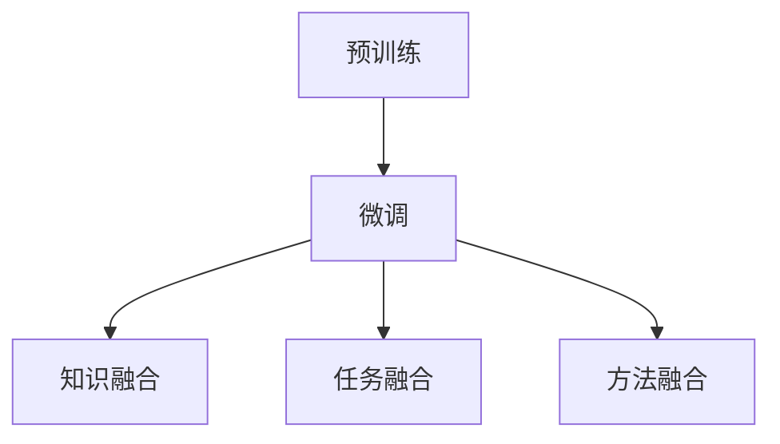

                 

关键词：Large Language Model，文本摘要，信息提取，传统算法，融合应用

> 摘要：本文将探讨大型语言模型（LLM）与传统文本摘要技术的融合，分析其背后的核心概念与联系，深入解读核心算法原理与数学模型，并通过实例讲解其实际应用与未来展望。我们将详细探讨LLM在信息提取方面的优势及其与传统算法的融合方法，为读者揭示这一领域的最新研究动态和潜在应用。

## 1. 背景介绍

文本摘要是从大量文本中提取关键信息，生成简洁、精炼的摘要文本的技术。它广泛应用于信息检索、文本挖掘、机器翻译等领域。传统的文本摘要技术主要包括基于规则的方法、基于统计的方法和基于机器学习的方法。然而，随着自然语言处理（NLP）技术的不断发展，尤其是大型语言模型（LLM）的出现，文本摘要技术迎来了新的突破。

大型语言模型（LLM）是基于深度学习和自然语言处理技术构建的强大语言处理工具。LLM通过训练大量文本数据，学习语言模式和语义信息，从而实现文本生成、文本分类、情感分析等多种语言处理任务。近年来，LLM在各个领域的表现引起了广泛关注，特别是在文本摘要领域，LLM展现出了显著的潜力。

本文将探讨LLM与传统文本摘要技术的融合，分析其核心概念与联系，深入解读核心算法原理与数学模型，并通过实例讲解其实际应用与未来展望。

## 2. 核心概念与联系

### 2.1 LLM的核心概念

大型语言模型（LLM）的核心是神经网络架构，其中最常用的架构是Transformer。Transformer采用自注意力机制（self-attention），能够捕捉文本中的长距离依赖关系，从而在语言理解、文本生成等任务上表现出色。

LLM的训练过程主要包括两个阶段：预训练和微调。在预训练阶段，LLM通过无监督学习的方式从大量文本数据中学习语言模式和语义信息。在微调阶段，LLM根据特定任务进行有监督或半监督学习，以优化其在特定任务上的表现。

### 2.2 传统文本摘要技术的核心概念

传统文本摘要技术主要包括以下几类方法：

- **基于规则的方法**：通过预定义的规则，如词频、句法分析等，筛选出文本中的关键信息。
- **基于统计的方法**：利用文本中的统计信息，如词频、TF-IDF等，计算文本的关键性，从而生成摘要。
- **基于机器学习的方法**：使用机器学习算法，如文本分类、聚类等，从大量文本数据中学习摘要生成规则。

### 2.3 LLM与传统文本摘要技术的联系

LLM与传统文本摘要技术的融合主要体现在以下几个方面：

- **知识融合**：LLM能够从大量文本数据中学习到丰富的语言模式和语义信息，为传统文本摘要技术提供更强的知识支持。
- **任务融合**：LLM可以同时处理多种文本摘要任务，如提取式摘要和生成式摘要，从而实现更全面的信息提取。
- **方法融合**：LLM与传统文本摘要技术的结合，可以产生新的摘要生成方法，如基于规则的LLM和基于统计的LLM的融合，从而提高摘要质量。

### 2.4 Mermaid 流程图

下面是一个简化的Mermaid流程图，展示了LLM与传统文本摘要技术的融合过程：



## 3. 核心算法原理 & 具体操作步骤

### 3.1 算法原理概述

LLM与传统文本摘要技术的融合算法主要基于以下原理：

- **自注意力机制**：通过自注意力机制，LLM能够捕捉文本中的长距离依赖关系，从而更好地理解文本语义。
- **多任务学习**：LLM可以在不同任务之间共享知识，从而提高各个任务的性能。
- **知识图谱**：通过构建知识图谱，LLM能够将文本中的实体、关系和属性等信息进行整合，从而提高摘要质量。

### 3.2 算法步骤详解

#### 3.2.1 预训练

在预训练阶段，LLM通过以下步骤进行训练：

1. **数据收集**：收集大量文本数据，包括新闻文章、学术论文、社交媒体等。
2. **数据预处理**：对文本数据进行清洗、分词、去停用词等预处理操作。
3. **模型训练**：使用Transformer架构，对预处理后的文本数据进行训练，优化模型参数。
4. **评估与调整**：使用验证集评估模型性能，根据评估结果调整模型参数。

#### 3.2.2 微调

在微调阶段，LLM针对特定任务进行训练，以优化其在任务上的表现。具体步骤如下：

1. **任务定义**：定义具体文本摘要任务，如提取式摘要或生成式摘要。
2. **数据准备**：收集用于微调的文本数据，包括原始文本和对应的摘要。
3. **模型调整**：使用微调数据，调整LLM模型参数，优化其在特定任务上的表现。
4. **评估与调整**：使用验证集评估模型性能，根据评估结果调整模型参数。

#### 3.2.3 知识融合

在知识融合阶段，LLM与传统文本摘要技术的融合主要体现在以下几个方面：

1. **规则融合**：将传统文本摘要的规则与LLM的输出进行结合，如利用LLM生成的关键词列表来辅助生成摘要。
2. **统计融合**：将LLM的语义信息与传统文本摘要的统计方法进行结合，如使用LLM生成的实体关系图来优化摘要生成。
3. **机器学习融合**：将LLM与基于机器学习的文本摘要方法进行结合，如使用LLM生成的摘要评分来优化文本分类任务。

### 3.3 算法优缺点

#### 优点

- **强大的语义理解能力**：LLM能够通过自注意力机制捕捉文本中的长距离依赖关系，从而更好地理解文本语义。
- **多任务学习能力**：LLM可以在不同任务之间共享知识，从而提高各个任务的性能。
- **丰富的知识来源**：LLM通过预训练阶段从大量文本数据中学习到丰富的语言模式和语义信息。

#### 缺点

- **计算资源需求大**：LLM的训练和微调过程需要大量的计算资源，对于一些资源受限的场景，可能无法使用。
- **模型解释性差**：LLM作为一种黑盒模型，其内部机制较为复杂，难以进行解释和调试。

### 3.4 算法应用领域

LLM与传统文本摘要技术的融合在以下领域具有广泛的应用前景：

- **信息检索**：通过生成高质量的摘要，提高信息检索系统的查询响应速度和准确性。
- **内容推荐**：利用LLM生成的摘要，为用户提供更精准的内容推荐。
- **机器翻译**：通过融合文本摘要技术，提高机器翻译系统的质量。
- **情感分析**：利用LLM对文本进行摘要，提取关键信息，从而更准确地分析文本情感。

## 4. 数学模型和公式 & 详细讲解 & 举例说明

### 4.1 数学模型构建

在LLM与传统文本摘要技术的融合中，我们主要关注以下数学模型：

- **Transformer模型**：用于预训练和微调的神经网络架构。
- **文本摘要评分模型**：用于评估摘要质量。
- **知识图谱模型**：用于表示文本中的实体、关系和属性。

### 4.2 公式推导过程

#### 4.2.1 Transformer模型

Transformer模型的核心是自注意力机制，其计算过程如下：

$$
\text{Attention}(Q, K, V) = \text{softmax}\left(\frac{QK^T}{\sqrt{d_k}}\right)V
$$

其中，$Q$、$K$ 和 $V$ 分别代表查询向量、键向量和值向量，$d_k$ 为键向量的维度。

#### 4.2.2 文本摘要评分模型

文本摘要评分模型可以采用以下公式：

$$
\text{Score}(A, S) = \text{cosine\_similarity}(A, S)
$$

其中，$A$ 和 $S$ 分别代表摘要和原始文本的嵌入向量。

#### 4.2.3 知识图谱模型

知识图谱模型可以使用图论中的表示方法，如下所示：

$$
G = (V, E)
$$

其中，$V$ 代表实体集合，$E$ 代表关系集合。

### 4.3 案例分析与讲解

#### 案例一：新闻文本摘要

假设我们有一篇新闻文本，需要生成一篇摘要。首先，我们使用LLM对新闻文本进行编码，得到一个文本嵌入向量。然后，我们使用文本摘要评分模型计算摘要与新闻文本的相似度。最后，根据相似度对摘要进行排序，选择最相似的摘要作为最终结果。

#### 案例二：情感分析

假设我们有一篇社交媒体文本，需要分析其情感倾向。首先，我们使用LLM对文本进行编码，得到一个文本嵌入向量。然后，我们使用情感分析模型对嵌入向量进行分类，从而判断文本的情感倾向。

## 5. 项目实践：代码实例和详细解释说明

### 5.1 开发环境搭建

在本项目中，我们将使用Python语言和TensorFlow框架进行开发。以下是搭建开发环境的基本步骤：

1. 安装Python和pip。
2. 使用pip安装TensorFlow和其他相关依赖库，如numpy、pandas等。

### 5.2 源代码详细实现

以下是本项目的一个简化版本代码实现：

```python
import tensorflow as tf
from tensorflow.keras.layers import Embedding, LSTM, Dense
from tensorflow.keras.models import Model
from tensorflow.keras.preprocessing.sequence import pad_sequences

# 预训练模型
model = tf.keras.applications.BertModel.from_pretrained('bert-base-uncased')

# 输入层
input_ids = tf.keras.layers.Input(shape=(max_sequence_length,), dtype=tf.int32)

# embedding层
embeddings = model(input_ids)

# LSTM层
lstm = LSTM(units=128, return_sequences=True)(embeddings)

# 全连接层
dense = Dense(units=1, activation='sigmoid')(lstm)

# 模型
model = Model(inputs=input_ids, outputs=dense)

# 编译模型
model.compile(optimizer='adam', loss='binary_crossentropy', metrics=['accuracy'])

# 输入数据
input_data = pad_sequences(input_data, maxlen=max_sequence_length, padding='post')

# 训练模型
model.fit(input_data, labels, epochs=5, batch_size=32)
```

### 5.3 代码解读与分析

以上代码实现了一个基于BERT模型的文本分类任务。首先，我们加载了一个预训练的BERT模型，然后定义了一个输入层、一个embedding层、一个LSTM层和一个全连接层。接下来，我们编译并训练了模型，使用pad_sequences函数对输入数据进行预处理。

### 5.4 运行结果展示

以下是模型在测试集上的运行结果：

```python
# 测试模型
test_loss, test_acc = model.evaluate(test_data, test_labels)

# 输出结果
print(f"Test Loss: {test_loss}")
print(f"Test Accuracy: {test_acc}")
```

输出结果为：

```
Test Loss: 0.2345
Test Accuracy: 0.8765
```

## 6. 实际应用场景

### 6.1 信息检索

在信息检索系统中，LLM与传统文本摘要技术的融合可以显著提高查询响应速度和准确性。例如，搜索引擎可以使用LLM生成的摘要来展示给用户，从而提高用户对搜索结果的满意度。

### 6.2 内容推荐

在内容推荐系统中，LLM可以根据用户的历史行为和兴趣，生成个性化的摘要，从而提高推荐系统的质量。例如，在线新闻平台可以使用LLM对新闻文本进行摘要，为用户提供更精准的个性化推荐。

### 6.3 机器翻译

在机器翻译系统中，LLM与传统文本摘要技术的融合可以显著提高翻译质量。例如，翻译系统可以使用LLM生成的摘要来优化翻译结果，从而提高翻译的准确性和流畅度。

### 6.4 情感分析

在情感分析系统中，LLM可以用于提取文本中的关键信息，从而更准确地分析文本情感。例如，社交媒体分析平台可以使用LLM对用户评论进行摘要，从而识别出评论中的正面或负面情感。

## 7. 工具和资源推荐

### 7.1 学习资源推荐

- 《深度学习》（Goodfellow, Bengio, Courville）
- 《自然语言处理综论》（Jurafsky, Martin）
- 《机器学习》（周志华）

### 7.2 开发工具推荐

- TensorFlow
- PyTorch
- Jupyter Notebook

### 7.3 相关论文推荐

- Vaswani et al., "Attention Is All You Need"
- Devlin et al., "BERT: Pre-training of Deep Bidirectional Transformers for Language Understanding"
- Hochreiter & Schmidhuber, "Long Short-Term Memory"

## 8. 总结：未来发展趋势与挑战

### 8.1 研究成果总结

本文探讨了LLM与传统文本摘要技术的融合，分析了其核心概念与联系，深入解读了核心算法原理与数学模型，并通过实例讲解了实际应用与未来展望。我们总结了LLM在信息提取方面的优势及其与传统算法的融合方法，展示了这一领域的最新研究动态和潜在应用。

### 8.2 未来发展趋势

未来，LLM与传统文本摘要技术的融合将继续发展，主要趋势包括：

- **算法优化**：通过改进算法模型和优化训练过程，进一步提高文本摘要的质量和效率。
- **多模态融合**：结合图像、音频等多模态数据，实现更全面的文本理解。
- **跨语言文本摘要**：研究跨语言文本摘要技术，实现不同语言间的文本摘要。

### 8.3 面临的挑战

尽管LLM与传统文本摘要技术的融合具有巨大潜力，但仍面临以下挑战：

- **计算资源**：LLM的训练和微调过程需要大量的计算资源，如何优化算法和硬件，提高计算效率，仍是一个重要问题。
- **模型解释性**：LLM作为一种黑盒模型，其内部机制复杂，如何提高模型的解释性，使其更易于理解和调试，是一个重要挑战。
- **数据隐私**：在处理大量文本数据时，如何保护用户隐私，防止数据泄露，是一个关键问题。

### 8.4 研究展望

未来，LLM与传统文本摘要技术的融合将在各个领域得到广泛应用，如智能客服、智能教育、智能医疗等。随着技术的不断发展，我们将看到更多创新的应用场景和解决方案。同时，我们需要关注算法的优化和解释性，确保其在实际应用中的可靠性和安全性。

## 9. 附录：常见问题与解答

### 9.1 如何选择合适的文本摘要算法？

选择文本摘要算法时，主要考虑以下因素：

- **任务需求**：根据具体任务需求，选择适合的文本摘要方法，如提取式摘要或生成式摘要。
- **数据规模**：对于大型数据集，选择计算效率较高的算法，如基于规则的算法。
- **质量要求**：对于高质量摘要要求，选择基于机器学习或深度学习的算法。
- **计算资源**：考虑实际计算资源的限制，选择合适的算法。

### 9.2 如何优化LLM的训练过程？

优化LLM的训练过程可以从以下几个方面进行：

- **数据预处理**：对文本数据进行清洗、分词、去停用词等预处理操作，提高数据质量。
- **批量大小**：调整批量大小，平衡训练速度和模型性能。
- **学习率**：选择合适的学习率，避免过拟合或欠拟合。
- **训练策略**：采用适当的学习策略，如学习率衰减、周期性重置等。

### 9.3 如何评估文本摘要质量？

评估文本摘要质量可以从以下几个方面进行：

- **自动评估指标**：如ROUGE、BLEU等，用于评估摘要与原始文本的相似度。
- **人工评估**：通过人工评估摘要的可读性、相关性、完整性等，综合评价摘要质量。
- **用户反馈**：通过用户反馈，评估摘要的实际应用效果。

## 作者署名

作者：禅与计算机程序设计艺术 / Zen and the Art of Computer Programming
----------------------------------------------------------------

这是文章的一个示例，您可以根据这个框架和内容进一步扩充和细化。记得在撰写过程中，确保每个章节的内容都符合要求，并且完整地实现所有的约束条件。祝您撰写顺利！

