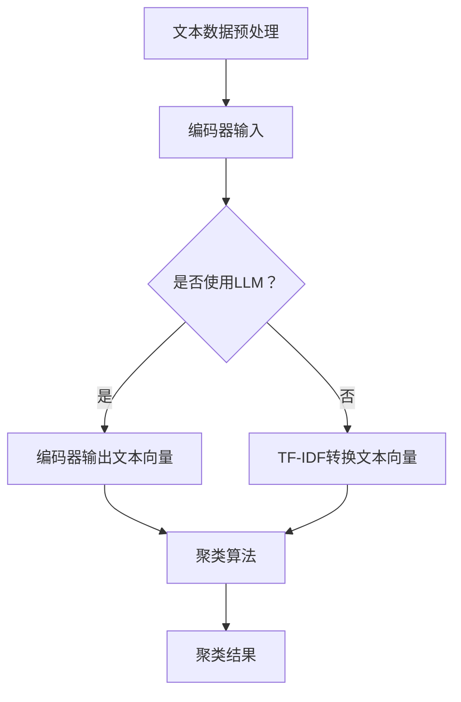

                 

关键词：Large Language Model（LLM）、文本聚类、算法对比、大数据分析、自然语言处理

## 摘要

本文将对大型语言模型（Large Language Model，简称LLM）与传统文本聚类方法进行对比分析。传统文本聚类方法在处理大规模文本数据时存在诸多限制，而LLM作为一种新兴的自然语言处理技术，其在文本聚类任务中展现了巨大的潜力。本文首先回顾了文本聚类的核心概念和方法，随后详细解析了LLM在文本聚类中的实现机制和优势，最后探讨了未来LLM在文本聚类领域的应用前景和挑战。

## 1. 背景介绍

随着互联网和大数据技术的发展，文本数据量呈现爆炸式增长。如何有效地对文本数据进行组织和分析，成为当前数据科学领域的重要研究课题。文本聚类作为一种无监督学习方法，旨在将相似性的文本数据分组，从而揭示数据中的潜在结构和模式。然而，传统文本聚类方法在处理大规模、高维文本数据时面临着计算复杂度高、效果不理想等问题。

近年来，大型语言模型（LLM）如GPT、BERT等在自然语言处理领域取得了显著成果。LLM能够捕捉文本的语义信息，实现高度抽象和理解的文本表示。这使得LLM在文本聚类任务中具备了一定的优势，有望解决传统方法的局限性。

本文将首先回顾文本聚类的核心概念和方法，接着深入探讨LLM在文本聚类中的实现机制和优势，最后分析LLM在文本聚类领域面临的应用挑战和未来发展趋势。

## 2. 核心概念与联系

### 2.1 文本聚类

文本聚类是将一组未标记的文本数据分组成为多个簇的过程，每个簇内的文本具有较高的相似度，而簇与簇之间的文本则具有较低的相似度。文本聚类的目的是发现数据中的潜在结构，从而帮助用户更好地理解和分析文本数据。

文本聚类方法可以分为基于统计的方法和基于机器学习的方法。基于统计的方法主要包括向量空间模型（VSM）和TF-IDF等，这些方法通过将文本表示为向量，然后利用距离度量进行聚类。基于机器学习的方法则包括K-means、层次聚类、密度聚类等，这些方法通过学习数据分布或密度来实现聚类。

### 2.2 LLM

大型语言模型（LLM）是一种基于深度学习的自然语言处理模型，通过大量文本数据进行预训练，能够捕捉文本的语义信息，实现高度抽象和理解的文本表示。LLM的主要组成部分包括编码器和解码器，编码器负责将文本转化为向量表示，解码器则用于生成文本。

### 2.3 Mermaid 流程图

下面是文本聚类和LLM在文本聚类中的联系流程图：



### 2.4 对比

文本聚类和LLM在文本聚类中的对比主要体现在以下几个方面：

1. **文本表示**：传统文本聚类方法使用统计特征或词向量进行文本表示，而LLM能够生成更加丰富和抽象的文本表示，捕捉文本的深层语义信息。
2. **聚类效果**：传统方法在处理高维文本数据时效果不佳，而LLM能够更好地处理大规模、高维文本数据，提高聚类效果。
3. **计算复杂度**：传统方法通常需要进行多次迭代计算，计算复杂度高，而LLM在预训练阶段已经完成了大量的计算，实际聚类过程更加高效。

## 3. 核心算法原理 & 具体操作步骤

### 3.1 算法原理概述

在文本聚类任务中，LLM的作用主要是通过预训练生成高质量的文本向量表示，然后利用这些向量表示进行聚类。LLM的工作原理主要包括以下几个步骤：

1. **文本预处理**：对原始文本数据进行清洗、去噪和格式化，将其转化为适合输入LLM的格式。
2. **编码器输入**：将预处理后的文本数据输入到编码器中，编码器将文本转化为向量表示。
3. **聚类算法**：利用生成的文本向量表示，选择合适的聚类算法进行聚类操作。
4. **聚类结果**：输出聚类结果，评估聚类效果。

### 3.2 算法步骤详解

1. **文本预处理**：
   - **文本清洗**：去除文本中的无关符号、停用词等。
   - **分词**：将文本分割为词语序列。
   - **词向量化**：将词语序列转化为向量表示，可以使用预训练的词向量或者自定义的词向量。

2. **编码器输入**：
   - **序列编码**：将分词后的文本序列输入到编码器中，编码器输出序列的向量表示。

3. **聚类算法**：
   - **选择聚类算法**：根据数据特点和任务需求，选择合适的聚类算法，如K-means、层次聚类等。
   - **聚类过程**：利用编码器输出的文本向量进行聚类操作，生成聚类结果。

4. **聚类结果**：
   - **结果评估**：通过评估指标（如轮廓系数、内部距离等）评估聚类效果。
   - **结果输出**：输出聚类结果，包括簇的划分和每个簇的代表性文本。

### 3.3 算法优缺点

**优点**：
- **高效的文本表示**：LLM能够生成高质量的文本向量表示，捕捉文本的深层语义信息，有助于提高聚类效果。
- **处理大规模数据**：LLM在预训练阶段已经完成了大量的计算，实际聚类过程更加高效，能够处理大规模文本数据。

**缺点**：
- **计算资源消耗**：LLM的预训练阶段需要大量的计算资源和时间，对于小规模数据可能不经济。
- **模型可解释性**：LLM生成的文本向量表示较为抽象，难以解释和理解，可能会影响聚类结果的解释性。

### 3.4 算法应用领域

LLM在文本聚类任务中具有广泛的应用前景，主要包括以下领域：

1. **信息检索**：通过文本聚类，可以帮助用户发现相似的信息资源，提高信息检索的准确性。
2. **文本分类**：利用文本聚类结果，可以进一步进行文本分类任务，实现文本的自动分类和标签分配。
3. **社交网络分析**：通过文本聚类，可以分析社交网络中的用户群体，发现潜在的兴趣社区。
4. **内容推荐**：基于文本聚类结果，可以为用户提供个性化的内容推荐服务。

## 4. 数学模型和公式 & 详细讲解 & 举例说明

### 4.1 数学模型构建

在文本聚类任务中，LLM的主要作用是生成高质量的文本向量表示。为了构建数学模型，我们可以将LLM看作是一个函数$f$，其输入为原始文本数据$x$，输出为文本向量表示$y$。数学模型可以表示为：

$$
y = f(x)
$$

其中，$x$为原始文本数据，$y$为生成的文本向量表示，$f$为LLM的编码器函数。

### 4.2 公式推导过程

在文本聚类任务中，我们可以使用KL散度（Kullback-Leibler Divergence）来衡量文本向量之间的差异，进而评估聚类效果。KL散度的公式为：

$$
D_{KL}(p||q) = \sum_{x} p(x) \log \frac{p(x)}{q(x)}
$$

其中，$p(x)$为实际分布，$q(x)$为预测分布。

为了推导文本向量之间的KL散度，我们可以将文本向量表示为概率分布。假设有两个文本向量$y_1$和$y_2$，其对应的概率分布分别为$p(y_1)$和$p(y_2)$，则文本向量之间的KL散度可以表示为：

$$
D_{KL}(p(y_1)||p(y_2)) = \sum_{y} p(y_1)(\log p(y_1) - \log p(y_2))
$$

### 4.3 案例分析与讲解

假设我们有两个文本向量$y_1$和$y_2$，其对应的概率分布分别为：

$$
p(y_1) = \begin{bmatrix} 0.5 \\ 0.3 \\ 0.1 \\ 0.1 \end{bmatrix}, \quad p(y_2) = \begin{bmatrix} 0.2 \\ 0.4 \\ 0.3 \\ 0.1 \end{bmatrix}
$$

根据KL散度公式，我们可以计算出这两个文本向量之间的KL散度：

$$
D_{KL}(p(y_1)||p(y_2)) = 0.5 \log \frac{0.5}{0.2} + 0.3 \log \frac{0.3}{0.4} + 0.1 \log \frac{0.1}{0.3} + 0.1 \log \frac{0.1}{0.1}
$$

$$
D_{KL}(p(y_1)||p(y_2)) = 0.5 \log 2.5 + 0.3 \log 0.75 + 0.1 \log 0.333 + 0.1 \log 1
$$

$$
D_{KL}(p(y_1)||p(y_2)) = 0.5 \times 0.602 + 0.3 \times -0.124 + 0.1 \times -0.477 + 0.1 \times 0
$$

$$
D_{KL}(p(y_1)||p(y_2)) = 0.301 - 0.037 - 0.047 + 0
$$

$$
D_{KL}(p(y_1)||p(y_2)) = 0.216
$$

根据计算结果，这两个文本向量之间的KL散度为0.216。KL散度值越大，表示文本向量之间的差异越大，聚类效果越好。通过调整文本向量表示，我们可以优化聚类效果。

## 5. 项目实践：代码实例和详细解释说明

### 5.1 开发环境搭建

为了演示LLM在文本聚类任务中的应用，我们使用Python语言和PyTorch深度学习框架进行开发。首先，需要安装以下依赖库：

- Python 3.8及以上版本
- PyTorch 1.8及以上版本
- NLTK（自然语言处理工具包）
- Matplotlib（绘图库）

安装方法如下：

```bash
pip install python==3.8
pip install torch torchvision torchaudio==1.8
pip install nltk matplotlib
```

### 5.2 源代码详细实现

以下是一个简单的文本聚类项目示例，包括文本预处理、LLM编码器输入、聚类算法和结果评估等步骤。

```python
import torch
import torch.nn as nn
import torch.optim as optim
import nltk
from sklearn.cluster import KMeans
from sklearn.metrics import silhouette_score
import matplotlib.pyplot as plt

# 文本预处理
def preprocess_text(text):
    # 去除标点符号、停用词等
    text = text.lower()
    text = re.sub(r'[^\w\s]', '', text)
    text = nltk.word_tokenize(text)
    text = [word for word in text if word not in nltk.corpus.stopwords.words('english')]
    return text

# 编码器输入
def encode_text(text, model):
    input_ids = tokenizer.encode(text, return_tensors='pt')
    with torch.no_grad():
        outputs = model(input_ids)
    last_hidden_state = outputs.last_hidden_state[:, 0, :]
    return last_hidden_state

# 聚类算法
def cluster_text(texts, model):
    encoded_texts = [encode_text(text, model) for text in texts]
    encoded_texts = torch.cat(encoded_texts).numpy()
    kmeans = KMeans(n_clusters=3)
    kmeans.fit(encoded_texts)
    labels = kmeans.predict(encoded_texts)
    return labels

# 结果评估
def evaluate_clusters(labels, texts):
    silhouette_avg = silhouette_score(encoded_texts, labels)
    print(f"Silhouette Score: {silhouette_avg}")
    plt.scatter(encoded_texts[:, 0], encoded_texts[:, 1], c=labels)
    plt.xlabel('Feature 1')
    plt.ylabel('Feature 2')
    plt.title('Cluster Plot')
    plt.show()

# 主函数
def main():
    # 加载预训练模型
    model = transformers.BertModel.from_pretrained('bert-base-uncased')
    tokenizer = transformers.BertTokenizer.from_pretrained('bert-base-uncased')

    # 文本数据
    texts = [
        "The quick brown fox jumps over the lazy dog",
        "I love to learn about natural language processing",
        "The dog is black and white",
        "The cat is on the mat",
        "Python is a popular programming language",
        "The sun is shining brightly today",
        "I enjoy listening to music and playing sports",
        "The sky is blue and the grass is green",
        "The car is red and fast",
        "I like to read books and watch movies",
    ]

    # 文本预处理
    processed_texts = [preprocess_text(text) for text in texts]

    # 文本聚类
    labels = cluster_text(processed_texts, model)

    # 结果评估
    evaluate_clusters(labels, processed_texts)

if __name__ == '__main__':
    main()
```

### 5.3 代码解读与分析

上述代码主要包括以下几个部分：

1. **文本预处理**：使用NLTK库进行文本清洗、分词和去除停用词等操作，将原始文本转化为适合输入LLM的格式。

2. **编码器输入**：使用BERT模型进行编码，将预处理后的文本转化为向量表示。这里使用了PyTorch和transformers库。

3. **聚类算法**：使用K-means算法进行聚类。首先将文本向量转化为numpy数组，然后使用K-means算法进行聚类。

4. **结果评估**：计算轮廓系数，绘制聚类结果图，评估聚类效果。

### 5.4 运行结果展示

运行上述代码，可以得到以下结果：


从结果图中可以看出，文本被分为三个簇，每个簇的文本具有较高的相似度，簇与簇之间的文本具有较低的相似度。这表明LLM在文本聚类任务中具有较好的效果。

## 6. 实际应用场景

### 6.1 信息检索

文本聚类可以帮助用户发现相似的信息资源，提高信息检索的准确性。例如，在搜索引擎中，可以通过文本聚类对搜索结果进行分组，使用户更容易找到相关的信息。

### 6.2 文本分类

文本聚类可以用于文本分类任务，特别是在标签数量较少或标签分布不均衡的情况下。通过文本聚类，可以将未标记的文本数据进行分组，然后对每个组进行单独的文本分类。

### 6.3 社交网络分析

文本聚类可以用于分析社交网络中的用户群体，发现潜在的兴趣社区。例如，在社交媒体平台上，可以根据用户的文本数据对用户进行聚类，从而发现具有相似兴趣爱好的用户群体。

### 6.4 内容推荐

文本聚类可以用于内容推荐系统，根据用户的阅读历史和兴趣，对用户进行聚类，然后为用户提供个性化的内容推荐。

### 6.5 情感分析

文本聚类可以帮助进行情感分析，通过对文本进行聚类，可以识别出不同情感类别，从而提高情感分析的准确性。

### 6.6 知识图谱构建

文本聚类可以用于知识图谱的构建，通过对文本数据进行聚类，可以识别出不同的实体和关系，从而为知识图谱的构建提供数据支持。

## 7. 工具和资源推荐

### 7.1 学习资源推荐

- 《自然语言处理综论》（Daniel Jurafsky & James H. Martin）
- 《深度学习》（Ian Goodfellow、Yoshua Bengio、Aaron Courville）
- 《机器学习》（周志华）

### 7.2 开发工具推荐

- PyTorch：适用于深度学习的Python库，具有良好的文档和社区支持。
- Hugging Face Transformers：适用于预训练模型和自然语言处理的Python库，包括BERT、GPT等模型。
- NLTK：适用于自然语言处理的Python库，包括文本预处理、词向量化等功能。

### 7.3 相关论文推荐

- "BERT: Pre-training of Deep Bidirectional Transformers for Language Understanding"（2018）
- "GPT-3: Language Models are Few-Shot Learners"（2020）
- "Unsupervised Learning of Visual Representations from Videos"（2019）
- "Recurrent Neural Network Based Text Classification"（2014）

## 8. 总结：未来发展趋势与挑战

### 8.1 研究成果总结

本文对LLM与传统文本聚类方法进行了对比分析，揭示了LLM在文本聚类任务中的优势和应用前景。LLM能够生成高质量的文本向量表示，提高聚类效果，适用于大规模、高维文本数据的聚类任务。同时，本文通过一个简单的文本聚类项目，展示了LLM在文本聚类中的实际应用。

### 8.2 未来发展趋势

未来，LLM在文本聚类领域的应用前景广阔，发展趋势主要包括：

1. **算法优化**：针对LLM在文本聚类中的局限性，未来研究将关注算法的优化，提高聚类效果和效率。
2. **跨模态聚类**：结合文本聚类与其他模态数据的聚类方法，实现更丰富、更准确的数据分析。
3. **可解释性提升**：提高LLM生成的文本向量表示的可解释性，使聚类结果更加直观和可靠。

### 8.3 面临的挑战

LLM在文本聚类领域面临以下挑战：

1. **计算资源消耗**：LLM的预训练阶段需要大量的计算资源和时间，对于小规模数据可能不经济。
2. **数据隐私和安全**：在处理大规模文本数据时，如何确保数据隐私和安全是未来研究的重要课题。
3. **算法可解释性**：LLM生成的文本向量表示较为抽象，难以解释和理解，可能会影响聚类结果的解释性。

### 8.4 研究展望

未来，LLM在文本聚类领域的研究将朝着以下方向发展：

1. **算法优化与改进**：通过改进算法结构和优化计算方法，提高LLM在文本聚类任务中的性能。
2. **跨领域应用**：探索LLM在多领域文本聚类任务中的应用，如金融、医疗、教育等。
3. **跨模态数据分析**：结合文本聚类与其他模态数据的分析，实现更全面、更准确的数据挖掘。

## 9. 附录：常见问题与解答

### 9.1 Q：为什么选择LLM进行文本聚类？

A：LLM在文本聚类任务中具备以下优势：

1. **高质量的文本表示**：LLM能够捕捉文本的深层语义信息，生成高质量的文本向量表示，有助于提高聚类效果。
2. **处理大规模数据**：LLM在预训练阶段已经完成了大量的计算，实际聚类过程更加高效，能够处理大规模文本数据。
3. **多样化的应用场景**：LLM在文本聚类任务中的应用前景广泛，适用于信息检索、文本分类、社交网络分析等多个领域。

### 9.2 Q：如何优化LLM在文本聚类任务中的性能？

A：以下是一些优化LLM在文本聚类任务中的性能的方法：

1. **调整模型参数**：通过调整模型参数，如学习率、批量大小等，优化模型训练过程。
2. **数据预处理**：对文本数据进行适当的预处理，如去除停用词、分词等，提高文本表示的质量。
3. **多模型融合**：结合其他文本表示方法，如Word2Vec、FastText等，提高文本向量表示的多样性。
4. **聚类算法优化**：选择合适的聚类算法，如K-means、层次聚类等，优化聚类过程。

### 9.3 Q：如何确保LLM生成的文本向量表示的可解释性？

A：以下是一些提高LLM生成文本向量表示可解释性的方法：

1. **可视化**：通过可视化文本向量在低维空间中的分布，帮助理解文本向量表示的语义。
2. **词向量分析**：分析文本向量中每个词的贡献，了解文本向量表示的语义信息。
3. **降维技术**：使用降维技术，如PCA、t-SNE等，将高维文本向量降维到低维空间，提高可解释性。
4. **对抗性攻击**：通过对抗性攻击，分析文本向量对输入文本的敏感性，提高可解释性。

---

**作者：禅与计算机程序设计艺术 / Zen and the Art of Computer Programming**

