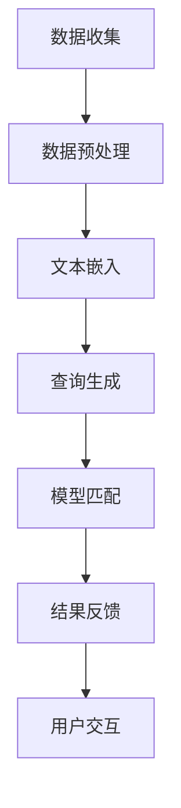

                 

关键词：自然语言处理、档案管理、大型语言模型、信息检索、人工智能、知识管理

摘要：随着信息技术的发展，档案管理逐渐成为各个行业关注的焦点。本文探讨了如何利用大型语言模型（LLM）来提升档案管理的智能化水平，特别是信息检索的效率。通过对LLM的工作原理、档案管理需求的分析，以及实际应用案例的分享，本文揭示了LLM在档案管理中的潜在价值，并对未来发展趋势进行了展望。

## 1. 背景介绍

档案管理是信息社会中不可或缺的一部分。随着数据量的急剧增长，档案管理的复杂性和难度也日益增加。传统的档案管理方法主要依赖于人工处理和简单的数据库查询，这不仅效率低下，而且容易出现错误。因此，寻找更高效、更准确的档案管理解决方案已成为当务之急。

近年来，人工智能（AI）技术的快速发展，特别是自然语言处理（NLP）领域的突破，为档案管理带来了新的机遇。大型语言模型（LLM），如GPT-3、BERT等，具有强大的语言理解能力和生成能力，能够处理大量文本数据，提供智能化检索和分类服务。

本文将探讨如何利用LLM来提升档案管理的智能化水平，特别是信息检索的效率。我们将分析LLM的工作原理，探讨其在档案管理中的应用场景，并分享实际案例，最后对未来的发展趋势进行展望。

## 2. 核心概念与联系

### 2.1. 大型语言模型（LLM）

大型语言模型（LLM）是一种基于深度学习的自然语言处理模型，通过训练大规模的文本数据，能够理解并生成自然语言。LLM的核心是神经网络，特别是Transformer架构，它能够捕获文本中的长距离依赖关系。

### 2.2. 档案管理

档案管理是指对文件、资料、信息等进行收集、整理、保存、检索和使用的过程。档案管理的核心目标是确保信息的准确、完整和可访问性。

### 2.3. 信息检索

信息检索是指从大量信息中快速、准确地查找所需信息的过程。信息检索的关键技术包括搜索引擎、关键词匹配、文本分类等。

### 2.4. Mermaid 流程图

以下是LLM在档案管理中信息检索的流程图：

## 3. 核心算法原理 & 具体操作步骤

### 3.1. 算法原理概述

LLM的工作原理主要包括数据预处理、文本嵌入、查询生成、模型匹配和结果反馈等步骤。下面将详细介绍每个步骤的具体实现。

### 3.2. 算法步骤详解

#### 3.2.1. 数据预处理

数据预处理是确保数据质量和可用的关键步骤。主要任务包括数据清洗、去重、分类和标注。

1. **数据清洗**：去除无效数据、重复数据和错误数据。
2. **去重**：去除重复的档案记录。
3. **分类**：根据档案的内容和属性进行分类。
4. **标注**：为每个档案记录添加标签，以便后续检索。

#### 3.2.2. 文本嵌入

文本嵌入是将文本转换为固定长度的向量表示。常用的文本嵌入方法包括Word2Vec、BERT和GPT-3。

1. **Word2Vec**：基于神经网络的方法，将每个单词映射为一个固定长度的向量。
2. **BERT**：基于Transformer架构，通过预训练和微调，将文本转换为高维的语义向量。
3. **GPT-3**：生成预训练的Transformer模型，能够生成高质量的文本。

#### 3.2.3. 查询生成

查询生成是根据用户输入的查询，生成对应的文本嵌入向量。常用的方法包括：

1. **关键词匹配**：将用户输入的关键词与档案记录进行匹配。
2. **文本生成**：使用LLM生成与用户查询相关的文本，然后将其嵌入。

#### 3.2.4. 模型匹配

模型匹配是将查询嵌入与档案嵌入进行相似度计算，找出最相关的档案记录。常用的方法包括：

1. **余弦相似度**：计算查询嵌入和档案嵌入的余弦相似度，找出最相似的档案记录。
2. **点积相似度**：计算查询嵌入和档案嵌入的点积，找出最相似的档案记录。

#### 3.2.5. 结果反馈

结果反馈是将匹配结果反馈给用户，并提供交互式检索界面，以便用户进一步筛选和查询。

### 3.3. 算法优缺点

#### 优点：

1. **高效性**：LLM能够快速处理大量文本数据，提供高效的检索服务。
2. **准确性**：通过预训练和微调，LLM能够捕捉文本中的语义信息，提高检索的准确性。
3. **灵活性**：LLM能够根据不同的应用场景进行定制，提供灵活的检索服务。

#### 缺点：

1. **计算资源消耗**：LLM需要大量的计算资源和存储空间，对硬件要求较高。
2. **数据隐私**：LLM在训练和推理过程中，可能涉及到用户隐私数据，需要严格保护。
3. **解释性不足**：LLM的决策过程较为复杂，难以解释。

### 3.4. 算法应用领域

LLM在档案管理中的应用非常广泛，包括但不限于以下领域：

1. **信息检索**：用于快速、准确地查找档案记录。
2. **智能问答**：用于回答用户关于档案的各种问题。
3. **文本分类**：用于对档案进行自动分类和标签。
4. **内容推荐**：用于根据用户兴趣推荐相关档案。

## 4. 数学模型和公式 & 详细讲解 & 举例说明

### 4.1. 数学模型构建

在LLM中，数学模型主要用于文本嵌入和模型匹配。以下是两个核心数学模型：

#### 文本嵌入

假设我们有一个词汇表V，其中包含了所有可能的单词。我们使用一个函数f来将单词w映射为一个向量v_w ∈ R^d，其中d是向量的维度。这个函数f可以是Word2Vec、BERT或GPT-3等。

#### 模型匹配

假设我们有一个查询q和一个档案a，它们的文本嵌入分别为q ∈ R^d和a ∈ R^d。我们使用一个函数sim来计算查询和档案之间的相似度。常用的相似度计算方法包括余弦相似度和点积相似度。

### 4.2. 公式推导过程

#### 文本嵌入

我们使用Word2Vec作为文本嵌入方法，其核心公式如下：

$$
v_w = \sum_{j=1}^{n} \alpha_j \cdot v_j
$$

其中，v_j是单词w的邻居单词的向量，α_j是单词w和邻居单词j之间的权重。权重可以通过负采样和梯度下降等算法进行优化。

#### 模型匹配

我们使用余弦相似度作为模型匹配方法，其核心公式如下：

$$
sim(q, a) = \frac{q \cdot a}{||q|| \cdot ||a||}
$$

其中，·表示点积，||·||表示向量的欧氏距离。

### 4.3. 案例分析与讲解

假设我们有一个词汇表V={“苹果”，“手机”，“华为”，“小米”，“购买”，“推荐”}，使用Word2Vec将单词映射为向量：

| 单词 | 向量 |
| --- | --- |
| 苹果 | [-0.2, 0.3, -0.1] |
| 手机 | [0.1, -0.2, 0.4] |
| 华为 | [-0.3, 0.1, 0.5] |
| 小米 | [0.2, -0.1, 0.3] |
| 购买 | [0.4, 0.2, -0.1] |
| 推荐

