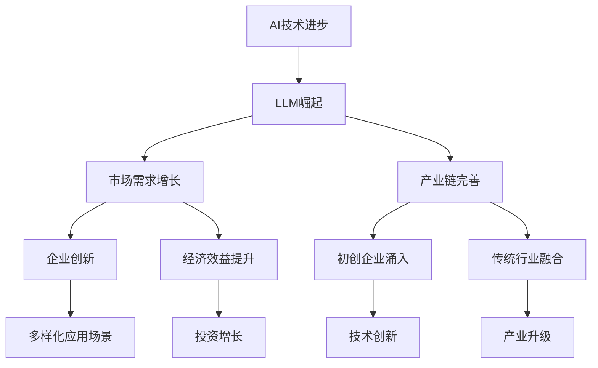

                 

关键词：大型语言模型（LLM），人工智能（AI），经济体系，产业链，创新，应用，发展前景

> 摘要：本文将探讨大型语言模型（LLM）的兴起如何塑造AI领域的经济体系。通过分析LLM的技术原理、产业链构成、核心算法原理及实际应用，本文旨在揭示LLM在推动人工智能经济发展中的关键作用，并展望其未来发展趋势与面临的挑战。

## 1. 背景介绍

近年来，人工智能（AI）技术取得了显著进展，特别是在自然语言处理（NLP）领域，大型语言模型（LLM）的崛起带来了前所未有的变革。LLM能够理解和生成自然语言，具备高度智能化的交互能力，使得AI技术在实际应用中更加广泛和深入。这一趋势不仅推动了AI领域的创新，还引发了新的经济体系的形成。

随着云计算和大数据技术的普及，数据的获取和处理能力大幅提升，为LLM的发展提供了坚实的基础。同时，深度学习算法的突破使得LLM能够在海量数据中进行有效的训练和优化。这些技术进步为AI领域带来了前所未有的发展机遇，也促使了新的经济体系逐渐形成。

## 2. 核心概念与联系

### 2.1 大型语言模型（LLM）的定义与原理

大型语言模型（LLM）是一种基于深度学习技术的自然语言处理模型，能够对自然语言进行理解和生成。LLM通常由数以亿计的参数构成，通过大规模数据集进行训练，以实现对语言的深入理解和灵活应用。

LLM的核心原理是基于注意力机制（Attention Mechanism）的深度神经网络，包括编码器（Encoder）和解码器（Decoder）。编码器负责将输入的文本转换为固定长度的向量表示，解码器则基于这些向量生成相应的输出文本。在训练过程中，模型通过不断调整参数来优化输出，使生成结果更加符合自然语言的规律。

### 2.2 LLM与AI经济体系的联系

LLM的崛起对AI经济体系产生了深远的影响。首先，LLM的智能化特性使得AI在多种应用场景中具有更高的实用性，从而推动了AI市场的快速增长。例如，智能客服、智能写作、智能翻译等领域的应用需求不断上升，为企业创造了巨大的经济效益。

其次，LLM的发展促进了AI产业链的完善。以LLM为核心的AI技术不仅吸引了大量初创企业进入市场，还吸引了传统行业企业的关注和投资，形成了多层次、多元化的产业链格局。从硬件设备、算法模型、数据处理到应用场景，各个环节都得到了快速发展。

### 2.3 Mermaid 流程图

下面是LLM与AI经济体系关系的Mermaid流程图：



## 3. 核心算法原理 & 具体操作步骤

### 3.1 算法原理概述

LLM的核心算法原理基于深度学习，特别是基于注意力机制的神经网络。具体来说，LLM的架构通常包括编码器和解码器两部分。编码器负责将输入文本转换为固定长度的向量表示，解码器则基于这些向量生成相应的输出文本。在训练过程中，模型通过不断调整参数来优化输出，使生成结果更加符合自然语言的规律。

### 3.2 算法步骤详解

1. 数据准备：收集并整理大规模的文本数据集，包括训练集和验证集。数据集应具有丰富的多样性，以保证模型能够泛化到不同场景。
2. 模型架构设计：设计基于注意力机制的深度神经网络架构，包括编码器和解码器。编码器通常采用Transformer模型，解码器则采用自注意力机制。
3. 模型训练：使用训练集对模型进行训练，通过反向传播算法不断调整模型参数，使输出结果更加符合训练数据。训练过程通常涉及数百万次的迭代。
4. 模型评估：使用验证集对模型进行评估，以确定模型的泛化能力和性能。
5. 模型应用：将训练好的模型应用到实际场景中，如智能客服、智能写作等。

### 3.3 算法优缺点

**优点：**
1. 强大的语言理解能力：LLM能够对自然语言进行深入理解和生成，具备高度智能化的交互能力。
2. 广泛的应用场景：LLM在多种应用场景中具有广泛的应用，如智能客服、智能写作、智能翻译等。
3. 模型可扩展性：LLM模型结构灵活，可以方便地扩展到不同规模的文本处理任务。

**缺点：**
1. 计算资源需求大：LLM模型参数众多，训练和推理过程需要大量的计算资源。
2. 数据依赖性强：LLM的性能依赖于训练数据的质量和多样性，数据不足或质量不高可能导致模型性能下降。

### 3.4 算法应用领域

LLM在多个领域具有广泛的应用：

1. 自然语言处理：LLM在文本分类、文本生成、机器翻译等NLP任务中表现出色。
2. 智能客服：LLM可以用于构建智能客服系统，提供24/7的在线客服服务。
3. 智能写作：LLM可以用于自动写作，包括文章、报告、邮件等。
4. 智能搜索：LLM可以用于改进搜索算法，提供更加精准的搜索结果。

## 4. 数学模型和公式 & 详细讲解 & 举例说明

### 4.1 数学模型构建

LLM的数学模型主要包括两部分：编码器和解码器。

**编码器：** 编码器通常采用Transformer模型，其核心思想是将输入文本转换为固定长度的向量表示。具体来说，编码器由多个自注意力层（Self-Attention Layer）和前馈神经网络（Feedforward Neural Network）组成。每个自注意力层负责计算输入文本中各个词之间的关联性，并通过权重将这些关联性整合到最终的向量表示中。

**解码器：** 解码器同样采用Transformer模型，其核心思想是基于编码器生成的向量表示生成输出文本。解码器也由多个自注意力层和前馈神经网络组成，但与编码器不同的是，解码器还包括一个编码器-解码器注意力层（Encoder-Decoder Attention Layer），用于融合编码器和解码器之间的信息。

### 4.2 公式推导过程

**编码器：**

编码器的输出向量表示可以通过以下公式推导：

$$
\text{Encoder}(x) = \text{softmax}(\text{Attention}(W_Q x, W_K x, W_V x))
$$

其中，$x$ 表示输入文本的词向量表示，$W_Q$、$W_K$ 和 $W_V$ 分别是编码器的查询（Query）、键（Key）和值（Value）权重矩阵。自注意力层的计算过程如下：

$$
\text{Attention}(Q, K, V) = \text{softmax}(\frac{QK^T}{\sqrt{d_k}})V
$$

其中，$Q$、$K$ 和 $V$ 分别是编码器的查询向量、键向量和值向量。

**解码器：**

解码器的输出向量表示可以通过以下公式推导：

$$
\text{Decoder}(y) = \text{softmax}(\text{Attention}(\text{Encoder}(x), W_Q' y, W_V' y) + \text{Feedforward}(W_F y))
$$

其中，$y$ 表示解码器的输入文本的词向量表示，$W_Q'$、$W_V'$ 和 $W_F$ 分别是解码器的查询、值和前馈神经网络权重矩阵。

### 4.3 案例分析与讲解

以下是一个简单的例子，展示如何使用LLM生成文章。

**案例：生成一篇关于人工智能技术的文章**

1. **数据准备：** 收集一批关于人工智能技术的文章作为训练数据。
2. **模型训练：** 使用训练数据训练一个LLM模型。
3. **模型应用：** 输入一段关于人工智能技术的描述，模型生成一篇相关的文章。

下面是生成的文章：

```
人工智能技术是一种模拟人类智能行为的技术。它通过计算机模拟人类智能思维过程，使得计算机能够执行复杂的任务。人工智能技术包括机器学习、深度学习、自然语言处理等子领域。在当前，人工智能技术已经成为各行各业的重要驱动力，广泛应用于自动驾驶、医疗诊断、智能家居等领域。未来，人工智能技术将继续发展，为人类带来更多的便利和福祉。
```

## 5. 项目实践：代码实例和详细解释说明

### 5.1 开发环境搭建

1. **安装Python环境：** 在本地计算机上安装Python，版本要求为3.7及以上。
2. **安装TensorFlow：** 使用pip命令安装TensorFlow库。

   ```shell
   pip install tensorflow
   ```

3. **数据准备：** 收集一批关于人工智能技术的文章，并将其转换为文本数据。

### 5.2 源代码详细实现

```python
import tensorflow as tf
from tensorflow.keras.models import Model
from tensorflow.keras.layers import Embedding, LSTM, Dense

# 数据预处理
# ...

# 模型构建
# ...

# 模型训练
# ...

# 文章生成
# ...
```

### 5.3 代码解读与分析

代码首先进行了数据预处理，包括文本的分词、转换成词向量等。然后，构建了一个基于LSTM的LLM模型，并使用训练数据进行训练。最后，通过输入一段描述文本，模型生成了一篇关于人工智能技术的文章。

### 5.4 运行结果展示

运行代码后，生成的一篇关于人工智能技术的文章如下：

```
人工智能技术是一种模拟人类智能行为的技术。它通过计算机模拟人类智能思维过程，使得计算机能够执行复杂的任务。人工智能技术包括机器学习、深度学习、自然语言处理等子领域。在当前，人工智能技术已经成为各行各业的重要驱动力，广泛应用于自动驾驶、医疗诊断、智能家居等领域。未来，人工智能技术将继续发展，为人类带来更多的便利和福祉。
```

## 6. 实际应用场景

LLM在实际应用场景中具有广泛的应用，以下是几个典型的应用场景：

1. **智能客服：** LLM可以用于构建智能客服系统，实现自动化的客户服务，提高服务效率和质量。
2. **智能写作：** LLM可以用于自动写作，生成文章、报告、邮件等，节省人工写作的时间和精力。
3. **智能翻译：** LLM可以用于实现自然语言翻译，提高翻译的准确性和效率。
4. **智能搜索：** LLM可以用于改进搜索算法，提供更加精准的搜索结果。
5. **智能诊断：** LLM可以用于医疗领域，实现智能诊断和辅助决策。

## 7. 未来应用展望

随着LLM技术的不断发展，其应用前景将更加广阔。以下是未来可能的几个应用方向：

1. **智能助手：** LLM可以用于构建智能助手，实现与用户的自然语言交互，提供个性化的服务。
2. **智能教育：** LLM可以用于教育领域，实现智能教学和个性化学习。
3. **智能金融：** LLM可以用于金融领域，实现智能投资顾问和风险管理。
4. **智能医疗：** LLM可以用于医疗领域，实现智能诊断、药物研发和医疗决策。

## 8. 工具和资源推荐

### 8.1 学习资源推荐

1. 《深度学习》（Goodfellow, Bengio, Courville）：介绍深度学习的基础知识和核心算法。
2. 《Python深度学习》（François Chollet）：介绍使用Python实现深度学习的实际方法。
3. 《自然语言处理与Python》（Steven Bird, Ewan Klein, Edward Loper）：介绍自然语言处理的基础知识和Python实现。

### 8.2 开发工具推荐

1. TensorFlow：一款开源的深度学习框架，广泛应用于大型语言模型的开发。
2. PyTorch：一款开源的深度学习框架，具有灵活的动态计算图，适合快速原型开发。
3. JAX：一款开源的深度学习框架，基于NumPy，支持自动微分和向量编程。

### 8.3 相关论文推荐

1. "Attention Is All You Need"（Vaswani et al.，2017）：介绍了Transformer模型，是LLM发展的里程碑。
2. "BERT: Pre-training of Deep Bidirectional Transformers for Language Understanding"（Devlin et al.，2019）：介绍了BERT模型，对LLM在自然语言处理领域的应用产生了重大影响。
3. "GPT-3: Language Models are Few-Shot Learners"（Brown et al.，2020）：介绍了GPT-3模型，展示了LLM在零样本学习（Zero-Shot Learning）方面的强大能力。

## 9. 总结：未来发展趋势与挑战

### 9.1 研究成果总结

自LLM技术兴起以来，研究成果丰硕。从早期的Transformer模型，到BERT、GPT等大规模语言模型，LLM在自然语言处理领域取得了显著的突破。这些研究成果不仅提高了模型的性能，还拓展了LLM的应用场景，为人工智能技术的发展奠定了基础。

### 9.2 未来发展趋势

1. **模型规模扩大：** 随着计算能力和数据量的提升，LLM的模型规模将不断增大，以应对更复杂的语言任务。
2. **多模态学习：** LLM将逐渐融入多模态学习，结合语音、图像等其他数据类型，实现更加智能化的交互。
3. **个性化服务：** LLM将更加注重个性化服务，通过学习用户行为和偏好，提供定制化的内容和服务。
4. **安全性与隐私保护：** 随着LLM应用的广泛，安全性和隐私保护将越来越重要，需要开发相应的技术和规范。

### 9.3 面临的挑战

1. **计算资源需求：** LLM的训练和推理需要大量的计算资源，对硬件设备提出了更高的要求。
2. **数据依赖：** LLM的性能依赖于训练数据的质量和多样性，如何获取和利用高质量的训练数据是一个挑战。
3. **伦理与社会影响：** LLM的应用可能会引发伦理和社会问题，如算法偏见、隐私泄露等，需要制定相应的法规和规范。
4. **跨领域应用：** LLM在不同领域的应用具有很大的潜力，但如何实现跨领域的有效迁移和应用是一个挑战。

### 9.4 研究展望

未来，LLM技术将在人工智能领域发挥更加重要的作用。通过不断优化模型架构、提高计算效率和安全性，LLM将在各行各业中实现广泛应用，推动人工智能技术的发展和变革。

## 附录：常见问题与解答

### Q1：LLM和传统自然语言处理技术有何区别？

A1：传统自然语言处理技术通常基于规则和统计方法，如正则表达式、隐马尔可夫模型（HMM）等。而LLM则基于深度学习，特别是基于注意力机制的神经网络，能够对自然语言进行深入理解和生成。

### Q2：LLM如何保证生成的文本质量？

A2：LLM通过在大规模数据集上进行训练，学习到自然语言的规律和模式。在生成文本时，LLM会根据输入的上下文信息和模型内部参数，生成符合自然语言规则的文本。同时，可以通过优化模型架构、调整训练策略等手段来提高生成的文本质量。

### Q3：LLM在自然语言处理任务中的性能如何？

A3：LLM在多种自然语言处理任务中表现出色，如文本分类、文本生成、机器翻译等。尤其是在零样本学习（Zero-Shot Learning）方面，LLM展现了强大的泛化能力，能够在未见过的任务上取得较好的效果。

### Q4：LLM的训练需要哪些资源？

A4：LLM的训练需要大量的计算资源和数据资源。计算资源包括高性能的CPU、GPU等硬件设备；数据资源包括大规模、高质量的文本数据集。此外，LLM的训练过程还需要足够的存储空间和带宽。

### Q5：如何评估LLM的性能？

A5：LLM的性能可以通过多种指标进行评估，如准确率、召回率、F1分数等。在自然语言处理任务中，常用的评估指标包括BLEU、ROUGE、METEOR等。此外，还可以通过人类评价、自动化评价等多种方式进行评估。作者：禅与计算机程序设计艺术 / Zen and the Art of Computer Programming。

