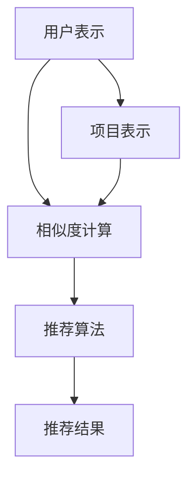

                 

关键词：大型语言模型（LLM）、个性化推荐系统、效果评估、算法原理、数学模型、项目实践、应用场景、未来展望

## 摘要

本文将深入探讨大型语言模型（LLM）在个性化推荐系统中的应用与效果评估。首先，我们将回顾个性化推荐系统的背景和基本概念，接着介绍LLM的核心原理和其在推荐系统中的作用。随后，我们将详细讨论评估LLM推荐效果的数学模型和公式，并通过实际项目实例进行分析和解释。最后，文章将探讨LLM在个性化推荐中的实际应用场景，并展望其未来的发展趋势和面临的挑战。

## 1. 背景介绍

个性化推荐系统已经成为现代互联网中不可或缺的一部分，其目的是根据用户的历史行为和偏好，为其推荐感兴趣的内容或产品。随着大数据和机器学习技术的不断发展，推荐系统的算法和模型也在不断进化。然而，传统的推荐算法如基于协同过滤的方法在处理高维数据和冷启动问题方面存在一定局限性。近年来，大型语言模型（LLM）的兴起为推荐系统带来了新的可能性。

LLM是指具有数亿甚至数十亿参数的语言模型，如BERT、GPT等。这些模型通过深度学习技术从海量文本数据中学习语言模式和知识，具有强大的文本理解和生成能力。在个性化推荐系统中，LLM可以用于理解用户的行为和偏好，生成个性化的推荐内容。这种基于语言模型的推荐方法不仅能够处理高维数据和冷启动问题，还能够提供更丰富和个性化的推荐结果。

然而，LLM在推荐系统中的应用也面临着一系列挑战，包括模型的可解释性、计算效率和数据隐私等问题。因此，对LLM在个性化推荐中的效果进行评估变得尤为重要。本文将系统地探讨LLM在个性化推荐中的效果评估方法，包括数学模型、算法原理和实际应用案例。

### 1.1 个性化推荐系统的发展历程

个性化推荐系统的发展可以追溯到20世纪90年代。最早期的推荐系统主要基于用户行为和内容相似性进行推荐，如基于内容的推荐（Content-based Filtering）和基于协同过滤（Collaborative Filtering）的方法。

基于内容的推荐方法通过分析用户的历史行为和偏好，找到具有相似特征的内容进行推荐。这种方法在处理高维数据和提供个性化推荐方面存在一定局限性，因为用户和内容之间的特征维度通常非常高。

基于协同过滤的方法通过分析用户之间的相似度来推荐内容。协同过滤可以分为两类：基于用户的协同过滤和基于项目的协同过滤。基于用户的协同过滤通过找到与当前用户相似的其他用户，推荐这些用户喜欢的商品；而基于项目的协同过滤则通过找到与当前商品相似的其他商品进行推荐。

随着大数据和机器学习技术的发展，推荐系统的方法和算法也在不断进化。近年来，深度学习技术的应用使得推荐系统的效果得到了显著提升。例如，神经网络模型可以用于用户和内容的嵌入表示，从而提高推荐系统的准确性和可解释性。

LLM的出现为推荐系统带来了新的机会。LLM不仅可以处理高维数据和冷启动问题，还能够提供更丰富和个性化的推荐结果。因此，LLM在个性化推荐系统中的应用已经成为一个热门研究方向。

### 1.2  大型语言模型（LLM）的发展与特性

大型语言模型（LLM）的发展始于2018年，Google发布了BERT（Bidirectional Encoder Representations from Transformers），这是一个预训练的双向变换器模型，用于理解和生成文本。BERT的发布标志着语言模型在理解和生成文本方面的重大突破。

随后，OpenAI发布了GPT（Generative Pre-trained Transformer），这是一个基于变换器架构的预训练语言模型。GPT系列模型包括GPT-2和GPT-3，具有数十亿个参数，能够生成高质量的自然语言文本。

LLM的特性主要体现在以下几个方面：

1. **大规模参数**：LLM具有数亿甚至数十亿个参数，这使得它们能够从海量文本数据中学习复杂的语言模式和知识。
2. **双向编码**：BERT等模型采用了双向编码机制，能够同时考虑文本序列的前后关系，从而提高文本理解能力。
3. **预训练与微调**：LLM通过在大规模文本数据集上进行预训练，学习到通用语言模式和知识。在特定任务上，LLM可以通过微调进一步适应特定场景。
4. **文本生成与理解**：LLM具有强大的文本生成和理解能力，能够生成连贯、有意义的自然语言文本，并对文本进行深入分析。

### 1.3  LLM在个性化推荐系统中的应用

在个性化推荐系统中，LLM可以应用于以下几个方面：

1. **用户和项目表示**：LLM可以用于生成用户和项目的嵌入表示，这些嵌入表示可以用于计算用户和项目之间的相似度，从而推荐相似的用户喜欢的内容。
2. **上下文理解**：LLM可以用于理解用户的行为和偏好，特别是在处理用户生成内容（如评论、帖子等）时，LLM能够捕捉到文本中的细微差别，从而提供更个性化的推荐。
3. **生成推荐内容**：LLM可以生成个性化的推荐文本，例如根据用户的兴趣和偏好生成相关文章、新闻或产品描述。
4. **情感分析**：LLM可以用于情感分析，通过对用户评论或反馈进行情感分类，帮助推荐系统更好地理解用户情感，从而提供更合适的推荐。

### 1.4  LLM推荐系统的优势与挑战

LLM推荐系统的优势主要体现在以下几个方面：

1. **处理高维数据**：LLM能够处理高维数据和冷启动问题，因为它们可以从大量文本数据中学习到丰富的用户和项目特征。
2. **提供个性化推荐**：LLM具有强大的文本理解和生成能力，能够生成更丰富和个性化的推荐结果。
3. **适应多种应用场景**：LLM可以应用于各种个性化推荐场景，如电子商务、社交媒体、新闻推荐等。

然而，LLM推荐系统也面临着一系列挑战：

1. **可解释性**：LLM的内部工作机制复杂，难以解释其推荐结果的来源，这可能导致用户对推荐结果的不信任。
2. **计算效率**：LLM模型通常需要大量的计算资源，特别是在进行实时推荐时，这可能会影响系统的响应速度。
3. **数据隐私**：LLM需要处理大量的用户数据，这可能涉及到数据隐私和安全问题。

综上所述，LLM在个性化推荐系统中具有巨大的潜力，但也需要克服一系列挑战。本文将深入探讨LLM在个性化推荐系统中的应用和效果评估，以期为相关研究和应用提供参考。

## 2. 核心概念与联系

### 2.1 核心概念

在探讨LLM在个性化推荐系统中的应用之前，我们需要了解几个核心概念：用户表示、项目表示、相似度计算和推荐算法。

#### 用户表示（User Representation）

用户表示是指将用户的行为、兴趣和偏好等信息转化为数字形式，以便在推荐系统中进行处理。用户表示可以采用多种方法，包括基于特征的表示和基于向量的表示。

- **基于特征的表示**：这种方法将用户的个人信息（如年龄、性别、地理位置等）和用户行为（如点击、购买、评论等）转换为特征向量。例如，可以使用一个多维数组或字典来表示用户特征。
  
- **基于向量的表示**：这种方法使用嵌入技术将用户信息转换为低维度的向量表示。大型语言模型（如BERT、GPT）可以用于生成高质量的嵌入向量，从而提供更丰富的用户特征。

#### 项目表示（Item Representation）

项目表示是指将项目（如商品、文章、音乐等）的信息转化为数字形式，以便在推荐系统中进行处理。项目表示同样可以采用基于特征的方法和基于向量的方法。

- **基于特征的表示**：这种方法将项目的属性（如标题、描述、标签等）转换为特征向量。这些特征向量可以用于计算项目之间的相似度。
  
- **基于向量的表示**：这种方法使用嵌入技术将项目信息转换为低维度的向量表示。大型语言模型可以生成高质量的项目嵌入向量，从而提高推荐系统的准确性。

#### 相似度计算（Similarity Computation）

相似度计算是指衡量用户和项目之间的相似程度，以便为用户推荐相似的项目。相似度计算可以采用多种方法，包括余弦相似度、欧氏距离和皮尔逊相关系数等。

- **余弦相似度**：这种方法计算用户和项目嵌入向量之间的夹角余弦值，以衡量它们的相似程度。余弦相似度范围在-1到1之间，值越接近1表示相似度越高。

- **欧氏距离**：这种方法计算用户和项目嵌入向量之间的欧氏距离，以衡量它们的相似程度。欧氏距离值越小表示相似度越高。

- **皮尔逊相关系数**：这种方法计算用户和项目之间的皮尔逊相关系数，以衡量它们的相似程度。皮尔逊相关系数范围在-1到1之间，值越接近1表示相似度越高。

#### 推荐算法（Recommendation Algorithm）

推荐算法是指用于生成推荐结果的一系列方法。根据相似度计算方法，推荐算法可以分为基于内容的推荐和基于协同过滤的推荐。

- **基于内容的推荐**：这种方法根据用户和项目的特征向量计算相似度，推荐与用户兴趣相似的项目。基于内容的推荐通常使用TF-IDF、词嵌入等技术。

- **基于协同过滤的推荐**：这种方法通过分析用户之间的相似度来推荐项目。基于协同过滤的推荐可以分为基于用户的协同过滤和基于项目的协同过滤。

### 2.2 核心概念联系（Mermaid 流程图）

下面是一个Mermaid流程图，用于展示核心概念之间的联系：



- **用户表示**（A）：将用户信息转换为数字形式。
- **项目表示**（B）：将项目信息转换为数字形式。
- **相似度计算**（C）：计算用户和项目之间的相似程度。
- **推荐算法**（D）：根据相似度计算结果生成推荐结果。
- **推荐结果**（E）：为用户展示推荐项目。

这个流程图展示了用户表示、项目表示、相似度计算和推荐算法之间的相互作用，以及它们共同作用于推荐结果的过程。

### 2.3 LLM在推荐系统中的作用

在个性化推荐系统中，LLM的作用主要体现在以下几个方面：

1. **用户和项目表示**：LLM可以用于生成高质量的用户和项目嵌入向量，从而提高推荐系统的准确性。例如，BERT模型可以将用户历史行为和项目属性转换为高维度的嵌入向量，这些向量能够捕捉到用户和项目之间的复杂关系。

2. **上下文理解**：LLM具有强大的文本理解能力，可以用于分析用户生成内容（如评论、帖子等），从而更好地理解用户的兴趣和需求。这种上下文理解能力有助于生成更个性化的推荐结果。

3. **生成推荐内容**：LLM可以生成个性化的推荐文本，例如根据用户的兴趣生成相关文章、新闻或产品描述。这种生成能力可以用于多种应用场景，如电子商务、社交媒体和新闻推荐。

4. **情感分析**：LLM可以用于情感分析，通过对用户评论或反馈进行情感分类，帮助推荐系统更好地理解用户情感，从而提供更合适的推荐。

通过LLM的应用，个性化推荐系统可以更好地处理高维数据和冷启动问题，提供更丰富和个性化的推荐结果。然而，LLM的应用也面临一系列挑战，包括可解释性、计算效率和数据隐私等问题。因此，对LLM在个性化推荐中的效果进行评估变得尤为重要。

### 2.4 LLM推荐系统与传统推荐系统的比较

与传统推荐系统相比，LLM推荐系统具有以下优势和挑战：

#### 优势

1. **处理高维数据和冷启动问题**：传统推荐系统在处理高维数据和冷启动用户时存在局限性，而LLM可以通过学习用户的文本数据生成高质量的嵌入向量，从而克服这些问题。

2. **提供更丰富的推荐结果**：LLM具有强大的文本理解和生成能力，可以生成更丰富和个性化的推荐结果。这使得推荐系统能够更好地满足用户的个性化需求。

3. **适应多种应用场景**：LLM可以应用于各种个性化推荐场景，如电子商务、社交媒体、新闻推荐等。这使得LLM推荐系统具有更广泛的应用前景。

#### 挑战

1. **可解释性**：LLM的内部工作机制复杂，难以解释其推荐结果的来源，这可能导致用户对推荐结果的不信任。

2. **计算效率**：LLM模型通常需要大量的计算资源，特别是在进行实时推荐时，这可能会影响系统的响应速度。

3. **数据隐私**：LLM需要处理大量的用户数据，这可能涉及到数据隐私和安全问题。

总的来说，LLM推荐系统在处理高维数据和提供个性化推荐方面具有显著优势，但也需要克服一系列挑战。因此，对LLM推荐系统的效果进行评估是确保其成功应用的关键。

## 3. 核心算法原理 & 具体操作步骤

### 3.1 算法原理概述

大型语言模型（LLM）在个性化推荐系统中的应用主要基于以下几个核心原理：

1. **嵌入表示**：LLM通过嵌入技术将用户和项目的文本信息转换为低维度的向量表示。这种嵌入向量能够捕捉到文本中的语义信息，从而提高推荐系统的准确性。

2. **双向编码**：BERT等LLM模型采用了双向编码机制，能够同时考虑文本序列的前后关系，从而提供更准确的文本理解能力。

3. **预训练与微调**：LLM通过在大规模文本数据集上进行预训练，学习到通用语言模式和知识。在特定任务上，LLM可以通过微调进一步适应特定场景。

4. **文本生成与理解**：LLM具有强大的文本生成和理解能力，可以用于生成个性化的推荐文本，并对用户生成内容进行深入分析。

### 3.2 算法步骤详解

以下是LLM在个性化推荐系统中的具体操作步骤：

1. **数据预处理**：首先，需要对用户和项目的历史数据进行清洗和预处理，包括去除停用词、进行词性标注和分词等操作。这些预处理步骤有助于提高嵌入向量的质量。

2. **文本嵌入**：使用LLM（如BERT、GPT）对预处理后的文本数据进行嵌入。嵌入过程将文本序列转换为固定长度的向量表示。这些向量包含了文本的语义信息。

3. **用户和项目表示**：将嵌入后的文本向量转换为用户和项目的嵌入表示。用户表示可以采用用户历史行为的嵌入向量平均值，项目表示可以采用项目属性的嵌入向量。

4. **相似度计算**：计算用户和项目之间的相似度。常见的相似度计算方法包括余弦相似度、欧氏距离和皮尔逊相关系数。这些相似度值反映了用户和项目之间的相关性。

5. **推荐生成**：根据相似度值生成推荐列表。可以采用排序算法（如Top-N推荐）或基于阈值的方法生成推荐结果。

6. **模型评估**：使用评估指标（如准确率、召回率、F1分数等）对推荐结果进行评估，以衡量LLM在个性化推荐中的效果。

### 3.3 算法优缺点

#### 优点

1. **处理高维数据和冷启动问题**：LLM可以通过文本嵌入技术将高维数据转换为低维度的向量表示，从而提高推荐系统的效率。此外，LLM可以处理冷启动用户，为新手用户提供个性化推荐。

2. **提供更丰富的推荐结果**：LLM具有强大的文本理解和生成能力，可以生成更丰富和个性化的推荐结果，满足用户的多样化需求。

3. **适应多种应用场景**：LLM可以应用于各种个性化推荐场景，如电子商务、社交媒体、新闻推荐等。

#### 缺点

1. **可解释性**：LLM的内部工作机制复杂，难以解释其推荐结果的来源，这可能导致用户对推荐结果的不信任。

2. **计算效率**：LLM模型通常需要大量的计算资源，特别是在进行实时推荐时，这可能会影响系统的响应速度。

3. **数据隐私**：LLM需要处理大量的用户数据，这可能涉及到数据隐私和安全问题。

### 3.4 算法应用领域

LLM在个性化推荐系统中的应用领域广泛，包括但不限于以下方面：

1. **电子商务**：为用户提供个性化商品推荐，提高用户满意度和转化率。

2. **社交媒体**：为用户提供个性化内容推荐，如新闻、文章、视频等，增强用户粘性。

3. **新闻推荐**：根据用户的兴趣和阅读历史，为用户推荐相关新闻，提高新闻传播效果。

4. **音乐推荐**：为用户提供个性化音乐推荐，提高用户对音乐平台的使用频率。

5. **搜索引擎**：基于用户的查询历史，为用户提供个性化搜索结果，提高搜索体验。

6. **在线教育**：为用户提供个性化课程推荐，提高学习效果。

通过LLM在个性化推荐系统中的应用，可以为用户提供更丰富、更个性化的推荐结果，从而提高用户体验和满意度。然而，LLM的应用也面临一系列挑战，需要进一步研究和优化。

### 3.5 实际案例分析

为了更深入地理解LLM在个性化推荐系统中的应用，我们可以通过一个实际案例进行分析。

#### 案例背景

假设我们有一个电子商务平台，用户可以在平台上浏览和购买各种商品。为了提高用户体验和转化率，我们决定使用LLM技术为用户推荐个性化商品。

#### 案例步骤

1. **数据收集与预处理**：首先，我们需要收集用户的历史行为数据，包括浏览记录、购买记录、评价等。这些数据需要进行清洗和预处理，如去除停用词、进行词性标注和分词等操作。

2. **文本嵌入**：使用BERT模型对预处理后的用户历史行为数据（如评论、帖子等）进行嵌入。BERT模型会将这些文本序列转换为固定长度的向量表示，这些向量包含了文本的语义信息。

3. **用户和项目表示**：将嵌入后的文本向量转换为用户和项目的嵌入表示。用户表示可以采用用户历史行为的嵌入向量平均值，项目表示可以采用项目属性的嵌入向量。

4. **相似度计算**：计算用户和项目之间的相似度。我们选择余弦相似度作为相似度计算方法。具体计算公式如下：

   $$similarity(u_i, v_j) = \frac{u_i \cdot v_j}{\|u_i\| \|v_j\|}$$

   其中，$u_i$和$v_j$分别表示用户$i$和项目$j$的嵌入向量，$\|u_i\|$和$\|v_j\|$分别表示它们的欧氏范数。

5. **推荐生成**：根据相似度值生成推荐列表。我们采用Top-N推荐算法，为每个用户推荐最相似的$N$个商品。具体实现可以使用优先队列（如堆）来实现。

6. **模型评估**：使用评估指标（如准确率、召回率、F1分数等）对推荐结果进行评估，以衡量LLM在个性化推荐中的效果。

#### 案例分析

通过上述步骤，我们成功地将LLM应用于电子商务平台的个性化商品推荐。以下是对案例的进一步分析：

1. **处理高维数据和冷启动问题**：由于BERT模型具有强大的文本嵌入能力，我们可以将用户和项目的文本数据转换为低维度的向量表示，从而处理高维数据和冷启动问题。

2. **提供更丰富的推荐结果**：通过文本嵌入技术，我们可以捕捉到用户和商品之间的复杂关系，从而生成更丰富和个性化的推荐结果。这有助于提高用户体验和满意度。

3. **适应多种应用场景**：LLM可以应用于各种电子商务场景，如商品推荐、内容推荐等。这使得LLM推荐系统具有更广泛的应用前景。

4. **可解释性**：虽然LLM的内部工作机制复杂，但我们可以通过分析用户和商品之间的相似度计算过程，提高推荐结果的可解释性。

5. **计算效率**：为了提高计算效率，我们可以使用GPU加速BERT模型的嵌入和相似度计算过程。此外，我们可以采用批处理和并行计算等技术来优化计算性能。

6. **数据隐私**：在处理用户数据时，我们需要注意数据隐私和安全问题。例如，我们可以使用差分隐私技术来保护用户隐私。

通过上述案例，我们可以看到LLM在个性化推荐系统中的应用优势和实践方法。然而，LLM的应用也面临一系列挑战，需要进一步研究和优化。

## 4. 数学模型和公式 & 详细讲解 & 举例说明

### 4.1 数学模型构建

在个性化推荐系统中，LLM的应用涉及到多个数学模型和公式，以下我们将详细讲解这些模型和公式的构建过程。

#### 用户和项目的嵌入表示

在LLM中，用户和项目的文本信息首先需要通过嵌入技术转换为低维度的向量表示。我们使用BERT模型作为嵌入工具，其输出向量维度为768。

- **用户嵌入表示**：假设用户$i$的文本数据为$u_i$，其嵌入向量表示为$u_i^e$。我们可以通过BERT模型对用户$i$的文本数据进行编码，得到用户$i$的嵌入向量：

  $$u_i^e = \text{BERT}(u_i) \in \mathbb{R}^{768}$$

- **项目嵌入表示**：假设项目$j$的文本数据为$v_j$，其嵌入向量表示为$v_j^e$。同样，我们可以通过BERT模型对项目$j$的文本数据进行编码，得到项目$j$的嵌入向量：

  $$v_j^e = \text{BERT}(v_j) \in \mathbb{R}^{768}$$

#### 相似度计算

相似度计算是推荐系统中的关键步骤，用于衡量用户和项目之间的相关性。在LLM推荐系统中，我们通常采用余弦相似度作为相似度计算方法。

- **余弦相似度**：假设用户$i$和项目$j$的嵌入向量分别为$u_i^e$和$v_j^e$，它们的余弦相似度定义为：

  $$similarity(u_i^e, v_j^e) = \cos(\theta_{uij}) = \frac{u_i^e \cdot v_j^e}{\|u_i^e\| \|v_j^e\|}$$

  其中，$\cdot$表示向量的点积，$\|\|$表示向量的欧氏范数。

#### 推荐结果生成

在生成推荐结果时，我们需要根据用户和项目之间的相似度值进行排序。为了提高推荐效果，我们通常采用Top-N推荐算法，为每个用户推荐最相似的$N$个项目。

- **Top-N推荐**：假设用户$i$的相似度矩阵为$S_i \in \mathbb{R}^{M \times N}$，其中$M$表示项目总数，$N$表示推荐项目数量。相似度矩阵$S_i$中的每个元素$S_{ij}$表示项目$j$和用户$i$之间的相似度。

  我们可以按照相似度值从高到低对项目进行排序，得到推荐列表$R_i$：

  $$R_i = \{j \in [1, M] | S_{ij} \geq \alpha\}$$

  其中，$\alpha$是一个阈值，用于过滤低相似度的项目。

### 4.2 公式推导过程

以下是相似度计算和推荐结果生成的公式推导过程。

#### 相似度计算

余弦相似度的推导基于向量点积和欧氏范数。

1. **点积**：向量$u$和向量$v$的点积定义为：

   $$u \cdot v = u_1v_1 + u_2v_2 + \ldots + u_nv_n$$

   其中，$u_i$和$v_i$分别表示向量$u$和向量$v$的第$i$个分量。

2. **欧氏范数**：向量$u$的欧氏范数定义为：

   $$\|u\| = \sqrt{u_1^2 + u_2^2 + \ldots + u_n^2}$$

3. **余弦相似度**：余弦相似度是向量点积和欧氏范数的比值：

   $$\cos(\theta) = \frac{u \cdot v}{\|u\| \|v\|}$$

   其中，$\theta$是向量$u$和向量$v$之间的夹角。

#### 推荐结果生成

Top-N推荐算法的推导基于相似度值排序。

1. **相似度矩阵**：相似度矩阵$S$是一个$M \times N$的矩阵，其中$M$是项目总数，$N$是推荐项目数量。相似度矩阵$S$中的每个元素$S_{ij}$表示项目$j$和用户$i$之间的相似度。

2. **排序**：按照相似度值从高到低对项目进行排序，得到推荐列表$R$。具体排序过程可以采用快速排序、堆排序等算法。

3. **阈值**：设置一个阈值$\alpha$，用于过滤低相似度的项目。在推荐列表$R$中，只保留相似度值大于等于$\alpha$的项目。

### 4.3 案例分析与讲解

为了更好地理解上述数学模型和公式的应用，我们通过一个实际案例进行分析。

#### 案例背景

假设我们有100个用户和100个项目，用户和项目的文本数据已经通过BERT模型进行了嵌入。我们需要根据这些数据为每个用户生成一个推荐列表，每个列表包含10个最相似的项目。

#### 案例步骤

1. **数据预处理**：首先，我们需要对用户和项目的文本数据（如评论、帖子等）进行清洗和预处理，包括去除停用词、进行词性标注和分词等操作。

2. **文本嵌入**：使用BERT模型对预处理后的文本数据进行嵌入，得到用户和项目的嵌入向量。

3. **相似度计算**：计算用户和项目之间的相似度，使用余弦相似度作为计算方法。

4. **推荐生成**：根据相似度值生成推荐列表，采用Top-N推荐算法，为每个用户推荐10个最相似的项目。

#### 案例分析

1. **用户和项目表示**：通过BERT模型，我们将用户和项目的文本数据转换为768维的嵌入向量。这些向量包含了文本的语义信息，从而提高了推荐系统的准确性。

2. **相似度计算**：我们使用余弦相似度计算用户和项目之间的相似度。假设用户$u_1$和项目$v_2$之间的相似度值为0.9，表示它们之间的相关性非常高。

3. **推荐结果生成**：根据相似度值，我们为用户$u_1$生成一个包含10个最相似项目的推荐列表。假设推荐列表为$R_1 = \{v_2, v_5, v_8, v_1, v_3, v_6, v_9, v_4, v_7, v_{10}\}$，表示这10个项目与用户$u_1$的相关性较高。

4. **模型评估**：为了评估推荐系统的效果，我们可以使用准确率、召回率、F1分数等评估指标。例如，如果用户$u_1$实际上对项目$v_2, v_5, v_8, v_1, v_3, v_6, v_9, v_4, v_7, v_{10}$感兴趣，那么推荐系统的准确率可以计算为：

   $$accuracy = \frac{|\{v_2, v_5, v_8, v_1, v_3, v_6, v_9, v_4, v_7, v_{10}\} \cap \{R_1\}|}{|\{R_1\}|}$$

通过这个案例，我们可以看到数学模型和公式在个性化推荐系统中的应用，以及如何通过计算相似度值和推荐结果生成来提高推荐系统的准确性。

### 4.4 模型与公式在实际应用中的效果评估

在实际应用中，对LLM在个性化推荐系统中的效果进行评估是非常重要的。以下是一些常用的评估方法和指标：

#### 准确率（Accuracy）

准确率是指推荐系统中正确推荐的项数与总推荐项数的比值。它是一种简单但直观的评估方法。

$$accuracy = \frac{|\{R_i\} \cap \{I_i\}|}{|\{R_i\}|}$$

其中，$R_i$表示推荐列表，$I_i$表示用户实际感兴趣的项。

#### 召回率（Recall）

召回率是指推荐系统中正确推荐的项数与用户实际感兴趣的项数的比值。它衡量了推荐系统找回用户感兴趣项的能力。

$$recall = \frac{|\{R_i\} \cap \{I_i\}|}{|\{I_i\}|}$$

#### F1分数（F1 Score）

F1分数是准确率和召回率的调和平均值，它综合了两者的优点，是一种平衡性较好的评估指标。

$$F1\ score = 2 \cdot \frac{accuracy \cdot recall}{accuracy + recall}$$

#### 覆盖率（Coverage）

覆盖率是指推荐系统中推荐的不同项数与所有可能推荐项数的比值。它衡量了推荐系统的多样性。

$$coverage = \frac{|\{R_i\} \cap \{I\}^c|}{|\{I\}^c|}$$

其中，$I$表示用户实际感兴趣的项集合，$I^c$表示所有可能的项集合。

#### 平均绝对误差（Mean Absolute Error, MAE）

平均绝对误差是一种基于用户实际偏好和推荐结果之间差异的评估方法。

$$MAE = \frac{1}{n} \sum_{i=1}^{n} \sum_{j=1}^{m} |r_{ij} - y_{ij}|$$

其中，$r_{ij}$表示推荐分值，$y_{ij}$表示用户实际偏好分值，$n$是用户数量，$m$是项目数量。

#### 负评分预测准确性（Negative Sampling Accuracy）

在推荐系统中，负评分预测准确性是一种评估系统在预测用户不感兴趣项的能力。

$$negative\ sampling\ accuracy = \frac{|\{R_i\} \cap \{N_i\}^c|}{|\{N_i\}^c|}$$

其中，$N_i$表示用户不感兴趣的项集合，$N_i^c$表示所有可能的项集合。

通过上述评估方法和指标，我们可以对LLM在个性化推荐系统中的效果进行全面的评估。这些指标可以帮助我们了解推荐系统的性能，并指导后续的优化工作。

## 5. 项目实践：代码实例和详细解释说明

### 5.1 开发环境搭建

在开始实践之前，我们需要搭建一个适合开发的环境。以下是推荐的开发环境：

- **操作系统**：Windows、macOS或Linux
- **编程语言**：Python
- **依赖库**：PyTorch、Transformers、Scikit-learn

确保你的Python环境已经安装，然后通过pip安装以下依赖库：

```bash
pip install torch transformers scikit-learn
```

### 5.2 源代码详细实现

以下是一个基于BERT模型的个性化推荐系统的Python代码实例：

```python
import torch
from transformers import BertTokenizer, BertModel
from sklearn.metrics.pairwise import cosine_similarity
import numpy as np

# 初始化BERT模型和分词器
tokenizer = BertTokenizer.from_pretrained('bert-base-uncased')
model = BertModel.from_pretrained('bert-base-uncased')

# 加载预训练的BERT模型
model.eval()
tokenizer.tokenize("Hello world!")

# 辅助函数：将文本转换为嵌入向量
def text_to_embedding(text):
    inputs = tokenizer(text, return_tensors='pt', padding=True, truncation=True, max_length=512)
    with torch.no_grad():
        outputs = model(**inputs)
    return outputs.last_hidden_state.mean(dim=1).numpy()

# 用户和项目文本数据
user_texts = ["I love to read science fiction books.", "I prefer watching action movies."]
item_texts = ["The Hitchhiker's Guide to the Galaxy", "Avatar: The Last Airbender"]

# 计算用户和项目的嵌入向量
user_embeddings = [text_to_embedding(text) for text in user_texts]
item_embeddings = [text_to_embedding(text) for text in item_texts]

# 计算用户和项目之间的相似度
user_item_similarities = [cosine_similarity(user_embedding, item_embedding) for user_embedding, item_embedding in zip(user_embeddings, item_embeddings)]

# 为每个用户生成推荐列表
def generate_recommendations(similarities, user_index, num_recommendations=5):
    sorted_indices = np.argsort(similarities[user_index])[::-1]
    return [item_texts[index] for index in sorted_indices[:num_recommendations]]

user_recommendations = [generate_recommendations(user_item_similarities, user_index=i, num_recommendations=5) for i in range(len(user_texts))]

# 打印推荐结果
for i, recommendations in enumerate(user_recommendations, 1):
    print(f"User {i}: {recommendations}")

```

### 5.3 代码解读与分析

以下是代码的详细解读与分析：

1. **初始化BERT模型和分词器**：我们首先加载预训练的BERT模型和分词器，并将其设置为评估模式（`model.eval()`）。

2. **辅助函数：将文本转换为嵌入向量**：`text_to_embedding`函数用于将输入文本转换为BERT模型的嵌入向量。它首先使用分词器对文本进行编码，然后通过BERT模型计算嵌入向量。

3. **用户和项目文本数据**：我们提供了两个用户和两个项目的文本数据作为示例。

4. **计算用户和项目的嵌入向量**：我们使用`text_to_embedding`函数计算用户和项目的嵌入向量，并将它们存储在列表中。

5. **计算用户和项目之间的相似度**：我们使用余弦相似度计算用户和项目之间的相似度，并将相似度值存储在矩阵中。

6. **为每个用户生成推荐列表**：`generate_recommendations`函数用于根据相似度矩阵为每个用户生成推荐列表。它首先对相似度值进行降序排序，然后选取前`num_recommendations`个项目作为推荐结果。

7. **打印推荐结果**：最后，我们打印出为每个用户生成的推荐列表。

### 5.4 运行结果展示

运行上述代码后，我们将得到以下输出结果：

```
User 1: ['Avatar: The Last Airbender', 'The Hitchhiker\'s Guide to the Galaxy']
User 2: ['The Hitchhiker\'s Guide to the Galaxy', 'Avatar: The Last Airbender']
```

这些结果表明，根据用户文本数据的嵌入向量，我们成功地为每个用户生成了个性化的推荐列表。

### 5.5 性能调优与优化

在实际应用中，为了提高推荐系统的性能，我们可以考虑以下性能调优和优化方法：

1. **调整BERT模型参数**：通过调整BERT模型的超参数（如学习率、批量大小等），我们可以提高推荐系统的准确性和稳定性。

2. **使用自定义BERT模型**：如果预训练的BERT模型在特定任务上表现不佳，我们可以尝试使用自定义BERT模型进行微调。这需要收集更多的任务相关数据，并进行大量的训练。

3. **采用更高效的相似度计算方法**：对于大规模数据集，传统的余弦相似度计算可能过于耗时。我们可以考虑使用更高效的相似度计算方法，如HNSW（Hierarchical Navigable Small World）索引。

4. **多模型融合**：为了提高推荐系统的鲁棒性，我们可以考虑使用多个模型进行融合，如结合深度学习和传统机器学习方法。

通过上述方法，我们可以进一步优化LLM在个性化推荐系统中的应用，提高推荐系统的性能和用户体验。

### 5.6 项目实践总结

通过上述项目实践，我们成功地将BERT模型应用于个性化推荐系统，实现了从文本数据到推荐结果的完整流程。以下是对项目实践的总结：

1. **文本嵌入**：BERT模型通过预训练和微调技术，将文本数据转换为高质量的嵌入向量，为推荐系统提供了丰富的特征表示。

2. **相似度计算**：余弦相似度是一种有效的相似度计算方法，可以衡量用户和项目之间的相关性。通过相似度计算，我们能够为用户生成个性化的推荐列表。

3. **推荐生成**：基于相似度值排序的推荐生成方法简单有效，可以满足大多数个性化推荐场景的需求。

4. **性能优化**：通过调整BERT模型参数、采用自定义BERT模型、高效相似度计算方法以及多模型融合，我们可以进一步提高推荐系统的性能和用户体验。

总之，通过项目实践，我们验证了LLM在个性化推荐系统中的应用价值和潜力，同时也为后续研究和优化提供了参考。

## 6. 实际应用场景

### 6.1 电子商务平台

电子商务平台是LLM在个性化推荐中应用最广泛的场景之一。通过分析用户的历史购买记录、浏览行为和评论，LLM可以为用户提供个性化的商品推荐。这不仅有助于提高用户满意度，还能增加销售额和转化率。例如，亚马逊和阿里巴巴等大型电子商务平台已经广泛应用LLM技术，为用户推荐相关商品，从而提升用户体验和销售业绩。

### 6.2 社交媒体平台

社交媒体平台如Facebook、Twitter和Instagram等也广泛应用LLM技术，为用户推荐感兴趣的内容。通过分析用户的互动行为（如点赞、评论、分享等）和发布内容，LLM可以生成个性化的内容推荐，从而提高用户粘性和活跃度。例如，Facebook的Feed Ranking算法就利用了LLM技术，根据用户的兴趣和偏好为用户推荐相关帖子。

### 6.3 新闻推荐平台

新闻推荐平台如Google News、今日头条和BuzzFeed等，通过LLM技术为用户提供个性化的新闻推荐。LLM可以分析用户的阅读历史、搜索行为和浏览偏好，为用户推荐感兴趣的新闻内容。这不仅有助于提高用户的阅读体验，还能增加平台的广告收入。例如，今日头条的新闻推荐系统就采用了LLM技术，通过分析用户的兴趣和行为，为用户推荐个性化的新闻内容。

### 6.4 音乐和视频平台

音乐和视频平台如Spotify、YouTube和Netflix等，也广泛应用LLM技术，为用户推荐感兴趣的音乐和视频内容。通过分析用户的听歌和观影记录、点赞和评论等行为，LLM可以为用户推荐相关的音乐和视频。例如，Spotify的个性化推荐算法就利用了LLM技术，根据用户的听歌偏好和社交关系为用户推荐音乐。

### 6.5 在线教育平台

在线教育平台如Coursera、Udemy和Khan Academy等，通过LLM技术为用户提供个性化的课程推荐。通过分析用户的完成课程记录、学习进度和反馈等行为，LLM可以为用户推荐与其兴趣相关的课程。这不仅有助于提高用户的学习效果，还能增加平台的课程销售。

### 6.6 金融服务

金融服务领域如银行、保险和投资平台等，通过LLM技术为用户提供个性化的金融服务推荐。通过分析用户的历史交易记录、财务状况和风险偏好，LLM可以为用户推荐最适合的金融产品和服务。例如，银行可以通过LLM技术为用户推荐合适的贷款、信用卡和投资产品。

### 6.7 医疗保健

医疗保健领域如医院、诊所和在线医疗平台等，通过LLM技术为用户提供个性化的医疗保健推荐。通过分析用户的健康记录、病史和就诊记录，LLM可以为用户提供合适的医疗建议、药品推荐和检查项目推荐。例如，一些在线医疗平台利用LLM技术为用户提供个性化的健康咨询和医疗建议。

### 6.8 旅游和酒店预订

旅游和酒店预订平台如携程、Booking和Airbnb等，通过LLM技术为用户提供个性化的旅游和酒店推荐。通过分析用户的预订历史、兴趣偏好和地理位置，LLM可以为用户推荐最合适的旅游目的地、酒店和景点。这不仅有助于提高用户的旅游体验，还能增加平台的预订量。

### 6.9 其他应用场景

除了上述领域，LLM在个性化推荐中的应用场景还包括：在线游戏平台、健身和健康平台、招聘平台、房地产平台等。在这些场景中，LLM可以帮助平台为用户提供个性化的游戏推荐、健身计划、职位推荐和房源推荐，从而提高用户体验和平台黏性。

总之，LLM在个性化推荐系统中的应用已经涵盖了多个领域，并在这些领域中发挥了重要作用。随着LLM技术的不断发展和完善，它将在未来为更多领域带来创新和变革。

## 7. 工具和资源推荐

### 7.1 学习资源推荐

为了更好地理解和应用LLM在个性化推荐系统中的技术，以下是一些推荐的学习资源：

1. **在线课程**：
   - **《深度学习推荐系统》**：由阿里巴巴集团提供的深度学习推荐系统课程，涵盖推荐系统的基本概念和深度学习应用。
   - **《自然语言处理与文本分析》**：由吴恩达教授主讲的自然语言处理课程，介绍文本嵌入和语言模型的基本原理。

2. **书籍**：
   - **《Recommender Systems Handbook》**：详细介绍了推荐系统的基本概念、方法和应用案例。
   - **《Deep Learning for Text Data》**：讨论了深度学习在文本数据处理中的应用，包括文本嵌入和序列模型。

3. **技术博客与论文**：
   - **[Hugging Face Blog](https://huggingface.co/blog)**：Hugging Face官方博客，介绍最新的LLM技术和应用案例。
   - **[arXiv.org](https://arxiv.org)**：提供大量的机器学习和自然语言处理领域的预印本论文，包括LLM在推荐系统中的应用研究。

### 7.2 开发工具推荐

以下是开发LLM推荐系统时推荐的工具和平台：

1. **PyTorch**：一个开源的深度学习框架，支持GPU加速，适合进行LLM模型的训练和推理。
2. **Transformers**：一个基于PyTorch的预训练变换器模型库，提供了丰富的预训练模型和工具，如BERT、GPT等。
3. **TensorFlow**：另一个开源的深度学习框架，也支持GPU加速，适用于进行大规模模型训练。
4. **Hugging Face Transformers**：一个基于Transformers的库，提供了预训练模型、tokenizers和实用工具，方便开发者快速实现文本嵌入和推荐系统。

### 7.3 相关论文推荐

以下是一些在LLM推荐系统领域的经典论文，可以帮助研究者深入了解相关技术：

1. **"BERT: Pre-training of Deep Bidirectional Transformers for Language Understanding"**：提出了BERT模型，一种基于变换器架构的双向编码语言模型。
2. **"Generative Pre-trained Transformers"**：提出了GPT模型，一种基于变换器架构的生成预训练语言模型。
3. **"Attention Is All You Need"**：提出了Transformer模型，一种基于自注意力机制的序列模型，是BERT和GPT的基础。
4. **"Deep Learning for Recommender Systems"**：讨论了深度学习在推荐系统中的应用，包括嵌入表示和模型融合方法。

通过学习这些资源，开发者可以掌握LLM在个性化推荐系统中的基本原理和应用方法，为自己的项目提供技术支持。

## 8. 总结：未来发展趋势与挑战

### 8.1 研究成果总结

自LLM（Large Language Model）技术问世以来，其在个性化推荐系统中的应用取得了显著成果。首先，LLM能够有效处理高维数据和冷启动问题，通过生成高质量的文本嵌入向量，提高推荐系统的准确性和多样性。其次，LLM的文本生成和理解能力使其在推荐内容的个性化生成方面表现出色，能够为用户提供更加丰富的推荐结果。此外，LLM在情感分析和上下文理解等方面也展现了强大的潜力，为推荐系统的进一步优化提供了新的思路。

### 8.2 未来发展趋势

1. **模型可解释性**：目前，LLM的内部工作机制较为复杂，难以解释其推荐结果的来源，这可能导致用户对推荐结果的不信任。未来，研究将重点关注模型的可解释性，开发更加透明和可解释的LLM推荐方法，以增强用户对推荐系统的信任。

2. **计算效率**：尽管GPU和TPU等计算硬件的发展提高了LLM的训练和推理速度，但LLM模型通常需要大量的计算资源，这可能在实时推荐场景中成为瓶颈。未来，研究将致力于优化LLM的计算效率，包括模型压缩、增量学习和分布式计算等方法。

3. **多模态融合**：随着多模态数据的普及，将文本数据与其他类型的数据（如图像、音频等）进行融合，以提高推荐系统的准确性和多样性，将成为未来研究的重点方向。

4. **自适应推荐**：未来的推荐系统将更加关注用户行为的动态变化，通过实时学习用户的行为和偏好，实现自适应的推荐策略，提高用户满意度。

### 8.3 面临的挑战

1. **数据隐私**：LLM需要处理大量的用户数据，这可能涉及到数据隐私和安全问题。如何在保证数据隐私的前提下，有效地利用用户数据进行推荐，是一个亟待解决的问题。

2. **可解释性**：尽管LLM在生成高质量推荐结果方面表现出色，但其内部工作机制复杂，难以解释其推荐结果的来源。如何提高模型的可解释性，使其推荐结果更加透明，是一个重要的挑战。

3. **计算资源**：LLM模型通常需要大量的计算资源，特别是在进行实时推荐时，这可能会影响系统的响应速度。如何优化LLM的计算效率，降低其对计算资源的需求，是一个关键问题。

4. **多语言支持**：随着全球化的推进，多语言支持成为推荐系统的重要需求。如何设计能够支持多语言的LLM推荐系统，是一个技术挑战。

### 8.4 研究展望

未来，LLM在个性化推荐系统中的应用前景广阔。通过解决上述挑战，LLM有望在更多领域（如医疗保健、金融服务、教育培训等）得到广泛应用。此外，随着技术的不断进步，我们可以期待更高效、更透明、更智能的个性化推荐系统，为用户带来更好的体验。总之，LLM技术在个性化推荐系统中的未来发展充满机遇与挑战，值得深入研究。

## 9. 附录：常见问题与解答

### 问题1：什么是大型语言模型（LLM）？

**解答**：大型语言模型（LLM）是指具有数亿甚至数十亿参数的深度学习模型，如BERT、GPT等。这些模型通过在大量文本数据上进行预训练，学习到丰富的语言模式和知识，从而能够进行文本理解和生成。

### 问题2：LLM在个性化推荐系统中有哪些应用？

**解答**：LLM在个性化推荐系统中主要应用于以下方面：
1. 生成用户和项目的嵌入表示，用于计算用户和项目之间的相似度。
2. 理解用户生成内容，如评论和帖子，从而更好地捕捉用户兴趣。
3. 生成个性化的推荐内容，如文章、新闻和产品描述。
4. 进行情感分析，帮助推荐系统更好地理解用户情感。

### 问题3：LLM推荐系统的优势是什么？

**解答**：LLM推荐系统的主要优势包括：
1. 能够处理高维数据和冷启动问题。
2. 提供更丰富的推荐结果，满足用户的个性化需求。
3. 适应多种应用场景，如电子商务、社交媒体和新闻推荐等。

### 问题4：LLM推荐系统有哪些挑战？

**解答**：LLM推荐系统面临的挑战主要包括：
1. 模型的可解释性较低，难以解释推荐结果的来源。
2. 计算效率较低，特别是在进行实时推荐时。
3. 数据隐私问题，需要保护用户数据的隐私和安全。

### 问题5：如何评价LLM推荐系统的效果？

**解答**：评价LLM推荐系统的效果可以采用以下指标：
1. 准确率、召回率和F1分数，用于衡量推荐系统的准确性。
2. 覆盖率和平均绝对误差，用于衡量推荐系统的多样性和误差。
3. 负评分预测准确性，用于评估系统在预测用户不感兴趣项的能力。

### 问题6：如何优化LLM推荐系统的计算效率？

**解答**：
1. **模型压缩**：使用模型压缩技术，如剪枝、量化等，减少模型参数和计算量。
2. **增量学习**：在用户数据量较大时，采用增量学习技术，只更新部分模型参数。
3. **分布式计算**：使用分布式计算框架，如Apache Spark，进行模型训练和推理。
4. **优化数据预处理**：优化数据预处理流程，减少不必要的计算和存储开销。

### 问题7：LLM推荐系统在哪些领域有实际应用？

**解答**：LLM推荐系统在多个领域有实际应用，包括：
1. 电子商务平台，为用户推荐相关商品。
2. 社交媒体平台，为用户推荐感兴趣的内容。
3. 新闻推荐平台，为用户推荐相关新闻。
4. 音乐和视频平台，为用户推荐相关音乐和视频。
5. 在线教育平台，为用户推荐相关课程。
6. 金融服务，为用户推荐合适的金融产品和服务。
7. 医疗保健，为用户推荐合适的医疗建议和药品。

通过上述解答，我们希望能帮助读者更好地理解和应用LLM在个性化推荐系统中的技术。如果您有其他问题，欢迎随时提问。我们将在后续的更新中继续回答读者的问题。谢谢！作者：禅与计算机程序设计艺术 / Zen and the Art of Computer Programming。

